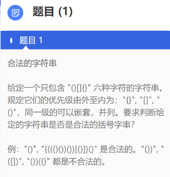
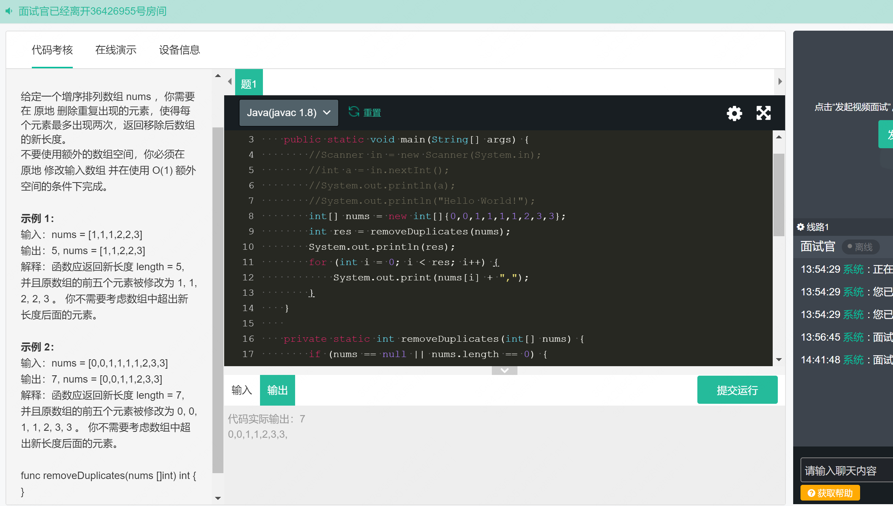
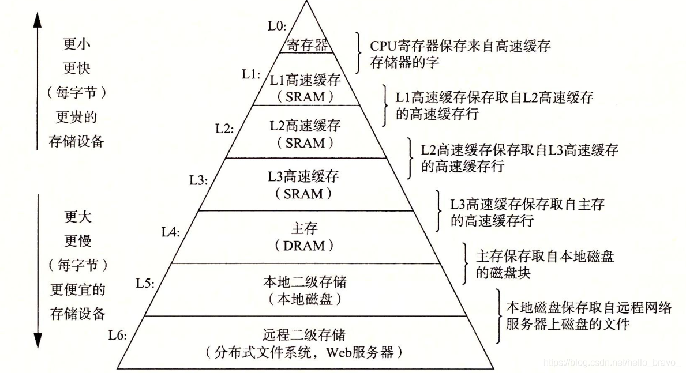
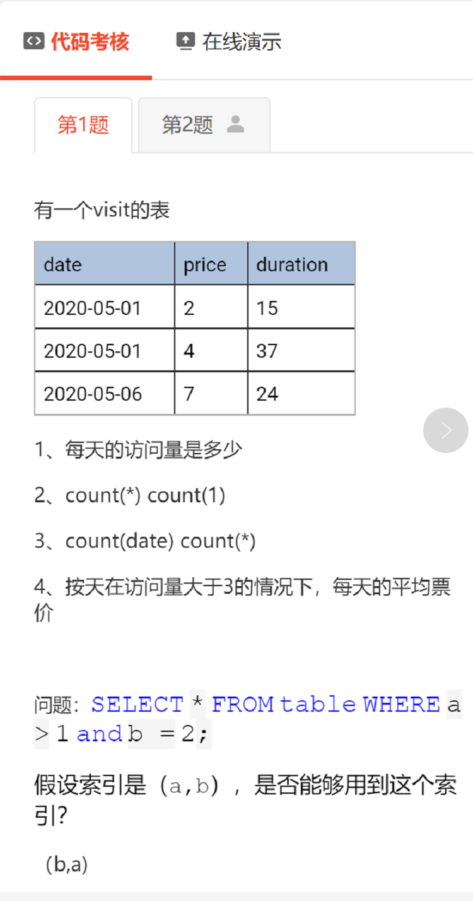

# 面试技巧和个人面试记录

<!-- GFM-TOC -->

* [一、通用面试问题](#一通用面试问题)
   * [技术面试](#技术面试)
   * [HR面试](#hr面试)
      * [经历相关](#经历相关)
      * [工作相关](#工作相关)
      * [个人相关](#个人相关)
   * [面试反问环节](#面试反问环节)
* [二、春招实习面试记录](#二春招实习面试记录)
   * [1 阿里钉钉事业部](#1-阿里钉钉事业部)
      * [一面](#一面)
      * [二面](#二面)
      * [三面](#三面)
   * [2 腾讯CDG](#2-腾讯cdg)
      * [一面](#一面-1)
      * [二面](#二面-1)
      * [三面](#三面-1)
      * [HR面](#hr面)
   * [3 字节 网络工程师—基础架构](#3-字节-网络工程师基础架构)
      * [一面【挂了】](#一面挂了)
   * [4 美团 基础架构](#4-美团-基础架构)
      * [一面](#一面-2)
      * [二面](#二面-2)
   * [5 华为 通用软件开发](#5-华为-通用软件开发)
      * [一面](#一面-3)
      * [二面【挂】](#二面挂)
   * [6 字节 电商平台](#6-字节-电商平台)
      * [一面](#一面-4)
      * [二面](#二面-3)
      * [三面](#三面-2)
   * [7 腾讯音乐TEM面试](#7-腾讯音乐tem面试)
      * [一面](#一面-5)
      * [二面](#二面-4)
      * [三面【待补充】](#三面待补充)
   * [8 京东面试](#8-京东面试)
      * [一面](#一面-6)
      * [二面](#二面-5)
   * [9 美团 到店Sass餐饮](#9-美团-到店sass餐饮)
      * [一面](#一面-7)
      * [二面](#二面-6)
* [三、秋招正式工作面试记录](#三秋招正式工作面试记录)
   * [1 京东-商业提升事业部-提前批](#1-京东-商业提升事业部-提前批-accept)
      * [一面   提前批](#一面---提前批)
      * [二面   提前批](#二面---提前批)
      * [HR  提前批](#hr--提前批)
   * [2 华为-Cloud BU提前批](#2-华为-cloud-bu提前批)
      * [一面](#一面-8)
      * [二面](#二面-7)
      * [三面-主管面](#三面-主管面)
   * [3 百度-提前批](#3-百度-提前批--accept)
      * [一面](#一面-9)
      * [二面](#二面-8)
      * [三面](#三面-3)
   * [4 字节-基础架构-提前批 ](#4-字节-基础架构-提前批--accept)
      * [一面](#一面-10)
      * [二面](#二面-9)
      * [三面](#三面-4)
   * [5 阿里-阿里云存储](#5-阿里-阿里云存储-accept)
      * [一面](#一面-11)
      * [二面](#二面-10)
      * [三面](#三面-5)
   * [6 腾讯-CSIG-腾讯云](#6-腾讯-csig-腾讯云)
      * [一面](#一面-12)
      * [二面](#二面-11)
      * [三面](#三面-6)
   * [7 拼多多-服务端开发](#7-拼多多-服务端开发)
      * [一面](#一面-13)
      * [二面](#二面-12)
      * [三面](#三面-7)
   * [8 虾皮](#8-虾皮)
      * [一面](#一面-14)
      * [二面](#二面-13)

<!-- Created by https://github.com/ekalinin/github-markdown-toc -->

# 一、通用面试问题

## 技术面试

一般都是按照你的简历写的东西来问，<font color="red">不懂的东西一定不要写上去。</font>

项目必问的问题有：

- 介绍以下你简历上的XX项目（一定要有条理，如果项目不对口，就不要说很多专业名词，尽量通俗易懂）
- XX项目你主要做什么工作，有什么成果
- 项目中难点是什么？遇到过什么样的困难？怎么解决的？
- 项目中如何与人合作？你从项目中学到了什么？

## HR面试

### 经历相关

- 大学中最自豪/最优成就感的事情

- 坚持了什么事情

- 做项目中遇到的困难

- 印象最深刻的事情

- 最遗憾的事情

- 最失败的事情

### 工作相关

- 未来的规划/未来的发展方向：
- 打算在实习期间做什么
- 对加班怎么看
- 为什么选XX部门

### 个人相关

- 对你影响最大的人
- 自己的缺点
- 自己的优点
- 印象最深的夸奖和批评
- 用3个词描述自己（要想好对应的举例）

## 面试反问环节

每次面试反问如果不知道问啥，可以试试问下面这些问题：

- 【技术】部门具体做什么业务？目前支持的产品是什么？部门规模怎么样？
- 【技术】本次面试自己表现如何？有什么需要改进的地方？（有的面试官可能不透露）
- 【技术】反问面试官刚刚没回答好的问题
- 【HR】实习薪资待遇和补贴、是否可以转正？实习持续多久可以转正答辩？
- 【HR】入职培训机制？

# 二、春招实习面试记录

## 1 阿里钉钉事业部

### 一面

> 2021.03.05   30min 左右

- 有没有参加过计算机方面的比赛，比较厉害的？排名怎么样？	

- 说说JAVA产生线程安全问题的根本原因？
- JAVA用什么解决线程安全问题？
- Java运行时内存中为什么要区分老年代和新生代？
- Spring Boot中使用什么注解来新增一个URL接口？使用什么注解可以将Bean交给Spring管理？
- 数据库为什么要有索引？索引为什么可以加快查找速度？
- NIO和传统IO的区别？NIO中需要用多个线程来处理嘛？
- epoll机制和其他多路复用机制的区别？
- 双亲委派加载机制为了解决什么问题？
- Session和Cookie的区别？应用场景？登录后打开新标签页怎么实现免登录？
- TCP三次握手，为什么不是两次或者四次？	
- 应用上线后出现问题怎么解决？有没有用过IDE远程Debug？怎么排查问题？
- 项目中遇到的印象最深刻的问题以及解决办法？
- DEBUG 下一步/进入方法的快捷键？				
- 平时对什么技术感兴趣，从哪些渠道获取资源？									

###  二面

> 2021.03.05   43min 
>
> 疯狂问项目，项目上写的东西一定要要清楚（即使不是自己做的）。

- 项目的目的？
- 项目中最大的难点？面临的问题是什么？
- 为什么用TCP？
- 物联网项目的数据库是怎么设计的？
- 团队管理网站数据库是怎么设计的？说一个使用场景？
- 团队项目管理网站在使用过程中遇到了什么问题？有过什么样的解决尝试？
- 内网穿透的实现原理？
- Websocket技术是实现的？
- 跨站请求伪造攻击是啥？说一下具体场景？
- JWT是啥？为什么用JWT？
- TCP三次握手？四次挥手？
- 未来的规划？还有什么不足的地方？怎么弥补不足的地方？
- 数学建模比赛是解决什么问题？怎么解决的？
- Redis怎么构建分布式/集群？【只说了大概，应该从集群的构成、好处、分槽、扩容、故障转移几个方面来说】
- Redis怎么扩容？【说的不够详细】
- 为了胜任JAVA后端的工作，是怎么准备的？还有哪些不足？【操作系统、SpringBoot底层原理不懂，任务驱动型学习】
- 介绍项目需要采用一种模块化的方式来介绍！！！：比如整个平台由哪几部分组成，每一部分之间是怎么交互的。

###  三面

> 2021.03.09  23min   完全不问项目？？？

- 简单介绍自己和所做的项目？
- 对C++还是Java比较熟？
- Java中的ArrayList和LinkedList的不同？
- JVM的类加载的过程？
- 用过Java中间件嘛？
- 项目里面用了什么设计模式？是怎么用的？
- 说说IEEE比赛中影响比较深刻的题？拿了奖嘛？
- 把所学的东西运用到实际中的例子？？？
- 未来的规划是怎么样的？
- 为什么选择钉钉事业部？
- 拿过其它公司的Offer嘛？
- 身边的同学一般都投哪里的公司？
- 有什么要问的？

## 2 腾讯CDG

### 一面

>2021.03.18 90min 腾讯CDG 

- 智力题：一个蛋糕切三刀分成四块，有哪些切法
- 算法题：



代码实现：

```java
import java.util.*;

class Main {
    public static void main(String[] args) {
        // Scanner in = new Scanner(System.in);
        // String s = "()";
        // String s = "{((()())())[()]}()";
        // String s = "())";
        // String s = "([])";
        String s = "())(()";
        char[] cs = s.toCharArray();
        Stack<Character> stack = new Stack<>();
        int sCnt = 0, mCnt = 0, bCnt = 0;   // 小中大左括号计数
        for (char c : cs) {
            if (isLeft(c)) {
                stack.push(c);
                if (c == '[' && sCnt > 0) {
                    System.out.println("非法");
                    return;
                }
                if (c == '{' && (sCnt > 0 || mCnt > 0)) {
                    System.out.println("非法");
                    return;
                }

                if (c == '(') {
                    sCnt++;
                } else if (c == '[') {
                    mCnt++;
                } else {
                    bCnt++;
                }
            } else {
                if (stack.size() == 0) {
                    System.out.println("非法");
                    return;
                }

                char popC = stack.pop();
                // 不配对直接不合法
                if (!match(popC, c)) {
                    System.out.println("非法");
                    return;
                }
                // 计数减一
                if (popC == '(') {
                    sCnt--;
                } else if (popC == '[') {
                    mCnt--;
                } else {
                    bCnt--;
                }
            }
        }
        System.out.println("合法");
    }

    private static boolean isLeft(char c) {
        return c == '(' || c == '[' || c == '{';
    }

    private static boolean match(char cLeft, char cRight) {
        if (cLeft == '(') {
            return cRight == ')';
        } else if (cLeft == '[') {
            return cRight == ']';
        } else if (cLeft == '{') {
            return cRight == '}';
        } else {
            return false;
        }
    }
}

```

- 平时使用的技术栈
- HashMap多线程存在什么问题？怎么解决？除了ConcurrentHashMap外自己写代码怎么解决。
- `sychronized`和`ReentrantLock`的使用方法有什么区别？
- 公平锁和非公平锁的区别？synchronized是一种非公平锁？
- 线程的生命周期和状态？
- 进程间通信的方式有哪些？
- 有没有多线程编程的经验？
- ThreadLocal的原理和使用场景？
- 如何确定对象是否需要被回收？垃圾回收算法有哪些？
- 说说CMS和G1垃圾收集器的区别？
- 年轻代回收的过程？年轻代为什么要分E区/S0和S1区（为什么要两个S区）
- 对象什么时候进入老年代？什么是大对象，由什么参数决定？
- TCP头部长度和格式？TCP默认窗口大小？数据太大怎么办？分片后会乱序嘛？出现差错了怎么办？
- HTTP和HTTPS默认端口？HTTP头部格式？
- binlog所有相关的东西？和undo log以及redo log的存储形式的不同？【mark】
- MySQL主从复制的过程，binlog怎么使用的？
- 分库分表怎么做，有没有试过分库分表？
- 一张表的并发量和什么有关？【CPU核数、连接数、表的互斥访问数】；并发数量大致是多少？
- 在B+树中查找的过程是怎么样的？
- 主键索引和唯一索引的区别？
- gap lock是什么？
- 主服务器怎么确定从服务器同步完成了呢？同步失败了怎么办？
- 数据库分库分表？一个分表后的数据库实例能顶住多大的并发请求（500左右）？
- 未来的规划？
- 项目中的难点在哪里，解决了什么问题？
- IEEE比赛中印象最深刻的地方？
- 项目中的收获

> **面试官反馈**：简历项目没有亮点？没有把难点说出来？没有可深挖的东西。

### 二面

>2021.03.24 50min 腾讯CDG

- 项目的构成（还是没给面试官描述清楚，被打断了）
- Java的Socket编程有没有用过？用的哪种模式？（应该说没用过，但是了解过）
- 项目里的Socket编程用的哪种模式？
- TCP/HTTP都用的现成的接口？
- TCP如何保证可靠传输？
- TCP TIME_WAIT状态在哪里出现？
- JVM内存区域
- 说说GC（从垃圾的判定、垃圾回收算法、分代回收理论来说）
- 了解G1吗
- MySQL用的什么存储引擎？
- MySQL事务的隔离级别？
- 可重复读怎么实现的（加锁？那岂不是串行化了？只加行锁？读写锁？读快照？啥啊）。
- 读写是否加锁，什么时候加锁？写加锁那就不能并发了啊？（行锁，可以并发，不是表锁？）
- SELECT ... FOR UPDATE干嘛的？（加X行锁，加了之后呢）
- SQL注入了解吗？
- B+树有什么特点吗？（从存储结构、叶子节点的构成来说）
- 怎么处理日志打印，并发量高的接口怎么打印日志，存文件的时候需要注意什么？（应该反问面试官到底怎么做）
- 项目里面的技术难点？
- 共享内存了解吗？
- 进程间通信了解吗？

### 三面

> 2021.03.27 25min

- 数据库的索引有哪些？【B+树索引（聚集索引、非聚集索引）、哈希索引、全文索引】
- 事务的隔离级别有哪几种？
- 事务并发控制怎么做的？
- 事务备份的checkoutpoin机制是怎么样的？
- 网络方面常见的IO模型
- 操作系统的内存管理是怎么做的？【页式管理+多级页表和快表】
- 文件系统了解吗？
- Redis怎么做容灾？
- Redis内存怎么管理的？【16个数据库，过期键删除策略，内存淘汰策略】
- 微服务方面有了解嘛？
- 高并发有了解吗？

### HR面

> 2012.03.29

- 不记录了，很人性化的问题。

## 3 字节 网络工程师—基础架构

### 一面【挂了】

> 2021.03.26  40min 估计是手撕代码太慢，加上操作系统没有深入学习，挂了！！！

- HashMap的底层实现原理（没背熟悉，应该从底层结构、PUT、GET、扩容）？扩容每次都扩容两倍嘛（如果太大，合理吗）？
- 红黑树的原理？
- JDK1.8的时候HashMap怎么做？（说的太简略了）
- 什么是红黑树？他有什么特点？
- 操作系统中堆和栈的作用？哪个地址是由高向低哪个是由低向高？
- 内核态和用户态的区别？为什么要这样区分？用户态如何切换到内核态？
- CPU的特权指令分为几级？
- 操作系统的进程调度算法有哪些？
- IP包的头部？TCP包的头部？
- 做个题目



## 4 美团 基础架构

### 一面

> 2021.04.02 40min 基础架构/网络 北京

- String/StringBuilder/StringBuffer的区别，使用场景？
- HTTP协议是做什么，主要原理是怎么样的？
- POST请求的数据在哪里？HTTP服务端是怎么解析的？
- Mabatis的`#`和`$`的区别是什么？[参考](https://blog.csdn.net/qq_44543508/article/details/97106696)
- TCP连接的过程？
- TCP对端不存在的话，第一次握手会怎么样？（TCP是RST，UDP是ICMP端口不可达）
- TCP连接建立完成后，客户端发数据，服务端未响应ACK，此时客户端会怎么处理。
- Redis的基本数据类型有哪些？
- 很多User对象，想做Redis缓存，用什么数据结构？怎么设计key？如果想找所有性别是男的？【组合key，[参考](https://blog.csdn.net/weixin_30875157/article/details/95089974?utm_medium=distribute.pc_relevant.none-task-blog-2%7Edefault%7EBlogCommendFromMachineLearnPai2%7Edefault-1.control&dist_request_id=&depth_1-utm_source=distribute.pc_relevant.none-task-blog-2%7Edefault%7EBlogCommendFromMachineLearnPai2%7Edefault-1.control)】
- Redis中大数据存储时key值怎么设计？比如存储大量的人员数据？
- 算法题：[240. 搜索二维矩阵 II](https://leetcode-cn.com/problems/search-a-2d-matrix-ii/)

### 二面

> 2021.04.20 30min 基础架构/网络 北京

问了问通用性的问题，最后让面试官转到北京了！

## 5 华为 通用软件开发

### 一面

> 2021.04.09 40min 成都华为无线BG

- 复盘笔试题ORZ（第二题不会做）
- Java中的ArrayList和LinkedList的区别
- HashMap说一下
- 线程的状态变化
- 项目中用的哪种Socket
- TCP介绍一下
- 网络传输的字节序、哪些数据类型面临字节序的问题
- HTTP介绍一下
- 做一道算法题：子序列的最大值

### 二面【挂】

> 2021.04.09 30min

主要就问了项目做什么的？“大规模”和“平台两个字怎么体现？平台的扩展性在哪里只是数量多吗？汇聚节点的主要功能（协议转换、命令转换、数据预处理等）？

## 6 字节 电商平台

### 一面

> 2021.04.15 60min JAVA研发

- HashTable和HashMap的区别是什么？

- 为什么HashTable的key不支持为null？

- Java中GC的机制

- GC进行内存遍历的时候，内存在变化，怎么保证标记正确？暂停用户线程的话当内存空间比较大，效率会很低嘛，怎么解决？并发标记和修正标记的细节？

- 怎么让JVM产生OOM奔溃？除了无线递归、申请大内存数组。

- 说说Java中的锁有哪些？`synchronized`原理？`Lock`原理？AQS原理？

- MySQL的主键索引和二级索引的区别？如果表上没有主键怎么办？

- InnoDB的MVCC机制介绍一下？【从作用，到原理进行解释】

- MySQL的默认隔离级别是什么？其它隔离级别呢？

- 什么是脏读、幻读？

- redolog和undolog介绍一下？它们是服务层还是引擎维护的？

- 写一个SQL，给一个tbl_stu表含有stu_id name major score四个个字段（每个学生上多门课），求总分最多的那个人？[mysql总分最高的学生_mysql查询各班最高分学生的信息-Go语言中文社区_于苏显的博客-CSDN博客](https://blog.csdn.net/weixin_33595317/article/details/113141416)

  ```sql
  SELECT tbl_stu.stu_id, tbl_stu.name, sumScore from tbl_stu 
  inner join
  (SELECT stu_id, SUM(score) sumScore FROM tbl_stu GROUP BY stu_id) tbl_temp
  on tbl_stu.stu_id = tbl_temp.stu_id
  ORDER BY sumScore DESC LIMIT 1;
  
  或者
  
  SELECT tbl_stu.stu_id, tbl_stu.name, tbl_temp.sumScore from tbl_stu 
  inner join
  (SELECT stu_id, SUM(score) sumScore FROM tbl_stu GROUP BY stu_id ORDER BY sumScore DESC LIMIT 1) tbl_temp
  on tbl_stu.stu_id = tbl_temp.stu_id;
  ```

- JWT里有哪些信息？JWT怎么解决安全问题？别的用户可以读取到你的JWT嘛（XSS攻击？为什么输入框输入js可以执行）？

- 做题：
  - [leetcode.556. 下一个更大元素 III](https://leetcode-cn.com/problems/next-greater-element-iii/)
  - [leetcode.478. 在圆内随机生成点](https://leetcode-cn.com/problems/generate-random-point-in-a-circle/)

### 二面

> 2021.04.20 50min Java后台开发

- 怎么解决TCP的粘包/拆包问题（从头长字段到代码的处理逻辑）
- TCP上层用的心跳机制、服务端/客户端的套接字最大数量的限制有哪些（文件句柄数、系统性能、端口占用）？
- BIO/NIO的区别，项目中用的哪一种模式？
- MySQL的索引采用什么结构？
- B+树和B树的区别？跳跃表了解吗？和B+树的区别是什么？
- Object中有哪些方法？
- Equals()和HashCode方法重写时需要注意什么？HashCode相等则Equals必须相等，反之不然？
- wait/notify是做什么用的？wait/sleep/yeild方法的区别？
- 做题：
  - 两个文件（考虑文件很大和文件很小的时候分别怎么处理），每个文件中含有一行一行的字符串，怎么找出重复字符串
  - 力扣32题

### 三面

 还有很多问题忘记了。。。

- Redis用作MySQL的缓存时，如果要更新MySQL中的数据，是先删缓存还是先更新数据（先更新数据，在删除缓存）
- Redis的内存淘汰策略有哪些？
- LRU怎么实现？在添加、删除、修改操作时怎么处理？

## 7 腾讯音乐TEM面试

### 一面

> 2021.04.19 44min 后台开发

- 团队管理网站怎么设计的
- 团队管理网站的Redis用来干嘛的？
- MySQL存储引擎有哪些？
- InnoDB底层索引是怎么样的？能不能用B树或者红黑树？
- 红黑树和AVL的区别？
- Redis有哪些数据结构？阅读量用的哪种类型？统计文章阅读量在高并发情况下会产生Redis覆盖怎么解决？（WATCH/LUA脚本/阻塞加锁/消息队列异步写）
- Redis有哪些数据结构？Redis的ZSET做一下介绍？跳跃表介绍一下？
- Redis集群模式下的故障转移？Raft选举的详细过程？
- TCP和UDP的区别？
- TCP怎么保证可靠性？
- TCP的拥塞控制说一下
- 浏览器输入URL的过程
- 进程和线程的区别？
- MYSQL的查询语句
- 排查Linux的系统占用怎么看（top指令，CPU负载、内存磁盘使用量），怎么看网络连接数（netstat + grep + wc ）？
- 怎么解决哈希冲突？【拉链法、开放地址法、再哈希法】
- Java中堆和栈的区别？
- Java中sleep和wait()的区别？

### 二面

> 20121.04.21 45min

- JAVA的面向对象怎么理解？
- JAVA多态怎么实现的？（继承 or 接口实现）
- 继承如何实现多态？假设目前有一个引用，如何判断是需要调用子类还是父类的方法？
- Java对象在JVM里的生命周期（E->S->老年代）
- Java对象的创建过程是怎么样的？
- 所有new出来的对象都放在新生代嘛？多大会直接放在老年代呢（阈值是什么）？
- JDK1.8默认使用的垃圾收集器是什么？Parallel Scanvage/Old具体的算法是怎么样的？多线程收集各个线程会有竞争的情况嘛？多个线程是否会回收到同样的一块内存？
- B+树的结构是怎么样的？相比于普通的树有哪些优势？有哪些应用场景？
- B+树作为索引的优势在哪里？缺点是什么？ 
- TCP三次握手，为什么是三次不是两次，TCP fastopen了解吗？为什么Fastopen可以两次握手？
- TCP如何保证可靠性？
- TCP怎么检测网络发生拥塞？
- 进程和线程的区别？
- 线程会共享哪些资源？怎么样实现共享的（共用地址空间怎么实现的）？
- 进程间通信的机制有哪些？哪种方式最快？为什么快？
- 共享内存怎么实现的？使用共享内存通信是哦福会产生缺页中断？缺页中断后系统如何处理？
- 开放性题目：一个蚂蚁窝中有很多蚂蚁，在不破坏蚂蚁窝和上海蚂蚁的情况下如何统计蚂蚁的数量。统计的准确性会收到什么因素的影响？

### 三面【待补充】

> 2021.04.23 25min

- 项目中怎么处理大数据的场景？
- 最近在学什么有什么收获？

- 两个整形数组、无序、唯一；如何找出他们之间的重复数字（HashMap bit数组？自己如何实现哈希？）

## 8 京东面试

### 一面

> 2021.04.20 40min 

- 怎么做检索 HBase?
- 线程安全的根本原因？
- 1？
- 如何保证线程安全？同步锁和`Lock`的区别，性能区别？
- JVM调优？FullGC频率太高了怎么调优？【增大老年代，然后呢怎么继续减小频率】
- Linux怎么排查性能问题？top/ps/jstack工具进行排查
- 怎么查看系统TCP连接数？TIME_WAIT的连接数量？
- MySQL查询慢是什么原因？【索引、锁、数据量太大】
- 怎么分表？
- 怎么优化join（代码逻辑 以及 数据库设计）
- 洗牌算法？

### 二面

> 2021.04.25 30min 交易风控

- MySQL存储引擎有哪些？InnoDB和MyISAM的区别？
- left join/right join/join的区别？
- MySQL的SQL语句执行很慢的原因有哪些？【索引、是否命中、锁、表数据大小、及其性能】
- 如何分表？
- MySQL什么时候用乐观锁和悲观锁？
- MySQL什么时候需要用到事务？事务有哪些特性？
- jd里用户下单，交易信息如何存储？（一个用户的一个订单可以有多个商品、发票、优惠券、地址等信息如何存储）
- 数据库为什么要使用连接池？
- JDK1.8的新特性有哪些？
- Java中常用的集合有哪些？哪些是线程安全？哪些是非线程安全的？
- ConcurrentHashMap的原理？
- 如何创建一个线程？【继承Thread/实现Runnable Callable接口/使用线程池】
- 线程池的工作原理？
- Redis用来做什么？有哪些基本数据结构？五大数据结构的底层实现【需要再次整理一下内容】？
- 如何实现异步上传文件？
- HTTP请求到达服务器的过程？【从两个角度来看】

## 9 美团 到店Sass餐饮

### 一面

> 2021.04.27 美团到店Sass餐饮业务 北京面的但是说可以转成都

- 物联网项目中，如何保证大量传感器的接入效率
- 项目中遇到的难点
- TCP三次握手和四次挥手的过程？
- SYN洪泛攻击？怎么解决这个问题？
- 三次握手中最后一次发ACK丢失了会出现什么情况
- MySQL InnoDB索引的底层结构是什么？为什么用B+树？有什么好处？
- MySQL的锁了解吗有哪些锁？如何解决幻读问题？
- MySQL的MVCC了解吗？用在哪些事务隔离级别？
- Java的深拷贝和浅拷贝；如何实现深拷贝？
- Java的类加载机制？双亲委派机制的好处？如何破坏双亲委派机制？
- JVM的内存模型？
- 什么情况下会造成OOM？
- 智力题：把1000分成任意个数字，要求它能这次任意一个数字N（相当于是10进制数字的二进制表示，所以只需要把它拆分成2的幂次方的堆即可）
- 智力题：5个海盗（1~5号）分50个金币，1号先提分配方案，如果没超过半数人统一则杀死它，由下一个编号的海盗继续提出分配方案。 [有趣的海盗分金问题（博弈论）_葡萄战车的博客-CSDN博客](https://blog.csdn.net/qq_41267618/article/details/101533092?utm_medium=distribute.pc_relevant.none-task-blog-2~default~BlogCommendFromMachineLearnPai2~default-2.control&dist_request_id=1619530092557_75356&depth_1-utm_source=distribute.pc_relevant.none-task-blog-2~default~BlogCommendFromMachineLearnPai2~default-2.control)
- 算法题：生成一个随机数组包含0~9（洗牌算法）

### 二面

> 2021.04.29 50min

- SpringBoot和Spring MVC的区别是什么？

- 如何保证网站的安全性？

- 网站如果采用分布式部署需要哪些改动？

- 如何实现SSO？

- 网站最大的收获和挑战？

- 操作系统的段页式内存管理具体是怎么样？为什么要这样做？

- 操作系统的临界区是什么？

- Java的基本类型有哪些？double类型的比较和其它类型的比较有哪些不同？为什么会有不同？

- Java的线程池有哪些主要参数？参数的作用是什么？

- 线程池的执行原理？

- IO密集和CPU密集两种场景下，核心线程数的设置有没有差别？

- HashMap是线程安全的嘛？用在多线程环境下有哪些问题？循环链表是怎么产生的、细节是怎样的（和链表插入方式有不同嘛）？

- 队列和栈的区别？

- 如何用两个栈来模拟一个队列吗？如果栈的大小分别为M和N（M > N），能够实现的最大队列的大小是多少？（正确答案是2N + 1）。

- 如何用两个队列来模拟一个栈？（用一个队列即可其实）

- Redis有哪些数据结构？

- Redis的线程模型？

  

# 三、秋招正式工作面试记录

## 1 京东-商业提升事业部-提前批 :accept:

### 一面   提前批 

> 2021.07.26 9:00  25min 电话面试 主要做京东广告投放业务 

- 实习时间
- Java常见的集合，哪些用的比较多？（只说了HashMap、ArrayList）可以尝试再说一下优先队列？
- HashMap的基本原理，源码（可以再补充一下ArrayList的原理补充道笔记中）
- 为什么会产生hash冲突？（hash函数冲突，数组下标冲突）；hash函数有了解过嘛？（需要深入看一下）
- HashMap为什么要使用红黑树，不能使用平衡树，二叉树？（待整理，没说明白）
- 了解哪些树形数据结构？
- HashMap是线程安全的嘛？如果要实现线程安全怎么做？自己怎么加锁？
- 如果针对一个类的static变量进行加锁，那锁的是什么？（答的是锁住这个类本身）
- 在哪些地方用到了多线程？为什么要用多线程？
- 线程池了解吗？用的什么线程池？怎么对线程池进行包装的（继续深入看一下阿里的TTL线程池，牵引到ThreadLocal）。
- 实习主要在做什么？实习期间最大的困难、怎么解决的、收获是什么（开发流程和规范、沟通合作，整理一下技术和非技术上的收获）？

### 二面   提前批

> 2021.08.03 9:45  32min 电话面试 主要做京东广告投放业务。

- UDP / TCP 的区别
- TCP三次握手是怎么样的
- 实习期间三个接口都问了一下：
  - 线程池线程数怎么设置的
  - 显示不一致的问题怎么发现的，怎么解决的
  - 接口替换对上线会有什么影响（旧接口也在用、下一个版本下线，旧机器流量依旧打到旧的接口上，且该接口不影响主体业务）

### HR  提前批

> 2021.08.05 10:57  20min 视频面试 主要做京东广告投放业务。

- 实习期间最大的收获，遇到的困难？
- 未来的规划
- 优缺点
- 如果有多个offer，怎么选择？

## 2 华为-Cloud BU提前批

<font color="red">面试体验不大好，问问题也很混乱？不知道问的啥？</font>

### 一面

- 实习期间实现的多线程为啥不用异步回调机制要用多线程？？？
- 操作系统的内存回收怎么做的？？？（不清楚）
- 算法题：获取第N个丑数（写的是堆排序的时间复杂度，有更好的动态规划的算法！）

### 二面

- 项目问了一些些
- 算法题：四个无序链表获取其中的中位数，要求不能把四个链表有序合并后再取中间值

### 三面-主管面

- 介绍项目，项目中遇到的难点，怎么解决的？
- 学校成绩、比赛
- 那门课学的比较好？多少分？怎么学的？
- 华为价值观是什么？怎么看
- 有什么兴趣爱好？压力大的时候怎么缓解压力？

## 3 百度-提前批  :accept:

### 一面

> 2021.08.03 11:00 50min CDN节点大量数据/日志处理和分发

- 大规模项目中，汇聚节点的汇聚功能是指什么？（从不同网络接口收数据，处理并上报数据）
- 汇聚时怎么处理时间戳？周期性汇聚，如果数据到达时延已经超过了周期，应该怎么处理（过时丢弃、设置一个时间阈值超过阈值则丢弃过期数据、把之前的具体数据存下来后续收到数据后再更新）
- 实习经历中TP99和TP9999的时延差异为什么比较大？
- 怎么提升接口稳定性？如何降低响应耗时（代码本身的效率、增加缓存、请求做分流处理、SQL查询尽量使用索引）
- Java中创建线程有哪些方式，这些方式有哪些区别？继承Thread和实现Runnable接口的区别是什么？
- 操作系统的线程状态有哪些？
- 进程之间怎么通信？
- 怎么理解线程安全和不安全？
- Java中怎么实现HashMap的线程安全（put/get前手动加锁，`Collections.synchroizedMap()`，用线程安全的集合类）
- HashMap的底层原理
- 自己实现线程池应该考虑哪些方面？
- 如何实现动态改变线程池的大小？
- 多线程为什么会产生死锁？发现了死锁怎么去排查？Java里面的工具查询死锁状态？（JDK提供的JConsole工具）
- Linux下怎么排查cpu利用率比较高的问题？如果是JVM的GC线程数太高导致CPU占用率高，如何进行调优？
- Linux如何看磁盘用量情况，磁盘IO请求，进程端口占用情况？
- 场景题：多个线程统计多个目录大小，最终交给第五个汇总，Java中怎么实现（Future、全局变量存储结果+join、并发工具类）
- 场景题：单个目录中文件比较多，需要对目录中的文件进行解析合并，文件比较多、处理速度满，怎么处理？

### 二面

> 2021.08.04 11:00 50min 

- 自顶向上或者自底向下介绍一下网络是怎么工作的？
- 为什么MAC层要对物理层的数据做一个划分起始？
- 为什么拥塞控制为什么要传输层做呢？可以在网络层做吗？
- 什么是网络？什么是不同的网络？
- IP地址是怎么划分的，IPV4地址有多少？全球IP地址怎么分配的？
- 怎么样才算是否处于同一个内网？跨三层设备就不属于一个局域网了嘛？
- 什么叫自治系统？
- 了解OSPF协议吗？是完成什么功能的？
- 现代操作系统的构成？
- 操作系统看过哪些书，如何学习的？
- 操作系统中哪些内容比较有意思？哪些是专研过的？
- 介绍一下内存管理：核心要点/职责。（内存分配和管理、）
- 页表存在哪里？磁盘？内存？多次IO？
- 介绍下项目的背景和目的
- 大规模的可行性怎么验证？要实现大规模的难点或者瓶颈在哪里？
- 在项目中的核心工作是什么？（数据处理+传感器调度）
- 网络中通信量大是怎么处理的（分层/分部分处理，通信压力在哪：负载均衡的路由、图像数据压缩）
- 算法题：自己挑一个，力扣61 旋转链表

### 三面

> 2021.08.05  17:00  40min

- TCP/UDP的区别、适用场景？UDP用在音视频流的具体协议有哪些？
- TCP为什么要在应用层做拆分包
- 为什么要三次握手（除了确认双方收发、重复SYN到达、还有别的原因吗）
- 为什么要四次挥手
- 网络不通了怎么排查？（物理网口、ping/traceroute、IP配置、ARP、抓包、）
- 网页打不开了怎么排查
- Linux和Ubuntu区别在于？不同Linux的发行版区别在于（如Ubuntu和CentOS）？
- 项目相关的问题
- 工作地选择？工作内容有何倾向？工作岗位倾向？

## 4 字节-基础架构-提前批  :accept:

### 一面

> 2021.08.03 17:00 50min 基础架构 存储方向

- 项目经历/实习经历面临的最大的挑战是什么？怎么解决的挑战（说的是大规模项目）
- 大规模项目中，虚拟节点是一个集群还是在每一台机器都有吗？
- TCP/IP五层协议族自底向上分层是怎样的？具有代表性的协议是什么？
- MAC层中以太帧的格式，数据传输负载最大最大是多少？
- MTU限制的是那一层的数据，是网络层给MAC的数据嘛？如果IP层数据大于MTU会在哪里做切片，切片后在IP包的那一部分有所变化？
- TCP的UDP的区别是什么？
- TCP建立连接的详细的过程，握手过程中双方怎么知道对方期望知道的TCP交互的最大报文段的长度（MSS）？MSS协商基于什么规则，一般是多大。
- 用UDP实现可靠传输，应该从哪些方面进行设计。
- 在浏览器中输入一个网址知道返回页面的过程介绍一下，越详细越好。
- DNS解析的过程是怎么样的？（先查缓存，再递归请求服务器）
- Redis为什么快？（内存、单线程、IO模型）
- Redis的持久化机制，RDB和AOF在实际开发中怎么选择和使用？
- Redis在持久化的阶段还能对外提供服务嘛？
- Redis内存满了怎么办？有哪些淘汰策略呢？
- 一瞬间有大量key ttl失效，（缓存雪崩），怎么解决？
- 无论数据是否存在Redis，大量请求都需要打到Redis中，有没有一种方法可以提前过滤一下数据？（布隆过滤器）
- LRU的实现机制
- 算法题：手写LRU

### 二面

> 2021.08.06 17:00 25min 基础架构 存储方向

- 什么是跨域访问问题？（描述需要加强）
- JWT身份认证是怎么做的？
- 服务端怎么根据用户名和密码生成JWT呢？
- 如果其它人拿到Token，能否访问接口？（Token安全问题怎么解决）
- 心跳机制怎么实现的？
- TCP本身具有keepalive机制，什么需要在应用层实现这个机制呢？
- 重传退避窗口计算bug是什么bug，怎么解决的呢？退避时间不一样会有什么问题呢？
- 重传次数达到最大后怎么处理？需要应用层自己做处理？
- 多径路由是什么意思？用的什么路由协议？
- 美团实习菜品自动配图功能操作效率低原因是什么？怎么解决的？
- Redis中哨兵是做什么用处？
- Java中的互斥和同步机制是怎么样的？怎么实现的？

### 三面

> 2021.08.16 15:00 40min 基础架构 存储方向

- 死扣项目细节（难点、技术点到底在哪里、细节）
- 怎么debug的（打日志+抓包）？用的什么日志组件？
- 项目中用到了MySQL的主从模式嘛？怎么保证主从的严格一致性？
- SQL调优怎么做？
- 操作系统协程是什么作用？
- 操作系统的虚地址到物理地址的转换过程
- Linux怎么排查性能瓶颈、找热点代码、磁盘io情况
- 后续的规划

- 算法题：验证一个字符串是否为合法的ip地址（注意转义使用`String.split(".")`中需要转义`String.split("\\.")`）

## 5 阿里-阿里云存储 :accept:

### 一面

> 2021.08.06 11:00 25min 电话面试

- 数学比赛做什么？负责什么？怎么实现/改进的？
- IEEE比赛遇到的困难？
- JWT认证是什么？怎么做的？
- 介绍一下物联网平台？你负责哪一部分？
- 批量接口使用的线程池嘛？线程池参数怎么配置的？
- 科研方向？
- 说一下计算机网络层次体系？
- TCP有分包粘包的问题吗？

### 二面

> 2021.08.07 14:00 45min 视频面试 

- 物联网平台项目上线了嘛？

- 物联网平台和目前的现有的物联网平台有什么区别？优势在哪里？

- 仿真平台里具体做了什么事情？

- 详细介绍一下网络故障自愈。（故障检测，如果是割点才恢复）

- 数据后台能够支持多大的QPS（对物联网这边，每秒能响应多少请求）

- 毕设课题是什么？

- TCP三次握手，四次挥手的过程

- 存储的层次结构，分为几个层次，为什么要分层

  

- 调试过数据读取的性能嘛？

- 访问一个网站发送速度很慢，怎么排查问题。（网络问题、服务器性能、负载均很、MySQL命中索引、MySQL加缓存、CDN加速）

- 了解过DNS（学习过还是做过相关的开发）

- 工作中用到过锁嘛？数据库锁、内存锁？

- 乐观锁和悲观锁的概念？

- 了解过分布式锁嘛？

- 智力题：两根不均匀的蜡烛，每根烧完需要60min，怎么得到15min的计时（一根点两头，另一根点一头，一根先烧完后把另一个根的另一头也点起，烧完需要15min）

- 算法题：一个m x n的矩阵，机器人从左上角出发，只能往右走或者往下走，问到达右下角的路径有多少条（动态规划 `dp[i][j]`表示从左上角到位置`(i,j)`的路径数，则`dp[i][j]=dp[i-1][j] + dp[i][j-1]`）

### 三面

> 2021.08.07 16:30 70min 视频面试

- 项目中的挑战（技术方面、架构设计？调试？）
- 联调有什么方法论嘛？（百度一下）
- 汇聚节点的可靠性和可用性是怎么保证的？传感器节点怎么选择需要汇报的节点？
- 如果汇聚节点上层逻辑出问题了，但是信道还在，终端节点怎么处理（心跳无法保持、自动切到备选节点）
- 汇聚损坏了之后，又恢复了，传感器节点怎么转移回来（汇聚节点做协调）。
- 汇聚和监控中心之间用什么协议来实现的？数据是合并提交还是单独提交？通信协议为啥采用UDP和TCP一起使用？
- 为什么平台会产生丢包？
- UDP最大发送长度是多少？UDP.send()发送超过阈值会返回什么？
- TCP断开连接的过程
- TCP time-wait状态什么时候会进入，没有time-wait会有什么情况发生
- 往MySQL中insert一条数据时，从提交语句到存入数据库文件中的过程是怎么样的？（结合B+树）
- 线程切换时操作系统主要做了哪些事情？线程切换的代价有多大（消耗的时间有多大？）
- 用过多线程嘛，线程切换的过程、切换开销是什么数量级
- 多路复用的机制？select的时间复杂度，epoll的复杂度是多大？

- 算法题：[127. 单词接龙 - 力扣](https://leetcode-cn.com/problems/word-ladder/)

## 6 腾讯-CSIG-腾讯云

### 一面

> 2021.08.13 60min (40min算法) 腾讯云  数据库相关（数据库优化、工具开发等、大数据支持）

- 项目中最难的一点在哪里？
- 对数据库了解吗？
- 数据库主从复制有哪些模式？
- MVCC说一下？
- MySQL的索引介绍一下？
- SQL语句中 `select * from tbl where age > 18 and address = "北京" order by score`，加索引需要考虑哪些因素呢？（age使用大于号，后续索引均失效）
- Linux中netstat发现大量TIME_WAIT/CLOSE_WAIT状态是什么情况
- 算法题：找数据流中第k大的数（手动实现堆，写了40min）

<font color="green">面试官业务介绍：关系型、非关系数据库研究，数据库数据迁移、智能管家；场景：业务开发、数据库管控、升级、监控告警、内核开发修改。CynosDB/TBase/TBSQL</font>

### 二面

> 2021.08.19 60min 腾讯云  数据库相关

- 详细介绍一下某个项目
- 项目：所有节点的数据都会汇聚到一个节点嘛？采集的数据量有多大？（需要具体一个数据）
- 项目
  - 汇聚节点怎么部署的？组网，拓扑结构？如果一个节点坏了怎么处理？怎么判断一个节点啊是不是坏了（有的节点能收到心跳，有的不能收到心跳）？
  - 数据存储在哪里？做什么用处呢？
  - 项目的难点哪里？
  - 汇聚节点底下支持哪些协议？
  - 模拟系统是软件层面还是硬件层面的模拟？是使用的开源模拟器嘛？
  - 你的项目角色是什么？代码量有多少？
  - 汇聚节点的网络模型是什么？底层用的是什么？了解io多路复用吗？select/poll/epoll的区别是什么？（自己会写epoll写一个服务器嘛？ORZ不会）
- Java的设计模式知道哪些？状态机模式了解过嘛？
- MySQL事务的ACID特性是通过什么实现的？
- MySQL在写缓冲区时数据库崩溃会导致数据丢失嘛？
- MySQL底层索引用数据结构来做的？为什么不用二叉树？
- MySQL有哪些索引？主键索引和非主键索引的存储方式有什么区别？
- 线上排查故障，如果java程序占用内存比较高怎么排查？
- 美团实习做的核心的事情介绍一下，（批量操作）除了线程池还有什么解决方法
- 了解一些开源的组件
- TCP/IP协议了解吗？TCP头部构成是什么？
- telnet不通怎么排查问题（ping测试、端口是否开启监听、防火墙是否放行）
- 算法：手写状态机模式、单例模式

### 三面

> 2021.08.21 16:00 40min 

- 算法题：手动实现浮点数的开方（二分法，但是小数处理没思路，换题）

  ```java
  // 牛顿迭代法
  private double mySqrt(double num) {
      if (num == 0) {
          return 0;
      }
  
      double C = num, x0 = num;
      while (true) {
          double xi = 0.5 * (x0 + C / x0);
          if (Math.abs(x0 - xi) < 1e-7) {
              break;
          }
          x0 = xi;
      }
      return x0;
  }
  ```

  

- 算法题：求二叉树的高度（递归、迭代法都写一遍）

- 堆是什么？有什么特点？什么是完全二叉树？

- 两个Java程序在运行时看到的地址是一样的，它们是怎么对应到不同的物理地址上的呢？（内存管理-页表映射）

- TCP协议如何保证可靠性？

- 在TCP服务端如果收到行为异常的包会返回什么包？（RST）

- 数据库索引用什么结构？B树和B+树的区别是什么？B+树叶子节点之间为什么需要有双向指针连接？双向链表反映到MySQL中的什么特点？

- 在学校中最有成就感的事情嘛？

- 有接触过动手方面的事情嘛？开源？

- 操作系统中为何划分用户态和内核态有什么区别？如何从用户态进入内核态？

<font color="red">可能还有一轮技术面试！！！</font>

## 7 拼多多-服务端开发

### 一面

> 2021.08.14 16:00  60min 做首页商品推荐的

- 介绍一下大规模物联网项目
- 团队管理网站几个人做？登录认证怎么实现的？Token是否会过期？怎么实现过期时间？自己怎么实现Token到期失效（Redis缓存过期）。
- 文章阅读统计在Redis里怎么实现的【还需要仔细思考一下这一点】，怎么持久化阅读量。
- SpringBoot、MySQL是一个进程，他们之间是怎么通信的？两个进程在同一机器上怎么实现通信？
- 写从操作系统的层面来说，用户代码怎么拿到MySQL的数据的呢？（**网卡**（收到数据触发中断）-->DMA（拷贝数据）--->**内核缓存区**（唤醒用户线程）--->用户线程调用read--->从用户态陷入内核态并将数据从内核缓存区拷贝到**用户空间**）
- IDE上写完代码从编译到运行的整个过程是怎么样的？（java->class->机器码  或者  编译->类加载->类执行）
- class的加载过程
- 如果有两个包名和类名完全一样的类，可以同时加载吗？（不可以，只会加载其中一个，类的加载与jar的导入顺序有关。）、
- 了解双亲委派机制嘛？
- class文件是加载到jvm哪块内存区域呢？
- 堆里面的内存是怎么回收的？（垃圾识别->分代回收）
- MySQL和Redis的存储应用场景有什么区别？（前者多读少些，后者多写少读）
- MySQL和Redis的差异在哪里？
- MySQL底层用什么进行数据存储？
- 多写少读的场景用MySQL还是Redis比较合适？（Redis，因为MySQL在写入数据时B+树会分裂，且涉及到磁盘IO的随机读取，速度较慢）
- 如果将MySQL或者Redis扩展到分布式的场景，需要考虑到哪些点？（SQL路由、数据合并、分布式事务、统计函数的跨库操作等）
- 常见的哈希算法有哪些？（取余、）
- 算法题：40min 给定`Node{id, parentId, weight}`数组`[{1, 2, 2}, {2, 3, 1}, {4, 3, 5}]`，求以指定节点为根的所有子孙节点的权重之和`weightSum`

### 二面

> 2021.08.17 15:00  40min 做大数据处理的

- 项目
- MySQL和Redis的适用场景有什么不同？
- MySQL底层怎么存数据？为什么B+树可以查找更快（从B+树的结构、好处来说）
- 算法：二叉树BFS

### 三面

> 2021.08.22 17:00 30min 推荐平台（首页商品推荐）

- 实习做的事情？为什么用线程池不用异步实现？异步和多线程的区别是什么？
- 线程池需要包含哪些组件？线程池任务队列怎么实现？队列满会出现什么情况？
- 简单介绍一下Redis？Redis的持久化机制介绍一下？
- 说一下Java的垃圾回收机制？什么是GCRoot？为什么要分代进行垃圾回收？
- 虚拟内存说一下？怎么把虚拟地址映射到实际的物理地址？
- 用户输入密码登录的过程的完整过程（通信过程及其后端处理）？
- 数据库连接失败后台需要怎么处理？
- Java的异常体系说一下？父类方法抛出IOException子类可以抛出什么？

## 8 虾皮

### 一面

> 2021.09.01 45min 


### 二面

> 2021.09.04 45min

- 了解6lowpan协议嘛？zigbee底层用的什么协议（802.15）？
- SQL题
- 


- select、epool的区别
- 布隆过滤器场景、原理
- 算法题：[239. 滑动窗口最大值 - 力扣（LeetCode） (leetcode-cn.com)](https://leetcode-cn.com/problems/sliding-window-maximum/)

