# Java基础知识相关笔记

<!-- GFM-TOC -->

* [Java基础知识相关笔记](#java基础知识相关笔记)
* [0、面向对象](#0面向对象)
   * [面向对象和面向过程](#面向对象和面向过程)
   * [面向对象的三大特性](#面向对象的三大特性)
* [一、数据类型](#一数据类型)
   * [基本类型](#基本类型)
      * [浮点数的存储机制](#浮点数的存储机制)
   * [包装类型](#包装类型)
   * [缓存池](#缓存池)
* [二、String](#二string)
   * [概览](#概览)
   * [不可变的好处](#不可变的好处)
   * [String, StringBuffer and StringBuilder](#string-stringbuffer-and-stringbuilder)
   * [String Pool](#string-pool)
   * [new String("abc")](#new-stringabc)
* [三、运算](#三运算)
   * [参数传递](#参数传递)
   * [float 与 double](#float-与-double)
   * [隐式类型转换](#隐式类型转换)
   * [switch](#switch)
* [四、关键字](#四关键字)
   * [final](#final)
   * [static](#static)
* [五、Object 通用方法](#五object-通用方法)
   * [概览](#概览-1)
   * [equals()](#equals)
   * [hashCode()](#hashcode)
   * [equals()和hashCode()的联系](#equals和hashcode的联系)
   * [toString()](#tostring)
   * [clone()/深浅拷贝](#clone深浅拷贝)
      * [1. cloneable](#1-cloneable)
      * [2. 浅拷贝 VS 深拷贝](#2-浅拷贝-vs-深拷贝)
      * [3. 如何实现深拷贝](#3-如何实现深拷贝)
* [六、继承](#六继承)
   * [访问权限](#访问权限)
   * [抽象类与接口](#抽象类与接口)
      * [抽象类](#抽象类)
      * [接口](#接口)
      * [比较](#比较)
      * [使用选择](#使用选择)
   * [super](#super)
   * [重写与重载](#重写与重载)
      * [重写（Override）](#重写override)
      * [重载（Overload）](#重载overload)
   * [多态](#多态)
      * [JAVA如何实现多态](#java如何实现多态)
      * [JVM如何确定调用的是子类方法](#jvm如何确定调用的是子类方法)
* [七、反射](#七反射)
   * [反射的优点](#反射的优点)
   * [反射的缺点](#反射的缺点)
   * [反射的应用](#反射的应用)
      * [动态代理](#动态代理)
* [八、异常](#八异常)
   * [异常分类](#异常分类)
   * [异常相关的关键字](#异常相关的关键字)
   * [参考](#参考)
* [九、泛型](#九泛型)
   * [9.1 泛型类 &amp; 泛型方法 &amp; 泛型接口](#91-泛型类--泛型方法--泛型接口)
   * [9.2 泛型与继承](#92-泛型与继承)
   * [9.3 通配符类型](#93-通配符类型)
   * [9.4 类型擦除](#94-类型擦除)
      * [9.4.1 什么是类型擦除](#941-什么是类型擦除)
      * [9.4.2 类型擦除引起的问题及解决方法](#942-类型擦除引起的问题及解决方法)
         * [9.4.2.1 自动类型转换](#9421-自动类型转换)
         * [9.4.2.2 类型擦除与多态的冲突](#9422-类型擦除与多态的冲突)
         * [9.4.3 泛型与数组](#943-泛型与数组)
   * [9.5 参考资料](#95-参考资料)
* [十、注解](#十注解)
* [十一、特性](#十一特性)
   * [Java 各版本的新特性](#java-各版本的新特性)
      * [1 JDK1.8新特性](#1-jdk18新特性)
      * [2 JDK1.7 新特性](#2-jdk17-新特性)
   * [Java 与 C++ 的区别](#java-与-c-的区别)
   * [JRE or JDK](#jre-or-jdk)
* [十二、IO](#十二io)
   * [1 操作系统的五大IO模型](#1-操作系统的五大io模型)
      * [阻塞IO](#阻塞io)
      * [非阻塞IO](#非阻塞io)
      * [多路复用IO](#多路复用io)
      * [信号驱动IO](#信号驱动io)
      * [异步IO](#异步io)
      * [五大IO模型对比](#五大io模型对比)
   * [2 操作系统的select、poll、epoll机制](#2-操作系统的selectpollepoll机制)
      * [select](#select)
      * [poll](#poll)
      * [epoll](#epoll)
      * [三者对比](#三者对比)
      * [参考](#参考-1)
   * [3 JAVA提供的BIO、NIO、AIO模型](#3-java提供的bionioaio模型)
      * [BIO（同步阻塞IO）](#bio同步阻塞io)
      * [NIO（同步非阻塞IO）](#nio同步非阻塞io)
      * [AIO（异步非阻塞IO）](#aio异步非阻塞io)
   * [4 Reactor（Netty使用的）IO 模型](#4-reactornetty使用的io-模型)
      * [4.1 Reactor基本思想](#41-reactor基本思想)
      * [4.2 Reactor模型构成](#42-reactor模型构成)
      * [4.3 Reactor模型实现](#43-reactor模型实现)
         * [4.3.1 单Reactor单线程](#431-单reactor单线程)
         * [4.3.2 单Reactor多线程](#432-单reactor多线程)
         * [4.3.3 多Reactor多线程](#433-多reactor多线程)
      * [4.4 总结](#44-总结)
* [十三、集合](#十三集合)
      * [1 HashMap实现原理](#1-hashmap实现原理)
         * [存储结构](#存储结构)
         * [构造方法](#构造方法)
         * [PUT()方法](#put方法)
         * [GET()方法](#get方法)
         * [扩容机制](#扩容机制)
         * [HashMap线程安全问题](#hashmap线程安全问题)
      * [2 ConcurrentHashMap实现原理](#2-concurrenthashmap实现原理)
         * [存储结构](#存储结构-1)
         * [构造方法](#构造方法-1)
         * [PUT()方法](#put方法-1)
         * [GET()方法](#get方法-1)
         * [扩容机制](#扩容机制-1)
         * [size()方法](#size方法)
      * [3 JDK1.8为什么使用红黑树？](#3-jdk18为什么使用红黑树)
      * [4 HashMap和HashTable的区别](#4-hashmap和hashtable的区别)
      * [5 ArrayList和Vector原理](#5-arraylist和vector原理)
      * [6 ArrayList和LinkedList区别](#6-arraylist和linkedlist区别)
* [其它面试题](#其它面试题)
      * [1 Java和C++的区别？](#1-java和c的区别)
      * [2 ClassNotFoundException和 NoClassDefFoundError区别](#2-classnotfoundexception和-noclassdeffounderror区别)
         * [ClassNotFoundException](#classnotfoundexception)
         * [NoClassDefFoundError](#noclassdeffounderror)
* [参考资料](#参考资料)

<!-- Created by https://github.com/ekalinin/github-markdown-toc -->

# 0、面向对象

## 面向对象和面向过程

向对象程序设计(Object Oriented Programming)作为一种新方法，其本质是以建立模型体现出来的抽象思维过程和[面向对象](https://baike.baidu.com/item/面向对象/2262089)的方法。模型是用来反映现实世界中事物特征的。任何一个模型都不可能反映客观事物的一切具体特征，只能对事物特征和变化规律的一种抽象，且在它所涉及的范围内更普遍、更集中、更深刻地描述客体的特征。通过建立模型而达到的抽象是人们对客体认识的深化。

**面向过程**让计算机有步骤地顺序做一件事，是**过程化思维**，使用面向过程语言开发大型项目，软件复用和维护存在很大问题，**模块之间耦合严重**。

**面向对象**相对面向过程**更适合解决规模较大的问题，**可以拆解问题复杂度，对现实事物进行抽象并映射为开发对象（事物的特征用属性表示、事物的行为和能力用方法表示），更接近人的思维。 

## 面向对象的三大特性

<font color="blue">**Java面向对象三大特性：封装、继承、多态。**</font>

> 在 Java 中有两种形式可以实现多态：**继承**（多个子类对同一方法的重写）和 **接口**（实现接口并覆盖接口中同一方法）。

# 一、数据类型

Java的中的数据类型分为基本类型和包装类型，两种有以下区别：

- **存储内容**：基本类型变量直接存储数据，包装类型存指针
- **存储位置**：基本类型数据存储在栈中、包装类型数据存储在堆中（对象都在堆中）
- **容器使用**：容器中只能存储包装类型，不能存储基本类型（需要做自动装箱）
- **方法**：基本类型没有方法，包装类型有各种方法如`min,max,equals`等
- **默认值**：基本类型为0/false，包装类型为`null`

## 基本类型

- boolean/\~
- byte/8
- char/16
- short/16
- int/32
- float/32
- long/64
- double/64

> Java基本类型的长度和平台无关，因为Java运行在JVM上，JVM对上屏蔽了系统差异性。

boolean 只有两个值：true、false，可以使用 1 bit 来存储，但是具体大小没有明确规定。JVM 会在编译时期将 boolean 类型的数据转换为 int，使用 1 来表示 true，0 表示 false。**JVM 支持 boolean 数组，但是是通过读写 byte 数组来实现的。**

- [Primitive Data Types](https://docs.oracle.com/javase/tutorial/java/nutsandbolts/datatypes.html)
- [The Java® Virtual Machine Specification](https://docs.oracle.com/javase/specs/jvms/se8/jvms8.pdf)

### 浮点数的存储机制

> 浮点数存在精度损失问题，一般不直接使用`==`或`!=`进行比较，而是作差后和一个非常小的数字进行比价`如x-y < eps = 10^-8`则认为`x==y`。

浮点数一般采用科学计数法来表示和存储，单精度和双精度**都分为三个部分：**

- **符号位** (Sign)：0代表正数，1代表为负数；

- **指数位** (Exponent)：用于存储科学计数法中的指数数据；

- **尾数部分** (Mantissa)：采用移位存储尾数部分；

**float**

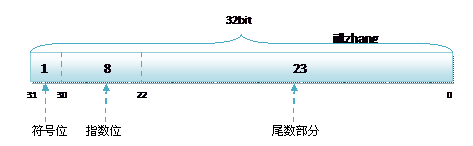

**double**

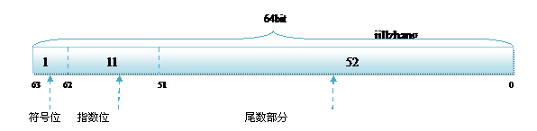

如`8.25f`表示为`8.25 * 10^0`，对应的二进制表示为`1000.01b = 1.0001b * 2^3`，<font color="red">（任何小数都可以表示为1.xyz * 2^n，所以第一个1可以去掉，实际上尾数有效位为24位）</font>，所以8.25的存储方式为：

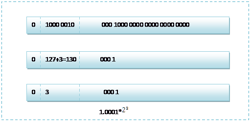

参考[浮点数在计算机中的存储方式 - wuyuan2011woaini - 博客园 (cnblogs.com)](https://www.cnblogs.com/wuyuan2011woaini/p/4105765.html)

## 包装类型

基本类型都有对应的包装类型，基本类型与其对应的包装类型之间的赋值使用自动装箱与拆箱完成。

```java
Integer x = 2;     // 装箱 调用了 Integer.valueOf(2)
int y = x;         // 拆箱 调用了 X.intValue()
```

- [Autoboxing and Unboxing](https://docs.oracle.com/javase/tutorial/java/data/autoboxing.html)

> 问：有了基础类型为什么还需要包装类？
>
> 答：Java是面向对象语言，包装类让基础类型有了对象的特性，方便用在各种容器中（如HashMap数据系相关操作需要用到`hashCode()`和`equals()`方法等等，这些在基础类型中是没有的）。

## 缓存池

new Integer(123) 与 Integer.valueOf(123) 的区别在于：

- new Integer(123) 每次都会新建一个对象；
- Integer.valueOf(123) 会使用缓存池中的对象，多次调用会取得同一个对象的引用。

```java
Integer x = new Integer(123);
Integer y = new Integer(123);
System.out.println(x == y);    // false
Integer z = Integer.valueOf(123);
Integer k = Integer.valueOf(123);
System.out.println(z == k);   // true
```

valueOf() 方法的实现比较简单，就是先判断值是否在缓存池中，如果在的话就直接返回缓存池的内容。

```java
public static Integer valueOf(int i) {
    if (i >= IntegerCache.low && i <= IntegerCache.high)
        return IntegerCache.cache[i + (-IntegerCache.low)];
    return new Integer(i);
}
```

在 Java 8 中，**Integer 缓存池的大小默认为 -128\~127**。

```java
static final int low = -128;
static final int high;
static final Integer cache[];

static {
    // high value may be configured by property
    int h = 127;
    String integerCacheHighPropValue =
        sun.misc.VM.getSavedProperty("java.lang.Integer.IntegerCache.high");
    if (integerCacheHighPropValue != null) {
        try {
            int i = parseInt(integerCacheHighPropValue);
            i = Math.max(i, 127);
            // Maximum array size is Integer.MAX_VALUE
            h = Math.min(i, Integer.MAX_VALUE - (-low) -1);
        } catch( NumberFormatException nfe) {
            // If the property cannot be parsed into an int, ignore it.
        }
    }
    high = h;

    cache = new Integer[(high - low) + 1];
    int j = low;
    for(int k = 0; k < cache.length; k++)
        cache[k] = new Integer(j++);

    // range [-128, 127] must be interned (JLS7 5.1.7)
    assert IntegerCache.high >= 127;
}
```

编译器会在自动装箱过程调用 valueOf() 方法，因此多个值相同且值在缓存池范围内的 Integer 实例使用自动装箱来创建，那么就会引用相同的对象。

```java
Integer m = 123;
Integer n = 123;
System.out.println(m == n); // 指针比较, true
```

基本类型对应的缓冲池如下：

- boolean values true and false
- all byte values
- short values between -128 and 127
- int values between -128 and 127
- char in the range \u0000 to \u007F

在使用这些基本类型对应的包装类型时，如果该数值范围在缓冲池范围内，就可以直接使用缓冲池中的对象。

在 jdk 1.8 所有的数值类缓冲池中，Integer 的缓冲池 IntegerCache 很特殊，这个缓冲池的下界是 - 128，上界默认是 127，但是这个上界是可调的，在启动 jvm 的时候，通过 -XX:AutoBoxCacheMax=&lt;size&gt; 来指定这个缓冲池的大小，该选项在 JVM 初始化的时候会设定一个名为 java.lang.IntegerCache.high 系统属性，然后 IntegerCache 初始化的时候就会读取该系统属性来决定上界。

[StackOverflow : Differences between new Integer(123), Integer.valueOf(123) and just 123

](https://stackoverflow.com/questions/9030817/differences-between-new-integer123-integer-valueof123-and-just-123)

# 二、String

## 概览

**String 被声明为 final，因此它不可被继承。**(Integer 等包装类也不能被继承）

在 Java 8 中，String 内部使用 char 数组存储数据。

```java
public final class String
    implements java.io.Serializable, Comparable<String>, CharSequence {
    /** The value is used for character storage. */
    private final char value[];
}
```

在 Java 9 之后，String 类的实现改用 byte 数组存储字符串，同时使用 `coder` 来标识使用了哪种编码。

```java
public final class String
    implements java.io.Serializable, Comparable<String>, CharSequence {
    /** The value is used for character storage. */
    private final byte[] value;

    /** The identifier of the encoding used to encode the bytes in {@code value}. */
    private final byte coder;
}
```

value 数组被声明为 final，这意味着 value 数组初始化之后就不能再引用其它数组。并且 String 内部没有改变 value 数组的方法，因此可以保证 String 不可变。

## 不可变的好处

**1. 可以缓存 hash 值**  

因为 String 的 hash 值经常被使用，例如 String 用做 HashMap 的 key。不可变的特性可以使得 hash 值也不可变，因此只需要进行一次计算。

**2. String Pool 的需要**  

如果一个 String 对象已经被创建过了，那么就会从 String Pool 中取得引用。只有 String 是不可变的，才可能使用 String Pool。

<div align="center">  </div><br>

**3. 安全性**  

String 经常作为参数，String 不可变性可以保证参数不可变。例如在作为网络连接参数的情况下如果 String 是可变的，那么在网络连接过程中，String 被改变，改变 String 的那一方以为现在连接的是其它主机，而实际情况却不一定是。

**4. 线程安全**  

String 不可变性天生具备线程安全，可以在多个线程中安全地使用。

[Program Creek : Why String is immutable in Java?](https://www.programcreek.com/2013/04/why-string-is-immutable-in-java/)

## String, StringBuffer and StringBuilder

**1. 可变性**  

- String 不可变（成员变量`char[]`使用过了`final`进行修饰）
- StringBuffer 和 StringBuilder 可变（成员变量`char[]`支持自动扩容）

**2. 线程安全**  

- String 不可变，因此是线程安全的
- StringBuilder 不是线程安全的
- StringBuffer 是线程安全的，内部使用 synchronized 进行同步

**使用场景**：操作/改变少量数据可以使用String，大量/频繁拼接字符串综合考虑线程安全要求来使用`StringBuilder`或`StringBuffer`。

[StackOverflow : String, StringBuffer, and StringBuilder](https://stackoverflow.com/questions/2971315/string-stringbuffer-and-stringbuilder)

## String Pool

字符串常量池（String Pool）保存着所有字符串字面量（literal strings），这些字面量在编译时期就确定。不仅如此，还可以使用 String 的 intern() 方法在运行过程将字符串添加到 String Pool 中。

当一个字符串调用 intern() 方法时，如果 String Pool 中已经存在一个字符串和该字符串值相等（使用 equals() 方法进行确定），那么就会返回 String Pool 中字符串的引用；否则，就会在 String Pool 中添加一个新的字符串，并返回这个新字符串的引用。

下面示例中，s1 和 s2 采用 new String() 的方式新建了两个不同字符串，而 s3 和 s4 是通过 s1.intern() 方法取得同一个字符串引用。intern() 首先把 s1 引用的字符串放到 String Pool 中，然后返回这个字符串引用。因此 s3 和 s4 引用的是同一个字符串。

```java
String s1 = new String("aaa");
String s2 = new String("aaa");
System.out.println(s1 == s2);           // false
String s3 = s1.intern();
String s4 = s1.intern();
System.out.println(s3 == s4);           // true
```

如果是采用 "bbb" 这种字面量的形式创建字符串，会自动地将字符串放入 String Pool 中。

```java
String s5 = "bbb";
String s6 = "bbb";
System.out.println(s5 == s6);  // true
```

在 Java 7 之前，String Pool 被放在运行时常量池中，它属于永久代。而在 Java 7，String Pool 被移到堆中。这是因为永久代的空间有限，在大量使用字符串的场景下会导致 OutOfMemoryError 错误。

- [StackOverflow : What is String interning?](https://stackoverflow.com/questions/10578984/what-is-string-interning)
- [深入解析 String#intern](https://tech.meituan.com/in_depth_understanding_string_intern.html)

## new String("abc")

使用这种方式**一共会创建两个字符串对象**（前提是 String Pool 中还没有 "abc" 字符串对象）。

- "abc" 属于字符串字面量，因此编译时期会在 String Pool 中创建一个字符串对象，指向这个 "abc" 字符串字面量；
- 而使用 new 的方式会在堆中创建一个字符串对象。

创建一个测试类，其 main 方法中使用这种方式来创建字符串对象。

```java
public class NewStringTest {
    public static void main(String[] args) {
        String s = new String("abc");
    }
}
```

使用 javap -verbose 进行反编译，得到以下内容：

```java
// ...
Constant pool:
// ...
   #2 = Class              #18            // java/lang/String
   #3 = String             #19            // abc
// ...
  #18 = Utf8               java/lang/String
  #19 = Utf8               abc
// ...

  public static void main(java.lang.String[]);
    descriptor: ([Ljava/lang/String;)V
    flags: ACC_PUBLIC, ACC_STATIC
    Code:
      stack=3, locals=2, args_size=1
         0: new           #2                  // class java/lang/String
         3: dup
         4: ldc           #3                  // String abc
         6: invokespecial #4                  // Method java/lang/String."<init>":(Ljava/lang/String;)V
         9: astore_1
// ...
```

在 Constant Pool 中，#19 存储这字符串字面量 "abc"，#3 是 String Pool 的字符串对象，它指向 #19 这个字符串字面量。在 main 方法中，0: 行使用 new #2 在堆中创建一个字符串对象，并且使用 ldc #3 将 String Pool 中的字符串对象作为 String 构造函数的参数。

以下是 String 构造函数的源码，可以看到，在将一个字符串对象作为另一个字符串对象的构造函数参数时，并不会完全复制 value 数组内容，而是都会指向同一个 value 数组。

```java
public String(String original) {
    this.value = original.value;
    this.hash = original.hash;
}
```

# 三、运算

## 参数传递

Java 的参数是以**值传递**的形式传入方法中，而不是引用传递。

以下代码中 Dog dog 的 dog 是一个指针，存储的是对象的地址。在将一个参数传入一个方法时，本质上是**将对象的地址以值的方式传递到形参中**。

```java
public class Dog {

    String name;

    Dog(String name) {
        this.name = name;
    }

    String getName() {
        return this.name;
    }

    void setName(String name) {
        this.name = name;
    }

    String getObjectAddress() {
        return super.toString();
    }
}
```

在方法中改变对象的字段值会改变原对象该字段值，因为引用的是同一个对象。

```java
class PassByValueExample {
    public static void main(String[] args) {
        Dog dog = new Dog("A");
        func(dog);
        System.out.println(dog.getName());          // B
    }

    private static void func(Dog dog) {
        dog.setName("B");
    }
}
```

但是在方法中将指针引用了其它对象，那么此时方法里和方法外的两个指针指向了不同的对象，在一个指针改变其所指向对象的内容对另一个指针所指向的对象没有影响。

```java
public class PassByValueExample {
    public static void main(String[] args) {
        Dog dog = new Dog("A");
        System.out.println(dog.getObjectAddress()); // Dog@4554617c
        func(dog);
        System.out.println(dog.getObjectAddress()); // Dog@4554617c
        System.out.println(dog.getName());          // A
    }

    private static void func(Dog dog) {
        System.out.println(dog.getObjectAddress()); // Dog@4554617c
        dog = new Dog("B");
        System.out.println(dog.getObjectAddress()); // Dog@74a14482
        System.out.println(dog.getName());          // B
    }
}
```

[StackOverflow: Is Java “pass-by-reference” or “pass-by-value”?](https://stackoverflow.com/questions/40480/is-java-pass-by-reference-or-pass-by-value)

## float 与 double

Java 不能隐式执行向下转型，因为这会使得精度降低。

1.1 字面量属于 double 类型，不能直接将 1.1 直接赋值给 float 变量，因为这是向下转型。

```java
// float f = 1.1;
```

1.1f 字面量才是 float 类型。

```java
float f = 1.1f;
```

## 隐式类型转换

因为字面量 1 是 int 类型，它比 short 类型精度要高，因此不能隐式地将 int 类型向下转型为 short 类型。

```java
short s1 = 1;
// s1 = s1 + 1;
```

但是使用 += 或者 ++ 运算符会执行隐式类型转换。

```java
s1 += 1;
s1++;
```

上面的语句相当于将 s1 + 1 的计算结果进行了向下转型：

```java
s1 = (short) (s1 + 1);
```

[StackOverflow : Why don't Java's +=, -=, *=, /= compound assignment operators require casting?](https://stackoverflow.com/questions/8710619/why-dont-javas-compound-assignment-operators-require-casting)

## switch

从 Java 7 开始，可以在 switch 条件判断语句中使用 String 对象。

```java
String s = "a";
switch (s) {
    case "a":
        System.out.println("aaa");
        break;
    case "b":
        System.out.println("bbb");
        break;
}
```

switch 不支持 long，是因为 switch 的设计初衷是对那些只有少数几个值的类型进行等值判断，如果值过于复杂，那么还是用 if 比较合适。

```java
// long x = 111;
// switch (x) { // Incompatible types. Found: 'long', required: 'char, byte, short, int, Character, Byte, Short, Integer, String, or an enum'
//     case 111:
//         System.out.println(111);
//         break;
//     case 222:
//         System.out.println(222);
//         break;
// }
```

[StackOverflow : Why can't your switch statement data type be long, Java?](https://stackoverflow.com/questions/2676210/why-cant-your-switch-statement-data-type-be-long-java)


# 四、关键字

## final

**1. 数据**  

声明数据为常量，可以是编译时常量，也可以是在运行时被初始化后不能被改变的常量。

- 对于基本类型，final 使**数值不变**；
- 对于引用类型，final 使**引用不变**，也就不能引用其它对象，但是**被引用的对象本身是可以修改的**。

```java
final int x = 1;
// x = 2;  // cannot assign value to final variable 'x'
final A y = new A();
y.a = 1;
```

**2. 方法**  

声明方法**不能被子类重写**。

**private 方法隐式地被指定为 final**，如果在子类中定义的方法和基类中的一个 private 方法签名相同，此时子类的方法不是重写基类方法，而是在子类中定义了一个新的方法。

**3. 类**  

声明类**不允许被继承**。

## static

**1. 静态变量**  

- 静态变量：又称为类变量，也就是说这个变量属于类的，类所有的实例都共享静态变量，可以直接通过类名来访问它。静态变量在内存中只存在一份。
- 实例变量：每创建一个实例就会产生一个实例变量，它与该实例同生共死。

```java
public class A {

    private int x;         // 实例变量
    private static int y;  // 静态变量

    public static void main(String[] args) {
        // int x = A.x;  // Non-static field 'x' cannot be referenced from a static context
        A a = new A();
        int x = a.x;
        int y = A.y;
    }
}
```

**2. 静态方法**  

静态方法在类加载的时候就存在了，它不依赖于任何实例。所以静态方法必须有实现，也就是说它不能是抽象方法。

```java
public abstract class A {
    public static void func1(){
    }
    // public abstract static void func2();  // Illegal combination of modifiers: 'abstract' and 'static'
}
```

只能访问所属类的静态字段和静态方法，方法中不能有 this 和 super 关键字，因此这两个关键字与具体对象关联。

```java
public class A {

    private static int x;
    private int y;

    public static void func1(){
        int a = x;
        // int b = y;  // Non-static field 'y' cannot be referenced from a static context
        // int b = this.y;     // 'A.this' cannot be referenced from a static context
    }
}
```

**3. 静态语句块**  

静态语句块在类初始化时运行一次。

```java
public class A {
    static {
        System.out.println("123");
    }

    public static void main(String[] args) {
        A a1 = new A();
        A a2 = new A();
    }
}
```

```html
123
```

**4. 静态内部类**  

非静态内部类依赖于外部类的实例，也就是说需要先创建外部类实例，才能用这个实例去创建非静态内部类。而静态内部类不需要。

```java
public class OuterClass {

    class InnerClass {
    }

    static class StaticInnerClass {
    }

    public static void main(String[] args) {
        // InnerClass innerClass = new InnerClass(); // 'OuterClass.this' cannot be referenced from a static context
        OuterClass outerClass = new OuterClass();
        InnerClass innerClass = outerClass.new InnerClass();
        StaticInnerClass staticInnerClass = new StaticInnerClass();
    }
}
```

静态内部类不能访问外部类的非静态的变量和方法。

> 单例模式可以使用静态内部类的写法！

在使用静态变量和方法时不用再指明 ClassName，从而简化代码，但可读性大大降低。

```java
import static com.xxx.ClassName.*
```

**6. 初始化顺序**  

静态变量和静态语句块优先于实例变量和普通语句块，静态变量和静态语句块的初始化顺序取决于它们在代码中的顺序。

```java
public static String staticField = "静态变量";
```

```java
static {
    System.out.println("静态语句块");
}
```

```java
public String field = "实例变量";
```

```java
{
    System.out.println("普通语句块");
}
```

最后才是构造函数的初始化。

```java
public InitialOrderTest() {
    System.out.println("构造函数");
}
```

存在继承的情况下，初始化顺序为：

- 父类（静态变量、静态语句块）
- 子类（静态变量、静态语句块）
- 父类（实例变量、普通语句块）
- 父类（构造函数）
- 子类（实例变量、普通语句块）
- 子类（构造函数）

# 五、Object 通用方法

## 概览

```java
public native int hashCode()

public boolean equals(Object obj)

protected native Object clone() throws CloneNotSupportedException

public String toString()

public final native Class<?> getClass()

protected void finalize() throws Throwable {}

public final native void notify()

public final native void notifyAll()

public final native void wait(long timeout) throws InterruptedException

public final void wait(long timeout, int nanos) throws InterruptedException

public final void wait() throws InterruptedException
```

## equals()

**1. 等价关系**  

两个对象具有等价关系，需要满足以下五个条件：

Ⅰ 自反性

```java
x.equals(x); // true
```

Ⅱ 对称性

```java
x.equals(y) == y.equals(x); // true
```

Ⅲ 传递性

```java
if (x.equals(y) && y.equals(z))
    x.equals(z); // true;
```

Ⅳ 一致性

多次调用 equals() 方法结果不变

```java
x.equals(y) == x.equals(y); // true
```

Ⅴ 与 null 的比较

对任何不是 null 的对象 x 调用 x.equals(null) 结果都为 false

```java
x.equals(null); // false;
```

**2. ==和equals的区别**  

- 对于基本类型，`==` 判断两个值是否相等，基本类型没有 `equals()` 方法。
- 对于引用类型，`==` 判断两个变量是否引用同一个对象，即地址是否相同
- `equals`默认比较的是两个对象的地址是否相同（`==`），用户也可以重新该方法，实现比较对象的属性是否相同。

```java
Integer x = new Integer(1);
Integer y = new Integer(1);
System.out.println(x.equals(y)); // true
System.out.println(x == y);      // false
```

**3. 实现**  

- 检查是否为同一个对象的引用，如果是直接返回 true；
- 检查是否是同一个类型，如果不是，直接返回 false；
- 将 Object 对象进行转型；
- 判断每个关键域是否相等。

```java
public class EqualExample {

    private int x;
    private int y;
    private int z;

    public EqualExample(int x, int y, int z) {
        this.x = x;
        this.y = y;
        this.z = z;
    }

    @Override
    public boolean equals(Object o) {
        if (this == o) return true;
        if (o == null || getClass() != o.getClass()) return false;

        EqualExample that = (EqualExample) o;

        if (x != that.x) return false;
        if (y != that.y) return false;
        return z == that.z;
    }
}
```

## hashCode()

hashCode() 返回哈希值，而 equals() 是用来判断两个对象是否等价。**等价的两个对象散列值一定相同，但是散列值相同的两个对象不一定等价**，这是因为计算哈希值具有随机性，两个值不同的对象可能计算出相同的哈希值。

在覆盖 equals() 方法时应当总是覆盖 hashCode() 方法，保证等价的两个对象哈希值也相等。

> hashCode()方法默认为native实现，由JVM来做具体实现，根据对象的地址返回一个整数代表哈希码（一般情况下不同对象返回的哈希码是不同的）。
>
> **要求equals()判断相等的对象hashCode也要相等！两者需要一起重写！**

HashSet  和 HashMap 等集合类使用了 hashCode()  方法来计算对象应该存储的位置，因此要将对象添加到这些集合类中，需要让对应的类实现 hashCode()  方法。

下面的代码中，新建了两个等价的对象，并将它们添加到 HashSet 中。我们希望将这两个对象当成一样的，只在集合中添加一个对象。但是 EqualExample 没有实现 hashCode() 方法，因此这两个对象的哈希值是不同的，最终导致集合添加了两个等价的对象。

```java
EqualExample e1 = new EqualExample(1, 1, 1);
EqualExample e2 = new EqualExample(1, 1, 1);
System.out.println(e1.equals(e2)); // true
HashSet<EqualExample> set = new HashSet<>();
set.add(e1);
set.add(e2);
System.out.println(set.size());   // 2
```

理想的哈希函数应当具有均匀性，即不相等的对象应当均匀分布到所有可能的哈希值上。这就要求了哈希函数要把所有域的值都考虑进来。可以将每个域都当成 R 进制的某一位，然后组成一个 R 进制的整数。

R 一般取 31，因为它是一个奇素数，如果是偶数的话，当出现乘法溢出，信息就会丢失，因为与 2 相乘相当于向左移一位，最左边的位丢失。并且一个数与 31 相乘可以转换成移位和减法：`31*x == (x<<5)-x`，编译器会自动进行这个优化。

```java
@Override
public int hashCode() {
    int result = 17;
    result = 31 * result + x;
    result = 31 * result + y;
    result = 31 * result + z;
    return result;
}
```

## equals()和hashCode()的联系

重写`equals()`方法必须重写`hashCode()`方法（保证两个相等对象的哈希值相同，因为将对象放入类似Map的集合中时，会利用`hashCode`来计算下标，比较对象是否相同时最后会使用`equals()`来比较）。

- 两个对象`equals()`相等则`hashCode()`必须相等。
- 两个对象`hashCode()`相等`equals()`不一定相等，可能是哈希冲突。

## toString()

默认返回 ToStringExample@4554617c 这种形式，其中 @ 后面的数值为散列码的无符号十六进制表示。

```java
public class ToStringExample {

    private int number;

    public ToStringExample(int number) {
        this.number = number;
    }
}
```

```java
ToStringExample example = new ToStringExample(123);
System.out.println(example.toString());
```

```html
ToStringExample@4554617c
```

## clone()/深浅拷贝

### 1. cloneable

clone() 是 Object 的 protected 方法，它不是 public，一个类不显式去重写 clone()，其它类就不能直接去调用该类实例的 clone() 方法。

```java
public class CloneExample {
    private int a;
    private int b;
}
```

```java
CloneExample e1 = new CloneExample();
// CloneExample e2 = e1.clone(); // 'clone()' has protected access in 'java.lang.Object'
```

重写 clone() 得到以下实现：

```java
public class CloneExample {
    private int a;
    private int b;

    @Override
    public CloneExample clone() throws CloneNotSupportedException {
        return (CloneExample)super.clone();
    }
}
```

```java
CloneExample e1 = new CloneExample();
try {
    CloneExample e2 = e1.clone();
} catch (CloneNotSupportedException e) {
    e.printStackTrace();
}
```

```html
java.lang.CloneNotSupportedException: CloneExample
```

以上抛出了 CloneNotSupportedException，这是因为 CloneExample 没有实现 Cloneable 接口。

应该注意的是，clone() 方法并不是 Cloneable 接口的方法，而是 Object 的一个 protected 方法。Cloneable 接口只是规定，如果一个类没有实现 Cloneable 接口又调用了 clone() 方法，就会抛出 CloneNotSupportedException。

```java
public class CloneExample implements Cloneable {
    private int a;
    private int b;

    @Override
    public Object clone() throws CloneNotSupportedException {
        return super.clone();
    }
}
```

### 2. 浅拷贝 VS 深拷贝

**浅拷贝**：拷贝对象和原始对象的引用类型引用同一个对象。对原始对象的修改会影响拷贝对象。

**深拷贝**：拷贝对象和原始对象的引用类型引用不同对象。对原始对象的修改并不会影响拷贝对象。


### 3. 如何实现深拷贝

**实现Clonable接口**：重写其中的clone方法即可，可能抛出类强制转换失败的异常。

**手动实现拷贝方法**：将类中的手动进行赋值。

**序列化/反序列化**：将对象序列化生成的数据（如json或二进制数据）重新反序列化生成新的对象，使用序列化的前提是拷贝的类（包括其成员变量）需要实现Serializable接口。

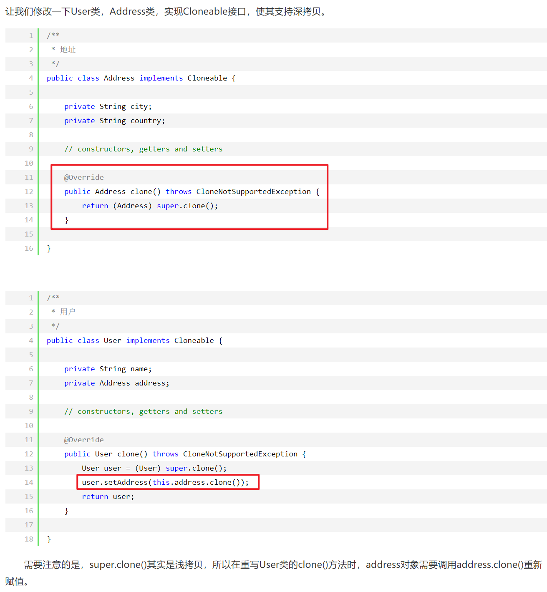

# 六、继承

## 访问权限

Java 中有三个访问权限修饰符：private、protected 以及 public，如果不加访问修饰符，表示包级可见。

可以对类或类中的成员（字段和方法）加上访问修饰符。

- 类可见表示其它类可以用这个类创建实例对象。
- 成员可见表示其它类可以用这个类的实例对象访问到该成员；

protected 用于修饰成员，表示在继承体系中成员对于子类可见，但是这个访问修饰符对于类没有意义。

设计良好的模块会隐藏所有的实现细节，把它的 API 与它的实现清晰地隔离开来。模块之间只通过它们的 API 进行通信，一个模块不需要知道其他模块的内部工作情况，这个概念被称为信息隐藏或封装。因此访问权限应当尽可能地使每个类或者成员不被外界访问。

如果子类的方法重写了父类的方法，那么**子类中该方法的访问级别不允许低于父类的访问级别**。这是为了确保可以使用父类实例的地方都可以使用子类实例去代替，也就是确保满足里氏替换原则。

**字段决不能是公有的**，因为这么做的话就失去了对这个字段修改行为的控制，客户端可以对其随意修改。例如下面的例子中，AccessExample 拥有 id 公有字段，如果在某个时刻，我们想要使用 int 存储 id 字段，那么就需要修改所有的客户端代码。

```java
public class AccessExample {
    public String id;
}
```

可以使用公有的 getter 和 setter 方法来替换公有字段，这样的话就可以控制对字段的修改行为。

```java
public class AccessExample {

    private int id;

    public String getId() {
        return id + "";
    }

    public void setId(String id) {
        this.id = Integer.valueOf(id);
    }
}
```

但是也有例外，如果是包级私有的类或者私有的嵌套类，那么直接暴露成员不会有特别大的影响。

```java
public class AccessWithInnerClassExample {

    private class InnerClass {
        int x;
    }

    private InnerClass innerClass;

    public AccessWithInnerClassExample() {
        innerClass = new InnerClass();
    }

    public int getValue() {
        return innerClass.x;  // 直接访问
    }
}
```

## 抽象类与接口

### 抽象类

如果一个类没有包含足够多的信息来描述一个具体的对象，这样的类就是抽象类。抽象类和抽象方法都使用 abstract 关键字进行声明。**如果一个类中包含抽象方法，那么这个类必须声明为抽象类**。

抽象类和普通类最大的区别是，抽象类不能被实例化，只能被继承。

```java
public abstract class AbstractClassExample {

    protected int x;
    private int y;

    public abstract void func1();

    public void func2() {
        System.out.println("func2");
    }
}
```

```java
public class AbstractExtendClassExample extends AbstractClassExample {
    @Override
    public void func1() {
        System.out.println("func1");
    }
}
```

```java
// AbstractClassExample ac1 = new AbstractClassExample(); // 'AbstractClassExample' is abstract; cannot be instantiated
AbstractClassExample ac2 = new AbstractExtendClassExample();
ac2.func1();
```

###  接口

接口是抽象类的延伸，接口里面定义了很多没有实现的方法，只是起一个合约规范的作用，在 Java 8 之前，它可以看成是一个完全抽象的类，也就是说它不能有任何的方法实现。

**从 Java 8 开始，接口也可以拥有默认的方法实现**，这是因为不支持默认方法的接口的维护成本太高了。在 Java 8 之前，如果一个接口想要添加新的方法，那么要修改所有实现了该接口的类，让它们都实现新增的方法。

接口的成员（字段 + 方法）默认都是 public 的，并且不允许定义为 private 或者 protected。

**接口的字段默认都是 static 和 final 的**。

```java
public interface InterfaceExample {

    void func1();

    default void func2(){
        System.out.println("func2");
    }

    int x = 123;
    // int y;               // Variable 'y' might not have been initialized
    public int z = 0;       // Modifier 'public' is redundant for interface fields
    // private int k = 0;   // Modifier 'private' not allowed here
    // protected int l = 0; // Modifier 'protected' not allowed here
    // private void fun3(); // Modifier 'private' not allowed here
}
```

```java
public class InterfaceImplementExample implements InterfaceExample {
    @Override
    public void func1() {
        System.out.println("func1");
    }
}
```

```java
// InterfaceExample ie1 = new InterfaceExample(); // 'InterfaceExample' is abstract; cannot be instantiated
InterfaceExample ie2 = new InterfaceImplementExample();
ie2.func1();
System.out.println(InterfaceExample.x);
```

###  比较

- 从设计层面上看，抽象类提供了一种 IS-A 关系，需要满足里式替换原则，即子类对象必须能够替换掉所有父类对象。而接口更像是一种 LIKE-A 关系（*一个类实现了什么接口 = 一个类具备接口定义的功能*），它只是提供一种方法实现契约，并不要求接口和实现接口的类具有 IS-A 关系。
- 从使用上来看，**一个类可以实现多个接口，但是不能继承多个抽象类**。
- 接口的字段只能是 static 和 final 类型的，而抽象类的字段没有这种限制。
- 接口的成员只能是 public 的，而抽象类的成员可以有多种访问权限。

###  使用选择

使用接口：

- 需要让不相关的类都实现一个方法，例如不相关的类都可以实现 Comparable 接口中的 compareTo() 方法；
- 需要使用多重继承。

使用抽象类：

- 需要在几个相关的类中共享代码。
- 需要能控制继承来的成员的访问权限，而不是都为 public。
- 需要继承非静态和非常量字段。

在很多情况下，**接口优先于抽象类**（优先使用组合而不是继承）。因为接口没有抽象类严格的类层次结构要求，可以灵活地为一个类添加行为。并且从 Java 8 开始，接口也可以有默认的方法实现，使得修改接口的成本也变的很低。

- [Abstract Methods and Classes](https://docs.oracle.com/javase/tutorial/java/IandI/abstract.html)
- [深入理解 abstract class 和 interface](https://www.ibm.com/developerworks/cn/java/l-javainterface-abstract/)
- [When to Use Abstract Class and Interface](https://dzone.com/articles/when-to-use-abstract-class-and-intreface)


## super

- 访问父类的构造函数：可以使用 super() 函数访问父类的构造函数，从而委托父类完成一些初始化的工作。应该注意到，子类一定会调用父类的构造函数来完成初始化工作，一般是调用父类的默认构造函数，如果子类需要调用父类其它构造函数，那么就可以使用 super() 函数。
- 访问父类的成员：如果子类重写了父类的某个方法，可以通过使用 super 关键字来引用父类的方法实现。

```java
public class SuperExample {

    protected int x;
    protected int y;

    public SuperExample(int x, int y) {
        this.x = x;
        this.y = y;
    }

    public void func() {
        System.out.println("SuperExample.func()");
    }
}
```

```java
public class SuperExtendExample extends SuperExample {

    private int z;

    public SuperExtendExample(int x, int y, int z) {
        super(x, y);
        this.z = z;
    }

    @Override
    public void func() {
        super.func();
        System.out.println("SuperExtendExample.func()");
    }
}
```

```java
SuperExample e = new SuperExtendExample(1, 2, 3);
e.func();
```

```html
SuperExample.func()
SuperExtendExample.func()
```

[Using the Keyword super](https://docs.oracle.com/javase/tutorial/java/IandI/super.html)

## 重写与重载

### 重写（Override）

> 方法名字、传入参数、返回类型完全相同！

存在于继承体系中，指子类实现了一个与父类在方法**声明上完全相同**的一个方法。

为了满足里式替换原则，重写有以下三个限制：

- 子类方法的访问权限必须大于等于父类方法；
- **子类方法的返回类型必须是父类方法返回类型或为其子类型**。
- 子类方法抛出的异常类型必须是父类抛出异常类型或为其子类型。

使用 @Override 注解，可以让编译器帮忙检查是否满足上面的三个限制条件。

下面的示例中，SubClass 为 SuperClass 的子类，SubClass 重写了 SuperClass 的 func() 方法。其中：

- 子类方法访问权限为 public，大于父类的 protected。
- 子类的返回类型为 ArrayList<Integer>，是父类返回类型 List<Integer> 的子类。
- 子类抛出的异常类型为 Exception，是父类抛出异常 Throwable 的子类。
- 子类重写方法使用 @Override 注解，从而让编译器自动检查是否满足限制条件。

```java
class SuperClass {
    protected List<Integer> func() throws Throwable {
        return new ArrayList<>();
    }
}

class SubClass extends SuperClass {
    @Override
    public ArrayList<Integer> func() throws Exception {
        return new ArrayList<>();
    }
}
```

在调用一个方法时，先从本类中查找看是否有对应的方法，如果没有再到父类中查看，看是否从父类继承来。否则就要对参数进行转型，转成父类之后看是否有对应的方法。总的来说，方法调用的优先级为：

- this.func(this)
- super.func(this)
- this.func(super)
- super.func(super)


```java
/*
    A
    |
    B
    |
    C
    |
    D
 */


class A {

    public void show(A obj) {
        System.out.println("A.show(A)");
    }

    public void show(C obj) {
        System.out.println("A.show(C)");
    }
}

class B extends A {

    @Override
    public void show(A obj) {
        System.out.println("B.show(A)");
    }
}

class C extends B {
}

class D extends C {
}
```

```java
public static void main(String[] args) {

    A a = new A();
    B b = new B();
    C c = new C();
    D d = new D();

    // 在 A 中存在 show(A obj)，直接调用
    a.show(a); // A.show(A)
    // 在 A 中不存在 show(B obj)，将 B 转型成其父类 A
    a.show(b); // A.show(A)
    // 在 B 中存在从 A 继承来的 show(C obj)，直接调用
    b.show(c); // A.show(C)
    // 在 B 中不存在 show(D obj)，但是存在从 A 继承来的 show(C obj)，将 D 转型成其父类 C
    b.show(d); // A.show(C)

    // 引用的还是 B 对象，所以 ba 和 b 的调用结果一样
    A ba = new B();
    ba.show(c); // A.show(C)
    ba.show(d); // A.show(C)
}
```

### 重载（Overload）

> **方法名字、返回类型相同**，但是传入参数类型/个数/顺序不同。

存在于同一个类中，指一个方法与已经存在的方法名称上相同，但是**参数类型、个数、顺序**至少有一个不同。

应该注意的是，**返回值不同，其它都相同不算是重载**（不允许这样写）。

```java
// 假设有以下两个函数
float max(int a, int b);
int max(int a, int b);
// 进行下面的调用时，编译器无法判断是要调用哪一个函数
max(1, 2);
```

> 方法的重载和重写都是实现多态的方式，区别在于前者实现的是**编译时的多态性**，而后者实现的是**运行时的多态性**。

## 多态

### JAVA如何实现多态

<font color="blue">通过方法**重写**（子类方法覆盖父类方法/接口的多个实现类）或者**重载**(方法入参不同，其余相同)来实现多态。</font>

### JVM如何确定调用的是子类方法

在Java中，方法调用有两类，动态方法调用与静态方法调用：

- **静态方法调用**是指对于类的静态方法的调用方式，是在编译时刻就已经确定好具体调用方法的情况，是静态绑定的。

- **动态方法调用**需要有方法调用所作用的对象，是在调用的时候才确定具体的调用方法，是动态绑定的。

**多态则是采用动态方法调用。**

<font color="green">JVM如何确定具体需要执行那个方法的流程如下：</font>

- 首先找到变量/引用的实际类型（虚拟机栈指针指向堆中的实际对象）
- 在实际类型中寻找符合要求的方法（实际对象对应方法区中的class的方法表）
- 如果实际类型中没有符合要求的方法，则继续往父类中寻找
- 如果始终没有找到合适的方法，则抛出`java.lang.AbstractMethodError`异常

# 七、反射

每个类都有一个   **Class**   **对象**，包含了与类有关的信息。当编译一个新类时，会产生一个同名的 .class 文件，该文件内容保存着 Class 对象。

类加载相当于 Class 对象的加载，类在第一次使用时才动态加载到 JVM 中。也可以使用 `Class.forName("com.mysql.jdbc.Driver")` 这种方式来控制类的加载，该方法会返回一个 Class 对象。

反射可以提供运行时的类信息，并且这个类可以在运行时才加载进来，甚至在编译时期该类的 .class 不存在也可以加载进来。

Class 和 java.lang.reflect 一起对反射提供了支持，java.lang.reflect 类库主要包含了以下三个类：

-   **Field**  ：可以使用 get() 和 set() 方法读取和修改 Field 对象关联的字段；
-   **Method**  ：可以使用 invoke() 方法调用与 Method 对象关联的方法；
-   **Constructor**  ：可以用 Constructor 的 newInstance() 创建新的对象。

## 反射的优点

*     **可扩展性**   ：应用程序可以利用全限定名创建可扩展对象的实例，来使用来自外部的用户自定义类。
*     **类浏览器和可视化开发环境**   ：一个类浏览器需要可以枚举类的成员。可视化开发环境（如 IDE）可以从利用反射中可用的类型信息中受益，以帮助程序员编写正确的代码。
*     **调试器和测试工具**   ： 调试器需要能够检查一个类里的私有成员。测试工具可以利用反射来自动地调用类里定义的可被发现的 API 定义，以确保一组测试中有较高的代码覆盖率。

## 反射的缺点

尽管反射非常强大，但也不能滥用。如果一个功能可以不用反射完成，那么最好就不用。在我们使用反射技术时，下面几条内容应该牢记于心。

*     **性能开销**   ：反射涉及了动态类型的解析，所以 JVM 无法对这些代码进行优化。因此，反射操作的效率要比那些非反射操作低得多。我们应该避免在经常被执行的代码或对性能要求很高的程序中使用反射。

*     **安全限制**   ：使用反射技术要求程序必须在一个没有安全限制的环境中运行。如果一个程序必须在有安全限制的环境中运行，如 Applet，那么这就是个问题了。

*     **内部暴露** 【重要】  ：由于反射允许代码执行一些在正常情况下不被允许的操作（比如访问私有的属性和方法），所以使用反射可能会导致意料之外的副作用，这可能导致代码功能失调并破坏可移植性。反射代码破坏了抽象性，因此当平台发生改变的时候，代码的行为就有可能也随着变化。


- [Trail: The Reflection API](https://docs.oracle.com/javase/tutorial/reflect/index.html)
- [深入解析 Java 反射（1）- 基础](http://www.sczyh30.com/posts/Java/java-reflection-1/)

## 反射的应用

### 动态代理

利用JDK的动态代理，可以不需要对每个代理目标都编写一个对应的代理类（代理类也需要实现代理目标实现的接口，并传入一个代理目标作为成员变量），`InvocationHandler`可以利用反射自动为传入的对象生成代理类。

> 为什么不直接用继承+重写的方法来进行功能增强呢？因为可能别人写的程序我们没有源代码，只有class文件，无法重写。
>
> 动态代理与静态代理相比较，最大的好处是接口中声明的所有方法都被转移到调用处理器一个集中的方法中处理（InvocationHandler.invoke）。这样，在代理目标接口方法数量比较多的时候，我们可以进行灵活处理，而不需要像静态代理那样每一个方法进行中转。而且动态代理的应用使我们的类职责更加单一，复用性更强。

直接上代码：

```java
import java.lang.reflect.InvocationHandler;
import java.lang.reflect.Method;
import java.lang.reflect.Proxy;

// 代理：需要实现InvocationHandler接口
public class ProxyHandler implements InvocationHandler {
    /**
     * 绑定委托对象，并返回代理类
     */
    private Object target;
	
    // 绑定代理目标并为其动态生成一个代理对象返回
    public Object bind(Object target) {
        //绑定该类实现的所有接口，取得代理类
        this.target = target;
        return Proxy.newProxyInstance(target.getClass().getClassLoader(), target.getClass().getInterfaces(), this);
    }
	
    // 在调用自动生成的代理对象的方法是会自动调用本方法，可以实现不对代理目标的方法进行重写的前提下进行方法功能增强（如加入日志打印。权限控制等）！
    @Override
    public Object invoke(Object proxy, Method method, Object[] args) throws Throwable {
        // 直接调用对象的实际方法，此处也可做一些调用权限控制
        Object result = null;
        if ("destroy".equals(method.getName())) {
            throw new IllegalAccessError();
        }
        result = method.invoke(target, args);
        return result;
    }
}

// 代理目标：必须实现某个接口！
public class RealSubject implements Subject {
    @Override
    public void doOperation() {
        System.out.println("RealSubject: do operation()...");
    }

    @Override
    public void destroy() {
        System.out.println("RealSubject: destroy()...");
    }
}
```

# 八、异常

## 异常分类

`Throwable `可以用来表示任何可以作为异常抛出的类，分为两种：

- **Error**：`Error`类对象由 Java 虚拟机生成并抛出（如内存溢出。堆栈溢出），大多数错误与代码编写者所执行的操作无关。这些错误是不可查的，因为它们在应用程序的控制和处理能力之 外，不应该试图去处理它所引起的异常状况。
- **Exception**：
  - **运行时异常**  ：`RuntimeExdeption`，如空指针、越界、算术异常或用户自定义的异常等，这些异常是不检查异常，程序中可以选择捕获处理，也可以不处理。这些异常一般是由程序逻辑错误引起的，程序应该从逻辑角度尽可能避免这类异常的发生。
  - **非运行时异常**  ：除`RuntimeExdeption`之外的异常，如`IOException`，从程序语法角度讲是必须进行处理的异常，如果不处理，程序就不能编译通过。

<div align="center">  </div><br>

> `不受检查异常`：包括`RuntimeException`及其子类和`Error`，无法预测，在程序执行过程中才可能发生。
>
> `检查异常`：在正确的程序运行过程中，很容易出现的、情理可容的异常状况，在一定程度上这种异常的发生是可以预测的，并且一旦发生该种异常，就必须采取某种方式进行处理（try...catch.../throw进行处理）。

## 异常相关的关键字

**try...catch..finally**

不做过多介绍。

finally中的语句无论是否出现异常，以及出现的异常是否被catch捕获，都可以成功执行！

<font color="red">finally中的语句会在try/catch语句块里的return之前执行！！！即使它们显示调用了return</font>

**throw**

可以用在捕获到异常后将异常向上抛出（因为自己无法处理，所以将改异常交给方法调用者处理），`throw`被执行后方法立即返回，后面的语句将不会被执行。

**throws**

配置`throw`关键字使用，如果本方法不想处理异常（不用`try..catch`处理）或直接`throw`，则必须（前提是这是一个**受检异常**）在方法上用`throws`抛出该方法执行可能出现的异常，供方法调用者进行处理。

****

```java
public class ExceptionTest {
    public static void main(String[] args) {
        try {
            createException1(); // 必须捕获异常或在方法上throws
        } catch (Exception e) {
            e.printStackTrace();
        }
        createException2();	// 会被执行

        createException2(); // 不会被执行, 因为上一个异常未处理，线程退出
    }

    private static void createException1() throws Exception {
        try {
            throw new Exception("Exception1:非运行时异常");
        } catch (Exception e) {
            throw e;
        }
    }

    private static void createException2() {
        try {
            // 造一个异常
            throw new RuntimeException("Exception2:运行时异常");
        } catch (Exception e) {
            throw e;	// 非运行时异常可以不做任何处理(不需要在方法上throws声明，调用者也可以不处理，如果调用者要处理必须先在方法上声明)
        }
    }
}

// ---- 输出打印 ---------
/*
java.lang.Exception: Exception1:非运行时异常
	at test.ExceptionTest.createException1(ExceptionTest.java:27)
	at test.ExceptionTest.main(ExceptionTest.java:11)
Exception in thread "main" java.lang.RuntimeException: Exception2:运行时异常
	at test.ExceptionTest.createException2(ExceptionTest.java:36)
	at test.ExceptionTest.main(ExceptionTest.java:15)
*/
```

> `Throws`抛出异常的规则：
>
> - 如果是不受检查异常（`unchecked exception`），即`Error`、`RuntimeException`或它们的子类，那么可以不使用`throws`关键字来声明要抛出的异常，编译仍能顺利通过，但在运行时会被系统抛出。
> - 必须声明方法可抛出的任何检查异常（`checked exception`）。即如果一个方法可能出现受可查异常，要么用`try-catch`语句捕获，要么用`throws`子句声明将它抛出，否则会导致编译错误
> - 仅当抛出了异常，该方法的调用者才必须处理或者重新抛出该异常。当方法的调用者无力处理该异常的时候，应该继续抛出，而不是囫囵吞枣。
> - 调用方法必须遵循任何可查异常的处理和声明规则。若覆盖一个方法，则不能声明与覆盖方法不同的异常。声明的任何异常必须是被覆盖方法所声明异常的同类或子类。

## 参考

- [Java 入门之异常处理](https://www.tianmaying.com/tutorial/Java-Exception)
- [Java 异常的面试问题及答案 -Part 1](http://www.importnew.com/7383.html)

# 九、泛型

Java 泛型（generics）是 JDK 5 中引入的一个新特性, 泛型提供了编译时类型安全检测机制，该机制允许程序员在编译时检测到非法的类型。泛型的本质是参数化类型，也就是说所操作的数据类型被指定为一个参数。

主要有以下四个作用：

- **泛化**：同样编写的代码可以被很多不同类型的对象所重用，提供代码的泛化能力。
- **类型安全**：提供编译期的类型安全检查机制，允许程序员在编译时检测到非法的类型。
- **减少强制转换**：泛型可以消除源代码中的许多强制类型转换，这样可以使代码更加可读，并减少出错的机会。

> `泛型`相当于把类型也参数化了！

##  9.1 泛型类 & 泛型方法 & 泛型接口

- **泛型类**：在类名后面用`< >`包裹一个或者多个大写字母（类型参数），该参数可以表示任意类型。在类中凡是可以使用类型的地方都可以使用该泛型声明。

  > 泛型的类型参数只能是类类型（如`Integer`），不能是简单/基本类型（如`int`）。可以`List<int []>`! 因为数组在Java中是一个对象而不是基本类型。

- **泛型方法**：这个方法可以定义在泛型类中，可以定义在普通类中，类型参数需要放在方法修饰符（如`public`  和 `static`）后面，在返回值类型前面。在方法的返回值、传入参数、方法体中可以使用该泛型类型。

  > 在不指定泛型的情况下，泛型变量的类型为该方法中的几种类型的同一父类的最小级，直到Object
  >
  > 在指定泛型的情况下，该方法的几种类型必须是该泛型的实例的类型或者其子类

  ```java
  // 泛型类和泛型方法举例
  public class MyPair<T> {
      private T first;
      private T second;
  
      public MyPair() {
      }
  	
      public MyPair(T first, T second) {
          this.first = first;
          this.second = second;
      }
  	
      // 虽然在方法中使用了泛型，但是这并不是一个泛型方法。
      // 这只是类中一个普通的成员方法，只不过他的返回值是在声明泛型类已经声明过的泛型。
      public T getFirst() {
          return first;
      }
  
      public void setFirst(T first) {
          this.first = first;
      }
      
      // 泛型方法举例1
      // 在泛型类中声明了一个泛型方法，使用泛型T，注意这个T是一种全新的类型，可以与泛型类中声明的T不是同一种类型。
      // 如果省略<T>将报错，因为静态成员/方法中不能使用类中声明的泛型类型参数
      public <T> void show(T t){
          System.out.println(t.toString());
      }
  	
      // 泛型方法举例2
      // 获取中间的传入参数（静态方法中如果要使用泛型，必须将静态方法也定义成泛型方法。）
      public static <S> S getMiddle(S... num){
          return num[num.length/2];
      }
  }
  
  // 调用举例
  MyPair<String> pair = new MyPair<>("Tom");
  String s = MyPair.getMiddle("Tom", "John", "Bob");	// 方法调用中会做泛型推断，所以可以不需要指明类型
  ```

  ```java
  public class Test {  
      public static void main(String[] args) {  
  
          /**不指定泛型的时候*/  
          int i = Test.add(1, 2); //这两个参数都是Integer，所以T为Integer类型  
          Number f = Test.add(1, 1.2); //这两个参数一个是Integer，以风格是Float，所以取同一父类的最小级，为Number  
          Object o = Test.add(1, "asd"); //这两个参数一个是Integer，以风格是Float，所以取同一父类的最小级，为Object  
  
          /**指定泛型的时候*/  
          int a = Test.<Integer>add(1, 2); //指定了Integer，所以只能为Integer类型或者其子类  
          int b = Test.<Integer>add(1, 2.2); //编译错误，指定了Integer，不能为Float  
          Number c = Test.<Number>add(1, 2.2); //指定为Number，所以可以为Integer和Float  
      }  
  
      //这是一个简单的泛型方法  
      public static <T> T add(T x,T y){  
          return y;  
      }  
  }
  ```

  

- **泛型接口**：泛型接口与泛型类的定义及使用基本相同。当实现泛型接口的类，未传入泛型实参（具体的类型）时，需要把泛型的声明也一起加到类中，否则编译器将报错；在实现类实现泛型接口时，如已将泛型类型传入实参类型，则所有使用泛型的地方都要替换成传入的实参类型。

  ```java
  // 定义一个泛型接口
  public interface Generator<T> {
      public T next();
  }
  
  // 定义一个实现泛型接口的类（未传入泛型实参）
  class FruitGenerator<T> implements Generator<T>{
      @Override
      public T next() {
          return null;
      }
  }
  
  // 定义一个实现泛型接口的类（传入泛型实参）
  public class FruitGenerator implements Generator<String> {
      private String[] fruits = new String[]{"Apple", "Banana", "Pear"};
  
      @Override
      public String next() {
          Random rand = new Random();
          return fruits[rand.nextInt(3)];
      }
  }
  ```

  

## 9.2 泛型与继承

<font color="red">**原始类之间的继承关系不会映射到泛型类中**！</font>

假设存在一个`Cat`类是`Animal`的子类，以下转换是合法的（子类-->父类）:

```java
// case 1
Cat[] cats = new Cats[10];
Animal[] animals = cats;
```

但是下面的转换是非法的：

```java
// case 2
List<Cat> cats = new ArrayList<>();
List<Animal> animals = cats;    // 非法！ 如果把animal声明成List<? extends Animal>就可以赋值了！！！

// 如果上述操作合法，则animals指向cats集合
animals.add(new Animal()); // 合法
cats.get(0); // 非法！因为cats的get方法要求返回一个Cat类型的对象，而不是它的父类对象（父类无法转成子类）
```

## 9.3 通配符类型

本章[9.2 泛型与继承](# 9.2 泛型与继承)中描述的问题将导致无法给下面的`print1`方法传入`List<Cat>`类型的变量，而只能是`List<Animal>`类型，所以需要通配符`?`。

*通配符其实在声明局部变量时是没有什么意义的，但是当你为一个方法声明一个参数时，它是非常重要的。*

- 非限定通配符`<?>`，表示未知类型，此处的`?`和`Number`、`String`、`Integer`一样都是一种实际的类型，可以把`?`看成所有类型的父类，是一种真实的类型。

  > 当具体类型不确定的时候，这个通配符就是`?`；当操作类型时，不需要使用类型的具体功能时，只使用Object类中的功能，那么可以用`?`通配符来表未知类型。
  >
  > 可以把List<String>, List<Integer>赋值给List<?>，却不能把List<String>赋值给List<Object>。

- 带上限的通配符`<? extends T>`，表示可以传递`T`类型及其子类的**赋值**，**只读不写**（读取出来的内容值通过引用赋值得来的），例如实现一个支持对任何Animal的打印程序：

  ```java
  // 不能声明成public void print1(List<Animal> animalList)因为泛型类之间不具有继承关系
  public void print(List<? extends Animal> animalList) {
  	// animalList可以装任何Aminal及其子类
      
      for (int i = 0; i < animalList.size(); i++) {
          Animal a = animalList.get(i);
          System.out.println(a);// 编译正确，编译器可确定装的类型至少是Animal类型
      }
  
      // animalList.set(new Dog());	// 编译错误，无法检验操作的安全性，万一实际装的是Cat类型就出错
  }
  
  // 测试代码
  List<Dog> dogList = new ArrayList();
  dogList.add(new Dog());
  dogList.add(new Dog());
  print(dogList);
  ```

- 带下限的通配符`<? super T>`，下界通配符，可以接受T类以及T的所有父类的**赋值**，在集合中使用时，可以add所有T类以及T子类的数据。**只写**（写也是有限制的，只能写T及其子类对象）**不读**（可以读出放入Object对象中），例如实现一个可以给容器填充任何动物的程序：

  ```java
  public void writeAllKinds(List<? super Animal> list) {
      list.add(new Dog());
      list.add(new Animal());
      // list.add(new Object());	// 编译出错, 因为 ? super Animal 没有确定的根/父类
      // Animal d = list.get(0); // 编译出错，无法确定取出来的是不是Animal 传入的list中之前可能存的是Animal父类对象(如【标记】处的写法)
      Object o = list.get(0); // 只能读到Object中
  }
  
  List<Animal> list1 = new ArrayList<>();	// 必须声明称Animal及其父类容器
  // List<Object> list1 = new ArrayList<>();	// 这种也可以
  // list1.add(new Object())	// 【标记】
  writeAllKinds(list1);
  ```

**综合使用示例**

```java
// 不使用通配符
public static void print1(List<Animal> list){...};

// extends 和 super 综合举例 java.util.Collections.copy()方法
// dest作为消费者只写不读(因为可以写入任何T的父类及子类类型的对象？，无法确定读出来的类型到底是什么)，src作为生产者只读不写（因为可以确定读取出来的类型至少是T类型），支持把T及其子类拷贝到T及其父类容器中
public static <T> void copy(List<? super T> dest, List<? extends T> src) {
    int srcSize = src.size();
    if (srcSize > dest.size())
        throw new IndexOutOfBoundsException("Source does not fit in dest");

    if (srcSize < COPY_THRESHOLD ||
        (src instanceof RandomAccess && dest instanceof RandomAccess)) {
        for (int i=0; i<srcSize; i++)
            dest.set(i, src.get(i));
    } else {
        ListIterator<? super T> di=dest.listIterator();
        ListIterator<? extends T> si=src.listIterator();
        for (int i=0; i<srcSize; i++) {
            di.next();
            di.set(si.next());
        }
    }
}
```

关于PECS（extends作为生产者producer只读不写，super作为消费者consumer只写不读）参考 [Java 泛型，上界（生产者），下界（消费者）总结](https://blog.csdn.net/qq_31429205/article/details/103817506) 和 [泛型中? super T和? extends T的区别](http://ifeve.com/difference-between-super-t-and-extends-t-in-java/) 和[Java 泛型 <? super T> 中 super 怎么 理解？与 extends 有何不同？ - 胖君的回答 - 知乎 ](https://www.zhihu.com/question/20400700/answer/117464182)

## 9.4 类型擦除

### 9.4.1 什么是类型擦除

> Java的泛型是伪泛型，这是因为Java在编译期间，所有的泛型信息都会被擦掉，最终泛型类型变成原始类型。Java的泛型基本上都是在编译器这个层次上实现的，在生成的字节码（`class`文件）中是不包含泛型中的类型信息的，使用泛型的时候加上类型参数，在编译器编译的时候会去掉，这个过程成为类型擦除。

> 类型擦除也是Java的泛型与C++模板机制实现方式之间的重要区别。

下面的代码可以证明Java的类型擦除机制：

```java
List<String> sList = new ArrayList<>();
sList.add("Test");
List<Integer> iList = new ArrayList<>();
iList.add(123);
// 验证class是否相同，输出为 true （两者在编译后都变成了原始类型List）
System.out.println(sList.getClass() == iList.getClass());

// 利反射机制验证，绕过编译检查，输出123 456
iList.getClass().getMethod("add", Object.class).invoke(iList, "456");
for (int i = 0; i < iList.size(); i++) {
    System.out.println(iList.get(i));
}
```

### 9.4.2 类型擦除引起的问题及解决方法

#### 9.4.2.1 自动类型转换

因为类型擦除的问题，所以所有的泛型类型变量最后都会被替换为原始类型。如`## 9.1`部分的代码将会变成：

```java
public class MyPair {
    private Object first;
    private Object second;
    
    public Object getFirst() {
        return first;
    }
    
    public void setFirst(Object first) {
        this.first = first;
    }
    ...
}

// 测试
MyPair<String> p = new MyPair<>();
p.setFirst("Tom");	// JAVA会把String强转成Object
String first = p.getFirst();  // JAVA会把Object强转成String
```

此时对`getFirst`和`setFirst`进行调用时，将会对返回/传入的类进行强制类型转换。

#### 9.4.2.2 类型擦除与多态的冲突

假设有这样一个泛型类和他的一个子类：

```java
public class Person<T> {
    private T value;

    public T getValue() {
        return value;
    }

    public void setValue(T value) {
        this.value = value;
    }
}
```

```java
public class Student extends Person<Date> {
    @Override
    public Date getValue() {
        return super.getValue();
    }

    @Override
    public void setValue(Date value) {
        super.setValue(value);
    }
}
```

测试代码：

```java
Student student = new Student();
student.setValue(new Date());
// student.setValue(new Object()); // 编译报错
```

在子类中重写了父类的两个方法，但实际上，类型擦除后，父类的的泛型类型全部变为了原始类型`Object`，而在子类中却是`Date`类型，根本就没有这样的一个子类继承自父类的`Object`类型参数的方法，所以这变成了~~方法的重载~~(重载要求返回类型相同，所以getValue也不是重载)而不是重写！

> 可是由于种种原因，虚拟机并不能将泛型类型变为`Date`，只能将类型擦除掉，变为原始类型`Object`。这样，我们的本意是进行重写，实现多态。可是类型擦除后，只能变为了重载。这样，类型擦除就和多态有了冲突。

**好在编译器会自己生成的桥方法，桥方法的参数类型都是`Object`，在自动生成的桥方法中会调用我们重载的方法。**

参考 [Java泛型中的桥方法(Bridge Method)](https://blog.csdn.net/hao_yan_bing/article/details/89447792)

#### 9.4.3 泛型与数组

Java中不允许创建泛型数组，如：

```java
List<Integer>[] list = new ArrayList<>[10];	// 编译报错！因为类擦除后，将可以[]里面放任何Object类型
List<Integer>[] list = new ArrayList[10];	// 编译不报错但是这样写不安全，相当于绕过了编译器的类型检查
```

## 9.5 参考资料

- [10 道 Java 泛型面试题](https://cloud.tencent.com/developer/article/1033693)
- [Java泛型类型擦除以及类型擦除带来的问题](https://www.cnblogs.com/wuqinglong/p/9456193.html)

# 十、注解

Java 注解是附加在代码中的一些元信息，用于一些工具在编译、运行时进行解析和使用，起到说明、配置的功能。注解不会也不能影响代码的实际逻辑，仅仅起到辅助性的作用。

[注解 Annotation 实现原理与自定义注解例子](https://www.cnblogs.com/acm-bingzi/p/javaAnnotation.html)

# 十一、特性

## Java 各版本的新特性

### 1 JDK1.8新特性

**【Lambda表达式】**

它支持只有一个方法的类或者接口，可以大大简化代码量。

```java
//匿名内部类
Comparator<Integer> cpt = new Comparator<Integer>() {
    @Override
    public int compare(Integer o1, Integer o2) {
        return Integer.compare(o1,o2);
    }
};

//使用lambda表达式
Comparator<Integer> cpt2 = (x,y) -> Integer.compare(x,y);
```

**【接口中支持默认方法和静态方法实现】**

在接口中可以使用default和static关键字来修饰接口中定义的普通方法。因为在JDK1.8中很多接口会新增方法，为了保证1.8向下兼容，否则修改所有实现了该接口的类。

```java
public interface MyInterface {
    default  String getName(){ return "zhangsan";}

    static String getName2(){ return "zhangsan";}
}

public class MyObject implement MyInterface {
    // 无需实现接口中的默认/静态方法
}
```

**函数式接口**

只有一个方法的接口，被声明为函数式接口 `@FunctionalInterface`，可以很好地支持lambda表达式。

```java
@FunctionalInterface
interface GreetingService 
{
    void sayMessage(String message);
}

GreetingService greetService1 = message -> System.out.println("Hello " + message);
greetService1.sayMessage;
```

**方法引用和构造器调用**

jdk1.8提供了另外一种调用方式`::`，当 你 需 要使用方法引用时 ， 目 标引用放在分隔符`::`前 ，方法的名称放在 后面 ，即`ClassName::methodName` 。

```java
// 实体类User和它的构造方法
public class User {    
    private String name;
    
    private String sex;

    public User(String name, String sex) {
        super();
        this.name = name;
        this.sex = sex;
    }
}
// User工厂
public interface UserFactory {
    User get(String name, String sex);
}

//测试类
UserFactory uf = User::new;	// 方法引用
User u = uf.get("ww", "man");	// Java编译器会自动根据UserFactory.get方法的签名来选择合适的构造函数。
```

**Stream API**

流是Java API的新成员，它允许我们以声明性方式处理数据集合（通过查询语句来表达，而不是临时编写一个实现）。就现在来说，我们可以把它们看成遍历数据集的高级迭代器。此外，流还可以透明地并行处理，也就是说我们不用写多线程代码了。

**新时间日期API**

`LocalDate `| `LocalTime `| `LocalDateTime `新的日期API都是不可变的，更使用于多线程的使用环境中。

### 2 JDK1.7 新特性

**New highlights in Java SE 7**  

1. Strings in Switch Statement
2. Type Inference for Generic Instance Creation
3. Multiple Exception Handling
4. Support for Dynamic Languages
5. Try with Resources
6. Java nio Package
7. Binary Literals, Underscore in literals
8. Diamond Syntax

- [Difference between Java 1.8 and Java 1.7?](http://www.selfgrowth.com/articles/difference-between-java-18-and-java-17)
- [Java 8 特性](http://www.importnew.com/19345.html)

## Java 与 C++ 的区别

- Java 是纯粹的面向对象语言，所有的对象都继承自 java.lang.Object，C++ 为了兼容 C 即支持面向对象也支持面向过程。
- Java 通过虚拟机从而实现跨平台特性，但是 C++ 依赖于特定的平台。
- Java 没有指针，它的引用可以理解为安全指针，而 C++ 具有和 C 一样的指针。
- Java 支持**自动垃圾回收**，而 C++ 需要手动回收。
- Java **不支持多重继承**，只能通过实现多个接口来达到相同目的，而 C++ 支持多重继承。
- Java 不支持操作符重载，虽然可以对两个 String 对象执行加法运算，但是这是语言内置支持的操作，不属于操作符重载，而 C++ 可以。
- Java 的 goto 是保留字，但是不可用，C++ 可以使用 goto。

[What are the main differences between Java and C++?](http://cs-fundamentals.com/tech-interview/java/differences-between-java-and-cpp.php)

## JRE or JDK

- JRE：Java Runtime Environment，Java 运行环境的简称，为 Java 的运行提供了所需的环境。它是一个 JVM 程序，主要包括了 JVM 的标准实现和一些 Java 基本类库。
- JDK：Java Development Kit，Java 开发工具包，提供了 Java 的开发及运行环境（包含JRE）。JDK 是 Java 开发的核心，集成了 JRE 以及一些其它的工具，比如编译 Java 源码的编译器 javac 等。

# 十二、IO

参考 

[BIO NIO AIO区别 - 心有小夕的文章 - 知乎 ](https://zhuanlan.zhihu.com/p/112810033)

 [100%弄明白5种IO模型 - 勤劳的小手的文章 - 知乎](https://zhuanlan.zhihu.com/p/115912936)

[聊聊Linux 五种IO模型](https://www.jianshu.com/p/486b0965c296) 【推荐阅读】

## 1 操作系统的五大IO模型

主要分为阻塞IO、非阻塞IO、多路复用IO、信号驱动IO、异步IO，**前四个为同步IO模型**。

> 在IO模型里面如果请求方从发起请求到数据最后完成的这一段过程中都需要自己参与，那么这种我们称为**同步请求**；
>
> 反之，如果应用发送完指令后就不再参与过程了，只需要等待最终完成结果的通知，那么这就属于**异步请求**。
>
> <font color="red">同步I/O是指I/O函数的返回时刻和数据收发完成的**时刻不一致**，同步则为一致的。</font>

### 阻塞IO

阻塞IO是指在调用一个IO函数时，会由于无法成功获取到数据/发送数据（因为内核还没准备好）而阻塞等待，等待过程中应用程序也是阻塞的，无法执行其他代码。

以`socket.recv()/read()`为例：

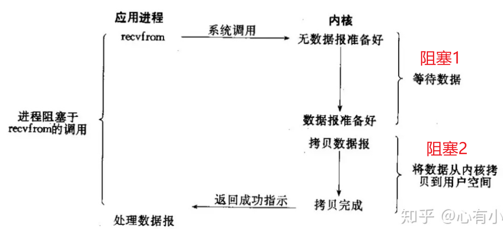

该函数面临两个阻塞过程：

- 等待数据：底层的报文可能未接收完整（如一个UDP分组被IP分包，还未递交完成；TCP分组失序等）
- 将数据从内核拷贝到用户空间：因为应用程序只能访问用户内存，无法访问内核内存。

### 非阻塞IO

非阻塞I/O 不管是否成功获取/发送数据，都会立马获取结果，如果没有成功获取/发送数据的话、则可以选择不间断的循环重试，但是我们整个应用程序不会实现阻塞。

以`socket.readfrom()`为例：

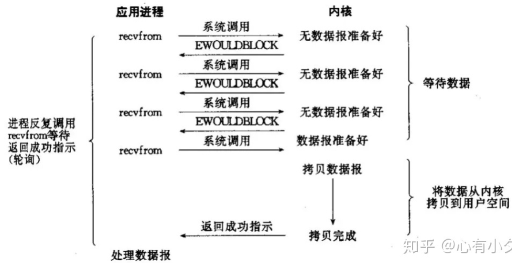

在没有数据准备好时，函数将直接返回，应用程序可以继续选择做其它事情，之后再继续尝试`readfrom()`来读取数据，直到读取成功（在把内核数据拷贝到用户空间时还是会阻塞）。

> 相比于阻塞IO来说，非阻塞IO可能增加响应时延、降低吞吐量，但是可以同时执行其他任务。

### 多路复用IO

**为什么需要多路复用IO？**

如果采用传统的阻塞/非阻塞IO模型：

- 阻塞IO：如果服务端面临大量客户端连接，需要创建大量线程来处理连接；当对应连接上暂时没有数据可读，线程需要阻塞在read上，造成资源浪费。
- 非阻塞IO：非阻塞模型下也同样需要大量线程高频率轮训读取数据，服务器压力巨大！

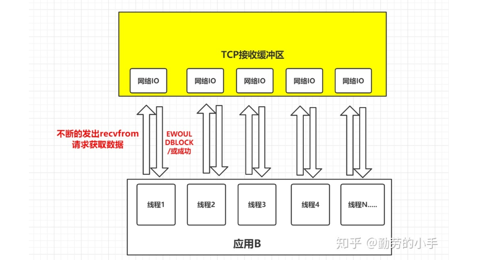

**多路复用IO的基本思想？**

由一个线程监控多个网络请求（我们后面将称为fd文件描述符，linux系统把所有网络请求以一个fd来标识），这样就可以**只需要一个或几个线程就可以完成数据状态询问的操作**，当有数据准备就绪之后再分配对应的线程去读取数据，这么做就可以节省出大量的线程资源出来，这个就是IO复用模型的思路。

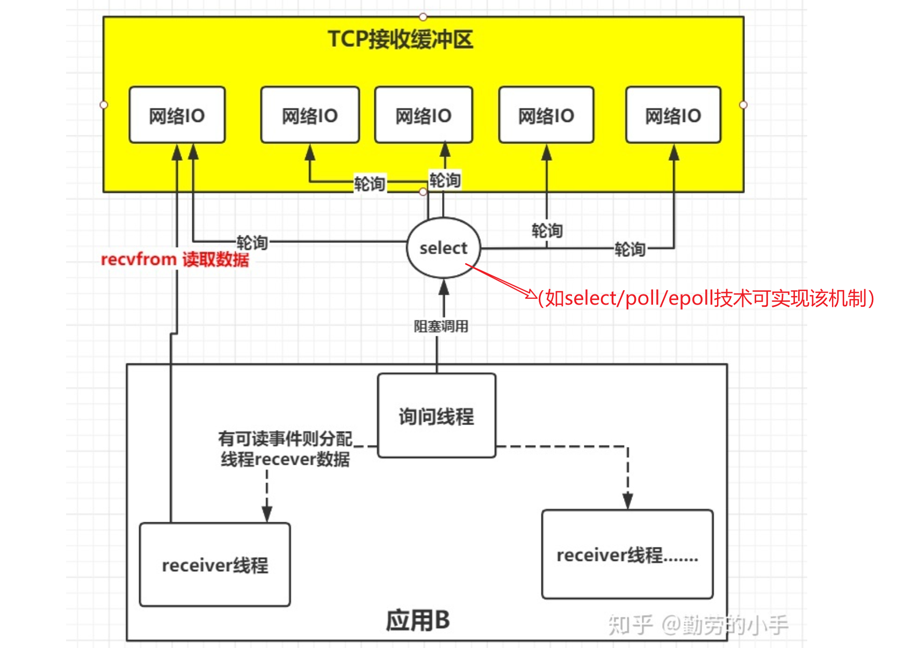

如上图所示：询问线程利用`select`操作（可以是阻塞/非阻塞的）可以同时监控多个fd（网络IO），当有网络IO可操作时，则分配对应的处理线程进行IO操作（读取/发送等），这样可以大大减少系统压力。

以利用`select`监控多个套接字读取数据为例：

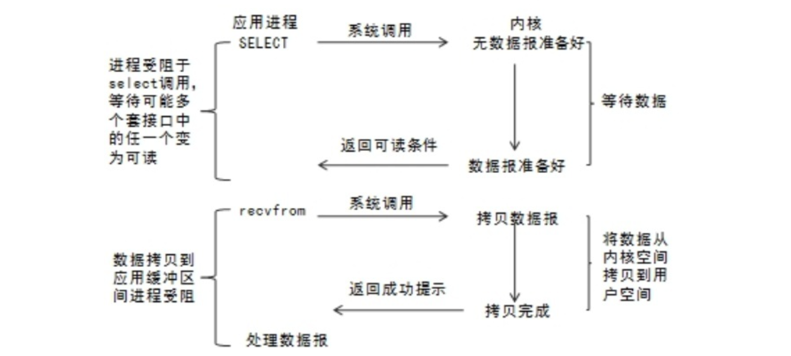

> 从流程上来看，使用select函数进行IO请求和同步阻塞模型没有太大的区别，甚至还多了添加监视socket，以及调用select函数的额外操作，效率更差。但是，使用select以后最大的优势是用户可以在一个线程内同时处理多个socket的IO请求。用户可以注册多个socket，然后不断地调用select读取被激活的socket，即可达到在**同一个线程内同时处理多个IO请求的目的**。而在同步阻塞模型中，必须通过多线程的方式才能达到这个目的。

### 信号驱动IO

多路复用IO模型实现了一个线程监控多个网络IO的功能，但是其中的`select`机制要求应用程序不断轮训以实现对多个FD的及时监控。大部分时候可能轮训都是无效的，于是产生了信号驱动的IO模型——当**FD可操作（有数据读取、缓存区空闲可以发数据）时主动通知应用程序！**

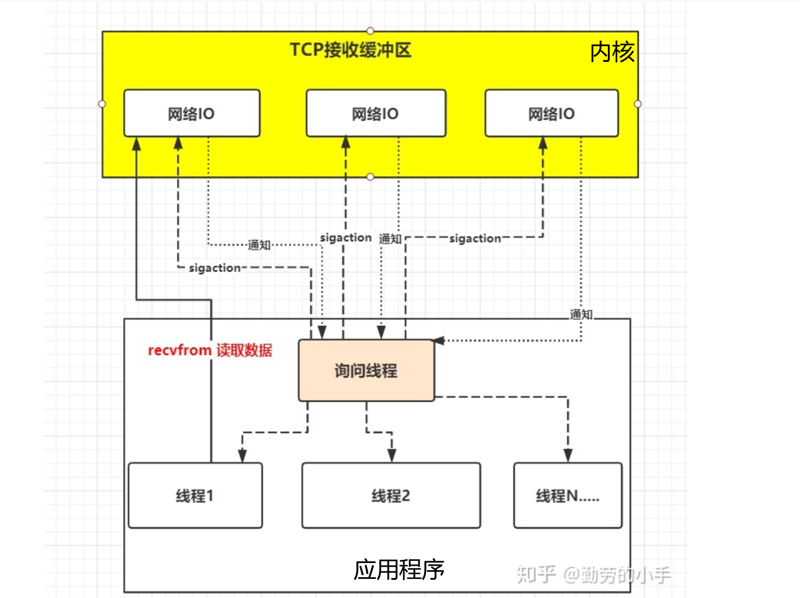

在信号驱动的IO模型下，应用程序通过调用`sigaction`和内核中的网络IO建立信号联系（注册一个信号处理函数到内核中）后立即返回，当内核准备好数据/准备好缓冲区时，利用信号通知应用程序（调用应用程序的信号处理函数），应用程序再调用`recvfrom/send`函数来进行下一步操作（读取/发送数据）。

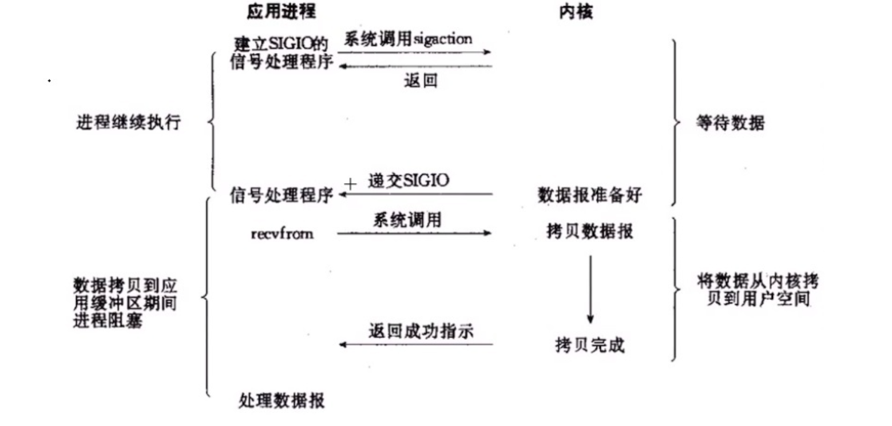

这种是可以避免大量无效的轮训，在发起对各个FD的监控请求后只需等待通知即可。

### 异步IO

信号驱动的IO模型虽然解决了`select`机制中大量无效轮训的问题，但是依旧需要执行两个步骤才能完成IO操作，如在读取数据时，应用程序首先需要接受来自内核的信号，然后再主动调用`readfrom`函数来读取内核中的数据。

为了实现一劳永逸的操作，异步IO模型诞生了——应用只需要向内核发送一个read请求 / send请求+待发送的数据，告诉内核它要读取/发送数据后即刻返回；内核收到请求后会建立一个信号联系，当数据准备就绪（如果是send请求则为数据发送完毕），内核会主动把数据从内核复制到用户空间（如果是send请求则是把数据从用户空间拷贝到内核空间），等所有操作都完成之后，内核会发起一个通知（回调）告诉应用（如果是read请求则在通知中将携带接收到的数据），我们称这种模式称为异步IO模型。

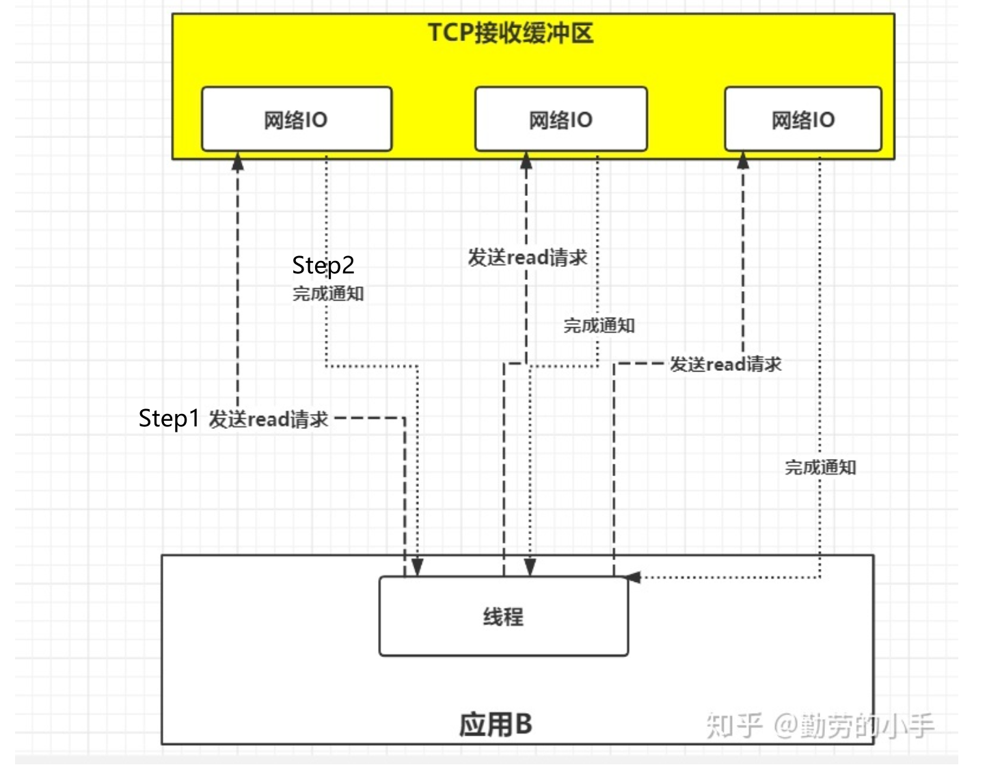

> 异步IO模型 与 信号驱动模型的主要区别在于：
>
> - 信号驱动IO只是由内核通知我们何时可以开始下一个IO操作，而异步IO模型是由内核通知我们操作什么时候完成（数据在内核与用户空间之间拷贝完成了）。
> - 信号驱动IO的两个阶段一个非阻塞（获取通知）、一个阻塞（内核——用户空间之间的数据拷贝），而异步IO的两个阶段都是非阻塞的。

以`readfrom`为例：

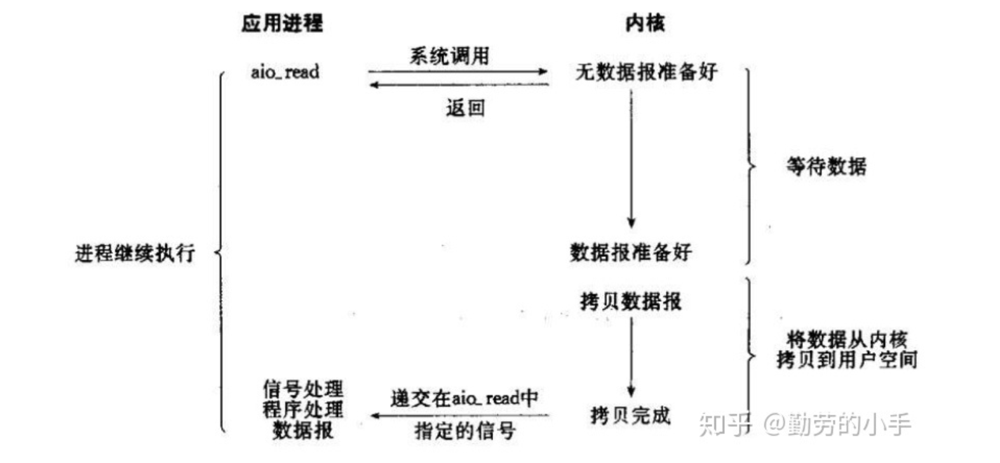

### 五大IO模型对比

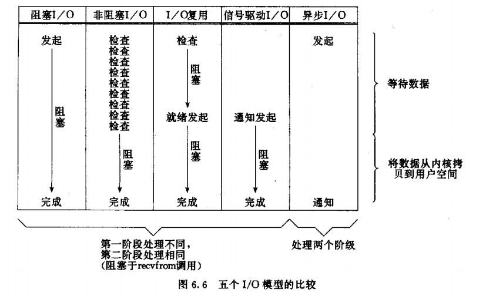

（1）阻塞 I/O 模型：阶段一和阶段二用户进程都处于阻塞状态，效率最低，适用于并发量低的小型网站，是Java BIO 的基础；

（2）非阻塞 I/O 模型：阶段一用户进程处于非阻塞态，但应用进程需不断轮询内核空间数据是否准备好，消耗大量 CPU 时间；阶段二用户进程处于非阻塞态；

（3）I/O 复用模型：阶段一和阶段二用户进程都处于阻塞状态，但其以较少的代价同时监听多个 文件描述符，效率较高，适用于并发高的大中型网站，Java NIO 是实现 I/O 复用模型的基础；

（4）信号驱动 I/O 模型：阶段一用户进程处于非阻塞态，阶段二用户进程处于阻塞态，目前应用较少；

（5）异步 I/O 模型：阶段一和阶段二用户进程都处于非阻塞状态，效率最高，但异步 I/O 模型在 Linux 2.6 版本才被引入，到现在仍未成熟。

## 2 操作系统的select、poll、epoll机制

`select`、`poll`、`epoll`实际上是实现 [多路复用IO模型](# 多路复用IO) 的三种系统调用，本质都是同步IO（因为在监控到读写事件后，依旧需要用阻塞函数read/write来进行同步阻塞读写）。

### select

**基本原理**：监控多个FD，底层采用bitmap记录每个FD的状态，最大可监控1024/2048个FD（从效率上考虑、所以做了限制）。每次监控需要遍历所有FD（时间复杂度`O(N)`），获取结果后，还需要用户对所有FD挨个判断是否为有事件的FD，又需要遍历一遍`O(N)`。

**缺点**：

- **拷贝**：每次调用select，都需要把监视对象（FD集合）传递给操作系统，即把fd集合从用户态拷贝到内核态，这个开销在fd很多时会很大。（见代码示例【标记点1】）
- **遍历**：同时每次调用select都需要遍历所有fd，这个开销在fd很多时也很大。（见代码示例【标记点2】）
- **数量限制**：select支持的文件描述符数量太小了，默认是1024（`linux/posix_types.h`中宏定义的值）

**底层原理**：

参考：[epoll的本质](https://zhuanlan.zhihu.com/p/63179839)

在调用select时，会把当前进程放入所有需要监控的套接字的等待队列中（用户空间-->内核空间），网卡收到数据后利用DMA将数据放到缓存区后，触发CPU中断，CPU唤醒对应套接字的等待线程（等待队列-->工作队列）。


**编码实例**：

```c
int main()
{
	SOCKET s, sock;
	socket_list sock_list;		//套接字管理队列
	struct sockaddr_in ser_addr, remote_addr;
	WSAData wsa;
	char *buf;
	int len, total_len, total_sendlen, retval;
	int BufLen;
	int BufFlag;   //malloc是否申请成功的标志
	fd_set readfds, writefds, exceptfds;
	unsigned long arg;

	packet_buf *head;

	WSAStartup(0x101, &wsa);

	//---------获取接收缓存大小------------------
	printf("请输入单片接收缓存大小(0表示自适应大小)：");
	scanf("%d", &BufLen);
	if (BufLen > 0) {
		//需要空间较大时，使用malloc申请动态内存
		buf = (char *)malloc(BufLen);
		if (buf == NULL) {
			printf("内存不够\n");
			return 0;
		}
		BufFlag = 1;
	}
	else {
		BufFlag = 0;
		buf = NULL;
	}

	s = socket(AF_INET, SOCK_STREAM, 0);
	ser_addr.sin_family = AF_INET;
	ser_addr.sin_addr.S_un.S_addr = inet_addr("127.0.0.1");
	ser_addr.sin_port = htons(12345);
	bind(s, (sockaddr*)&ser_addr, sizeof(ser_addr));

	listen(s, 200);

	init_list(&sock_list);
	sock_list.MainSock = s;

	total_len = 0;
	total_sendlen = 0;

	//设置套接字为非阻塞状态
	arg = 1;
	ioctlsocket(sock_list.MainSock, FIONBIO, &arg);

	while (1) {
		//清空各个队列
		FD_ZERO(&readfds);
		FD_ZERO(&writefds);
		FD_ZERO(&exceptfds);
		//把所有套接字加入队列
		make_fdlist(&sock_list, &readfds);
		make_fdlist(&sock_list, &writefds);
		make_fdlist(&sock_list, &exceptfds);

		retval = select(0, &readfds, &writefds, &exceptfds, NULL);// 【标记点1】
		if (retval == SOCKET_ERROR) {
			retval = WSAGetLastError();
			printf("select error %d\n", retval);
			break;
		}

		//查看主套接字上是否产生新的连接
		if (FD_ISSET(sock_list.MainSock, &readfds)) {
			len = sizeof(remote_addr);
			sock = accept(sock_list.MainSock, (sockaddr*)&remote_addr, &len);
			if (sock == SOCKET_ERROR)
				continue;
			printf("accept a connection\n");
			insert_list(sock, &sock_list);
		}

		//查看从接套接字的状态     
		for (int i = 0; i < MAX_CLIENTS; i++) {   // 【标记点2】
			if (sock_list.sock_array[i].s == 0)
				continue;

			sock = sock_list.sock_array[i].s;

			//收到数据包
			if (FD_ISSET(sock, &readfds)) {
				if (BufFlag == 0) {
					//自适应大小，根据待接收大小决定缓冲大小
					ioctlsocket(sock, FIONREAD, (unsigned long *)&len);
					if (len > 0) {
						if (buf != NULL) {
							//free(buf);
							buf = NULL;
						}
						buf = (char*)malloc(len);
						if (buf == NULL) {
							printf("没有足够内存\n");
							continue;    //没有取走数据，下一次还有select事件么？？？
						}
						//接收数据
						len = recv(sock, buf, len, 0);
					}
				}
				else {
					//使用固定大小缓存接收数据
					buf = (char*)malloc(BufLen);
					len = recv(sock, buf, BufLen, 0);
				}

				if (len == 0) {
					/*返回值为0说明另一端已经关闭连接
					必须将套接字从接收队列中取下来！否则不关闭就会不断有read事件。*/
					closesocket(sock);
					printf("Recv返回0，关闭套接字%d！\n", sock);
					delete_list(sock, &sock_list);
					//printf("recv0发生过 %d 次无法及时发出的现象\n", pending_count);
					continue;
				}
				else if (len == -1) {
					retval = WSAGetLastError();
					//为何recv返回WSAEWOULDBLOCK？？？？？-----------------待补充
					if (retval == WSAEWOULDBLOCK) {
						continue;
					}
					closesocket(sock);
					printf("close a socket\n");
					delete_list(sock, &sock_list);
					continue;
				}
				//将接收数据写入缓冲队列中
				add_buf(sock, &sock_list, buf, len);
				//buf[len] = 0;
				total_len += len;
				printf("接收 %d 字节，累计接收 %d 字节\n", len, total_len);
			}

			//套接字可写
			if (FD_ISSET(sock, &writefds)) {
				if ((head = check_buf(sock, &sock_list)) != NULL) {
					retval = send(sock, head->buf, head->size, 0);
					//对方关闭连接或者发送出错
					if (retval <= 0) {
						retval = WSAGetLastError();
						closesocket(sock);
						printf("send0 error code：%d, close a socket\n", retval);
						//printf("相关变量信息buf地址 %p ,len: %d\n", buf, len);
						delete_list(sock, &sock_list);
						continue;
					}

					//默认发送成功则全部发送----待完善检测----？？？？？
					total_sendlen += retval;
					delete_buf(sock, &sock_list);	//发送成功后释放对应的缓冲区
					printf("发送 %d 字节，共发送 %d 字节\n", retval, total_sendlen);
				}
			}

			//套接字异常
			if (FD_ISSET(sock, &exceptfds)) {
				closesocket(sock);
				printf("sock is in exceptfds, close a socket\n");
				delete_list(sock, &sock_list);
				continue;
			}
		}
	}

	return 0;
}
```

### poll

和`select`类似，只是底层采用链表记录FD状态，突破监控FD的数量限制。

### epoll

epoll主要使用以下第三个函数来解决`select`存在的问题：

```c
struct epoll_event
{
    __uint32_t events;	// 事件类型：如EPOLLIN/EPOLLOUT/EPOLLRDHUB/EPOLLET/EPOLLONESHOT分别表示 可读/可写/半关闭/水平触发/边缘触发 事件；如果要同时监控多种事件，可以采用或运算如 xxx.events = EPOLLIN|EPOLLOUT;
    epoll_data_t data;
}

typedef union epoll_data
{
    void * ptr;
    int fd;	// socket文件描述符
    __uint32_t u32;
    __uint64_t u64;
} epoll_data_t;

/*
 * @brief 创建保存epoll文件描述符的保存空间(epoll例程).
 * @param size 向操作系统建议的大值
 * @return 成功返回epoll例程描述符，失败返回-1
 */
int epoll_create(int size);	

/*
 * @brief 向epoll空间注册/消耗文件描述符
 * @param epfd epoll例程的描述符(epoll_create()创建的)
 * @param op EPOLL_CTRL_ADD/DEL/MOD 分别表示添加/删除/修改
 * @param fd 监视对象的socket文件描述符
 * @param event 监视对象的事件类型
 * @return 成功返回0，失败返回-1
 */
int epoll_ctl(int epfd, int op, int fd, struct epoll_event * event); 

/*
 * @brief 和select功能类似
 * @param epfd epoll例程的描述符(epoll_create()创建的)
 * @param events [OUT]会被写入发生事件的文件描述符集合
 * @param maxevents events申请的大小
 * @param timeout 阻塞超时时间，-1表示等待到有事件发生为止
 * @return 成功返回events的有效大小(发生事件的文件描述符个数)，失败返回-1
 */
int epoll_wait(int epfd, struct epoll_event * events, int maxevents, int timeout);
```

- **增量式更新需要监控的FD**：使用`epoll_ctrl()`将用户需要监控的FD和对应的事件放到内核的事件表中（由`epoll_create()`创建的epoll例程），这是一种**增量式更新**，无需和select一样每次都拷贝全部FD到内核中；
- **红黑树存储监控FD+链表存储有事件的FD**：所有FD在内核cache中以红黑树的形式存储，支持快速查找和删除、插入（避免重复添加）；在内核cache里建了个红黑树用于存储以后epoll_ctl传来的fd外，还会再建立一个list链表用于存储准备就绪的事件，内核检测到有事件发生则自动将FD加入到链表中【回调机制】。

> 红黑树中每个成员由描述符值和所要监控的文件描述符指向的文件表项的引用等组成。

- **只关注有事件的FD**：当`epoll_wait()`调用时，仅仅观察list链表里有没有数据即可，有数据就返回（链表中的FD到写入到入参events中，list.size直接返回），没有数据就sleep，等到timeout时间到后即使链表没数据也返回。
- **共享内存而不是拷贝**：`epoll_wait()`返回时，将有事件的FD通过共享内存的方式传递到用户空间，无需拷贝。

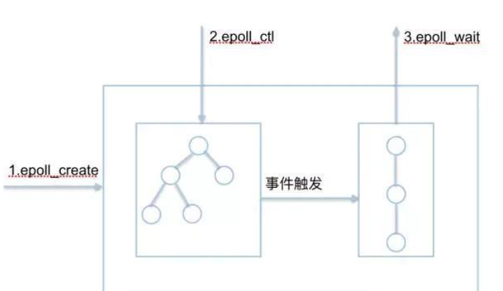

epoll有**条件触发**和**边缘触发**两种工作模式：

- **水平触发LT**：当所监控的FD有读写事件时，epoll_wait()会通知处理程序去读写。如果处理程序**未把缓存区的数据读完，则会一直通知**，如果系统中有大量你不需要读写的就绪文件描述符，而它们每次都会返回，这样会大大降低处理程序检索自己关心的就绪文件描述符的效率！！！
- **边缘触发ET**：当所监控的FD有读写事件时，epoll_wait()会通知处理程序去读写。如果处理程序未把缓存区的数据读完，直到FD**有新的读写事件出现才会进行下一次通知**，这种模式比水平触发效率高，系统不会充斥大量你不关心的就绪文件描述符！！！

> 使用场景：
>
> - 对于读事件而言，总体而言, 采用水平触发方式较好。应用程序在读取数据时，可能会一次无法读取全部数据，边沿触发在下一次可能不会触发。如果能够保证一次读取缓存的全部数据，可以采用边沿触发，效率更高（用户/内核切换次数更少）, 但同时编程复杂度也高（先要判断是否有足够数据，不够则等待）。
>
> - 对于写事件，一般采用边缘触发，因为频繁关注可写事件会大量消耗CPU。当客户端服务端采用短连接或者采用长连接但发送的数据量比较少时(例如: Redis), 采用水平触发即可。当客户端与服务端是长连接并且数据写入的量比较大时(例如: nginx), 采用边沿触发, 因为边沿触发效率更高。

### 三者对比

- 表面上看epoll的性能最好，但是在连接数少并且连接都十分活跃的情况下，select和poll的性能可能比epoll好，毕竟epoll的通知机制需要很多函数回调。

- select低效是因为每次它都需要轮询，如果服务端比较少，且考虑代码兼容性（Windows Linux均支持），可以使用它。

### 参考

- [彻底搞懂epoll高效运行的原理](https://baijiahao.baidu.com/s?id=1641172494287388070&wfr=spider&for=pc)
- [socket中的epoll及I/O复用总结](https://blog.csdn.net/wk_bjut_edu_cn/article/details/80669310?utm_medium=distribute.pc_relevant.none-task-blog-BlogCommendFromMachineLearnPai2-7.control&dist_request_id=c8aa95a3-8152-43aa-bea8-55a97baf347a&depth_1-utm_source=distribute.pc_relevant.none-task-blog-BlogCommendFromMachineLearnPai2-7.control)
- [IO多路复用之select、poll、epoll详解](https://www.cnblogs.com/jeakeven/p/5435916.html)

## 3 JAVA提供的BIO、NIO、AIO模型

JAVA提供的三种IO机制是对操作系统提供的IO模型的进一步封装。程序员在使用这些 API 的时候，不需要关心操作系统层面的知识，也不需要根据不同操作系统编写不同的代码。只需要使用Java的API就可以了。

### BIO（同步阻塞IO）

BIO 就是传统的 [java.io](https://link.zhihu.com/?target=http%3A//java.io/) 包，它是基于流模型实现的，交互的方式是**同步、阻塞**方式，也就是说在读入输入流或者输出流时，在读写动作完成之前，线程会一直阻塞在那里，它们之间的调用是可靠的线性顺序。

- **优点**：它的有点就是代码比较简单、直观；
- **缺点**： I/O 的效率和扩展性很低，容易成为应用性能瓶颈；服务端针对每一个连接都需要开启一个新线程来处理。
- **适用场景**：适合用在活动连接数较少的场景中。活动连接多的时候需要频繁切换线程。

以TCP C/S为例：

```java
// 服务端程序
public class TcpServer {
    public static void main(String[] args) throws IOException {
        ServerSocket serverSocket = new ServerSocket(8888);
        while (true) {
            try {
                Socket socket = serverSocket.accept();	// accept是阻塞操作
                // 创建新的处理线程
                new Thread(() -> {
                    try {
                        int len;
                        byte[] data = new byte[1024];
                        InputStream inputStream = socket.getInputStream();
                        // 按字节流方式读取数据
                        while ((len = inputStream.read(data)) != -1) {	// read是阻塞操作
                            System.out.println(new String(data, 0, len));
                        }
                    } catch (IOException e) {
                        e.printStackTrace();
                    }
                }).start();
            } catch (IOException e) {
                e.printStackTrace();
            }
        }
    }
}
```

```java
// 客户端程序
public class TcpClient {
    public static void main(String[] args) throws InterruptedException {
        int MAX_NUM = 5;
        Runnable task = new Runnable() {
            @Override
            public void run() {
                Socket socket = null;
                try {
                    socket = new Socket("127.0.0.1", 8888);
                    // 周期性发送数据到服务端
                    while (true) {
                        socket.getOutputStream().write(("msg from " + Thread.currentThread().getId() + "!").getBytes());	// write是阻塞操作
                        Thread.sleep(2000);
                    }
                } catch (Exception e) {
                    e.printStackTrace();
                }
            }
        };
        for (int i = 0; i < MAX_NUM; i++) {
            new Thread(task).start();
            Thread.sleep(1000);
        }
    }
}
```

最终服务端打印日志：

```text
msg from 20!
msg from 21!
msg from 20!
msg from 22!
msg from 21!
msg from 23!
msg from 22!
...
```

> BIO适用于同时活动连接数较少的情况（如小于1000）。

### NIO（同步非阻塞IO）

NIO 是 Java 1.4 引入的 java.nio 包，提供了 `Channel`、`Selector`、`Buffer `等新的抽象，可以构建**多路复用**的、**同步非阻塞** IO 程序，同时提供了更接近操作系统底层高性能的数据操作方式。

- **优点**：性能更高，单个线程可以处理多个IO请求，减少线程间的切换。
- **缺点**：原生编程相对复杂。
- **适用场景**：适合用在存在大量活动连接时。

**Buffer**

NIO面向缓冲区/块而不是面向流，进行读写操作时都是和缓存区打交道而不是直接和流。

面向流的方式每次需要处理一格或者多个字节，而面向块则一次性可以处理一块数据（取决于buffer的大小），缓冲区的IO操作是由底层操作系统实现的，效率较高。

**Selector + Channel**

Selector用于使用单个线程处理多个通道。因此，它需要较少的线程来处理多个通道。线程之间的切换对于操作系统来说是昂贵的。 因此，为了提高系统效率选择器是有用的。（多路复用机制）

NIO 通过Channel（通道） 进行读写。通道是双向的，可读也可写，而流的读写是单向的。无论读写，通道只能和Buffer交互。因为 Buffer，通道可以异步地读写。

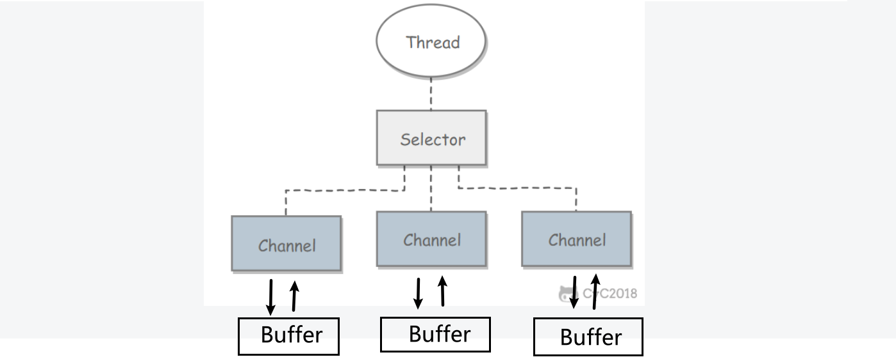

举例：

```java
public class NioServer {
    public static void main(String[] args) throws IOException {
        // 1. serverSelector负责轮询是否有新的连接，服务端监测到新的连接之后，不再创建一个新的线程，
        // 而是直接将新连接绑定到clientSelector上，这样就不用 IO 模型中 1w 个 while 循环在死等
        Selector serverSelector = Selector.open();
        // 2. clientSelector负责轮询连接是否有数据可读
        Selector clientSelector = Selector.open();
		
        // 处理serverSelector中的事件
        new Thread(() -> {
            try {
                // 对应IO编程中服务端启动
                ServerSocketChannel listenerChannel = ServerSocketChannel.open();
                listenerChannel.socket().bind(new InetSocketAddress(8888));
                listenerChannel.configureBlocking(false);
                listenerChannel.register(serverSelector, SelectionKey.OP_ACCEPT);

                while (true) {

                    // 监测是否有新的连接，这里的1指的是阻塞的时间为 1ms
                    if (serverSelector.select(1) > 0) {
                        Set<SelectionKey> set = serverSelector.selectedKeys();
                        Iterator<SelectionKey> keyIterator = set.iterator();

                        while (keyIterator.hasNext()) {
                            SelectionKey key = keyIterator.next();

                            if (key.isAcceptable()) {
                                try {
                                    // (1)
                                    // 每来一个新连接，不需要创建一个线程，而是直接注册到clientSelector
                                    SocketChannel clientChannel = ((ServerSocketChannel) key.channel()).accept();
                                    clientChannel.configureBlocking(false);
                                    clientChannel.register(clientSelector, SelectionKey.OP_READ);	// 要求监控读事件
                                } finally {
                                    keyIterator.remove();
                                }
                            }
                        }
                    }
                }
            } catch (IOException ignored) {
            }
        }).start();
		
        // 处理clientSelector中的事件
        new Thread(() -> {
            try {
                while (true) {
                    // (2) 批量轮询是否有哪些连接有数据可读，这里的1指的是阻塞的时间为 1ms
                    if (clientSelector.select(1) > 0) {
                        Set<SelectionKey> set = clientSelector.selectedKeys();
                        Iterator<SelectionKey> keyIterator = set.iterator();

                        while (keyIterator.hasNext()) {
                            SelectionKey key = keyIterator.next();
                            if (key.isReadable()) {
                                try {
                                    SocketChannel clientChannel = (SocketChannel) key.channel();
                                    ByteBuffer byteBuffer = ByteBuffer.allocate(1024);

                                    // (3) 面向 Buffer
                                    clientChannel.read(byteBuffer);
                                    byteBuffer.flip();    // 切换读写
                                    System.out.println(Charset.defaultCharset().newDecoder().decode(byteBuffer).toString());
                                } finally {
                                    keyIterator.remove();
                                    key.interestOps(SelectionKey.OP_READ);
                                }

                            }
                        }
                    }
                }
            } catch (IOException ignored) {

            }
        }).start();
    }
}
```

> NIO适合用在并发量大的情况下。
>
> NIO底层基于epoll，原生编程相当复杂，一般采用Netty框架（基于NIO）来做。

### AIO（异步非阻塞IO）

AIO 是 Java 1.7 之后引入的包，是 NIO 的升级版本，提供了**异步非阻塞的 IO** 操作方式，所以人们叫它 AIO（Asynchronous IO），异步 IO 是**基于事件和回调机制**实现的，也就是应用操作之后会直接返回，不会堵塞在那里，当后台处理完成（如数据已经从内核中拷贝到了用户空间/数据已经内从内核发出去了），操作系统会通知相应的线程进行后续的操作。

> NS3中的Socket API就是一种AIO的机制。

## 4 Reactor（Netty使用的）IO 模型

针对传统传统阻塞I/O服务模型的2个缺点，比较常见的有如下解决方案：

- 基于I/O复用模型：多个连接共用一个阻塞对象，应用程序只需要在一个阻塞对象上等待，无需阻塞等待所有连接。当某条连接有新的数据可以处理时，操作系统通知应用程序，线程从阻塞状态返回，开始进行业务处理。
- 基于线程池复用线程资源：不必再为每个连接创建线程，将连接完成后的业务处理任务分配给线程进行处理，一个线程可以处理多个连接的业务。

### 4.1 Reactor基本思想

<font color="red">**I/O复用结合线程池，这就是Reactor模式基本设计思想。**</font>

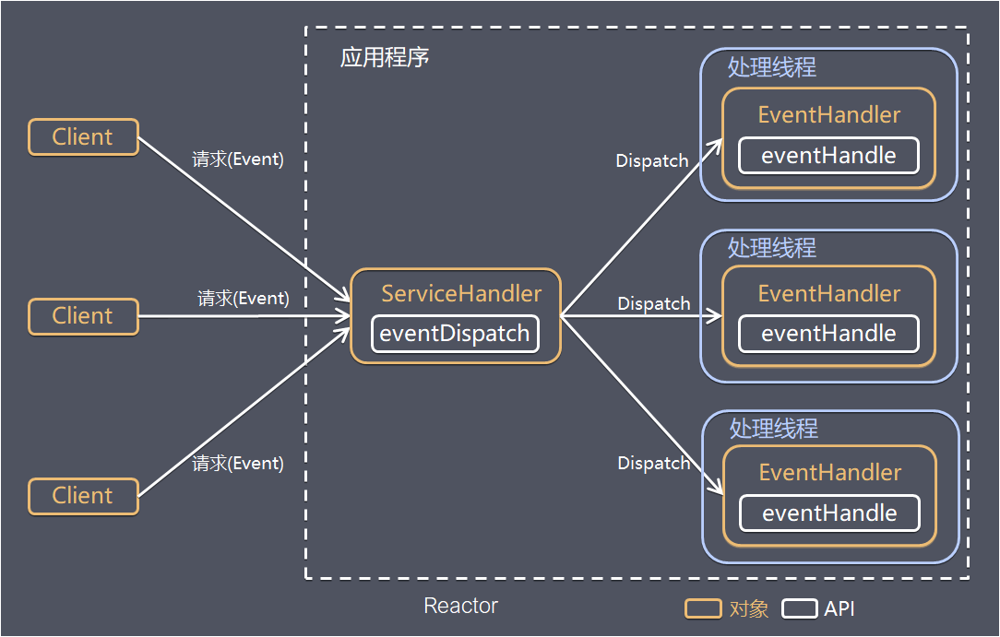

**Reactor模式，是指通过一个或多个输入同时传递给服务处理器的服务请求的事件驱动处理模式**。 服务端程序处理传入多路请求，并将它们同步分派给请求对应的处理线程，Reactor模式也叫Dispatcher模式，即I/O多了复用统一监听事件，收到事件后分发(Dispatch给某进程)，是编写高性能网络服务器的必备技术之一。

### 4.2 Reactor模型构成

- **Reactor：** Reactor在一个单独的线程中运行，负责监听和分发事件，分发给适当的处理程序来对IO事件做出反应。 它就像公司的电话接线员，它接听来自客户的电话并将线路转移到适当的联系人。

- **Handlers** ：处理程序执行I/O事件要完成的实际事件，类似于客户想要与之交谈的公司中的实际官员。Reactor通过调度适当的处理程序来响应I/O事件，处理程序执行非阻塞操作

### 4.3 Reactor模型实现

根据Reactor的数量和处理资源池线程的数量不同，有3种典型的实现：

#### 4.3.1 单Reactor单线程

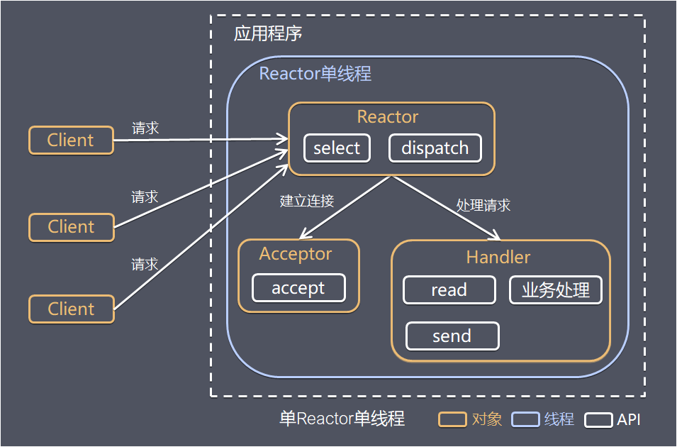

其中，select是前面**I/O复用模型**介绍的标准网络编程API，可以实现应用程序通过一个阻塞对象监听多路连接请求，其他方案示意图类似。

**方案说明**

- Reactor对象通过select监控客户端请求事件，收到事件后通过dispatch进行分发
- 如果是建立连接请求事件，则由Acceptor通过accept处理连接请求，然后创建一个Handler对象处理连接完成后的后续业务处理
- 如果不是建立连接事件，则Reactor会分发调用连接对应的Handler来响应
- Handler会完成read->业务处理->send的完整业务流程

**优点**

 模型简单，没有多线程、进程通信、竞争的问题，全部都在一个线程中完成

**缺点**

- 性能问题：只有一个线程，无法完全发挥多核CPU的性能 Handler在处理某个连接上的业务时，整个进程无法处理其他连接事件，很容易导致性能瓶颈
- 可靠性问题：线程意外跑飞，或者进入死循环，会导致整个系统通信模块不可用，不能接收和处理外部消息，造成节点故障

**使用场景**

 客户端的数量有限，业务处理非常快速，比如Redis，业务处理的时间复杂度O(1)

#### 4.3.2 单Reactor多线程

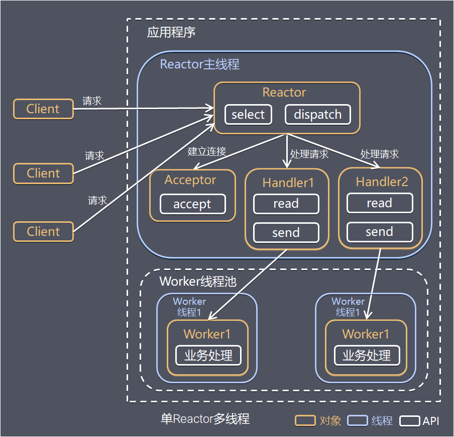

**方案说明**

- Reactor对象通过select监控客户端请求事件，收到事件后通过dispatch进行分发
- 如果是建立连接请求事件，则由Acceptor通过accept处理连接请求，然后创建一个Handler对象处理连接完成后的续各种事件
- 如果不是建立连接事件，则Reactor会分发调用连接对应的Handler来响应
- Handler只负责响应事件，不做具体业务处理，通过read读取数据后，会分发给后面的Worker线程池进行业务处理
- Worker线程池会分配独立的线程完成真正的业务处理，如何将响应结果发给Handler进行处理
- Handler收到响应结果后通过send将响应结果返回给client

**优点**

 可以充分利用多核CPU的处理能力

**缺点**

- 多线程数据共享和访问比较复杂
- Reactor承担所有事件的监听和响应，在单线程中运行，高并发场景下容易成为性能瓶颈

#### 4.3.3 多Reactor多线程

针对单Reactor多线程模型中，Reactor在单线程中运行，高并发场景下容易成为性能瓶颈，可以让Reactor在多线程中运行

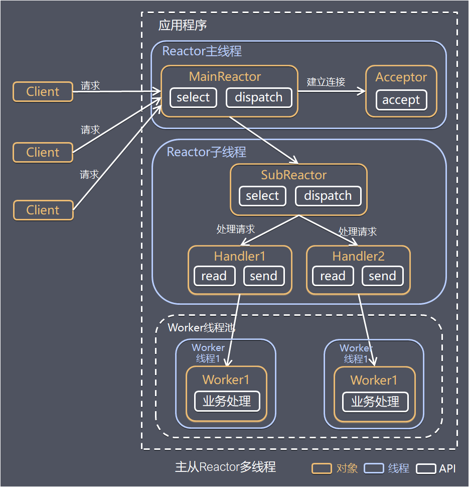

**方案说明**

- Reactor主线程MainReactor对象通过select监控建立连接事件，收到事件后通过Acceptor接收，处理建立连接事件
- Accepto处理建立连接事件后，MainReactor将连接分配Reactor子线程给SubReactor进行处理
- SubReactor将连接加入连接队列进行监听，并创建一个Handler用于处理各种连接事件
- 当有新的事件发生时，SubReactor会调用连接对应的Handler进行响应
- Handler通过read读取数据后，会分发给后面的Worker线程池进行业务处理
- Worker线程池会分配独立的线程完成真正的业务处理，如何将响应结果发给Handler进行处理
- Handler收到响应结果后通过send将响应结果返回给client

**优点**

- 父线程与子线程的数据交互简单职责明确，父线程只需要接收新连接，子线程完成后续的业务处理
- 父线程与子线程的数据交互简单，Reactor主线程只需要把新连接传给子线程，子线程无需返回数据

这种模型在许多项目中广泛使用，包括Nginx主从Reactor多进程模型，Memcached主从多线程，Netty主从多线程模型的支持。

### 4.4 总结

3种模式可以用个比喻来理解： 餐厅常常雇佣接待员负责迎接顾客，当顾客入坐后，侍应生专门为这张桌子服务

- 单Reactor单线程： 接待员和侍应生是同一个人，全程为顾客服务
- 单Reactor多线程： 1个接待员，多个侍应生，接待员只负责接待
- 主从Reactor多线程： 多个接待员，多个侍应生

Reactor模式具有如下的优点：

- 响应快，不必为单个同步时间所阻塞，虽然Reactor本身依然是同步的
- 编程相对简单，可以最大程度的避免复杂的多线程及同步问题，并且避免了多线程/进程的切换开销；
- 可扩展性，可以方便的通过增加Reactor实例个数来充分利用CPU资源
- 可复用性，Reactor模型本身与具体事件处理逻辑无关，具有很高的复用性

> Reactor是非阻塞同步IO模型！！！

# 十三、集合

### 1 HashMap实现原理

主要从**底层存储结构、构造方法、`PUT()`方法、`GET()`方法、扩容机制**几个方面来说。

<font color="blue">**------------------JKD 1.8以前-----------------------**</font>

#### 存储结构

采用数组+链表的方式来存储键值对（拉链法解决哈希冲突）。

#### 构造方法

构造方法中主要涉及两个参数：

- initialCapacity：初始容量，值HashMap中能存储的最多的键值对数量，必须是2^N（因为后续是采用&来进行下标运算而不是%），默认16
- loadFactor：加载因子，用于扩容，loadFactor * initialCapacity就是扩容阈值，默认0.75f

#### `PUT()`方法

往HashMap中插入元素主要分为以下几个步骤：

- 利用`key.hashCode()`值计算一个`hash`值（重新加入扰动，减少冲突）

- 利用`hash`值计算下标（`hash & table.size - 1`）

  ```java
  static int hash(int h) {
      // 做四次移位亦或
      h ^= (h >>> 20) ^ (h >>> 12);
      return h ^ (h >>> 7) ^ (h >>> 4);
  }
  
  // 1.8中只做了一次 (h = key.hashCode()) ^ (h >>> 16);
  ```

- 如果数组下标对应位置没有元素则直接插入；否则遍历上面的链表，如果找到相同（`hash值相等 && (key地址相等 || equals相同)`）的key则替换旧value，如果没有则将新元素**插入链表头部**

#### `GET()`方法

-  利用`key.hashCode()`值计算一个`hash`值（重新加入扰动，减少冲突）
- 利用`hash`值计算下标（`hash & table.size - 1`）
- 遍历该下标中的链表，直到找到相同的`key`（key.hash == hash && (key == this.key || key.equals(this.key))）即可返回对应的`value`

> key为null时直接存在数组第一个位置。

#### 扩容机制

在`PUT()`方法中，如果在使用头插法插入新节点前，发现HashMap容量超过阈值，则需要先执行扩容，扩容的步骤如下：

- 构造一个两倍大小的数组
- 遍历旧的数组，将上面的链表中的元素**挨个**迁移（重新计算下标值）到新数组中（旧下标为index，新下标为index或oldSize+index），同样采用头插法

<font color="red">容量超过1<<30后（即1073741824）则扩容不再增大两倍，直接保持为2^31-1（Integer.MAX_VALUE）不再改变。</font>

<font color="blue">**---------------------------JKD 1.8以后--------------------------**</font>

- 构造方法不变。
- 底层结构改为采用**数组+红黑树/链表**的形式（**链表长度大于8则变成红黑树，红黑树节点数小于6则退化成链表**）。
- PUT方法中采用**尾插法**（如果链表还未变成红黑树） ，根据节点类型不同采用不同的插入方式
- 扩容机制为**先插入，后扩容**，和1.7相反；数据迁移方式为将链表/红黑树（内部也含有双链表结构，数组大小必须大于64，否则只会扩容不会树化）拆分成两个单链表，**一次性迁移**两个单链表。

#### HashMap线程安全问题

**数据丢失：**

- **并发赋值被覆盖：** 在 `createEntry` 方法中，新添加的元素直接放在头部，使元素之后可以被更快访问，但如果两个线程同时执行到此处，会导致其中一个线程的赋值被覆盖。
- **已遍历区间新增元素丢失：** 当某个线程在 `transfer` 方法迁移时，其他线程新增的元素可能落在已遍历过的哈希槽上。遍历完成后，table 数组引用指向了 newTable，新增元素丢失。
- **新表被覆盖：** 如果 `resize` 完成，执行了 `table = newTable`，则后续元素就可以在新表上进行插入。但如果多线程同时 `resize` ，每个线程都会 new 一个数组，这是线程内的局部对象，线程之间不可见。迁移完成后`resize` 的线程会赋值给 table 线程共享变量，可能会覆盖其他线程的操作，在新表中插入的对象都会被丢弃。

<font color="red">**死循环：**</font>

HashMap在put的时候，插入的元素超过了阈值的范围就会触发扩容操作，如果多个线程同时在执行`transfer()`时可能成循环链表，导致在get时会出现死循环，所以HashMap是线程不安全的。

<font color="blue">如何实现线程安全的HashMap呢？</font>

- <font color="green">调用`put()`/`get()`等操作前加锁，所有map的所有操作共用一个锁。</font>
- <font color="green">用`Collections.synchroizedMap(new HashMap<>())`得到线程安全的Map实例（内部对传入HashMap做包装，每次调用hashmap操作前都使用`synchronized`做加锁）</font>
- <font color="green">使用线程安全的容器来替代如`HashTable`/`ConcurrentHashMap`</font>

### 2 ConcurrentHashMap实现原理

HashMap在并发是存在数据覆盖、数据丢失（扩容时插入元素）、循环链表等问题（两个线程同时扩容）等安全问题，所以需要一个支持线程安全的容器：`ConcurrentHashMap`！

主要从**底层存储结构、构造方法、`PUT()`方法、`GET()`方法、扩容机制**几个方面来说。

----------------JDK 1.8 以前----------------

#### 存储结构

采用Segment数组来存储（JDK1.7中HashMap的数组+链表的结构），相当于是数组嵌套数组，一个Segment支持一个线程访问（分段锁，Segment继承了`ReentrantLock`）。

#### 构造方法

构造方法中主要涉及两个参数：

- initialCapacity：初始容量，值HashMap中能存储的最多的键值对数量，必须是2^N（因为后续是采用&来进行下标运算而不是%），默认16
- loadFactor：加载因子，用于扩容，loadFactor * initialCapacity就是扩容阈值，默认0.75f

- concurrencyLevel：并发级别（Segment数组的长度），必须是2^N，默认16

#### `PUT()`方法

- 利用`key.hashCode()`值计算一个`hash`值（重新加入扰动，减少冲突）
- 利用`hash`值计算Segment下标值`j`
- 如果对应Segment数组下标`j`没有元素则创建并CAS自旋写入Segment元素（拷贝s0）
- 先尝试非阻塞对Segment**加锁**，多次失败后开始阻塞加锁，**插入新节点**（过程和HashMap一致），**解锁**

#### `GET()`方法

get方法**无需加锁**，只需利用哈希值计算两次下标后遍历链表即可。读操作只能保证**弱一致性**（value采用volatile修饰，保证线程可见性）。

#### 扩容机制

支持多线程**协助扩容**，每个线程都会被分配到相应的迁移桶任务。

#### `size()`方法

- 先不加锁，对所有Segment.size进行两次累加统计
- 如果两次累加统计结果一致则结果正确直接返回；不一致（尝试三次）则对每一个Segement加锁后再次统计即可得到正确值

----------------JDK 1.8 以后----------------

- **底层结构**：抛弃Segment结构，直接采用 数组+链表/红黑树 的方式存储元素；
- 针对每一个数组元素上的链表/红黑树进行加锁（**粒度更细**）；使用*CAS*+`synchronized`来保证并发安全性。

### 3 JDK1.8为什么使用红黑树？

- 使用红黑树，避免哈希冲突链表过长时影响插入/查询的效率；红黑树节点小于6时退化成链表，降低红黑树维护成本
- **AVL树是严格平衡**的二叉树，深度比红黑树小，查找速度快，但是维护平衡（旋转）的代价更高、插入/删除慢；红黑树插入/删除效率比AVL树高（调整平衡最多需要两次旋转），性能相对折中，所以选红黑树。
- **不用二叉查找树**：因二叉查找树如果在key值递增或递减的情况下会退化成链表，查找效率低。
- **不用B/B+树**：适合文件系统？减少IO次数

### 4 HashMap和HashTable的区别

- **底层实现**：两者底层实现相似，JDK1.8之后HashMap改用数组+红黑树，而HashTable依旧保持数组+链表

- **线程安全性**：HashMap线程不安全（可能造成数据丢失、循环链表、数据覆盖等问题），HashTable线程安全（所有方法均采用`syncronized`修饰）

- **效率**：HashTable效率低，因为每个操作都需要加解锁。

- **哈希计算**：HashMap会对key对象的`hashCode`重新进行`hash`（高16为亦或低16位），而HashTable直接使用`hashCode()`。

- **`null`键的支持**：HashMap支持`null`键，而HashTable不支持。

  > HashTable中计算元素下标时要用到`key.hashCode()`方法 ：`int hash = key.hashCode()`，比较对象是否相等要用到`key.equals()`方法，所以不允许key为空。
  >
  > HashMap中计算元素下标时会对重新`hash(key)`， 其中内部如果发现`key==null`则返回0，且在调用`key.euqasl()`进行比较之前会先判断`key!=null`，所以可以支持`key`为`null`的情况。

- **迭代器**：HashMap 的迭代器是 fail-fast 迭代器（迭代过程中如果modCount发生变化则报`ConcurrentModificationException`）;

> Java 5提供了ConcurrentHashMap，它是HashTable的替代，比HashTable的扩展性更好。

### 5 ArrayList和Vector原理

**ArrayList**

- **底层结构**：数组`Object[]] elementData`
- **构造方法**：只需传入`capacity`参数，默认大小为10
- **扩容**：每次添加元素前会检查空间是否足够，不够则调用`grow()`进行扩容：
  - 将源数组扩容1.5倍（`int newCapacity = oldCapacity + (oldCapacity >> 1)`）
  - 将旧数据拷贝到新数组中`Arrays.copyOf(elementData, newCapacity)`

**Vector**

底层实现和`ArrayList`一致，只是所有方法前加了一个`synchronized`实现同步。

### 6 ArrayList和LinkedList区别

- 底层机构：
- 插入数据：
- 删除/修改数据：

# 其它面试题

### 1 Java和C++的区别？

- **指针**：Java中没有指针，C++中有；
- **多继承**：Java不支持多继承（支持多接口实现），C++支持多继承；
- **垃圾回收**：Java有自动GC，C++需要显式释放内存。

### 2 ClassNotFoundException和 NoClassDefFoundError区别

#### ClassNotFoundException

使用`Class.forName()/loadClass()/findSystemClass()`方法来动态加载类（传入全类名），如果该类的路径没有被找到，这个时候就会抛出`ClassNotFoundException`。该异常可以被用户捕获。

> 编译时依赖的类（jar包）在运行环境机器中不存在（属于无法处理的Error，程序Crash）。

#### NoClassDefFoundError

如果JVM或者Classloader实例尝试加载类(或者new创建对象)却找不到类的定义，要查找的类在编译时期是存在，运行期间却找不到该对象对应的类，这个时候就会导致`NoClassDeFoundError`错误。该错误不能被用户捕获。

> 在生产环境出现的原因通常是由于依赖jar包多版本存在，或者jar包升级类或者方法不再提供。

# 参考资料

- Eckel B. Java 编程思想[M]. 机械工业出版社, 2002.
- Bloch J. Effective java[M]. Addison-Wesley Professional, 2017.