 # 数据结构和算法

<!-- GFM-TOC -->

* [一、 排序算法](#一-排序算法)
   * [1. 简单选择排序](#1-简单选择排序)
   * [2. 冒泡排序](#2-冒泡排序)
   * [3. 插入排序](#3-插入排序)
   * [4. 希尔排序](#4-希尔排序)
   * [5. 快速排序](#5-快速排序)
   * [6. 归并排序](#6-归并排序)
   * [7. 堆排序](#7-堆排序)
   * [8. 计数排序](#8-计数排序)
   * [9. 桶排序](#9-桶排序)
   * [总结](#总结)
   * [相关面试题](#相关面试题)
      * [1 Arrays.sort()使用了什么排序算法？](#1-arrayssort使用了什么排序算法)
   * [参考](#参考)
* [二. 查找算法](#二-查找算法)
   * [1. 哈希查找](#1-哈希查找)
   * [2. 二分查找](#2-二分查找)
      * [2.1 标准写法：](#21-标准写法)
      * [2.2 变种写法](#22-变种写法)
            * [<strong>寻找左侧边界的二分查找</strong>](#寻找左侧边界的二分查找)
            * [<strong>寻找右侧边界的二分查找</strong>](#寻找右侧边界的二分查找)
      * [2.3 相关题目](#23-相关题目)
      * [2.4 总结](#24-总结)
      * [2.5 参考](#25-参考)
      * [3. 旋转数组](#3-旋转数组)
         * [3.1 查找最小值](#31-查找最小值)
         * [3.2 查找指定值](#32-查找指定值)
* [三、快速幂算法](#三快速幂算法)
* [四、字符串匹配算法](#四字符串匹配算法)
   * [1. Brute-Force暴力算法](#1-brute-force暴力算法)
   * [2. KMP算法](#2-kmp算法)
      * [KMP实现](#kmp实现)
      * [快速构建PMT表/Next数组](#快速构建pmt表next数组)
      * [注意](#注意)
   * [3. 参考](#3-参考)
* [五、数据结构](#五数据结构)
   * [1. 二叉树](#1-二叉树)
      * [递归法先、中、后序遍历](#递归法先中后序遍历)
      * [迭代法先、中、后序遍历](#迭代法先中后序遍历)
   * [2. 二叉查找/搜索树](#2-二叉查找搜索树)
   * [3. 红黑树](#3-红黑树)
      * [3.1 定义](#31-定义)
      * [3.2 操作](#32-操作)
         * [插入](#插入)
         * [删除](#删除)
      * [3.3 代码实现](#33-代码实现)
         * [节点定义](#节点定义)
         * [平衡调整](#平衡调整)
         * [左/右旋](#左右旋)
      * [3.4 相关面试问题](#34-相关面试问题)
         * [为什么要有红色/黑色。](#为什么要有红色黑色)
         * [为什么插入节点默认红色。](#为什么插入节点默认红色)
         * [红黑树和AVL树的对比？](#红黑树和avl树的对比)
   * [平衡二叉树/AVL树](#平衡二叉树avl树)
   * [4. B树](#4-b树)
   * [5. B+树](#5-b树)
   * [6. 字典/Trie树](#6-字典trie树)
   * [7. 堆](#7-堆)
      * [7.1 结构](#71-结构)
      * [7.2 属性](#72-属性)
      * [7.3 操作及其复杂度](#73-操作及其复杂度)
         * [7.3.1 原始操作](#731-原始操作)
         * [7.3.2 O(log n)复杂度的操作](#732-olog-n复杂度的操作)
         * [7.3.3 其它操作](#733-其它操作)
      * [7.4 堆和二叉搜索树的区别](#74-堆和二叉搜索树的区别)
      * [7.5 堆代码实现](#75-堆代码实现)
   * [8. 并查集](#8-并查集)
      * [8.1 结构](#81-结构)
      * [8.2 操作](#82-操作)
         * [8.2.1 初始化](#821-初始化)
         * [8.2.2 查询](#822-查询)
         * [8.2.3 合并](#823-合并)
         * [8.2.4 基于路径压缩的优化合并](#824-基于路径压缩的优化合并)
         * [8.2.5 按秩合并](#825-按秩合并)
   * [3. 参考](#3-参考-1)
* [六、海量数据处理相关](#六海量数据处理相关)
   * [BitMap](#bitmap)
   * [Bloom Filter](#bloom-filter)
   * [归并（分治）](#归并分治)
   * [堆](#堆)
* [七、智力题](#七智力题)
* [八.其它常见算法](#八其它常见算法)
   * [1 洗牌算法](#1-洗牌算法)
   * [2 抽奖算法](#2-抽奖算法)
   * [3 单例模式](#3-单例模式)
   * [4 生产者消费者模式](#4-生产者消费者模式)
   * [5 rand7 / rand10相互生成【待完成】](#5-rand7--rand10相互生成待完成)
   * [6 foo 函数，返回0/1的概率分别为60%/40%，如何利用 foo 函数实现等概返回 0/1 的函数](#6-foo-函数返回01的概率分别为6040如何利用-foo-函数实现等概返回-01-的函数)

<!-- Created by https://github.com/ekalinin/github-markdown-toc -->

# 一、 排序算法


## 1. 简单选择排序

依次找出最小、次小、次次小...的元素然后依次放入数组的第一个、第二个、第三个...位置。
具体过程如下图所示：


算法循环次数为`(n-1) + (n-2) + (n-3) + ... + 1 = n(n-1)/2`，所以时间复杂度为`O(n^2)`，空间复杂度为`O(1)`。

```java
public static void selectionSort(int[] nums) {
    for (int i = 0; i < nums.length - 1; i++) {
        int minValueIndex = i;
        for (int j = i + 1; j < nums.length; j++) {
            if (nums[j] < nums[minValueIndex]) {
                minValueIndex = j;
            }
        }
        swap(nums, i, minValueIndex);
    }
}
```


## 2. 冒泡排序

从头开始，两两比较大小，大的元素往后移动，一轮遍历后最大的元素将排在最后；接下来再次遍历，将把次大的元素放在倒数第二个位置；依次循环下去直到全部排序完成。
具体过程如下图所示：


算法循环次数为`(n-1) + (n-2) + (n-3) + ... + 1 = n(n-1)/2`，所以时间复杂度为`O(n^2)`，空间复杂度为`O(1)`.

```java
public static void bubbleSort(int[] nums) {
    for (int i = nums.length - 1; i > 0; i--) {
        for (int j = 0; j < i; j++) {
            if (nums[j] > nums[j + 1]) {
                swap(nums, j, j + 1);
            }
        }
    }
}
```

> 可以通过设置标志位来提前结束冒泡过程，如果某一趟冒泡中没有发生元素交换，则证明排序结束。

## 3. 插入排序

依次从数组第二个元素（第一个元素可以认为已经完成插入）开始，向前两两比较大小，如果大于前面的元素，则直接完成插入；否则往前移动，继续向前两两比较直到找到正确的插入位置。
具体过程如下图所示：


时间复杂度为`O(n^2)`，空间复杂度为`O(1)`.

```java
public static void insertSort(int[] nums) {
    for (int i = 1; i < nums.length; i++) { // 第一个元素不需要插入, 单个元素可以认为是已经排序好了
        for (int j = i; j > 0; j--) {
            if (nums[j - 1] > nums[j]) {
                swap(nums, j - 1, j);
            } else {
                break;
            }
        }
    }
}
```


## 4. 希尔排序

希尔排序也是一种插入排序，它是简单插入排序经过改进之后的一个更高效的版本，也称为缩小增量排序，同时该算法是冲破O(n2）的第一批算法之一。

对于大规模的数组，插入排序很慢，因为它只能交换相邻的元素，每次只能将逆序数量减少 1。希尔排序的出现就是为了解决插入排序的这种局限性，它通过交换不相邻（间隔为gap）的元素，每次可以将逆序数量减少大于 1。

具体如果如下图所示：

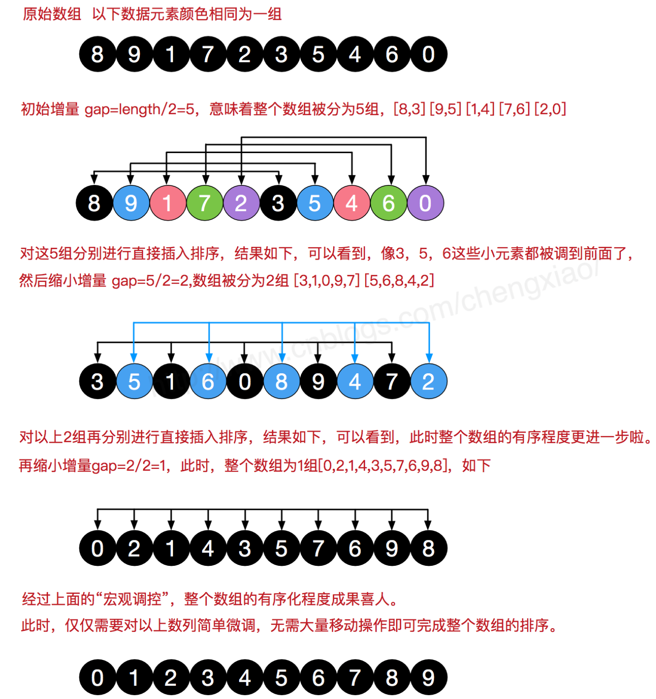

希尔排序中对于增量序列（gap序列）的选择十分重要，直接影响到希尔排序的性能。我们上面选择的增量序列`{n/2,(n/2)/2...1}`(希尔增量)，其最坏时间复杂度依然为`O(n^2)`，一些经过优化的增量序列如Hibbard经过复杂证明可使得最坏时间复杂度为`O(n^1.5)`。空间复杂度为`O(1)`。

```java
public static void shellSort(int[] nums) {
    // 依次分...8,4,2,1组, 组内采用插入排序, 使得宏观有序-->整体有序
    // gap序列：gap = nums.length / 2; gap = gap / 2;
    for (int gap = nums.length / 2; gap > 0; gap /= 2) {
        // 每一组都按照插入排序的规则来完成排序(多个分组交替执行, i = gap属于第1组的第2个元素, gap+1表示第2组第2个元素...)
        for (int i = gap; i < nums.length; i++) {
            for (int j = i; j >= gap; j -= gap) {
                if (nums[j - gap] > nums[j]) {
                    swap(nums, j - gap, j);
                } else {
                    break;
                }
            }
        }
    }
}
```


## 5. 快速排序

快速排序分为以下几个步骤：

- Step1 选取任意数字作为中心轴
- Step2 将小于中心轴的数字移到中心轴左边，大于中心轴的数字移动中心轴右边
- Step3 将中心轴左右的数组递归执行Step1/2(递归，直到数组子序列长度为1时则完成该子序列的排序)

**双边循环法**

[演示视频](https://www.bilibili.com/video/BV1at411T75o/)

<iframe src="//player.bilibili.com/player.html?aid=62621532&bvid=BV1at411T75o&cid=108813206&page=1" scrolling="no" border="0" frameborder="no" framespacing="0" allowfullscreen="true"> </iframe>

具体代码实现为：

```java
public static void quickSort(int[] nums) {
    sort(nums, 0, nums.length - 1);
}

// 递归写法=====
private static void sort(int[] nums, int startIndex, int endIndex) {
    if (startIndex >= endIndex) {
        return; // 递归终止条件: 排序区间长度为1
    }
	// 切分排序并获取中心轴的位置
    int pivotIndex = partition(nums, startIndex, endIndex);
    // 将中心轴两侧的子区间继续递归排序
    sort(nums, startIndex, pivotIndex - 1);
    sort(nums, pivotIndex + 1, endIndex);
}

// 迭代写法===
private static void sort(int[] nums, int start, int end) {
    Stack<Integer> stack = new Stack<>();
    if(start <  end) {
        stack.push(end);
        stack.push(start);
        while(!stack.isEmpty()) {
            int l = stack.pop();
            int r = stack.pop();
            int index = partition(nums,l,r);
            if(l < index-1) {
                stack.push(index-1);
                stack.push(l);
            }
            if(r > index+1) {
                stack.push(r);
                stack.push(index+1);
            }
        }
    }
}

// 切分排序
private static int partition(int[] nums, int startIndex, int endIndex) {
    swap(nums, startIndex, startIndex + new Random().nextInt(endIndex - startIndex + 1));	// 随机交换第一个元素
    int pivot = startIndex; // 中心轴坐标直接设置吃最左边(已经随机化了)
    int pivotValue = nums[pivot];   // 中心轴的值
    int left = startIndex, right = endIndex;
    while (left != right) {
        while (left < right && nums[right] >= pivotValue) {
            right--;
        }
        while (left < right && nums[left] <= pivotValue) {
            left++;
        }
        if (left != right) {
            swap(nums, left, right);
        }
    }
    swap(nums, pivot, left);    // 将中心轴数字移到正确的位置, swap(nums, pivot, right)也是一样的
    return left;    // 返回中心轴的正确位置, return right也是一样的
}

// 交换数组中两个元素
private static void swap(int[] nums, int i, int j) {
    int temp = nums[i];
    nums[i] = nums[j];
    nums[j] = temp;
}
```

> **为什么要右指针先动？**
>
> - 最终需要交换中心轴和left/right指针执指向的元素`swap(nums, pivot, left/right)`（该元素不能大于中心轴坐标）
> - 只有右指针先动才能保证上述结果

**单边循环法【推荐】**

- 首先选取中心轴`pivot`（可以直接选起始元素）
- 设置一个`mark`指针指向起始元素，该指针代表**小于中心轴元素的区域边界**
- 从中心轴元素的下一个位置开始遍历数组
  - 如果遍历到的元素大于等于中心轴元素，则继续往后遍历
  - 如果遍历到元素小于中心轴元素，则`mark`指针右移一位，交换`mark`指针指向的元素和当前遍历到的元素（此时小于中心轴元素的区域扩大了1）
- 重复上述步骤直到数组遍历结束

示意图距离如下所示：

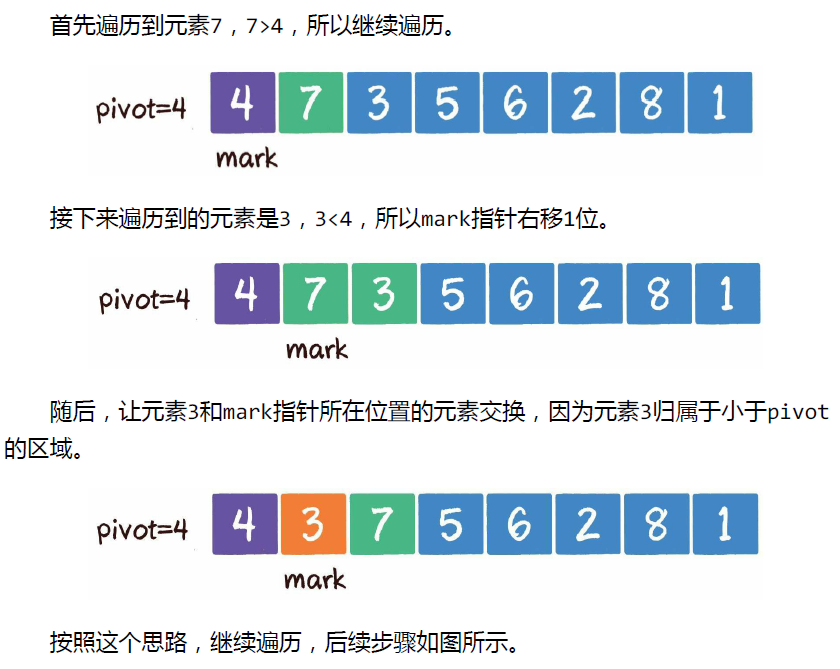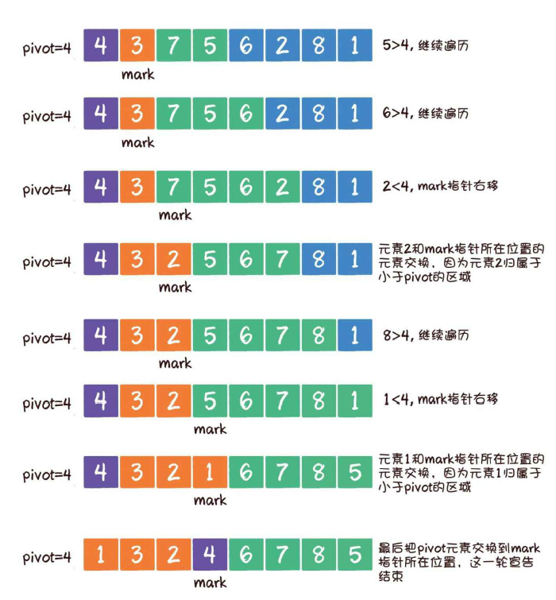


具体代码实现为（只有切分排序函数不同，其余和双边循环法完全一致）：

```java
// 切分排序
private static int partition(int[] nums, int startIndex, int endIndex) {
    swap(nums, startIndex, startIndex + new Random().nextInt(endIndex - startIndex + 1)); // 随机交换第一个元素
    int pivot = startIndex, mark = startIndex;	// 初始化中心轴和mark指针(指向小于中心轴元素的区域边界)
    int pivotValue = nums[pivot];
    for (int i = mark + 1; i <= endIndex; i++) {
        if (nums[i] < pivotValue) {
            swap(nums, i, ++mark);
        }
    }
    swap(nums, pivot, mark);	// 此时mark指针指向中心轴元素的正确位置
    return mark;
}
```

**复杂度总结**

- 时间复杂度

  - `O(nlogn)`：每一轮比较都需要遍历一次数组中的所有元素，时间复杂度是`O(n)`，由于采用切分的方式，所以需要平均需要执行`log(2, n)`轮切分，所以最终快速排序的平均时间复杂度`O(nlogn)`；
  - `O(n^2)`：最坏的情况下：每次选取的中心轴值均为最大值/最小值，则排序退化成，时间复杂度为`O(n^2)`。
- 空间复杂度
  - `O(logn)`：平均递归深度为`O(log(2, n))`；
  - `O(N)`：最坏情况下递归深度达到`O(N)`。

> 快速排序是原地排序，不需要辅助数组，但是递归调用需要辅助栈。
>
> 快速排序最好的情况下是每次都正好将数组对半分，这样递归调用次数才是最少的。这种情况下复杂度为 `O(NlogN)`。
>
> 最坏的情况下，第一次从最小的元素切分，第二次从第二小的元素切分，如此这般。因此最坏的情况下需要比较 `N^2/2`。为了防止数组最开始就是有序的，在进行快速排序时需要随机打乱数组。

## 6. 归并排序

利用分治的思想，将待排序数组分成两组，将两组数组内部完成排序，然后合并两个有序数组形成完整的排序数组。
具体过程如下图所示：

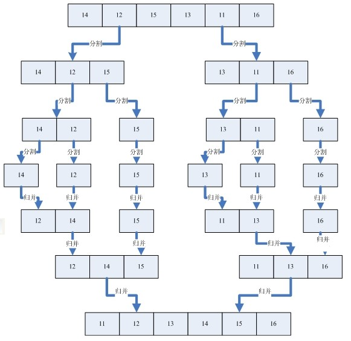

具体代码实现如下所示：

```java
/**
 * 两路归并排序
 *
 * @param nums 待排序数组
 */
public static void mergeSort(int[] nums, int left, int right) {
    if (left >= right) {
        return; // 区间长度为1, 无序排序
    }

    int mid = left + (right - left) / 2;
    mergeSort(nums, left, mid);
    mergeSort(nums, mid + 1, right);
    merge(nums, left, mid, right);
}

/**
  * 合并两个已排序子数组
  *
  * @param nums  原始数组(包含已排序部分)
  * @param left  已排序的子数组1的起始坐标
  * @param mid   已排序的子数组1的结尾坐标/已排序的子数组2的起始坐标-1
  * @param right 已排序的子数组2的结尾坐标
  */
private static void merge(int[] nums, int left, int mid, int right) {
    int[] sortedNums = new int[right - left + 1];   // 临时存储合并后的数组
    int p = left, q = mid + 1;  // 双指针分别指向子数组1和2的起始位置
    int index = 0;  // 指向合并后的数组中的可填充位置
    while (p <= mid && q <= right) {
        if (nums[p] <= nums[q]) {
            sortedNums[index] = nums[p++];
        } else {
            sortedNums[index] = nums[q++];
        }
        index++;
    }

    // 将某一个子数组中剩下对的元素一次性转移(下面两种情况只可能发生一种)
    while (p <= mid) {
        sortedNums[index++] = nums[p++];
    }
    while (q <= right) {
        sortedNums[index++] = nums[q++];
    }

    // 将排序好的数字复制到原始数组中
    for (int i = 0; i < sortedNums.length; i++) {
        nums[left++] = sortedNums[i];
    }
}
```

时间复杂度`O(nlogn)`，空间复杂度`O(n)`(合并排序数组时需要申请额外的数组空间来存储已经排序好的数据)。

## 7. 堆排序

- 首先利用数组构建堆：将所有非叶子节点执行 **下沉** 操作即可；时间复杂度度为`O(N)`。

- 然后依次将堆顶节点和最后一个有效元素交换位置，此时原堆顶节点作为新的无效元素放在数组尾部，将新的堆顶元素执行 **下沉操作** ，循环上述交换过程直到全部变成无效元素，此时数组变成一个递增序列；时间复杂度为`O(NlogN)`。

具体代码实现如下所示：

```java
public static void heapSort(int[] nums) {
    heapify(nums);
    int heapSize = nums.length;
    while (heapSize > 0) {
        swap(nums, 0, --heapSize);  // 将堆顶元素放到数组尾部, 最终形成升序序列
        shiftDown(nums, 0, heapSize);
    }
}

private static void heapify(int[] nums) {
    // 把所有的非叶子结点下沉即可
    for (int i = (nums.length >>> 1) - 1; i >= 0; i--) {
        shiftDown(nums, i, nums.length);
    }
}

private static void shiftDown(int[] nums, int i, int heapSize) {
    int left = i * 2 + 1;   // 左子节点的坐标
    int right = left + 1;   // 右子节点对的坐标
    int largest = i;    // 最大值元素的下标
    // 检查自身以及左右节点，记录其中最大值的下标(如果左右子节点都比自己大, 则选最大的那个做交换, 否则可能还要多交换一次)
    if (left < heapSize && nums[left] > nums[largest]) {
        largest = left;
    }
    if (right < heapSize && nums[right] > nums[largest]) {
        largest = right;
    }
    if (i != largest) {
        swap(nums, i, largest); // 将要下沉的元素和左右子节点中较大的那个交换位置
        shiftDown(nums, largest, heapSize);   // 递归下沉
    }
}

// 交换数组中两个元素
private static void swap(int[] nums, int i, int j) {
    int temp = nums[i];
    nums[i] = nums[j];
    nums[j] = temp;
}
```

堆相关知识参考 [这里](../datastructure/堆.md)


## 8. 计数排序

假设待排序数组`nums`中均为整数，且范围为`Min~Max`，计数排序过程如下：

- 设置打一个大小为`Max-Min+1`的计数数组`count`，来存储待排序数组中数字出现的频率
- 遍历每一个`nums[i]`，并让`count[nums[i]-Min]`计数加一
- 最终遍历`count`数组中的每一个值`count[i]`，输出`count[i]`次数字`Min+i`；遍历完后最终输出的数字序列即为排序好的数字序列。


- 时间复杂度`O(N)`：只需要遍历原始数组一次。
- 空间复杂度`O(N+K)`：`K`表示待排序数组中最大值和最小值的差值，需要一个大小为`N`的数组来存储最终的排序结果，需要一个大小为`K`的数组来存储计数结果。

很明显，计数排序是一种以空间换时间的排序算法，且只能针对整数进行排序；当待排序数组中的最大值和最小值相差很大时，将造成严重的空间浪费！

## 9. 桶排序

桶排序和计数排序的思想类似，只是每一个内可以装一个区间内的数字，桶内需要再进行一次排序。

## 总结

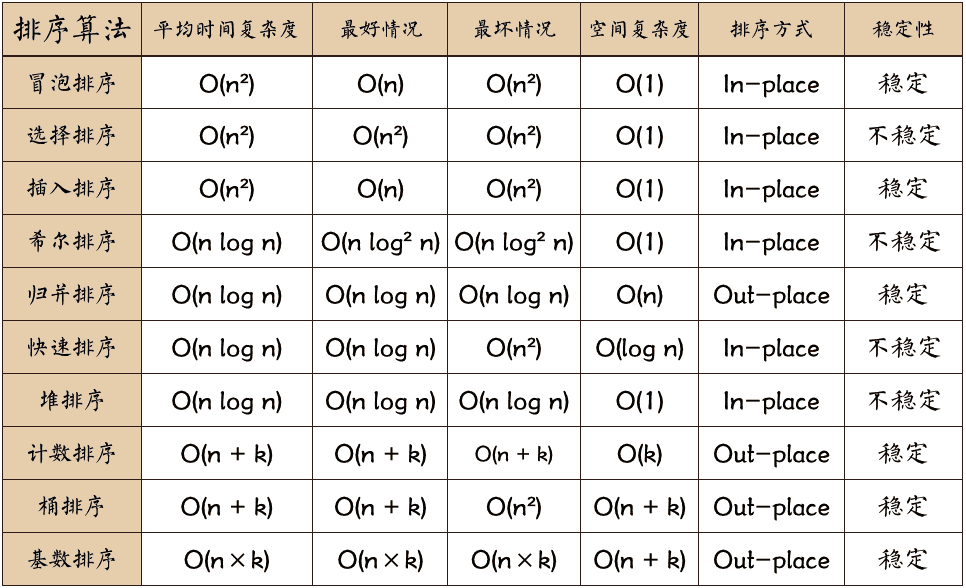

> **只要存在非邻居之间交换节点的排序算法都是非稳定排序算法。**

## 相关面试题

### 1 Arrays.sort()使用了什么排序算法？

使用基于快速排序改进的 **Dual-Pivot Quicksort** 算法，内部会根据数组的具体特征来调用不同的算法（插入、归并、双轴快排）：

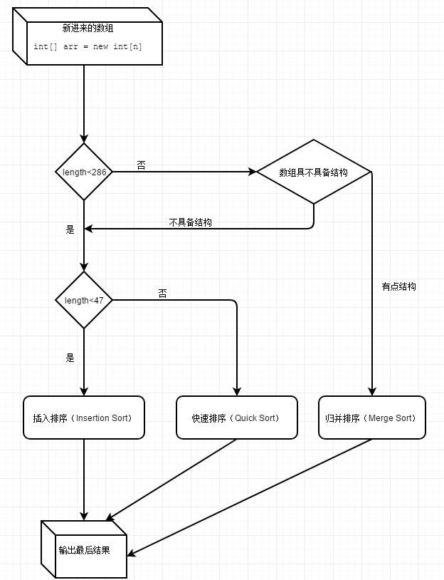

- 小数组（小于47）直接采用插入排序
- 中等大小（大于等于47且小于286）的数组使用快排
- 大数组如果不具备一定结构（如降序子数组个数大于67时称为不具备结构：*遍历原数组，找到降序子数组，并反转成升序*）则使用归并，否则使用快排

## 参考

[十大经典排序算法（动图演示）](https://www.cnblogs.com/onepixel/articles/7674659.html)


# 二. 查找算法

给定某个值，在表中查找确定一个关键字等于该值得数据元素。

## 1. 哈希查找

利用哈希公式计算可以唯一确定元素存储的地址，如果地址产生冲突则使用链表（也有其他冲突避免的方法）来避免冲突。

如何进行冲突避免？待补充！

## 2. 二分查找

适用于有序数组，思想比较简单，每次折半搜索，时间复杂度为O(logN)。具体实现参考 [`Search.java`](file:/D:/学习/教研室/找工作相关/Java算法/JavaAlgorithmTraining/src/main/java/algorithm/Search.java) ，特别需要注意二分查找的**边界问题**。

### 2.1 标准写法：

```java
class Solution {
    public int binarySearch(int[] nums, int target) {
        int left = 0, right = nums.length - 1;
        while (left <= right) { // 退出循环时left=right+1区间内没有任何一个元素,所以要跳出循环
            int mid = left + (right - left)/2;  // 防止溢出           
            if (nums[mid] > target) {
                right = mid - 1;
            } else if (nums[mid] < target) {
                left = mid + 1;
            } else {
                return mid;	// 如果target存在，则一定会进入本分支
            }
        }
        return left;	// target不存在，返回插入位置，也可返回-1表示未找到
    }
}
```

**注意**：

- 上述算法正确运行的前提是**不存在重复元素**，如果存在重复元素，则无法保证最终返回的是重复元素中的哪一个元素的下标。如果`nums`中不存在目标元素，则返回的是target应该插入的位置。
- 为何是`while(left <= right)`？
  - 算法初始化时`right = nums.length - 1`，搜索下标的区间的应该是左闭右闭的[left, right]，因为可能存在更新`left = mid + 1 = right`的情况（*eg：在[0, 2]中找2，此时mid = right = left = 1没有被搜索*就直接认为元素不存在了），所以不能写成`while(left < right)`。
  - 循环退出条件为`left = right+1`，此时可以保证在未找到元素时返回目标元素的正确插入位置（如果目标元素比原始数组中的任何元素都大的话）。
- 如果写成`while(left != right)`，当数组长度为1时，直接无法找到又有效下标（如果是直接返回-1的话）；当数组中没有目标元素时，程序陷入死循环。
- 为何是`mid = left + (right - left)/2`？
  - 如果写成 `mid = (left + right)/2`，左右边界相加可能超过`Integer.MAX_VALUE`导致越界。而`(first + last) / 2 = (2 * first + last - first) / 2 = first + length / 2`， 其中`length = last - first`为区间长度。此时不可能存在越界的情况。

> left从0起始，mid是向下取整，left只在mid遇到 **确定** 小于目标数时才前进一步，left一直在朝着第一个目标数的位置在逼近。永远记住left是对的！！！
>
> 而right的收缩往往是大胆的（如2.2部分），所以right不可取。

### 2.2 变种写法

##### **寻找左侧边界的二分查找**

记住 `# 2.1`最后的原则！此时寻找最左侧的目标值将变得很简单：

```java
class Solution {
    public int binarySearchFirst(int[] nums, int target) {
        int left = 0, right = nums.length - 1;
        while (left <= right) { 
            int mid = left + (right - left)/2;         
            if (nums[mid] >= target) {	// 取等号的时候不能直接返回，因为左边可能还有相同的数字
                right = mid - 1;
            } else {
                left = mid + 1;
            }
        }
        return left;	// 如果target不存在则left表示插入位置
        /*
        if (left != nums.length && nums[left] == target) {
        	return left;
        }
        return -1;	// 表示未找到
        */
    }
}
```

##### **寻找右侧边界的二分查找**

和寻找左侧边界解法类似，只是最终需要返回`right`而不是`left`（因为此时左侧的前进是激进的，右侧是保守的）!如果目标元素不存在，返回的下标没有意义！

```java
class Solution {
    public int binarySearchLast(int[] nums, int target) {
        int left = 0, right = nums.length - 1;

        while (left <= right) {
            int mid = left + (right - left) / 2;
            if (nums[mid] <= target) {
                left = mid + 1;
            } else {
                right = mid - 1;
            }
        }

        return right;
    }
}
```

### 2.3 相关题目

- 基于值的二分查找：参考[leetcode.problem378 有序矩阵中第K小的元素](file:/D:/学习/教研室/找工作相关/Java算法/JavaAlgorithmTraining/src/main/java/leetcode/problem378/KthSmallest.md)

- while循环条件不一定是

  ```
  left <= right
  ```

  ：

  - [leetcode.problem540 有序数组中的单一元素](file:/D:/学习/教研室/找工作相关/Java算法/JavaAlgorithmTraining/src/main/java/leetcode/problem540/SingleNonDuplicate.md)
  - [leetcode.problem278 有序矩阵中第K小的元素](file:/D:/学习/教研室/找工作相关/Java算法/JavaAlgorithmTraining/src/main/java/leetcode/problem278/FirstBadVersion.md)

- 局部有序，旋转数组相关的题目

  - [leetcode.problem33 寻找旋转数组中的元素 I](file:/D:/学习/教研室/找工作相关/Java算法/JavaAlgorithmTraining/src/main/java/leetcode/problem33/SearchInRotatedSortedArray.md)

- 同时寻找左右边界

  - [leetcode.problem34 在排序数组中查找元素的第一个和最后一个位置](file:/D:/学习/教研室/找工作相关/Java算法/JavaAlgorithmTraining/src/main/java/leetcode/problem34/SearchRange.md)

待补充。。。

### 2.4 总结

**while 中到底是 `left < right` 还是 `left <= right` (假定`left=0`,`right=n-1`分别为左右两端元素的下标值)?**

- `left <= right`的循环退出条件为`left = right + 1`, 此时适用于原始数组中午`target`值时可以返回`target`的正确插入位置(`return left`)
- `left < right`的循环退出条件为`left = right`, 此时适用于不允许数组越界访问的情形(因为循环体可能可能存在mid+1可能越界的情况), 此时`return left/right`均可。

### 2.5 参考

- [二分查找有几种写法？它们的区别是什么？ - labuladong的回答 - 知乎](https://www.zhihu.com/question/36132386/answer/712269942)
- [二分查找有几种写法？它们的区别是什么？ - 胖君的回答 - 知乎](https://www.zhihu.com/question/36132386/answer/155438728)
- [不要看 labuladong 的模板和诗，非常误导人 - 在排序数组中查找元素的第一个和最后一个位置](https://leetcode-cn.com/problems/find-first-and-last-position-of-element-in-sorted-array/solution/da-jia-bu-yao-kan-labuladong-de-jie-fa-fei-chang-2/)

### 3. 旋转数组

旋转数组相关题目有以下四个：

- problem33 `中等`: [搜索旋转排序数组](file:/D:/学习/教研室/找工作相关/Java算法/JavaAlgorithmTraining/src/main/java/algorithm/src/main/java/leetcode/problem33/SearchInRotatedSortedArray.md) `other-tags:二分法 旋转数组`
- problem81 `中等`: [搜索旋转排序数组](file:/D:/学习/教研室/找工作相关/Java算法/JavaAlgorithmTraining/src/main/java/algorithm/src/main/java/leetcode/problem81/SearchInRotatedSortedArray2.md) `other-tags:二分法 旋转数组`
- problem153 `中等`: [搜索旋转排序数组中的最小值](file:/D:/学习/教研室/找工作相关/Java算法/JavaAlgorithmTraining/src/main/java/algorithm/src/main/java/leetcode/problem153/FindMin.md) `other-tags:二分法 旋转数组`
- problem154? `困难`: [搜索旋转排序数组中的最小值 II](file:/D:/学习/教研室/找工作相关/Java算法/JavaAlgorithmTraining/src/main/java/algorithm/src/main/java/leetcode/problem154/FindMin2.md) `other-tags:二分法 旋转数组`

旋转数组是指在一个升序数组的某一个点出进行旋转得到一个新的数组，如`[1,2,3,4,5,6]`在第三个元素处旋转得到新数组`[4,5,6,1,2,3]`。题目可能要求你在旋转后的数组中**查找最小值元素（旋转点）或者指定的目标值**。

#### 3.1 查找最小值

**如果数组中不存在重复元素**

**如果数组中存在重复元素**

#### 3.2 查找指定值

**如果数组中不存在重复元素**

**如果数组中存在重复元素**


# 三、快速幂算法

快速幂它的算法思想很简单（递归/迭代 + 二分）：

```text
          a * a^(n -1)   当n为奇数时
a ^ n = 
          a^(n/2) * a^(n/2)   当n为偶数时
```

即可在`log(2, n)`次乘运算后得到最终结果，时间复杂度为`O(log n)`。

具体代码实现如下所示：

```java
public class FastPow {
    // 递归法
    public static long recursivePow(int x, int n) {
        if (n == 0) {
            return 1;   // 递归停止条件
        } else if ((n & 1) != 0) {  // & 比 % 运算速度更快
            return x * recursivePow(x, n - 1);
        } else {
            long temp = recursivePow(x, n >> 1);    // >> 比 / 运算速度更快
            return temp * temp; // 不能写成recursivePow(x, n >> 1) * recursivePow(x, n >> 1)否则算法时间复杂度退化成O(n)
        }
    }

    // 迭代法
    public static long iterationPow(int x, int n) {
        long ans = 1;
        while (n > 0) {
            if ((n & 1) != 0) {
                ans *= x;
            }
            x *= x;
            n >>= 1;
        }
        return ans;
    }
}
```

迭代法可以手动演算一下比较好理解！

**更加完美的写法参考** [剑指offer problem16](file:/D:/学习/教研室/找工作相关/Java算法/JavaAlgorithmTraining/src/main/java/codeinterview/problem16/problem16-数值的整数次方.md) ！！！


# 四、字符串匹配算法

字符串匹配是指在主字符串`s`中寻找模式字符串`t`并返回其中第一次出现`t`的下标位置，如在`s = "AABCD"` 中匹配 `t = "ABC"`则返回下标1。

## 1. Brute-Force暴力算法

枚举每一个`s`的下标`i`，尝试从`i`开始匹配`t`，如果完全匹配成功则返回当前s的起始下标（`i-t.length()`），否则枚举下一个`i`。

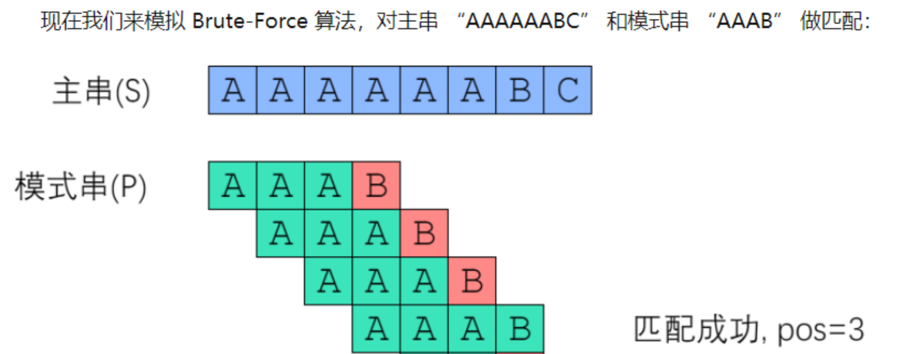

具体实现代码如下所示：

```java
/**
  * 暴力匹配算法
  * @param s 主字符串
  * @param t 模式字符串
  * @return s 中第一次匹配到 t 的下标位置, -1则表示未匹配到
  */
public static int bruteForce(String s, String t) {
    int sLen = s.length();
    int tLen = t.length();
    for (int sIndex = 0; sIndex <= sLen - tLen; sIndex++) {
        int tIndex;
        for (tIndex = 0; tIndex < tLen; tIndex++) {
            if (s.charAt(sIndex++) != t.charAt(tIndex)) {
                break;
            }
        }
        if (tIndex == tLen) {
            return sIndex - tLen;   // 找到匹配
        }
    }
    return -1;  // 未找到匹配
}
```

假设主字符串和模式字符串的长度分别为`n`和`m`，则暴力法的时间复杂度为`O(mn)`，空间复杂度为`O(1)`。

## 2. KMP算法

KMP可以在 `O(n+m)` 的时间复杂度（n和m分别是字符串和目标字符串的长度）内实现两个字符串的匹配。

如有一个主字符串s为`BBC ABCDAB ABCDABCDABDE`，模式字符串t为`ABCDABD`？传统的暴力做法如下：

```text
Step0
- 分别用i和j指针指向s和t的第一个元素；

Step1
- i开始后移直到i和j指向同一个字符
- i和j开始同时后移直到两者指向不同的字符
如s和t的执行结果为：
          i
          |
BBC ABCDAB ABCDABCDABDE
    ABCDABD
          |
          j
          此处出现不匹配
    
Step2    
- 此时i回退到初始位置的后一个位置，j回退到初始位置并继续开始寻找下一轮最长匹配(执行Step1)，如
     i回退
     |
BBC ABCDAB ABCDABCDABDE
     ABCDABD
     |
     j回退

......重复Step1/2直到找到的最长匹配的长度和t相同
```

一个基本事实是，Step2中当空格与D不匹配时，你其实知道前面六个字符是"ABCDAB"。KMP算法的想法是，设法利用这个已知信息，不要把"搜索位置"移回已经比较过的位置，继续把它向后移，这样就提高了效率。即发现某个字符不匹配时，**`s`的指针`i`不回退，`t`的指针`j`尽量少回退，并且`j`回退位置的前面那段已经和甲匹配（需要寻找t的公共前后缀），这样`i`才能不用回退。**

如何找到`j`回退的位置呢，举例如下：

> 「不匹配发生时，前面匹配的那一小段 ABCDAB 于s和t是相同的」，「这样的话，用 ABCDAB 的前缀去匹配 ABCDAB 的后缀（如前缀为A AB ABC ABCD ABCDA，后缀为BCDAB CDAB DAB AB B，两者最长匹配为AB长度为2），最长的那段就是答案。」即2：
>
>  i不动 | BBC ABCDAB ABCDABCDABDE ABCDABD | j回退
>
> AB前缀和AB后缀自身最大匹配长度为0：
>
>  i不动
>
>  |
>
> BBC ABCDAB ABCDABCDABDE ABCDABD | j回退
>
> 两者第一个字符就不匹配，i需要后移
>
>  i
>
>  |
>
> BBC ABCDAB ABCDABCDABDE ABCDABD | j
>
> 两者最长匹配为ABCDAB
>
>  i
>
>  |
>
> BBC ABCDAB ABCDABCDABDE ABCDABD | j
>
> ABCDAB的最长前后缀匹配为AB长度为2：
>
>  i
>
>  |
>
> BBC ABCDAB ABCDABCDABDE ABCDABD | j
>
> 由此匹配完成！

假设已经有了一张PMT表来记录t中的前后缀匹配情况。如字符串`abcdabd`的PMT表为：

| 下标     | 0    | 1    | 2    | 3    | 4    | 5    | 6    |
| -------- | ---- | ---- | ---- | ---- | ---- | ---- | ---- |
| **字符** | a    | b    | c    | d    | a    | b    | d    |
| **值**   | 0    | 0    | 0    | 0    | 1    | 2    | 0    |

PMT表记录了当在下标`j`处出现不匹配的字符时，`j`应该回退到什么位置（回退到`pmt[j-1]`处）。

### KMP实现

具体KMP实现如下所示：

```java
public static int kmp(String s, String t) {
    int tLen = t.length();
    int[] pmt = getPMT(t);
    int i = 0, j = 0;
    while (i < s.length()) {
        if (s.charAt(i) == t.charAt(j)) {   // 当前字母匹配 i/j指针继续后移
            i++;
            j++;
        } else if (j == 0) {    // t的第一个字母就不匹配 i指针后移直到出现第一个匹配字母
            i++;
        } else {
            j = pmt[j - 1]; // t中非第一个字母不匹配 j指针按照pmt表进行回退
        }

        if (j == tLen) {
            return i - tLen;
        }
    }

    return -1;
}
```

假设主字符串和模式字符串的长度分别为`n`和`m`。KMP算法的分摊时间复杂度`O(m+n)`，其中主字符串只会被遍历一次，模式字符串遍历的分摊时间复杂度为O(m）；空间复杂度为`O(m)`，因为需要一个大小为m的数组存储PMT表。

### 快速构建PMT表/Next数组

PMT表（next数组）实际上就是记录了以模式字符串`t`中的第0~i个字符形成的子串的公共前后缀的长度！只要模式字符串和任意主字符串的某个字符出现不匹配时，通过查表即可知道指向模式字符串的指针应该回退到什么位置。

- 定义 “k-前缀” 为一个字符串的前 k 个字符； “k-后缀” 为一个字符串的后 k 个字符。k 必须小于字符串长度。
- next[x] 定义为： P[0]~P[x] 这一段字符串，使得**k-前缀恰等于k-后缀**的最大的k。如字符串"abbaaab"的k为2。

------

考虑采用递推的方式求出next数组。如果next[0], next[1], ... next[x-1]均已知，那么如何求出 next[x] 呢？首先，已经知道了 next[x-1]（以下记为now）：

- 情况1：如果 P[x] 与 P[now] 一样，那最长相等前后缀的长度就可以扩展一位，很明显 next[x] = now + 1

  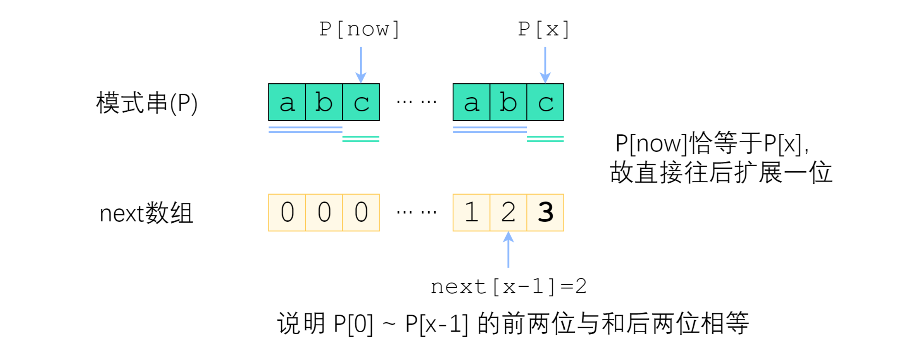

- 情况2：如果 P[x] 与 P[now] 不一样，则说明公共最长前后缀长度小于now！now指针应该回退，但是要回退=到什么地方开始重新比较呢？

  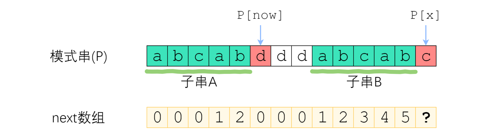

  在保持 P[0]~P[x-1] 字符串的`now-前缀`仍然等于`now-后缀`的前提下，让这个新的now尽可能大一点！即`now=next[now-1]`（因为P[0]~P[x-1]中最长公共前后缀为"abcab"，次长公共前后缀为"ab"即长度为next[now-1]）！

  > 换句话说接下来now应该改成：使得 **A的k-前缀**等于**B的k-后缀** 的最大的k。而子串A和B是完全相同的，所以B的后缀等于A的后缀！因此，使得A的k-前缀等于B的k-后缀的次大的k，其实就是串A的最长公共前后缀的长度 —— next[now-1]！

  所以now指针移动到子串A的"c"处开始继续比较。

------

具体实现代码如下所示：

```java
public static int[] getPMT(String t) {
    int len = t.length();
    int[] next = new int[len];

    int now = 0;    // 已经完成最大前后缀匹配的前缀末尾位置+1
    int i = 1;  // 当前计算的next数组的下标
    while (i < len) {
        if (t.charAt(now) == t.charAt(i)) { // 字符相等
            next[i] = now + 1;    // 扩展一匹配个长度
            now++;
            i++;
        } else if (now != 0) {  // 字符不相等且now不等于0
            now = next[now - 1];
        } else {
            next[i] = 0;    // 字符不相等且now等于0
            i++;
        }
    }

    return next;
}
```

假设模式字符串长度为m，则该算法的分摊时间复杂度为`O(m)`【why???】。

### 注意

如果搜索的词 t 没有公共前后缀，那这个算法就退化成了遍历，但是效果还是比BF法好，因为指向主字符串的指针永远不会回退！

> 如【最坏的情况？】：模式字符串为ABCDE（长度为m=5），主字符串为ABCDABCD（长度为n=8），如果使用暴力法，两个指针一共需要移动（5 x 8 = 40次），而使用KMP法指针一共只需要移动（8 + 10 = 18次）。

## 3. 参考

- [如何更好地理解和掌握 KMP 算法? - 阮行止的回答 - 知乎](https://www.zhihu.com/question/21923021/answer/1032665486)
- [字符串匹配的KMP算法]([字符串匹配的KMP算法 - 阮一峰的网络日志 (ruanyifeng.com)](http://www.ruanyifeng.com/blog/2013/05/Knuth–Morris–Pratt_algorithm.html))
- [视频讲解](https://b23.tv/ucO6Oe)

# 五、数据结构

## 1. 二叉树

- 结构
- 遍历方法：深度优先、广度优先

### 递归法先、中、后序遍历

```java
    private static void dfs(TreeNode root, List<TreeNode> list, Integer traversalOrder) {
        if (root != null) {
            if (PRE_ORDER_TRAVERSAL.equals(traversalOrder)) {
                // 先序遍历
                list.add(root);
                if (root.left != null) {
                    dfs(root.left, list, PRE_ORDER_TRAVERSAL);
                }
                if (root.right != null) {
                    dfs(root.right, list, PRE_ORDER_TRAVERSAL);
                }
            } else if (IN_ORDER_TRAVERSAL.equals(traversalOrder)) {
                // 中序遍历
                if (root.left != null) {
                    dfs(root.left, list, IN_ORDER_TRAVERSAL);
                }
                list.add(root);
                if (root.right != null) {
                    dfs(root.right, list, IN_ORDER_TRAVERSAL);
                }
            } else if (POST_ORDER_TRAVERSAL.equals(traversalOrder)) {
                // 后序遍历
                if (root.left != null) {
                    dfs(root.left, list, POST_ORDER_TRAVERSAL);
                }
                if (root.right != null) {
                    dfs(root.right, list, POST_ORDER_TRAVERSAL);
                }
                list.add(root);
            }
        }
    }
```

### 迭代法先、中、后序遍历

```java
private static void DFS_Iterate(TreeNode root, List<TreeNode> list, Integer traversalOrder){
        Stack<TreeNode> stack = new Stack<TreeNode>();
        TreeNode pRoot = root;
        if (PRE_ORDER_TRAVERSAL.equals(traversalOrder)) {
            // 先序遍历
            // 先把当前节点的值保存到list中，然后再把它的右孩子节点、左孩子节点分别压入stack中
            stack.push(root);
            while (!stack.empty()) {
                pRoot = stack.pop();
                list.add(pRoot);

                if (pRoot.right != null) {
                    stack.push(pRoot.right);
                }
                if (pRoot.left != null) {
                    stack.push(pRoot.left);
                }
            }

        } else if (IN_ORDER_TRAVERSAL.equals(traversalOrder)) {
            // 中序遍历
            while (pRoot != null || !stack.isEmpty()) {
                while (pRoot != null) {
                    stack.add(pRoot);
                    pRoot = pRoot.left;
                }
                pRoot = stack.pop();
                list.add(pRoot);
                pRoot = pRoot.right;
            }
        } else if (POST_ORDER_TRAVERSAL.equals(traversalOrder)) {
            // 后序遍历
            // 方法2** [好记] 先序遍历(根左右)的基础上翻转(注意序言左右节点依次入栈, 根右左的先序遍历法)
            stack.push(root);
            while (!stack.empty()) {
                pRoot = stack.pop();
                list.add(pRoot);

                if (pRoot.left != null) {
                    stack.push(pRoot.left);
                }
                if (pRoot.right != null) {
                    stack.push(pRoot.right);
                }
            }
            Collections.reverse(list);
        }
```

## 2. 二叉查找/搜索树

满足以下要求的二叉树称为二叉查找树/二叉搜索树/排序二叉树：

- 若左子树不空，则左子树上所有结点的值均小于它的根结点的值；
- 若右子树不空，则右子树上所有结点的值均大于它的根结点的值；
- 左、右子树也分别为二叉排序树；
- 没有键值相等的结点。

> 在二叉查找树上插入/搜索一个数字类似于二分查找的过程。
>
> 查找和插入的时间复杂度均为`log(N)`，最坏的情况下退化为链表，复杂度为`O(N)`.

当往二叉查找树中插入递减/增序列时，容易造成树不平衡，如下图所示：

```text
   10
 /    \
 8    9
 往当前二叉搜索树中依次插入7/6/5...
   10
 /    \
 8    9    
 |
 7
 |
 6
 |
 5
```

此时树退化成了链表，查找和插入效率变低！

## 3. 红黑树

### 3.1 定义

红黑树是每个节点都带有 *颜色* 属性的[二叉查找树](https://zh.wikipedia.org/wiki/二元搜尋樹)，颜色为 *红色* 或 *黑色*。在二叉查找树强制一般要求以外，对于任何有效的红黑树我们增加了如下的额外要求：

1. 节点是红色或黑色。
2. 根节点是黑色。
3. 所有叶子都是黑色（叶子是NIL/NULL节点）。
4. 每个红色节点必须有两个黑色的子节点。（从每个叶子到根的所有路径上不能有两个连续的红色节点。）
5. 从任一节点到其每个叶子的所有[简单路径](https://zh.wikipedia.org/wiki/道路_(图论))都包含相同数目的黑色节点。

下面是一个具体的红黑树的图例：

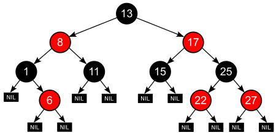

### 3.2 操作

=======================================

================[在线演示](https://rbtree.phpisfuture.com/) ==============

================[WiKi Page](https://zh.wikipedia.org/wiki/%E7%BA%A2%E9%BB%91%E6%A0%91) =============

=======================================

各种操作的时间复杂度都是`O(log N)`；一棵含有n个节点的红黑树的高度至多为`2log(N + 1)`。

性质4保证红黑树的最长路径不超过最短路径的两倍！因为最长路径一定是红黑交替的，最短路径是全黑的，而性质5规定了每条路黑色节点个数都是一样的。

#### 插入

首先做如下定义：

> **插入新节点初始均默认红色。**
>
> 如果设为黑色，就会导致根到叶子的路径上有一条路上，多一个额外的黑节点，违法规则5，这个是很难调整的。但是设为红色节点后，可能会导致出现两个连续红色节点的冲突，那么可以通过颜色调换（color flips）和树旋转来调整。

> **新节点为N，父节点为P，叔节点为U**（父节点的兄弟节点/和父节点同父的另一个节点），**祖父节点为G**。

- **Case1 父节点为空/根节点为空**：直接插入，并修改颜色为黑色。

- **Case2 父节点为黑色**：直接插入，无需调整。

- **父节点是红色**（Case4/5中假设P是G的左子节点。如果它是右子节点，Case3-2/3中的 *左*  和 *右* 应当对调）

  - **Case 3 叔节点是红色**：父节点和叔节点变成黑色，祖父节点变成红色（如果祖父节点的父节点也为红色则违法规则4，如果祖父节点为根节点则违反规则2，此时将G作为新节点重新执行一遍Case1/插入操作即可）。

  

  - **叔节点为黑色/空**

    > 叔节点为空即为叶子结点NIL，叶子结点为黑色，所叔节点为空/黑色是同一种情况！

    > 可能是一种**暂态情况**，只存在于执行完Case 3中的操作后，G作为新节点插入时，G的父节点是红色、叔节点可能是黑色！如：
    >
    > 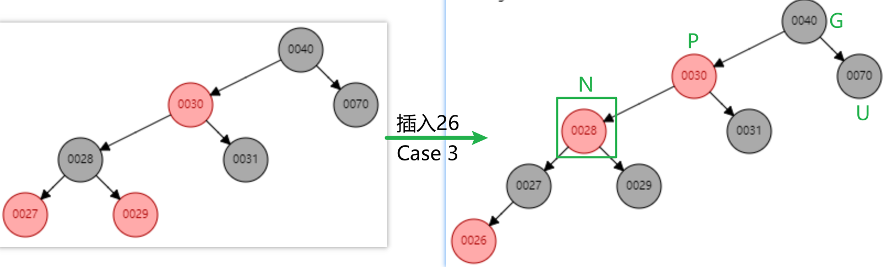
    >
    > 也可能是：
    >
    > 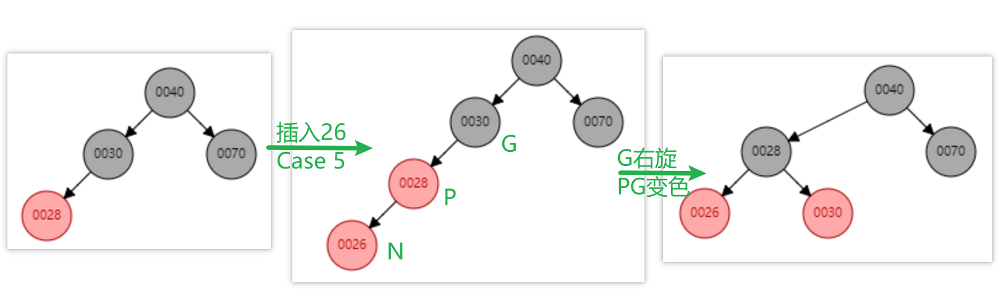

    - **Case4 新节点插入到P右边**：以P为中心左旋，此时违反规则4，按照Case5 对原来的P节点进行处理。

    

    - **Case 5 新节点插入到P左边**：以G为中心右旋，PG变色。

    

#### 删除

比较复杂，后面再看！

### 3.3 代码实现

#### 节点定义

参照JDK 8中HashMap中的相关源码：

```java
    static final class TreeNode<K,V> extends LinkedHashMap.Entry<K,V> {
        TreeNode<K,V> parent;  // red-black tree links
        TreeNode<K,V> left;
        TreeNode<K,V> right;
        TreeNode<K,V> prev;    // needed to unlink next upon deletion 为了维持链表结构
        boolean red;
    }
```

#### 平衡调整

```java
static <K,V> TreeNode<K,V> balanceInsertion(TreeNode<K,V> root,
                                            TreeNode<K,V> x) {
    x.red = true;
    // x,xp,xpp,xppl,xppr 分别为新节点、父节点、祖父节点、祖父节点的左子节点(可能是父/叔节点)、祖父节点的右子节点(可能是父/叔节点)
    for (TreeNode<K,V> xp, xpp, xppl, xppr;;) {
        if ((xp = x.parent) == null) {	// Case 1 父节点为空：直接插入，变为黑色
            x.red = false;
            return x;
        }
        else if (!xp.red || (xpp = xp.parent) == null)	// Case 2 父节点为黑色：直接插入
            return root;
        // 父节点为红色-父节点属于左子节点 Case3/4/5
        if (xp == (xppl = xpp.left)) {
            if ((xppr = xpp.right) != null && xppr.red) {	// Case 3 叔节点为红色：父节点和叔节点变成黑色，祖父节点变成红色，将祖父节点作为新节点重新插入一遍(x = xpp)
                xppr.red = false;
                xp.red = false;
                xpp.red = true;
                x = xpp;
            }
            else {	// 叔节点为黑色/空 Case4/5
                if (x == xp.right) {	// Case 4 新节点插入到右边：P左旋，旧的P节点作为新节点重新插入(变成Case 5)
                    root = rotateLeft(root, x = xp);
                    xpp = (xp = x.parent) == null ? null : xp.parent;	// 重新赋值x/xp/xpp为旋转后的节点(x/xp互换了, xpp还是旋转前的节点？)
                }
                if (xp != null) {	// 可能为null？
                    // Case 5 新节点插入到左边：PG变色、右旋
                    xp.red = false;
                    if (xpp != null) {
                        xpp.red = true;
                        root = rotateRight(root, xpp);
                    }
                }
            }
        }
        // 父节点为红色-父节点属于右边子节点(和上面的操作类似，只是左/右相反)
        else {
            if (xppl != null && xppl.red) {
                xppl.red = false;
                xp.red = false;
                xpp.red = true;
                x = xpp;
            }
            else {
                if (x == xp.left) {
                    root = rotateRight(root, x = xp);
                    xpp = (xp = x.parent) == null ? null : xp.parent;
                }
                if (xp != null) {
                    xp.red = false;
                    if (xpp != null) {
                        xpp.red = true;
                        root = rotateLeft(root, xpp);
                    }
                }
            }
        }
    }
}
```

#### 左/右旋

画图理解即可（可以参考Case4/5中的图来看）！里面涉及到很多指针指向的修改！

```java
static <K,V> TreeNode<K,V> rotateLeft(TreeNode<K,V> root,
                                      TreeNode<K,V> p) {
    TreeNode<K,V> r, pp, rl;
    if (p != null && (r = p.right) != null) {
        if ((rl = p.right = r.left) != null)
            rl.parent = p;
        if ((pp = r.parent = p.parent) == null)
            (root = r).red = false;
        else if (pp.left == p)
            pp.left = r;
        else
            pp.right = r;
        r.left = p;
        p.parent = r;
    }
    return root;
}

static <K,V> TreeNode<K,V> rotateRight(TreeNode<K,V> root,
                                       TreeNode<K,V> p) {
    TreeNode<K,V> l, pp, lr;
    if (p != null && (l = p.left) != null) {
        if ((lr = p.left = l.right) != null)
            lr.parent = p;
        if ((pp = l.parent = p.parent) == null)
            (root = l).red = false;
        else if (pp.right == p)
            pp.right = l;
        else
            pp.left = l;
        l.right = p;
        p.parent = l;
    }
    return root;
}
```

### 3.4 相关面试问题

#### 为什么要有红色/黑色。

> 1. 红黑树是平衡二叉树的变形，红黑树的颜色是保证红黑树查找速度的一种方式，目的是利用颜色值作为二叉树的平衡对称性的检查，在插入删除过程中只要满足红黑树定义要求，就能满足二叉树的相对平衡。
>
>    2. 从任意的节点开始到叶节点的路径，黑节点的个数是相同的，这就能保证搜索路径的最大长度不超过搜索路径的最短长度的2倍。

#### 为什么插入节点默认红色。

> 如果是黑色，直接违反规则 *从任意一个节点触发到叶子结点的黑色节点数一样*  ，这会很难调整。所以直接默认红色，只可能违背 *不能有两个连续的红色节点*  这个规则，可以通过旋转/变色来调整即可。

#### 红黑树和AVL树的对比？

> AVL树是完全平衡的，它的查找效率比红黑树更高，但是删除/插入的效率比红黑树更低（为了维持完全平衡需要大量旋转操作，而红黑树只需要最多三次旋转即可）。


## 平衡二叉树/AVL树

AVL树本质还是一棵二叉查找树，只是在其基础上增加了“平衡”的要求。所谓平衡是指，**对AVL树的任意结点来说，其左子树与右子树的高度之差的绝对值不超过1**，其中左子树与右子树的高度因子之差称为平衡因子。

如下所示，就是一棵由{1，2，3，4，5，7，8}构建的AVL树：

　　

## 4. B树

B树和平衡二叉树稍有不同的是B树属于多叉树又名**平衡多路查找树**（查找路径不只两个），数据库索引技术里大量使用者B树和B+树的数据结构。具有以下特性“

- 定义任意非叶子结点最多只有M个儿子；且M>2；
- 根结点的儿子数为[2, M]；
- 除根结点以外的非叶子结点的儿子数为[M/2, M]；
- 每个结点存放至少M/2-1（取上整）和至多M-1个关键字；（至少2个关键字）
- 非叶子结点的关键字个数 = 指向儿子的指针个数-1；
- 非叶子结点的关键字：K[1], K[2], …, K[M-1]；且K[i] < K[i+1]；
- 非叶子结点的指针：P[1], P[2], …, P[M]；其中P[1]指向关键字小于K[1]的子树，P[M]指向关键字大于K[M-1]的子树，其它P[i]指向关键字属于(K[i-1], K[i])的子树；
- 所有叶子结点位于同一层；

​    如：（M=3）


> 由于M/2的限制，在插入结点时，如果结点已满，需要将结点分裂为两个各占M/2的结点；删除结点时，需将两个不足M/2的兄弟结点合并。

 

## 5. B+树

在B-树基础上，为叶子结点增加链表指针，所有关键字都在叶子结点中出现，非叶子结点作为叶子结点的索引；B+树总是到叶子结点才命中。

如M=3的B+树：


## 6. 字典/Trie树

Trie树，也叫字典树,它是一个树形结构。是一种专门处理字符串匹配的数据结构,用来解决在一组字符串集合中快速查找某个字符串。

Trie树本质:利用字符串之间的公共前缀,将重复的前缀合并在一起。


## 7. 堆

### 7.1 结构

堆是使用数组实现的二叉树(完全二叉树)，只需要使用数组存储元素，不需要使用任何指针(左右子节点在数组总是相邻的)：

- 最大堆：父节点比子节点大（根节点是最大元素）
- 最小堆：父节点比子节点小（根节点是最小元素）

具体如下所示：

```
[10 5 3 4 2 1]对应一个最大堆
            10
         /     \\
        5       3
      /   \\    / 
     4     2  1
```

### 7.2 属性

- 在最大堆中，父节点的值比每一个子节点的值都要大。在最小堆中，父节点的值比每一个子节点的值都要小。这就是所谓的“堆属性”，并且这个属性对堆中的每一个节点都成立。 **根据这一属性，常把堆用作优先队列，因为可以快速找到最大/小元素**

> 注意：堆的根节点中存放的是最大或者最小元素，但是其他节点的排序顺序是未知的。例如，在一个最大堆中，最大的那一个元素总是位于 index 0 的位置， 但是最小的元素则未必是最后一个元素。--唯一能够保证的是最小的元素是一个叶节点，但是不确定是哪一个。

- 堆的数组小标和树的位置对应关系如下所示：

```
在数组中下标i对应的元素的父节点的数组下标是 floor((i-1) / 2))  (floor表示向下取整)
在数组中下标i对应的元素的左右子节点的数组下标分别分别为 2i + 1 和 2i + 2
```

利用上述对应关系可以快速找到父节点或者子节点的位置，而不需要使用指针！

### 7.3 操作及其复杂度

#### 7.3.1 原始操作

有两个原始操作用于保证插入或删除节点以后堆是一个有效的最大堆或者最小堆：

- `shiftUp()`: 如果一个节点比它的父节点大（最大堆）或者小（最小堆），那么需要将它同父节点交换位置。这样是这个节点在数组的位置上升。
- `shiftDown()`: 如果一个节点比它的子节点小（最大堆）或者大（最小堆），那么需要将它向下移动。这个操作也称作"heapify"。

shiftUp 或者 shiftDown 是一个递归的过程，所以它的时间复杂度是 O(log n) 。

> 一次上浮/下降操作实质上是父节点和子节点交换位置，为两者下标是可以直接推算出来的，所以只是把数组中的两个指定元素交换位置，复杂度为O(1)。

> 上浮/下降是需要操作最多h次，h为树的高度，因为是完全二叉树，所以h = log(2,n)。

#### 7.3.2 `O(log n)`复杂度的操作

基于这两个原始操作还有一些其他的操作：

- `insert(value)`: 在堆的尾部添加一个新的元素，然后使用 `shiftUp` 来修复堆。
- `remove()`: 移除并返回最大值（最大堆）或者最小值（最小堆）即数组第一个元素。为了将这个节点删除后的空位填补上，需要将最后一个元素 移到根节点的位置，然后使用 `shiftDown` 方法来修复堆。
- `removeAtIndex(index)`: 和 `remove()` 一样，差别在于可以移除堆中任意节点，而不仅仅是根节点。当它与子节点比较位置不时无序时 使用 `shiftDown()`，如果与父节点比较发现无序则使用 `shiftUp()`。
- `replace(index, value)`：将一个更小的值（最小堆）或者更大的值（最大堆）赋值给一个节点。由于这个操作破坏了堆属性， 所以需要使用 `shiftUp()` 来修复堆属性。

#### 7.3.3 其它操作

- `search(value)`:堆不是为快速搜索而建立的，`search` 操作需要找到节点在数组中的index，所以你需要先找到这个index。时间复杂度`O(n)`.
- `buildHeap(array)`:通过反复调用 insert() 方法将一个（无序）数组转换成一个堆, 可以在 O(n) 时间内完成！具体 [参考这里](https://www.geeksforgeeks.org/time-complexity-of-building-a-heap) 。
- `peek()` 方法，不用删除节点就返回最大值（最大堆）或者最小值（最小堆）。时间复杂度 O(1) 。
- 堆排序：由于堆就是一个数组，我们可以使用它独特的属性将数组从低到高排序。时间复杂度`O(nlgn)`。

### 7.4 堆和二叉搜索树的区别

- **节点的顺序**。在二叉搜索树中，左子节点必须比父节点小，右子节点必须必比父节点大。但是在堆中父节点比两个子节点都小/大。
- **内存占用**。普通树占用的内存空间比它们存储的数据要多。你必须为节点对象以及左/右子节点指针分配内存。堆仅仅使用一个数组来存储数据，不使用指针。
- **平衡**。二叉搜索树必须是“平衡”的情况下，其大部分操作的复杂度才能达到O(log n)。你可以按任意顺序位置插入/删除数据，或者使用 AVL 树或者红黑树， 但是在堆中实际上不需要整棵树都是有序的。我们只需要满足堆属性即可，所以在堆中平衡不是问题。因为堆中数据的组织方式可以保证O(log n) 的性能。
- **搜索**。在二叉树中搜索会很快，但是在堆中搜索会很慢。在堆中搜索不是第一优先级，因为使用堆的目的是将最大（或者最小）的节点放在最前面， 从而快速的进行相关插入、删除操作。

### 7.5 堆代码实现

```java
/**
 * @Author QiuYukang
 * @E-mail b612n@qq.com
 * @Date 2021/8/13 16:56
 */
public class MyHeap {
    // 堆的最大容量
    private int maxSize;
    // 存储堆中的数据(小顶堆)
    private int[] nums;
    // 当前堆的大小
    private int size = 0;

    // 构造一个大小为maxSize的堆
    public MyHeap(int maxSize) {
        this.maxSize = maxSize;
        this.nums = new int[maxSize];
    }
    // 利用数组构造一个堆
    public Heap(int[] nums) {
        this.nums = nums;
        this.maxSize = nums.length;
        this.size = nums.length;
        // 将所有非叶子节点下沉(从底层的非叶子节点开始)
        for (int i = size / 2 - 1; i >= 0; i--) {
            shiftDown(nums, i);
        }
    }    

    // 往堆中添加新元素
    public void add(int num) {
        if (size == maxSize) {
            return;
        }
        // 数组尾部插入新元素, 将新元素上浮
        nums[size] = num;
        size++;
        shiftUp(nums, size - 1);
    }

    // 去除堆顶元素
    public int peek() {
        return nums[0];
    }

    // 弹出堆顶元素
    public int pop() {
        // 返回第一个元素, 将最后一个元素移到第一个元素位置并执行下沉操作
        int res = nums[0];
        swap(nums, 0, size - 1);
        size--;
        shiftDown(nums, 0);
        return res;
    }

    // 获取堆的当前大小
    public int size() {
        return this.size;
    }

    // 对idx处的元素执行下沉操作
    private void shiftDown(int[] nums, int idx) {
        int left = idx * 2 + 1;   // 左子节点下标
        int right = left + 1;   // 右子节点下标
        int small = idx;  // 当前节点及其子节点中最小值元素的下标
        // 将当前节点和左右子节点中较小者交换位置
        if (left < size && nums[left] < nums[small]) {
            small = left;
        }
        if (right < size && nums[right] < nums[small]) {
            small = right;
        }
        if (idx != small) {
            swap(nums, idx, small);
            shiftDown(nums, small); // 递归继续将子节点下沉
        }
    }

    // 对idx处的元素执行上浮操作
    private void shiftUp(int[] nums, int idx) {
        int parent = (idx - 1) / 2;   // idx的父节点下标
        // 如果父节点的值大于自身, 则上浮
        if (parent >= 0 && nums[parent] > nums[idx]) {
            swap(nums, idx, parent);
            shiftUp(nums, parent); // 递归继续将父节点上浮
        }
    }

    // 交换数组中i/j位置的元素
    private void swap(int[] nums, int i, int j) {
        int temp = nums[i];
        nums[i] = nums[j];
        nums[j] = temp;
    }
}
```


## 8. 并查集

并查集被很多人认为是最简洁而优雅的数据结构之一，主要用于解决一些**元素分组**的问题。它管理一系列**不相交的集合**，并支持两种操作：

- **合并**（Union）：把两个不相交的集合合并为一个集合。
- **查询**（Find）：查询两个元素是否在同一个集合中。

> 凡是涉及到元素的分组管理问题，都可以考虑使用并查集进行维护。

### 8.1 结构

如下图所示：

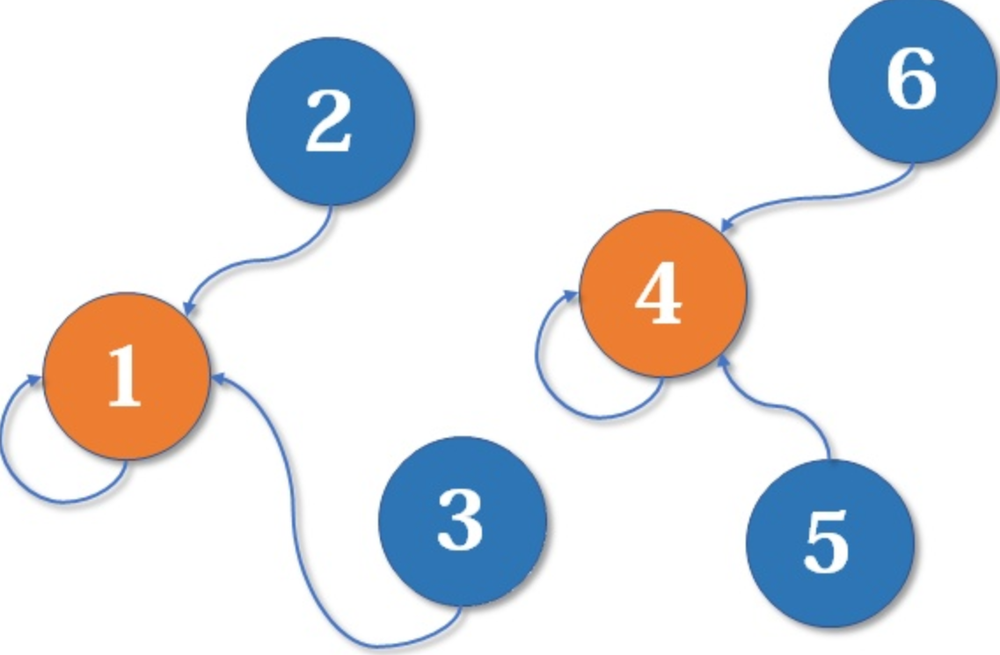

并查集实际上是一棵棵的树，每个节点都有一个父节点（树根节点的父节点是自身），从一个根节点触发一层层往上最终可以找到树根节点。

通过对集合中的节点标号后，只需要利用一个`roots`数组就可以存储集合中各节点之间的拓扑关系，例如上图对应的`roots`数组为:

```text
// 假定下标从1开始的话（一般情况下是从0开始）
index    1    2    3    4    5    6
value   [1    1    1    4    4    4]
```

### 8.2 操作

#### 8.2.1 初始化

把所有节点的父亲均设置成自身（此时每个节点都是一个独立分支）。

```java
// int[] father;

public UnionFindSet(int size) {
    father = new int[size];
    // 初始化
    for (int i = 0; i < size; ++i) {
        father[i] = i;  // 所有节点都是独立存在
    }
}
```

#### 8.2.2 查询

查询节点所处集合的根节点，只需要递归向上进行查找即可。

```java
public int findRoot(int x) {
    // 采用递归的方式进行查找，直到某个节点的父亲是它自己这说明找到了根
    if (father[x] != x) {
        x = findRoot(father[x]);
    }
    return x;
}
```

时间复杂度为O(h)，其中h为树的高度。

#### 8.2.3 合并

合并两个节点所在的集合，只需要找到这两个节所在集合的根节点，然后把这两个根节点的其中一个设置为另一个的父节点即可。

```java
public void union(int x, int y) {
    father[findRoot(x)] = findRoot(y);
}
```

时间复杂度为O(h)，其中h为树的高度。

#### 8.2.4 基于路径压缩的优化合并

由`### 2.3`节的合并方式可以知道，这种操作在合并次数较多后，整个集合将呈现为**链状结构**，树的高度变得很高，由此将带来查询和和合并效率的降低。


由于我们只更新某个节点的根节点的情况，所以可以在**进行find的同时将沿途的节点父节点直接修改为根节点**，这样在下次查询时就可以大幅节约时间（查询的时间复杂度变成`O(1)`）。

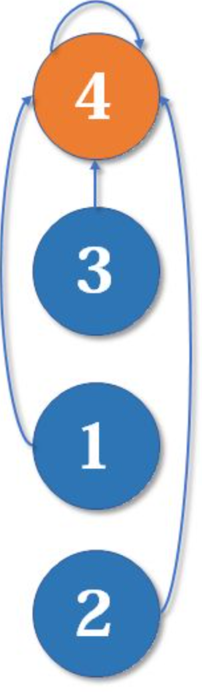

```java
public int findRoot(int x) {
    // 采用递归的方式进行查找，直到某个节点的父亲是它自己这说明找到了根
    if (father[x] != x) {
        father[x] = findRoot(father[x]);
    }
    return father[x];
}

// --- 简化写法 -----
public int findRoot(int x) {
    return x == father[x] ? x : (father[x] = find(father[x]));
}
```

#### 8.2.5 按秩合并

由于树的高度会影响合并和查找的效率，一次在执行合并操作时，可以把高度低的树合并到高度高的树上，以此来降低合并后的树的高度。

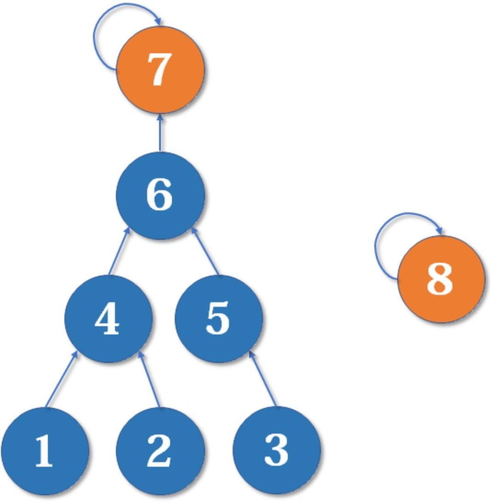

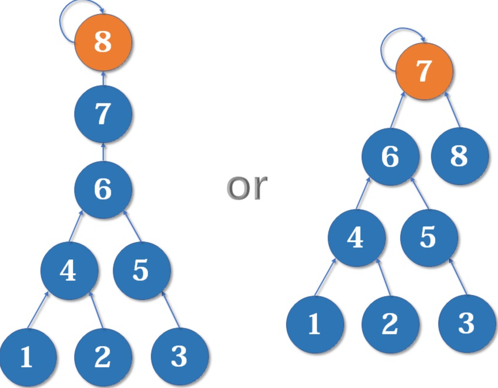

```java
// int[] father;
// int[] rank;

// 初始化
public UnionFindSet(int size) {
    father = new int[size];
    rank = new int[size];
    // 初始化
    for (int i = 0; i < size; ++i) {
        father[i] = i;  // 所有节点都是独立存在
        rank[i] = 0;    // 所有节点都处于第0层
    }
}

// 合并
public void unionByRank(int x, int y) {
    x = findRoot(x);
    y = findRoot(y);
    // 两个节点属于同一棵树
    if (x == y) {
        return;
    }

    // 尽量保持左右子树深度差较小
    if (rank[x] < rank[y]) {
        father[x] = y;
    } else if (rank[x] > rank[y]) {
        father[y] = x;
    } else {
        father[y] = x;
        rank[x]++;  // 更新深度值
    }
}
```

时间复杂度参考 [复杂度分析](https://blog.csdn.net/johnny901114/article/details/80721436)。

还有基于Size的合并：把子节点总数少的合并到多的上面。

## 3. 参考

- [算法学习笔记(1) : 并查集](https://zhuanlan.zhihu.com/p/93647900)
- [数据结构与算法（十二）并查集(Union Find)及时间复杂度分析](https://blog.csdn.net/johnny901114/article/details/80721436)


# 六、海量数据处理相关

## BitMap

BitMap可用于**海量数据去重和排序**，节约空间。申请一个byte数组，数组中的每一个bit映射到一个数上，bit值代表对应的数是否出现过（0表示未出现，1表示出现过）。

**使用举例**

- <font color="green">问：5TB的硬盘上放满了数据，请写一个算法将这些数据进行排重。如果这些数据是一些**32bit**大小的数据该如何解决？如果是**64bit**的呢？</font>

- <font color="blue">答：假设所有数据均为int32，如果使用`HashSet<Integer>`来实现去重，则需要一个大小最大为2^32的哈希表；如果将int32中的每一个数字用1bit来标志是否存在，则一共需要2^32bit=2^29Byte=2^9MB=512MB空间。</font>

```java
public static final int _1MB = 1024 * 1024;
//每个byte记录8bit信息,也就是8个数是否存在于数组中
public static byte[] flags = new byte[ 512 * _1MB ];

public static void main(String[] args) {
	//待判重数据
    int[] array = {255, 1024, 0, 65536, 255};

    int index = 0;
    for(int num : array) {
	    if(!getFlag(num)) {
	        //未出现的元素
	        array[index] = num;
	        index = index + 1;
            //设置标志位
            setFlag(num);
            System.out.println("set " + num);
        } else {
	        System.out.println(num + " already exist");
	    }
    }
}

public static void setFlag(int num) {
	// 高29位作为byte数组下标值，低3位作为byte内下标映射值
    flags[num >> 3] |= (1 << (num & (0x07)));
}

public static boolean getFlag(int num) {
	return (flags[num >> 3] >> (num & (0x07)) & 1) == 0x01;
}
```

> 对于小数据量、数据取值很稀疏，上面的方法并没有什么优势，但对于**海量的、取值分布很均匀**的集合进行去重，Bitmap极大地压缩了所需要的内存空间。于此同时，还额外地完成了对原始数组的排序工作。缺点是，Bitmap对于每个元素只能记录1bit信息，如果还想完成额外的功能，恐怕只能靠牺牲更多的空间、时间来完成了。

1. 已知某个文件内包含一些电话号码，每个号码为8位数字，统计不同号码的个数。

   8位最多99 999 999，大概需要99m个bit，大概10几m字节的内存即可。

2. 2.5亿个整数中找出不重复的整数的个数，内存空间不足以容纳这2.5亿个整数。

   将bit-map扩展一下，用2bit表示一个数即可，0表示未出现，1表示出现一次，2表示出现2次及以上。或者我们不用2bit来进行表示，我们用两个bit-map即可模拟实现这个2bit-map。

3. 40 亿无符号整数，内存 1G，怎么排序？

   - 如果是无重复数字，则让每个数字对应一个bit，需要`4*(10^9)bit=0.5*(10^9)Byte=0.5GB`
   - 将每个数字映射到一个bit位置中
   - 遍历bitmap，为1的位置则找出对应的下标并还原位数字写入文件即可

## Bloom Filter

**布隆过滤器**：使用bit数组来标识一个key是否（1/0）存在，原始key经过多个不同的hash函数得到对应的下标值。

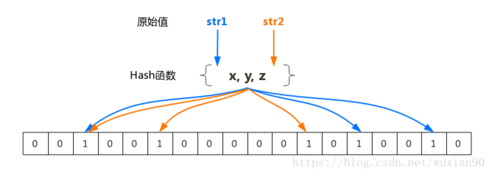

- 当需要判断某个元素是否存在时，只需要计算多个哈希值如果对应**下标均为1则该元素可能存在，只要有0一定不存在**。
- 布隆过滤器存在小的误判概率，理论上来说过滤器中存储的元素越多则误判概率越大！

> 布隆过滤器存在的缺点：
>
> - 数据库中数据更新后不能及时体现到布隆过滤器中，比如某个商品被删掉了，但布隆过滤器中的某个位的**值不能被删除因为这个位置上的值有可能其他商品在占用**。
> - 需要定时清除过滤器中的数据，定时加载。

**使用举例**

- 使用布隆过滤器解决缓存击穿问题：将数据库中的所有key加载到布隆过滤器中，当用户请求一个不存在的key时直接在布隆过滤器处即可快速拦截，如果布隆过滤器判断可能存在再继续到数据库中进行查询。

## 归并（分治）

针对大量数据无法直接全部载入内存时，可以采用分治的思想进行处理：

- 首先将大数据**切割成几个小的块**，对每个块进行**单独排序**（可以使用快排）后存入磁盘中；
- 最后不断从每个已排序好的块中取少量数据载入内存输入缓存区并**进行多路归并**，同时不断将排序结果从内存输出缓存区输出到磁盘即可；
- 当所有块中的数据都已经读取并归并完毕后，磁盘中存储的即为全部排序好的数据。

**使用举例**

<font color="blue">1TB数据使用32GB内存如何排序？</font>

1. 把磁盘上的1TB数据分割为40块（chunks），每份25GB。（注意，要留一些系统空间！）
2. 顺序将每份25GB数据读入内存，使用quick sort算法排序，把排序好的数据（也是25GB）存放回磁盘。
3. 循环40次，现在，所有的40个块都已经各自排序了。（剩下的工作就是如何把它们合并排序！）
4. 从40个块中分别读取25G/40=0.625G入内存（40 input buffers）。
5. 执行40路合并，并将合并结果临时存储于2GB 基于内存的输出缓冲区中。当缓冲区写满2GB时，写入硬盘上最终文件，并清空输出缓冲区；当40个输入缓冲区中任何一个处理完毕时，写入该缓冲区所对应的块中的下一个0.625GB，直到全部处理完成。

<font color="blue">两个大文件a和b中找出共同记录（如文件中存储一行行的URL）？</font>

**常规思路**：

- 遍历文件a，将文件a中的记录加入哈希表中，依次取文件b中的记录到哈希表中查找即可。<font color="red">【文件太大，哈希表无法存储在内存中】</font>
- 将文件a和b分别分成M块和N块，两两载入内存中利用哈希表做对比。<font color="red">【复杂度为O(MN)，存在很多重复读取】</font>

**分治思路**：

- 遍历文件a，对每个url求取hash(url)%N，然后根据所取得的值将url分别存储到N个小文件中（记为N0/1/2/3...）
- 遍历文件b，采取和a相同的方式将url分别存储到N个小文件(即为M0/1/2...)

- 最终比较a和b中的对应序号的文件对中是否有相同元素即可（利用常规的哈希表方法），因为相同的记录哈希值一定相同即一定会放到同一个标号的小文件中。

## 堆

针对海量数据求前K大/小的数据（K相对来说比较小），可以使用一个大小为K的小顶堆/大顶堆来完成。

扩展：双堆，一个最大堆与一个最小堆结合，可以用来维护中位数！

**使用举例**

<font color="blue">100w个数中找最大的前100个数?</font>

- 建立一个大小为100的小顶堆
- 将100w数据中的数字依次入堆（如果堆中元素个数大于100则弹出堆顶元素）

> 也可以采用归并的思路，当最后一步输出元素达到100个时停止多路归并即可。

# 七、智力题


# 八.其它常见算法

## 1 洗牌算法

- 给定一个1-N的序列，怎么随机打乱？

- 如何生成一个随机的1~N的序列？

具体算法如下所示：

- 首先初始化一个大小为`N`的数组`nums`，令`nums[i]=i+1`
- 利用随机函数API生成一个`0~N-1`的数字`X`作为下标，交换`swap(nums, X, N - 1)`，此时确定了最后一个数字
- 利用随机函数API生成一个`0~N-2`的数字`X`作为下标，交换`swap(nums, X, N - 2)`，此时确定了倒数第二个数字
- 利用随机函数API生成一个`0~N-3`的数字`X`作为下标，交换`swap(nums, X, N - 3)`，此时确定了倒数第三个数字
- ...直到确定所有数字

## 2 抽奖算法


## 3 单例模式


## 4 生产者消费者模式


## 5 rand7 / rand10相互生成【待完成】

rand10->rand7 只要大于7则重新生成一次，直到在1~7则返回即可；

rand7->rand10：`(rand7()-1)*7+rand7()`构造出均匀分布在1-49的随机数

> 首先rand7()-1得到一个离散整数集合{0，1，2，3，4，5，6}，其中每个整数的出现概率都是1/7。那么(rand7()-1)*7得到一个离散整数集合A={0，7，14，21，28，35，42}，其中每个整数的出现概率也都是1/7。而rand7()得到的集合B={1，2，3，4，5，6，7}中每个整数出现的概率也是1/7。显然集合A和B中任何两个元素组合可以与1-49之间的一个整数一一对应，也就是说1-49之间的任何一个数，可以唯一确定A和B中两个元素的一种组合方式，反过来也成立。由于A和B中元素可以看成是独立事件，根据独立事件的概率公式P(AB)=P(A)P(B)，得到每个组合的概率是1/7*1/7=1/49。因此(rand7()-1)*7+rand7()生成的整数均匀分布在1-49之间，每个数的概率都是1/49。

## 6 foo 函数，返回0/1的概率分别为60%/40%，如何利用 foo 函数实现等概返回 0/1 的函数

连续调用两次foo函数，如果得到01/10则入会0/1，如果得到11/00则继续生成一次直到得到满足条件的值。（生成01/10的概率是一样的）：

```java
public int myfoo() {
    while (true) {
        int a = foo();
        int b = foo();
        if (a == 0 && b == 1) {
            return 0;
        } else if (a == 1 && b == 0) {
            return 1;
        }
    }
}
```

题目反过来：调用四次myfoo()函数，得等概得到0~16的数字，只要数字在1~6则返回0，数字在6~9则返回1。
