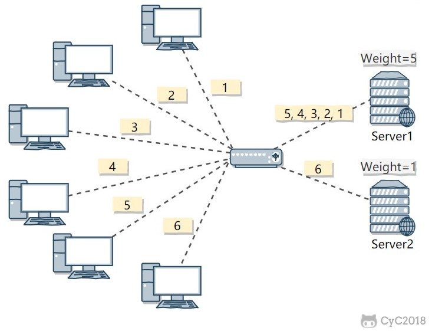
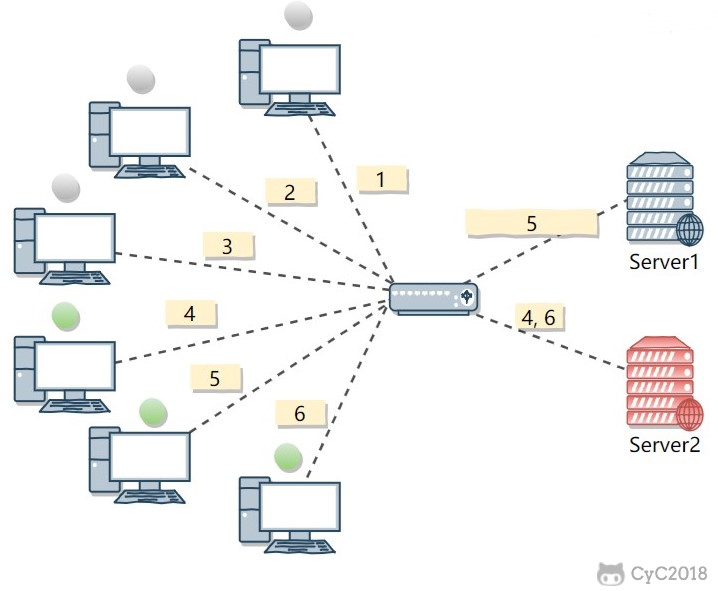
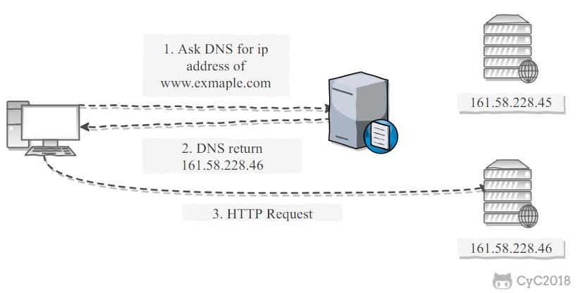

# 系统设计

<!-- GFM-TOC -->

* [系统设计](#系统设计)
* [一、集群](#一集群)
   * [1. 负载均衡](#1-负载均衡)
      * [负载均衡算法](#负载均衡算法)
         * [1. 轮询（Round Robin）](#1-轮询round-robin)
         * [2. 加权轮询（Weighted Round Robbin）](#2-加权轮询weighted-round-robbin)
         * [3. 最少连接（least Connections）](#3-最少连接least-connections)
         * [4. 加权最少连接（Weighted Least Connection）](#4-加权最少连接weighted-least-connection)
         * [5. 随机算法（Random）](#5-随机算法random)
         * [6. 源地址哈希法 (IP Hash)](#6-源地址哈希法-ip-hash)
      * [转发实现](#转发实现)
         * [1. HTTP 重定向](#1-http-重定向)
         * [2. DNS 域名解析](#2-dns-域名解析)
         * [3. 反向代理服务器](#3-反向代理服务器)
         * [4. 网络层](#4-网络层)
         * [5. 链路层](#5-链路层)
   * [2. 分布式 Session 管理](#2-分布式-session-管理)
      * [<strong>粘性Session</strong>](#粘性session)
      * [<strong>Session同步/复制</strong>](#session同步复制)
      * [<strong>集中式Session管理</strong>](#集中式session管理)
      * [<strong>客户端存储Session</strong>](#客户端存储session)
* [二、分布式一致性原理](#二分布式一致性原理)
   * [1 分布式理论](#1-分布式理论)
      * [1.1 CAP理论](#11-cap理论)
         * [一致性](#一致性)
         * [可用性](#可用性)
         * [分区容错性](#分区容错性)
      * [1.2 BASE理论](#12-base理论)
         * [基本可用](#基本可用)
         * [软状态](#软状态)
         * [最终一致性](#最终一致性)
      * [1.3 ACID/CAP/BASE总结](#13-acidcapbase总结)
   * [2 一致性协议](#2-一致性协议)
      * [2.1 两阶段提交2PC协议](#21-两阶段提交2pc协议)
         * [阶段1](#阶段1)
         * [阶段2](#阶段2)
         * [举例](#举例)
         * [优缺点](#优缺点)
      * [2.1.3 三阶段提交3PC协议](#213-三阶段提交3pc协议)
   * [3 分布式共识](#3-分布式共识)
      * [3.1 分布式共识问题](#31-分布式共识问题)
      * [3.2 Raft算法](#32-raft算法)
         * [领导人选举](#领导人选举)
            * [正常流程](#正常流程)
            * [异常情况](#异常情况)
         * [日志复制](#日志复制)
            * [正常流程](#正常流程-1)
            * [异常情况](#异常情况-1)
      * [3.3 Paxos算法](#33-paxos算法)
* [三、网站高并发&amp;高可用](#三网站高并发高可用)
   * [1. 高可用](#1-高可用)
      * [1.0 负载均衡](#10-负载均衡)
      * [1.1 熔断-](#11-熔断-)
      * [1.2 限流-](#12-限流-)
         * [固定窗口计数器算法](#固定窗口计数器算法)
         * [滑动窗口计数器](#滑动窗口计数器)
         * [漏桶算法](#漏桶算法)
         * [令牌桶算法](#令牌桶算法)
      * [1.3 降级-](#13-降级-)
      * [1.4 异步调用](#14-异步调用)
      * [1.5 幂等性设计](#15-幂等性设计)
      * [1.6 数据高可用](#16-数据高可用)
      * [1.7 网站监控](#17-网站监控)
   * [2. 高性能](#2-高性能)
      * [2.0 硬件优化](#20-硬件优化)
      * [2.1 缓存](#21-缓存)
      * [2.2 集群+负载均衡](#22-集群负载均衡)
      * [2.3 异步操作](#23-异步操作)
      * [2.4 代码优化](#24-代码优化)
* [四、单点登录SSO](#四单点登录sso)
   * [1. 为什么需要单点登录](#1-为什么需要单点登录)
   * [2. 如何实现单点登录](#2-如何实现单点登录)
      * [2.1 统一域名](#21-统一域名)
      * [2.2 CAS方案](#22-cas方案)
         * [登录](#登录)
         * [注销](#注销)
      * [参考文献](#参考文献)

<!-- Created by https://github.com/ekalinin/github-markdown-toc -->

# 一、集群

## 1. 负载均衡

集群中的应用服务器（节点）通常被设计成无状态，用户可以请求任何一个节点。

负载均衡器会根据集群中每个节点的负载情况，将用户请求转发到合适的节点上。

负载均衡器可以用来实现高可用以及伸缩性：

- 高可用：当某个节点故障时，负载均衡器会将用户请求转发到另外的节点上，从而保证所有服务持续可用；
- 伸缩性：根据系统整体负载情况，可以很容易地添加或移除节点。

负载均衡器运行过程包含两个部分：

1. 根据负载均衡算法得到转发的节点；
2. 进行转发。

### 负载均衡算法

主要分为：轮询（挨个来）、加权轮询（权重大/性能强的分的个数多）、最少连接（每次选连接数最少的）、加权最少连接（连接数 x 权重）、随机分配、源地址哈希算法。

#### 1. 轮询（Round Robin）

轮询算法把每个请求轮流发送到每个服务器上。

下图中，一共有 6 个客户端产生了 6 个请求，这 6 个请求按 (1, 2, 3, 4, 5, 6) 的顺序发送。(1, 3, 5) 的请求会被发送到服务器 1，(2, 4, 6) 的请求会被发送到服务器 2。

该算法比较适合每个服务器的性能差不多的场景，如果有性能存在差异的情况下，那么性能较差的服务器可能无法承担过大的负载（下图的 Server 2）。

#### 2. 加权轮询（Weighted Round Robbin）

加权轮询是在轮询的基础上，根据服务器的性能差异，为服务器赋予一定的权值，性能高的服务器分配更高的权值。

例如下图中，服务器 1 被赋予的权值为 5，服务器 2 被赋予的权值为 1，那么 (1, 2, 3, 4, 5) 请求会被发送到服务器 1，(6) 请求会被发送到服务器 2。

#### 3. 最少连接（least Connections）

由于每个请求的连接时间不一样，使用轮询或者加权轮询算法的话，可能会让一台服务器当前连接数过大，而另一台服务器的连接过小，造成负载不均衡。

例如下图中，(1, 3, 5) 请求会被发送到服务器 1，但是 (1, 3) 很快就断开连接，此时只有 (5) 请求连接服务器 1；(2, 4, 6) 请求被发送到服务器 2，只有 (2) 的连接断开，此时 (6, 4) 请求连接服务器 2。该系统继续运行时，服务器 2 会承担过大的负载。

最少连接算法就是将请求发送给当前最少连接数的服务器上。

例如下图中，服务器 1 当前连接数最小，那么新到来的请求 6 就会被发送到服务器 1 上。

#### 4. 加权最少连接（Weighted Least Connection）

在最少连接的基础上，根据服务器的性能为每台服务器分配权重，再根据权重计算出每台服务器能处理的连接数。

#### 5. 随机算法（Random）

把请求随机发送到服务器上。

和轮询算法类似，该算法比较适合服务器性能差不多的场景。

#### 6. 源地址哈希法 (IP Hash)

源地址哈希通过对客户端 IP 计算哈希值之后，再对服务器数量取模得到目标服务器的序号。

可以保证同一 IP 的客户端的请求会转发到同一台服务器上，用来实现会话粘滞（Sticky Session）

### 转发实现

#### 1. HTTP 重定向

HTTP 重定向负载均衡服务器使用某种负载均衡算法计算得到服务器的 IP 地址之后，将该地址写入 HTTP 重定向报文中，状态码为 302。客户端收到重定向报文之后，需要重新向服务器发起请求。

缺点：

- 需要两次请求，因此访问延迟比较高；
- HTTP 负载均衡器处理能力有限，会限制集群的规模。

该负载均衡转发的缺点比较明显，实际场景中很少使用它。

#### 2. DNS 域名解析

在 DNS 解析域名的同时使用负载均衡算法计算服务器 IP 地址。

优点：

- DNS 能够根据地理位置进行域名解析，返回离用户最近的服务器 IP 地址。

缺点：

- 由于 DNS 具有多级结构，每一级的域名记录都可能被缓存，当下线一台服务器需要修改 DNS 记录时，需要过很长一段时间才能生效。

大型网站基本使用了 DNS 做为第一级负载均衡手段，然后在内部使用其它方式做第二级负载均衡。也就是说，域名解析的结果为内部的负载均衡服务器 IP 地址。

#### 3. 反向代理服务器

反向代理服务器位于源服务器前面，用户的请求需要先经过反向代理服务器才能到达源服务器。反向代理可以用来进行缓存、日志记录等，同时也可以用来做为负载均衡服务器。

在这种负载均衡转发方式下，客户端不直接请求源服务器，因此源服务器不需要外部 IP 地址，而反向代理需要配置内部和外部两套 IP 地址。

优点：

- 与其它功能集成在一起，部署简单。

缺点：

- 所有请求和响应都需要经过反向代理服务器，它可能会成为性能瓶颈。

#### 4. 网络层

在操作系统内核进程获取网络数据包，根据负载均衡算法计算源服务器的 IP 地址，并修改请求数据包的目的 IP 地址，最后进行转发。

源服务器返回的响应也需要经过负载均衡服务器，通常是让负载均衡服务器同时作为集群的网关服务器来实现。

优点：

- 在内核进程中进行处理，性能比较高。

缺点：

- 和反向代理一样，所有的请求和响应都经过负载均衡服务器，会成为性能瓶颈。

#### 5. 链路层

在链路层根据负载均衡算法计算源服务器的 MAC 地址，并修改请求数据包的目的 MAC 地址，并进行转发。

通过配置源服务器的虚拟 IP 地址和负载均衡服务器的 IP 地址一致，从而不需要修改 IP 地址就可以进行转发。也正因为 IP 地址一样，所以源服务器的响应不需要转发回负载均衡服务器，可以直接转发给客户端，避免了负载均衡服务器的成为瓶颈。

这是一种三角传输模式，被称为直接路由。对于提供下载和视频服务的网站来说，直接路由避免了大量的网络传输数据经过负载均衡服务器。

这是目前大型网站使用最广负载均衡转发方式，在 Linux 平台可以使用的负载均衡服务器为 LVS（Linux Virtual Server）。

参考：

- [Comparing Load Balancing Algorithms](http://www.jscape.com/blog/load-balancing-algorithms)
- [Redirection and Load Balancing](http://slideplayer.com/slide/6599069/#)

## 2. 分布式 Session 管理

当采用对HTTP请求进行复杂均衡处理时，统一客户端的多次请求可能被分发到不同的后台Server上进行处理，此时Server之间需要共享Session数据才能正确处理请求。分布式Session解决方案主要有以下四种：

### **粘性Session**

在负载均衡服务器上设置策略，对请求源IP进行哈希运算，将统一ip的请求都分发到同一服务器上进行处理。

如果某一台及其宕机，则部分用户无法完成业务处理（无法找到对应的有效机器）。

### **Session同步/复制**

在服务器集群所在的局域网中通过发送广播来异步同步session数据。

这种方案较适合集群较小的场景，如果集群较大，可能导致很大的同步开销；用户访问量过大时可能导致应用服务器存储溢出。

### **集中式Session管理**

可以使用Redis/数据库来集中存储session数据，每个服务器都将session数据存储到同一地方并从同一地方取session数据。

### **客户端存储Session**

把session的内容全部存储在cookie中（区别于cookie中的sessionid），客户端每次请求的时候自动带上cookie，服务器解析其中的session内容，处理完后再修改session内容（如果有必要）并返回给客户端。

该方案增加了传输开销，同时也收到cookie大小限制。

# 二、分布式一致性原理

**分布式一致性**是指在分布式环境中引入数据复制后，不同数据节点之间可能出现的，并无法依靠计算机应用程序自身解决的数据不一致的情况。

- **强一致性**：系统写入什么，读出来也是什么，用户体验好但是对系统性能影响大。
- **弱一致性**：系统再写入成功后，不承诺可以立即读到写入的值（尽可能保证一定时间后达到一致）。
- **最终一致性**：弱一致性的特例，系统会保证在一定时间内达到数据一致性的状态。

## 1 分布式理论

- 集中式：高性能机器昂贵、且有单点故障问题。
- 分布式：可以用多台廉价及其组成一个集群（各节点无主从之分、对等），要面临通信故障、网络故障、分布式事务等问题。

**分布式系统需要在数据一致性和系统可用性之间进行权衡！**

### 1.1 CAP理论

#### 一致性

Consistency，要求数据的多个**副本之间保持一致**。在一致性需求下，如果一个数据发生更改，在其它所有节点应该能读到**最新的值**（强一致性）。

> 如果副本和主数据之间断开连接或者为完成同步，为了保证分布式系统对外的数据一致性，于是选择不返回任何数据。不管客户端访问哪个节点，要么读到的都是同一份最新写入的数据，要么读取失败。

#### 可用性

Available，系统必须**一直处于可用状态**，对于用户的请求总是能在**指定时间**（超过指定时间则认为系统不可用）内返回结果。

> 可用性和一致性会产生冲突，如果一个副本未和主数据同步时，它不能拒绝客户请求，因为这不满足可用性要求，此时他必须返回还未更新完成的数据（违背一致性）。不管客户端访问哪个非故障节点，都能得到响应数据，但不保证是同一份最新数据。

#### 分区容错性

Partition tolerance，分布式系统在遇到任何网络分区故障（网络区域之间通信故障，区域内部可以通信）时，仍然需要能够保持对外提供~~**一致性**和**可用性**~~的服务。

> eg：当一个分布式系统由于通信故障被割裂成了两个分区，则两个分区均可独立为外界提供服务。实现这一要求的前提就是数据复制，而数据复制将带来一致性问题，一致性问题将引发可用性问题。

分布式系统只能同时满足CAP中的两个，**一般要求满足P**(如果不满足P，则分布式系统中只要一个节点故障则整个系统不可用)，**在CA之间需求平衡。**所以，对于分布式系统，我们只能考虑当发生分区错误时（因为分区故障是一定会发生的），如何选择一致性和可用性。

参考 [CAP理论中的P到底是个什么意思？ - 四猿外的回答 - 知乎](https://www.zhihu.com/question/54105974/answer/1643846752)

### 1.2 BASE理论

BASE理论（基本可用Basically Available、软状态Soft state、最终一致性Eventually consistency）是对CAP中一致性和可用性权衡的结果。其核心思想是：**即使无法做到强一致性，但是每个应用可根据自身业务特点，采用一定的方法来使系统达到最终一致性**。

#### 基本可用

分布式系统在出现不可预知的故障时，运行损失部分可用性（响应时间上损失（如变长），功能上损失（如服务暂时不可用））。

#### 软状态

允许系统中的数据存在中间状态，即运行系统在不同节点的副本之间存在同步时延。

#### 最终一致性

经过一段时间后，系统中的数据最终可以达到一致，不需要实时保证系统的强一致性。

### 1.3 ACID/CAP/BASE总结

## 2 一致性协议

分布式系统中，每个节点只知道自己在进行事务提交成功或失败，但无法直到其他节点的事务提交情况。为了保持事务的ACID特性，需要引入协调者来统一调度分布式节点（参与者）。

协调者负责调度参与者的行为，并最终决定是否需要把事务真正进行提交，由此衍生出**两阶段提交**（2PC）和**三阶段提交**（3PC）两种一致性协议。

### 2.1 两阶段提交2PC协议

#### 阶段1

- 协调者向所有参与事务的节点发送事务内容，并询问是否可以提交
- 各节点**执行事务**、记录undo（行记录日志）、redo log（物理页日志），并响应协调组执行结果（执行成功或失败）
- 如果收到所有节点的YES则表示事务可以提交，否则（收到执行失败或者超时）事务不可执行

#### 阶段2

- 如果事务可以提交，协调者发送事务提交请求；否则发送回滚请求
- 参与中如果收到提交/回滚请求，则提交/回滚事务，响应ACK给协调者
- 协调者收到所有参与者的ACK后，完成事务提交；如果未收到ack（超时）的提示所有参与者回滚事务。

#### 举例

#### 优缺点

**优点**

- 原理简单
- 实现方便

**缺点**

- **同步阻塞**：每个参与者都需要等待其他参与者确认后才能继续下一步操作
- **单点故障**：协调者如果损坏，则分布式事务完全无法工作
- **[脑裂](https://www.jianshu.com/p/6ef23eb92ec6)**：网络或者故障的原因，只有部分节点完成了事务提交，整个分布式系统出现了数据不一致的现象。
- **太过保守**：第二阶段只能靠超时来判断是否需要中断事务，没有完善的容错机制。

### 2.1.3 三阶段提交3PC协议

三阶段提交（[3PC](https://www.cnblogs.com/zcjcsl/p/7989792.html)），是二阶段提交（2PC）的改进版本。与两阶段提交不同的是，三阶段提交有两个改动点。

- 引入超时机制。同时在协调者和参与者中都引入超时机制。
- 在第一阶段和第二阶段中插入一个准备阶段。保证了在最后提交阶段之前各参与节点的状态是一致的。

 也就是说，除了引入超时机制之外，3PC把2PC的准备阶段再次一分为二，这样三阶段提交就有`CanCommit`（询问参与者是否可以执行事务）、`PreCommit`（协调者请求参与者执行事务）、`DoCommit`（协调者请求参与者提交事务）三个阶段。在第三阶段，**如果协调者故障了，参与者超时后会继续提交事务，不会形成阻塞、但是可能造成数据不一致**。

## 3 分布式共识

[动画演示Raft算法](http://thesecretlivesofdata.com/raft/)

[游戏操作演示](https://raft.github.io/)

### 3.1 分布式共识问题

多个节点对某一个问题达成一致。

### 3.2 Raft算法

主要是为了解决数据一致性问题，在分布式集群中，数据在多个节点上可能有多份副本，多份副本的数据应该保持一致的。

Raft算法分为两步：领导人选举（执行数据修改的节点），数据复制（领导节点的数据复制到其他副本节点）。

在Raft算法中，节点可以充当三种角色：

- **Follower**：领导节点的跟随节点，负责同步领导者节点的数据并保持心跳（监控领导者节点是否存活）
- **Candidate**：候选者节点，当领导者节点还不存在或者故障时，候选/准备充当新的领导者的节点
- **Leader**：领导节点，和Follower之间维持心跳，负责数据修改和插入。

#### 领导人选举

**集群启动时，还没有领导者节点（全都是`Follower`节点）；或在集群运行过程中领导者失效，此时需要进行领导者选举。**

##### 正常流程

- Step1：每个节点都启动一个随机定时器`election timeout（150~300ms）`
- Step2：超时的节点将变成`Candidate`发起选举请求（此时会重置election定时器），请求别的节点给自己投票做`Leader`，得票数超过一半则选举成功（自己会首先投自己）。
- Step3：别的节点如果收到候选节点的选举请求，且：
  - 收到的任期大于等于当前记录的任期
  - 该任期内自己未投过票
  - 收到的候选节点的日志偏移量大于等于自身（说明日志便偏移小的节点不会成为Leader）
  
  则投票给发起请求的候选节点，并开启一个新的election定时器。
  

注意以下几点：

- 每个节点在一个选举任期（由递增的任期号标识）内只有一次投票机会，这就保证了一个任期内只可能有一个节点得到过半票数
- `Folower`在变成`Candidate`时，任期号加一；在收到别的比自己大的任期号时，则更新为大的任期号并**退化**成`Folower`。

##### 异常情况

**①选举失败（未获得超过半数投票）**

由于网络时延已经定时器时长等原因，导致两个节点同时发起投票请求，且没有节点获得过半票数，此时选举失败，则等待Candidate节点（可能是之前选举失败的，也可能是别的先超时）新的随机定时器超时并开启新一轮选举（任期加一）。

直到选举成功。

#### 日志复制

**日志复制是指将在Leader节点上做的数据改变同步到其它节点上。**

##### 正常流程

- 客户端对`Leader`节点发起请求，更新数据
- `Leader`节点将更新数据指令附带在心跳信息中交给`Follower`
- `Flower`收到更新命令后响应`ACK`
- `Leader`收到超过半数`ACK`后提交数据，响应客户端命令执行成功，同时也通知`Folower`提交数据（携带在心跳信息中）

##### 异常情况

**①网络出现分区（脑裂）**

- 如果网络出现割裂，将出现多个`Leader`（也可能只有一个，看分区中的节点能否得到半数投票）

- 上半部分分区Leader可以获得超过半数响应，所以数据可以成功写入并提交，另一个分区则无法成功提交数据（此时不会响应客户端）；两个分区内的数据变得不一致了。

- 当网络恢复时，其中一个Leader将会收到更大的任期值（Leader1一直都是`Leader`，网络故障后`Leader2`才被选为新`Leader`，所以`Leader2`的任期值大1），自动由`Leader`变成`Follower`，同时该分区内的节点回滚未提交的数据，和新的`Leader`完成数据同步。（分区恢复时，不会出现两个相同任期号的Leader同时存在的情况？）

**②脑裂后恢复，日志不一致**

S2/3脑裂后恢复，在收到另一个分区Leader心跳前先超时了，于是发起投票请求，但是最终S2/3都不可能当选为Leader（日志数据滞后，不会获得大多数投票）。

### 3.3 Paxos算法

解决分布式共识问题的一个算法，难以理解，先不看了！

# 三、网站高并发&高可用

## 1. 高可用

### 1.0 负载均衡

使用无状态服务器设计（如果有状态则需要分布式session管理），负载均衡，发生故障时进行故障转移。

### 1.1 熔断-

在服务的依赖调用中，被调用方出现故障时，出于自我保护的目的，**调用方会主动停止调用**，并根据业务需要进行相应处理。调用方这种主动停止调用的行为我们称之为熔断。

### 1.2 限流-

限流是针对服务请求数量的一种自我保护机制，当请求数量超出服务的处理能力时，会自动丢弃新来的请求。限流主要有以下几种算法：

#### 固定窗口计数器算法

固定窗口计数器算法概念如下：

- 将时间划分为多个窗口；
- 在每个窗口内每有一次请求就将计数器加一；
- 如果计数器超过了限制数量，则本窗口内后续所有的请求都被丢弃，当时间到达下一个窗口时，计数器重置。

固定窗口计数器是最为简单的算法，但这个算法有时会让通过请求量允许为限制的两倍。考虑如下情况：限制 1 秒内最多通过 5 个请求，在第一个窗口的最后半秒内通过了 5 个请求，第二个窗口的前半秒内又通过了 5 个请求。这样看来就是在 1 秒内通过了 10 个请求。

#### 滑动窗口计数器

滑动窗口计数器算法概念如下：

- 将时间划分为多个区间；
- 在每个区间内每有一次请求就将计数器加一，维持一个占据多个区间的时间窗口；
- 每经过一个区间的时间，则抛弃最老的一个区间，并纳入最新的一个区间；
- 如果当前窗口内区间的请求计数总和超过了限制数量，则本窗口内后续所有的请求都被丢弃。

滑动窗口计数器是通过将窗口再细分，并且按照时间"滑动"，这种算法避免了固定窗口计数器带来的双倍突发请求，当滑动窗口的格子划分的越多，滑动窗口的滚动就越平滑，限流的统计就会越精确。

#### 漏桶算法

漏桶算法概念如下：

- 将每个请求视作"水滴"放入"漏桶"进行存储；
- “漏桶"以固定速率向外"漏"出请求来执行，如果"漏桶"空了则停止"漏水”；
- 如果"漏桶"满了则多余的"水滴"会被直接丢弃。

漏桶算法多使用队列实现，服务的请求会存到队列中，服务的提供方则按照固定的速率从队列中取出请求并执行，过多的请求则放在队列中排队或直接拒绝。

漏桶算法的缺陷也很明显，当短时间内有大量的突发请求时，即便此时服务器没有任何负载，每个请求也都得在队列中等待一段时间才能被响应。（此时可以采用令牌桶算法）

#### 令牌桶算法

恒定速度生成令牌，请求从桶内取令牌。

### 1.3 降级-

降级是通过开关配置将某些不重要的业务功能屏蔽掉（如退款），以提高服务处理能力。在大促场景中经常会对某些服务进行降级处理，大促结束之后再进行复原。

### 1.4 异步调用

### 1.5 幂等性设计

### 1.6 数据高可用

主从备份，CAP理论。

### 1.7 网站监控

网站需要有完善的监控机制，即使发现问题或者风险，利用监控数据优化设计。

## 2. 高性能

### 2.0 硬件优化

升级服务器本身的硬件，如CPU频率、个数、内存容量等。

### 2.1 缓存

**优先考虑使用缓存来优化网站性能！**对于频繁服务，较少修改的数据，可以将其加入缓存中，以加快读取速度。

使用缓存时需要注意数据的不一致问题/脏读问题。 

### 2.2 集群+负载均衡

通过在API网关（如nginx服务器）上运行负载均衡策略，将请求分散到多台机器上，减轻单台机器的处理压力。

对服务器进行分布式部署时，需要注意不能在服务器上保存会话信息，否则需要进行分布式session处理。 

### 2.3 异步操作

可以使用消息队列来完成异步处理，利用消息队列可以及时响应用户请求，其它处理可以先存储在消息队列中后续再进行，实现流量削峰的效果。

> eg：用户注册需要涉及到：将用户信息写入数据库、发送注册成功邮件通知、为用户开通各类权限 等步骤
>
> 在将用户写入数据库后即可返回响应注册请求，无需等待其余两个步骤完成，将用户信息写入消息队列，对应任务的服务从消息队列中取消息并进行相应的服务执行即可。

### 2.4 代码优化

- 使用多线程
- 使用高效的数据结构（如有序数组中二分查找比遍历更加高效）

- 合理设计新生代和老年代大小，尽量避免Full GC

# 四、单点登录SSO

## 1. 为什么需要单点登录

web系统由**单系统发展成多系统组成的应用群**，复杂性应该由系统内部承担，而不是用户。无论web系统内部多么复杂，对用户而言，都是一个统一的整体。简单来说，单点登录就是**在多个系统中，用户只需一次登录，各个系统即可感知该用户已经登录。**

**传统的基于Cookie和Session机制的登录认证方案在多系统中已经不再适用**（cookie和session无法跨域，且不同的Web后端对于该类机制的具体实现不同，无法通用）。

## 2. 如何实现单点登录

### 2.1 统一域名

如两个子系统分别在`sub1.a.com`和`sub2.a.com`部署，则这两个网站共享`a.com`这个域名，只需要设置cookie对同一域`a.com`生效，两个系统即可共享cookie.

### 2.2 CAS方案

统一域名的方案对域名要求较高，可以使用CAS（Central Authentication Server）方案实现更灵活的SSO。

以用户访问需要认证的`www.a.com/items`和`www.b.com/items`为例（认证中心为`www.sso.com`）：

#### 登录

Step1：用户访问`www.a.com/items`

- `a.com`服务器检查发现用户未登录（cookie中无Token），让浏览器重定向到认证中心`www.sso.com`（携带参数`www.sso.com?redirectURL=www.a.com/items`）
- `sso.com`服务器检查发现用户未登录则让用户浏览器跳转到登录界面进行登录
- 用户浏览器提交登录用户名密码到`sso.com`
- `sso.com`服务器验证用户密码正确，则给用户返回cookie（针对`sso.com`）和Token（针对`a.com`）
- 用户浏览器利用`sso.com`返回的`redirectURL`和`Token`参数访问`www.a.com/items`
- `a.com`服务器读取用户Token，请求`sso.com`对Token进行验证，验证成功则给用户响应对应的请求资源，同时将Token写入cookie（针对`www.a.com`）

Step2：用户再次访问`www.a.com/items`

- 用户请求自动携带`a.com`的cookie（内含Token）
- `a.com`服务器读取用户Token，请求`sso.com`对Token进行验证，验证成功则给用户响应对应的请求资源

Step3：用户访问`www.b.com/items`

- `b.com`服务器检查发现用户未登录（cookie中无Token），让浏览器重定向到认证中心`www.sso.com`（携带参数`www.sso.com?redirectURL=www.b.com/items`）
- `sso.com`服务器检查发现用户已登录（因为用户已经有针对`sso.com`的cookie了）则给用户返回Token（针对`b.com`）
- 用户浏览器利用`sso.com`返回的`redirectURL`和`Token`参数访问`www.b.com/items`
- `b.com`服务器读取用户Token，请求`sso.com`对Token进行验证，验证成功则给用户响应对应的请求资源，同时将Token写入cookie（针对`www.b.com`），**即已经实现免登录访问`b.com`！**

#### 注销

如果用户在`a.com`下选择注销

- 用户发送注销请求到`a.com`
- `a.com`服务器重定向用户浏览器到`sso.com/logout`
- `sso.com`服务器删除用户会话信息，清除cookie（针对`sso.com`）

此时用户后续再访问`a.com`或者`b.com`，在`a.com`或`b.com`服务器向`sso.com`进行Token合法性校验这一步将失败，重定向到登录界面！

### 参考文献

[现在用的比较多的单点登录技术是什么？ - 小知的回答 - 知乎](https://www.zhihu.com/question/342103776/answer/801359397)

[什么是单点登录（SSO） - Java3y的文章 - 知乎](https://zhuanlan.zhihu.com/p/66037342)
