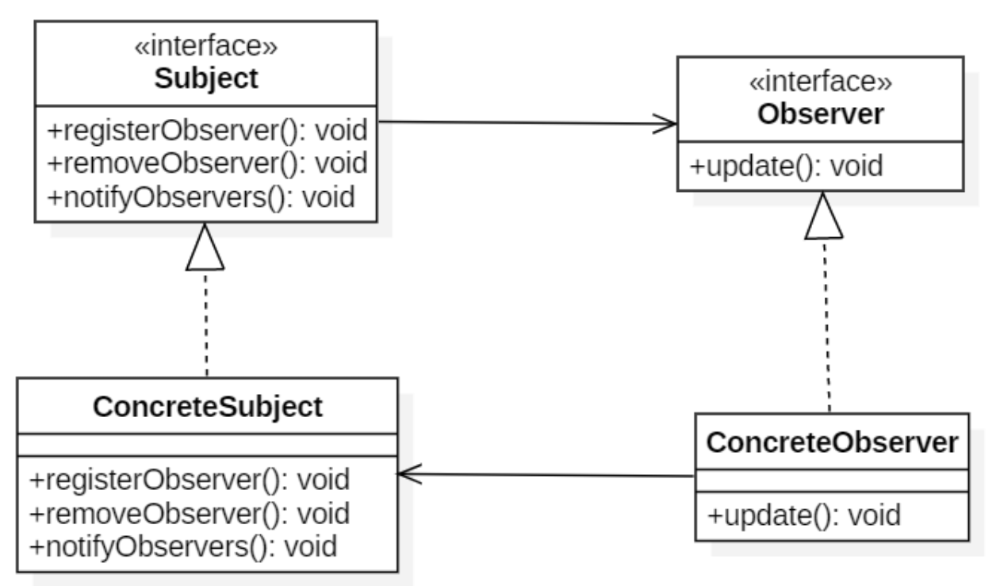

# 设计模式

<!-- GFM-TOC -->

* [设计模式](#设计模式)
* [一、设计模式分类](#一设计模式分类)
      * [1. 创建型模式](#1-创建型模式)
      * [2. 行为型模式](#2-行为型模式)
      * [3. 结构型模式](#3-结构型模式)
* [二、设计模式的六大原则（SOLID）](#二设计模式的六大原则solid)
      * [1. 单一责任原则（Single Responsibility Principle）](#1-单一责任原则single-responsibility-principle)
      * [2. 开闭原则**（open closed principle）**](#2-开闭原则open-closed-principle)
      * [3. 里氏替换原则（LSP liskov substitution principle）](#3-里氏替换原则lsp-liskov-substitution-principle)
      * [4. 最少知识原则**（law of demeter LOD）**](#4-最少知识原则law-of-demeter-lod)
      * [5. 接口隔离（interface segregation principle）](#5-接口隔离interface-segregation-principle)
      * [6. 依赖倒置原则（dependence inversion principle）](#6-依赖倒置原则dependence-inversion-principle)
* [三、具体设计模式](#三具体设计模式)
   * [1. 观察者模式*](#1-观察者模式)
      * [概述](#概述)
      * [实现](#实现)
      * [使用举例](#使用举例)
   * [2. 抽象工厂模式*](#2-抽象工厂模式)
      * [概述](#概述-1)
      * [类图](#类图)
      * [具体实现举例](#具体实现举例)
      * [项目中使用的 &amp;&amp; JAVA源码举例](#项目中使用的--java源码举例)
   * [3. 适配器模式](#3-适配器模式)
      * [概述](#概述-2)
      * [实现](#实现-1)
      * [项目中使用的 &amp;&amp; JAVA源码举例](#项目中使用的--java源码举例-1)
   * [4. 桥接模式](#4-桥接模式)
      * [概述](#概述-3)
      * [实现](#实现-2)
      * [项目中使用的 &amp;&amp; JAVA源码举例](#项目中使用的--java源码举例-2)
   * [5. 建造者/生成器模式](#5-建造者生成器模式)
      * [概述](#概述-4)
      * [实现](#实现-3)
      * [项目中使用的 &amp;&amp; JAVA源码举例](#项目中使用的--java源码举例-3)
   * [6. 命令模式](#6-命令模式)
      * [概述](#概述-5)
      * [实现](#实现-4)
      * [项目中使用的 &amp;&amp; JAVA源码举例](#项目中使用的--java源码举例-4)
   * [7. 组合模式](#7-组合模式)
      * [概述](#概述-6)
      * [实现](#实现-5)
      * [项目中使用的 &amp;&amp; JAVA源码举例](#项目中使用的--java源码举例-5)
   * [8. 装饰器模式*](#8-装饰器模式)
      * [概述](#概述-7)
      * [实现](#实现-6)
      * [项目中使用的 &amp;&amp; JAVA源码举例](#项目中使用的--java源码举例-6)
   * [9. 外观模式](#9-外观模式)
      * [概述](#概述-8)
      * [实现](#实现-7)
      * [项目中使用的 &amp;&amp; JAVA源码举例](#项目中使用的--java源码举例-7)
   * [10. 工厂方法模式](#10-工厂方法模式)
      * [概述](#概述-9)
      * [类图](#类图-1)
      * [具体实现举例](#具体实现举例-1)
      * [项目中使用的 &amp;&amp; JAVA源码举例](#项目中使用的--java源码举例-8)
   * [11. 迭代器模式*](#11-迭代器模式)
      * [概述](#概述-10)
      * [实现](#实现-8)
      * [项目中使用的 &amp;&amp; JAVA源码举例](#项目中使用的--java源码举例-9)
   * [12. 原型模式](#12-原型模式)
      * [概述](#概述-11)
      * [实现](#实现-9)
      * [项目中使用的 &amp;&amp; JAVA源码举例](#项目中使用的--java源码举例-10)
   * [13. 代理模式*](#13-代理模式)
      * [概述](#概述-12)
      * [实现](#实现-10)
      * [项目中使用的 &amp;&amp; JAVA源码举例](#项目中使用的--java源码举例-11)
      * [补充说明](#补充说明)
   * [14. 简单工厂模式](#14-简单工厂模式)
      * [概述](#概述-13)
      * [类图](#类图-2)
      * [具体实现举例](#具体实现举例-2)
      * [项目中使用的 &amp;&amp; JAVA源码举例](#项目中使用的--java源码举例-12)
   * [15. 单例模式*](#15-单例模式)
      * [概述](#概述-14)
      * [类图](#类图-3)
      * [具体实现举例](#具体实现举例-3)
         * [饿汉式写法](#饿汉式写法)
         * [懒加载+双重检查](#懒加载双重检查)
         * [静态内部类写法](#静态内部类写法)
         * [【终极】枚举类写法](#终极枚举类写法)
      * [项目中使用的 &amp;&amp; JAVA源码举例](#项目中使用的--java源码举例-13)
   * [16. 状态模式](#16-状态模式)
      * [概述](#概述-15)
      * [实现](#实现-11)
      * [项目中使用的 &amp;&amp; JAVA源码举例](#项目中使用的--java源码举例-14)
      * [补充说明](#补充说明-1)
   * [17. 策略模式](#17-策略模式)
      * [概述](#概述-16)
      * [类图](#类图-4)
      * [具体实现举例](#具体实现举例-4)
      * [项目中使用过的 &amp;&amp; JAVA源码举例](#项目中使用过的--java源码举例)
   * [18. 模板模式*](#18-模板模式)
      * [概述](#概述-17)
      * [实现](#实现-12)
      * [项目中使用的 &amp;&amp; JAVA源码举例](#项目中使用的--java源码举例-15)
      * [补充](#补充)
   * [19. 生产者消费者模式](#19-生产者消费者模式)

<!-- Created by https://github.com/ekalinin/github-markdown-toc -->

几乎所有设计模式都是基于多态的特性！

# 一、设计模式分类

### 1. 创建型模式

这些设计模式提供了一种在创建对象的同时**隐藏创建逻辑**的方式，而不是使用 new 运算符直接实例化对象。这使得程序在判断针对某个给定实例需要创建哪些对象时更加灵活。

- [单例](src/main/java/singleton/单例模式.md) **（Singleton）**

  > 保证一个类仅有一个实例，并提供一个访问它的全局访问点。

- [简单工厂](src/main/java/simplefactory/简单工厂模式.md) **（SimpleFactory）**

  > 利用工厂生产不同的对象。

- [工厂方法](src/main/java/factorymethod/工厂方法.md) **(FactoryMethod)**

  > 用不同的工厂生产不同的对象，创建对象在子类中执行（是抽象工厂的特例）。

- [抽象工厂](src/main/java/abstractfactory/抽象工厂.md) **（Abstract Factory）**

  > 使用不同的工厂产生不同的相关对象族。

- [建造者](src/main/java/builder/建造者模式.md) **（Builder）**

  > 简化复杂类的实例化/构建过程。

- [原型](src/main/java/prototype/原型模式.md) **（Prototype）**

  > 创建重复对象/克隆。

### 2. 行为型模式

这些设计模式关注类和对象的组合。继承的概念被用来组合接口和定义组合对象获得新功能的方式。

- [策略](src/main/java/strategy/策略模式.md)**（Strategy）**

  > 封装可以互换的行为，并由委托来决定具体使用哪一个。

- [观察者](src/main/java/abserver/观察者模式.md) **（Observer）**

  > 当一个对象状态改变时，它的所有依赖都会收到通知并且自动更新状态。

- [命令](src/main/java/command/命令模式.md) **(Command)**

  > 将一个请求封装成一个对象，从而使您可以用不同的请求来参数化其他对象。

- [模板](src/main/java/template/模板模式.md) **（Template）**

  > 定义个算法骨架(步骤), 将骨架一部分具体步骤推迟到子类中进行实现。可以保证在不改变算法结构的同时，重新定义某些步骤。

- [迭代器](src/main/java/iterator/迭代器模式.md) **（Iterator）**

  > 提供一种顺序访问聚合对象元素的方法，并且不暴露聚合对象的内部表示。

- [状态](src/main/java/state/状态模式.md) **(State)**

  > 允许对象在内部状态改变时改变它的行为，对象看起来好像修改了它所属的类。

### 3. 结构型模式

这些设计模式特别关注对象之间的通信。

- [适配器模式](src/main/java/adapter/适配器模式.md) （**Adapter）**

  > 作为两个不兼容的接口之间的桥梁。

- [外观模式](src/main/java/facade/外观模式.md) **（Facade）**

  > 将复杂的系统调用统一成一个对外的调用接口。

- [桥接模式](src/main/java/bridge/桥接模式.md) **（Bridge）**

  > 用于把抽象化与实现化解耦，使得二者可以独立变化。

- [装饰器模式](src/main/java/decorator/装饰器模式.md)**（Decorator）**

  > 允许向一个现有的对象添加新的功能，同时又不需要改变其原始结构。

- [组合模式](src/main/java/composite/组合模式.md) **(Composite)**

  > 将对象组合成树形结构来表示“整体/部分”层次关系，允许用户以相同的方式处理单独对象和组合对象。

- [代理模式](src/main/java/proxy/代理模式.md) **(Proxy)**

  > 为其他对象提供一种代理以控制对这个对象的访问。

# 二、设计模式的六大原则（SOLID）

所有原则都不是强制性的，所有设计都需要折中（抽象和速度、时间和空间......），在采用原则前必须全盘考虑进行取舍。

- 封装会变化的部分
- 多用组合、少用继承
- 针对接口编程，而不是针对实现
- 交互对象之间的尽量松耦合
- 对扩展开放，对修改关闭

六大原则缩写**SOLID**。

### 1. 单一责任原则（Single Responsibility Principle）

**一个类只负责做一件事。**高内聚、低耦合！

### 2. 开闭原则**（open closed principle）**

**类应该对扩展开放，对修改关闭**。

- 花费大量时间进行编写并完成测试后的代码不应该随意被修改。
- 使用各类设计模式可以在不改变原始类的情况下很容易的扩展类的行为（热拔插）。

要实现上述效果，必须充分利用接口和抽象类。

### 3. 里氏替换原则（LSP liskov substitution principle）

子类可以扩展父类的功能，但不能改变原有父类的功能（本质其实就是多态）。（目的：增强程序的健壮性）实际项目中，每个子类对应不同的业务含义，使父类作为参数，传递不同的子类完成不同的业务逻辑。

### 4. 最少知识原则**（law of demeter LOD）**

**只和你的密友进行谈话**。最少知识（Least Knowledge）原则告诉我们应该尽量减少对象之间的交互，避免让太多类耦合在一起！如果许多类耦合在一起，系统将变得复杂而不易被其它人了解，维护困难。

### 5. 接口隔离（interface segregation principle）

建立单一接口；（扩展为类也是一种接口，一切皆接口）。

　　　定义：

　　　　a.客户端不应该依赖它不需要的接口；

　　　　b.类之间依赖关系应该建立在最小的接口上；

### 6. 依赖倒置原则（dependence inversion principle）

**要依赖抽象，不要依赖具体类**。编程要针对接口而不是具体的实现类。"倒置"体现在底层具体实现类依赖于高层需要的接口抽象。具体的实施方法（没法完全遵守）：

- 变量不可以持有具体类的引用（如使用`new`创建对象）。
- 不要让类派生自具体类，而应该派生自抽象类或者接口。
- 不要覆盖基类中已经实现的方法（否则需要重新考虑在基类中将该方法设计成抽象方法或者移除该方法，因为基类中的方法实现应该由所有子类共享）。

**优点**

- 各个模块之间松耦合，相对独立，易于维护。
- 使用者不需要知道所有细节，易于开发和维护。

**缺点**

- 会增加很多用于处理组件之间沟通的包装类（如`外观`），增加开发时间，可能会降低软件性能。


# 三、具体设计模式

## 1. 观察者模式*

###  概述

定义对象间的一种一对多的依赖关系，当一个对象的状态发生改变时，所有依赖于它的对象都得到通知并被自动更新。

主题（Subject）是被观察的对象，而其所有依赖者（Observer）称为观察者。

**类图**




- Subject：主题，定义了注册和移除观察者、并通知所有观察者（类似**PUSH**的机制）的接口，主题的实现类可以通过维护一张观察者列表来实现这些操作。
- ConcreteSubject： `Subject`)接口的具体实现类，内部需要维护一张观察者`Observer`的列表。
- Observer：观察者，定义了需要被`Subject`调用的`update()`接口。
- ConcreteObserver：观察者接口的具体实现类，在构造时需要传入一个`Subject`指针，方便随时把自己**注册/取消注册**为观察者。

**使用场景**

- 一个对象的改变将导致其他一个或多个对象也发生改变，而不知道具体有多少对象将发生改变，可以降低对象之间的耦合度。
- 一个对象必须通知其他对象，而并不知道这些对象是谁。
- 需要在系统中创建一个触发链，A对象的行为将影响B对象，B对象的行为将影响对象……，可以使用观察者模式创建一种链式触发机制。

**优点**

- 观察者和被观察者是抽象耦合的（交互对象之间具有松耦合的特性）。 
- 建立一套触发机制。

**缺点**

- 观察者种类繁多，需要的数据可能也不统一，此时主题需要针对每种不同的观察者使用不同的`update()`接口，代码又产生耦合了。

  > 可以在主题实现类中暴露一系列getter()方法，让观察者在update()方法中去调用，这样观察者就可以在数据变化时去主动获取自己想要的一些数据了，而不是被动接受来自主题通知的所有数据-PULL模式。

- 如果观察者和观察目标间有循环依赖，可能导致系统崩溃。

###  实现

Java本身支持该模式可使用`java.util.Observer`接口和`java.util.Observable`类（类似类图中的`Subject`接口）。但是Java支持单继承，所以这也就限制了`Observable`的使用。

下面自己实现一下相应的接口，模拟场景如下所述：

>现在有一个气象站可以不断监测天气数据的变化，天气数据显示板板会在天气信息发生改变时更新其内容，显示板有多个种类（如显示当前天气数据的、显示未来预测天气数据的），并且在将来会继续增加。

首先定义主题及其实现类：

```java
// 主题接口定义
public interface Subject {
    public void registerObserver(MyObserver observer);

    public void removeObserver(MyObserver observer);

    public void notifyObserver();
}

// 模拟一个气象站
public class WeatherData implements Subject {
    /**
     * 存储所有的已注册观察者
     */
    List<MyObserver> observers;

    private float humidity;

    private float temperature;

    public WeatherData() {
        this.observers = new ArrayList<>();
    }

    @Override
    public void registerObserver(MyObserver observer) {
        observers.add(observer);
    }

    @Override
    public void removeObserver(MyObserver observer) {
        observers.remove(observer);
    }

    @Override
    public void notifyObserver() {
        // 通知各个观察者，天气数据已经发生变化了
        for (MyObserver observer : observers) {
            observer.update(temperature, humidity);
        }
    }

    /**
     * 模拟测量天气数据，更新相关数据并通知观察者
     */
    public void measurementChange(){
        // 模拟传感器产生一个随机值
        Random sensor = new Random();
        this.humidity = 10 * sensor.nextFloat();
        this.temperature = sensor.nextFloat();

        notifyObserver();
    }
}
```

定义观察者接口及其实现类：

```java
// 观察者接口定义
public interface MyObserver {
    public void update(float temperature, float humidity);
}

// 显示板公共接口定义
public interface DisplayData {
    public void display();

    public void stopDisplay();
}

// 具体实现类-显示当前天气数据的显示板
public class CurrentDataDisplay implements MyObserver, DisplayData {
    private float temperature;

    private float humidity;

    /**
     * 记录 主题 的引用，方便随时注册/取消注册
     */
    private Subject weatherData;

    public CurrentDataDisplay(Subject weatherData) {
        this.weatherData = weatherData;
        weatherData.registerObserver(this);
    }

    @Override
    public void update(float temperature, float humidity) {
        this.temperature = temperature;
        this.humidity = humidity;
        display();
    }

    @Override
    public void display() {
        System.out.println("-------------Current Data-----------");
        System.out.println("temperature:" + temperature + "℃  humidity:" + humidity + "%");
        System.out.println("------------------------------------");
    }

    @Override
    public void stopDisplay() {
        weatherData.removeObserver(this);
    }
}

// 具体实现类-显示未来预测天气数据的显示板
public class PredictDisplay implements MyObserver, DisplayData {
    private float temperature;

    private float humidity;

    /**
     * 记录 主题 的引用，方便随时注册/取消注册
     */
    private Subject weatherData;

    public PredictDisplay(Subject weatherData) {
        this.weatherData = weatherData;
        weatherData.registerObserver(this);
    }

    @Override
    public void update(float temperature, float humidity) {
        this.temperature = temperature;
        this.humidity = humidity;
        display();
    }

    @Override
    public void display() {
        System.out.println("-------------Future Data-----------");
        System.out.println("temperature:" + (temperature + 1) + "℃  humidity:" + (humidity + 10) + "%");
        System.out.println("------------------------------------");
    }

    @Override
    public void stopDisplay() {
        weatherData.removeObserver(this);
    }
}
```

客户端测试代码：

```java
public class Client {
    public static void main(String[] args) {
        WeatherData weatherData = new WeatherData();

        // 注册为观察者
        CurrentDataDisplay curDisplay = new CurrentDataDisplay(weatherData);
        PredictDisplay preDisplay = new PredictDisplay(weatherData);
        weatherData.measurementChange();

        System.out.println("\n");

        // 不再作为观察者
        preDisplay.stopDisplay();
        weatherData.measurementChange();
    }
}

// -------------打印输出---------------------
-------------Current Data-----------
temperature:0.009705603℃  humidity:2.7075803%
------------------------------------
-------------Future Data-----------
temperature:1.0097055℃  humidity:12.707581%
------------------------------------

-------------Current Data-----------
temperature:0.074554324℃  humidity:8.437403%
------------------------------------
```


###  使用举例

- ns-3中的`Callback`机制？
- **iot-apps**项目中，所有的策略都可以作为观察者注册到汇聚节点上不同的主题中（温湿度主题、红外震动图像声音异常主题）。
- [java.util.Observer](http://docs.oracle.com/javase/8/docs/api/java/util/Observer.html) 具体可以参考源码或者[Head first 设计模式](../../resources/Head First设计模式（中文版）.pdf) page85~92 
- [java.util.Observable](http://docs.oracle.com/javase/8/docs/api/java/util/Observable.html) 具体可以参考源码或者[Head first 设计模式](../../resources/Head First设计模式（中文版）.pdf) page85~92 观察者可以以PUSH/PULL的方式获取到主题数据。
- [java.util.EventListener](http://docs.oracle.com/javase/8/docs/api/java/util/EventListener.html)
- [javax.servlet.http.HttpSessionBindingListener](http://docs.oracle.com/javaee/7/api/javax/servlet/http/HttpSessionBindingListener.html)


## 2. 抽象工厂模式*

### 概述

提供一个接口，用于创建 **相关的对象家族**  。

> **工厂方法** 模式是 **抽象工厂** 的一个特例，只不过工厂方法产生的产品族中只有一种产品！

**缺点**：不方便扩展产品族中的产品种类（一旦扩展则需要改变抽象工厂及其所有子类实现的代码）。

###  类图

如使用抽象工厂`AbstractFactory`（抽象类+抽象`create`方法）定义要生产的产品族（`Vehicle`和`Weapon`），而古代工厂`AncientFactory`和现代工厂`ModernFactory`则继承自抽象工厂，分别实现对应的`create`方法来生产古代和现代对应的产品族。


抽象工厂模式创建的是对象家族，也就是很多对象而不是一个对象，并且这些对象是相关的，也就是说必须一起创建出来。而工厂方法模式只是用于创建一个对象，这和抽象工厂模式有很大不同。

**抽象工厂模式用到了工厂方法模式来创建单一对象**，`AbstractFactory `中的 `createVehicle()` 和 `createWeapon()` 方法都是让子类来实现，这两个方法单独来看就是在创建一个对象，这符合工厂方法模式的定义。

至于创建对象的家族这一概念是在 `Client` 体现，`Client` 要通过 `AbstractFactory` 同时调用两个方法来创建出两个对象，在这里这两个对象就有很大的相关性，`Client` 需要同时创建出这两个对象。

从高层次来看，抽象工厂使用了组合，即 Cilent 组合了` AbstractFactory`，而工厂方法模式使用了继承。

###  具体实现举例

抽象类定义

```java
// 武器抽象类
public abstract class Weapon {
    /**
     * 武器的攻击方式
     */
    abstract void attack();
}

// 交通工具抽象类
public abstract class Vehicle {
    /**
     * 交通工具的移动方式
     */
    abstract void move();
}

// 抽象工厂
public abstract class AbstractFactory {
    /**
     * 创建交通工具
     * @return 交通工具实例
     */
    abstract Vehicle createVehicle();

    /**
     * 创建武器
     * @return 武器实例
     */
    abstract Weapon createWeapon();
}
```

具体的的实现类定义

```java
// 古代交通工具：马
public class Horse extends Vehicle {
    @Override
    void move() {
        System.out.println("Horse move...");
    }
}

// 现代交通工具：汽车
public class Car extends Vehicle {
    @Override
    void move() {
        System.out.println("Car move...");
    }
}

// 古代武器：剑
public class Sword extends Weapon {
    @Override
    void attack() {
        System.out.println("Sword attack...");
    }
}

// 现代武器：枪
public class Gun extends Weapon {
    @Override
    void attack() {
        System.out.println("Gun attack...");
    }
}

// 古代工厂实现
public class AncientFactory extends AbstractFactory {
    @Override
    Vehicle createVehicle() {
        return new Horse();
    }

    @Override
    Weapon createWeapon() {
        return new Sword();
    }
}

// 现代工厂实现
public class ModernFactory extends AbstractFactory {
    @Override
    Vehicle createVehicle() {
        return new Car();
    }

    @Override
    Weapon createWeapon() {
        return new Gun();
    }
}
```

客户端/测试代码：

```java
public class AbstractFactoryTest {
    public static void main(String[] args) {
        // 现代工厂，生产现代的产品族
        AbstractFactory modernFactory = new ModernFactory();
        Vehicle modernVehicle = modernFactory.createVehicle();
        Weapon modernWeapon = modernFactory.createWeapon();
        modernVehicle.move();
        modernWeapon.attack();

        // 古代工厂，生产古代的产品族
        AbstractFactory ancientFactory = new AncientFactory();
        Vehicle ancientVehicle = ancientFactory.createVehicle();
        Weapon ancientWeapon = ancientFactory.createWeapon();
        ancientVehicle.move();
        ancientWeapon.attack();
    }
}
```

###  项目中使用的 && JAVA源码举例

- [javax.xml.parsers.DocumentBuilderFactory](http://docs.oracle.com/javase/8/docs/api/javax/xml/parsers/DocumentBuilderFactory.html)
- [javax.xml.transform.TransformerFactory](http://docs.oracle.com/javase/8/docs/api/javax/xml/transform/TransformerFactory.html#newInstance--)
- [javax.xml.xpath.XPathFactory](http://docs.oracle.com/javase/8/docs/api/javax/xml/xpath/XPathFactory.html#newInstance--)


## 3. 适配器模式

### 概述

适配器模式（Adapter Pattern）是作为两个不兼容的接口之间的桥梁。这种类型的设计模式属于结构型模式，它结合了两个独立接口的功能。可以实现对内提供统一的调用接口。

**类图**

以下为对象适配器（Adapter实现Target接口，引用Adaptee类），还有一种叫做类适配器的东西（Adapter继承Target类和Adaptee类），Java中无多重继承所以无法实现。


- Client：客户端代码，适配器的调用者。
- Target：`Client`要调用的目标对象，定义了一个`request`接口。
- Adapter：适配器，需要实现Target中定义的接口，它是将被适配者和目标接口组合到一起的类，将`request`调用转换成被适配者的一个或者多个接口调用。
- Adaptee：被适配的旧代码，`specificRequest()`为旧的接口。该类对Client来说是透明的。

**意图**

将一个类的接口转换成客户希望的另外一个接口。适配器模式使得原本由于接口不兼容而不能一起工作的那些类可以一起工作，这样客户不需要为Adaptee的接口变化而频繁修改调用代码，只需要在适配器上做同一的修改即可。

**使用场景**

适配器模式专用来在系统后期扩展、修改时使用。

**优点**

- 可以让任何两个没有关联的类一起运行。 
- 提高了类/代码的复用程度，灵活性好。

**缺点**

- 过多地使用适配器，会让系统非常零乱，不易整体进行把握。

> 比如，明明看到调用的是 A 接口，其实内部被适配成了 B 接口的实现，一个系统如果太多出现这种情况，无异于一场灾难。因此如果不是很有必要，可以不使用适配器，而是直接对系统进行重构。 

### 实现

假设我们需要使用一个安卓充电器给Iphone充电。

首先定义Android充电器(`Adaptee`)和Iphone充电接口(`Target`)：

```
public class AndroidCharger {
    void changeAndroidPhone(){
        System.out.println("charging android phone...");
    }
}

public interface IphoneCharger {
    /**
     * 给IPhone手机充电
     */
    void chargeIphone();
}
```

然后定义Iphone充电适配器（`Adapter`，用于把Android接口转换成Iphone充电接口）:

```java
public class IphoneChargerAdapter implements IphoneCharger {
    private AndroidCharger androidCharger;

    public IphoneChargerAdapter(AndroidCharger androidCharger) {
        this.androidCharger = androidCharger;
    }

    @Override
    public void chargeIphone() {
        androidCharger.changeAndroidPhone();
        System.out.println("正在进行安卓充电器--->苹果充电器的转换");
        System.out.println("charging iphone...");
    }
}
```

客户端测试代码：

```java
public class AdapterTest {
    public static void main(String[] args) {
        AndroidCharger androidCharger = new AndroidCharger();
        IphoneCharger iphoneCharger = new IphoneChargerAdapter(androidCharger);
        iphoneCharger.chargeIphone();
    }
}

// 输出------------------
charging android phone...
正在进行安卓充电器--->苹果充电器的转换
charging iphone...
```

对于客户端来说，他不知道自己实际上是在使用安卓充电器给苹果手机充电。

### 项目中使用的 && JAVA源码举例

- 对底层硬件数据接口增加适配器，以便和已有的仿真数据接口兼容，这样上层可以统一处理来自硬件实物底层和仿真底层的数据包。

- [java.util.Arrays#asList()](http://docs.oracle.com/javase/8/docs/api/java/util/Arrays.html#asList(T...))
- [java.util.Collections#list()](https://docs.oracle.com/javase/8/docs/api/java/util/Collections.html#list-java.util.Enumeration-)
- [java.util.Collections#enumeration()](https://docs.oracle.com/javase/8/docs/api/java/util/Collections.html#enumeration-java.util.Collection-)
- [javax.xml.bind.annotation.adapters.XMLAdapter](http://docs.oracle.com/javase/8/docs/api/javax/xml/bind/annotation/adapters/XmlAdapter.html#marshal-BoundType-)


## 4. 桥接模式

### 概述

桥接（Bridge）是用于把抽象化与实现化解耦，使得二者可以独立变化。这种类型的设计模式属于结构型模式，它通过提供抽象化和实现化之间的桥接结构，来实现二者的解耦。

这种模式涉及到一个作为**桥接**的接口，使得实体类的功能独立于接口实现类。这两种类型的类可被结构化改变而互不影响。

> 桥接模式是一种很实用的结构型设计模式，如果软件系统中某个类存在两个独立变化的维度，通过该模式可以将这两个维度分离出来，使两者可以独立扩展，让系统更加符合"单一职责"原则。

**类图**


- Abstraction：定义抽象类的接口（内部有一个`Set(Implementor implementor)`方法，以便设置Implementor类型的成员变量并在`operation()`中调用`implementor.oprationImpl()`）。
- Implementor：定义实现类接口。
- RedinedAbstraction：`Abstraction`抽象类的实现，同时可以扩充方法。
- ConcreteImplementor：`Implementor`的接口实现类。

在这种情况下，`Abstraction`和`Implementor`都可以利用各自的继承不断独立扩展，两者解耦。

**意图**

另抽象类和具体的实现类解耦，使他们都可以独立扩展变化。

**使用场景**

- 设计中有超过一维的变化我们就可以用桥模式。如果只有一维在变化，那么我们用继承就可以圆满的解决问题。

**优点**

- 抽象和实现的分离，可以独立扩展，不会影响到对方。
- 对于具体的实现类作出的改变，不会影响到Client端。

**缺点**

- 增加了系统/代码的复杂度。

###  实现

以手机为例，假设我们的手机可以从两个维度进行变化，一个是品牌，一个是内存。此时我们就可以通过桥接模式将这两个维度分离开来，每一个维度都可以独立扩展。比如说手机品牌，可以又出现了苹果、三星、锤子等等。内存方面又可以生产10G、16G的。

首先定义抽象类（Abstraction）：

```java
public abstract class AbstractPhone {
    /**
     * 手机内存模块
     * protected变量，可以被子类访问
     */
    protected Memory memory;

    public void setMemory(Memory memory) {
        this.memory = memory;
    }

    /**
     * 给手机添加内存容量的接口
     */
    abstract void addMemoryCapacity();
}
```

定义抽象类的具体实现类（RedinedAbstraction）：

```java
// 华为手机
public class HuaweiPhone extends AbstractPhone {
    @Override
    void addMemoryCapacity() {
        System.out.println("给华为手机添加内存容量...");
        memory.addMemoryCapacity();
    }

    /**
     * 华为手机特有的功能-反向无线充电
     */
    public void wirelessChargeReversely() {
        System.out.println("华为手机正在给别的设备进行反向无线充电...");
    }
}

// 小米手机
public class MiPhone extends AbstractPhone {
    @Override
    void addMemoryCapacity() {
        System.out.println("给小米手机添加内存容量...");
        memory.addMemoryCapacity();
    }

    /**
     * 小米手机特有的功能，同步小米云服务
     */
    public void syncMiCloud() {
        System.out.println("正在同步小米云服务...");
    }
}
```

定义实现类接口（Implementor）：

```java
public interface Memory {
    /**
     * 给手机添加内存
     */
    void addMemoryCapacity();
}
```

定义实现类接口的具体实现（ConcreteImplementor），里面包含抽象类`AbstractPhone`中定义的`addMemoryCapacity()`接口的具体实现：

```java
// 4G内存
public class Memory4G implements Memory {
    @Override
    public void addMemoryCapacity() {
        System.out.println("给手机添加4G内存...");
    }

    /**
     * 4G内存特有的功能-低功耗运行
     */
    public void lowPower(){
        System.out.println("低功耗运行...");
    }
}

// 6G内存
public class Memory6G implements Memory {
    @Override
    public void addMemoryCapacity() {
        System.out.println("给手机添加6G内存...");
    }

    /**
     * 6G内存特有的功能-开启游戏模式
     */
    public void enableGameMode(){
        System.out.println("正在开启游戏模式...");
    }
}
```

测试代码：

```java
public class Client {
    public static void main(String[] args) {
        // 手机和内存可以利用桥接进行自由组合，而不需要对抽象类进行2x2个子类的实现
        // 给小米手机加6G内存
        AbstractPhone miPhone = new MiPhone();
        miPhone.setMemory(new Memory6G());
        miPhone.addMemoryCapacity();

        // 给华为手机加4G内存
        AbstractPhone huaweiPhone = new HuaweiPhone();
        huaweiPhone.setMemory(new Memory4G());
        huaweiPhone.addMemoryCapacity();
    }
}
```

这样我们可以随意扩展`Memory`和`AbstractPhone`的子类，两者互不影响，只需要保证公共接口`addMemoryCapacity()`不变即可，如果在传统的写法下，我们可能要定义`Huawe/Mi-PhoneMemory-4G/6G`共四个实现类，如果手机品牌和内存大小继续增加，则需要定义更多的排列组合实现类。

使用了桥接模式之后，我们的两个维度就像桥梁一样被链接了起来，体现了松耦合的特性。

###  项目中使用的 && JAVA源码举例

- SpringMVC中`Controller`层使用的`Service`接口就是这种模式？


## 5. 建造者/生成器模式

### 概述

将一个复杂对象的构建与其表示分离，使得同样的构建过程可以创建不同的表示.

**类图**


- Product：最终要生成的对象。
- Builder：构建者的抽象基类（有时会使用接口代替）。其定义了构建`Product`的抽象步骤，其实体类需要实现这些步骤。其会包含一个用来返回最终产品的方法`Product getProduct()`。
- ConcreteBuilder：Builder的实现类。
- Director：决定如何构建最终产品的算法. 其会包含一个负责组装的方法`void Construct(Builder builder)`， 在这个方法中通过调用builder的方法，就可以设置builder，等设置完成后，就可以通过builder的 `getProduct()` 方法获得最终的产品。

**意图**

- 解决在软件系统中，有时候面临着"一个复杂对象"的创建工作，其通常由各个部分的子对象用一定的算法构成；由于需求的变化，这个复杂对象的各个部分经常面临着剧烈的变化，但是将它们组合在一起的算法却相对稳定。

**使用场景**

- 需要生成的对象具有复杂的内部结构/属性。 
- 需要生成的对象内部属性本身相互依赖。

> 当一个类的构造函数参数个数超过4个，而且这些参数有些是可选的参数，考虑使用构造者模式。

**优点**

- 建造者独立，易扩展/修改对象内部的构造细节。

**缺点**

- 如内部变化复杂，会有很多的建造类。

> 与工厂模式的区别：建造者模式更加关注与零件装配的顺序/细节。工厂模式更加注重生成不同的对象实例。

### 实现

假设我们有如下类定义

```
public class Computer {
    private String cpu;//必须
    private String ram;//必须
    private int usbCount;//可选
    private String keyboard;//可选
    private String display;//可选
}
```

为了满足`Computer`的各种可选参数和必选参数，我们可能对其进行组合得到很多个带参构造方法如

```java
public Computer(){...};
public Computer(String cpu, String ram){...};
public Computer(String cpu, String ram, int usbCount){...};
public Computer(String cpu, String ram, String keyboard){...};
...
```

或者不使用带参构造而是用多个`set()`方法来设置属性。

由此带来的弊端就是：构造方法太多，调用者很难选择；新建一个对象后，代码充斥着很多`set()`方法，不够简洁。

如果使用传统的`Builder`模式来实现，主要分为以下步骤：

```java
// 创建产品抽象类/接口
public class Computer {
    /**
     * CPU
     * 必选参数
     */
    private String cpu;

    /**
     * RAM
     * 必选参数
     */
    private String ram;

    /**
     * USB接口数
     * 可选参数
     */
    private int usbCount;

    /**
     * 键盘
     * 可选参数
     */
    private String keyboard;

    /**
     * 显示器
     * 可选参数
     */
    private String display;

    public Computer(String cpu, String ram) {
        this.cpu = cpu;
        this.ram = ram;
    }

    public void setUsbCount(int usbCount) {
        this.usbCount = usbCount;
    }

    public void setKeyboard(String keyboard) {
        this.keyboard = keyboard;
    }

    public void setDisplay(String display) {
        this.display = display;
    }

    @Override
    public String toString() {
        return "Computer{" +
                "cpu='" + cpu + '\'' +
                ", ram='" + ram + '\'' +
                ", usbCount=" + usbCount +
                ", keyboard='" + keyboard + '\'' +
                ", display='" + display + '\'' +
                '}';
    }
}

// 创建产品构建抽象类
public abstract class AbstractComputerBuilder {
    /**
     * 指定USB接口数
     */
    public abstract void setUsbCount();

    /**
     * 指定键盘
     */
    public abstract void setKeyboard();

    /**
     * 指定显示器
     */
    public abstract void setDisplay();

    /**
     * 获取产品实例
     *
     * @return Computer实例
     */
    public abstract Computer getComputer();
}
```

```java
// 创建产品构建指导者，由指导者负责调用复杂的构建/装配过程/算法
public class ComputerDirector {
    public void makeComputer(AbstractComputerBuilder builder) {
        builder.setUsbCount();
        builder.setDisplay();
        builder.setKeyboard();
    }
}
```

```java
// 对不同的产品实现不同的实体构建器
public class LenovoComputerBuilder extends AbstractComputerBuilder {
    private Computer computer;

    public LenovoComputerBuilder(String cpu, String ram) {
        computer = new Computer(cpu, ram);
    }

    @Override
    public void setUsbCount() {
        computer.setUsbCount(3);
    }

    @Override
    public void setKeyboard() {
        computer.setKeyboard("联想键盘");
    }

    @Override
    public void setDisplay() {
        computer.setDisplay("联想显示器");
    }

    @Override
    public Computer getComputer() {
        return computer;
    }
}

public class MacComputerBuilder extends AbstractComputerBuilder {
    private Computer computer;

    public MacComputerBuilder(String cpu, String ram) {
        computer = new Computer(cpu, ram);
    }

    @Override
    public void setUsbCount() {
        computer.setUsbCount(1);
    }

    @Override
    public void setKeyboard() {
        computer.setKeyboard("苹果键盘");
    }

    @Override
    public void setDisplay() {
        computer.setDisplay("苹果显示器");
    }

    @Override
    public Computer getComputer() {
        return computer;
    }
}
```

客户端测试代码

```java
public class BuildTest {
    public static void main(String[] args) {
        ComputerDirector director = new ComputerDirector();

        MacComputerBuilder macComputerBuilder = new MacComputerBuilder("苹果CPU", "苹果RAM");
        // 由构建指导者来自动调用复杂的构建处理方法
        director.makeComputer(macComputerBuilder);
        Computer macComputer = macComputerBuilder.getComputer();
        System.out.println(macComputer.toString());

        LenovoComputerBuilder lenovoComputerBuilder = new LenovoComputerBuilder("联想CPU", "联想RAM");
        // 由构建指导者来自动调用复杂的构建处理方法
        director.makeComputer(lenovoComputerBuilder);
        Computer lenovoComputer = lenovoComputerBuilder.getComputer();
        System.out.println(lenovoComputer.toString());
    }
}

// 打印输出
Computer{cpu='苹果CPU', ram='苹果RAM', usbCount=1, keyboard='苹果键盘', display='苹果显示器'}
Computer{cpu='联想CPU', ram='联想RAM', usbCount=3, keyboard='联想键盘', display='联想显示器'}
```

这样的设计，对调用者屏蔽了复杂的构建细节。

也可以省略Director的角色，将构建算法交给了client端，其次将builder 写到了要构建的产品类里面，最后采用了链式调用：

```java
public class Charges {
 
    private Builder builder;
 
    private Charges(Builder builder) {
        this.builder = builder;
    }
    
    public void Pay(){
        System.out.println("去支付");
        System.out.println("支付信息"+this.builder.params.id);
        System.out.println("支付信息"+this.builder.params.body);
    }
 
    /**
     * 参数类
     */
    private static class ChargesParams {
        String id;
        String crete;
        String channel;
        String orderId;
        String amount;
        String clienIp;
        String body;
    }
 
    /**
     * 构建类
     */
    public static class Builder {
 
        private ChargesParams params;
 		
        // 设置默认值
        public Builder() {
            this.params = new ChargesParams();
            this.params.id="10101010";
            this.params.channel="通道";
            this.params.orderId="orderId";
            this.params.body="支付商品详情";
            this.params.clienIp="192.168.12";
        }
 
        public Builder id(String id) {
            this.params.id = id;
            return this;
        }
 
        public Builder crete(String crete) {
            this.params.crete = crete;
            return this;
        }
 
        public Builder channel(String channel) {
            this.params.channel = channel;
            return this;
        }
 
        public Builder orderId(String orderId) {
            this.params.orderId = orderId;
            return this;
        }
 
        public Builder amount(String amount) {
            this.params.amount = amount;
            return this;
        }
 
        public Builder clienIp(String clienIp) {
            this.params.clienIp = clienIp;
            return this;
        }
 
        public Builder body(String body) {
            this.params.body = body;
            return this;
        }
 
        /**
         * 数据处理完毕之后处理逻辑放在构造函数里面
         *
         * @return
         */
        public Charges builder() {
            return new Charges(this);
        }
    }
}
```

测试代码，直接使用链式调用

```java
Charges charges = new Charges.Builder().crete("2017").body("支付宝支付")
                .amount("300").builder();
charges.Pay();
```

###  项目中使用的 && JAVA源码举例

- [java.lang.StringBuilder](http://docs.oracle.com/javase/8/docs/api/java/lang/StringBuilder.html)
- [java.nio.ByteBuffer](http://docs.oracle.com/javase/8/docs/api/java/nio/ByteBuffer.html#put-byte-)
- 项目中Dormancy/Judgement-Strategy属性过多，采用链式调用进行构造。


## 6. 命令模式

### 概述

将一个请求封装成一个对象，从而可以用不同的请求、队列（将命令放入队列中排队执行）、日志（将命令的操作记录到日志中）来参数化其他对象。命令模式也支持撤销操作。请求以命令的形式包裹在对象中，并传给调用对象。调用对象寻找可以处理该命令的合适的对象，并把该命令传给相应的对象，该对象执行命令。

**类图**


- **Invoker**：调用者，持有命令对象的引用，并负责调用命令对象的`execute()`方法，只负责调用命令进行执行，为直到命令具体是如何执行的。
- **Command**：命令接口定义，为所有命令定义了一个执行接口`execute()`和一个撤销`undo()`接口。
- **ConcreteCommand**：具体命令实现，持有对命令执行者的引用，负责调用命令执行者的`action()`方法，是命令调用者和命令执行者之间的桥梁，实现对两者的解耦。
- **Receiver**：命令的实际执行者。
- **Client**：客户端，负责配置创建命令，配置命令调用者和执行者。

**使用场景**

- 认为是命令的地方都可以使用命令模式，比如： 1、GUI 中每一个按钮都是一条命令。 2、模拟 CMD。
- 队列请求：将要执行的命令/请求依次排队，由多个线程负责从中取出命令并调用其`execute()`。
- 组合命令（增加一个Command, 内部调用多个其它command的execute()方法）等。
- 日志记录：通过给`Command`增加两个方法`store()`和`load()`，当执行命令的时候将日志存入磁盘，一旦系统死机可以将命令对象重新加载以便再次执行！

**优点**

- 降低系统耦合度，将命令调用者和执行者解耦。
- 容易灵活扩展新的命令供命令执行者执行。

**缺点**

- 使用命令模式可能会导致某些系统有过多的具体命令类。

###  实现

假设有一个遥控器，上面有两排按钮，没排都有一个on按钮和一个off按钮，另外遥控器上还有一个撤销按钮，用来撤销上次的操作。要求遥控器按下按钮后可以执行开关电源、开光灯的操作，且可以对遥控器的按钮功能进行灵活配置。

首先定义命令执行者``Receiver`

```java
// 电源
public class Power {
    void on() {
        System.out.println("电源打开...");
    }

    void off() {
        System.out.println("电源关闭...");
    }
}

// 灯
public class Light {
    void on() {
        System.out.println("开灯...");
    }

    void off() {
        System.out.println("关灯...");
    }
}
```

定义`Command`接口及其具体的实现类

```java
// 命令接口定义
public interface Command {
    void execute();	// 执行命令
    void undo();	// 撤销执行
}

// 空命令(初始化的时候使用，减少非空判断)
public class NullCommand implements Command {
    @Override
    public void execute() {
        System.out.println("空指令...");
    }

    @Override
    public void undo() {
        System.out.println("空指令...");
    }
}

// 开关灯命令
public class LightOnCommand implements Command {
    private Light light;

    public LightOnCommand(Light light) {
        this.light = light;
    }

    @Override
    public void execute() {
        light.on();
    }

    @Override
    public void undo() {
        light.off();
    }
}
public class LightOffCommand implements Command {
    private Light light;

    public LightOffCommand(Light light) {
        this.light = light;
    }

    @Override
    public void execute() {
        light.off();
    }

    @Override
    public void undo() {
        light.on();
    }


// 开关电源命令
public class PowerOnCommand implements Command {
    private Power power;

    public PowerOnCommand(Power power) {
        this.power = power;
    }

    @Override
    public void execute() {
        power.on();
    }

    @Override
    public void undo() {
        power.off();
    }
}
public class PowerOffCommand implements Command {
    private Power power;

    public PowerOffCommand(Power power) {
        this.power = power;
    }

    @Override
    public void execute() {
        power.off();
    }

    @Override
    public void undo() {
        power.on();
    }
}
```

定义命令调用者`Invoker`

```java
// 遥控器
public class RemoteController {
    private Command[] onCommands;
    private Command[] offCommands;
    private Command undoCommand;

    public RemoteController() {
        onCommands = new Command[2];
        offCommands = new Command[2];
        // 把所有按钮对应的指令设为空指令
        undoCommand = new NullCommand();
        for (int i = 0; i < 2; ++i) {
            onCommands[i] = new NullCommand();
            offCommands[i] = new NullCommand();
        }
    }

    /**
     * 配置按钮对应的功能
     */
    void setCommand(int index, Command onCommand, Command offCommand) {
        onCommands[index] = onCommand;
        offCommands[index] = offCommand;
    }

    void onButtonWasPushed(int index) {
        onCommands[index].execute();
        // 记录本次操作指令，方便撤销
        undoCommand = onCommands[index];
    }

    void offButtonWasPushed(int index) {
        offCommands[index].execute();
        // 记录本次操作指令，方便撤销
        undoCommand = onCommands[index];
    }

    void undoButtonWasPushed() {
        undoCommand.undo();
    }
}
```

定义客户端测试代码

```java
public class Client {
    public static void main(String[] args) {
        // 创建命令的实际执行者
        Power power = new Power();
        Light light = new Light();

        // 创建需要的各种控制命令
        PowerOnCommand powerOnCommand = new PowerOnCommand(power);
        PowerOffCommand powerOffCommand = new PowerOffCommand(power);
        LightOnCommand lightOnCommand = new LightOnCommand(light);
        LightOffCommand lightOffCommand = new LightOffCommand(light);

        // 创建并配置遥控器
        RemoteController controller = new RemoteController();
        controller.setCommand(0, powerOnCommand, powerOffCommand);
        controller.setCommand(1, lightOnCommand, lightOffCommand);

        // 执行控制测试
        // 依次按下：撤销、开电、开灯、撤销、关电
        controller.undoButtonWasPushed();
        controller.onButtonWasPushed(0);
        controller.onButtonWasPushed(1);
        controller.undoButtonWasPushed();
        controller.offButtonWasPushed(0);
    }
}

// 输出打印
/*
空指令...
电源打开...
开灯...
关灯...
电源关闭...
*/
```

###  项目中使用的 && JAVA源码举例

- [javax.swing.Action](http://docs.oracle.com/javase/8/docs/api/javax/swing/Action.html)


## 7. 组合模式

### 概述

将对象组合成**树形结构**来表示“整体/部分”层次关系，允许用户以相同的方式处理单独对象和组合对象。

**类图**


- Component：组件类（抽象），为组合中的所有对象（无论是**组合对象**还是**单独的对象**）定义一组公共接口，其子类可以选择性实现/重写其中某些接口/方法。【非叶子结点】
- Leaf：单独的对象/叶子类，通过实现Component支持的操作，定义了组合内的元素的行为。它不支持`add()`/`remove()`/`getChild()`方法。【叶子结点】
- Composite：组合类，定义组件的行为，而组合内部还有子节点。

> 组合对象拥有一个或者多个组件对象(可能是组合对象，也可能是叶子对象)，因此组合对象的操作可以委托给组件对象去处理，而组件对象可以是另一个组合对象或者叶子对象。

**使用场景**

- 部分、整体场景，如树形菜单，文件、文件夹的管理。
- 当有多个对象，他们之间有着"整体和部分"的关系时，并且想用一致的方法来对待这些对象，可以考虑使用**组合模式**。

**优点**

- 客户无需知道一个元素（组件）具体是什么，便可以使用统一的方法来访问这些元素（牺牲安全性以换取透明性）。高层调用简单。
- 为树形结构的面向对象实现提供了一种灵活的解决方案,通过叶子对象和容器对象的**递归组合**可以形成复杂的树形机构,但对树形结构的控制却很简单

**缺点**

- 在使用组合模式时，其叶子和树枝的声明都是实现类，而不是接口，违反了依赖倒置原则？
- 在增加新的构件时就比较难。而且难以限定，有时候希望在一个容器种能有某些特定的对象，例如在某个文件夹只能有image或者gif等。这个就比较难以实现。

###  实现

假设一个店内有多份菜单（早餐菜单和晚餐菜单），每个菜单中都有好几个菜品，而晚餐菜单中又包含一个甜点菜单（里面包含多种甜品）。要求服务员可以使用更统一的接口来介绍/访问所有的菜品。

说明：菜单和菜品之间就是一种组合关系，对服务员来说，*他不需要知道现在拿的菜单到底是只含有菜品还是还包含子菜单*，他都可以直接介绍出所有的菜品。

首先定义组件抽象类`Component`：

```java
// 菜单组件
public abstract class MenuComponent {
    // ---- 所有方法都定义默认实现, 子类可以选择部分需要支持的方法进行重写,
    // 子类不支持的方法直接抛出异常(牺牲安全性以换取透明性) ----

    /**
     * 增加菜单组件
     */
    public void add(MenuComponent component) {
        throw new UnsupportedOperationException();
    }

    /**
     * 移除指定的菜单组件
     */
    public void remove(MenuComponent component) {
        throw new UnsupportedOperationException();
    }

    /**
     * 获取本组件的子节点
     */
    public MenuComponent getChild(int i) {
        throw new UnsupportedOperationException();
    }

    /**
     * 打印所有菜单组件
     */
    public void print() {
        throw new UnsupportedOperationException();
    }

    /**
     * 判定是否为素食
     */
    public boolean isVegetarian(){
        throw new UnsupportedOperationException();
    }
}
```

定义组合类`Compsite`：

```java
// 菜单
public class Menu extends MenuComponent {
    private String name;

    List<MenuComponent> menuComponents;

    public Menu(String name) {
        this.name = name;
        menuComponents = new ArrayList<>();
    }

    @Override
    public void add(MenuComponent component) {
        menuComponents.add(component);
    }

    @Override
    public void remove(MenuComponent component) {
        menuComponents.remove(component);
    }

    @Override
    public MenuComponent getChild(int i) {
        // 返回第i个组件(子菜单/菜单项)
        return menuComponents.get(i);
    }

    @Override
    public void print() {
        System.out.println("*****" + this.name + "*****");
        Iterator<MenuComponent> iterator = menuComponents.iterator();
        while (iterator.hasNext()) {
            iterator.next().print();    // 递归打印
        }
    }
}
```

定义子节点类`Leaf`：

```java
// 菜品/菜单项
public class MenuItem extends MenuComponent {
    private String name;

    private Double price;

    private boolean vegetarian;

    public MenuItem(String name, Double price, boolean vegetarian) {
        this.name = name;
        this.price = price;
        this.vegetarian = vegetarian;
    }

    @Override
    public boolean isVegetarian() {
        return this.vegetarian;
    }

    @Override
    public void print() {
        System.out.println("- " + name + " 价格:" + this.price + "元 " + (vegetarian ? "是" : "不是") + "素食。");
    }
}
```

定义客户`Client`：

```java
// 服务员
public class Waiter {
    private MenuComponent allMenus;

    public Waiter(MenuComponent allMenus) {
        this.allMenus = allMenus;
    }
	// 介绍所有菜品：只需要使用一个统一的print()接口即可，无需知道allMenus里面到底有什么(-->透明性)
    public void introduceMenu() {
        allMenus.print();
    }
}
```

测试代码：

```java
public class Client {
    public static void main(String[] args) {
        // 所有菜单(相当于根节点)
        MenuComponent allMenus = new Menu("所有菜单");

        // 增加菜单项和子菜单
        MenuComponent breakfastMenu = new Menu("早餐菜单");
        breakfastMenu.add(new MenuItem("包子", 1.0, false));
        breakfastMenu.add(new MenuItem("豆浆", 2.0, true));
        breakfastMenu.add(new MenuItem("油条", 0.8, true));

        MenuComponent dinnerMenu = new Menu("晚餐菜单");
        dinnerMenu.add(new MenuItem("回锅肉", 20.0, false));
        dinnerMenu.add(new MenuItem("炒青菜", 8.0, true));
        dinnerMenu.add(new MenuItem("米饭", 0.5, true));
        MenuComponent dessert = new Menu("甜点菜单");
        dessert.add(new MenuItem("牛奶", 3.5, false));
        dessert.add(new MenuItem("蛋糕", 25.0, false));
        dessert.add(new MenuItem("甜甜圈", 7.0, false));
        // 晚餐菜单中嵌入甜点子菜单
        dinnerMenu.add(dessert);

        // --- 可能进行非法操作(把菜单添加到菜单项中 ) java.lang.UnsupportedOperationException
        /*
        MenuComponent testItem = new MenuItem("测试菜单项", 7.0, false);
        testItem.add(new Menu("测试菜单"));
        */

        allMenus.add(breakfastMenu);
        allMenus.add(dinnerMenu);

        // 让服务员介绍所有菜单
        Waiter waiter = new Waiter(allMenus);
        waiter.introduceMenu();
    }
}

// ----------- 打印输出 ------------
/*
*****所有菜单*****
*****早餐菜单*****
- 包子 价格:1.0元 不是素食。
- 豆浆 价格:2.0元 是素食。
- 油条 价格:0.8元 是素食。
*****晚餐菜单*****
- 回锅肉 价格:20.0元 不是素食。
- 炒青菜 价格:8.0元 是素食。
- 米饭 价格:0.5元 是素食。
*****甜点菜单*****
- 牛奶 价格:3.5元 不是素食。
- 蛋糕 价格:25.0元 不是素食。
- 甜甜圈 价格:7.0元 不是素食。
*/
```


###  项目中使用的 && JAVA源码举例

似乎没有太好的例子？

- java.util.Map#putAll(Map)
- java.util.List#addAll(Collection)
- java.util.Set#addAll(Collection)


## 8. 装饰器模式*

### 概述

允许向一个现有的对象添加新的功能，同时又不改变其结构。这种类型的设计模式属于结构型模式，它是作为现有的类的一个包装。

**类图**


- Component：组件，可以是接口或者抽象类。装饰者（`Decorator`）和具体组件（`ConcreteComponent`）都继承自组件（`Component`）。
- ConcreateCompoent：具体的组件实现类，即被装饰者，可以被各种各样的`Decorator`包装，从而增加新的功能。
- Decorator：装饰器的抽象类定义，里面包含了一个对Component的引用，方便对其功能进行扩展（`otherOperation()`）。
- ConcreateDecoratorA/B：添加了额外功能的具体装饰器实现，包装了被装饰者，可以递归进行装饰（一个装饰器外面再套一个装饰器，`ConcreateCompoent`一般处于最里面的层次）。

**使用场景**

- 扩展一个类的功能。 
- 动态增加功能，动态撤销。

**优点**

装饰类和被装饰类可以独立发展，不会相互耦合，装饰模式是继承的一个替代模式，装饰模式可以动态扩展一个实现类的功能。

**缺点**

多层装饰比较复杂。过多使用将使得代码中出现许多小对象，让程序变得复杂。

###  实现

假设有一个饮料店出售牛奶和咖啡两种饮料，同时可以在饮料里加任意配料如：糖、椰果、芝士奶盖。每种配料价格不同，饮料本身的价格也不一样。每增加一种配料，该饮料的价格就会增加，要求计算一种饮料的价格。

首先定义`Component`（组件）和`Decorator`（装饰器抽象类）

```java
// 抽象饮料类
public abstract class Beverage {
    private String description;

    /**
     * 获取价格
     */
    abstract public double cost();

    public String getDescription() {
        return description;
    }
}

// 饮料的配料抽象类
public abstract class CondimentDecorator extends Beverage {
    /**
     * 所有子类必须重新实现getDescription方法
     */
    @Override
    public abstract String getDescription();
}
```

定义ConcreateCompoent类（被装饰的对象）

```java
// 咖啡饮料
public class Coffee extends Beverage {
    @Override
    public double cost() {
        return 10.0;
    }

    @Override
    public String getDescription() {
        return "咖啡饮料";
    }
}

// 牛奶饮料
public class Milk extends Beverage {
    @Override
    public double cost() {
        return 5.0;
    }

    @Override
    public String getDescription() {
        return "牛奶饮料";
    }
}
```

定义ConcreateDecorator（具体的装饰器实现类）

```java
// 糖
public class Sugar extends CondimentDecorator {
    /**
     * 被装饰的对象(饮料)的引用
     */
    private Beverage beverage;

    public Sugar(Beverage beverage) {
        this.beverage = beverage;
    }

    @Override
    public double cost() {
        return beverage.cost() + 0.5;
    }

    @Override
    public String getDescription() {
        return beverage.getDescription() + " + 糖";
    }
}


// 椰果
public class Coconut extends CondimentDecorator {
    /**
     * 被装饰的对象(饮料)引用
     */
    private Beverage beverage;

    public Coconut(Beverage beverage) {
        this.beverage = beverage;
    }

    @Override
    public double cost() {
        return beverage.cost() + 1.0;
    }

    @Override
    public String getDescription() {
        return beverage.getDescription() + " + 椰果";
    }
}

// 芝士奶盖
public class CheeseCover extends CondimentDecorator {
    /**
     * 被装饰的对象(饮料)引用
     */
    private Beverage beverage;

    public CheeseCover(Beverage beverage) {
        this.beverage = beverage;
    }

    @Override
    public double cost() {
        return beverage.cost() + 1.5;
    }

    @Override
    public String getDescription() {
        return beverage.getDescription() + " + 芝士奶盖";
    }
}
```

测试代码

```java
public class Client {
    public static void main(String[] args) {
        // 一杯加糖+椰果的牛奶（用Sugar和Coconut包装Milk）
        Beverage milk = new Sugar(new Coconut(new Milk()));
        System.out.println(milk.getDescription() + " 价格:" + milk.cost() + "元。");

        // 一杯加糖+芝士奶盖的咖啡
        Beverage coffer = new Coffee();
        coffer = new Sugar(coffer);
        coffer = new CheeseCover(coffer);
        System.out.println(coffer.getDescription() + " 价格:" + coffer.cost() + "元。");
        
        // 一般会使用Factory相关的设计模式来构造此类复杂的对象！！！
    }
}

// ------ 输出打印------------------
/*
    牛奶饮料 + 椰果 + 糖 价格:6.5元。
    咖啡饮料 + 糖 + 芝士奶盖 价格:12.0元。
*/
```

> 类应该对扩展开放，对修改关闭：也就是添加新功能时不需要修改代码。饮料可以动态添加新的配料，而不需要去修改饮料的代码。
>
> 不可能把所有的类设计成都满足这一原则，应当把该原则应用于最有可能发生改变的地方。

###  项目中使用的 && JAVA源码举例

- java.io.BufferedInputStream(InputStream) 各种`XXXInputStream`对原始的`InputStream`进行包装，以增加新的功能！
- java.io.DataInputStream(InputStream)
- java.io.BufferedOutputStream(OutputStream)
- java.util.zip.ZipOutputStream(OutputStream)
- java.util.Collections#checked[List|Map|Set|SortedSet|SortedMap](https://github.com/CyC2018/CS-Notes/blob/master/notes)


##  9. 外观模式

### 概述

外观模式（Facade Pattern）隐藏系统的复杂性，并向客户端提供了一个客户端可以访问系统的接口。

**类图**


- Client：客户代码，对子系统进行调用。
- Facade：对客户暴露一个统一的接口来调用子系统，对客户屏蔽子系统中各个组件的复杂调用顺序/关系。

容易看出，外观模式下，客户代码和子系统中的各个组件可以解耦，客户端只需要针对外观进行设计，在子系统组件发送变化时，不需要修改客户端代码。 

**意图**

对外提供子系统的一个简化接口，用来访问子系统的一群接口，让子系统更加容易使用（对外屏蔽系统内部的复杂调用关系）。

**使用场景**

- 为复杂的模块或子系统提供外界访问的模块。
- 子系统相对独立。 
- 预防低水平人员带来的风险。

**优点**

- 减少系统相互依赖。 
- 提高灵活性。 
- 提高了安全性。

**缺点**

- 不符合开闭原则，如果要改东西很麻烦，继承重写都不合适。

**外观模式和适配器模式的区别**

> 两者都可以包装很多类，但是适配器模式是进行接口的转换；外观模式是简化接口，同时也将客户端（调用者）和组件的子系统解耦。

###  实现

试想我们要看一部电影，正常情况下，首先需要去网上找到电影资源，然后把它下载下来，最后用播放器播放电影，这里面涉及到好几个调用步骤，利用外观模式，我们可以对外提供一个看电影的接口，直接调用这个接口就可以看电影了。

首先定义子系统的各个组件：

```java
// 电影文件
public class Movie {
    private String name;

    public String getName() {
        return name;
    }

    public void setName(String name) {
        this.name = name;
    }
}

// 下载器
public class Downloader {
    public Movie downloadMovie(String url) {
        Movie movie = new Movie();
        movie.setName(url + ".mp4");
        System.out.println("资源 " + url + " 下载完成！");
        return movie;
    }
    
    public String search(String name) {
        System.out.println("正在搜索资源：" + name + "...");
        return name;
    }
}

// 播放器
public class Player {
    public void play(Movie movie) {
        System.out.println("正在播放电影：" + movie.getName());
    }
}
```

定义外观：

```java
public class HomeTheaterFacade {
    private Downloader downloader;

    private Player player;

    public HomeTheaterFacade(Downloader downloader, Player player) {
        this.downloader = downloader;
        this.player = player;
    }

    public void watchMovie(String name) {
        // 依次执行搜索、下载、播放
        String url = downloader.search(name);
        Movie movie = downloader.downloadMovie(url);
        player.play(movie);
    }
}
```

客户端测试代码：

```java
public class Client {
    public static void main(String[] args) {
        HomeTheaterFacade facade = new HomeTheaterFacade(new Downloader(), new Player());
        facade.watchMovie("火星救援");
    }
}

// --------------打印输出-------------------
正在搜索资源：火星救援...
资源 火星救援 下载完成！
正在播放电影：火星救援.mp4
```

这样我们只需要一个步骤就可以看到想看的电影了。

###  项目中使用的 && JAVA源码举例

- 如在ns-3的``ns3::Application`中的`StartApplication()`函数就是一种外观模式，对外只提供一个启动应用的统一接口，在该接口内部再进行各种参数的初始化调用。


## 10. 工厂方法模式

### 概述

通过工厂父类负责定义创建对象的公共接口，而子类则负责生成具体的对象。将类的实例化（具体产品的创建）延迟到工厂类的子类（具体工厂）中完成，即由子类来决定应该实例化（创建）哪一个类。

> 工厂方法模式把具体产品的创建推迟到工厂类的子类（具体工厂）中，此时工厂类不再负责所有产品的创建，而只是给出具体工厂必须实现的接口，这样工厂方法模式在添加新产品的时候就不修改工厂类逻辑而是添加新的工厂子类，符合`开放 - 封闭`原则，克服了简单工厂模式中缺点。

**缺点**：一个工厂只能生产单一种类的对象，如果需要增加对象，则需要增加对应的对象工厂。

### 类图


### 具体实现举例

定义抽象产品类及其实现类

```java
// 抽象产品类
public abstract class Product {
    /**
     * 打印产品名称
     */
    abstract void printName();
}

// 产品A
public class ProductA extends Product {
    @Override
    void printName() {
        System.out.println("Product A...");
    }
}

// 产品B
public class ProductB extends Product {
    @Override
    void printName() {
        System.out.println("Product B...");
    }
}
```

定义带公共创建对象接口的抽象工厂类`AbstractFactory`

```java
public abstract class AbstractFactory {
    /**
     * 生产产品
     * @return 产品实例
     */
    abstract Product createProduct();
}
```

定义对应实际产品的工厂类（继承自`AbstractFactory`）

```java
// 产品A的工厂
public class ProductAFactory extends AbstractFactory {
    @Override
    Product createProduct() {
        return new ProductA();
    }
}

// 产品B的工厂
public class ProductBFactory extends AbstractFactory {
    @Override
    Product createProduct() {
        return new ProductB();
    }
}
```

测试代码

```java
public class FactoryMethodTest {
    public static void main(String[] args) {
        // 需要生产产品A时则调用产品A的工厂
        ProductAFactory factoryA = new ProductAFactory();
        Product productA = factoryA.createProduct();
        productA.printName();

        // 需要生产产品B时则调用产品B的工厂
        ProductBFactory factoryB = new ProductBFactory();
        Product productB = factoryB.createProduct();
        productB.printName();
    }
}
```


### 项目中使用的 && JAVA源码举例

- [java.util.Calendar](http://docs.oracle.com/javase/8/docs/api/java/util/Calendar.html#getInstance--)

- [java.util.ResourceBundle](http://docs.oracle.com/javase/8/docs/api/java/util/ResourceBundle.html#getBundle-java.lang.String-)

- [java.text.NumberFormat](http://docs.oracle.com/javase/8/docs/api/java/text/NumberFormat.html#getInstance--)

- [java.nio.charset.Charset](http://docs.oracle.com/javase/8/docs/api/java/nio/charset/Charset.html#forName-java.lang.String-)

- [java.net.URLStreamHandlerFactory](http://docs.oracle.com/javase/8/docs/api/java/net/URLStreamHandlerFactory.html#createURLStreamHandler-java.lang.String-)

- [java.util.EnumSet](https://docs.oracle.com/javase/8/docs/api/java/util/EnumSet.html#of-E-)

  

## 11. 迭代器模式*

### 概述

迭代器模式提供一种方法顺序访问一个聚合对象中各个元素, 而又无须暴露该对象的内部表示。这种模式用于顺序访问集合对象的元素，不需要知道集合对象的底层表示。

**类图**


- Aggregate：聚和接口定义，定义了一个创建迭代器的`createIterator()`接口。

- ConcreteAggregate：具体的聚合接口实现类，底层可能采用数组、链表等各种方式存储所有的被聚合对象。

- Iterator: 迭代器接口定义，要求支持获取下一个元素`next()`、判断是否存在下一个元素`hasNext()`两个操作操作。

- ConcreteIterator: 迭代器接口实现类，和`ConcreteAggregate`相对应，内部会持有一个对`ConcreteAggregate`实例的引用（或者也可以把`ConcreteIterator`定义为`ConcreteAggregate`
  的内部类，这样内部类便可以直接访问外部类的各种成员属性和方法。）。

**使用场景**

- 访问一个聚合对象的内容而无须暴露它的内部表示。 
- 需要为聚合对象提供多种遍历方式。 
- 为遍历不同的聚合结构提供一个统一的接口。

**优点**

- 对客户来说，实现针对接口编程而不是具体实现。
- 简化聚合类的使用。

**缺点**

- 由于迭代器模式将存储数据和遍历数据的职责分离，增加新的聚合类需要对应增加新的迭代器类，类的个数成对增加，这在一定程度上增加了系统的复杂性。

### 实现

假设有两份菜单，一份用原始数组存储菜品，一份用`ArrayList`存储菜品，要求在不改变这两份菜单的原始实现的情况下，实现对他们的统一遍历。

定义迭代器接口（Iterator）和菜单接口（）：

```java
public interface MyIterator<T> {
    boolean hasNext();

    T next();

    void remove();
}

public interface Menu {
    MyIterator createIterator();
}
```

创建菜单实现类和迭代器实现类（**采用内部类的方式**）：

```java
// 菜品类
public class MenuItem {
    private String name;
    private double price;

    public MenuItem() {
    }

    public MenuItem(String name, double price) {
        this.name = name;
        this.price = price;
    }

    @Override
    public String toString() {
        return "MenuItem{" +
                "name='" + name + '\'' +
                ", price=" + price +
                '}';
    }
}

// 使用原始数组存储的早餐菜单
public class BreakfastMenu implements Menu {
    MenuItem[] menuItems;

    public BreakfastMenu(MenuItem[] menuItems) {
        this.menuItems = menuItems;
    }

    @Override
    public MyIterator createIterator() {
        return new BreakfastMenuIter();
    }
    
    /**
     * 把对应实现迭代器接口的类定义为内部类
     */
    private class BreakfastMenuIter implements MyIterator<MenuItem> {
        private int curIndex;

        @Override
        public boolean hasNext() {
            return curIndex < menuItems.length && menuItems[curIndex] != null;
        }

        @Override
        public MenuItem next() {
            return menuItems[curIndex++];
        }

        @Override
        public void remove() {
            throw new UnsupportedOperationException();
        }
    }
}

// 使用 ArrayList 存储的晚餐菜单
public class DinnerMenu implements Menu {
    List<MenuItem> menuItems;

    public DinnerMenu(List<MenuItem> menuItems) {
        this.menuItems = menuItems;
    }

    @Override
    public MyIterator createIterator() {
        return new DinnerMenuIter();
    }

	// 迭代器实现类
    private class DinnerMenuIter implements MyIterator<MenuItem> {
        int curIndex = 0;

        @Override
        public boolean hasNext() {
            return curIndex < menuItems.size();
        }

        @Override
        public MenuItem next() {
            return menuItems.get(curIndex++);
        }

        @Override
        public void remove() {
            menuItems.remove(0);
        }
    }
}
```

客户端测试代码：

```java
public class Client {
    public static void main(String[] args) {
        Menu bMenu = new BreakfastMenu(new MenuItem[]{new MenuItem("牛奶", 5), new MenuItem("鸡蛋", 1)});
        List<MenuItem> list = new ArrayList<>();
        list.add(new MenuItem("炒饭", 15));
        list.add(new MenuItem("牛排", 100));
        list.add(new MenuItem("火锅", 150));
        Menu dMenu = new DinnerMenu(list);

        // 针对MyIterator接口进行编程，而不是针对具体实现

        System.out.println("--------------早餐--------------");
        MyIterator<Menu> bIterator = bMenu.createIterator();
        while (bIterator.hasNext()){
            System.out.println(bIterator.next());
        }

        System.out.println("--------------晚餐--------------");
        MyIterator<Menu> dIterator = dMenu.createIterator();
        while (dIterator.hasNext()){
            System.out.println(dIterator.next());
        }
    }
}

// -------- 输出打印 ---------
/*
--------------早餐--------------
    MenuItem{name='牛奶', price=5.0}
    MenuItem{name='鸡蛋', price=1.0}
    --------------晚餐--------------
    MenuItem{name='炒饭', price=15.0}
    MenuItem{name='牛排', price=100.0}
    MenuItem{name='火锅', price=150.0}
*/
```

可以看出，客户端只针对Menu和Iterator两个接口进行编程，并不需要直到相应菜单内部的具体实现就可以完成对菜单的遍历访问。

### 项目中使用的 && JAVA源码举例

- [java.util.Iterator](http://docs.oracle.com/javase/8/docs/api/java/util/Iterator.html):

  - Java中的各集和都实现了Iterator接口（定义了内部类Iter实现Iterator接口），所以他们都可以使用迭代器进行遍历。以ArrayList为例:

  ```java
  private class Itr implements Iterator<E> {
      int cursor;       // index of next element to return
      int lastRet = -1; // index of last element returned; -1 if no such
      int expectedModCount = modCount;
  
      Itr() {}
  
      public boolean hasNext() {
          return cursor != size;	// size是外部类的成员变量，内部类可以直接访问
      }
  
      @SuppressWarnings("unchecked")
      public E next() {
          checkForComodification();
          int i = cursor;
          if (i >= size)
              throw new NoSuchElementException();
          Object[] elementData = ArrayList.this.elementData;
          if (i >= elementData.length)
              throw new ConcurrentModificationException();
          cursor = i + 1;
          return (E) elementData[lastRet = i];
      }
  }
  ```


## 12. 原型模式

### 概述

使用原型实例指定要创建对象的类型，通过复制这个原型来创建新对象。主要用于创建重复对象。

**类图**


- Prototype：抽象原型类。声明`Clone()`方法，该方法由子类实现。简单场景中可以不需要这种基类。
- Concrete：具体原型类。实现了`Clone()`方法，该方法返回和自身相同的实例化对象。

**意图**

用原型实例指定创建对象的种类，并且通过拷贝这些原型创建新的对象。

**使用场景**

- 资源优化场景：当new一个对象时需要大量的数据（查询数据库）、硬件资源、访问权限准备时，可以考虑直接克隆一个已经创建好的对象，以节约资源。
- 一个对象多个修改者的场景：一个对象需要提供给其他对象访问，而且各个调用者可能都需要修改其值时，可以考虑使用原型模式拷贝多个对象供调用者使用。

> 在实际项目中，原型模式很少单独出现，一般是和工厂方法模式一起出现，通过 clone 的方法创建一个对象，然后由工厂方法提供给调用者。

**优点**

- 节约资源，性能提高。 
- 避免构造函数的约束。

**缺点**

- 浅拷贝？深拷贝？混合拷贝？
- 配备克隆方法需要对类的功能进行通盘考虑，这对于全新的类不是很难，但对于已有的类不一定很容易，特别当一个类引用不支持串行化的间接对象，或者引用含有循环结构的时候。
- 需要实现 `Cloneable` 接口。

### 实现

```java
// 抽象原型类
public abstract class AbstractPrototype {
    /**
     * 克隆函数
     * @return 克隆的实例化对象
     */
    abstract AbstractPrototype myClone();
}

// 具体的原型实现类
public class ConcreteType extends AbstractPrototype {
    private int field;

    public ConcreteType() {
    }

    public ConcreteType(int field) {
        this.field = field;
    }

    @Override
    AbstractPrototype myClone() {
        // 此处可以根据需求自定义浅拷贝/深拷贝/混合拷贝等
        return new ConcreteType(field);
    }

    @Override
    public String toString() {
        return "ConcreteType{" +
                "field=" + field +
                '}';
    }
}
```

测试代码

```java
public class PrototypeTest {

    private static AbstractPrototype prototype;

    public static void main(String[] args) {
        prototype = new ConcreteType(233);
        AbstractPrototype prototype1 = prototype.myClone();
        System.out.println(prototype == prototype1);
        System.out.println(prototype.toString());
        System.out.println(prototype1.toString());
    }
}

// 输出结果
false
ConcreteType{field=233}
ConcreteType{field=233}
```

### 项目中使用的 && JAVA源码举例

- [java.lang.Object#clone()](http://docs.oracle.com/javase/8/docs/api/java/lang/Object.html#clone())


## 13. 代理模式*

### 概述

为其他对象提供一种代理以控制对这个对象的访问。在某些情况下，一个对象不适合或者不能直接引用另一个对象，而代理对象可以在客户端和目标对象之间起到中介的作用。

**类图**


- Subject：定义供客户端使用的接口。

- Proxy：代理类，需要实现`Subject`接口，客户端的直接调用对象，同时负责调用真正的对象`RealSubject`兵为其充当代理的作用，客户端相当于在以直接调用`RealSubject`方式来使用代理。

  > 如果Subject中定义的接口数量庞大，则Proxy中的代码里将变得十分庞大，此时可以考虑使用动态代理！具体见`## 实现`部分的例子。

- RealSubject：真实类，客户端最终真正调用的对象。

- Client：只针对`Subject`接口编程，而不是针对具体实现，只需调用代理对象`Proxy`所提供的接口即可完成对实际对象`RealSubject`的接口调用，代理对象`Proxy`和实际对象`RealSubject`之间的交互（可能是IO读写、网络请求、通信交互等）对客户来说是完全透明的！

**使用场景**

- **远程代理**：隐藏一个对象存在于不同地址空间的事实。也使得客户端可以访问在远程机器上的对象，远程机器可能具有更好的计算性能与处理速度，可以快速响应并处理客户端请求。如：*Web服务中所有浏览器都直接访问nginx服务器的同一个http接口，但是nginx服务器可能将http请求分发到多个不同的后台服务器上完成处理*。
- **虚拟代理**：可以作为创建开销大（如需要网络请求、或者占用大内存）的对象的代表，当对象在创建前或者创建中时，有虚拟代理来扮演对象的替身，等对象创建完毕后再将请求委托给对象完成。如：*界面需要显示一个网络图片时，调用虚拟代理的接口，虚拟代理先显示"正在加载中..."的图片，同时创建一个新的线程去请求网络上真实的图片，等请求完成后再显示实际的图片*。
- 保护代理
- 智能代理
- 缓存代理
- 防火墙代理
- 同步化代理
- **Copy-on-Wirte代理**：拷贝一个庞大而复杂的对象是一种开销很大的操作，如果这个拷贝根本没有被修改，那么这些开销就没有必要。用代理延迟这一拷贝过程，我们可以保证只有当这个对象被修改的时候才对它进行拷贝。在实现copy-on-write时必须对实体进行引用计数。拷贝代理仅会增加引用计数。只有当用户请求一个修改该实体的操作时，代理才会真正的拷贝它。删除对象也并不是真的删除，而是减少引用计数。当引用的数目为零时，这个实体将被删除。copy-on-write可以大幅度的降低拷贝庞大实体时的开销。

**优点**

- 职责清晰、高扩展性、智能化。

**缺点**

- 将增加系统中类的数目。

### 实现

远程代理：[rmi/Client.java](rmi/MyRemoteClient.java)

动态代理：[Client.java](Client.java)

### 项目中使用的 && JAVA源码举例

- java.lang.reflect.Proxy
- RMI
- AOP编程
- Nginx代理服务器

### 补充说明

- **代理模式 VS 装饰器模式**
  - 装饰器模式是在不改变原始类的情况下给它增加行为、扩展功能，装饰器只负责包装实例化好的对象，并不负责对象的实例化。
  - 代理模式则是控制客户对对象的访问（将客户和实际要调用的对象解耦了），代理有时候还会实例化对象（如：*保护代理*）。
- **代理模式 VS 适配器模式**
  - 两者都是负责转发客户的调用请求，但是适配器会改变调用接口（接口转换）；而代理模式则是实现相同的接口，并不会改变所代理的接口。
- **适配器模式 VS 装饰器模式**
  - 适配器模式是包装一个对象，然后提供一个和对象中不同的接口（该接口内部实现最终会调用被包装对象中的原始接口——转发客户端的调用）
  - 装饰器模式是包装一个对象，并提供具有额外功能的接口。


## 14. 简单工厂模式

### 概述

在创建一个对象时不向客户暴露内部细节，并提供一个创建对象的通用接口。这可以实现在产生对象时进行权限控制、修饰、日志记录等操作，对于直接 `new` 一个对象来说，这是不容易做到的。

> 单例也算是一种工厂模式（静态工厂`getInstance`）。

**缺点**：工厂一旦需要生产新产品就需要修改工厂类的方法逻辑，违背了`开放 - 关闭`原则。

###  类图

简单工厂把实例化的操作单独放到一个类中，这个类就成为简单工厂类，让简单工厂类来决定应该用哪个具体子类来实例化。

这样做能把客户类和具体子类的实现解耦，客户类不再需要知道有哪些子类以及应当实例化哪个子类。客户类往往有多个，如果不使用简单工厂，那么所有的客户类都要知道所有子类的细节。而且一旦子类发生改变，例如增加子类，那么所有的客户类都要进行修改。


> 工厂方法比较适合产品（如UML图中的`Bird`和`Cat`产品）的扩展！

### 具体实现举例

```java
public interface Walkable {
    void walk();
}
```

定义实现该接口的子类：

```java
public class Bird implements Walkable {
    @Override
    public void walk() {
        System.out.println("Bird fly...");
    }
}
```

```java
public class Cat implements Walkable {
    @Override
    public void walk() {
        System.out.println("Cat walk...");
    }
}
```

利用工厂来按需产生不同的实例化对象：

```
public enum AnimalTypeEnum {
    BIRD, CAT;
}

public class SimpleFactory {
    public Walkable create(AnimalTypeEnum type){
        // 在返回实例化的对象前，可以进行日志记录、权限控制、属性控制等操作
        if (type == AnimalTypeEnum.CAT){
            System.out.println("Create a new cat...");
            return new Cat();
        } else if(type == AnimalTypeEnum.BIRD){
            System.out.println("Create a new bird...");
            return new Bird();
        } else {
            return null;
        }
    }
}
```

测试代码：

```java
public class SimpleFactoryTest {
    public static void main(String[] args) {
        // 传统模式 需要什么对象实例就new一个对应的对象即可
        Walkable cat1 = new Cat();
        Walkable bird1 = new Bird();
        cat1.walk();
        bird1.walk();

        // 简单工厂模式
        SimpleFactory factory = new SimpleFactory();
        Walkable cat2 = factory.create(AnimalTypeEnum.CAT);
        Walkable bird2 = factory.create(AnimalTypeEnum.BIRD);
        cat2.walk();
        bird2.walk();
    }
}
```

###  项目中使用的 && JAVA源码举例

Spring/MyBatis中的各种`Factory`如`SqlSessionFactory`...

**待补充......**


## 15. 单例模式*

### 概述

确保一个类只有一个实例，并提供该实例的全局访问点。可以节约系统资源，避免对对象频繁销毁和创建。如线程池、缓存、日志等都只需要一个实例。

### 类图

使用一个**私有构造函数**、一个私有静态变量以及一个**公有静态函数**来实现。

私有构造函数保证了不能通过构造函数来创建对象实例，只能通过公有静态函数返回唯一的私有静态变量。


###  具体实现举例

#### 饿汉式写法

- 优点：类加载到内存后即完成一次实例化，线程安全（JVM保证每个CLASS只会加载到内存一次，而static变量是在类加载的时候就被加载到内存中）
- 缺点：即使不使用也会被实例化

```java
public class Manager1 {
    private static final Manager1 INSTANCE = new Manager1();

    // 使用静态语句块初始化
    // private static final Manager1 INSTANCE;
    // static {
    //     INSTANCE = new Manager1();
    // }

    /**
     * 私有构造方法保证外部无法实例化
     */
    private Manager1() {
    }

    public static Manager1 getInstance() {
        return INSTANCE;
    }
}
```

#### 懒加载+双重检查

```java
public class Manager4 {
    private static volatile Manager4 INSTANCE;

    private Manager4() {
    }

    public static Manager4 getInstance() {
        // 第一次判断 防止不必要的锁检查/上锁操作
        if (INSTANCE == null) {
            // 同步代码块，提高效率（只锁一部分代码而不是整个方法）
            synchronized (Manager4.class) {
                if (INSTANCE == null) {
                    // ---- 为了测试多线程额外增加的代码
                    try {
                        Thread.sleep(1);
                    } catch (InterruptedException e) {
                        e.printStackTrace();
                    }
                    // ----------------------------
                    INSTANCE = new Manager4();
                }
            }
        }

        return INSTANCE;
    }
}
```

如果不使用双重检查，只简单的使用`synchronized`关键字对代码进行线程安全的保证（每次只能有一个线程调用`getInstance()`）：

```java
public static synchronized Manager4 getInstance() {
    if (INSTANCE == null) {
        INSTANCE = new Manager4();
    }
    return INSTANCE;
}
```

这样会导致性能下降，因为其实只有第一次调用`getInstance()`的时候才需要进行线程安全的保证，一旦执行过`INSTANCE = new Manager4();`就不再需要这个同步方法了（因为此时`INSTANCE == null`一定是不成立的），同步检查只会增加不必要的负担！

#### 静态内部类写法

懒加载 + JVM保证线程安全。

```java
public class Manager5 {
    private Manager5() {
    }

    /**
     * 静态内部类：不同于静态代码块，在外部类被加载时不会不会加载内部类，只有用到的时候才会加载，且JVM可以保证class只被加载一次
     */
    private static class ManagerHolder {
        private final static Manager5 INSTANCE = new Manager5();
    }

    public static Manager5 getInstance() {
        return ManagerHolder.INSTANCE;
    }
}
```

#### 【终极】枚举类写法

枚举类：JVM 保证只能有一个实例；枚举类没有构造方法！

```java
public enum Manager6 {
    INSTANCE;

    public static void main(String[] args) {
        System.out.println("单例模式写法6-----------------------");
        for (int i = 0; i < 100; ++i) {
            // Lambda表达式
            new Thread(() -> {
                System.out.println("线程中获取的实例对象的HashCode：" + Manager6.INSTANCE.hashCode());
            }).start();
        }
    }
}
```

该实现可以防止反射攻击。在其它实现中，通过 setAccessible() 方法可以将私有构造函数的访问级别设置为 public，然后调用构造函数从而实例化对象，如果要防止这种攻击，需要在构造函数中添加防止多次实例化的代码。该实现是由 JVM 保证只会实例化一次，因此不会出现上述的反射攻击。

### 项目中使用的 && JAVA源码举例

- log4j日志的`LogManager.getLogger(Class<?> clazz)`
- 获取项目配置文件中的参数时
- Spring中大多数使用的单例模式
- [java.lang.Runtime#getRuntime()](http://docs.oracle.com/javase/8/docs/api/java/lang/Runtime.html#getRuntime%28%29)
- [java.awt.Desktop#getDesktop()](http://docs.oracle.com/javase/8/docs/api/java/awt/Desktop.html#getDesktop--)

## 16. 状态模式

### 概述

允许对象在内部状态改变时改变它的行为，*对象看起来好像修改了它所属的类*。该模式下，不同的状态被封装成了独立的类，并将动作委托到代表当前状态的对象中进行执行，因此可以实现：动作随着内布状态的不同而改变。

**类图**


- Context：上下文，持有对各个状态实例的引用，负责将客户端的调用动作委托给当前状态对应的对象进行执行（`state.handle()`）。
- State：定义了所有状态的公共接口，可以是一个接口，也可以是一个抽象类（如果某些方法有默认实现的话）。如果状态中需要用到上下文相关的信息，则可以在构造状态时传入一个`Context`对象的引用。
- ConcreteState：具体的状态实现类，处理来自`Context`的请求（`handle()`），同时也可能负责修改上下文的当前状态（状态转移）。

**使用场景**

- 对象的行为依赖于它的状态（属性），并且可以根据它的状态改变而改变它的相关行为。
- 代码中包含大量与对象状态有关的条件语句。

**优点**

- 简化条件分支语句。
- 多个`Context`实例可以共享状态对象。

**缺点**

- 增加系统类和对象的个数。且各个状态类之间产生了依赖。
- 状态模式的结构与实现都较为复杂，使用不当将导致程序结构和代码的混乱。 
- 状态模式对"开闭原则"的支持并不太好，增加一个行为可能导致所有状态类的改变，增加一个状态可能需要改变所有状态类中状态切换的代码处理逻辑。

###  实现

实现一个糖果自动售卖机的状态图：


首先定义`State`抽象类：

```java
public abstract class State {
    CandyMachine machine;

    public State(CandyMachine machine) {
        this.machine = machine;
    }

    /**
     * 被投入硬币
     */
    abstract void insertQuarter();

    /**
     * 退出硬币
     */
    abstract void ejectQuarter();

    /**
     * 转动手柄
     */
    abstract void turnCrank();

    /**
     * 发放糖果
     */
    abstract void dispense();

    /**
     * 添加糖果(默认实现)
     */
    final void addCandy(int nums) {
        machine.setNums(machine.getNums() + nums);
        System.out.println("已经增加了" + nums + "个糖果, 当前剩余糖果数为" + machine.getNums());
        machine.setCurState(machine.getNoQuarterState());
    }
}
```

定义具体状态类：

```java
// 未投币状态
public class NoQuarterState extends State {
    public NoQuarterState(CandyMachine machine) {
        super(machine);
    }

    @Override
    void insertQuarter() {
        System.out.println("已经收到您的投币, 请转动手柄以获取糖果...");
        machine.setCurState(machine.getHashQuarterState());
    }

    @Override
    void ejectQuarter() {
        System.out.println("无法退币, 您还未投币...");
    }

    @Override
    void turnCrank() {
        System.out.println("请先投币...");
    }

    @Override
    void dispense() {
        System.out.println("请先投币...");
    }
}

// 已投硬币状态
public class HasQuarter extends State {
    public HasQuarter(CandyMachine machine) {
        super(machine);
    }

    @Override
    void insertQuarter() {
        System.out.println("请勿重复投币...");
    }

    @Override
    void ejectQuarter() {
        System.out.println("正在退币...");
    }

    @Override
    void turnCrank() {
        System.out.println("正在检查库存...");
        machine.setCurState(machine.getSoldState());
    }

    @Override
    void dispense() {
        System.out.println("请先转动手柄...");
    }
}

// 正在售卖状态
public class SoldState extends State {
    public SoldState(CandyMachine machine) {
        super(machine);
    }

    @Override
    void insertQuarter() {
        System.out.println("你已经投过币了，请等待分发糖果...");
    }

    @Override
    void ejectQuarter() {
        System.out.println("已退币...");
    }

    @Override
    void turnCrank() {
        System.out.println("你已转动过手柄，请等待分发糖果...");
    }

    @Override
    void dispense() {
        if (machine.getNums() > 0) {
            System.out.println("正在分发糖果...");
            machine.setNums(machine.getNums() - 1);
            machine.setCurState(machine.getNoQuarterState());
        } else {
            System.out.println("抱歉，糖果已售罄...");
            machine.ejectQuarter();
            machine.setCurState(machine.getSoldOutState());
        }
    }
}

// 售罄状态
public class SoldOutState extends State {
    public SoldOutState(CandyMachine machine) {
        super(machine);
    }

    @Override
    void insertQuarter() {
        System.out.println("糖果已售罄，请勿投币！");
    }

    @Override
    void ejectQuarter() {
        System.out.println("无法退币, 您还未投币...");
    }

    @Override
    void turnCrank() {
        System.out.println("请先投币...");
    }

    @Override
    void dispense() {
        System.out.println("糖果已售罄...");
    }
}
```

定义`Context`:

```java
// 糖果售卖机
public class CandyMachine {
    /**
     * 所有状态定义
     */
    private State hasQuarterState;
    private State noQuarterState;
    private State soldOutState;
    private State soldState;

    /**
     * 当前状态
     */
    private State curState = soldOutState;

    /**
     * 当前糖果数量
     */
    private int nums;

    public CandyMachine(int nums) {
        hasQuarterState = new HasQuarter(this);
        noQuarterState = new NoQuarterState(this);
        soldOutState = new SoldOutState(this);
        soldState = new SoldState(this);

        this.nums = nums;
        if (nums > 0) {
            curState = noQuarterState;
        }
    }

    // ---------- 执行动作/供外部调用----------

    public void insertQuarter() {
        curState.insertQuarter();
    }

    public void ejectQuarter() {
        curState.ejectQuarter();
    }

    public void turnCrank() {
        // 尝试转动手柄
        curState.turnCrank();
        // 自动分发糖果
        curState.dispense();
    }

    public void addCandy(int nums) {
        curState.addCandy(nums);
    }
    // ----------------------------------------

    /**
     * 改变当前状态
     */
    public void setCurState(State curState) {
        this.curState = curState;
    }

    // --------- 获取各个状态实例 --------------

    public State getHashQuarterState() {
        return hasQuarterState;
    }

    public State getNoQuarterState() {
        return noQuarterState;
    }

    public State getSoldOutState() {
        return soldOutState;
    }

    public State getSoldState() {
        return soldState;
    }

    // ----------------------------------------

    public int getNums() {
        return nums;
    }

    public void setNums(int nums) {
        this.nums = nums;
    }
}
```

测试代码：

```java
public class Client {
    public static void main(String[] args) {
        CandyMachine candyMachine = new CandyMachine(1);
        candyMachine.ejectQuarter();
        candyMachine.turnCrank();
        candyMachine.insertQuarter();
        candyMachine.turnCrank();

        System.out.println();

        candyMachine.insertQuarter();
        candyMachine.turnCrank();

        System.out.println();

        candyMachine.addCandy(2);
        candyMachine.insertQuarter();
        candyMachine.turnCrank();
    }
}

// ------------- 打印输出 ----------------
/*
无法退币, 您还未投币...
请先投币...
请先投币...
已经收到您的投币, 请转动手柄以获取糖果...
正在检查库存...
正在分发糖果...

已经收到您的投币, 请转动手柄以获取糖果...
正在检查库存...
抱歉，糖果已售罄...
已退币...

已经增加了2个糖果, 当前剩余糖果数为2
已经收到您的投币, 请转动手柄以获取糖果...
正在检查库存...
正在分发糖果...
*/
```


### 项目中使用的 && JAVA源码举例

- 网络协议中经常使用到状态机！

### 补充说明

**状态转移能否放在上下文中进行？**

- 可以，如果状态转换比较固定的话，可以考虑放在`Context`中完成，这样还能降低状态类之间的依赖。

**状态模式和策略模式的区别？**

- 状态模式：客户不会对状态进行直接操作，状态的转换及不同状态下进行不同的行为对客户是透明的。
- 策略模式：通常利用组合和委托的方式来拥有不同的算法/行为（通常由客户指定），这对客户通常不是透明的。


## 17. 策略模式

### 概述

策略模式定义一系列算法，封装每个算法，并使它们可以互换，它可以让算法独立于使用它的客户端。

### 类图

- Strategy 接口定义了一个算法族，它们都需要实现  behavior() 方法。
- Context 是使用到该算法族的类，其中的 doSomething() 方法会调用 behavior()，setStrategy(Strategy) 方法可以动态地改变 strategy 对象，也就是说能动态地改变 Context 所使用的算法。


通过给`Context`传入不同的`Strategy`实现，使其可以在不改变原始代码的情况下使用不同的算法（相当于省略了在`doSomething()`中省略了对各种策略类型的if/switch判断）。

###  具体实现举例

设计一个排序器，它可以按照传入的比较策略对各种类型对象数组进行排序

```java
public class MySorter {
    /**
     * 冒泡排序
     * @param array      要排序的数组
     * @param comparator 排序策略 （返回-1则交换顺序，1/0则不交换）
     * @param <T>        排序对象的类型
     */
    public static <T> void sort(T[] array, MyComparator<T> comparator) {
        // 使用冒泡排序
        for (int i = 0; i < array.length - 1; ++i) {
            for (int j = 0; j < array.length - 1 - i; ++j) {
                if (comparator.compare(array[j], array[j + 1]) > 0) {
                    // 把大的元素冒泡后移
                    T temp = array[j];
                    array[j] = array[j + 1];
                    array[j + 1] = temp;
                }
            }
        }
    }
}
```

首先定义比较策略接口

```java
public interface MyComparator<T> {
    /**
     * 比较方法
     * @param o1 要比较的对象1
     * @param o2 要比较的对象2
     * @return <p>-1：说明 o1 < o2</p> <p>1：说明 o1 > o2</p> <p>0：说明 o1 = o2</p>
     */
    int compare(T o1, T o2);
}
```

于是我们便可以按照自定义的比较策略来对Cat按照age大小进行排序，或者对狗按照height大小进行排序，只需要给`sort`方法传入不同的`MyComparator`算法实现即可。

```java
public class StrategyTest {
    public static void main(String[] args) {
        Cat cat1 = new Cat(5, 21);
        Cat cat2 = new Cat(8, 15);
        Cat cat3 = new Cat(3, 17);
        Cat[] cats = new Cat[]{cat1, cat2, cat3};

        System.out.println("按照age排序前的猫们：" + Arrays.toString(cats));
        MySorter.sort(cats, new MyComparator<Cat>() {
            @Override
            public int compare(Cat o1, Cat o2) {
                if (o1.getAge() > o2.getAge()) {
                    return 1;
                } else if (o1.getAge() == o2.getAge()) {
                    return 0;
                } else {
                    return -1;
                }
            }
        });
        System.out.println("按照age排序后的猫们：" + Arrays.toString(cats));

        Dog dog1 = new Dog(10, 5);
        Dog dog2 = new Dog(13, 3);
        Dog dog3 = new Dog(15, 7);
        Dog[] dogs = new Dog[]{dog1, dog2, dog3};

        System.out.println("按照height排序前的狗们：" + Arrays.toString(dogs));
        // lambda表达式(接口里只有一个方法)＋简化写法
        MySorter.sort(dogs, (o1, o2) -> {
            return Double.compare(o1.getHeight(), o2.getHeight());
        });
        System.out.println("按照height排序后的狗们：" + Arrays.toString(dogs));
    }
}
```

### 项目中使用过的 && JAVA源码举例

- 不同的节能策略
- `java.util.Comparator#compare()`
- `javax.servlet.http.HttpServlet`
- `javax.servlet.Filter#doFilter()`


## 18. 模板模式*

### 概述

模板方法在一个方法中定义算法的整体框架和执行流程，而将一些步骤的具体实现延迟到子类中。模板方法使得子类在可以不改变算法结构的情况下，重新定义算法中的某些步骤。

**类图**


- AbstractCalss：抽象类，包含了模板方法（`templateMethod()`，**一般会加上`final`关键字防止子类覆盖**）及模板方法需要调用的抽象方法（`primitiveOperation()`）以及钩子函数，模板方法的内部定义了算法的整体流程和框架，它和具体的操作步骤实现了解耦。

  > 当存在一些可选步骤时，可以增加一个钩子函数来实现灵活处理，具体见 `2.实现` 部分。

- ConcreteClass：实现抽象方法的具体类，需要实现模板方法需要的所有操作。

**使用场景**

- 有多个子类共有的方法，且调用逻辑相同。 
- 重要的、复杂的方法，可以考虑作为模板方法。

如网页程序中事先定义好的页眉、页脚，程序编写者只需要专注于具体的内容，网页整体框架已经搭建好了。

**优点**

- 封装不变部分，扩展可变部分。提取公共代码，便于维护。 
- 行为由父类控制，子类实现。行为和实现进行解耦。

**缺点**

- 每一个不同的实现都需要一个子类来实现，导致类的个数增加，使得系统更加庞大。
- 违反了 "*多用组合，少用继承*" 的原则。

### 实现

实现两种电子游戏：主足球游戏和篮球游戏，两个游戏的初始化和结束游戏的实现（加载游戏程序，取消游戏程序的加载）都是一致的，只是游戏真正运行时的实现不一致（显示的画面、可操控的人物和动作不同），<font color="red">同时游戏结束前还可以根据用户的需要重新玩一次</font>。要求尽量重用相同的代码。

定义抽象类：

```java
// 游戏类
public abstract class Game {
    /**
     * 玩游戏的模板方法，不可被子类重写
     */
    final void playGame() {
        init();
        run();
        if (playAgainHook()) {
            run();
        }
        finish();
    }

    void init() {
        System.out.println("初始化游戏...");
    }

    void finish() {
        System.out.println("游戏结束!");
    }

    /**
     * 钩子函数，可由子类重写
     * @return 是否需要重玩一次游戏
     */
    boolean playAgainHook() {
        return false;
    }

    /**
     * 运行游戏方法定义，具体实现由子类完成
     */
    abstract void run();
}
```

定义具体的实现类：

```java
// 篮球游戏-支持重玩
public class BasketballGame extends Game {
    @Override
    public void run() {
        System.out.println("运球、传球、投篮！");
    }
	
    // 重写父类的钩子函数
    @Override
    boolean playAgainHook() {
        Scanner scanner = new Scanner(System.in);
        System.out.println("是否要再玩一次? \n1) Yes\n2) No");
        int answer = scanner.nextInt();
        if (answer == 1) {
            return true;
        } else {
            return false;
        }
    }
}

// 足球游戏-不支持重玩
public class FootballGame extends Game{
    @Override
    void run() {
        System.out.println("运球、射门！");
    }
}
```

测试代码：

```java
public class Client {
    public static void main(String[] args) {
        Game footballGame = new FootballGame();
        footballGame.playGame();

        System.out.println("\n");

        Game basketballGame = new BasketballGame();
        basketballGame.playGame();
    }
}

// ------ 输出打印 -----------
/*
    初始化游戏...
    运球、射门！
    游戏结束!

    初始化游戏...
    运球、传球、投篮！
    是否要再玩一次? 
    1) Yes
    2) No
    1	// 控制台输入
    运球、传球、投篮！
    游戏结束!
*/
```

### 项目中使用的 && JAVA源码举例

- java.util.Collections#sort()：所有的排序算法都有一个标准的流程，`sort()`方法（类似于模板方法）定义了标准流程，但是内部对两个对象进行大小比较时使用了对象的`compareTo()`接口进行比较，所有需要使用`sort()`方法的对象必须实现`Comparable`接口中的`compareTo()`方法：

  ```java
  private static void mergeSort(Object[] src,
                                Object[] dest,
                                int low,
                                int high,
                                int off) {
      int length = high - low;
      for (int i=low; i<high; i++)
          for (int j=i; j>low &&
               ((Comparable) dest[j-1]).compareTo(dest[j])>0; j--)
              swap(dest, j, j-1);
      return;
  	...    
  }
  ```

- java.io.InputStream#skip()

- java.io.InputStream#read()

- java.util.AbstractList#indexOf()

- 多线程中的AQS （`AbstractQueueSychronized`）也使用了模板模式

###  补充

策略模式 VS 模板方法模式

- 两者都是封装算法，但是前者采用组合的方式，后者采用继承的方式。
- 策略模式实现了完整的算法，但是模板方法中只实现了框架，其中部分算法实现依赖子类。


## 19. 生产者消费者模式

```java
import java.util.LinkedList;
import java.util.List;
import java.util.concurrent.locks.Condition;
import java.util.concurrent.locks.ReentrantLock;

/**
 * @Author QiuYukang
 * @E-mail b612n@qq.com
 * @Date 2021/3/4 22:29
 */
public class ProductBuffer {
    private int maxNum; // 最大容量

    private List<Object> list;   // 当前产品

    private ReentrantLock lock; // 锁
    private Condition notFull;  // 可以继续生产
    private Condition notEmpty; // 可以继续消费

    public ProductBuffer(int maxNum) {
        this.maxNum = maxNum;
        list = new LinkedList<>();
        lock = new ReentrantLock();
        notFull = lock.newCondition();
        notEmpty = lock.newCondition();
    }

    public Object get() throws InterruptedException {
        Object obj = null;
        lock.lock();
        try {
            // 必须用while不能用if, 因为await()苏醒后可能产品已经被别的苏醒的线程先消费完了
            while (list.size() == 0) {
                System.out.println(Thread.currentThread().getId() + ":产品空了，等待生产中...");
                notEmpty.await();
            }
            obj = list.remove(0);
            notFull.signal();   // 通知可以继续生产
            System.out.println(Thread.currentThread().getId() + ":消费一件产品");
            return obj;
        } finally {
            lock.unlock();
        }
    }

    public void put(Object obj) throws InterruptedException {
        lock.lock();
        try {
            while (list.size() == maxNum) {
                System.out.println(Thread.currentThread().getId() + ":产品满了，等待消费中...");
                notFull.await();
            }
            list.add(obj);
            notEmpty.signal();
            System.out.println(Thread.currentThread().getId() + ":生产一件产品");
        } finally {
            lock.unlock();
        }
    }

    public static void main(String[] args) {
        ProductBuffer factory = new ProductBuffer(3);
        Runnable producer = new Runnable() {
            @Override
            public void run() {
                while (true) {
                    try {
                        factory.put(new Object());
                        Thread.sleep(1000);
                    } catch (InterruptedException e) {
                        e.printStackTrace();
                    }
                }
            }
        };
        Runnable comsumer = new Runnable() {
            @Override
            public void run() {
                while (true) {
                    try {
                        factory.get();
                        Thread.sleep(1000);
                    } catch (InterruptedException e) {
                        e.printStackTrace();
                    }
                }
            }
        };

        new Thread(producer).start();
        new Thread(comsumer).start();
        new Thread(comsumer).start();
        new Thread(comsumer).start();
    }
}
```

