# JVM

<!-- GFM-TOC -->

* [JVM](#jvm)
   * [1 概述](#1-概述)
      * [1.1 什么是JVM](#11-什么是jvm)
      * [1.2 JDK和JRE](#12-jdk和jre)
   * [2 Java内存区域](#2-java内存区域)
      * [2.1 概述](#21-概述)
      * [2.2 运行时数据区](#22-运行时数据区)
         * [2.2.1 程序计数器](#221-程序计数器)
         * [2.2.2 Java 虚拟机栈](#222-java-虚拟机栈)
         * [2.2.3 本地方法栈](#223-本地方法栈)
         * [2.2.4 堆【共享】](#224-堆共享)
         * [2.2.5 方法区【共享】](#225-方法区共享)
         * [2.2.6 运行时常量池【共享】](#226-运行时常量池共享)
         * [2.2.7 直接内存【共享】](#227-直接内存共享)
      * [2.3 Hotspot虚拟机](#23-hotspot虚拟机)
         * [2.3.1 对象创建过程](#231-对象创建过程)
         * [2.3.2 对象的存储结构/内存布局](#232-对象的存储结构内存布局)
         * [2.3.3 对象的访问和定位](#233-对象的访问和定位)
   * [3 垃圾回收和内存分配策略](#3-垃圾回收和内存分配策略)
      * [3.1 概述](#31-概述)
      * [3.2 如何确定对象是否需要被回收](#32-如何确定对象是否需要被回收)
         * [3.2.1 引用计数法](#321-引用计数法)
         * [3.2.2 可达性分析算法*](#322-可达性分析算法)
            * [GCRoot的构成](#gcroot的构成)
            * [三色标记和并发标记](#三色标记和并发标记)
         * [3.2.3 JAVA中的四种引用](#323-java中的四种引用)
         * [3.2.4 回收堆/对象的死亡过程](#324-回收堆对象的死亡过程)
         * [3.2.5 回收方法区](#325-回收方法区)
      * [3.3 垃圾回收算法](#33-垃圾回收算法)
         * [3.3.1 分代收集理论](#331-分代收集理论)
         * [3.3.2 标记-清除算法](#332-标记-清除算法)
         * [3.3.3 标记-复制算法](#333-标记-复制算法)
         * [3.3.4 标记-整理算法](#334-标记-整理算法)
         * [3.3.5 混合式算法【拓展】](#335-混合式算法拓展)
      * [3.4 Hotspot算法实现【暂时略过了】](#34-hotspot算法实现暂时略过了)
      * [3.5 经典垃圾收集器](#35-经典垃圾收集器)
         * [3.5.1 Serial收集器](#351-serial收集器)
         * [3.5.2 ParNew收集器](#352-parnew收集器)
         * [3.5.3 Parallel Scavenge收集器【JDK1.8默认的收集器】](#353-parallel-scavenge收集器jdk18默认的收集器)
         * [3.5.4 Serial Old 收集器](#354-serial-old-收集器)
         * [3.5.5 Parallel Old 收集器](#355-parallel-old-收集器)
         * [3.5.6 CMS(Concurrent Mark Sweep)收集器](#356-cmsconcurrent-mark-sweep收集器)
         * [3.5.7 G1(Garbage First)收集器](#357-g1garbage-first收集器)
            * [内存结构](#内存结构)
            * [RSet和CSet](#rset和cset)
            * [垃圾收集过程](#垃圾收集过程)
               * [①Young GC](#young-gc)
               * [②Mixed GC[重要]](#mixed-gc重要)
               * [③Full GC](#full-gc)
            * [参考](#参考)
      * [3.6 CMS和G1区别](#36-cms和g1区别)
      * [3.7 内存分配与回收策略实战](#37-内存分配与回收策略实战)
         * [3.7.1 Minor GC 和 Major GC 和 Full GC](#371-minor-gc-和-major-gc-和-full-gc)
         * [3.7.2 内存分配策略](#372-内存分配策略)
         * [3.7.3 动态年龄判断](#373-动态年龄判断)
         * [3.7.4 空间分配担保](#374-空间分配担保)
         * [3.7.5 新生代代的对象什么时候会进入老年代？](#375-新生代代的对象什么时候会进入老年代)
         * [3.7.6 新生代垃圾回收过程](#376-新生代垃圾回收过程)
   * [5 虚拟机类加载机制](#5-虚拟机类加载机制)
      * [5.1 概述](#51-概述)
      * [5.2 类初始化的时机](#52-类初始化的时机)
      * [5.3 类加载的全过程](#53-类加载的全过程)
         * [5.3.1 加载](#531-加载)
         * [5.3.2 验证（连接）](#532-验证连接)
         * [5.3.3 准备（连接）](#533-准备连接)
         * [5.3.4 解析（连接）](#534-解析连接)
         * [5.3.5 初始化](#535-初始化)
      * [5.4. 类和类加载器](#54-类和类加载器)
      * [5.5 双亲委派模型](#55-双亲委派模型)
      * [5.6 破坏双亲委派模型](#56-破坏双亲委派模型)
            * [如何自定义类加载器？](#如何自定义类加载器)
            * [什么时候需要自定义类加载器？](#什么时候需要自定义类加载器)
      * [5.5 对象的创建过程](#55-对象的创建过程)
         * [Step1:类加载检查](#step1类加载检查)
         * [Step2:分配内存](#step2分配内存)
         * [Step3:初始化零值](#step3初始化零值)
         * [Step4:设置对象头](#step4设置对象头)
         * [Step5:执行 init /构造方法](#step5执行-init-构造方法)
   * [6 <del>虚拟机字节码执行引擎【略看的】</del>](#6-虚拟机字节码执行引擎略看的)
      * [6.1 运行时帧结构](#61-运行时帧结构)
         * [6.1.1 局部变量表](#611-局部变量表)
         * [6.1.2 操作栈](#612-操作栈)
         * [6.1.3 动态链接](#613-动态链接)
         * [6.1.4 方法返回地址](#614-方法返回地址)
         * [6.1.5 附加信息](#615-附加信息)
      * [6.2 方法调用](#62-方法调用)
         * [6.2.1 解析](#621-解析)
         * [6.2.2 分派/方法绑定](#622-分派方法绑定)
   * [7 类加载器及执行子系统案例](#7-类加载器及执行子系统案例)
      * [7.1 Tomcat的类加载架构](#71-tomcat的类加载架构)
      * [7.2 JDBC的类加载架构](#72-jdbc的类加载架构)
   * [8 前端编译与优化](#8-前端编译与优化)
      * [8.1 javac编译器](#81-javac编译器)
         * [8.1.1 解释与填充符号表](#811-解释与填充符号表)
         * [8.1.2 注解处理器](#812-注解处理器)
         * [8.1.3 语义分析和字节码生成](#813-语义分析和字节码生成)
      * [8.2 语法糖](#82-语法糖)
         * [8.2.1 泛型](#821-泛型)
         * [8.2.2 自动装箱、拆箱与遍历循环](#822-自动装箱拆箱与遍历循环)
         * [8.2.3 条件编译](#823-条件编译)
   * [9 后端编译与优化](#9-后端编译与优化)
      * [9.1 即时编译器](#91-即时编译器)
      * [9.2 提前编译器](#92-提前编译器)
   * [10 Java内存模型与线程](#10-java内存模型与线程)
      * [10.1 硬件效率与一致性](#101-硬件效率与一致性)
      * [10.2 JAVA内存模型](#102-java内存模型)
         * [10.2.1 主内存与工作内存](#1021-主内存与工作内存)
         * [10.2.2 一般的内存交互规则](#1022-一般的内存交互规则)
         * [10.2.3 对volatile变量的特殊规则](#1023-对volatile变量的特殊规则)
         * [10.2.4 对long和double变量的特殊规则](#1024-对long和double变量的特殊规则)
         * [10.2.5 原子性、可见性和有序性](#1025-原子性可见性和有序性)
         * [10.2.6 Happens-Before/先行发生原则](#1026-happens-before先行发生原则)
      * [10.3 JAVA与线程](#103-java与线程)
         * [10.3.1 JAVA线程模型](#1031-java线程模型)
         * [10.3.2 JAVA线程调度](#1032-java线程调度)
         * [10.3.3 JAVA线程状态](#1033-java线程状态)
   * [11 线程安全与锁优化](#11-线程安全与锁优化)
      * [11.1 线程安全](#111-线程安全)
         * [11.1.1 互斥同步/阻塞同步](#1111-互斥同步阻塞同步)
         * [11.1.2 非阻塞同步](#1112-非阻塞同步)
      * [11.2 锁优化](#112-锁优化)
         * [11.2.1 自旋锁与自适应自旋](#1121-自旋锁与自适应自旋)
         * [11.2.2 锁消除](#1122-锁消除)
         * [11.2.3 锁粗化](#1123-锁粗化)
         * [11.2.4 轻量级锁](#1124-轻量级锁)
         * [11.2.5 偏向锁](#1125-偏向锁)
* [面试题集合](#面试题集合)
      * [1 为什么要将永久代（方法区的一种实现）移到元空间（内存）中？](#1-为什么要将永久代方法区的一种实现移到元空间内存中)
      * [2 为什么GC要分代？](#2-为什么gc要分代)
      * [3 JVM内存和操作系统内存的关系](#3-jvm内存和操作系统内存的关系)
      * [4 如何让JVM奔溃产生OOM](#4-如何让jvm奔溃产生oom)
      * [5 FULL GC频繁怎么调优？](#5-full-gc频繁怎么调优)
      * [6 JVM调优指令](#6-jvm调优指令)
      * [7 GC线程数过多导致CPU飙高原因排查](#7-gc线程数过多导致cpu飙高原因排查)
      * [8 Java代码从编写到运行的全流程](#8-java代码从编写到运行的全流程)
         * [8.1Java源码编译机制](#81java源码编译机制)
         * [8.2类加载机制](#82类加载机制)
         * [8.3 类执行机制](#83-类执行机制)

<!-- Created by https://github.com/ekalinin/github-markdown-toc -->

## 1 概述

### 1.1 什么是JVM

JVM是Java Virtual Machine（Java虚拟机）的缩写，JVM是一种用于计算设备的规范，它是一个虚构出来的计算机，是通过在实际的计算机上仿真模拟各种计算机功能来实现的。

引入Java语言虚拟机后，Java语言在不同平台上运行时不需要重新编译。Java语言使用Java虚拟机屏蔽了与具体平台相关的信息，使得Java语言编译程序只需生成在Java虚拟机上运行的目标代码（字节码/Class文件），就可以在多种平台上不加修改地运行。

### 1.2 JDK和JRE

**JRE**：Java Runtime Environment，java运行时环境，包含了java虚拟机，java基础类库。是使用java语言编写的程序运行所需要的软件环境，是提供给想运行java程序的用户使用的。

**JDK**：Java Development Kit，JAVA开发环境，是程序员使用java语言编写java程序所需的开发工具包，是提供给程序员使用的。JDK包含了JRE，同时还包含了编译java源码的编译器javac，还包含了很多java程序调试和分析的工具：jconsole，jvisualvm等工具软件，还包含了java程序编写所需的文档和demo例子程序。

## 2 Java内存区域

### 2.1 概述

Java内存区域（JVM运行时数据区域）是在操作系统的堆中，一个Java应用会有有一个对应的JVM。

### 2.2 运行时数据区

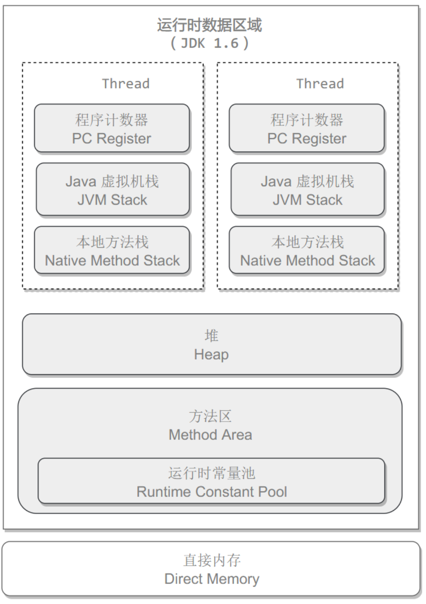

####  2.2.1 程序计数器

记录正在执行的虚拟机字节码指令的地址（如果正在执行的是本地方法则为空），即<font color="blue">**记录程序执行到第几行**</font>了。

####  2.2.2 Java 虚拟机栈

每个 Java 方法在执行的同时会创建一个栈帧用于<font color="blue">**存储Java方法的局部变量表（基本类型+引用符号）、操作数栈、常量池引用、方法出口等信息**</font>。从方法调用直至执行完成的过程，对应着一个栈帧在 Java 虚拟机栈中入栈和出栈的过程。

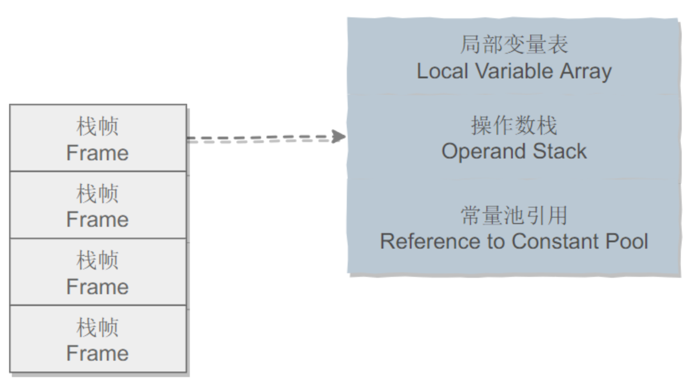

可以通过 -Xss 这个虚拟机参数来指定每个线程的 Java 虚拟机栈内存大小，在 JDK 1.4 中默认为 256K，而在 JDK 1.5+ 默认为 1M：

```
java -Xss2M HackTheJava
```

该区域可能抛出以下异常：

- 当线程请求的栈深度超过最大值，会抛出 `StackOverflowError` 异常；
- 栈进行动态扩展时如果无法申请到足够内存，会抛出 `OutOfMemoryError` 异常。

####  2.2.3 本地方法栈

<font color="blue">**本地方法栈与 Java 虚拟机栈类似**</font>，它们之间的区别只不过是本地方法栈为本地方法服务（如unsafe操作）。

本地方法一般是用其它语言（C、C++ 或汇编语言等）编写的，并且被编译为基于本机硬件和操作系统的程序，对待这些方法需要特别处理。

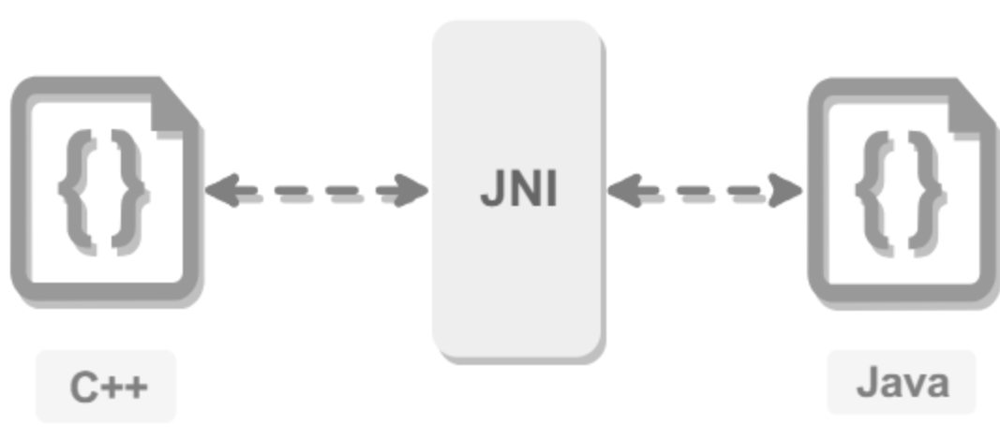

####  2.2.4 堆【共享】

<font color="blue">**主要存储已经生成的对象**</font>（数组也是一种对象），是垃圾收集的主要区域（"GC 堆"）。

现代的垃圾收集器基本都是采用分代收集算法，其主要的思想是针对不同类型的对象采取不同的垃圾回收算法。可以将堆分成两块：

- 新生代（Young Generation）：还可以细分为Eden区、Survivor0区、Survivor1区。新创建的对象一般存储在E区（大对象直接进入老年代，因为需要大片连续空间），E区中的对象熬过一次GC后年龄加一进入S区。
- 老年代（Old Generation）：熬过一定次数（一般为15）的GC的对象或者大对象一般存储在这里。

堆不需要连续内存，并且可以动态增加其内存，增加失败会抛出 `OutOfMemoryError `异常。

可以通过 -Xms 和 -Xmx 这两个虚拟机参数来指定一个程序的堆内存大小，第一个参数设置初始值，第二个参数设置最大值。

```
java -Xms1M -Xmx2M HackTheJava
```

####  2.2.5 方法区【共享】

<font color="blue">**用于存放已被加载的类信息、常量、静态变量、即时编译器编译后的代码等数据。**</font>

和堆一样不需要连续的内存，并且可以动态扩展，动态扩展失败一样会抛出 OutOfMemoryError 异常。

对这块区域进行垃圾回收的主要目标是对常量池的回收和对类的卸载，但是一般比较难实现。

JDK1.8中取消了方法区，将其移入直接内存中：


> **元空间和永久代都是方法区的一种实现！**在Java官方的HotSpot 虚拟机中，Java8版本以后，是用元空间来实现的方法区；在Java8之前的版本，则是用永久代（与堆是连续的内存）实现的方法区；在 JDK 1.8 之后，原来永久代的数据被分到了堆和元空间中。类的元信息存储到元空间中，静态变量和常量池等放入堆中。
>
> **改用元空间实现方法区主要是基于以下几点考虑**：
>
> - **减少OOM**：整个永久代有一个 JVM 本身设置固定大小上限（受`MaxPermSize` 控制），很难调整到一个合适的值，太小则容易OOM；而元空间使用的是直接内存，受本机可用内存的限制，虽然元空间仍旧可能溢出（OOM），但是比原来出现的几率会更小。 
>
> - **加载更多的类**：元空间里面存放的是类的元数据，加载类的数量上限由系统的实际可用空间来控制，这样能加载的类就更多了（Java程序功能复杂、用到的类和动态生成的类越来越多了）。  
>
> - JDK8，合并 HotSpot 和 JRockit 的代码时，JRockit 从来没有一个叫永久代的东西，合并之后就没有必要额外的设置这么一个永久代的地方了。
>
> <span style = "color:red">在 **JDK 1.8** 之后，原来永久代的数据被分到了堆和元空间中。**类的元信息放入元空间存储，静态变量和常量池等放入堆中。**</span>

####  2.2.6 运行时常量池【共享】

运行时常量池是方法区的一部分。

Class 文件中的常量池（编译器生成的字面量和符号引用）会在类加载后被放入这个区域。

除了在编译期生成的常量，还允许动态生成，例如 String 类的 intern()。

####  2.2.7 直接内存【共享】

在 JDK 1.4 中新引入了 NIO 类，它可以使用 Native 函数库直接分配堆外内存，然后通过 Java 堆里的 DirectByteBuffer 对象作为这块内存的引用进行操作。这样能在一些场景中显著提高性能，因为避免了在堆内存和堆外内存来回拷贝数据。

### 2.3 Hotspot虚拟机

#### 2.3.1 对象创建过程

分为五个步骤： 

#### 2.3.2 对象的存储结构/内存布局

分为三个部分进行存储：Header、Instance Data、Padding

#### 2.3.3 对象的访问和定位

如何定位对象实例存储的位置。

> 非JVM规范定义，各虚拟机自行实现。

两种定位方法和各自的优缺点。

- 使用句柄
- 直接指针法

## 3 垃圾回收和内存分配策略

### 3.1 概述

程序计数器、虚拟机栈和本地方法栈这三个区域属于线程私有的，只存在于线程的生命周期内，每一个栈帧需要分配多少内存基本上在类结构确定的时候就已知了，线程执行结束之后就会消失/自动被回收，这3个区域的内存分配和回收具有确定性。

**垃圾回收和内存分配策略主要针对堆和方法区**。因为一个方法所执行的不同分支和条件所需要的内存可能不一样，需要在运行时才可以确定，因此这两个区域的内存分配和回收是动态的。

本节主要讲：

```text
如何确定对象是否需要被回收？----->如何回收对象？------->Hotspot实现的回收机制？
```

### 3.2 如何确定对象是否需要被回收

#### 3.2.1 引用计数法

存在的循环引用缺陷，Java并未使用。

实例代码：

```java
A a = new A();
B b = new B();
a.ref = b;
b.ref = a;
...
```

上述代码中，`a`和`b`对象除了被对方引用外未被任何其它外部对象引用，理论上可以被回收，但是由于引用计数不为0，所以无法回收！

#### 3.2.2 可达性分析算法*

Java使用的机制。以一系列称为`GC Root`的对象作为起始节点集，从这些节点开始根据应用关系向下搜索，搜索过的路径称为应用链，如果有对象没有和任何应用链关联，则认为它不可达即该对象不再被使用！

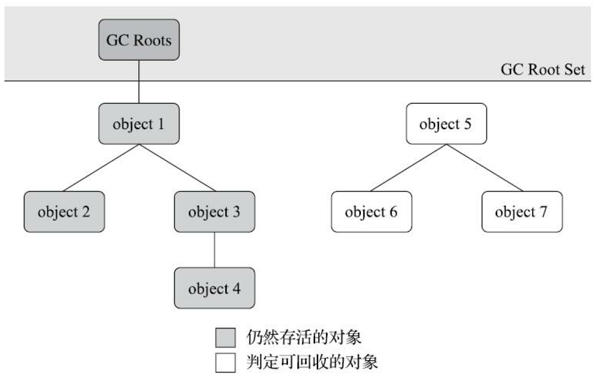

##### GCRoot的构成

- 虚拟机栈(栈帧中的本地变量表)中引用的对象（方法参数、局部变量等）
- 本地方法栈(Native 方法)中引用的对象
- 方法区中类静态属性引用的对象
- 方法区中常量引用的对象（如字符串常量池中的引用）

##### 三色标记和并发标记

> 在进行可达性分析（如从根节点开始枚举）时，需要暂停用户线程，因为需要保证检查时内存的一致性。
>
> 如果内存空间太大，用户线程暂停时间将会很长，能不能不暂停用户线程的同时进行GC呢？三色标记法可以解决该问题！

**<font color="red">三色标记</font>**

- 黑色：已经被遍历过的对象
- 灰色：至少还有一个引用未被遍历的对象（正在被访问的对象）
- 白色：未被访问过的对象

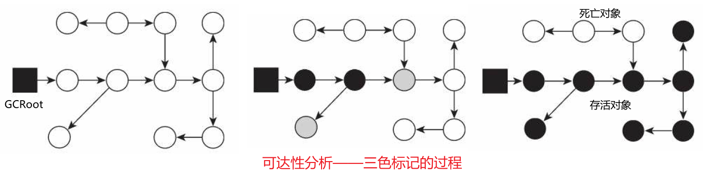

**<font color="red">防止误标记的方法</font>**

如果GC标记和用户线程同时运行，则可能导致本来应该是白色的节点被标记成了黑色（没关系，下次再清理）；或本来应该被标记为黑色的节点被标记为了白色（清理了不该清理的对象，程序出错）。

同时满足以下两个条件则可能导致存活对象被标记为垃圾：

- Case1：赋值器**插入了一条/多条从黑色对象到白色对象的引用**
- Case2：赋值器**删除了全部从灰色节点到白色节点的直接/间接引用**

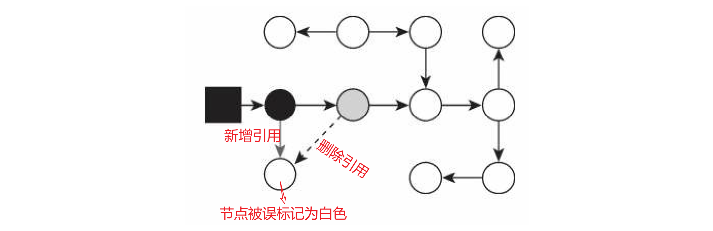

针对上述问题主要有两种解决方法（基于写屏障技术来实现的）：

- 增量更新（CMS）：当黑色对象插入指向新的白色节点的引用时，记录该应用，标记结束后再以这些特殊黑色节点为根遍历一下（这个遍历可能也会耗费大量时间）。
- 原始快照（G1）：当灰色对象要删除对白色对象的引用时，将该引用关系记录下来（快照），标记结束后再以这些灰色对象为根扫描一次，将扫描到的白色节点直接标记为黑色（保守做法，相当于将可能出现问题的白色对象全部保留下来，可能存在浮动垃圾，留到下次GC即可）。

#### 3.2.3 JAVA中的四种引用

- **强引用**：常规引用定义。垃圾回收器引永远不会回收被强引用的对象。

  ```java
  Object obj = new Object();	// 设置强引用
  obj = null;	// 取消强引用
  ```

- **软引用**：描述一些还有用但是非必须的对象。如果内存的空间足够，软引用不会被垃圾回收器回收；只有在内存空间不足时，软引用（该对象只有软引用，没有强引用指向它）才会被垃圾回收器回收（回收后内存空间依旧不足则报OOM错误）。

  ```java
  Object obj = new Object();
  SoftReference<String> s = new SoftReference<>(obj);	// 创建弱引用
  // 只有对象仅被 SoftReference 引用，它才是软引用级别对象，因为对象可以在多处被引用，所以 SoftReference 引用的对象，它可能在其他处被强引用了(如此处的obj即为强引用)。
  ```

  > 使用场景：软引用通常在==对内存敏感==的程序中，比如高速缓存就有用到软引用，内存足够的时候就保留，不够就回收。

- **弱引用**：描述一些非必须对象，强度比软引用弱。被弱引用的对象只能存活到下一次垃圾回收发生为止，当 JVM 进行垃圾回收，一旦发现弱引用对象（该对象只有弱引用，没有强引用了），**无论当前内存空间是否充足，都会将弱引用回收**。*不过由于垃圾回收器是一个优先级较低的线程，所以并不一定能迅速发现弱引用对象。*

  ```java
  WeakReference<String> weakName = new WeakReference<String>("hello");	// 创建弱引用
  
  // `WeakHashMap`中就使用了弱引用来存储K-V。如其内部类`Entry`定义：
  private static class Entry<K,V> extends WeakReference<Object> implements Map.Entry<K,V> {
          V value;
          final int hash;
          Entry<K,V> next;
  }
  ```

  > WeakHashMap的key就是使用的弱引用，当key对象被设置为null时，键值对**自动**从Map中删除，不需要手动进行。

- **虚引用**：最弱的引用关系。一个对象的虚引用的存在与否，在任何时候都可能被垃圾回收器回收。为一个对象设置虚引用的唯一目的就是在对象被GC回收时获取到通知，以便进行进一步处理。

  > 虚引用必须和引用队列关联使用，当垃圾回收器准备回收一个对象时，如果发现它还有虚引用，就会把这个虚引用加入到与之关联的引用队列中。程序可以通过判断引用队列中是否已经加入了虚引用，来了解被引用的对象是否将要被垃圾回收。如果程序发现某个虚引用已经被加入到引用队列，那么就可以在所引用的对象的内存被回收之前采取必要的行动。

  ```java
  ReferenceQueue<String> queue = new ReferenceQueue<String>();	// 创建引用队列
  PhantomReference<String> pr = new PhantomReference<String>(new String("hello"), queue);	// 创建虚引用
  ```

#### 3.2.4 回收堆/对象的死亡过程

对象被判定为不可达后需要经过两次标记（不可达时标记一次；如果需要执行`finalize()`则加入F-Queue，GC在F-Queue中判断是否被重新引用）才真正被回收。

```text
----------------
|  GCRoot不可达 |------>不回收
----------------
      | Yes(标记)
      v
------------------------
| 是否需要执行finalize() |		// 当对象未重写finalize()或finalize()已被JVM调用过，则无需执行
------------------------        // 不一定等finalize()执行完(因为他有可能执行缓慢或陷入死循环)
      | Yes （加入F-Queue队列）
      v
------------
| 重新被引用 |----Yes---->逃脱回收
------------       
      |No(标记)             
      v            
  ---------
  | GC回收 |
  ---------
```

#### 3.2.5 回收方法区

方法区的垃圾回收主要回收两部分：废弃的常量、不再适用的类型。

**判断常量是否废弃**

- 没有任何字符串对象引用该常量
- 虚拟机中没有其它方法引用这个字面量

**判断类型是否废弃**

类需要同时满足下面 3 个条件才能算是 **“无用的类”** ：

- 该类所有的实例都已经被回收，也就是 Java 堆中不存在该类的任何实例。
- 加载该类的 `ClassLoader` 已经被回收。
- 该类对应的 `java.lang.Class` 对象没有在任何地方被引用，无法在任何地方通过反射访问该类的方法。

虚拟机可以对满足上述 3 个条件的无用类进行回收，这里说的仅仅是“可以”，而并不是和对象一样不使用了就会必然被回收。

### 3.3 垃圾回收算法

从判定对象消亡角度出发，主要分为 **引用计数/直接垃圾收集** 和 **追踪式/间接垃圾收集**，主要讨论后者。

#### 3.3.1 分代收集理论

根据 *收集器应当将Java堆划分不同的区域，然后将回收对象根据其中年龄（熬过GC过程的次数）分配到不同的区域存储* 的设计原则可以将对象分为两种类型：

- **新生代**：朝生夕灭的对象（大部分对象都是），可以较低代价（只标记少量需要存活的对象）快速会回收到大量空间。
- **老年代**：熬过多轮垃圾收集的对象，JVM可以较低的频率来回收这个区域。

- 跨代引用，但是跨代引用会导致对象年龄不断增大，最终都变成老年代。

这就同时兼顾了垃圾收集时间开销和内存空间的有效利用。

#### 3.3.2 标记-清除算法

**流程**

- 首先标记 [(基于垃圾判断算法)](# 3.2 如何确定对象是否需要被回收) 需要回收的对象；
- 统一回收掉被标记的对象。或者和上述过程相反（如果只有少量对象存活的话）。

**优点**

- 用户线程暂停时间短，延迟低。

**缺点**

- 执行效率不稳定（标记/清除过程执行效率和对象数量成反比）；
- 容易产生空间碎片（清除后内存不连续）；

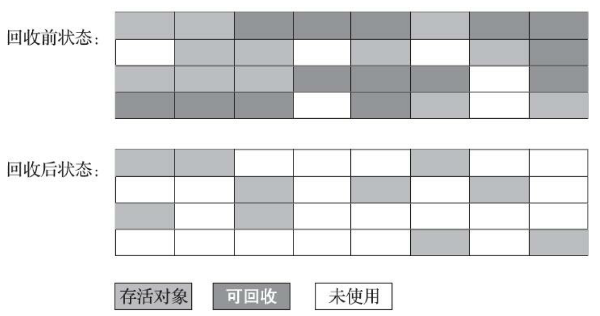

> 内存碎片的存在增加了内存分配和访问（程序的高频操作）的复杂性，大大降低吞吐量。eg: 关注延迟的CMS收集器则基于本算法。适合用在老年代中（存活对象多）。

#### 3.3.3 标记-复制算法

为解决 [3.3.2 标记-清除算法](# 3.3.2 标记-清除算法) 面对大量可回收对象执行效率低的问题所提出。

**流程**

- 将可用内存划分成两片区域，每次只是用其中一块。每次垃圾回收时将以存活对象复制到另一块，然后一次性清理这块内存。

**优点**

- 内存碎片化少。

**缺点**

- 浪费有效空间（可以用不同比例分配两块内存，如Appel式回收中的Eden 80%、Survivor1 10%、Survivor2 10%）；
- 如果大量对象存活（如老年代），则复制效率低。

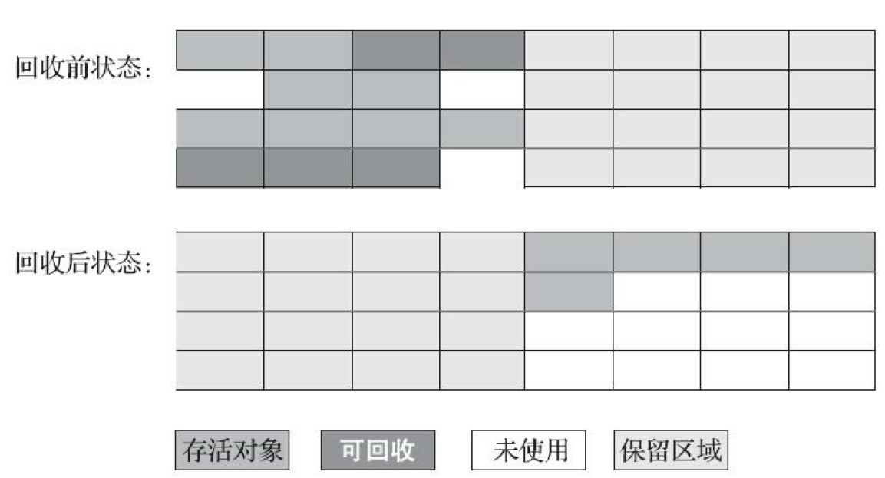

> 适合用在新生代中（存活对象少，复制开销少）。eg: Hotspot中的Serial、ParNew等新生代收集器均基于本算法。

#### 3.3.4 标记-整理算法

为解决 [标记-复制算法](# 3.3.3 标记-复制算法) 不适用于老年代的问题所提出。

**流程**

- 标记过程和  [标记-清除算法](# 3.3.2 标记-清除算法) 一致；
- 清除过程是将所有存活对象移动到内存空间的一端，然后清除边界外的内存

**优点**

- 内存碎片少；空间利用率高。

**缺点**

- 线程暂停时间长（需要移动内存），延迟高。

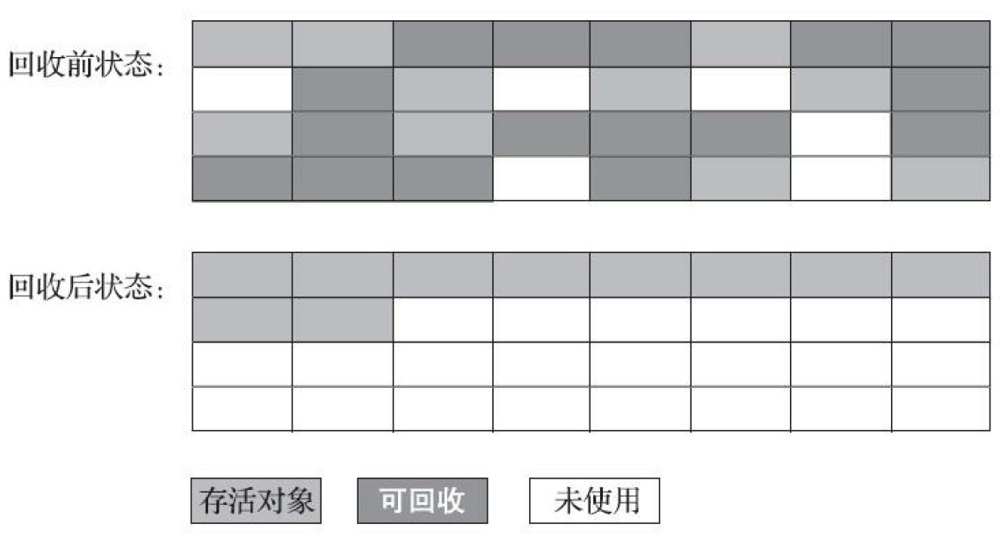

> 移动导致内存回收更加复杂，但是整体可以提高吞吐量。eg: Hotspot中的关注吞吐量的Parallel和Scavenge收集器就是基于本算法。

#### 3.3.5 混合式算法【拓展】

如JVM大多数时间采用   [标记-清除算法](# 3.3.2 标记-清除算法)  算法，直到内存碎片化程度已经影响到对象分配时，再采用一次   [标记-整理算法](# 3.3.4 标记-整理算法)  收集一次，以获取规整的内存空间。（eg：CMS收集器）

或者JVM可以针对老年代/新生代分别采用不同的垃圾回收算法。

### 3.4 Hotspot算法实现【暂时略过了】

```text
根节点枚举扫描复杂度太高，且需要暂停线程以保证一致性--->设置oopsMap来存放所有对象应用以便快速枚举、设置安全点来指导线程主动暂停--->设置安全区域来保证休眠/阻塞的线程也能成功自我暂停--->设计记忆集和卡表来缩小GCRoot扫描范围--->利用写屏障来维护卡表
```

### 3.5 经典垃圾收集器

经典的垃圾收集器主要有以下几种：

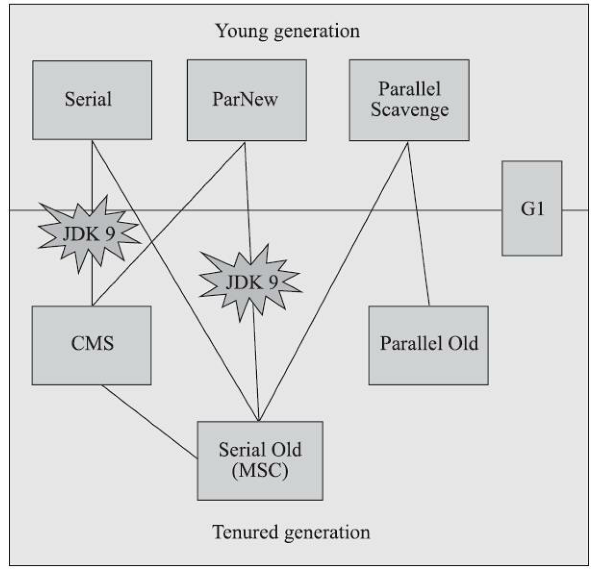

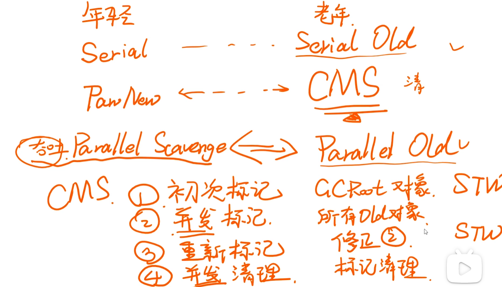

上半部分为新生代的垃圾收集器，下半部分为老年代的垃圾收集器，G1为全堆垃圾收集器；两个收集器之间的连线表示他们可以配合使用。

> JDK1.8默认使用Parallel Scavenge和Parallel Old收集器。
>
> JDK1.9默认使用G1收集器。

#### 3.5.1 Serial收集器

Serial收集器是最基础、历史最悠久的垃圾收集器。它是一个**单线程**工作的新生代收集器，在进行垃圾收集时需要暂停其他工作线程直到收集结束。Serial收集器简单、相对高效，适合运行在Client模式下的Hotspot虚拟机中。

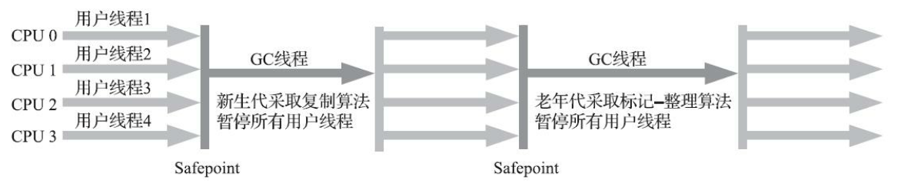

**注**：<font color="blue">*上图是表示Serial和SerialOld收集器配合使用的示意图*</font>

> 新生代存活对象少，标记-复制算法的复制开销小。
>
> 老年代存活对象多，标记-整理算法的内存移动开销小。

#### 3.5.2 ParNew收集器

ParNew收集器是多线程版本的 [Serial收集器](# 3.5.1 Serial收集器) ，适合运行在Server模式下的Hospot虚拟机中。

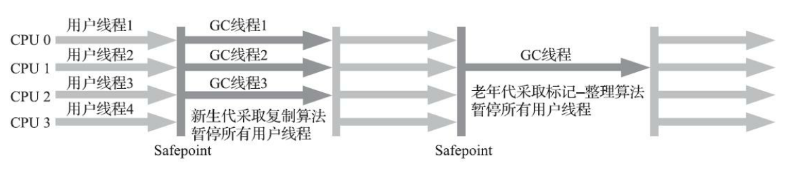

**注**：<font color="blue">*上图是表示ParNew和SerialOld收集器配合使用的示意图*</font>

> ParNew收集器在单核CPU中并没有Serial收集器高效，因为存在线程切换和交互的开销。

#### 3.5.3 Parallel Scavenge收集器【JDK1.8默认的收集器】

Parallel Scavenge收集器是一款新生代收集器，基于标记-复制算法的多线程收集器。区别于 [ParNew收集器](# 3.5.2 ParNew收集器) 的地方是：

- 重点关注吞吐量（`用户代码运行时间/(用户代码运行时间+垃圾回收时间)`），即对STW占比可控
- 支持各类参数：`-XX:MaxGCPauseMillis`、`-XX:GCTimeRatio`（吞吐量/用户代码运行时间）、`UseAdaptiveSizePolicy`（**自适应调整策略**：根据收集监控信息自适应调整各代内存的大小等参数）。

####  3.5.4 Serial Old 收集器

**Serial 收集器的老年代版本**，它同样是一个单线程收集器。它主要有两大用途：

- 在 JDK1.5 以及以前的版本中与 Parallel Scavenge 收集器搭配使用
- 作为 CMS 收集器发生失败时的后备方案

#### 3.5.5 Parallel Old 收集器

**Parallel Scavenge 收集器的老年代版本**。使用多线程和“标记-整理”算法。在注重吞吐量以及 CPU 资源的场合，都可以优先考虑 Parallel Scavenge 收集器和 Parallel Old 收集器。

#### 3.5.6 CMS(Concurrent Mark Sweep)收集器

CMS收集器是一种以获取<font color="red">**最短回收暂停时间**</font>为目标的收集器，基于 [标记-清除算法](# 3.3.2 标记-清除算法)，主要包含四个步骤：

- **初始标记**：标记GCRoot能直接关联的对象，速度很快，需要**暂停用户线程**！

- **并发标记**：从GCRoot直接关联对象开始遍历对象图然后标记（三色标记），耗时较长，可以与用户线程并行。

  > 用户线程可能造成的对象引用关系变化：把非存活对象标记为存活对象（浮动垃圾，问题不大，下次再清理）、把存活对象标记为非存活对象（问题很大，需要修正））。

- **重新标记**：修正（基于三色标记和写屏障技术来实现，使用增量更新技术来修正）并发标记阶段产生变动的标记记录，需要**暂停用户线程**。（此时白色标记代表所有的非存活对象）

  > 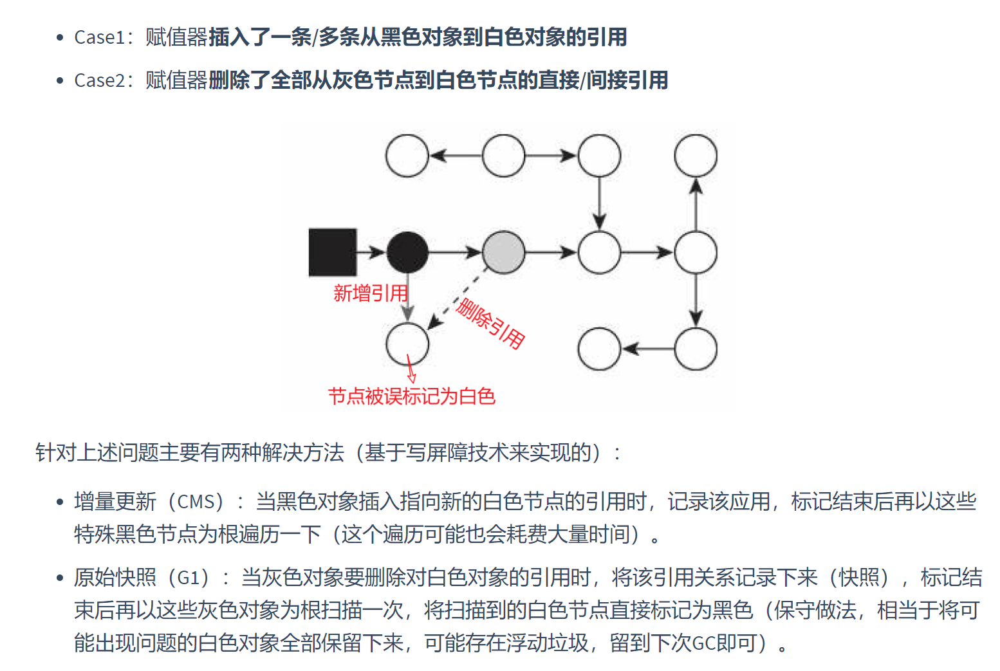

- **并发清理**：清理之前标记的垃圾，可以和用户线程并行（用户线程可能产生新的垃圾：浮动垃圾），因为只清理无效对象，有效对象依旧在原始位置无任何变化。

  > <font color="red">此阶段如何保证用户线程不修改对象应用关系呢（此时白色对象已经不可能再被引用了）</font>
  >
  > 参考 [JAVA: CMS垃圾回收中的“浮动垃圾”的理解？](https://segmentfault.com/q/1010000013653267) **注意：不可达 和 非存活 的区别！**

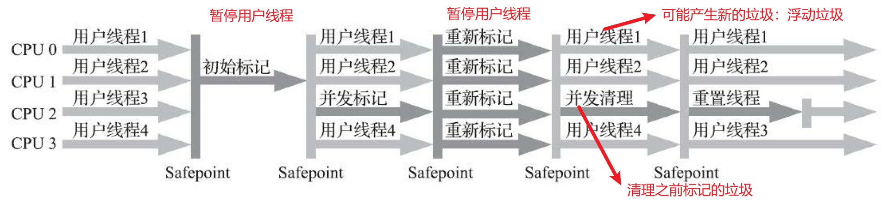

**CMS收集器的三大缺点**

- **对处理器资源敏感**：需要占用线程资源，并行可能导致用户应用程序变慢，~~降低吞吐量~~。

- **无法处理浮动垃圾**：并发标记和并发清理阶段用户线程也在运行，所以可能产生新的垃圾，此时产生的垃圾必须等到下一次GC才能被清理。

  > CMS由于可以和用户线程并行，所以不能等老年代内存满了再进行清理，必须预留一定空闲空间；如果GC运行期间空闲空间无法满足新的对象内存分配要求，则"并发失败Concurrent Mode Failure"，此时JVM暂停用户线程，开始启动备用的 Serial Old收集器。

- **容易产生大量空间碎片**：[标记-清除算法](# 3.3.2 标记-清除算法) 带来的问题，可以配合内存整理（如必要时进行一次碎片整理）来避免内存空间碎片问题。否则将触发Full GC。

#### 3.5.7 G1(Garbage First)收集器

G1收集器出现之前，大部分收集器都是只针对整个新生代或者老年代进行GC（Minor GC）、或者全堆GC（Full GC），而G1的GC衡量标准则为哪块内存存放的垃圾数量最多（所有的新生代和部分老年代）、回收收益最大（所以叫Garbage First），是一种**MixGC模式**。

##### 内存结构

G1之前的垃圾收集器将堆分成以下三个部分：

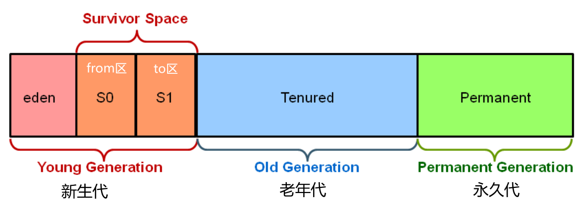

G1收集器也遵循分代收集理论，但是采用把**连续的Java堆划分成多个大小相同的独立区域（Region），每个Region都可以根据需要充当新生代Eden/S0/S1或老年代空间。收集器对不同角色的Region使用不同策略来处理**。

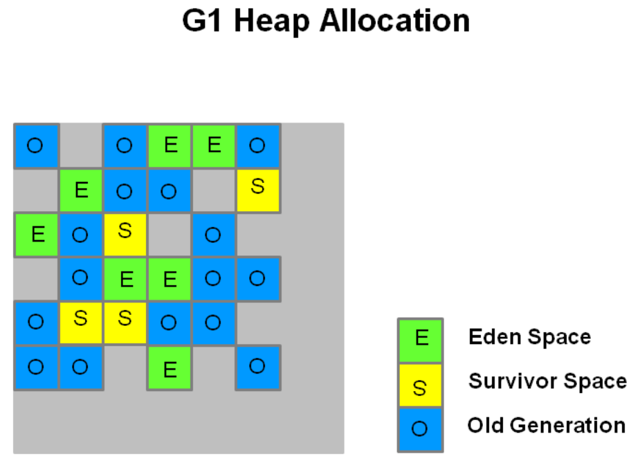

大对象的内存分配策略：

- 小于一半Region size（1MB~32MB 为2的N次幂，可配置）的可以正常存入E区
- 一半到一个Region size的直接存入O区一个Region中，这个Region又叫Humongous region，我们也可以把它叫做H区（他本质还是O区的）
- 比一个Region size还要大的对象，需要存入连续的多个Region中，这多个Region都是H区。

##### RSet和CSet

- **RSet**（RememberSet）：每个Region中均含一个RSet，用于存储本Region的对象被其他region对象引用的记录，避免全堆作为GCRoot扫描。

  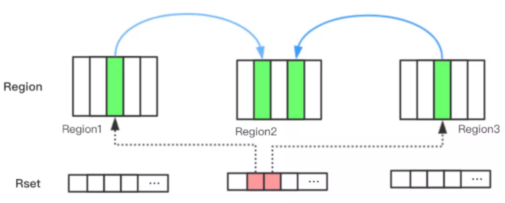

- **CSet**（CollectionSets）：是本次GC中需要被清理的regions集合，注意G1每次GC不是全部Region都参与的，可能只清理少数几个，这几个就被叫做Csets。

##### 垃圾收集过程

G1中提供了三种模式垃圾回收模式，**Young GC、Mixed GC 和 Full GC**，在不同的条件下被触发。

######  ①Young GC

当Eden区域被耗尽无法申请内存时会触发，使用 标记-复制算法（需要暂停用户线程）。将E和S(from)区复制到S(to)，注意S(to)一开始是没有标识的，就是个free region。`下图中没有标出YGC进入老年代的对象，有可能有一部分会进入O区!!`。

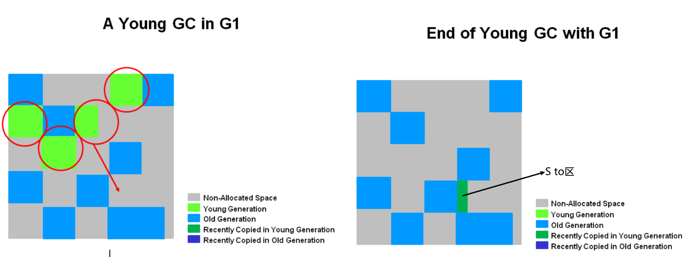

######  ②Mixed GC[重要]

当越来越多的对象晋升到老年代Old Region时，为了避免堆内存被耗尽，虚拟机会触发一次Mix GC，该过程除了**回收整个Young Region**，还会回收**一部分的Old Region**（根据用户设置的收集停顿时间、区域的垃圾多少、收集效益来选取）。

回收年轻代和YoungGC一致，回收老年区主要分为四个过程：

- **初始标记**：遍历GCRoot所在Region（RootRegion），需要**暂停用户线程**！

- **并发标记**：扫描Old区的所有Region的RSet是否含有对Root Region的引用，有则标记该Region。并发遍历刚刚被标记的这些Region

  > 此阶段和CMS不同，无需遍历所有Old区对象，只需遍历标记的Region中的对象并做垃圾标记即可。因为没有被RootRegion引用的Region说明无用，无需遍历，直接变成垃圾。
  >
  > RSet相当于一个目录页，可以减少扫描范围。

- **最终标记**：修正标记，和CMS不同，使用SATB算法（原始快照算法）。

- **筛选回收***：使用复制算法来清理垃圾（只选部分Old区和所有Young区，根据回收价值和成本进行排序，根据用户期待的停顿时间来制定回收计划），需要暂停用户线程，运行时间较短。

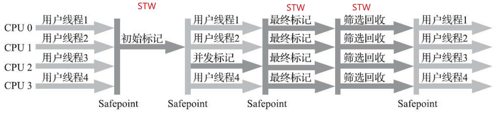

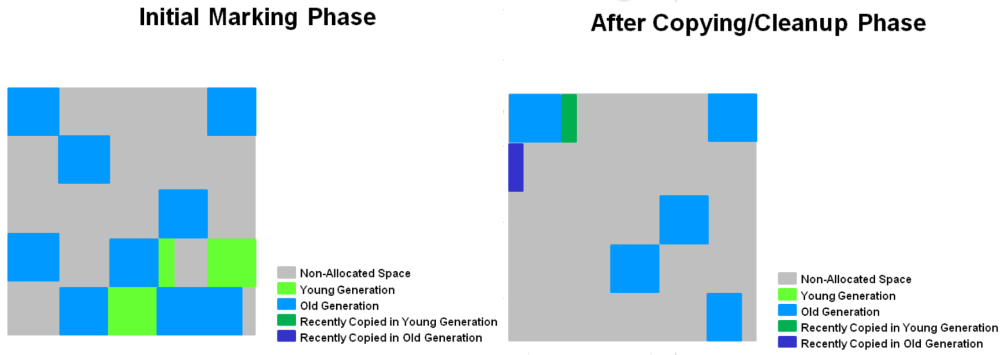

######  ③Full GC

如果对象内存分配速度比Mixed GC速度更快，导致老年代被填满，就会触发一次Full GC，G1的Full GC算法就是单线程执行的SerialOld GC，会导致异常长时间的暂停时间，需要进行不断的调优，尽可能的避免Full GC.

##### 参考

- [垃圾收集器|g1收集器](https://www.bilibili.com/video/BV13J411g7A1?from=search&seid=17449636354093711484) 和 [视频作者笔记](https://github.com/sunwu51/notebook/blob/master/19.09/java_jvm%E5%9E%83%E5%9C%BE%E6%94%B6%E9%9B%86%E5%99%A8.md)
- [Getting Started with the G1 Garbage Collector](https://www.oracle.com/webfolder/technetwork/tutorials/obe/java/G1GettingStarted/index.html)

### 3.6 CMS和G1区别

两者均为并发垃圾回收器。

- **内存划分方式**：都是基于分代回收的理念。CMS基于传统的E/S0/S1区、老年区划分方式（内存块是连续的）；G1将内存划分为多个独立Region，每个Region可以根据需要充当不同的角色

- **回收区域**：CMS只针对老年代，G1为全区域回收

- **回收算法**：CMS基于标记-清除算法，G1 从整体来看是基于标记-整理算法实现的收集器；从局部上来看是基于标记-复制算法实现的。最终的并发清理过程中，CMS无需STW（标记清除），G1需要STW（标记复制）。

- **回收目标**：CMS主要目标是获取**最短回收暂停时间**；G1为最大回收收益（即回收那片区域可以获取最多空闲空间）和可预测的时间停顿模型。

  > **G1 收集器在后台维护了一个优先列表，每次根据允许的收集时间，优先选择回收价值最大的 Region(这也就是它的名字 Garbage-First 的由来)** 。这种使用 Region 划分内存空间以及有优先级的区域回收方式，保证了 G1 收集器在有限时间内可以尽可能高的收集效率（把内存化整为零）。

### 3.7 内存分配与回收策略实战

#### 3.7.1 Minor GC 和 Major GC 和 Full GC

- Minor GC：回收新生代，因为新生代对象存活时间很短，因此 Minor GC 会频繁执行，执行的速度一般也会比较快。Eden区满则触发Minor GC.

- Major GC：回收老年代。Old区满则触发Major GC. <font color="red">（说法有混淆，可能是Old GC 也可能是FULL GC！）</font>

- Full GC：回收老年代和新生代，老年代对象其存活时间长，因此 Full GC 很少执行，执行速度会比 Minor GC 慢很多。

  > Minor GC触发条件：
  >
  > 判断老年代最大的可用连续空间是否大于新生代的所有对象总空间：
  >
  > - 如果大于的话，直接执行minorGC
  >
  > - 如果小于，判断是否开启HandlerPromotionFailure（空间担保分配失败）：
  >   - 没有开启直接FullGC
  >   - 如果已开启，JVM会判断老年代的最大连续内存空间是否大于历次晋升的大小：
  >     - 如果小于直接执行FullGC
  >     - 如果大于的话，执行minorGC
  >
  > FULL GC的触发条件：
  >
  > - 老年代空间不足
  > - 调用`System.gc()`
  > - 空间担保分配失败
  > - CMS收集器报 Concurrent Mode Failure 错误（并发清理时浮动垃圾充满了内存，无法继续分配）触发 Full GC

#### 3.7.2 内存分配策略

- **对象优先在新生代Eden区分配**。当Eden空间不足是JVM发起一次Minor GC；如果回收后空间依旧不足，则可通过[担保机制](#3.8.4 空间分配担保)将对象分配到老年代中（大对象直接分配到老年代）。
- **长期存活的对象进入老年代**。熬过一次GC的对象进入Survivor区（标记-复制算法，两个S去轮换备份），同时开始进行Age计数（熬过一次Minor GC则计数加一），加到一定阈值（默认15）则进入老年代区域。

#### 3.7.3 动态年龄判断

Hotspot并非一定要求S区的对象年龄达到阈值才将其晋升为老年代，如果**S区的同龄对象大小总和超过S区空间的一半**，则年龄大于或等于改年龄的对象直接进入老年代。

#### 3.7.4 空间分配担保

**为什么要空间分配担保？**

> 因为新生代采用**复制收集算法**，假如大量对象在Minor GC后仍然存活（最极端情况为内存回收后新生代中所有对象均存活），而Survivor空间是比较小的，这时就需要老年代进行分配担保，把Survivor无法容纳的对象放到老年代。**老年代要进行空间分配担保，前提是老年代得有足够空间来容纳这些对象**，但一共有多少对象在内存回收后存活下来是不可预知的，**因此只好取之前每次垃圾回收后晋升到老年代的对象大小的平均值作为参考**。使用这个平均值与老年代剩余空间进行比较，来决定是否进行Full GC来让老年代腾出更多空间。

**如何进行空间分配担保？**

在发生 Minor GC (回收E/S0/S1区，可能导致E区对象进入S区，S区对象进入Old区)之前，虚拟机先检查老年代最大可用的连续空间是否大于新生代所有对象总空间，如果条件成立的话，那么 Minor GC 可以确认是安全的。

如果不成立的话虚拟机会查看 HandlePromotionFailure 的值是否允许担保失败，如果允许那么就会继续检查老年代最大可用的连续空间是否大于历次晋升到老年代对象的平均大小，如果大于，将尝试着进行一次 Minor GC（可能会失败，因为最终存活的对象大小还是可能大于老年代的空闲空间大小）；如果小于，或者 HandlePromotionFailure 的值不允许冒险，那么就要进行一次 Full GC。

#### 3.7.5 新生代代的对象什么时候会进入老年代？

1. <span style = "color:red">**大对象直接进入老年代**</span>

   虚拟机提供了一个阈值参数`XX:PretenureSizeThreshold`，令大于这个设置值的对象直接在老年代中分配。为了避免为大对象进入S区后**来回复制导致GC效率低**。

2. <span style = "color:red">**长期存活的对象进入老年代**</span>

   虚拟机给每个对象定义了一个年龄计数器，对象在Eden区出生，经过一次Minor GC后仍然存活，并且能被Survivor区容纳的话，将被移动到Survivor区中，此时对象年龄设为1。然后对象在Survivor区中每熬过一次 Minor GC，年龄就增加1，当年龄超过设定的阈值(默认是15岁，**`MaxTenuringThreahold`**)时，就会被移动到老年代中。

3. <span style = "color:red">**动态对象年龄判定**</span>

   如果在 Survivor 空间中所有相同年龄的对象，大小总和大于 Survivor 空间的一半，那么年龄大于或等于该年龄的对象就直接进入老年代，无须等到阈值中要求的年龄。**`TargetSurvivorRatio= 50`**

4. <span style = "color:red">**空间分配担保？**</span>

   - 如果老年代中最大可用的连续空间大于新生代所有对象的总空间，那么 Minor GC 是安全的。

   - 如果老年代中最大可用的连续空间大于历代晋升到老年代的对象的平均大小，就进行一次有风险的 Minor GC

   - 如果小于平均值，就进行 Full GC 来让老年代腾出更多的空间。

   因为新生代使用的是复制算法，为了内存利用率，只使用其中一个 Survivor 空间来做轮换备份，因此如果大量对象在 Minor GC 后仍然存活，导致 Survivor 空间不够用，就会通过分配担保机制，将多出来的对象提前转到老年代，但老年代要进行担保的前提是自己本身还有容纳这些对象的剩余空间，由于无法提前知道会有多少对象存活下来，所以取之前每次晋升到老年代的对象的平均大小作为经验值，与老年代的剩余空间做比较。

#### 3.7.6 新生代垃圾回收过程

新生代采取复制算法，在Minor GC之前，to survivor区域保持清空，对象保存在Eden和from survivor区；

- minor GC运行时，Eden中的幸存对象会被复制到to Survivor（同时对象年龄会增加1）。
- from survivor区中的幸存对象会考虑对象年龄，如果年龄没达到阈值，对象依然复制到to survivor中。如果对象达到阈值那么将被移到老年代。
- 复制阶段完成后，Eden和From幸存区中只保存死对象，可以视为清空。如果在复制过程中to幸存区被填满了，剩余的对象将被放到老年代（空间担保分配？）。
- 最后，From survivor和to survivor会调换一下名字，下次Minor GC时，To survivor变为From Survivor。

## 5 虚拟机类加载机制

### 5.1 概述

一个类的完整生命周期如下：

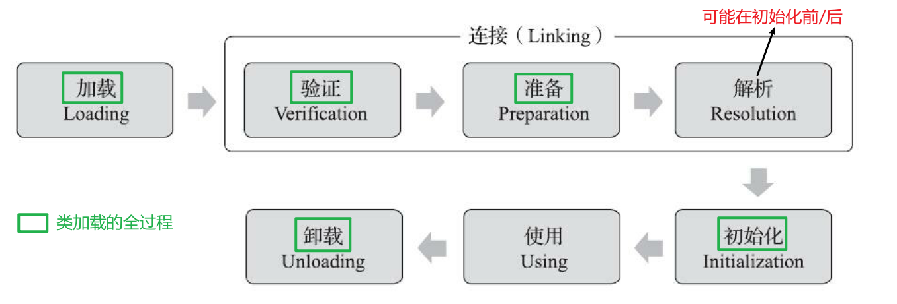

> **加载**、**验证**、**准备**、**初始化**、**卸载**五个阶段（类加载的全过程）的顺序是确定的，**解析**可能在初始化之前也可能在之后。

### 5.2 类初始化的时机

JVM规范并未规定什么是后应该执行第一阶段 **加载**，但是对 **初始化** 的时机有严格的规定（**加载**、**验证**、**准备**自然需要在 **初始化** 之前完成），有且只有以下六种情况需要对类进行初始化：

- **new或读取静态字段/方法时**：当遇到 new 、 getstatic、putstatic或invokestatic 这4条直接码指令时，比如 new 一个类，读取/写一个静态字段(未被 final 修饰，不是常量，因为常量会被放到常量池中)、或调用一个类的静态方法时。

- **反射创建**：使用 `java.lang.reflect` 包的方法对类进行反射调用时如`Class.forname("...")`,`newInstance()`等等。 ，如果类没初始化，需要触发其初始化。

- **子类触发**：初始化一个类，如果其父类还未初始化，则先触发该父类的初始化。

  > 通过子类调用父类的静态变量时并不会初始化子类，如果是静态常量则直接使用常量池，不会触发类的初始化。

- 当虚拟机启动时，用户需要定义一个要执行的主类 (包含 main 方法的那个类)，虚拟机会先初始化这个类。

- MethodHandle和VarHandle可以看作是轻量级的反射调用机制，而要想使用这2个调用， 就必须先使用findStaticVarHandle来初始化要调用的类。

- 当一个接口中定义了JDK8新加入的默认方法（被default关键字修饰的接口方法）时，如果有这个接口的实现类发生了初始化，那该接口要在其之前被初始化

  > 一个接口进行初始化时并不要求父接口也初始化，只有在用到父接口中定义的方法/常量时才会触发父接口初始化。

### 5.3 类加载的全过程

类加载的全过程是指 **加载**、**连接（验证、准备、解析）**、**初始化**、**卸载** 五个阶段。

> 五个阶段并不是按照严格先后顺序执行，是交叉执行的。

#### 5.3.1 加载

类的加载阶段需要完成：

- 利用全类名获取此类的二进制字节流（可以从本地、网络、运行时动态生成等方式获取）
- 将**字节流代表的结构加载的JVM中的方法区**（共享的）
- 在内存中（堆中）生成一个代表该类的 Class 对象，作为方法区这些数据的访问入口

> 数组类不通过类加载器创建，直接在内存中动态构造，但数组类的元素类型（指去掉所有维度后的类型）需要类加载器来完成。
>
> 加载阶段和连接阶段的部分内容是交叉进行的，加载阶段尚未结束，连接阶段可能就已经开始了。

#### 5.3.2 验证（连接）

主要是对Class文件进行**格式验证和语义验证**，是否满足虚拟机规范。确保 Class 文件的字节流中包含的信息符合当前虚拟机的要求，并且不会危害虚拟机自身的安全。主要是对其进行文件格式验证、语义合法性验证等。

#### 5.3.3 准备（连接）

准备阶段主要是为类中定义的变量（静态变量）分配内存并设置初始默认值（默认为0、null、false、常量之类的）。

> 准备阶段是针对类变量（存储在方法区中），而不是实例化变量（存储在Java堆中），实例化变量的初值设置在对象的初始化阶段完成。
>
> 实例化不是类加载的一个过程，类加载发生在所有实例化操作之前，并且类加载只进行一次，实例化可以进行多次。

#### 5.3.4 解析（连接）

将常量池中的符号引用替换成直接引用的过程。

> 符号引用：一组用来描述所引用目标的符号（字面量）。
>
> 直接引用：可以直接指向目标的指针、相对偏移量或者能间接定位目标的句柄。

#### 5.3.5 初始化

**初始化阶段是虚拟机执行`<clinit>()`方法**，对静态变量进行赋值、执行静态语句块。（clinit方法由Javac编译时通过收集*类中所有的静态语句块和赋值操作*而自动生成的）的过程。虚拟机会保证一个类的 `<clinit>()` 方法在多线程环境下被正确的加锁和同步，如果多个线程同时初始化一个类，只会有一个线程执行这个类的 `<clinit>()` 方法，其它线程都会阻塞等待，直到活动线程执行 `<clinit>() `方法完毕时被唤醒，但不会再次执行该方法。

初始化时类加载过程中的最后一个步骤，JVM此时真正开始执行类中编写的`Java`代码，将主导权交给应用程序。

触发类/接口执行初始化的六大条件见 [5.2 类初始化的时机](# 5.2 类初始化的时机) 。

> 接口中不可以使用静态语句块，但仍然有成员变量（默认**public static final**修饰）初始化的赋值操作，因此接口与类一样都会生成 `<clinit>() `方法。但接口与类不同的是，执行接口的 `<clinit>() `方法不需要先执行父接口的 `<clinit>() `方法。只有当父接口中定义的变量使用时，父接口才会初始化。另外，接口的实现类在初始化时也一样不会执行接口的` <clinit>()` 方法。

**参考**： [Java中init（实例构造器）和clinit（类构造器）区别](https://blog.csdn.net/liu_542449630/article/details/107102257) (此处的初始化需要和new一个对象调用的构造方法有所区别！)

**注意**：<font color="red">类中定义的静态变量有两次赋值过程：一是在 *准备* 阶段赋予默认初值，而是在 *初始化* 阶段赋予程序员定义的值。</font>

### 5.4. 类和类加载器

类加载器用于实现类的加载动作（将Class文件加载到JVM的方法区）！

对于任意一个类，都必须由**加载它的类加载器和这个类本身共同确定**他在JVM中的唯一性！

同一个Class文件被同一个JVM加载，但是加载它们的类加载器不同，那这两个类比不相等。举例如下：

```java
public class ClassLoaderTest {
    public static void main(String[] args) throws ClassNotFoundException, IllegalAccessException, InstantiationException {
        // 自定义类加载器
        ClassLoader myLoader = new ClassLoader() {
            @Override
            public Class<?> loadClass(String name) throws ClassNotFoundException {
                try {
                    String fileName = name.substring(name.lastIndexOf(".") + 1) + ".class";
                    InputStream is = getClass().getResourceAsStream(fileName);
                    if (is == null) {
                        return super.loadClass(name);
                    }
                    byte[] b = new byte[is.available()];
                    is.read(b);
                    return defineClass(name, b, 0, b.length);
                } catch (IOException e) {
                    throw new ClassNotFoundException(name);
                }
            }
        };

        Object obj = myLoader.loadClass(Thread.currentThread().getStackTrace()[1].getClassName()).newInstance();
        System.out.println(obj.getClass()); // class ClassLoaderTest
        System.out.println(obj instanceof ClassLoaderTest); // false 因为使用了两个不同的类加载器
    }
}
```

JVM 中内置了三个重要的 ClassLoader，除了 `BootstrapClassLoader` 其他类加载器均由 Java 实现且全部继承自`java.lang.ClassLoader`：

1. **BootstrapClassLoader(启动类加载器)** ：最顶层的加载类，由C++实现，负责加载 `%JAVA_HOME%/lib`目录下的jar包和类或者或被 `-Xbootclasspath`参数指定的路径中的所有类。
2. **ExtensionClassLoader(扩展类加载器)** ：主要负责加载目录 `%JRE_HOME%/lib/ext` 目录下的jar包和类，或被 `java.ext.dirs` 系统变量所指定的路径下的jar包。
3. **AppClassLoader(应用程序类加载器)** ：面向用户的加载器，负责加载当前应用classpath下的所有jar包和类。

### 5.5 双亲委派模型

下图中的各种类加载器之间的层次关系（JDK1.8之前的版本）被称为类加载器的 **双亲委派模型** 。

> 此处的类加载器之间的父子关系不是通过继承而是通过组合（如父加载器作为子加载器的一个组件/成员变量）来实现的。

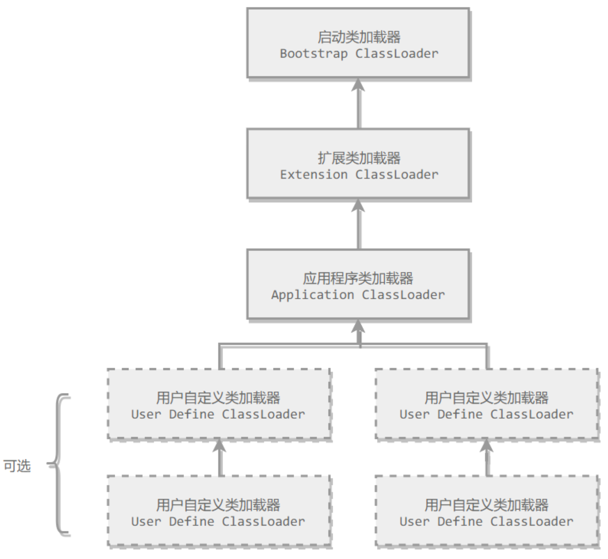

**工作过程**：一个类加载器首先将类加载请求转发到父类加载器，只有当父类加载器无法完成时才尝试自己加载。

**源码**：

双亲委派模型的实现代码非常简单，逻辑非常清晰，都集中在 `java.lang.ClassLoader` 的 `loadClass()` 中，相关代码如下所示。

```java
public abstract class ClassLoader {
    // ....
    private final ClassLoader parent; 	// 使用组合而不是继承
    
    protected Class<?> loadClass(String name, boolean resolve)
            throws ClassNotFoundException
    {
        synchronized (getClassLoadingLock(name)) {
            // 首先，检查请求的类是否已经被加载过
            Class<?> c = findLoadedClass(name);
            if (c == null) {
                long t0 = System.nanoTime();
                try {
                    if (parent != null) {//父加载器不为空，调用父加载器loadClass()方法处理
                        c = parent.loadClass(name, false);
                    } else {//父加载器为空，使用启动类加载器 BootstrapClassLoader 加载
                        c = findBootstrapClassOrNull(name);
                    }
                } catch (ClassNotFoundException e) {
                    //抛出异常说明父类加载器无法完成加载请求
                }

                if (c == null) {
                    long t1 = System.nanoTime();
                    // 父加载器加载失败，自己尝试加载
                    c = findClass(name); // !!!!

                    // this is the defining class loader; record the stats
                    sun.misc.PerfCounter.getParentDelegationTime().addTime(t1 - t0);
                    sun.misc.PerfCounter.getFindClassTime().addElapsedTimeFrom(t1);
                    sun.misc.PerfCounter.getFindClasses().increment();
                }
            }
            if (resolve) {
                resolveClass(c);
            }
            return c;
        }
    }   
    // ....
}
```

**好处**：双亲委派模型保证了Java程序的稳定运行，可以：

- **避免类的重复加载**（JVM 区分不同类的方式不仅仅根据类名，相同的类文件被不同的类加载器加载产生的是两个不同的类）并产生混乱。

- **保证了 Java 的核心 API 不被篡改**，通过委托的方式，不会篡改核心`.class`，不同的加载器加载的加载`.class`也是同一个`Class`对象，防止用户自定的同名类进行API篡改。

### 5.6 破坏双亲委派模型

除了 `BootstrapClassLoader` 其他类加载器均由 Java 实现且全部继承自`java.lang.ClassLoader`。如果我们要自定义自己的类加载器，需要继承 `ClassLoader`，**如果想要破坏双亲委派机制，则需要重写`loadClass`方法即可。**（[例子](# 5.4.1 类和类加载器)）

##### 如何自定义类加载器？

`java.lang.ClassLoader` 的 `loadClass()` 实现了双亲委派模型的逻辑，自定义类加载器一般不去重写它，但是需要重写 `findClass()` 方法。

如·以下代码中的 `FileSystemClassLoader `是自定义类加载器，继承自 `java.lang.ClassLoader`，用于加载文件系统上的类。它首先根据类的全名在文件系统上查找类的字节代码文件（.class 文件），然后读取该文件内容，最后通过 `defineClass()` 方法来把这些字节代码转换成 `java.lang.Class` 类的实例。

```java
public class FileSystemClassLoader extends ClassLoader {

    private String rootDir;

    public FileSystemClassLoader(String rootDir) {
        this.rootDir = rootDir;
    }
	
    // 一般需要重写该方法，findClass()会在loadClass中被被调用(父加载器找不到需要的类时, 自己开始尝试找)
    @Override
    protected Class<?> findClass(String name) throws ClassNotFoundException {
        byte[] classData = getClassData(name);
        if (classData == null) {
            throw new ClassNotFoundException();
        } else {
            return defineClass(name, classData, 0, classData.length);
        }
    }

    private byte[] getClassData(String className) {
        String path = classNameToPath(className);
        try {
            InputStream ins = new FileInputStream(path);
            ByteArrayOutputStream baos = new ByteArrayOutputStream();
            int bufferSize = 4096;
            byte[] buffer = new byte[bufferSize];
            int bytesNumRead;
            while ((bytesNumRead = ins.read(buffer)) != -1) {
                baos.write(buffer, 0, bytesNumRead);
            }
            return baos.toByteArray();
        } catch (IOException e) {
            e.printStackTrace();
        }
        return null;
    }

    private String classNameToPath(String className) {
        return rootDir + File.separatorChar
                + className.replace('.', File.separatorChar) + ".class";
    }
}
```

##### 什么时候需要自定义类加载器？

- **加密**：JAVA代码很容易被反编译，如果需要把自己的代码进行加密，可以先将编译后的代码用某种加密算法加密，然后实现自己的类加载器，负责将这段加密后的代码还原。
- **从非标准的来源加载代码**：例如部分字节码是放在数据库中甚至是网络上的（或者CLASS在其它特定路径下），就可以自己实现类加载器，从指定的来源加载类。
- **动态创建**：为了性能等等可能的理由，根据实际情况动态创建代码并执行，如热部署？？？

### 5.5 对象的创建过程

下图便是 Java 对象的创建过程，我建议最好是能默写出来，并且要掌握每一步在做什么。


#### Step1:类加载检查

虚拟机遇到一条 new 指令时，首先将去检查这个指令的参数是否能在常量池中定位到这个类的符号引用，并且检查这个符号引用代表的类是否已被加载过、解析和初始化过。如果没有，那必须先执行相应的类加载过程。

#### Step2:分配内存

在 **类加载检查** 通过后，接下来虚拟机将为新生对象 **分配内存**。对象所需的内存大小在类加载完成后便可确定，为对象分配空间的任务等同于把一块确定大小的内存从 Java 堆中划分出来。**分配方式**有 <span style = "color:red">**“指针碰撞”**</span> 和 <span style = "color:red">**“空闲列表”** </span>两种，**选择哪种分配方式由 Java 堆是否规整决定，而 Java 堆是否规整又由所采用的垃圾收集器是否带有压缩整理功能决定**。

#### Step3:初始化零值

内存分配完成后，虚拟机需要将分配到的内存空间都初始化为零值（不包括对象头），这一步操作保证了对象的实例字段在 Java 代码中可以不赋初始值就直接使用，程序能访问到这些字段的数据类型所对应的零值。

#### Step4:设置对象头

初始化零值完成之后，**虚拟机要对对象进行必要的设置**，例如这个对象是哪个类的实例、如何才能找到类的元数据信息、对象的哈希码、对象的 GC 分代年龄等信息。 **这些信息存放在对象头中。** 另外，根据虚拟机当前运行状态的不同，如是否启用偏向锁等，对象头会有不同的设置方式。

#### Step5:执行 init /构造方法

在上面工作都完成之后，从虚拟机的视角来看，一个新的对象已经产生了，但从 Java 程序的视角来看，对象创建才刚开始，`<init>` 方法还没有执行，所有的字段都还为零。所以一般来说，执行 new 指令之后会接着执行 `<init>` 方法，把对象按照程序员的意愿进行初始化（构造方法），这样一个真正可用的对象才算完全产生出来。

## 6 ~~虚拟机字节码执行引擎【略看的】~~

在不同的虚拟机实现中，执行引擎在执行字节码的时候，通常会有解释执行（由解释器一边解释代码一边执行，如python）和编译执行（通过即时编译器产生本地代码，然后再执行，如c++）两种选择，也可能两者兼备，还可能会有同时包含几个不同级别的即时编译器一起工作的执行引擎。

### 6.1 运行时帧结构


#### 6.1.1 局部变量表


#### 6.1.2 操作栈


#### 6.1.3 动态链接


#### 6.1.4 方法返回地址


#### 6.1.5 附加信息


### 6.2 方法调用

Java中调用方法有两种形式，一种是解析（编译时就已经能确定调用的目标方法还是什么，一般是被`static`、`private`、`final`等修饰的不可改变的方法）、一种是分派（运行时才能确定目标方法的直接引用，因为存在多态、继承等）。

#### 6.2.1 解析


#### 6.2.2 分派/方法绑定

**静态分派/绑定**的例子：

```java
public class StaticDispatch {
    static abstract class Human {
    }

    static class Man extends Human {
    }

    static class Woman extends Human {
    }

    void sayHello(Human guy) {
        System.out.println("Hello human!");
    }

    void sayHello(Man guy) {
        System.out.println("Hello man!");
    }

    void sayHello(Woman guy) {
        System.out.println("Hello woman!");
    }

    public static void main(String[] args) {
        Human man = new Man();	// 更极端的例子 Human man = new Random.nextInt(5) > 2 ? new Man() : new Woman(); 在编译器完全无法确定man的实际类型是什么, 所以直接使用静态的类型来匹配方法更为实际！
        Human woman = new Woman();
        StaticDispatch sr = new StaticDispatch();
        sr.sayHello(man);
        sr.sayHello(woman);
    }
}

// ---- 输出打印 -----
/*
Hello human!
Hello human!
*/
```

JVM会自动在确定具体的重载方法时是使用参数的静态类型（Human）来匹配的，而不是实际类型。

**动态分派/绑定**：JVM在运行期根据对象的实际类型确定方法执行的版本的分派过程称为动态分派。

<font color="green">JVM如何确定具体需要执行那个方法：</font>

- 首先找到变量/引用的实际类型
- 在实际类型中寻找符合要求的方法
- 如果实际类型中没有符合要求的方法，则继续往父类中寻找
- 如果始终没有找到合适的方法，则抛出`java.lang.AbstractMethodError`异常

例子：

```java
public class DynamicDispatch {
    static abstract class Human {
        protected void sayHello() {
            System.out.println("Hello human!");
        }
    }

    static class Man extends Human {
        @Override
        protected void sayHello() {
            System.out.println("Hello man!");
        }
    }

    static class Woman extends Human {
        @Override
        protected void sayHello() {
            System.out.println("Hello woman!");
        }
    }

    public static void main(String[] args) {
        Human man = new Man();
        Human woman = new Woman();
        man.sayHello();
        woman.sayHello();
    }
}

// --- 打印输出 ---
/*
Hello man!
Hello woman!
*/
```

## 7 类加载器及执行子系统案例

### 7.1 Tomcat的类加载架构

具体架构是怎么样的？

为何需要违反双亲委派机制？

- **不同版本依赖共存**：一个Tomcat可以运行多个Web应用，每个Web应用可能使用了相同的第三方依赖，但是版本不同，如果使用双亲委派机制，**则无法实现不同版本的类共存**。
- **JSP热部署**：JSP被修改后，即CLASS被修改，如果不重启则依旧使用JVM中已经加载好的CLASS，所以JSP修改后，需要卸载JSP加载器并重新加载实现热部署。

### 7.2 JDBC的类加载架构

为何需要违背双亲委派机制？

> - 原生的JDBC中Driver驱动本身只是一个接口，并没有具体的实现，具体的实现是由不同数据库类型去实现的。例如，MySQL的mysql-connector-.jar中的Driver类具体实现的。 
>
> - **原生的JDBC中的类是放在rt.jar包的，是由启动类加载器进行类加载**的，在JDBC中的Driver类中需要动态去加载不同数据库类型的Driver类，而mysql-connector-.jar中的Driver类是用户自己写的代码，那启动类加载器肯定是不能进行加载的，既然是自己编写的代码，那就需要由**应用程序启动类去进行类加载**。
> - 于是乎，这个时候就引入**线程上下文件类加载器**(Thread Context ClassLoader)。有了这个东西之后，程序就可以把原本需要由启动类加载器进行加载的类，由应用程序类加载器去进行加载了。

如何实现违背？使用**线程上下文类加载器**！

## 8 前端编译与优化

前端编译主要是指把`java`文件变成`class`文件的过程，如`javac`就是一个前端编译器。

### 8.1 javac编译器

`javac`的编译过程主要分为三步：

- 解析与填充符号表
- 注解处理
- 分析与字节码生成

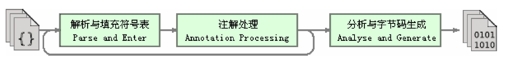

#### 8.1.1 解释与填充符号表

**词法、语法分析**：将源代码中的字符流解析成语法树（AST），编译器后续的操作都是基于语法树，不再处理源码字符流。

**填充符号**：完成语法分析后，开始会对符号表（由符号地址和符号信息构成的类似哈希表的结构）就行填充。符号表记录的内容将用于就行语义检查（如一个变量名的使用是否和之前声明的一致）、以及在目标代码生成阶段对符号名进行地址分配。

#### 8.1.2 注解处理器

可以把插入式注解处理器看作是一组编译器的插件，当这些插件工作时，允许读取、修改、添加抽象语法树中的任意元素。如果这些插件在处理注解期间对语法树进行过修改，编译器将回到解析及填充符号表的过程重新处理，直到所有插入式注解处理器都没有再对语法树进行修改为止。

#### 8.1.3 语义分析和字节码生成

**语义分析**主要分为：

- 标注检查：主要检查变量使用前是否声明、变量类型与赋值之间是否匹配、同时还会进行常量折叠（如`int a = 1 + 2`会被折叠成`int a = 3`）。
- 数据及控制流分析：主要验证程序的上下文逻辑是否正确，如：检查局部变量使用前是否已赋值、方法的每条路径是否有返回值等。

**字节码生成**主要分为：

- 解语法糖：将语法糖还原成原始语法，如变长参数、自动装箱/拆箱、泛型等。
- 字节码生成：将改革阶段所生成的信息（符号表、语法树）转换成字节码指令并写到磁盘中，同时还需要做少量代码添加和转换工作（如填加默认的实例构造器`<init>`，添加类构造器`<cinit>`等）。

### 8.2 语法糖

#### 8.2.1 泛型

泛型擦除！

#### 8.2.2 自动装箱、拆箱与遍历循环

注意下面的例子：

```java
public class SugerTest {
    public static void main(String[] args) {
        Integer a = 1;
        Integer b = 2;
        Integer c = 3;
        Integer d = 3;
        Integer e = 321;
        Integer f = 321;
        Integer g = 300;
        Integer h = 21;
        Long i = 3L;
        System.out.println(c == d); // true: 范围在-127~128之间自动装箱不会new Integer()直接返回已经建好的对象
        System.out.println(e == f); // false:范围超过128, 自动new Integer(321), 两者地址不同
        System.out.println(e + 1 == f + 1); // true:运算符的存在导致自动拆箱
        System.out.println(c.equals(a + b));    // true:a+b的结果被自动装箱, equals()方法如果传入包装类型则将自动拆箱比较
        System.out.println(f.equals(g + h));    // true同上
        System.out.println(i == a + b);    // true: a + b导致i自动拆箱
        System.out.println(i.equals(a + b));    // false：a + b自动装箱后是Integer类型不是Double所以直接返回false
    }
}

// Integer中的equals()方法
public boolean equals(Object obj) {
    if (obj instanceof Integer) {
        return value == ((Integer)obj).intValue();
    }
    return false;
}

// Double中的equals()方法
public boolean equals(Object obj) {
    if (obj instanceof Long) {
        return value == ((Long)obj).longValue();
    }
    return false;
}
```

增强for循环在编译后会变成迭代器！

#### 8.2.3 条件编译

编译器会自动把永远不可能满足的条件分支去掉，如下面的代码：

```java
if (true) {
    System.out.println("True!");
} else {
    System.out.println("False!");
}

// 编译之后在反编译变成
System.out.println("True!");
```

## 9 后端编译与优化

后端编译是指把**class文件转换成**本地基础设施（硬件指令集、操作系统）相关的**二进制机器码**的过程。主要分为 **即时编译（Just in Time, JIT）** 和 **提前编译（Ahead of Time, AOT）** 两种形式。

### 9.1 即时编译器

在运行时才将代码编译成本地机器码的过程称为即时编译。在Hotspot虚拟机中，JAVA程序一般最初都是通过解释器来执行的（一边解释一边执行），当发现**某个方法或者代码块运行特别频繁（热点代码）**，运行时则将该方法编译成本地机器码（直接执行）并尽可能优化代码以提高执行效率。因此在JVM执行架构中，解释器和编译器通常使相辅相成配合工作的！

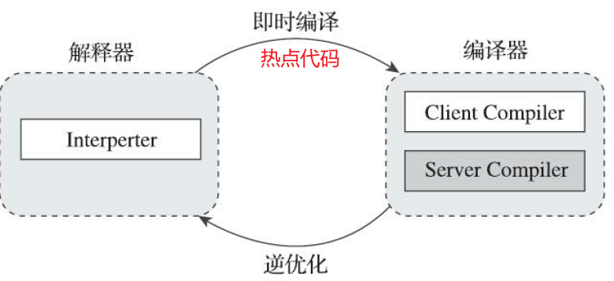

> Client Compiler：客户端编译器又称C1编译器，有更快的编译速度。
>
> Server Compiler：服务端编译器又称C2编译器，采用了高复杂度的代码优化算法，有更好的编译质量。

### 9.2 提前编译器

提前编译器主要分为两个分支：

- 一是在程序运行之前把程序翻译成机器码的静态翻译工作，静态优化相对较为保守，如果采用即时编译那样的激进优化（如去掉不常用的分支代码）可能导致程序报错而无法挽回（即时编译则可回退到低级编译器甚至解释器上执行）！
- 另一种是把原本在即时编译器运行时要做的编译工作（如代码优化）提前做好并保存下来，下次运行到这些代码时则直接加载使用即可；一般用做即时编译器的缓存加速。

## 10 Java内存模型与线程

### 10.1 硬件效率与一致性

大多数计算任务不可能只靠CPU计算来完成，处理器需要和内存等进行交互（如读取数据、存储数据等）才能完成计算任务，这种IO操作是不可避免的！

由于CPU和存储设备的运算速度差异巨大，所以往往会增加一层高速缓存（Cache）来缓解两者之间的速度不匹配（如将需要运算的数据提前载入Cache中，运算结束后CPU将运算结果存入Cache，由Cache来完成和主内存的交互），这样CPU就不用等待缓慢的内存读写了。

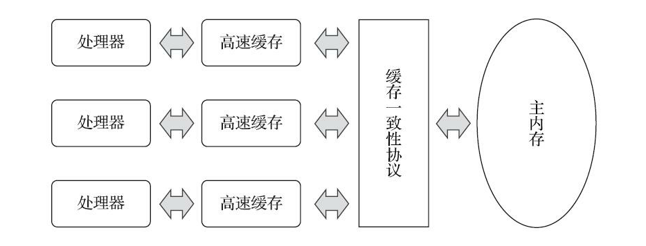

除了增加Cache外，CPU可能对输入代码进行乱序优化，JVM也可能对指令进行重排序优化；因此当一个计算任务的结果依赖另一个计算任务的中间结果，其顺序性不能有代码先后顺序来保证。

### 10.2 JAVA内存模型

#### 10.2.1 主内存与工作内存

Java内存模型规定了所有的变量都存储在主内存（Main Memory）中（此处的主内存与介绍物理硬件时提到的主内存名字一样，两者也可以类比，但物理上它仅是虚拟机内存的一部分）。每条线程还有自己的工作内存（Working Memory，可与前面讲的处理器高速缓存类比）。

- 线程的工作内存中保存了被该线程使用的变量的主内存副本，线程对变量的所有操作（读取、赋值等）都必须在工作内存中进行，而不能直接读写主内存中的数据。
- 不同的线程之间也无法直接访问对方工作内存中的变量，线程间变量值的传递均需要通过主内存来完成。

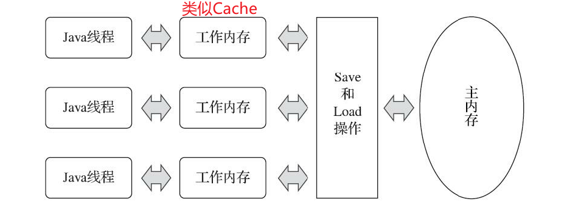

> 注意区别JAVA内存模型和JVM内存模型：
>
> - JAVA内存模型：主要目标是定义程序中各个变量的访问规则，即在虚拟机中将变量存储到内存和从内存中取出变量这样的底层细节。
>
> - JVM内存模型：JVM在执行Java程序的过程中会把它所管理的内存划分为若干不同数据区域（运行时数据区域）。
>
>  这里所讲的主内存、工作内存与Java内存区域中的Java堆、栈、方法区等并不是同一层次的内存划分，这两者基本上是没有关系的。如果两者一定要勉强对应起来，从变量、主内存、工作内存的定义看，主内存主要对应于Java堆中的对象实例数据部分，而工作内存则对应了虚拟机栈中部分区域。
>
> **参考** [JVM内存结构、Java内存模型以及Java对象模型之间的区别](https://blog.csdn.net/zyc88888/article/details/83756364?utm_medium=distribute.pc_relevant.none-task-blog-baidujs_title-2&spm=1001.2101.3001.4242)

#### 10.2.2 一般的内存交互规则


#### 10.2.3 对volatile变量的特殊规则

`volatile`可以保证变量的线程可见性（线程对`volatile`变量的修改会被立刻刷新到主内存中，对其的读取会直接从主内存中读而不是工作内存），**但是对`volatile`变量的运算操作如`i++`不是并发安全的，它不是原子操作**！

`volatile`可以禁止JVM的指令重排序优化！可参考 *单例模式的双重校验写法*。

#### 10.2.4 对long和double变量的特殊规则

Java内存模型要求lock、unlock、read、load、assign、use、store、write这八种操作都具有原子性，
但是对于64位的数据类型（long和double），在模型中特别定义了一条宽松的规定：**允许虚拟机将没有**
**被volatile修饰的64位数据的读写操作划分为两次32位的操作来进行**，即允许虚拟机实现自行选择是否
要保证64位数据类型的load、store、read和write这四个操作的原子性。

#### 10.2.5 原子性、可见性和有序性

<font color="red">Java内存模型是围绕着在并发过程中如何处理原子性、可见性和有序性这三个特征来建立的。</font>

**原子性**：由Java内存模型来直接保证的原子性变量操作包括read、load、assign、use、store和write这六个，
我们大致可以认为，基本数据类型的访问、读写都是具备原子性的（除double和long外）。此外可以使用`sychronized`来保证更大范围的原子性。

**可见性**：`volatile`、`sychronized`和`final`关键字可以保证多线程操作时变量的可见性！

**有序性**：如果在本线程内观察，所有的操作都是有序的；如果在一个线程中观察另一个线程，所有的操作都是无序的，但是可使用`volatile`来禁止指令重排序、使用`sychronized`来获取执行有序性的同等效果（因为同一时刻只能有一个获取到锁线程访问对应的代码块）！

#### 10.2.6 Happens-Before/先行发生原则

总结不出来......看 *并发编程的艺术* ！

### 10.3 JAVA与线程

#### 10.3.1 JAVA线程模型

从JDK1.3起，主流的JVM线程模型都采用 *内核实现* 的方式，他将JAVA线程（Light Weight Process，LWP是系统提供的轻量级线程、是内核线程的高级接口）一一映射为操作系统的内核线程（Kernal-Level Thread，KTL）。

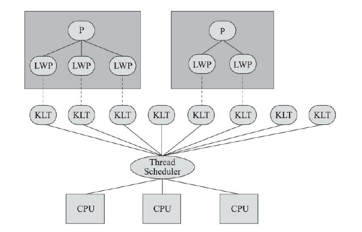

以HotSpot为例，它的每一个Java线程都是直接映射到一个操作系统原生线程来实现的，而且中间没有额外的间接结构，所以HotSpot自己是不会去干涉线程调度的（可以设置线程优先级给操作系统提供调度建议），全权交给底下的操作系统去处理，所以何时冻结或唤醒线程、该给线程分配多少处理器执行时间、该把线程安排给哪个处理器核心去执行等，都是由操作系统完成的，也都是**由操作系统全权决定**的。

> 实现线程主要有三种方式：
>
> - 使用内核实现线程（1:1实现，一个用户线程对应一个内核线程，线程调度和切换开销大）
> - 使用用户态实现（1:N实现，多个用户态线程对应一个内核线程，容易阻塞所有线程）
> - 用户线程 + 轻量级进程/线程 混合实现（N:M实现）

#### 10.3.2 JAVA线程调度

线程调度主要分为 **协同式调度**（线程的执行时间由线程本身来控制，执行完后主动通知系统切换到另一个线程，实现简单但是不稳定） 和 **抢占式调度**（系统来为每个线程分配执行时间并负责线程的切换） ，JAVA采用后者。

**JAVA线程调度由操作系统自动完成**，但是也可以主动调用`yield()`来让出CPU执行权（无法主动获取，只能主动放弃），或者为线程设置优先级（只是给操作系统一个参考、操作系统并不一定按照所设置的优先级来调度）。

#### 10.3.3 JAVA线程状态

见多线程相关的知识总结。

> 注意：Blocked和Wait状态的区别！

## 11 线程安全与锁优化

### 11.1 线程安全

#### 11.1.1 互斥同步/阻塞同步

互斥同步主要是指在在执行需要同步的代码块时，多个线程之间需要互斥进行，同一时间段只能有一个线程执行该代码块，其它线程必须阻塞等待直到代码块被执行结束。实现互斥同步主要有两种方法：使用`synchronized`关键字和`J.U.C`包中的锁如`ReentrantLock`。

- **synchronized**：被该关键字修饰的方法、代码块被javac编译后会在同步块前后形成`monitorenter`和`monitorexit`两个字节码指令；同时这是一个**可重入的非公平**锁！从执行成本来看，`synchronized`是一种重量级锁（Java的线程模型是1:1的内核实现机制，阻塞/唤醒一个线程需要由用户态切换到内核态，十分耗费处理器时间），JDK5之后开始对其进行优化。

- **ReentrantLock**：与`synchronized`有三点不同：①可等待中断；②公平锁；③绑定多个`Condition`；

通常情况下建议使用`synchronized`！使用简单，且JDK1.5之后性能可以和`ReentrantLock`持平！

#### 11.1.2 非阻塞同步

非阻塞同步不需要把线程挂起，是一种无锁同步方式，一般采用CAS来实现。

> 阻塞同步的做法其实是一种**悲观**并发策略，每次都认为必须应该先进行同步再操作，否则将出现问题。
>
> 非阻塞同步则是一种**乐观**并发策略，先不管风险，先操作，如果操作失败/产生冲突再执行补偿措施（如重试）。

### 11.2 锁优化

JDK1.5到JDK1.6时，对锁机制进行了各种优化，提高了程序执行效率！

#### 11.2.1 自旋锁与自适应自旋

互斥同步中最大的开销来自于挂起/恢复线程操作，因为这需要从用户态切换到内核态才能完成。

**自旋锁**则是指：当物理机器有一个以上的CPU能让两个或者以上的线程同时并行执行，可以让后面请求锁的线程先不挂起，而是尝试循环获取锁（自旋），因为目前持有锁的线程可能很快就会释放锁！这虽然避免了线程切换（从挂起到唤醒）的开销，但是需要消耗CPU资源，适用于线程占用锁时间较短的场景！自选次数需要有所限制，不能无限次自旋，超过限制次数则挂起。

**自适应自旋**：根据锁对象的历史获取情况来确定自旋的次数，如果对于某个锁，自旋很少成功获取过则干脆取消自旋直接挂起。

#### 11.2.2 锁消除

锁消除是指虚拟机即时编译器在运行时，对一些代码要求同步，但是对被检测到不可能存在共享数据竞争的锁进行消除。

#### 11.2.3 锁粗化

在编写代码的时候，总是推荐将同步块的作用范围限制得尽量小；但是如果一系列的连续操作都对同一个对象反复加锁和解锁，甚至加锁操作是出现在循环体之中的，那即使没有线程竞争，频繁地进行互斥同步操作也会导致不必要的性能损耗，此时可以将锁的范围直接扩大，使用一个锁即可替代多个锁。

#### 11.2.4 轻量级锁

轻量级锁是相对于传统的重量级锁而言，它使用 CAS 操作来避免重量级锁使用互斥量的开销。对于绝大部分的锁，在整个同步周期内都是不存在竞争的，因此也就不需要都使用互斥量进行同步，可以先采用 CAS 操作进行同步，如果 CAS 失败了再改用互斥量进行同步（膨胀成重量级锁）。

> 轻量级锁提升程序同步性能的依据是：对于绝大部分的锁，在整个同步周期内都是不存在竞争的（区别于偏向锁）。这是一个经验数据。如果没有竞争，轻量级锁使用CAS操作避免了使用互斥量的开销，但如果存在锁竞争，除了互斥量的开销外，还额外发生了CAS操作，因此在有竞争的情况下，轻量级锁比传统的重量级锁更慢。

#### 11.2.5 偏向锁

偏向锁的思想是偏向于让第一个获取锁对象的线程，这个线程在之后获取该锁就不再需要进行同步操作，甚至连 CAS 操作也不再需要。

当锁对象第一次被线程获得的时候，进入偏向状态，标记为 1 01。同时使用 CAS 操作将线程 ID 记录到 Mark Word 中，如果 CAS 操作成功，这个线程以后每次进入这个锁相关的同步块就不需要再进行任何同步操作。

当有另外一个线程去尝试获取这个锁对象时，偏向状态就宣告结束，此时撤销偏向（Revoke Bias）后恢复到未锁定状态或者轻量级锁状态。

----

***参考*** [java 偏向锁、轻量级锁及重量级锁synchronized原理](https://www.cnblogs.com/deltadeblog/p/9559035.html)

# 面试题集合

### 1 为什么要将永久代（方法区的一种实现）移到元空间（内存）中？

1）为永久代设置空间大小是很难确定的。

在某些场景下，如果动态加载类过多，容易产生Perm区的OOM。比如某个实际Web工程中，因为功能点比较多，在运行过程中，要不断加载很多类，经常出现致命错误。

而元空间和永久代之间最大的区别在于：元空间并不在虚拟机中，而是使用本地内存。因此，默认情况下，元空间的大小仅受本地内存限制。

2）对永久代调优是很困难的。

### 2 为什么GC要分代？

- **遍历效率低**：如果不分代，每次GC都需要遍历整个堆空间，花费时间长；且对于某些长时间存活的对象来说，这种遍历时无意义的，因为他依旧会存在。
- **针对不同类型的对象采用不同回收算法**：将堆分成新生代和老年代，针对新生到朝生夕灭的特点，适合采用**标记-复制**算法，针对老年代采用**标记清除**或**标记整理**算法（或者两者配合使用）。

### 3 JVM内存和操作系统内存的关系

JVM内存结构和操作系统的内存结构十分相似，因为**对于class来说JVM就是操作系统**，JVM内存被操作系统分配到了堆中，永久代（方法区的实现）就类似操作系统的硬盘！

JVM（一个Java程序会启动一个JVM）是以一个进程的方式运行在操作系统中！

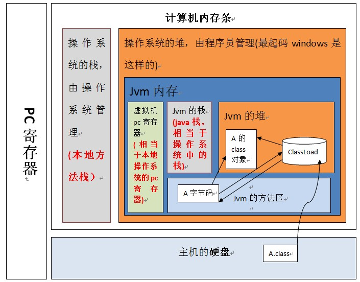

参考 [jvm内存与操作系统内存之间的关系](https://www.javatt.com/p/45029)

### 4 如何让JVM奔溃产生OOM

- 【堆溢出】申请一个超大数组/或无限王List中添加元素（Xmx和Xmx设置为一样防止自动）
- 【虚拟机/本地方法栈溢出】~~写一个无限递归函数~~，如果虚拟机不允许动态扩展栈则会先抛出`StackOverFlow`；无限创建线程将导致`OOM：unable to create native thread`。
- 【方法区/常量池溢出】动态创建大量类，导致方法区溢出（JDK1.8之后方法区已经移动到了元空间，不再产生该错误）。
- 【本机内存直接溢出】使用`unsafe`操作申请直接内存，导致溢出。

[OutOfMemoryError演示之6种OOM](https://blog.csdn.net/e891377/article/details/108771699?utm_medium=distribute.pc_relevant.none-task-blog-2%7Edefault%7EBlogCommendFromMachineLearnPai2%7Edefault-2.control&dist_request_id=&depth_1-utm_source=distribute.pc_relevant.none-task-blog-2%7Edefault%7EBlogCommendFromMachineLearnPai2%7Edefault-2.control)

### 5 FULL GC频繁怎么调优？

- **增大老年代空间**：FULL GC的触发条件之一就是老年代满了！
- **检查代码中是否有频繁分配大对象的操作**：大对象会直接被放到老年代中
- **检查代码中是否存在内存泄漏的现象**：本来是无用的对象，却无法被垃圾回收，如果把对象放入了集合中，但是对象本身的指针已经置空了，由于集合引用了该对象，所以无法GC。
- **检查代码中是否大量调用`System.gc()`**：该调用会强制触发一次Full GC。

### 6 JVM调优指令

- **`-XX:NewRatio`** --- 新生代（eden+2*Survivor）和老年代（不包含永久区）的比值，默认是 **4**
- **`-XX:SurvivorRatio`**（S区）--- 设置两个Survivor区和eden的比值，默认是 **8**
- **`-XX:NewSize`** --- 设置年轻代大小，默认占堆内存的 **3/8**
- **`-XX:MaxNewSize`** --- 设置年轻代最大值
- **`-xmn`** --- 指定新生代的大小

> **新生代占java堆的3/8，幸存代占新生代的1/10**

- **`-XX:PermSize`**  置永久代大小，默认占物理内存的**1/64**

- **`-XX:MaxPermSize`** --- 设置永久代大小，默认占物理内存的**1/4**

- **`-Xss`** --- 调整每个线程栈空间的大小，JDK5.0 以后每个线程堆栈大小为**1M**，以前每个线程堆栈大小为**256K**。

- **`-XX:+DisableExplicitGC`**  --- 设置关闭 System.gc()

- **`-XX:MaxTenuringThreshold `**  --- 设置垃圾最大年龄。

- **`-xms`** --- 初始堆大小，默认是物理内存的1/64

- **`-xmx`** --- 最大堆大小，默认是物理内存的1/4

- **`MinHeapFreeRatio`** --- 当堆中空闲内存小于40%，扩充至 xmx的大小

- **`MaxHeapFreeSize`** --- 当堆中空闲内存大小大于70%，缩小至xms

  > 通常会将 -Xms 与 -Xmx两个参数的配置相同的值，其目的是为了能够在java垃圾回收机制清理完堆区后不需要重新分隔计算堆区的大小而浪费资源。

### 7 GC线程数过多导致CPU飙高原因排查

CMS默认启动的回收线程数目是 (ParallelGCThreads + 3)/4) ，如果你需要明确设定，可以通过`-XX:ParallelCMSThreads=20`来设定,其中ParallelGCThreads是年轻代的并行收集线程数。

### 8 Java代码从编写到运行的全流程

#### 8.1Java源码编译机制

使用Java源码编译器（如javac）来完成，由Java代码生成JVM字节码文件（.class文件）

#### 8.2类加载机制

JVM类加载器将class加载（双亲委派类加载机制）到JVM方法区。

#### 8.3 类执行机制

在Hotspot虚拟机中，JAVA程序一般最初都是通过解释器来执行的（一边解释一边执行），当发现**某个方法或者代码块运行特别频繁（热点代码）**，运行时则将该方法编译成本地机器码（直接执行）并尽可能优化代码以提高执行效率。


> **边解释边执行可以节约内存**，且在程序启动初期可以首先发挥作用（不用等待所有代码均编译完成）；而**先编译再执行则可以提高效率**。所以解释器和编译器都有各自的好处，两者可以结合使用。

