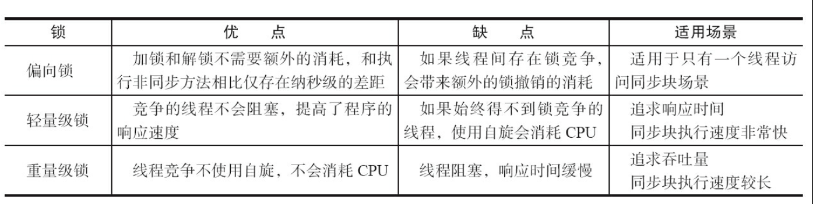
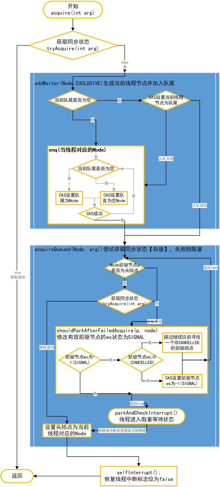

# Java并发编程相关笔记

<!-- GFM-TOC -->

* [Java并发编程相关笔记](#java并发编程相关笔记)
   * [1. JAVA并发编程基础知识](#1-java并发编程基础知识)
      * [1.1 进程和线程的区别](#11-进程和线程的区别)
      * [1.2 创建线程](#12-创建线程)
         * [1.2.1 继承Thread类](#121-继承thread类)
         * [1.2.2 实现Runable接口](#122-实现runable接口)
         * [1.2.3 实现Callable接口](#123-实现callable接口)
         * [1.2.4 使用线程池【推荐】](#124-使用线程池推荐)
      * [1.3 中断/停止/退出线程](#13-中断停止退出线程)
         * [1.3.1 interrupt (中断)](#131-interrupt-中断)
            * [中断相关的方法](#中断相关的方法)
            * [阻塞和中断的关系](#阻塞和中断的关系)
         * [1.3.2 安全地终止线程](#132-安全地终止线程)
      * [1.4 线程的生命周期*](#14-线程的生命周期)
      * [1.5 解决线程安全问题](#15-解决线程安全问题)
         * [1.5.1 同步代码块](#151-同步代码块)
         * [1.5.2 同步方法](#152-同步方法)
         * [1.5.3 Lock锁](#153-lock锁)
         * [1.5.4 ThreadLocal](#154-threadlocal)
            * [使用场景](#使用场景)
            * [原理](#原理)
            * [内存泄漏问题](#内存泄漏问题)
      * [1.6 线程间通信](#16-线程间通信)
         * [1.6.1 volatile和synchronized](#161-volatile和synchronized)
         * [1.6.2 wait()等待/notify()通知机制](#162-wait等待notify通知机制)
         * [1.6.1 线程中的sleep()和wait()的异同](#161-线程中的sleep和wait的异同)
         * [1.6.2 线程中的notify()和notifyAll()的异同](#162-线程中的notify和notifyall的异同)
         * [1.6.3 生产者消费者问题](#163-生产者消费者问题)
   * [2. Java中的锁](#2-java中的锁)
      * [2.1 volatile实现原理](#21-volatile实现原理)
         * [内存语义](#内存语义)
         * [使用场景](#使用场景-1)
      * [2.2 synchronized实现原理](#22-synchronized实现原理)
         * [内存语义](#内存语义-1)
         * [修饰代码块时的底层实现](#修饰代码块时的底层实现)
         * [修饰方法时的底层实现](#修饰方法时的底层实现)
      * [2.3 Lock实现原理](#23-lock实现原理)
         * [2.3.1 CAS机制](#231-cas机制)
         * [2.3.2 Lock接口定义](#232-lock接口定义)
         * [2.3.3 AQS(队列同步器)](#233-aqs队列同步器)
            * [独占式获取/释放锁的原理](#独占式获取释放锁的原理)
            * [共享式获取/释放锁的原理](#共享式获取释放锁的原理)
         * [2.3.4 ReentrantLock原理](#234-reentrantlock原理)
            * [公平锁的实现](#公平锁的实现)
            * [非公平锁的实现](#非公平锁的实现)
            * [公平锁和非公平锁的区别](#公平锁和非公平锁的区别)
      * [2.4 Synchronized，Volatile，Reentrantlock的不同使用场景及优缺点？](#24-synchronizedvolatilereentrantlock的不同 使用场景及优缺点)
         * [synchronized](#synchronized)
         * [volatile](#volatile)
         * [ReentrantLock](#reentrantlock)
      * [2.5 JDK1.6后synchronized的优化](#25-jdk16后synchronized的优化)
         * [偏向锁](#偏向锁)
         * [轻量级锁](#轻量级锁)
         * [自旋和自适应自旋锁](#自旋和自适应自旋锁)
         * [锁消除](#锁消除)
         * [锁粗化](#锁粗化)
         * [偏向/轻量级/重量级锁的对比](#偏向轻量级重量级锁的对比)
      * [2.6 死锁](#26-死锁)
         * [死锁产生的条件](#死锁产生的条件)
         * [避免死锁的方法](#避免死锁的方法)
   * [3. JAVA内存模型](#3-java内存模型)
      * [3.1 JAVA内存模型基础知识](#31-java内存模型基础知识)
      * [3.2 Happens-before规则](#32-happens-before规则)
      * [3.3 as-if-serial 规则](#33-as-if-serial-规则)
      * [3.4 as-if-serial 和 happens-before 的区别](#34-as-if-serial-和-happens-before-的区别)
      * [3.5 为什么双重检查的单例模式实现需要使用volatile关键字来修饰？](#35-为什么双重检查的单例模式实现需要使用volatile关键字来修饰)
   * [4. JAVA中的锁【已废弃，看第二节】](#4-java中的锁已废弃看第二节)
      * [4.0 CAS机制](#40-cas机制)
      * [4.1 Lock](#41-lock)
      * [4.2 队列同步器 （AQS）](#42-队列同步器-aqs)
         * [4.2.1 独占式同步状态的获取与释放过程](#421-独占式同步状态的获取与释放过程)
            * [获取同步状态](#获取同步状态)
            * [释放同步状态](#释放同步状态)
         * [4.2.2 共享式同步状态的获取与释放过程](#422-共享式同步状态的获取与释放过程)
            * [获取同步状态](#获取同步状态-1)
            * [释放同步状态](#释放同步状态-1)
      * [4.3 ReentranLock 可重入锁](#43-reentranlock-可重入锁)
         * [公平/非公平锁](#公平非公平锁)
      * [4.4 ReentrantReadWriteLock读写锁](#44-reentrantreadwritelock读写锁)
         * [4.4.1 写锁的获取和释放](#441-写锁的获取和释放)
         * [4.4.2 读锁的获取和释放](#442-读锁的获取和释放)
         * [4.4.3 锁降级的过程？](#443-锁降级的过程)
      * [4.5 Condition接口](#45-condition接口)
      * [4.X 重量级与轻量级锁](#4x-重量级与轻量级锁)
   * [5. 并发容器和框架](#5-并发容器和框架)
      * [5.1 ConcurrentHashMap](#51-concurrenthashmap)
         * [5.1.1 为什么要使用ConcurrentHashMap](#511-为什么要使用concurrenthashmap)
      * [5.2 ConcurrentLinkedDeque](#52-concurrentlinkeddeque)
         * [5.2.1 入队](#521-入队)
         * [5.2.2 出队](#522-出队)
      * [5.3 BlockingQueue 阻塞队列](#53-blockingqueue-阻塞队列)
         * [5.3.1 ArrayBlockingQueue](#531-arrayblockingqueue)
         * [5.3.2 LinkedBlockingQueue](#532-linkedblockingqueue)
         * [5.3.3 PriorityBlockingQueue](#533-priorityblockingqueue)
      * [5.4 Fork/Join框架](#54-forkjoin框架)
   * [6. Java中的13个原子操作类](#6-java中的13个原子操作类)
   * [7. JAVA中的并发工具类](#7-java中的并发工具类)
      * [7.1 CountDownLatch 等待多线程完成](#71-countdownlatch-等待多线程完成)
      * [7.2 CyclicBarrier 同步屏障](#72-cyclicbarrier-同步屏障)
      * [7.3 Semaphore 控制并发线程数](#73-semaphore-控制并发线程数)
      * [7.4 Exchange 线程间交换数据](#74-exchange-线程间交换数据)
   * [8. JAVA中的线程池](#8-java中的线程池)
      * [8.1 线程池的好处](#81-线程池的好处)
      * [8.2 线程池的实现原理](#82-线程池的实现原理)
         * [8.2.1 线程池的处理流程](#821-线程池的处理流程)
         * [8.2.2 线程池的任务执行流程](#822-线程池的任务执行流程)
         * [8.2.3 Worker线程](#823-worker线程)
         * [8.2.4 线程池生命周期](#824-线程池生命周期)
         * [8.2.5 包装线程池<a href="https://github.com/alibaba/transmittable-thread-local/blob/master/src/main/java/com/alibaba/ttl/threadpool/TtlExecutors.java">TtlExecutors</a>](#825-包装线程池ttlexecutors)
      * [8.3 线程池的使用](#83-线程池的使用)
         * [8.3.1 创建线程池/线程池七大参数](#831-创建线程池线程池七大参数)
         * [8.3.2 执行/向线程池提交任务](#832-执行向线程池提交任务)
         * [8.3.3 销毁线程池](#833-销毁线程池)
         * [8.3.4 完整示例](#834-完整示例)
         * [8.3.5 ThreadPollExcutor的四大饱和/拒绝策略](#835-threadpollexcutor的四大饱和拒绝策略)
         * [8.3.6 线程池大小设置原则](#836-线程池大小设置原则)
         * [8.3.7 线程池参数设置原则](#837-线程池参数设置原则)
   * [9. Executor框架](#9-executor框架)
      * [9.1 整体框架图](#91-整体框架图)
         * [9.1.1 Executor框架类与接口](#911-executor框架类与接口)
         * [9.1.2 Executor框架的使用](#912-executor框架的使用)
      * [9.2 ThreadPoolExecutor](#92-threadpoolexecutor)
         * [9.2.1 FixThreadPool](#921-fixthreadpool)
         * [9.2.2 SingleThreadPool](#922-singlethreadpool)
         * [9.9.3 CacheThreadPool](#993-cachethreadpool)
   * [10. 面试题整理](#10-面试题整理)
      * [10.1 什么是内存可见性问题？](#101-什么是内存可见性问题)
      * [10.3 启动线程为什么要调用start()而不直接调用run()](#103-启动线程为什么要调用start而不直接调用run)
      * [10.6 ThreadPollExcutor是怎么保证核心线程不被销毁的？](#106-threadpollexcutor是怎么保证核心线程不被销毁的)
      * [10.7 Java多线程存在线程安全的根本原因？](#107-java多线程存在线程安全的根本原因)
      * [10.8 Java 线程池里的 arrayblockingqueue 与 linkedblockingqueue 的使用场景和区别？](#108-java-线程池里的-arrayblockingqueue-与-linkedblockingqueue-的使用场景和区别)
      * [10.9 手写生产者消费者模式？](#109-手写生产者消费者模式)
         * [synchronized+wait()+notify()版](#synchronizedwaitnotify版)
         * [Lock+Condition版](#lockcondition版)
      * [10.10 集合类中的 List 和 Map 的线程安全版本是什么，如何保证线程安全的？](#1010-集合类中的-list-和-map-的线程安 全版本是什么如何保证线程安全的)
         * [CopyOnWriteArrayList](#copyonwritearraylist)
         * [ConcurrentHashMap](#concurrenthashmap)

<!-- Created by https://github.com/ekalinin/github-markdown-toc -->

## 1. JAVA并发编程基础知识

**进程**：程序的一次执行过程。

**线程**：线程与进程相似，但线程是一个比进程更小的执行单位。

### 1.1 进程和线程的区别

- **地址空间**： 同一进程的所有线程共享本进程的地址空间，而不同的进程之间的地址空间是独立的。

- **资源拥有**： 同一进程的所有线程共享本进程的资源，如内存，CPU，IO、堆、方法区等。进程之间的资源是独立的，无法共享。每个线程拥有独立的栈空间和程序计数器。

- **执行过程**：每一个进程可以说就是一个可执行的应用程序，每一个独立的进程都有一个程序执行的入口，顺序执行序列。但是线程不能够独立执行，必须依存在应用程序中，由程序的多线程控制机制进行控制。

- **健壮性**： 因为同一进程的所有线程共享此线程的资源可能带来安全隐患（需要线程同步），且一个线程出现异常可能导致其他线程退出。 但是各个进程之间的资源是独立的，因此当一个进程崩溃时，不会影响其他进程。因此进程比线程健壮。

- **并发和资源消耗**：两者均可并发执行。进程切换时，消耗的资源大，效率低。所以涉及到频繁的切换时，使用线程要好于进程。如果要求同时进行并且又要共享某些变量的并发操作，只能用线程不能用进程。

  > 进程是系统资源分配的基本单位，线程是CPU执行和调度的基本单位。

### 1.2 创建线程

#### 1.2.1 继承`Thread`类

继承`Thread`类并重写`run()`方法，创建`Thread`子类对象并调用`start()`方法启动线程（启动子线程并调用其`run()`方法）即可。

> join()方法可以阻塞当前线程, 把CPU控制权交给调用join()方法的线程直到它结束。
>
> sleep()方法可以让当前线程睡眠。
>
> yield()方法可以释放当前线程的CPU控制权。
>
> get/setPriority()方法可以获取或者设置线程的优先级（高优先级的不一定会被先执行完）。

- JAVA中只能单继承，不建议使用继承Thread的方法来实现。

#### 1.2.2 实现`Runable`接口

将实现`Runable`接口的类（重写其中的`run()`方法）的对象作为参数传入`Thread`构造方法中即可。【推荐此方法】：

- **可以避免Java中单继承的弊端**：利用接口来实现多继承的功能。
- **比较适用于多个线程共享数据的情况**（不需要把数据声明为static，直接在创建新线程时传入实现`Runbale`接口的类的同一个对象即可）。

#### 1.2.3 实现`Callable`接口

JDK5.0中新增的方式，实现`Callable`接口并重新`call()`方法即可。功能更加强大：支持返回值（需要借助`FutureTask`类）、泛型、抛出异常。

具体实现举例：

```java
class CallableCalculate implements Callable<Integer> {
    // 回调函数
    public Integer call() throws Exception {
        int sum = 0;
        for (int i = 0; i < 100; i++) {
            sum += i;
        }
        return sum;
    }
}

public class CallableThread {
    public static void main(String[] args) throws ExecutionException, InterruptedException {
        CallableCalculate calculate = new CallableCalculate();
        FutureTask<Integer> task = new FutureTask<Integer>(calculate);
        Thread thread = new Thread(task);
        thread.start();
        // 获取线程返回值并输出
        System.out.println(task.get());
    }
}
```

#### 1.2.4 使用线程池【推荐】

JDK1.5中的新特性，提前创建好多个线程放入线程池中，使用时直接获取用完重新放入线程池，可以避免频繁创建和销毁线程，实现重复利用，提升性能。

### 1.3 中断/停止/退出线程

#### 1.3.1 interrupt (中断)

中断是线程的一个标识属性（线程启动时该标志位默认`false`），调用线程的`interrupt()`将修改该标志位为`true`，调用线程的`isInterrupted()`方法可以获取该标志位的值。

> `interrupt()` 方法并不能立即中断线程，该方法仅仅告诉线程外部已经有中断请求，至于是否中断还取决于线程自己的处理。

如果当前线程的中断标志位被设置成了`true`后：

- 调用**阻塞方法**（如`sleep()`），此时将产生`InterruptedException`，许多声明抛出改异常的Java方法会同时中断标志位会被自动设置成`fasle`：

  ```java
  Thread t = new Thread( new Runnable(){
      public void run(){
         try {
             Thread.sleep(2000);
         } catch (InterruptedException e) {
             // 可以在此处释放资源
             
             // 如果想要继续执行下去，则可以恢复中断标志位
             // Thread.currentThread().interrupt();
         }
      }
  } );
  ```

- 调用**非阻塞方法**，此时需要在当前线程中利用`isInterrupted()`方法时刻检测当前线程是否被中断，以做进一步处理：

  ```java
  Thread t = new Thread( new Runnable(){
      public void run(){
          while(!Thread.currentThread.isInterrupted()){
              // 正常任务代码……
          }
          // 中断处理代码……
          // 可以在这里进行资源的释放等操作……
      }
  } );
  ```

##### 中断相关的方法

- `Thread.currentThread().isInterrupt()`：返回当前线程的中断状态.

  ```java
  public boolean isInterrupted() {
      return isInterrupted(false);	// 返回中断标志但不重置
  }
  ```

- `Thread.interrupted()` 将当前线程的中断标志位设置为`true`.

  ```java
  public static boolean interrupted() {
      return currentThread().isInterrupted(true);	// 返回中断标志且重置标志位为true
  }
  ```

- `Thread.currentThread().interrupt()`：返回当前线程的中断状态，将当前线程的中断标志位设置为`false`.

测试代码如下：

```java
public class InterruptTest {
    public static void main(String[] args) throws InterruptedException {
        Thread thread = new Thread(new InterruptThread());
        thread.start();
        Thread.sleep(1000);
        System.out.println("main() interrupt thread!");
        thread.interrupt();
        System.out.println("main() finished!");
    }
}

class InterruptThread implements Runnable {
    public void run() {
        try {
            while (true) {
                // 获取线程中断标志位
                System.out.println("Begin to run! isInterrupted:" + Thread.interrupted());
                // 休眠（阻塞方法）
                Thread.sleep(2000);
            }
        } catch (InterruptedException e) {
            // 抛出InterruptedException时线程的中断标志位会被自动设置成false
            System.out.println("Catch InterruptedException! isInterrupted:" + Thread.currentThread().isInterrupted());
            // 两次中断本线程
            Thread.currentThread().interrupt();
            System.out.println("isInterrupted:" + Thread.interrupted());
            System.out.println("isInterrupted:" + Thread.currentThread().isInterrupted());
            System.out.println("isInterrupted:" + Thread.interrupted());
            System.out.println("isInterrupted:" + Thread.currentThread().isInterrupted());
        }
    }
}

// ----- 打印输出 -----
/*
Begin to run! isInterrupted:false
main() interrupt thread!
main() finished!
Catch InterruptedException! isInterrupted:false
isInterrupted:true
isInterrupted:false
isInterrupted:false
isInterrupted:false
*/
```

##### 阻塞和中断的关系

- 阻塞表示线程的一种状态，在这种状态下，线程是不占用CPU的（也就是说，不执行你写的命令代码的），更进一步来说，也就是你的代码在执行过程中，在某个地方暂停了。

- 而中断最初的含义是，指计算机运行过程中，出现某些意外情况需主机干预时，机器能自动停止正在运行的程序并转入处理新情况的程序，处理完毕后又返回原被暂停的程序继续运行。但在java中，**中断的作用明显被弱化了**，中断更多的是指线程标志位的某个状态，而**中断的处理逻辑需要用户自己来进行定制（你可以选择处理中断，也可以选择不处理），责任交给了用户。**

通过上面的逻辑的介绍，又引出了这样一个问题：

==中断请求如果交给被中断的线程来进行处理，那么如果被中断的线程无法获取到CPU （比如永远处于阻塞队列中）,那么中断将永远无法生效，这个问题如何解决？==

很明显我们可以想到的一个办法，在线程A阻塞的情况下去中断该线程，我们不能让线程A自己去处理中断，因为它自己此时没有办法获取到|CPU执行权,因此我们必须借助于其他线程来辅助完成线程A的中断过程。（简单的思路）

上面的思路只是想起到启发的作用，而真正在java中进行实现的时候，更加简单。当线程B去中断阻塞的线程A的时候，B将接受到A抛出的`InterruptException`。java中直接将**阻塞后中断设置为不相容的**（即不允许中断已经阻塞的线程）。这样便避免了不确定的事情的发生（比如说，中断永远无效），与其让中断发出者不确定的等待，不如直接给他一个确定的反馈（中断的失败），因为在计算机中，程序的可终止性是一个必要的条件，既而程序不可终止更加难以容忍。

> 当Java的某个线程处于可中断的阻塞状态时，你用另一个线程调用该线程的interrupt()方法时，JVM会使该线程离开阻塞状态，并抛出一个异常。既然该线程已经离开阻塞状态，自然要参与到对CPU时间的争夺中，当获取到CPU时间时自然可以处理该异常。

#### 1.3.2 安全地终止线程

**注意**：

> suspend()/resume()/stop()用来暂停/恢复/终止线程，但是这三个方法不安全！已经被弃用！可以使用wait()/notify()机制来替代。
>
> suspend()可能引发死锁！stop()无法及时释放资源！

可以使用一个布尔变量或者利用中断（本质上也是一个布尔变量，只不过是JAVA中线程自带的，并且在线程相关的API中都会检查这个中断变量）来判断线程是否需要退出。如：

```java
// 测试代码
public class SafeStopTest {
    public static void main(String[] args) throws InterruptedException {
        MyThread r1 = new MyThread();
        Thread t1 = new Thread(r1, "线程1");
        Thread t2 = new Thread(new MyThread(), "线程2");
        t1.start();
        t2.start();
        Thread.sleep(1000);
        r1.cancel();
        Thread.sleep(1100);
        t2.interrupt();
    }
}

class MyThread implements Runnable {
    private volatile boolean stop = false;

    private static int count = 0;

    public void run() {
        while (!stop && !Thread.currentThread().isInterrupted()) {
            synchronized (MyThread.class) {
                count++;
                System.out.println(Thread.currentThread().getName() + "正在执行任务, count = " + count);	// 注意输出部分也要保证在同步代码块里面！
            }
            try {
                Thread.sleep(500);
            } catch (InterruptedException e) {
                System.out.println(Thread.currentThread().getName() + "收到中断信号");
                break;
            }
        }
        // 此处可以做释放资源等操作
        System.out.println(Thread.currentThread().getName() +  "安全退出！count = " + count);
    }

    public void cancel() {
        System.out.println(Thread.currentThread().getName() + "调用Cancel()方法");
        stop = true;
    }
}

// ----- 输出打印 -----
/*
线程1正在执行任务, count = 1
线程2正在执行任务, count = 2
线程2正在执行任务, count = 3
线程1正在执行任务, count = 4
线程2正在执行任务, count = 5
线程1正在执行任务, count = 6
main调用Cancel()方法
线程1安全退出！count = 6
线程2正在执行任务, count = 7
线程2正在执行任务, count = 8
线程2收到中断信号
线程2安全退出！count = 8
*/
```

### 1.4 线程的生命周期*

线程的生命周期包含5个阶段，包括：新建、就绪、运行、阻塞、销毁。各状态之间的转换图如下所示：


- **新建（New）**：就是刚使用new方法，new出来的线程，创建后尚未启动。

- **就绪（Runable）**

  - Ready：就是调用的线程的start()方法后，这时候线程处于等待CPU分配资源阶段，谁先获取到CPU资源，谁开始执行。

  - Running：当就绪的线程被调度并获得CPU资源时，便进入运行状态，run方法定义了线程的操作和功能。

- **阻塞（Blocked）**：请求获取 monitor lock 从而进入 synchronized 函数或者代码块，但是其它线程已经占用了该 monitor lock，所以处于阻塞状态。要结束该状态进入从而 RUNABLE 需要其他线程释放 monitor lock。

- **无限期等待（WAITING）**：等待其它线程显式地唤醒。阻塞和等待的区别在于，阻塞是被动的，它是在等待获取 monitor lock。而等待是主动的，通过调用 Object.wait() 等方法进入。

  | 进入方法                                   | 退出方法                             |
  | ------------------------------------------ | ------------------------------------ |
  | 没有设置 Timeout 参数的 Object.wait() 方法 | Object.notify() / Object.notifyAll() |
  | 没有设置 Timeout 参数的 Thread.join() 方法 | 被调用的线程执行完毕                 |
  | LockSupport.park() 方法                    | LockSupport.unpark(Thread)           |

- **限期等待（TIMED_WAITING）**：无需等待其它线程显式地唤醒，在一定时间之后会被系统自动唤醒。

  | 进入方法                                     | 退出方法                                        |
  | -------------------------------------------- | ----------------------------------------------- |
  | Thread.sleep(long) 方法                      | 时间结束                                        |
  | 设置了 Timeout 参数的 Object.wait(long) 方法 | 时间结束 / Object.notify() / Object.notifyAll() |
  | 设置了 Timeout 参数的 Thread.join(long) 方法 | 时间结束 / 被调用的线程执行完毕                 |
  | LockSupport.parkNanos() 方法                 | LockSupport.unpark(Thread)                      |
  | LockSupport.parkUntil() 方法                 | LockSupport.unpark(Thread)                      |

  调用 Thread.sleep() 方法使线程进入限期等待状态时，常常用“使一个线程睡眠”进行描述。调用 Object.wait() 方法使线程进入限期等待或者无限期等待时，常常用“挂起一个线程”进行描述。睡眠和挂起是用来描述行为，而阻塞和等待用来描述状态。

- **销毁（Terminated）**：如果线程正常执行完毕后或线程被提前强制性的终止或出现异常导致结束，那么线程就要被销毁，释放资源;

> park()相关方法内部调用了`sun.misc.Unsafe UNSAFE`类的方法，该类可以获取最高权限！

### 1.5 解决线程安全问题

多个线程之间如果存在共享数据，则可能存在线程安全问题。

<font color="red">造成线程安全问题的根本原因：</font>

- **共享变量的可见性**：每个JAVA线程都有一个工作内存（缓存），线程直接读写工作内存，工作内存和主内存打交道；当写入工作内存的共享变量没有及时刷新到主内存，或当前工作内存中的数据是以前缓存的数据而不是当前主内存中最新的数据；会导致多个线程读取的同一共享变量的值是不一致的。
- **线程执行操作的原子性**：对共享变量的修改操作可能被其它线程打断，其它线程也可能对这个变量进行操作，所以导致线程不安全。

#### 1.5.1 同步代码块

给代码块加锁（所有线程共用同一个锁，任何一个对象都可以充当锁），需要传入一个监视器对象/锁（Obj），通常可以使用 **类名.class**。

```java
synchronized (Object obj) {	// obj是一个锁/监视器，多个线程必须共享一个obj，可以直接使用ClassName.class(因为在类加载时，会在堆中自动创建一个该类对应的对象)
    // 存在共享数据的代码块
    // ...
}
```

#### 1.5.2 同步方法

直接在方法返回类型前面加上`synchronized`关键字即可，此时监视器对象/锁默认为`this`对象（如果是静态方法则为当前类本身）。

```java
// 静态方法的同步监视器是当前类本身
public static synchronized void test1 () {
    // 方法中的代码块
    // ...
}

// 非静态方法的同步监视器是this
public synchronized void test2 () {
    // 方法中的代码块
    // ...
}
```

注意以下几点：

- 通过加锁可以实现线程安全，但是也会降低程序运行效率。

- 使用`synchronized`需要传入(显示或者隐式)一个同步锁，多个线程共用一个锁才能实现对共享数据的互斥访问。

- **线程死锁**：不同线程都在占用对方需要的资源不放弃，都在等待对方放弃需要的同步资源，形成无限阻塞即死锁（需要尽量避免嵌套定义同步代码快）。示例代码如下所示：

  ```java
  public class BlockTest {
      public static void main(String[] args) throws InterruptedException {
          final StringBuilder sb1 = new StringBuilder("test1");
          final StringBuilder sb2 = new StringBuilder("test2");
          
          new Thread() {
              @Override
              public void run() {
                  // 等待sb1锁
                  synchronized (sb1) {
                      sb1.append("-thread1");
  
                      try {
                          Thread.sleep(100);
                      } catch (InterruptedException e) {
                          e.printStackTrace();
                      }
  
                      // 等待sb2锁
                      synchronized (sb2) {
                          sb2.append("-thread1");
                      }
                  }
              }
          }.start();
  
          new Thread(new Runnable() {
              public void run() {
                  // 等待sb2锁
                  synchronized (sb2) {
                      sb2.append("-thread2");
  
                      try {
                          Thread.sleep(100);
                      } catch (InterruptedException e) {
                          e.printStackTrace();
                      }
  
                      // 等待sb1锁
                      synchronized (sb1) {
                          sb1.append("-thread2");
                      }
                  }
              }
          }) {
          }.start();
  
          Thread.sleep(1000);
          System.out.println("sb1:" + sb1 + "\nsb2:" + sb2);
      }
  }
  
  // --- 最终造成死锁 ---
  // 输出打印（主线程未退出）
  /*
  sb1:test1-thread1
  sb2:test2-thread2
  */
  ```

产生思索的四个条件：

- 互斥条件：该资源任意一个时刻只由一个线程占用。

- 请求与保持条件：一个进程因请求资源而阻塞时，对已获得的资源保持不放。

- 不剥夺条件:线程已获得的资源在末使用完之前不能被其他线程强行剥夺，只有自己使用完毕后才释放资源。

- 循环等待条件:若干进程之间形成一种头尾相接的循环等待资源关系。

#### 1.5.3 Lock锁

JDK1.5新增的特性，手动构造一个Lock对象（可以是公平锁也开始是非公平，如果是公平锁则使用该锁的线程可以公平地获取到CPU的执行权）并使用该对象的`lock()`和`unlock()`方法对代码块进行加锁和解锁。示例代码如下所示：

```java
class ServiceWindow implements Runnable {
    private int ticketNum = 100;
    // 创建一个公平锁
    private ReentrantLock lock = new ReentrantLock();

    public void run() {
        while (true) {
            lock.lock();	// lock()必须紧跟try代码块
            try {
                if (ticketNum > 0) {
                    System.out.println(Thread.currentThread().getName() + "：售票" + ticketNum);
                    try {
                        Thread.sleep(50);	// 为了增大线程切换的概率
                    } catch (InterruptedException e) {
                        e.printStackTrace();
                    }
                    ticketNum--;    // 非原子操作
                } else {
                    System.out.println(Thread.currentThread().getName() + "：票已售罄！");
                    break;
                }
            } finally {
                lock.unlock();
            }
        }
    }
}

public class LockTest {
    public static void main(String[] args) {
        ServiceWindow window = new ServiceWindow();
        Thread t1 = new Thread(window);
        Thread t2 = new Thread(window);
        Thread t3 = new Thread(window);
        t1.setName("窗口1");
        t2.setName("窗口2");
        t3.setName("窗口3");
        t1.start();
        t2.start();
        t3.start();
    }
}

// 输出打印
/*
依次输出窗口1/2/3售票直到售罄。
*/
```

Lock锁和`synchronized`的区别：

- Lock锁需要手动加锁和释放锁，相对灵活
- 使用同步代码块/方法的方式需要传入监视器对象/锁，自动加锁/释放锁。

> 建议使用优先级 Lock锁 --> 同步代码块 --> 同步方法

#### 1.5.4 ThreadLocal

通常情况下，多线程访问统一共享变量容易出现并发问题，特别是在多个线程需要对一个共享变量进行写入时，为了安全需要做同步（加锁）。

`ThreadLocal`可以为线程提供本地变量，每个线程有一个`ThreadLocal`变量的本地副本，互不干扰，实现了**线程之间的数据隔离**。具体如下图所示：


 

一般使用`set()/get()/remove()`接口来设置/获取/移除变量值。使用举例：

```java
public class Main {
    private static ThreadLocal<String> localVar = new ThreadLocal<>();	// 所有线程共享访问，但是都有自身的副本

    public static void main(String[] args) {
        new Thread(new Runnable() {
            @Override
            public void run() {
                localVar.set("Thread1.localVar");
                print("Thread1");
            }
        }).start();

        new Thread(new Runnable() {
            @Override
            public void run() {
                // localVar.set("Thread2.localVar");
                print("Thread2");
            }
        }).start();
    }

    private static void print(String str) {
        System.out.println(str + ":" + localVar.get());
        // localVar.remove();	// 移除变量值
    }
}

// ------ 输出打印 -------
Thread1:Thread1.localVar
Thread2:null	// 说明线程2读取不到线程1的ThreadLocal变量值
```

##### 使用场景

> Synchronized用于线程间的数据共享，而ThreadLocal则用于线程间的**数据隔离**。

- **数据隔离**：每个请求处理线程分配一个 JDBC 连接 Connection。这样就可以保证每个线程的都在各自的 Connection 上进行数据库的操作，不会出现 A 线程关了 B线程正在使用的 Connection，以及事务操作混乱问题。

- **数据传递**：比如在处理一个HTTP请求时，需要调用很多方法（比如Service层，DAO层等），每个方法都需要用到用户id、Token等信息，为了避免参数频繁传递，则可以将参数写入ThreadLocal变量中进行共享（只在单个线程中共享，因为处理一个请求的往往都是同一线程）。还经常用在全链路Trace跟踪等场景中。

##### 原理

事实上，`ThreadLocal`只是一个外壳，它内部会读写`Thread`实例中的`ThreadLocalMap threadLocals `成员变量（类似HashMap，key为`TreadLocal`变量，value为`ThreadLocal`变量中`set()`进去的值，使用**线性探测法解决哈希冲突**而不是拉链法）。

> 一个线程中可以存多个TreadLocal变量！最终的ThreadLocal变量值是存储在Thread中的！


```java
class ThreadLocalMap {
	public void set(T value) {
        Thread t = Thread.currentThread();
        ThreadLocalMap map = getMap(t);
        if (map != null)
            map.set(this, value);
        else
            createMap(t, value);
    }

    public void set(T value) {
        Thread t = Thread.currentThread();
        ThreadLocalMap map = getMap(t);
        if (map != null)
            map.set(this, value);
        else
            createMap(t, value);
    }

    public void remove() {
        ThreadLocalMap m = getMap(Thread.currentThread());
        if (m != null)
            m.remove(this);
    }

    ThreadLocalMap getMap(Thread t) {
        return t.threadLocals;
    }
    void createMap(Thread t, T firstValue) {
        t.threadLocals = new ThreadLocalMap(this, firstValue);
    }    
}


```

##### 内存泄漏问题

```java
class ThreadLocalMap {
    private Entry[] table;	// 存储ThreadLocal变量和对应的值(哈希表, 线性探测法/开放地址法)
    
    static class Entry extends WeakReference<ThreadLocal<?>> {
        Object value;
        Entry(ThreadLocal<?> k, Object v) {
            super(k);
            value = v;
        }
    }
}
```

哈希表中的节点是继承了弱引用，而且key直接是交给了父类处理`super(key)`，父类是个弱引用，所以key是弱引用，key完全不存在内存泄漏问题，因为他不是强引用，它可以被GC回收的。


<span style = "color:red">**`ThreadLocalMap` 中使用的 key 为 `ThreadLocal` 的弱引用，而 value 是强引用。**</span>

比如在 **线程池** 这种场景下，**线程池的存在核心线程是不会销毁的**，只要创建出来他会反复利用，生命周期不会结束掉，**但是key是弱引用会被GC回收掉，value强引用不会回收**，所以形成了如下场面：

```java
Thread -> ThreadLocalMap -> Entry(key为null) -> value  //存在这种引用链
```

由于value和Thread还存在链路关系，还是可达的，所以不会被回收，这样越来越多的垃圾对象产生却无法回收，造成内存泄漏，时间久了必定OOM。

解决方案`ThreadLocal`已经为我们想好了，**提供了`remove()`方法**，这个方法是将value移出去的。所以用完后记得`remove()`（在调用`set()/get()`方法时也会把扫描到的key已经为null的value回收，在一定程度上也可以缓解内存泄漏问题）。

### 1.6 线程间通信

#### 1.6.1 `volatile`和`synchronized`

`volatile`和`synchronized`本质上也是一种线程间通信的机制！

以`synchronized`为例，当一个线程A获取到同步锁，则其它想要执行同步代码块/方法的线程将进入 **同步队列/锁池** 中（处于BLOCKED状态），直到线程A退出同步代码块/方法，释放同步锁，此时同步队列中的 **所有线程** 将出队并开始竞争同步锁，未竞争到同步锁的线程将继续进入同步队列。


#### 1.6.2 `wait()`等待/`notify()`通知机制

使用`wait()`和`notify()`/`notifyAll()`方法是任意Java对象都具备的功能。

- 调用`wait()`方法的线程将从RUNABLE进入WAITING状态（如果是调用带时间参数的`wait(long)`，线程将进入TIME_WAITING状态），同时释放同步锁，当前线程将进入**等待队列/等待池**中。一般该方法的调用会放在while语句中。
- 调用`notify()/notifyAll()`方法的线程将从WAITING/TIME_WAITING状态进入RUNNABLE状态（如果竞争到锁）/BLOCKED状态（如果未竞争到锁），一个/所有线程将从**等待队列/等待池中进入同步队列/锁池**中，等待别的线程释放当前的同步锁，一旦竞争到同步锁则由CPU调度执行。一般调用该方法的同时会修改让wait()调用执行的while循环条件。

**<font color="red">上述三个方法的调用者必须是同步代码块中的同一个监视器对象/同步锁</font>**（相当于共用一个信号量），否则将出现`java.lang.IllegalMonitorStateException`异常！（`synchronized(Object obj)`中的`obj`参数即为调用上述三个方法的对象）。

举例如下所示：

```java
public class WaitNotifyTest {
    static boolean flag = true;

    static Object lock = new Object();

    public static void main(String[] args) throws InterruptedException {
        Thread wait = new Thread(new WaitThread(), "WaitThread");
        Thread notify = new Thread(new NotifyThread(), "NotifyThread");
        wait.start();
        Thread.sleep(50);
        notify.start();
    }

    static class WaitThread implements Runnable {
        public void run() {
            synchronized (lock) {
                // 获取得到同步锁后，如果不满足条件则释放同步锁并等待
                while (flag) {
                    try {
                        System.out.println(Thread.currentThread().getName() + ": flag is true, wait...");
                        lock.wait();
                    } catch (InterruptedException e) {
                        // 响应外部中断
                        System.out.println(Thread.currentThread().getName() + ": interrupted!");
                        break;
                    }
                }
                System.out.println(Thread.currentThread().getName() + ": running...");
            }
        }
    }

    static class NotifyThread implements Runnable {
        public void run() {
            synchronized (lock) {
                System.out.println(Thread.currentThread().getName() + ": hold the lock, notify other threads!");
                // 唤醒其它wait线程，修改wait的执行条件
                lock.notifyAll();
                flag = false;
                
                // 手动延迟一段时间后再释放锁
                try {
                    Thread.sleep(50);
                } catch (InterruptedException e) {
                    e.printStackTrace();
                }
            }

            // 再次获取同步锁(需要和已经被唤醒的线程竞争该锁)
            synchronized (lock) {
                System.out.println(Thread.currentThread().getName() + ": hold the lock again, sleep for 30 ms!");

                try {
                    Thread.sleep(30);
                } catch (InterruptedException e) {
                    e.printStackTrace();
                }
            }
        }
    }
}

// ----- 输出打印 ------------
/*
WaitThread: flag is true, wait...
NotifyThread: hold the lock, notify other threads!
NotifyThread: hold the lock again, sleep for 30 ms!
WaitThread: running...
*/
// 其中第三条和第四条打印可能互换顺序, 因为两个线程需要竞争同步锁
```

> wait() 应配合while循环使用，不应使用if（防止过早/意外通知），务必在wait()调用前后都检查条件，如果不满足，必须调用notify()唤醒另外的线程来处理，自己继续wait()直至条件满足再往下执行。

#### 1.6.1 线程中的`sleep()`和`wait()`的异同

- 两者均可使得当前线程进入阻塞/等待状态。
- `wait()`定义在`java.lang.Object`类中，它的调用者是线程监视器对象，该方法必须在同步代码块中调用。**该操作会释放当前的同步锁**。
- `sleep()`定义在`Thread`类中，是一个静态方法，可以在任何地方调用。**该操作不释放同步锁**。

#### 1.6.2 线程中的`notify()`和`notifyAll()`的异同

**`notify()`**

- 将一个线程唤醒（随机或者更根据线程优先级），该线程从等待池进入锁池（WAITING-->RUNNABLE-->BLOCKED?）

- 可能引发死锁/线程频繁挂起？

  > **两个生产者两个消费者**的场景:
  >
  > 如果我们代码中使用了notify()而非notifyAll()，
  >
  > - 假设消费者线程1拿到了锁，判断buffer为空，那么wait()，释放锁；
  > - 然后消费者2拿到了锁，同样buffer为空，wait()，也就是说此时Wait Set中有两个线程；
  > - 然后生产者1拿到锁，生产，buffer满，notify()了，那么可能消费者1被唤醒了，但是此时还有另一个线程生产者2在Entry Set中盼望着锁，**并且最终抢占到了锁**，但因为此时buffer是满的，因此它要wait()；
  > - 然后消费者1拿到了锁，消费，notify()；这时就有问题了，此时生产者2和消费者2都在Wait Set中，buffer为空，如果唤醒生产者2，没毛病；但如果唤醒了消费者2，因为buffer为空，它会再次wait()，这就尴尬了，**万一生产者1此时已经退出不再生产了**，没有其他线程在竞争锁了，只有生产者2和消费者2在Wait Set中互相等待，那传说中的死锁就发生了。

**`notifyAll()`**

- 将所有线程唤醒，等待池中的所有线程进入锁池（WAITING-->BLOCKED）
- 可能引发惊群效应，耗费系统资源。

**参考**

- [java中的notify和notifyAll有什么区别？ - youjia的回答 - 知乎](https://www.zhihu.com/question/37601861/answer/343143138)
- [java中的notify和notifyAll有什么区别？ - 知乎用户的回答 - 知乎](https://www.zhihu.com/question/37601861/answer/145545371)
- [线程间协作：wait、notify、notifyAll - Java 并发编程 - 极客学院Wiki (jikexueyuan.com)](https://wiki.jikexueyuan.com/project/java-concurrency/collaboration-between-threads.html)
- [你真的懂wait、notify和notifyAll吗 - 简书 (jianshu.com)](https://www.jianshu.com/p/25e243850bd2?appinstall=0)

#### 1.6.3 生产者消费者问题

场景：生产者负责生产产品，一旦产品库存满了则停止生产，直到库房空的位置则开始继续生产。消费者负责消费产品，一旦产品库存为0则需要等待，同时通知生产者开始生产产品。

具体实现代码如下所示：

```java
// 店员
class Clerk {
    // 产品库存数量
    private int productCount = 0;
    // 产品编号
    private int productNum = 0;
    // 原料库存数量
    private int materialCount = 20;

    public synchronized void product() throws InterruptedException {
        if (productCount < 10) {
            if (materialCount <= 0) {
                System.out.println(Thread.currentThread().getName() + ":原料已耗尽！停产！");
                Thread.currentThread().stop();  // ???过时
            }

            productNum++;
            productCount++;
            materialCount--;
            System.out.println(Thread.currentThread().getName() + ":生产第" + productNum + "件产品, " +
                    " 当前产品库存:" + productCount + " 当前原料剩余:" + materialCount);

            // 通知消费者可以消费了
            this.notifyAll();
        } else {
            System.out.println(Thread.currentThread().getName() + ":产品库存已满, 无法继续生产, 等待消费...");
            this.wait();
        }
    }

    public synchronized void consume() throws InterruptedException {
        if (productCount > 0) {
            productCount--;
            System.out.println(Thread.currentThread().getName() + ":消费1件产品," +
                    " 当前产品库存:" + productCount);

            // 通知生产者可以生产了
            this.notifyAll();
        } else {
            System.out.println(Thread.currentThread().getName() + ":产品库存为0, 正在等待生产...");
            this.wait();
        }
    }
}

// 生产者
class Producer implements Runnable {
    private Clerk clerk;

    public Producer(Clerk clerk) {
        this.clerk = clerk;
    }

    public void run() {
        while (true) {
            try {
                clerk.product();
                Thread.sleep(20);
            } catch (InterruptedException e) {
                e.printStackTrace();
            }
        }
    }
}

// 消费者
class Consumer implements Runnable {
    private Clerk clerk;

    public Consumer(Clerk clerk) {
        this.clerk = clerk;
    }

    public void run() {
        while (true) {
            try {
                clerk.consume();
                Thread.sleep(70);
            } catch (InterruptedException e) {
                e.printStackTrace();
            }
        }
    }
}

// 测试代码
public class ProducerConsumerTest {
    public static void main(String[] args) {
        Clerk clerk = new Clerk();

        Producer p1 = new Producer(clerk);
        Thread tp1 = new Thread(p1);
        tp1.setName("生产者1");

        Consumer c1 = new Consumer(clerk);
        Thread tc1 = new Thread(c1);
        tc1.setName("消费者1");
        Consumer c2 = new Consumer(clerk);
        Thread tc2 = new Thread(c2);
        tc2.setName("消费者2");

        tp1.start();
        tc1.start();
        tc2.start();
    }
}

// ---- 打印输出 ----
/*
生产者1:生产第1件产品,  当前产品库存:1 当前原料剩余:19
消费者1:消费1件产品, 当前产品库存:0
消费者2产品库存为0, 正在等待生产...
生产者1:生产第2件产品,  当前产品库存:1 当前原料剩余:18
生产者1:生产第3件产品,  当前产品库存:2 当前原料剩余:17
消费者1:消费1件产品, 当前产品库存:1
生产者1:生产第4件产品,  当前产品库存:2 当前原料剩余:16
消费者2:消费1件产品, 当前产品库存:1
生产者1:生产第5件产品,  当前产品库存:2 当前原料剩余:15
消费者1:消费1件产品, 当前产品库存:1
生产者1:生产第6件产品,  当前产品库存:2 当前原料剩余:14
消费者2:消费1件产品, 当前产品库存:1
生产者1:生产第7件产品,  当前产品库存:2 当前原料剩余:13
生产者1:生产第8件产品,  当前产品库存:3 当前原料剩余:12
消费者1:消费1件产品, 当前产品库存:2
生产者1:生产第9件产品,  当前产品库存:3 当前原料剩余:11
消费者2:消费1件产品, 当前产品库存:2
生产者1:生产第10件产品,  当前产品库存:3 当前原料剩余:10
消费者1:消费1件产品, 当前产品库存:2
生产者1:生产第11件产品,  当前产品库存:3 当前原料剩余:9
消费者2:消费1件产品, 当前产品库存:2
生产者1:生产第12件产品,  当前产品库存:3 当前原料剩余:8
消费者1:消费1件产品, 当前产品库存:2
生产者1:生产第13件产品,  当前产品库存:3 当前原料剩余:7
消费者2:消费1件产品, 当前产品库存:2
生产者1:生产第14件产品,  当前产品库存:3 当前原料剩余:6
消费者1:消费1件产品, 当前产品库存:2
生产者1:生产第15件产品,  当前产品库存:3 当前原料剩余:5
消费者2:消费1件产品, 当前产品库存:2
生产者1:生产第16件产品,  当前产品库存:3 当前原料剩余:4
生产者1:生产第17件产品,  当前产品库存:4 当前原料剩余:3
消费者1:消费1件产品, 当前产品库存:3
生产者1:生产第18件产品,  当前产品库存:4 当前原料剩余:2
消费者2:消费1件产品, 当前产品库存:3
生产者1:生产第19件产品,  当前产品库存:4 当前原料剩余:1
生产者1:生产第20件产品,  当前产品库存:5 当前原料剩余:0
消费者1:消费1件产品, 当前产品库存:4
消费者2:消费1件产品, 当前产品库存:3
生产者1:原料已耗尽！停产！
消费者1:消费1件产品, 当前产品库存:2
消费者2:消费1件产品, 当前产品库存:1
消费者2:消费1件产品, 当前产品库存:0
消费者1:产品库存为0, 正在等待生产...
消费者2:产品库存为0, 正在等待生产...
*/
```

**一定要注意**：调用`wait()`和`notify()`函数的对象必须为同一个监视器对象（如果是同步代码块则为通过传入参数指定的Obj，如果是同步方法则为执行该同步方法的当前对象）。

## 2. Java中的锁

### 2.1 volatile实现原理

被`volatile`修饰的共享变量对所有线程都是可见的（当一个线程修改变量值时另一个线程可以读到最新的修改值），JAVA的线程内存模型保证了这一点！

#### 内存语义

使用该关键字修饰额变量在编译成CPU指令的时候会多出一行Lock前缀指令：

- 该指令可以将当前CPU缓存的数据立即写到主内存中
- 写回操作会使得其他CPU里缓存了该内存地址的数据无效（需要重新把该数据从内存中读到CPU缓存中）

> <font color="red">volatile可以算是一种轻量级锁，无需进行线程上下文切换。</font>对`volatile`变量的读写是原子操作（即使是64bit的double或者long），**但是`volatile++`不是原子操作即线程不安全！**

> 用`volatile`来修饰成员变量，就是告知程序任何对该变量的访问都需要从主内存中获取（而不是本地的Cahche/工作内存），而对他的修改也必须同步刷新共享内存！
>
> `volatile`保证所有线程对变量访问的可见性！

#### 使用场景

- 写入变量值不依赖于变量的当前值（如boolean类型的变量？）。因为如果依赖当前值时：读-计算-写 三个步骤不具备原子性，volatile本身不保证原子性。
- 读写变量时没有加锁。因为加锁本身已经保证内存可见性了，无需重复处理。

### 2.2 synchronized实现原理

`synchronized`是一种同步锁/监视器，同时时刻只有一个线程会获取到这个锁，其它线程进入同步队列中等待（阻塞状态）：

- 对于普通同步方法，锁是当前方法所属的实例对象`this`
- 对于静态同步方法，锁是当前类的Class对象`XXX.class`
- 对于同步代码块，锁是`synchronized(Object obj)`括号中传入的对象`obj`

被`synchronized`修饰的方法或者代码块在同一时间只有一个线程在执行，保证了线程对变量访问的可见性和排他性！

#### 内存语义

`sychronized`块的内存语义就是讲块中用到的变量从线程的工作内存中清除，并从主内存中进行加载，退出`sychronized`代码块的语义就是把代码块中对变量的修改刷新到主内存中。

#### 修饰代码块时的底层实现

> 首先需要了解一个对象的构成为（对象头+实例数据+填充），而对象头的构成为以下三个部分：
>
> - **MarkWord**：
>
>   
>
> - 指向类的指针（指向方法区）
>
> - 数组长度（数组才有）

- 首先，在使用`synchronized`时需要显示/隐式的传入一个对象，而这个对象的对象头的MarkWord字段会记录一个对应的monitor对象（锁）的地址（eg:指向重量级锁的指针 字段）。 

```c++
ObjectMonitor {
    _count = 0;	// 锁计数器
    _owner = NULL;	// 持有锁的线程对象
    _WaitSet = NULL;	// 阻塞等待锁的线程对象集合
    _WaitSetLock = 0;
    _EntryList = NULL:
}
```

- 其次，使用`synchronized`修饰代码块时，会在代码块的开始和结尾分别插入`monitorenter`和`monitorexit`指令：
  - 当执行`monitorenter`指令时，会检查monitor对象的count字段，如果为0（或者不为0但是_owner为自己，重入！）则表示可加锁，加锁后count+1，否则加锁失败开始阻塞。
  - 当执行`monitorexit`指令时，将monitor对象的count字段减1。

#### 修饰方法时的底层实现

<font color="red">synchronized 修饰的方法并没有 monitorenter 指令和 monitorexit 指令，取得代之的是 **ACC_SYNCHRONIZED** 标识</font>，该标识指明了该方法是一个同步方法，JVM 通过该 ACC_SYNCHRONIZED 访问标志来辨别一个方法是否声明为同步方法，从而执行相应的同步调用。

### 2.3 Lock实现原理

Lock锁是JDK1.5之后定义的锁的接口，里面定了获取/释放锁的方法，可由用户利用**AQS组件+CAS机制**实现自定义的锁。

#### 2.3.1 CAS机制

**CAS** (Compare And Swap) 是一种无锁实现`读-改-写`原子操作的机制。一个线程需要对内存中的值进行修改（如果+1操作），在把修改后的值写入该内存前会首先比较之前记录的该内存中的值和当前读取的该内存中的值是否相同，相同则提交写入操作，否则再次尝试上述修改过程【自旋】！

```text
########## CAS操作举例 #################
-------------------
|     |  10 |     |
-------------------
        V
已知内存地址V中当前存储的值为11.
线程A想对该值进行+1操作: a = V + 1; V = a;
线程B想对该值进行+2操作: b = V + 2; V = b;

- 当A在执行V = a = 11前线程被打断，CPU调度线程B进行执行，此时V内存储的值被更新为12;
- CPU再次调度线程A执行, 此时线程A对读取当前V中的值为12，和存储的旧值10不同, 于是写入操作失败
- 线程A再次尝试`a = V + 1; V = a`的操作，直到在提交更新(V = a)时V的旧值当前V值相同则提交！【自旋】

########## CAS实现原理 ###################
CAS操作基于CPU提供的原子操作指令实现。对于Intel X86处理器，可通过在汇编指令前增加LOCK前缀来锁定系统总线，使系统总线在汇编指令执行时无法访问相应的内存地址。而各个编译器根据这个特点实现了各自的原子操作函数。
  
JAVA中`sun.misc.Unsafe`提供了`compareAndSwap`系列函数。而`java.util.concurrent.atomic`中的原子类就使用了CAS机制。

CAS执行结果要么成功要么失败，对于失败的情形下一般不断重试或者放弃。
```

CAS的C代码实现：

```c
/**
 * @Brief CAS操作(必须是原子操作)
 * @Param addr 要提交更新的内存地址
 * @Param old 该内存值记录的旧值
 * @Param new 要更新到该内存中的新值 
 */
int cas(long *addr, long old, long new)
{
    /* Executes atomically. */
    if(*addr != old)
        return 0;
    *addr = new;
    return 1;
}
```

**ABA问题**

ABA问题是无锁结构实现中常见的一种问题，可基本表述为：

1. 进程P1读取了一个数值A
2. P1被挂起(时间片耗尽、中断等)，进程P2开始执行
3. P2修改数值A为数值B，然后又修改回A
4. P1被唤醒，比较后发现数值A没有变化，程序继续执行。

对于P1来说，数值A未发生过改变，但实际上A已经被变化过了，继续使用可能会出现问题。在一般情况下，这似乎没有什么问题，但是<font color="red">在没有垃圾回收或者具有内存重用机制的环境中会出现严重的问题</font>！试想如下情况：

```
   top
    |
    V   
  0x0014
| Node A | --> |  Node X | --> ……
```

有一个栈(先入后出)中有top和节点A，节点A目前位于栈顶top指针指向A。现在有一个进程P1想要pop一个节点，因此按照如下无锁操作进行

```
pop()
{
  do{
    ptr = top;            // ptr = top = NodeA
    next_prt = top->next; // next_ptr = NodeX
  } while(CAS(top, ptr, next_ptr) != true);
  return ptr;   
}
```

而进程P2在执行CAS操作之前打断了P1，并对栈进行了一系列的pop和push操作，使栈变为如下结构：

```
   top
    |
    V  
  0x0014
| Node C | --> | Node B | --> |  Node X | --> ……
```

进程P2首先pop出NodeA，之后又Push了两个NodeB和C，由于内存管理机制中广泛使用的内存重用机制，导致NodeC的地址与之前的NodeA一致。

这时P1又开始继续运行，在执行CAS操作时，由于top依旧指向的是NodeA的地址(实际上已经变为NodeC)，因此将top的值修改为了NodeX，这时栈结构如下：

```
                                   top
                                    |
   0x0014                           V
 | Node C | --> | Node B | --> |  Node X | --> ……
```

经过CAS操作后，top指针错误的指向了NodeX而不是NodeB。

----

**CAS机制的缺点**

- 无法支持代码块的原子操作（一次性需要更新多个变量的值）
- CPU开销大，自旋操作（不断进行比较和交换）！
- ABA问题（可以通过给内存中的值增加一个版本号来解决）

**参考**

- [什么是CAS机制？_qq_32998153的博客-CSDN博客](https://blog.csdn.net/qq_32998153/article/details/79529704)
- [比较并交换 - 维基百科，自由的百科全书 (wikipedia.org)](https://zh.wikipedia.org/wiki/比较并交换)
- [什么是ABA问题？ - 知乎 (zhihu.com)](https://www.zhihu.com/question/23281499)

#### 2.3.2 Lock接口定义

JAVA SE 5之后新的接口和具体实现（之前一直使用`synchromized`来实现锁的功能），可以显示加锁和释放锁。缺少了`synchronized`隐式获取/释放锁的便捷性，无法直接声明在方法中；但是更加灵活如：

- **可中断地获取锁**（`sychronized`中如果一个线程在等待获取同步锁，则此时中断标志位会被修改，但是依旧阻塞等待同步锁，无法响应中断）
- **超时获取锁**
- **非阻塞获取锁**等

Lock的接口定义：

```java
public interface Lock {
	// 尝试加锁，如果加锁成功则返回，失败则阻塞等待(看具体接口实现类如何实现)
    void lock();

    // 可中断的获取锁，在所得获取过程中可以响应中断
    void lockInterruptibly() throws InterruptedException;

    // 非阻塞的获取锁，成功获取则返回true否则返回false
    boolean tryLock();

    // 超时的获取锁，当在超时时间内得到锁则return true、被中断则throws InterruptedException、超时时间结束则return false
    boolean tryLock(long time, TimeUnit unit) throws InterruptedException;

    // 释放锁(务必注意写在finally代码块中)
    void unlock();

    // 等待条件
    Condition newCondition();
}

```

Lock的使用方法：

```java
Lock lock = new ReentrantLock ();
lock.lock ();	// 如果lock返回则说明加锁成功代码继续执行
try {
    // ...
} finally {
    lock.unlock ();
}
```

`lock()/tryLock()`内部一般会调用AQS组件的`lock()/tryLock()`方法，`unlock()`调用AQS对应的`unlock()`方法。

#### 2.3.3 AQS(队列同步器)

队列同步器（AbstractQueueSynchronizer）是用来构建锁或者其他同步组件的基础框架，使用一个int型变量代表同步状态，通过内置的队列来完成等待获取资源的线程的排队工作。

> 同步器面向的是锁的实现者，利用同步器来实现各种锁的语义，**解耦锁的使用者和实现者**。
>
> Lock的接口实现基本都是通过聚合一个AQS的子类实现（使用静态内部类继承AQS，该内部类的对象作为Lock实现类的一个成员变量）来完成线程访问控制的。

**AQS <font color="blue">核心思想</font> 是，如果被请求的共享资源空闲，则将当前请求资源的线程设置为有效的工作线程，并且将共享资源设置为锁定/占用状态。如果被请求的共享资源被占用，将暂时将获取不到资源的线程加入到队列中，等待被唤醒后分配资源。**AQS 是将每条请求共享资源的线程封装成一个锁队列的一个结点（Node）来实现锁的分配。同步队列中的节点用来保存获取同步状态失败的**线程引用**、**等待状态**、**前驱节点**以及**后继节点**。

<font color="green">AQS使用一个int成员变量state来表示 **同步状态/锁**，通过内置的FIFO队列来完成获取资源线程的排队工作。AQS使用 **CAS**对该同步状态进行原子操作实现对其值的修改。</font>

##### 独占式获取/释放锁的原理

获取同步状态时，调用 **`acquire`** 方法，维护一个同步队列：

- 使用 **`tryAcquire`** 方法（AQS子类需要实现该方法）安全地获取线程同步状态
  - 获取成功则直接返回（实现类trayAquire方法中会使用CAS修改锁状态，并将线程设置为AQS的有效工作线程）
  - 获取失败的线程会被构造成**同步节点**并通过 **`AQS.addWaiter`** 方法加入到同步队列的尾部（CAS自旋插入队尾直到成功）。
- 之后调用 **`acquireQueued`** 方法（如果前驱节点为头节点则尝试获取锁，否则（或者获取失败）则阻塞），<span style = "color:red">**被阻塞线程的唤醒主要依靠前驱节点的出队或被中断实现，移出队列或停止自旋的条件是前驱节点是头结点且成功获取了同步状态。**</span>

释放同步状态时，同步器将会执行以下步骤

- 调用 **`tryRelease`** 方法（AQS子类需要实现该方法）释放同步状态（不需要CAS，因为线程独占锁，不会产生竞争）
- 然后调用 **`unparkSuccessor`** 方法唤醒头节点的后继节点，使后继节点重新尝试获取同步状态。

```java
public abstract class AbstractQueuedSynchronizer {
    // ======获取同步状态=========
    public final void acquire(int arg) {
        // 1.1 tryAcquire()方法需要AQS子类来实现
        // 如果同步状态获取失败(加锁失败)
        // - 1.2 使用addWaiter(Node.EXCLUSIVE)进入AQS内置的同步队列中
        // - 1.3 使用acquireQueued()开始尝试自旋获取同步状态??
        // 如果再次获取同步状态失败(成功则直接返回)
        // - 1.4 开始阻塞，阻塞节点唤醒主要依靠：①前驱结点出队，②阻塞节点被中断??? selfInterrupt();
        if (!tryAcquire(arg) &&	
            acquireQueued(addWaiter(Node.EXCLUSIVE), arg))	
            selfInterrupt();	
    }  
    
    // ======释放同步状态=========
    public final boolean release(int arg) {
        if (tryRelease(arg)) {	// 1. tryRelease(arg)由AQS子类重写实现
            Node h = head;
            if (h != null && h.waitStatus != 0)
                unparkSuccessor(h);	// 2. 唤醒后继节点
            return true;
        }
        return false;
    }
}
```

两者均采用模板方法的设计模式！

##### 共享式获取/释放锁的原理

和独占式获取/释放整体过程类似。

获取同步状态时，调用 **`acquireShared`** 方法，该方法调用 **`tryAcquireShared`** 方法尝试获取同步状态，返回值为 **int** 类型，返回值**不小于 0** 表示能获取同步状态。因此在共享式获取锁的自旋过程中，<span style = "color:red">**成功获取同步状态并退出自旋的条件就是该方法的返回值不小于0。**</span>

释放同步状态时，调用 **`releaseShared`** 方法，释放后会唤醒后续处于等待状态的节点。<span style = "color:red">**它和独占式的区别在于 `tryReleaseShared` 方法必须确保同步状态安全释放，通过循环 CAS 保证，因为释放同步状态的操作会同时来自多个线程。**</span>

```java
public abstract class AbstractQueuedSynchronizer {
    public final void acquireShared(int arg) {
        if (tryAcquireShared(arg) < 0)	// tryAcquireShared()方法需要被子类重写(返回剩余共享锁的数量)
            doAcquireShared(arg);
    }    
    
    public final boolean releaseShared(int arg) {
        if (tryReleaseShared(arg)) {
            doReleaseShared();
            return true;
        }
        return false;
    }
}
```

#### 2.3.4 ReentrantLock原理

**`ReentranLock`就是一种利用AQS组件+CAS实现的可重入的锁。**重点是实现维护锁状态的方法（tryAquire/release方法）。

`ReentranLock `本身实现了`Lock`接口，内部类`NonfairSync`和`FairSync`类（父类是`Sync`继承了AQS），`ReentranLock`会根据传入参数的不同而构造公平、非公平锁（默认）。

**AQS对象内部**有一个核心的变量叫做<span style = "color:red">**state**</span>，是**int**类型的并且**加了volatile关键字**，代表了**加锁的状态**。初始状态下，这个state的值是0。

**AQS内部**还有一个关键变量 <span style = "color:red">**ExclusiveOwnerThread**</span>，用来**记录当前加锁的是哪个线程**，初始化状态下，这个变量是null。

##### 公平锁的实现

`FairSync`的lock方法：

- 直接进入 **acquire()** 方法（AQS模板方法）

- 在 `acquire()` 方法中先尝试调用 **tryAcquire() **方法来获取锁
  - 在 `tryAcquire()` 方法中，首先获取当前的state值:
    - 如果state值为0，<span style = "color:red">**先判断当前是否有正在排队的节点，**</span>如果没有前继节点才利用CAS获取锁，否则直接返回获取锁失败
    - 如果state不为0，判断占有锁的线程是否为当前线程，如果是的话，则令state++，即重入锁，否则直接返回获取锁失败
- 调用 `tryAcquire()` 方法获取锁失败，则将当前线程封装进Node节点，加入等待队列排队等待获取锁（AQS的模板流程）

```java
static final class FairSync extends Sync {
    private static final long serialVersionUID = -3000897897090466540L;

    final void lock() {
        acquire(1);	// AQS的模板方法,会调用tryAcquire(1)
    }

    /**
     * Fair version of tryAcquire.  Don't grant access unless
     * recursive call or no waiters or is first.
     */
    protected final boolean tryAcquire(int acquires) {
        final Thread current = Thread.currentThread();
        int c = getState();
        if (c == 0) {
            if (!hasQueuedPredecessors() &&	// 判断是否需要排队(队列是否为空 ）)
                compareAndSetState(0, acquires)) {	// CAS设置占有该锁并设置当前占有锁的线程为自身
                setExclusiveOwnerThread(current);
                return true;
            }
        }
        else if (current == getExclusiveOwnerThread()) {	// 【锁的重入】
            int nextc = c + acquires;
            if (nextc < 0)
                throw new Error("Maximum lock count exceeded");
            setState(nextc);	// 线程安全的，因为拥有当前同步状态的线程就是自身
            return true;
        }
        return false;
    }
}
```

##### 非公平锁的实现

非公平锁的`lock()`方法：

- 首先使用CAS设置同步状态为1，设置成功后将当前线程为该锁的独占线程，表示获取锁成功；失败则加入`acquire(1)`方法（AQS模板方法）
- `acquire(1) `方法先调用` tryAcquire()`方法尝试去获取锁
  - 先拿到当前 state 的值：
    - **如果 state 的值为0，**说明没有线程获得锁，则再次尝试使用CAS来尝试占有锁，占有成功，并设置当前线程为占有锁的线程，直接返回
    - **如果state不为0**，判断占有锁的线程是否为当前线程，如果是的话，则令 state++，即重入锁，否则直接返回获取锁失败
- 调用 `tryAcquire()` 方法获取锁失败，则将当前线程封装进Node节点，加入等待队列排队等待获取锁，之后获取锁的流程和公平锁一样。

```java
static final class NonfairSync extends Sync {
    final void lock() {
        // !!!首先进行一次CAS抢锁（公平锁没有这个步骤）
        if (compareAndSetState(0, 1))
            //如果设置成功，说明锁没被占用，设置当前线程为该锁的独占线程，表示获取锁成功
            setExclusiveOwnerThread(Thread.currentThread());
        else
            // 否则表明锁已经被占用, 调用acquire让线程去同步队列排队获取
            acquire(1);
    }
    
    // AbstractQueuedSynchronizer.acquire(int arg)
    // 以不可中断模式获取锁(独占模式)
    public final void acquire(int arg) {
        //如果线程尝试获取锁失败，会调用addWaiter方法将线程添加到同步队列。
        if (!tryAcquire(arg) &&
            acquireQueued(addWaiter(Node.EXCLUSIVE), arg))
            selfInterrupt();
    }
    
    //尝试获取锁的方法
    protected final boolean tryAcquire(int acquires) {
        return nonfairTryAcquire(acquires);
    }
}

//非公平的获取锁
final boolean nonfairTryAcquire(int acquires) {
    // 获取当前线程
    final Thread current = Thread.currentThread();
    // 获取当前的同步状态
    int c = getState();
    // 如果当前同步状态为0，说明没有被占用
    if (c == 0) {
        // ！！！再次使用CAS抢锁(和公平锁不同，这里没有对阻塞队列进行判断)
        if (compareAndSetState(0, acquires)) {
            setExclusiveOwnerThread(current);
            return true;
        }
    }
    // 否则，如果当前状态部为0，判断是否是当前线程占有的锁
    else if (current == getExclusiveOwnerThread()) {
        // 如果锁是被当前线程持有的, 就直接修改当前同步状态(重入锁)
        int nextc = c + acquires;
        
        if (nextc < 0) // overflow
            throw new Error("Maximum lock count exceeded");
        setState(nextc);
        return true;
    }
    // 如果持有锁的不是当前线程则返回失败标志
    return false;
}
// 在非公平锁的模式下一个线程在进入同步队列之前会尝试获取两遍锁，
// 如果获取成功则不进入同步队列排队，否则才进入同步队列排队。
```

##### 公平锁和非公平锁的区别

- 非公平锁在调用 **lock** 后，首先执行一次CAS抢锁，失败则和公平锁一样都会进入到 **tryAcquire()** 方法，在 tryAcquire() 方法中，如果发现锁这个时候被释放了（state == 0），**再次进行 CAS 抢锁**，但是**公平锁会判断等待队列是否有线程处于等待状态**，**如果有则不去抢锁，而是在后面排队**。

- 相对来说，**非公平锁会有更好的性能，因为它的吞吐量比较大**（线程释放锁后再次获取锁的概率很大，如果依旧可以成功获取则无需切换上下文）。当然，非公平锁让获取锁的时间变得更加不确定，**可能会导致在阻塞队列中的线程长期处于饥饿状态**。

### 2.4 Synchronized，Volatile，Reentrantlock的不同使用场景及优缺点？

#### synchronized

**优点**

- 可以修饰方法（实例方法或静态方法均可）、代码块，使用灵活。
- 使用简单，自动加解锁。

**缺点**

- 开销大，因为涉及到线程切换，而JAVA线程和操作的原生线程是一一对应的，当阻塞一个线程是需要涉及到用户态和内核态的切换。JDK6之后有进行了各种**锁优化**，性能已经很好了！

**应用场景**

- 优化后的`sychronized`性能已经和`Reentranlock`差不多了，各类场景下可以优先使用`sychronized`。

####  volatile

当线程中读取volatile修饰的变量时，会跳过工作内存（Cache）直接读取主内存中的数据，修改volatile变量时也会理解写入主内存。同时该关键字可以禁止JVM进行指令重排序优化。

**优点**

- 可以保证解决内存可见性问题且效率高，不会带来线程上下文切换的开销（不涉及用户态和内核态的切换）。

**缺点**

- 只能修饰变量。

- 只能保证变量的可见性，不能保证对volatile变量操作的原子性。

**应用场景**

- 适合用于一个线程写，其它线程均读的情况。
- boolean变量，不涉及计数的情况

####  ReentrantLock

JDK层面实现（`sychronized`个`volatile`都是JVM层面实现的锁）的一种可重入锁，主要利用了各种`CAS`和`park`操作。

**优点**

- 可以修饰代码块。
- 支持非阻塞/超时获取锁、**支持公平和非公平锁**、阻塞等待时可以响应中断。
- 支持创建多个`Condition`。

**缺点**

- 加锁后需要手动解锁，未正确解锁可能造成死锁。
- 低版本JDK不支持而`sychronized`原生支持。

**应用场景**

- 在需要用到一些高级功能（非阻塞获取锁、公平锁等）时使用，其余时间尽量使用`sychronized`比较简单。

### 2.5 JDK1.6后`synchronized`的优化

JDK1.6 对锁的实现引入了大量的优化，如偏向锁、轻量级锁、自旋锁、适应性自旋锁、锁消除、锁粗化等技术来减少锁操作的开销。

锁主要存在四种状态，依次是：**无锁状态**、**偏向锁状态**、**轻量级锁状态**、**重量级锁** 状态，他们会随着竞争的激烈而逐渐升级。注意锁可以升级不可降级，这种策略是为了提高获得锁和释放锁的效率。


#### 偏向锁

> 偏向锁是一种存在竞争时才加锁同步，无竞争则不同步的锁（每次都偏向一个线程）。

偏向锁的执行流程如下所示：

- 当线程检查对象头MarkWord中的线程ID是否指向自己，是则表示已经成功获取锁，否则尝试CAS修改对象头；
  - 如果CAS修改成功则将对象头中的线程ID设置为自己
  - 如果失败这说明存在竞争（已经有偏向锁了），撤销偏向锁

#### 轻量级锁

> 轻量级锁是基于**"对于绝大部分锁，在整个同步周期内都是不存在竞争的"**经验来实现的。所以加解锁尽量采用CAS操作，而不是重量级操作（如重量级锁用的系统的互斥量）。

#### 自旋和自适应自旋锁

>  一般线程持有锁的时间都不是太长，所以仅仅为了这一点时间去挂起线程/恢复线程是得不偿失的。 为了让一个线程等待，我们只需要让线程执行一个忙循环（自旋），这项技术就叫做自旋。
>
>  自旋达到一定次数则挂起线程，因为自旋是一个消耗CPU的操作。

#### 锁消除

> 虚拟机即使编译器在运行时，如果检测到那些共享数据**不可能存在竞争**，那么就执行锁消除。锁消除可以节省毫无意义的请求锁的时间。

#### 锁粗化

> 但如果一系列的连续操作都对同一个对象反复加锁和解锁，甚至加锁操作是出现在循环体之外的，即使没有线程竞争也会导致不必要的性能消耗。因此如果虚拟机探测到有一串零碎的操作都对同一个对象加锁，将会把同步的范围扩展到整个操作序列的外部。
>
> eg:在while循环里面加解锁，自动变成在while循环外部加解锁。

#### 偏向/轻量级/重量级锁的对比



### 2.6 死锁

死锁示意图：


#### 死锁产生的条件

以下是操作系统中的定义：

1. **互斥条件**：该资源任意一个时刻只由一个线程占用。
2. **请求与保持条件**：一个进程因请求资源而阻塞时，对已获得的资源保持不放。
3. **不可剥夺条件**：线程已获得的资源在未使用完之前不能被其他线程强行剥夺，只有自己使用完毕后才释放资源。
4. **循环等待条件**:若干进程之间形成一种头尾相接的循环等待资源关系。

#### 避免死锁的方法

为了避免死锁，我们只要破坏产生死锁的四个条件中的其中一个就可以了。现在我们来挨个分析一下：

1. **破坏互斥条件** ：这个条件我们没有办法破坏，因为我们用锁本来就是想让他们互斥的（临界资源需要互斥访问）。
2. **破坏请求与保持条件** ：一次性申请所有的资源。
3. **破坏不剥夺条件** ：占用部分资源的线程进一步申请其他资源时，如果申请不到，可以主动释放它占有的资源（引入超时机制）。
4. **破坏循环等待条件** ：靠按序申请资源来预防。按某一顺序申请资源，释放资源则反序释放。破坏循环等待条件。

## 3. JAVA内存模型

### 3.1 JAVA内存模型基础知识

Java中的线程不直接和主内存交互，需要先和工作内存进行交互，具体如下所示：


<font color="blue">**工作内存是一个抽象概念，它主要包含了CPU的寄存器、L1/L2 Cahce等。**</font>

### 3.2 Happens-before规则

- 编译器生成的指令顺序可能和源代码中的顺序不一致（因为存在编译优化措施）；- 
- CPU可能采用乱序或并行的方式来执行指令； 
- 缓存可能会改变将写入变量提交到内存的顺序（批量写入可以减少IO次数），且保存在CPU本地的缓存对其它CPU是不可见的；

上述几个现象都会导致JAVA多线程同步问题！针对上述问题JMM给出了通用的happends-before规则。

**Happens-before规则是什么？**：在Java内存模型中，happens-before的意思是前一个操作的结果可以被后续操作（不管这些操作是否在同一线程中）获取。

**为什么需要Happens-before规则？**：JVM会对代码进行编译优化，会出现指令重排序情况**，为了避免编译优化对并发编程安全性的影响，**需要happens-before规则定义一些禁止编译优化的场景，保证并发编程的正确性。

<font color="red">两个操作之间存在happens-before关系，并不意味着一定要按照happens-before原则制定的顺序来执行。如果重排序之后的执行结果与按照happens-before关系来执行的结果一致，那么这种重排序并不非法。</font>

> 举例：
>
> ```java
> i = 1;	// 操作A
> j = i;	// 操作B
> ```
>
> 如果操作A和B满足happends-before原则（比如给`i`加上`volatile`修饰），则可以保证`j=1`，否则无法保证。

在JMM（Java Memory Model）中，**如果一个操作执行的结果对另一个操作可见，那么这两个操作（可以在一个线程中也可以在不同线程中）之间必须满足happens-before规则**。

判断程序是否满足happens-before关系可以使用以下八条准则：

1. **程序次序规则**：如果程序中操作A在操作B之前执行，那么在**一个单独的线程**中操作A将在操作B之前执行；

   <font color="red">同一个线程中前面的所有写操作对后面的操作可见</font>

2. **管程锁定规则**：一个unlock操作先行发生于后面对 **同一个锁 **的lock操作；

   <font color="red">如果线程1解锁了monitor a，接着线程2锁定了a，那么，线程1解锁a之前的写操作都对线程2可见（线程1和线程2可以是同一个线程</font>

3. **volatile变量规则**：对一个变量的写操作先行发生于**后面**对这个变量的读操作；

   <font color="red">如果线程1写入了volatile变量v（临界资源），接着线程2读取了v，那么，线程1写入v及之前的写操作都对线程2可见</font>

4. **线程启动规则**：Thread 对象的 start() 方法先行发生于此线程的每一个动作；

5. **线程终结规则**：线程中所有的操作都先行发生于线程的终止检测，我们可以通过 Thread.join() 方法结束、Thread.isAlive() 的返回值手段检测到线程已经终止执行；

6. **线程中断规则**：对线程 interrupt() 方法的调用先行发生于被中断线程的代码检测到中断事件的发生；

7. **对象终结规则**：一个对象的初始化完成先行发生于它的 finalize() 方法的开始；

8. **传递性**：如果操作 A 先行发生于操作 B，而操作 B又先行发生于操作C，则可以得出操作A先行发生于操作C；

### 3.3 as-if-serial 规则

**as-if-serial是什么**：<span style = "color:red">不管怎么重排序，**单线程程序**的执行结果不能改变，编译器和处理器必须遵循 as-if-serial 语义。</span>

为了遵循 as-if-serial，编译器和处理器**不会对存在数据依赖关系的操作重排序**，因为这种重排序会改变执行结果。但是如果操作之间不存在数据依赖关系，这些操作就可能被编译器和处理器重排序。

>  as-if-serial 规则把单线程程序保护起来，给程序员一种幻觉：单线程程序是按程序的顺序执行的。

### 3.4 as-if-serial 和 happens-before 的区别

as-if-serial 保证 **单线程** 程序的执行结果不变，happens-before 保证正确同步的 **多线程** 程序的执行结果不变。

这两种语义的目的都是为了在不改变程序执行结果的前提下**尽可能提高程序执行并行度**。

### 3.5 <font color="red">为什么`双重检查`的单例模式实现需要使用`volatile`关键字来修饰？</font>

首先看线程安全的带双重检查的单例模式代码：

```java
public class Singleton {
    private volatile static Singleton INSTANCE;	// 正确写法
    // private static Singleton INSTANCE;				// 错误写法
    
    private Singleton () {};
    
    public static getInstance () {
        if (INSTANCE == null) {						// Step1
            synchronized (Singleton.class) {		// Step2
                if (INSTANCE == null) {				// Step3
                    INSTANCE = new Singleton ();	// Step4
                }
            }
        }
        return INSTANCE;							// Step5
    }
}
```

其中`Step 4`就是问题的根源，因为该步骤并不是一个原子操作，具体可以分为如下三个步骤：

```java
memory = allocate();	// Step4.1 分配内存
ctorInstance(memory);	// Step4.2.初始化对象
INSTANCE = memory;		// Step4.3.将INSTANCE指向分配的内存地址
```

在 **错误写法** 的情况下，Step4.2和Step4.3可能被重排序（这是允许的，因为对于单线程内部来说，重排序后得执行结果和原始顺序的执行结果一致），此时假设有线程A和B在执行`getInstance()`方法，可能的执行时序表如下：

| 时间 | 线程A                                                        | 线程B                                                        |
| ---- | ------------------------------------------------------------ | ------------------------------------------------------------ |
| t1   | 执行Step4.1                                                  |                                                              |
| t2   | 执行Step4.3，此时Step4.2还未执行，即`INSTANCE`指向的对象还未初始化 |                                                              |
| t3   |                                                              | 执行Step1（此操作不需要获取同步锁，线程A获取的锁只锁住了对应的代码块并未锁住对象本身） |
| t4   |                                                              | 判定`INSTANCE`非空，后续开始访问该对象（<font color="red">异常访问，因为对象还未被正确初始化</font>） |
| t5   | 执行Step4.2，初始化`INSTANCE`指向的对象                      |                                                              |
| t6   | 访问`INSTANCE`对象（正常访问）                               |                                                              |

**解决方法**：

- 使用`volatile`关键字修饰`INSTANCE`，此时可以禁止编译器对Step4.2和Step4.3的重排序，让`INSTANCE`的变化对所有线程可见！
- 使用饿汉式写法，在类加载时立即初始化`INSTANCE`对象`private volatile static Singleton INSTANCE = new Singleton()`，此时由JVM来保证线程安全！

## 4. JAVA中的锁【已废弃，看第二节】

锁是为了多线程同步执行！

### 4.0 CAS机制

**CAS** (Compare And Swap) 是一种无锁实现`读-改-写`原子操作的机制。

一个线程需要对内存中的值进行修改（如果+1操作），在把修改后的值写入该内存前会首先比较之前记录的该内存中的值和当前读取的该内存中的值是否相同，相同则提交写入操作，否则再次尝试上述修改过程【自旋】！


```text
-------------------
|     |  10 |     |
-------------------
        V
已知内存地址V中当前存储的值为11.
线程A想对该值进行+1操作: a = V + 1; V = a;
线程B想对该值进行+2操作: b = V + 2; V = b;

- 当A在执行V = a = 11前线程被打断，CPU调度线程B进行执行，此时V内存储的值被更新为12;
- CPU再次调度线程A执行, 此时线程A对读取当前V中的值为12，和存储的旧值10不同, 于是写入操作失败
- 线程A再次尝试`a = V + 1; V = a`的操作，直到在提交更新(V = a)时V的旧值当前V值相同则提交！【自旋】
```

> CAS操作基于CPU提供的原子操作指令实现。对于Intel X86处理器，可通过在汇编指令前增加LOCK前缀来锁定系统总线，使系统总线在汇编指令执行时无法访问相应的内存地址。而各个编译器根据这个特点实现了各自的原子操作函数。
>
> **JAVA**中`sun.misc.Unsafe`提供了`compareAndSwap`系列函数。而`java.util.concurrent.atomic`中的原子类就使用了CAS机制。
>
> CAS执行结果要么成功要么失败，对于失败的情形下一般不断重试。或者放弃。

CAS的C代码实现：

```c
/**
 * @Brief CAS操作
 * @Param addr 要提交更新的内存地址
 * @Param old 该内存值记录的旧值
 * @Param new 要更新到该内存中的新值 
 */
int cas(long *addr, long old, long new)
{
    /* Executes atomically. */
    if(*addr != old)
        return 0;
    *addr = new;
    return 1;
}
```

**ABA问题**

ABA问题是无锁结构实现中常见的一种问题，可基本表述为：

1. 进程P1读取了一个数值A
2. P1被挂起(时间片耗尽、中断等)，进程P2开始执行
3. P2修改数值A为数值B，然后又修改回A
4. P1被唤醒，比较后发现数值A没有变化，程序继续执行。

对于P1来说，数值A未发生过改变，但实际上A已经被变化过了，继续使用可能会出现问题。在一般情况下，这似乎没有什么问题，但是在没有垃圾回收或者具有内存重用机制的环境中会出现严重的问题！试想如下情况：

```
   top
    |
    V   
  0x0014
| Node A | --> |  Node X | --> ……
```

有一个栈(先入后出)中有top和节点A，节点A目前位于栈顶top指针指向A。现在有一个进程P1想要pop一个节点，因此按照如下无锁操作进行

```
pop()
{
  do{
    ptr = top;            // ptr = top = NodeA
    next_prt = top->next; // next_ptr = NodeX
  } while(CAS(top, ptr, next_ptr) != true);
  return ptr;   
}
```

而进程P2在执行CAS操作之前打断了P1，并对栈进行了一系列的pop和push操作，使栈变为如下结构：

```
   top
    |
    V  
  0x0014
| Node C | --> | Node B | --> |  Node X | --> ……
```

进程P2首先pop出NodeA，之后又Push了两个NodeB和C，由于内存管理机制中广泛使用的内存重用机制，导致NodeC的地址与之前的NodeA一致。

这时P1又开始继续运行，在执行CAS操作时，由于top依旧指向的是NodeA的地址(实际上已经变为NodeC)，因此将top的值修改为了NodeX，这时栈结构如下：

```
                                   top
                                    |
   0x0014                           V
 | Node C | --> | Node B | --> |  Node X | --> ……
```

经过CAS操作后，top指针错误的指向了NodeX而不是NodeB。

----

**CAS机制的缺点**

- 无法支持代码块的原子操作（一次性需要更新多个变量的值）
- CPU开销大，自旋操作（不断进行比较和交换）！
- ABA问题（可以通过给内存中的值增加一个版本号来解决）

**参考**

- [什么是CAS机制？_qq_32998153的博客-CSDN博客](https://blog.csdn.net/qq_32998153/article/details/79529704)
- [比较并交换 - 维基百科，自由的百科全书 (wikipedia.org)](https://zh.wikipedia.org/wiki/比较并交换)
- [什么是ABA问题？ - 知乎 (zhihu.com)](https://www.zhihu.com/question/23281499)

### 4.1 Lock

JAVA SE 5之后新的接口和具体实现（之前一直使用`synchromized`来实现锁的功能），可以显示加锁和释放锁。缺少了`synchronized`隐式获取/释放锁的便捷性，无法直接声明在方法中；但是更加灵活如：

- 可中断地获取锁（`sychronized`中如果一个线程在等待获取同步锁，则此时中断标志位会被修改，但是依旧阻塞等待同步锁，无法响应中断）
- 超时获取锁
- 非阻塞获取锁等

```java
Lock lock = new ReentrantLock ();
lock.lock ();	// 如果lock返回则说明加锁成功代码继续执行
try {
    // ...
} finally {
    lock.unlock ();
}
```

Lock的接口定义：

```java
public interface Lock {
	// 尝试加锁，如果加锁成功则返回，失败则阻塞等待(看具体接口实现类如何实现)
    void lock();

    // 可中断的获取锁，在所得获取过程中可以响应中断
    void lockInterruptibly() throws InterruptedException;

    // 非阻塞的获取锁，成功获取则返回true否则返回false
    boolean tryLock();

    // 超时的获取锁，当在超时时间内得到锁则return true、被中断则throws InterruptedException、超时时间结束则return false
    boolean tryLock(long time, TimeUnit unit) throws InterruptedException;

    // 释放锁(务必注意写在finally代码块中)
    void unlock();

    // ??? 不懂
    Condition newCondition();
}

```

Lock的基本实现原理：

```java
public class XXXLock implements Lock  {
    private volatile int status = 0;	// 表示是否有线程获取了当前这把锁/获取到同步状态, volatile保证线程可见性
    
    public void lock () {
        // CAS + park()自旋
        while (!compareAndSet(0, 1)) {	// 尝试使用CAS操作去修改status(把0修改成1)
            park();	// 不能使用wait()因为他要配合sychronized使用, 不能使用sleep()因为睡眠时间不确定,park()内部调用了OS操作即UNSAFE.park()
        }
    }
    
    public void unlock () {
        status = 0;
        lockNotify();
    }
    
    private boolean compareAndSet (int expect, int new Value) {
        // CAS操作，修改status成功则返回true否则为false
    }
}

// ...其他类
    public static void park () {
        // 将线程加入到等待队列中
        parkQueue.add (Thread.currentThread());
        releaseCpu ();	// 线程阻塞在此处直到被unpark()唤醒
    }

	public static void lockNotify () {
        // 唤醒等待队列中的第一个线程
        Thread t = parkQueue.header();
        unpark(t);
    }
// ...
```

### 4.2 队列同步器 （AQS）

队列同步器（AbstractQueueSynchronizer）是用来构建锁或者其他同步组件的基础框架，使用一个int型变量代表同步状态，通过内置的队列来完成线程的排队工作。

同步器面向的是锁的实现者，利用同步器来实现各种锁的语义，**解耦锁的使用者和实现者**。

Lock的接口实现基本都是通过聚合一个AQS的子类实现（使用静态内部类继承AQS，该内部类的对象作为Lock实现类的一个成员变量）来完成线程访问控制的。


> AQS使用了**模板模式**！
>
> 如`acquire`方法中：
>
> ```java
> public final void acquire(int arg) {
>  // 尝试获取锁【由AQS子类定义语义】，获取失败则入队阻塞【由AQS完成】
>  if (!tryAcquire(arg) &&
>      acquireQueued(addWaiter(Node.EXCLUSIVE), arg))
>      selfInterrupt();
> }
> 
> // tryAcquire需要子类重写
> protected boolean tryAcquire(int arg) {
>  throw new UnsupportedOperationException();
> }
> ```

> 主要涉及到：**park + 自旋  + CAS**
>
> AQS的队列头部有一个哑结点（包含一个空线程对象），后一个节点自旋一次（可能可以获取到锁）后park，再后面的节点直接`park()`
>
> 当前持有锁的线程并不会在队列中！队列的头部永远含有一个null Thread，后一个节点会把前一个节点的ws从0改成-1.

AQS中使用了双向链表来存储线程节点：

```text
class AbstractQueueSynchronizer {
	private transient volatile Node head;	// 队列头结点
    private transient volatile Node tail;	// 队列尾结点
    private volatile int waitStatus;	// 同步状态
    
    // --- 

    calss Node {
        Node pre;
        Node next;
        Thread t;
        volatile int waitStatus;	// 线程状态
        
        // ------- waitState定义 -------
        // 节点等待超时或被中断的线程，进入该状态后的结点将不会再变化（最终会被shouldParkAfterFailedAcquire()移出队列）
        static final int CANCELLED =  1;
        // 标识节点为等待唤醒的状态(已经/即将阻塞)，只要前驱节点释放同步锁，则将通知本节点unpark()，该状态由本节点的后继节点入队时被设置(每个node入队时ws为0, 同时设置pre.ws=SIGNAL)
        static final int SIGNAL    = -1;
        // 标识结点处于等待队列中，结点的线程等待在Condition上，当其他线程调用了Condition的signal方法后，CONDITION状态的结点将从等待队列转移到同步队列中，等待获取同步锁。
        static final int CONDITION = -2;
        // 与共享模式相关，在共享模式中，该状态标识结点的线程处于可运行状态
        static final int PROPAGATE = -3;
        
        // 0 表示默认初始值，以上情况均不符合
    }
}
```

#### 4.2.1 独占式同步状态的获取与释放过程

独占式同一时间只允许一个线程占用同步锁/资源，其它线程只能阻塞等待。

##### 获取同步状态

`Lock`接口实现类的`lock()`方法会调用内部的AQS组件（Lock接口实现类中定义的内部类Sync——AQS的子类）的`acquire()`方法来获取独占锁。

```java
public abstract class AbstractQueuedSynchronizer {
    // ======获取同步状态=========
    public final void acquire(int arg) {
        // 1.1 tryAcquire()方法需要AQS子类来实现
        // 如果同步状态获取失败(加锁失败)
        // - 1.2 使用addWaiter(Node.EXCLUSIVE)进入AQS内置的同步队列中
        // - 1.3 使用acquireQueued()开始尝试自旋获取同步状态??
        // 如果再次获取同步状态失败(成功则直接返回)
        // - 1.4 开始阻塞，阻塞节点唤醒主要依靠：①前驱结点出队，②阻塞节点被中断??? selfInterrupt();
        if (!tryAcquire(arg) &&	
            acquireQueued(addWaiter(Node.EXCLUSIVE), arg))	
            selfInterrupt();	
    }   
    
    // 1.2 线程入队addWaiter()-----------------------------------
    private Node addWaiter(Node mode) {
        Node node = new Node(Thread.currentThread(), mode);
        // 若队列非空，则快速尝试一次CAS操作把自己添加到尾部
        Node pred = tail;
        if (pred != null) {
            node.prev = pred;
            if (compareAndSetTail(pred, node)) {
                pred.next = node;
                return node;
            }
        }
        enq(node);	// 1.2.1 CAS添加失败/队列为空 则使用enq方法入队，该方法内部使用==死循环+CAS==的方式来把节点插入队尾，把 多线程并发入队请求 变成 串行化入队请求
        return node;
    }
    
    // 1.2.1 初始化队列(如果队列为空的话)，将节点插入队尾----------
    private Node enq(final Node node) {
        // 无限循环CAS操作直到节点成功插入队尾
        for (;;) {
            Node t = tail;
            if (t == null) { // 如果此时队列为空，则插入一个哑结点/空节点到队首！！！当前线程对应的node并未入队！！！
                if (compareAndSetHead(new Node()))
                    tail = head;
            } else {
                node.prev = t;
                if (compareAndSetTail(t, node)) {
                    t.next = node;
                    return t;
                }
            }
        }
    }
    
    // 1.3 尝试自旋获取同步状态acquireQueued()--------------------------
    // ###### 待完成！！！
	final boolean acquireQueued(final Node node, int arg) {
        boolean failed = true;
        try {
            // 处理interrupted标志位是为了本方法可以被acquireInterruptibly()复用
            boolean interrupted = false;
            for (;;) {
                final Node p = node.predecessor();	// 获取前驱结点
                if (p == head && tryAcquire(arg)) {	// 如果前驱结点是头结点，则尝试获取锁【自旋】
                    setHead(node);
                    p.next = null; // help GC
                    failed = false;
                    return interrupted;
                }
                if (shouldParkAfterFailedAcquire(p, node) &&	// 1.3.1 获取锁失败则阻塞
                    parkAndCheckInterrupt())	// 内部调用LockSupport.park(this)进行阻塞
                    interrupted = true;
            }
        } finally {
            if (failed)
                cancelAcquire(node);
        }
    }
    
    // 1.3.1 检查是否需要阻塞并修改前驱结点的waitState
    private static boolean shouldParkAfterFailedAcquire(Node pred, Node node) {
        int ws = pred.waitStatus;
        if (ws == Node.SIGNAL)
            /*
             * This node has already set status asking a release
             * to signal it, so it can safely park.
             */
            return true;
        if (ws > 0) {
            /*
             * Predecessor was cancelled. Skip over predecessors and
             * indicate retry.
             */
            do {
                node.prev = pred = pred.prev;
            } while (pred.waitStatus > 0);	// 将所有前面已经被设置成CANCLE状态的节点从队列中移除
            pred.next = node;
        } else {
            /*
             * waitStatus must be 0 or PROPAGATE.  Indicate that we
             * need a signal, but don't park yet.  Caller will need to
             * retry to make sure it cannot acquire before parking.
             */
            compareAndSetWaitStatus(pred, ws, Node.SIGNAL);
        }
        return false;
    }
}
```



> 一般来说，shouldParkAfterFailedAcquire()会被调用两次，调用过程中可能可以成功获取到锁！

##### 释放同步状态

`Lock`接口实现类的`unlock()`方法首先会调用内部的AQS组件（Lock接口实现类中定义的内部类Sync——AQS的子类）的`release()`方法来释放独占锁。

```java
public abstract class AbstractQueuedSynchronizer {
    public final boolean release(int arg) {
        if (tryRelease(arg)) {	// 1. tryRelease(arg)由AQS子类重写实现
            Node h = head;
            if (h != null && h.waitStatus != 0)
                unparkSuccessor(h);	// 2. 唤醒后继节点
            return true;
        }
        return false;
    }
    
    // 2. 唤醒头结点的后继节点
    private void unparkSuccessor(Node node) {
        int ws = node.waitStatus;
        if (ws < 0)
            compareAndSetWaitStatus(node, ws, 0);

        // 如果直接后继节点为空或者ws为CANCEL(1)状态
        // 则从队尾向前寻找最接近当前node的非CANCEL节点s
        // 为什么不从前往后找
        Node s = node.next;
        if (s == null || s.waitStatus > 0) {
            s = null;
            for (Node t = tail; t != null && t != node; t = t.prev)
                if (t.waitStatus <= 0)
                    s = t;
        }
        if (s != null)
            LockSupport.unpark(s.thread);	// unpark() s节点
    }
}
```

#### 4.2.2 共享式同步状态的获取与释放过程

共享式运行同时有多个线程获取到同步资源/状态，如对一个文件进行读操作，可以是共享式的访问。

##### 获取同步状态

通过调用AQS组件的`acquireShared()`可以共享式获取同步状态。

```java
public abstract class AbstractQueuedSynchronizer {
    public final void acquireShared(int arg) {
        if (tryAcquireShared(arg) < 0)	// tryAcquireShared()方法需要被子类重写(返回剩余共享锁的数量)
            doAcquireShared(arg);
    }
    
    private void doAcquireShared(int arg) {
        final Node node = addWaiter(Node.SHARED);
        boolean failed = true;
        try {
            boolean interrupted = false;
            for (;;) {
                final Node p = node.predecessor();
                if (p == head) {						// 如果前驱结点是头结点则自旋一次
                    int r = tryAcquireShared(arg);
                    if (r >= 0) {
                        setHeadAndPropagate(node, r);	// 成功获取同步锁，且还有剩余资源，唤醒后继节点来获取剩余资源！可能造成不必要的唤醒
                        p.next = null; // help GC
                        if (interrupted)
                            selfInterrupt();
                        failed = false;
                        return;
                    }
                }
                if (shouldParkAfterFailedAcquire(p, node) &&
                    parkAndCheckInterrupt())
                    interrupted = true;
            }
        } finally {
            if (failed)
                cancelAcquire(node);
        }
    }
}
```

##### 释放同步状态

```java
public abstract class AbstractQueuedSynchronizer {
    public final boolean releaseShared(int arg) {
        if (tryReleaseShared(arg)) {
            doReleaseShared();
            return true;
        }
        return false;
    }
}
```

和独占式释放同步状态不同的是，这里的`tryReleaseShared()`可能被多个线程同时调用，所以子类重写该方法的时候一般需要使用**循环+CAS**的方式来处理。

### 4.3 ReentranLock 可重入锁

如果当前占有锁的线程可以再次占有该锁，那么可以说这个锁是可重入的！（`synchronized`支持隐式重入）。`ReentranLock`就是一种利用AQS组件（Sync 继承 AQS）实现的可重入的锁。其内部结构如下所示：


#### 公平/非公平锁

> 先对同步锁进行获取请求的线程一定先被满足，那么可以说这个锁是公平的，反之则是不公平的。

ReentranLock 本身实现了`Lock`接口，内部类`NonfairSync`和`FairSync`类（父类是`Sync`继承了AQS），`ReentranLock`会根据传入参数的不同而构造公平、非公平锁（默认）：

```java
abstract static class Sync extends AbstractQueuedSynchronizer {
    // ......    
    final boolean nonfairTryAcquire(int acquires) {
        final Thread current = Thread.currentThread();
        int c = getState();
        if (c == 0) {
            if (compareAndSetState(0, acquires)) {
                setExclusiveOwnerThread(current);
                return true;
            }
        }
        else if (current == getExclusiveOwnerThread()) {	// 【锁的重入】
            int nextc = c + acquires;
            if (nextc < 0) // overflow
                throw new Error("Maximum lock count exceeded");
            setState(nextc);
            return true;
        }
        return false;
    }
    
    protected final boolean tryRelease(int releases) {
        int c = getState() - releases;
        if (Thread.currentThread() != getExclusiveOwnerThread())
            throw new IllegalMonitorStateException();
        boolean free = false;
        if (c == 0) {	// 只有把同步状态全部释放后锁才完全释放【因为存在重入】
            free = true;
            setExclusiveOwnerThread(null);
        }
        setState(c);
        return free;
    }
    // ......
}

private final Sync sync;	

// 无参构造，默认构造非公平锁
public ReentrantLock() {
    sync = new NonfairSync();
}

// 带参构造
public ReentrantLock(boolean fair) {
    sync = fair ? new FairSync() : new NonfairSync();
}
```

`NonfairSync`的lock方法: 直接开始进行CAS操作竞争锁，竞争失败则执行正常流程(入队、等待)。

```java
/**
 * Performs lock.  Try immediate barge, backing up to normal
 * acquire on failure.
 */
 static final class NonfairSync extends Sync {
     private static final long serialVersionUID = 7316153563782823691L;

     /**
      * Performs lock.  Try immediate barge, backing up to normal
      * acquire on failure.
      */
     final void lock() {
         if (compareAndSetState(0, 1))
             setExclusiveOwnerThread(Thread.currentThread());
         else
             acquire(1);	// AQS中的模板方法
     }

     protected final boolean tryAcquire(int acquires) {
         return nonfairTryAcquire(acquires);
     }
}
```

`FairSync`的lock方法：不执行CAS操作，直接入队等待。

```java
static final class FairSync extends Sync {
    private static final long serialVersionUID = -3000897897090466540L;

    final void lock() {
        acquire(1);	// AQS的方法
    }

    /**
     * Fair version of tryAcquire.  Don't grant access unless
     * recursive call or no waiters or is first.
     */
    protected final boolean tryAcquire(int acquires) {
        final Thread current = Thread.currentThread();
        int c = getState();
        if (c == 0) {
            if (!hasQueuedPredecessors() &&	// 判断是否需要排队(队列是否为空 ）)
                compareAndSetState(0, acquires)) {	// CAS设置占有该锁并设置当前占有锁的线程为自身
                setExclusiveOwnerThread(current);
                return true;
            }
        }
        else if (current == getExclusiveOwnerThread()) {	// 【锁的重入】
            int nextc = c + acquires;
            if (nextc < 0)
                throw new Error("Maximum lock count exceeded");
            setState(nextc);	// 线程安全的，因为拥有当前同步状态的线程就是自身
            return true;
        }
        return false;
    }
}
```

**说明**

- 公平锁可以保证线程以FIFO的顺序获取到同步状态，但是由此带来的是频繁的上下文切换（如果一个线程想多次获取同步状态的话）。
- 非公平锁容易造成线程"饥饿"，但是上下文切换少（如果一个线程在释放锁后想再次获取锁，那他连续成功获取的概率会很大，此时无需上下文切换）。
- `synchronized`是一种非公平锁。

### 4.4 ReentrantReadWriteLock读写锁

支持重入的读写锁。

#### 4.4.1 写锁的获取和释放

写锁时一种排它锁！

- 当线程**尝试获取写锁**时，如果已经有线程占用了读锁 **或** 占用锁（无论是读还是写）的线程不是自身，则本线程阻塞等待【在获取写锁时必须保证没有线程获取了读锁，否则将出现可见性问题：获取读锁的线程无法感知到写线程的操作】直到读锁被释放，本线程才能获取到写锁，一旦成功获取写锁，则其它读写线程的后续访问均被阻塞！

- 由于支持重入，所以写锁每次释放均减少相应的状态，直到变成0。

#### 4.4.2 读锁的获取和释放

读锁是一种共享锁！

- 当线程**尝试获取读锁**时，只要写状态为0(写锁没有被其它线程获取)，则当前线程可以成功获取到读锁，读状态增加相应值。
- 由于可能存在多个线程释放读锁，所以需要CAS来保证线程安全！

#### 4.4.3 锁降级的过程？

？？？

### 4.5 Condition接口

是`Lock`中用于实现类似`Object.wait()/notify()/notifyAll()`的机制，可以利用`Lock.newCondition()`得到一个`Condition`对象，然后调用Condition对象的`await()/signal()`方法来实现`wait()/notify()`机制，两者的编码范式也是非常类似的！

例如实现一个只能存储5个元素的线程安全的队列（参考`ArrayBlockingDeque`源码）：

```java
public class ConditionTest {
    public static void main(String[] args) {
        final BoundedQueue<Integer> queue = new BoundedQueue<>(3);
        for (int i = 0; i < 2; i++) {
            new Thread(new Runnable() {
                @Override
                public void run() {
                    try {
                        while (true) {
                            queue.add(1);
                            Thread.sleep(100);
                        }
                    } catch (InterruptedException e) {
                        e.printStackTrace();
                    }
                }
            }).start();
        }

        for (int i = 0; i < 5; i++) {
            new Thread(new Runnable() {
                @Override
                public void run() {
                    try {
                        while (true) {
                            queue.remove();
                            Thread.sleep(100);
                        }
                    } catch (InterruptedException e) {
                        e.printStackTrace();
                    }
                }
            }).start();
        }
    }
}

class BoundedQueue<T> {
    private Object[] item;	// 存储实际元素对象
    int count;	// 当前存储的元素总个数
    int addIndex; // 添加元素的下标值
    int removeIndex; // 删除元素的下标值
    Lock lock = new ReentrantLock();// 锁和对应的Condition对象
    Condition notEmpty = lock.newCondition();// 队列非空 Condition
    Condition notFull = lock.newCondition(); // 队列非满 Condition
    // 初始化边界队列
    public BoundedQueue(int maxSize) {
        item = new Object[maxSize];
    }
    // 添加一个元素
    public void add(T t) throws InterruptedException {
        lock.lock();
        try {
            // 如果队列已经满了则等待(使用while而不是if防止signalAll()产生早唤醒)
            // signalAll后所有在次等待的线程都被换新，其中有一个获取到锁，操作后轮到本线程获取到锁时可能条件已经改变了，
            while (item.length == count) {
                notFull.await();
            }

            System.out.println(Thread.currentThread().getName() + " add...");

            item[addIndex] = t;
            if (++addIndex == item.length) {
                addIndex = 0;
            }
            count++;
            notEmpty.signal();
        } finally {
            lock.unlock();
        }
    }

    public T remove() throws InterruptedException {
        lock.lock();
        try {
            // 队列为空, 等待
            while (count == 0) {
                notEmpty.await();
            }

            System.out.println(Thread.currentThread().getName() + " remove...");

            Object o = item[removeIndex];
            if (++removeIndex == item.length) {
                removeIndex = 0;
            }
            count--;
            notFull.signal();
            return (T) o;
        } finally {
            lock.unlock();
        }
    }
}

// ---- 输出打印 ----
/*
Thread-0 add...
Thread-1 remove...
Thread-0 add...
Thread-2 remove...
Thread-0 add...
Thread-2 remove...
Thread-0 add...
Thread-1 remove...
Thread-0 add...
Thread-2 remove...
*/
```

一个`Condition`对应一个等待队列，如果调用`await()`方法，则将该线程从同步队列加入到对应的等待队列的队尾**并释放锁**，如果调用`signal()`方法则将唤醒等待队列中第一个线程并将其加入同步队列中。


### 4.X 重量级与轻量级锁

JAVA 1.6以前，`synchronized`是一种重量级锁，涉及到用户态和内核态的切换，十分耗费性能（代码可能在加了关键字后并没有涉及到高并发，但是又不得不加上以面对高并发的场景）！

> JAVA 1.6以前，`synchronized`是一种重量级锁，无论是否存在竞争执行，都涉及到用户态和内核态的切换，加锁和解锁都会调用OS的操作函数（mutex），十分耗费性能。
>
> 利用AQS组件实现的锁，在多个线程交替执行（并发但无竞争）的情况下，ReentranLock并没有使用park等系统相关的函数，在内部直接判断队列为空于是执行CAS操作、lock()直接返回，程序成功获取到锁继续执行。

重量锁：调用OS函数完成的阻塞/锁

轻量锁：不调用系统函数 JDK内部直接完成的锁？


## 5. 并发容器和框架

### 5.1 ConcurrentHashMap

#### 5.1.1 为什么要使用ConcurrentHashMap

- 在多线程执行PUT操作，且导致扩容时，HashMap可能形成循环链表，最终导致死循环：[hashmap的线程不安全体现在哪里？ - 多媒体光盘的回答 - 知乎](https://www.zhihu.com/question/28516433/answer/281307231)
- HashTable使用`sychronized`保证线程安全，但是效率低，所有操作均共用一把锁。

`HashMap`和`ConcurrentHashMap`的源码分析见 [10-HashMap and ConcurrentHashMap in JDK7_8.md](Java容器/markdown/10-HashMap%20and%20ConcurrentHashMap%20in%20JDK7_8.md)

### 5.2 ConcurrentLinkedDeque

并发安全的双端队列`Deque`接口的实现类。

`head`、`tail`指针不一定指向队列的头结点和尾节点！

使用CAS来保证线程安全，使用HOPS参数来减少CAS执行次数。

#### 5.2.1 入队

朴素的实现思路：


存在的问题：


实际的实现：

- 定位尾节点
- 更新尾节点为new Node（入队节点）
- 修改`tail`指向（如果需要的话）


```java
private void linkLast(E e) {
    checkNotNull(e);
    final Node<E> newNode = new Node<E>(e);

    restartFromTail:
    for (;;)
        for (Node<E> t = tail, p = t, q;;) {	// 获取tail节点t p
            if ((q = p.next) != null &&
                (q = (p = q).next) != null)	// p不是尾节点则将p后移, q为p.next = t.next.next, 判断p是否已经为尾节点(q==null)
                // Check for tail updates every other hop.
                // If p == q, we are sure to follow tail instead.
                p = (t != (t = tail)) ? t : q;	// 有其它线程改变了tail指向
            else if (p.prev == p) // NEXT_TERMINATOR
                continue restartFromTail;
            else {
                // p is last node
                newNode.lazySetPrev(p); // CAS piggyback
                if (p.casNext(null, newNode)) {
                    // Successful CAS is the linearization point
                    // for e to become an element of this deque,
                    // and for newNode to become "live".
                    if (p != t) // hop two nodes at a time	// 减少写volatile变量的次数(增加了读的次数)
                        casTail(t, newNode);  // Failure is OK.
                    return;
                }
                // Lost CAS race to another thread; re-read next
            }
        }
}
```


#### 5.2.2 出队

类似！

### 5.3 BlockingQueue 阻塞队列

队列满则`add()/offer()`方法阻塞直到有空间为止，队列空则`remove()/pool()`方法阻塞直到队列中有数据为止。

#### 5.3.1 ArrayBlockingQueue

由数组结构组成的有界阻塞队列。

通过`ReentranLock`及相应的`Condition`手动实现一个`ArrayBlockingDeque`:

```java
import java.util.LinkedList;
import java.util.List;
import java.util.concurrent.locks.Condition;
import java.util.concurrent.locks.ReentrantLock;

/**
 * @Author QiuYukang
 * @E-mail b612n@qq.com
 * @Date 2021/3/4 22:29
 */
public class ProductBuffer {
    private int maxNum; // 最大容量

    private List<Object> list;   // 当前产品

    private ReentrantLock lock; // 锁
    private Condition notFull;  // 可以继续生产
    private Condition notEmpty; // 可以继续消费

    public ProductBuffer(int maxNum) {
        this.maxNum = maxNum;
        list = new LinkedList<>();
        lock = new ReentrantLock();
        notFull = lock.newCondition();
        notEmpty = lock.newCondition();
    }

    public Object get() throws InterruptedException {
        Object obj = null;
        lock.lock();
        try {
            // 必须用while不能用if, 因为await()苏醒后可能产品已经被别的苏醒的线程先消费完了
            while (list.size() == 0) {
                System.out.println(Thread.currentThread().getId() + ":产品空了，等待生产中...");
                notEmpty.await();
            }
            obj = list.remove(0);
            notFull.signal();   // 通知可以继续生产
            System.out.println(Thread.currentThread().getId() + ":消费一件产品");
            return obj;
        } finally {
            lock.unlock();
        }
    }

    public void put(Object obj) throws InterruptedException {
        lock.lock();
        try {
            while (list.size() == maxNum) {
                System.out.println(Thread.currentThread().getId() + ":产品满了，等待消费中...");
                notFull.await();
            }
            list.add(obj);
            notEmpty.signal();
            System.out.println(Thread.currentThread().getId() + ":生产一件产品");
        } finally {
            lock.unlock();
        }
    }

    public static void main(String[] args) {
        ProductBuffer factory = new ProductBuffer(3);
        Runnable producer = new Runnable() {
            @Override
            public void run() {
                while (true) {
                    try {
                        factory.put(new Object());
                        Thread.sleep(1000);
                    } catch (InterruptedException e) {
                        e.printStackTrace();
                    }
                }
            }
        };
        Runnable comsumer = new Runnable() {
            @Override
            public void run() {
                while (true) {
                    try {
                        factory.get();
                        Thread.sleep(1000);
                    } catch (InterruptedException e) {
                        e.printStackTrace();
                    }
                }
            }
        };

        new Thread(producer).start();
        new Thread(comsumer).start();
        new Thread(comsumer).start();
        new Thread(comsumer).start();
    }
}
```

各种阻塞队列会用在不同的线程池中！！！

#### 5.3.2 LinkedBlockingQueue

由链表结构组成的有界队列。

#### 5.3.3 PriorityBlockingQueue

支持优先级排序的无界队列。

。。。。。

### 5.4 Fork/Join框架

将任务进行拆分（`Fork`）多个子任务进行执行，子任务执行完毕后合并（`Join`）子任务的执行结果最终得到原始任务的结果，大致流程如下所示：


以累加计算为例，计算`startNum~endNum`中数字的累加值，使用`fork/join`框架：

```java
import java.util.concurrent.ExecutionException;
import java.util.concurrent.ForkJoinPool;
import java.util.concurrent.Future;
import java.util.concurrent.RecursiveTask;

public class ForkJoinTest {
    public static void main(String[] args) {
        ForkJoinPool pool = new ForkJoinPool();
        CountTask task = new CountTask(1, 10000);
        Future<Integer> res = pool.submit(task);
        try {
            System.out.println(res.get());
        } catch (InterruptedException e) {
        } catch (ExecutionException e) {
        }
    }
}

class CountTask extends RecursiveTask<Integer> {
    private static final int THRESHOLD = 4;

    private int startNum;

    private int endNum;

    public CountTask(int startNum, int endNum) {
        this.startNum = startNum;
        this.endNum = endNum;
    }

    @Override
    protected Integer compute() {
        int sum = 0;

        // 检查是否要继续拆分子任务
        if (endNum - startNum < THRESHOLD) {
            // 直接计算
            for (int i = startNum; i <= endNum; i++) {
                sum += i;
            }
        } else {
            // 拆分子任务
            int midNum = startNum + (endNum - startNum) / 2;
            CountTask leftTask = new CountTask(startNum, midNum);
            CountTask rightTask = new CountTask(midNum + 1, endNum);
            leftTask.fork();
            rightTask.fork();
            sum = leftTask.join() + rightTask.join();	// 合并计算结果
        }

        return sum;
    }
}
```


## 6. Java中的13个原子操作类

基本上都是采用`CAS` + 自旋 的方式来实现原子操作的（调用`UNSAFE`类的各种操作）。如`AtomicInteger`中的`getAndIncrement()`方法实现：

```java
public final int getAndIncrement() {
    return unsafe.getAndAddInt(this, valueOffset, 1);
}

public final int getAndAddInt(Object var1, long var2, int var4) {
    int var5;
    do {
        var5 = this.getIntVolatile(var1, var2);	// 读取旧值
    } while(!this.compareAndSwapInt(var1, var2, var5, var5 + var4));	// CAS设置新值，失败则继续尝试CAS（自旋）
    return var5;
}
```


## 7. JAVA中的并发工具类

### 7.1 CountDownLatch 等待多线程完成


### 7.2 CyclicBarrier 同步屏障


### 7.3 Semaphore 控制并发线程数

类似共享锁的机制？

### 7.4 Exchange 线程间交换数据

两个线程到达同步点后可以交换彼此的数据。


## 8. JAVA中的线程池

线程池通过重复利用已经创建好的线程来完成计算任务，可以减少频繁创建和销毁线程带来的消耗，可以实现对资源的统一分配、调优和监控，提升对资源的利用率。

### 8.1 线程池的好处

- **降低资源消耗**。通过重复利用已创建的线程降低线程创建和销毁造成的消耗。
- **提高响应速度**。当任务到达时，任务可以不需要的等到线程创建就能立即执行。
- **提高线程的可管理性**。线程是稀缺资源，如果无限制的创建，不仅会消耗系统资源，还会降低系统的稳定性，使用线程池可以进行统一的分配，调优和监控。

### 8.2 线程池的实现原理

#### 8.2.1 线程池的处理流程

线程池主要处理流程如下图所示：


- 使用者提交任务（Runable/Callable对象）到线程池中
- 线程池判断当前已经创建的 *核心线程数* 是否达到最大，未达到则继续创建新线程（即使现在有空闲线程），否则将尝试将任务加入到任务队列中等待处理
- 线程池判断任务队列是否已满，未满则将任务加入队列，否则继续尝试创建新线程
- 线程池判断当前线程数是否达到 *最大线程数*，未达到的创建新线程，否则将任务交给饱和策略进行处理

#### 8.2.2 线程池的任务执行流程

线程池任务执行流程如下图所示：

<注释-img src="images/image-20210104103637384.png" alt="image-20210104103637384" style="zoom: 50%;" />


> - 这是一种节点的生产者消费者模式，利用任务缓冲队列来实现任务提交者和任务执行者的解耦。
> - corePool内和corePoll外的线程从任务缓冲队列中获取任务的方式不一样，前者为阻塞式获取，后者为限时获取（获取不到则被销毁）。

以使用`execute()`方法向线程池提交任务为例：

```java
public void execute(Runnable command) {
    if (command == null)
        throw new NullPointerException();
    int c = ctl.get();	// ctl是一个AtomicInteger 类型的变量，代表当前工作线程状态(包含工作线程数和状态，用高低位和掩码进行区分)
    // 1.当前工作线程数少于核心线程数，继续创建新线程来处理任务
    if (workerCountOf(c) < corePoolSize) {	
        if (addWorker(command, true))
            return;
        c = ctl.get();
    }
    // 2.当前工作线程数大于核心线程数，线程池无空闲线程，尝试将任务加入队列
    if (isRunning(c) && workQueue.offer(command)) {	
        int recheck = ctl.get();
        if (! isRunning(recheck) && remove(command))
            reject(command);	// ???
        else if (workerCountOf(recheck) == 0)
            addWorker(null, false);
    }
    // 3.当前工作线程数大于核心线程数，线程池无空闲线程，队列已满，尝试增加线程数
    else if (!addWorker(command, false))	// 
        reject(command);	// 增加线程数失败(可能是达到最大线程数了)，执行饱和策略
}
```

#### 8.2.3 Worker线程

`addWork()`表示增加一个工作线程，该线程会对原始任务进行包装，在执行完任务后会自动从任务队列中继续取任务进行执行。

ThreadPoolExecutor回收工作线程，如果getTask结果为null则跳出循环(`runWorker`)，执行`processWorkerExit()`方法，销毁线程。getTask返回null分两种场景。

- 未调用`shutdown()` ，RUNNING状态下全部任务执行完成的场景

  - 线程数量大于`corePoolSize`，线程超时阻塞从任务队列获取任务，获取超时后CAS减少工作线程数，如果CAS成功，返回null，线程回收。否则进入下一次循环。当工作者线程数量小于等于corePoolSize，就可以一直阻塞了。 

- 调用`shutdown()` ，全部任务执行完成的场景。`shutdown() `会向所有线程发出中断信号，这时有两种可能。

  - 所有线程都在阻塞：中断唤醒，进入循环，都符合第一个if判断条件，都返回null，所有线程回收。

  - 任务还没有完全执行完：至少会有一条线程被回收。在`processWorkerExit(Worker w, boolean completedAbruptly)`方法里会调用`tryTerminate()`，向任意空闲线程发出中断信号。所有被阻塞的线程，最终都会被一个个唤醒，回收。

```java
final void runWorker(Worker w) {
    // 如果一直可以getTask成功的线程一直生存
	while (task != null || (task = getTask()) != null) {
        lock();
        task.run();
        unlock();
    }
}

private Runnable getTask() {
    boolean timedOut = false; // Did the last poll() time out?

    for (;;) {
        int c = ctl.get();
        int rs = runStateOf(c);

        // Check if queue empty only if necessary.
        if (rs >= SHUTDOWN && (rs >= STOP || workQueue.isEmpty())) {
            decrementWorkerCount();
            return null;
        }

        int wc = workerCountOf(c);

        // Are workers subject to culling?
        boolean timed = allowCoreThreadTimeOut || wc > corePoolSize;

        if ((wc > maximumPoolSize || (timed && timedOut))
            && (wc > 1 || workQueue.isEmpty())) {
            if (compareAndDecrementWorkerCount(c))
                return null;
            continue;
        }

        try {
            Runnable r = timed ?
                workQueue.poll(keepAliveTime, TimeUnit.NANOSECONDS) :
            workQueue.take();
            if (r != null)
                return r;
            timedOut = true;
        } catch (InterruptedException retry) {
            timedOut = false;
        }
    }
}
```


#### 8.2.4 线程池生命周期


#### 8.2.5 包装线程池[`TtlExecutors`](https://github.com/alibaba/transmittable-thread-local/blob/master/src/main/java/com/alibaba/ttl/threadpool/TtlExecutors.java)

支持跨线程传递ThreadLocal数据。`JDK`的[`InheritableThreadLocal`](https://docs.oracle.com/javase/10/docs/api/java/lang/InheritableThreadLocal.html)类可以完成父线程到子线程的值传递。但对于使用线程池等会池化复用线程的执行组件的情况，线程由线程池创建好，并且线程是池化起来反复使用的；这时父子线程关系的`ThreadLocal`值传递已经没有意义，应用需要的实际上是把 **任务提交给线程池时**的`ThreadLocal`值传递到 **任务执行时**。

基本原理：对Runnable/Callable对象进行重写，在创建实际对象前将ThreadLocal中的数据复制到Runnable对象中，任务执行完毕则清空ThreadLocal数据。

### 8.3 线程池的使用

#### 8.3.1 创建线程池/线程池七大参数

一般使用`ThreadPollExecutor`来创建线程池，其构造函数如下所示：

```java
public ThreadPoolExecutor(int corePoolSize,
                          int maximumPoolSize,
                          long keepAliveTime,
                          TimeUnit unit,
                          BlockingQueue<Runnable> workQueue,
                          ThreadFactory threadFactory,
                          RejectedExecutionHandler handler) {}
```

线程池主要有 **<font color="red">七大参数</font>**：

- **`corePoolSize` :** 核心线程数线程数定义了线程池的基本大小。当提交一个新任务, 线程池会创建一个新的线程(即使已经有空闲线程)，直到已创建线程数达到基本大小则不再创建(如果此时提交新任务时没有空闲线程, 则将新任务存储到队列中)。
- **`maximumPoolSize` :** 线程池的最大线程数。当提交新任务时没有空闲线程且任务队列已满，则继续创建新线程直到达到最大值。
- **`workQueue`:** 任务队列。当新任务来的时候会先判断当前运行的线程数量是否达到核心线程数，如果达到的话，新任务就会被存放在队列中。

- `keepAliveTime`:当线程池中的线程数量大于 `corePoolSize` 的时候，如果这时没有新的任务提交，核心线程外的空闲线程不会立即销毁，而是会等待，直到等待的时间超过了 `keepAliveTime`才会被回收销毁。

- `unit` : `keepAliveTime` 参数的时间单位。

- `threadFactory` :executor 创建新线程的时候会用到，如使用开源框架提供的线程工厂可以快速给创建的线程设置更有意义的名字等。

- `handler` :饱和策略。当线程池已经关闭，或任务队列满且线程数量达到最大时，无法处理提交的新任务，则调用饱和策略进行处理（默认策略为`AbortPolicy`表示无法处理新任务抛出异常，JDK还提供了`CallerRunsPolicy`、`DiscardOldestPolicy`、`DiscardPolicy`已有策略）。

#### 8.3.2 执行/向线程池提交任务

可以调用线程池的`execute()`和`submit()`方法来向线程池提交任务。

- `execute()`只需要传入一个实现`Runnable`接口的对象，无返回值所以无法判断线程的执行情况。

    ```java
    public void execute(Runnable command) {}
    ```

- `submit()`同样是传入类似的参数并返回`Future`类型的参数，可通过其`get()`方法阻塞获取返回值。

  ```java
  // 该方法的实现在ThreadPoolExecutor的父类AbstractExecutorService中定义
  public Future<?> submit(Runnable task) {}	// Runnable接口的run方法无返回值，线程池内部的FutureTask会利用适配器模式(RunnableAdapter)将其转成Callable对象来运行(此时并没有真正的返回值)
  public Future<?> submit(Callable task) {}	// 传入Callable对象则可真正实现获取返回值
  ```

  示例见 `1.2.3 实现Callable接口`部分。

#### 8.3.3 销毁线程池

可以使用`shutdown()`或`shutdownNow()`方法来关闭线程池，前者会等待在在执行的任务执行完成后再关闭，后者会立即关闭！可使用`isShutdown()`来判断线程池是否被调用了关闭方法，使用`isTerminated()`来判断线程池是否完成关闭。

#### 8.3.4 完整示例

```java
import java.util.Date;
import java.util.Random;
import java.util.concurrent.ArrayBlockingQueue;
import java.util.concurrent.ThreadPoolExecutor;
import java.util.concurrent.TimeUnit;

public class ThreadPoolExecutorDemo {
    private static final int CORE_POOL_SIZE = 5;

    private static final int MAX_PORE_SIZE = 10;

    private static final int QUEUE_CAPACITY = 4;

    private static final long KEEP_ALIVE_TIME = 1L;

    public static void main(String[] args) throws InterruptedException {
        ThreadPoolExecutor threadPool = new ThreadPoolExecutor(
                CORE_POOL_SIZE,
                MAX_PORE_SIZE,
                KEEP_ALIVE_TIME,
                TimeUnit.SECONDS,
                new ArrayBlockingQueue<>(QUEUE_CAPACITY),
                new ThreadPoolExecutor.CallerRunsPolicy()
        );
        for (int i = 0; i < 10; i++) {
            threadPool.execute(new MyTask());
        }
        threadPool.shutdown();  // 关闭线程池(未执行完的任务会继续执行， 不再接受新的任务)
        while (!threadPool.isTerminated()) {
            Thread.sleep(100);
        }
        System.out.println(new Date() + " finish!");
    }
}

class MyTask implements Runnable {
    @Override
    public void run() {
        System.out.println(new Date() + " " + Thread.currentThread().getName() + " start...");
        process(new Random().nextInt(1500));
        System.out.println(new Date() + " " + Thread.currentThread().getName() + " finish...");
    }

    /**
     * 模拟计算任务
     * @param time 任务需要执行的时间长短
     */
    private void process(long time) {
        try {
            Thread.sleep(time);
        } catch (InterruptedException e) {
            e.printStackTrace();
        }
    }
}
```

#### 8.3.5 ThreadPollExcutor的四大饱和/拒绝策略

先线程池提交任务时，如果当前同时运行的线程数量达到最大线程数量并且队列也已经被放满了任务时，则需要执行拒绝/饱和策略来处理新任务:

- **`ThreadPoolExecutor.AbortPolicy`**：抛出 `RejectedExecutionException`来**拒绝**新任务的处理。
- **`ThreadPoolExecutor.CallerRunsPolicy`**：只用**调用者所在线程来执行任务**，也就是直接在调用`execute`方法的线程中运行(`run`)被拒绝的任务，如果执行程序已关闭，则会丢弃该任务。因此这种策略会降低对于新任务提交速度，影响程序的整体性能。另外，这个策略喜欢增加队列容量。如果您的应用程序可以承受此延迟并且你不能任务丢弃任何一个任务请求的话，你可以选择这个策略。
- **`ThreadPoolExecutor.DiscardPolicy`：** 不处理新任务，直接**丢弃**掉。
- **`ThreadPoolExecutor.DiscardOldestPolicy`：** 此策略将**丢弃最早的未处理**的任务请求。

#### 8.3.6 线程池大小设置原则

线程池如果设置的**太小**，如果有大量任务涌入，将导致大量**任务堆积**在任务队列中，最终可能导致OOM。

线程池如果设置的**太大**，大量线程可能会征用数量有限的CPU，大量的**上下文切换**增加线程执行开销，影响任务执行效率。

线程池大小的选取原则（假设CPU数为N）：

- <span style = "color:red">**CPU 密集型任务(N+1)：**</span> 这种任务消耗的主要是 CPU 资源，可以将线程数设置为 N（CPU 核心数）+1，比 CPU 核心数**多出来的一个线程是为了防止线程偶发的缺页中断**，或者其它原因导致的任务暂停而带来的影响。一旦任务暂停，CPU 就会处于空闲状态，而在这种情况下多出来的一个线程就可以充分利用 CPU 的空闲时间。
- <span style = "color:red">**I/O 密集型任务(2N)：** </span>这种任务应用起来，系统会用大部分的时间来处理 I/O 交互，而线程在处理 I/O 的时间段内不会占用 CPU 来处理，这时就可以将 CPU 交出给其它线程使用。因此在 I/O 密集型任务的应用中，我们可以多配置一些线程，具体的计算方法是 2N。

> 一般来说，核心线程数和最大线程数设置为一样！提高响应速度！

#### 8.3.7 线程池参数设置原则

为了说明合理设置的条件，我们首先确定有以下几个相关参数：

- `tasks`，程序每秒需要处理的最大任务数量（类似QPS eg：假设系统每秒任务数为100~1000）
- `tasktime`，单线程处理一个任务所需要的时间（eg：每个任务耗时0.1秒）
- `responsetime`，系统允许任务最大的响应时间（eg：每个任务的响应时间不得超过2秒）

则可以确定如下参数：

- 单个线程处理的最大任务数量`maxTasks`：`1 / tasktime`
- 线程池`corePoolSize`线程数：`tasks `* `tasktime`
- 任务队列`queueCapacity`：`(corePoolSize/tasktime) * responsetime`，即核心线程最大处理能力 * 系统运行的任务最大响应时延
- 线程池：`maxPoolSize = (max(tasks)- queueCapacity)/(1/taskTime)`

## 9. Executor框架

可以参考 [深入理解Java线程池：ThreadPoolExecutor | Idea Buffer](http://www.ideabuffer.cn/2017/04/04/深入理解Java线程池：ThreadPoolExecutor/)

### 9.1 整体框架图

#### 9.1.1 Executor框架类与接口


线程池有两个实现类：`ThreadPollExecutor`和`ScheduleThreadPoolExecutor`。

`ThreadPoolExecutor`实现的顶层接口是`Executor`，顶层接口`Executor`提供了一种思想：**将任务提交和任务执行进行解耦**。用户无需关注如何创建线程，如何调度线程来执行任务，用户只需提供`Runnable`对象，将任务的运行逻辑提交到执行器(`Executor`)中，由`Executor`框架完成线程的调配和任务的执行部分。`ExecutorService`接口增加了一些能力：

- 扩充执行任务的能力，补充可以为一个或一批异步任务生成`Future`的方法；
- 提供了管控线程池的方法，比如停止线程池的运行，查询线程池的状态等。

`AbstractExecutorService`则是上层的抽象类，将执行任务的流程串联了起来(相当于模板)，保证下层的实现只需关注一个执行任务的方法即可。最下层的实现类`ThreadPoolExecutor`实现最复杂的运行部分，`ThreadPoolExecutor`将会一方面维护自身的生命周期，另一方面同时管理线程和任务，使两者良好的结合从而执行并行任务。

#### 9.1.2 Executor框架的使用


主线程往线程池提交`Runable/Callable`对象（任务），可通过`FutureTask`对象的`get()`方法来获取线程的执行结果。

### 9.2 ThreadPoolExecutor

运行原理：


线程池在内部实际上构建了一个生产者消费者模型，**将线程和任务两者解耦**，并不直接关联，从而良好的缓冲任务，复用线程。线程池的运行主要分成两部分：任务管理、线程管理。任务管理部分充当生产者的角色，当任务提交后，线程池会判断该任务后续的流转：

- 直接申请线程执行该任务；
- 缓冲到队列中等待线程执行； 
- 拒绝该任务。

线程管理部分是消费者，它们被统一维护在线程池内，根据任务请求进行线程的分配，当线程执行完任务后则会继续获取新的任务去执行，最终当线程获取不到任务的时候，线程就会被回收。

通常使用`Executors`工具类创建不同的`ThreadPoolExecutor`线程池（为使用者简化线程池七大参数的配置）。

#### 9.2.1 FixThreadPool

使用无界队列（LinkedBlockingQueue）、maxPoolSize无效（因为任务队列不可能满）、keepAliveTime无效（因为总线程数不会超过核心线程数）、在线程池未关闭的情况下不会执行饱和策略（因为不可能饱和）。

```java
public static ExecutorService newFixedThreadPool(int nThreads, ThreadFactory threadFactory) {
    return new ThreadPoolExecutor(nThreads, nThreads,
                                  0L, TimeUnit.MILLISECONDS,
                                  new LinkedBlockingQueue<Runnable>(),
                                  threadFactory);
}
```

> 运行中的 `FixedThreadPool`（未执行 `shutdown()`或 `shutdownNow()`）不会拒绝任务，在任务比较多的时候会导致 OOM（内存溢出）。

#### 9.2.2 SingleThreadPool

只有一个`Worker`线程，其余同`FixThreadPool`。

```java
public static ExecutorService newSingleThreadExecutor(ThreadFactory threadFactory) {
    return new FinalizableDelegatedExecutorService
        (new ThreadPoolExecutor(1, 1,
                                0L, TimeUnit.MILLISECONDS,
                                new LinkedBlockingQueue<Runnable>(),
                                threadFactory));
}
```

#### 9.9.3 CacheThreadPool

根据需要创建新线程的线程池。

```
    /**
     * 创建一个线程池，根据需要创建新线程，但会在先前构建的线程可用时重用它。
     */
    public static ExecutorService newCachedThreadPool(ThreadFactory threadFactory) {
        return new ThreadPoolExecutor(0, Integer.MAX_VALUE,
                                      60L, TimeUnit.SECONDS,
                                      new SynchronousQueue<Runnable>(),
                                      threadFactory);
    }
    public static ExecutorService newCachedThreadPool() {
        return new ThreadPoolExecutor(0, Integer.MAX_VALUE,
                                      60L, TimeUnit.SECONDS,
                                      new SynchronousQueue<Runnable>());
    }
```

`CachedThreadPool` 的`corePoolSize` 被设置为空（0），`maximumPoolSize`被设置为 `Integer.MAX.VALUE`，即它是无界的；使用不存储元素的阻塞队列`SynchronousQueue`，一个任务提交必须有一个空闲线程来执行该任务，否则无法提交新任务到队列中；这也就意味着如果主线程提交任务的速度高于 `maximumPool` 中线程处理任务的速度时，`CachedThreadPool` 会不断创建新的线程。极端情况下，这样会导致耗尽 cpu 和内存资源。

> `CachedThreadPool`允许创建的线程数量为 Integer.MAX_VALUE ，可能会创建大量线程，从而导致 OOM。

## 10. 面试题整理

### 10.1 什么是内存可见性问题？

每个Java线程都有一个对应的工作内存（Cache），工作内存（缓存共享变量）和主内存（存储共享变量）打交道。Cache中的缓存变量值可能没有及时刷新，而对应的变量已经被其它线程修改并刷新到主内存中了，所以导致两个线程在某一时刻读到的变量值不一致（说白了就是Cache和主存中的数据不一致）。


### 10.3 启动线程为什么要调用start()而不直接调用run()

`start()`方法中会调用`start0()`方法，这是一个JNI，会控制操作系统分配线程资源，`start0()`中会自动调用`run()`方法；如果直接调用`run()`则只是主程序对一个对象的方法的普通调用，并没有启动多线程。


### 10.6 ThreadPollExcutor是怎么保证核心线程不被销毁的？


### 10.7 Java多线程存在线程安全的根本原因？

- **共享变量的可见性**：每个JAVA线程都有一个工作内存（缓存），线程直接读写工作内存，工作内存和主内存打交道；当写入工作内存的共享变量没有及时刷新到主内存，或当前工作内存中的数据是以前缓存的数据而不是当前主内存中最新的数据；会导致多个线程读取的同一共享变量的值是不一致的。
- **线程执行操作的原子性**：对共享变量的修改操作可能被其它线程打断，其它线程也可能对这个变量进行操作，所以导致线程不安全。

> 使用`volatile`关键字保证共享变量的可见性（无法保证原子性），使用`synchronized`或者`Lock`保证执行代码块/方法的原子性。

### 10.8 Java 线程池里的 arrayblockingqueue 与 linkedblockingqueue 的使用场景和区别？

两者都实现了BlockingQueue接口（可阻塞队列）；

内部都是使用ReentrantLock和Condition来保证生产和消费的同步；

当队列为空，消费者线程（执行任务的线程）被阻塞；当队列装满，生产者线程（提交任务的线程）被阻塞；

**ArrayBlockingQueue**

- 底层结构：使用数组，大小正在创建是就固定了；
- 锁：读写共用一把锁`lock`；
- 使用场景：FIFO，支持公平（降低吞吐量为代价）和非公平。

**LinkedBlockingQueue**

- 底层结构：使用单链表，在创建时可指定大小，否则为`Integer.MAX_VALUE`；
- 锁：读写分别有一把锁`takeLock`和`putLock`；
- 使用场景：非公平，适合在高并发的情况下使用（读写可以并行），可以提升吞吐量，但是可能OOM，任务延迟高。

### 10.9 手写生产者消费者模式？

#### synchronized+wait()+notify()版

```java
public class SharedData {
    private int maxNum;
    private Object[] list;
    private int size, putIndex, getIndex;

    public SharedData(int maxNum) {
        list = new Object[maxNum];
        this.maxNum = maxNum;
    }

    public synchronized Object get() throws InterruptedException {
        while (size == 0) {	// 必须使用while防止早唤醒
            this.wait();	// 默认使用当前实例化对象作为锁
        }
        size--;
        Object obj = list[getIndex];
        if (++getIndex == maxNum) {
            getIndex = 0;
        }
        this.notifyAll();
        return obj;
    }

    public synchronized void put(Object obj) throws InterruptedException {
        while (size == maxNum) {
            this.wait();
        }
        size++;
        list[putIndex] = obj;
        if (++putIndex == maxNum) {
            putIndex = 0;
        }
        this.notifyAll();
    }
}
```


#### Lock+Condition版

- 注意`Condition.await()`条件判断一定要用`while()`不能用`if()`，因为`await()`被唤醒并且执行后面的代码时，可能其它被唤醒的线程比当前线程先拿到锁并且先执行了后面的代码（可能已经修改了判断条件中的变量了），所以`await()`唤醒后还需要继续进行一次判断。

```java
import java.util.LinkedList;
import java.util.List;
import java.util.concurrent.locks.Condition;
import java.util.concurrent.locks.ReentrantLock;

/**
 * @Author QiuYukang
 * @E-mail b612n@qq.com
 * @Date 2021/3/4 22:29
 */
public class ProductBuffer {
    private int maxNum; // 最大容量

    private List<Object> list;   // 当前产品

    private ReentrantLock lock; // 锁
    private Condition notFull;  // 可以继续生产
    private Condition notEmpty; // 可以继续消费

    public ProductBuffer(int maxNum) {
        this.maxNum = maxNum;
        list = new LinkedList<>();
        lock = new ReentrantLock();
        notFull = lock.newCondition();
        notEmpty = lock.newCondition();
    }

    public Object get() throws InterruptedException {
        Object obj = null;
        lock.lock();
        try {
            // 必须用while不能用if, 因为await()苏醒后可能产品已经被别的苏醒的线程先消费完了
            while (list.size() == 0) {
                System.out.println(Thread.currentThread().getId() + ":产品空了，等待生产中...");
                notEmpty.await();
            }
            obj = list.remove(0);
            notFull.signal();   // 通知可以继续生产
            System.out.println(Thread.currentThread().getId() + ":消费一件产品");
            return obj;
        } finally {
            lock.unlock();
        }
    }

    public void put(Object obj) throws InterruptedException {
        lock.lock();
        try {
            while (list.size() == maxNum) {
                System.out.println(Thread.currentThread().getId() + ":产品满了，等待消费中...");
                notFull.await();
            }
            list.add(obj);
            notEmpty.signal();
            System.out.println(Thread.currentThread().getId() + ":生产一件产品");
        } finally {
            lock.unlock();
        }
    }

    public static void main(String[] args) {
        ProductBuffer factory = new ProductBuffer(3);
        Runnable producer = new Runnable() {
            @Override
            public void run() {
                while (true) {
                    try {
                        factory.put(new Object());
                        Thread.sleep(1000);
                    } catch (InterruptedException e) {
                        e.printStackTrace();
                    }
                }
            }
        };
        Runnable comsumer = new Runnable() {
            @Override
            public void run() {
                while (true) {
                    try {
                        factory.get();
                        Thread.sleep(1000);
                    } catch (InterruptedException e) {
                        e.printStackTrace();
                    }
                }
            }
        };

        new Thread(producer).start();
        new Thread(comsumer).start();
        new Thread(comsumer).start();
        new Thread(comsumer).start();
    }
}
```

### 10.10 集合类中的 List 和 Map 的线程安全版本是什么，如何保证线程安全的？

#### CopyOnWriteArrayList

`CopyOnWriteArrayList` 类的所有可变操作（add，set 等等）都是通过**创建底层数组的新副本**来实现的。当 List 需要被修改的时候，我并不修改原有内容，**而是对原有数据进行一次复制**，将修改的内容写入副本。写完之后，再将修改完的副本替换原来的数据，这样就可以保证写操作不会影响读操作了。

```java
// CopyOnWriteArrayList 写入操作 add() 方法在添加集合的时候加了锁，保证了同步，避免了多线程写的时候会 copy 出多个副本出来。
public boolean add(E e) {
    final ReentrantLock lock = this.lock;
    lock.lock();	// 加锁
    try {
        Object[] elements = getArray();
        int len = elements.length;
        Object[] newElements = Arrays.copyOf(elements, len + 1);	// 复制数组
        newElements[len] = e;
        setArray(newElements);	// 修改引用到新数组
        return true;
    } finally {
        lock.unlock();
    }
}
```

**读取操作没有任何同步控制和锁操作**，理由就是内部数组 array 不会发生修改，只会被另外一个 array 替换，因此可以保证数据安全（可能读到的不是最新的数据，只保证弱一致性）。

```java
// 读操作完全不用锁
public E get(int index) {
    return get(getArray(), index);
}

private E get(Object[] a, int index) {
    return (E) a[index];
}
```

> Linux利用fork创建多进程也是类似的COW机制。

#### ConcurrentHashMap

JDK1.7以前采用分段锁（每个Segment一个锁，一个Segment中有一个数组+链表的结构）；1.8时改为数组+链表/红黑树，直接锁定整个链表/红黑树（一个数组元素）。