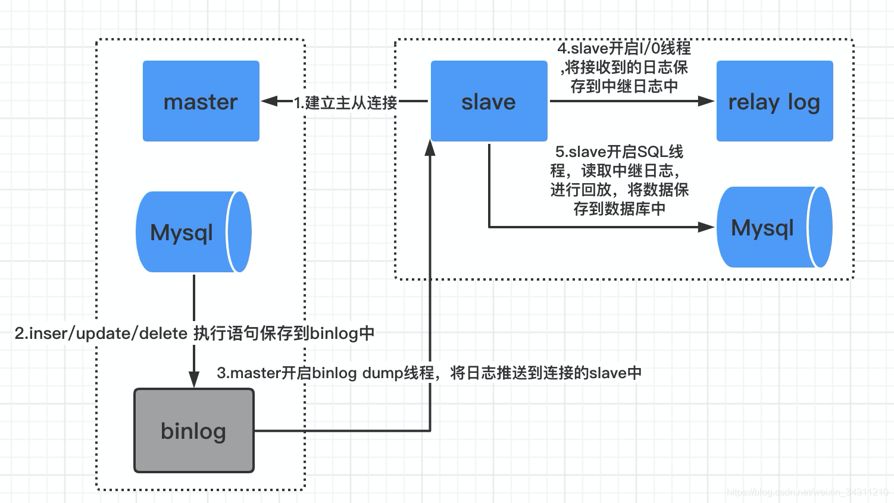

# MySQL相关笔记

<!-- GFM-TOC -->

* [MySQL相关笔记](#mysql相关笔记)
   * [1 MySQL基础知识](#1-mysql基础知识)
      * [1.1 数据库和数据库实例](#11-数据库和数据库实例)
      * [1.2 MySQL体系结构](#12-mysql体系结构)
      * [1.3 数据库四大范式](#13-数据库四大范式)
      * [1.4 MySQL基本语法](#14-mysql基本语法)
         * [1.4.1 DDL数据定义语法](#141-ddl数据定义语法)
         * [1.4.2 DML数据操纵语法](#142-dml数据操纵语法)
         * [1.4.3 DQL语法数据查询](#143-dql语法数据查询)
         * [1.4.4 DCL数据控制语法](#144-dcl数据控制语法)
   * [2 InnoDB存储引擎](#2-innodb存储引擎)
      * [2.1 InnoDB的体系架构](#21-innodb的体系架构)
      * [2.2 MySQL存储引擎](#22-mysql存储引擎)
         * [2.2.1 什么是存储引擎](#221-什么是存储引擎)
         * [2.2.2 MyISAM和InnoDB区别](#222-myisam和innodb区别)
   * [3 <del>文件</del>](#3-文件)
      * [3.1 参数文件](#31-参数文件)
      * [3.2 日志文件](#32-日志文件)
      * [3.3 套接字文件](#33-套接字文件)
      * [3.4 pid文件](#34-pid文件)
      * [3.5 表结构定义文件](#35-表结构定义文件)
      * [3.6 InnoDB存储引擎文件](#36-innodb存储引擎文件)
         * [3.6.1 表空间文件](#361-表空间文件)
         * [3.6.3 重做日志文件](#363-重做日志文件)
   * [5 索引与算法](#5-索引与算法)
      * [5.1 索引概述](#51-索引概述)
         * [5.1.1 索引是什么](#511-索引是什么)
         * [5.1.2 为什么需要索引](#512-为什么需要索引)
         * [5.1.3 MySQL支持那些索引](#513-mysql支持那些索引)
      * [5.2 二分查找和B+树](#52-二分查找和b树)
      * [5.3 B+树索引](#53-b树索引)
         * [5.3.1 聚集索引](#531-聚集索引)
         * [5.3.2 非聚集索引](#532-非聚集索引)
         * [5.3.3 举例和使用场景](#533-举例和使用场景)
      * [5.5 哈希索引](#55-哈希索引)
      * [5.6 全文索引](#56-全文索引)
      * [5.7 索引优化](#57-索引优化)
         * [5.7.1 覆盖索引减少回表操作](#571-覆盖索引减少回表操作)
         * [5.7.2 最左匹配原则/索引匹配原则](#572-最左匹配原则索引匹配原则)
         * [5.7.3 联合索引中区分度高的字段放在前面](#573-联合索引中区分度高的字段放在前面)
      * [-----【面试题】-----](#-----面试题-----)
         * [1 为什么要用B+树作为索引？B+树和B数作为索引的区别？](#1-为什么要用b树作为索引b树和b数作为索引的区别)
            * [<strong>B+树优点</strong>](#b树优点)
            * [<strong>B+树缺点</strong>](#b树缺点)
            * [<strong>B树优点/缺点</strong>](#b树优点缺点)
            * [<strong>AVL、红黑树、二叉树的缺点</strong>](#avl红黑树二叉树的缺点)
         * [2 MyISAM和InnoDB实现B+Tree索引方式的区别](#2-myisam和innodb实现btree索引方式的区别)
         * [3 索引有哪些类型？](#3-索引有哪些类型)
         * [4 索引什么情况下会失效](#4-索引什么情况下会失效)
         * [5 主键索引 VS 辅助/二级索引？](#5-主键索引-vs-辅助二级索引)
         * [6 什么时候应该使用非聚集/聚集索引？](#6-什么时候应该使用非聚集聚集索引)
         * [7 联合索引及其底层原理？](#7-联合索引及其底层原理)
      * [-----【参考资料】-----](#-----参考资料-----)
   * [6 锁](#6-锁)
      * [6.1 锁概述](#61-锁概述)
      * [6.2 InnoDB锁类型+当前/快照读](#62-innodb锁类型当前快照读)
         * [6.2.1 锁的类型](#621-锁的类型)
         * [6.2.2 一致性非锁定读/快照读](#622-一致性非锁定读快照读)
         * [6.2.3 一致性锁定读/当前读](#623-一致性锁定读当前读)
      * [6.3 行锁的算法](#63-行锁的算法)
         * [6.3.1 InnoDB行锁的三种算法](#631-innodb行锁的三种算法)
         * [6.3.2 幻读问题](#632-幻读问题)
            * [问题描述](#问题描述)
            * [InnoDB如何解决幻读问题](#innodb如何解决幻读问题)
      * [6.4 死锁<g-emoji class="g-emoji" alias="star" fallback-src="https://github.githubassets.com/images/icons/emoji/unicode/2b50.png">⭐</g-emoji>](#64-死锁star)
         * [6.4.1 死锁定义](#641-死锁定义)
         * [6.4.2 如何解决死锁](#642-如何解决死锁)
      * [6.5 数据库的乐观锁和悲观锁是什么？怎么实现](#65-数据库的乐观锁和悲观锁是什么怎么实现)
         * [乐观锁](#乐观锁)
         * [悲观锁](#悲观锁)
      * [6.6 InnoDB加锁规则](#66-innodb加锁规则)
      * [-----【参考资料】-----](#-----参考资料------1)
   * [7 事务](#7-事务)
      * [7.1 认识事务](#71-认识事务)
         * [7.1.1 事务的ACID四大特性<g-emoji class="g-emoji" alias="star" fallback-src="https://github.githubassets.com/images/icons/emoji/unicode/2b50.png">⭐</g-emoji><g-emoji class="g-emoji" alias="star" fallback-src="https://github.githubassets.com/images/icons/emoji/unicode/2b50.png">⭐</g-emoji><g-emoji class="g-emoji" alias="star" fallback-src="https://github.githubassets.com/images/icons/emoji/unicode/2b50.png">⭐</g-emoji>](#711-事务的acid四大特性starstarstar)
            * [原子性Atomicity](#原子性atomicity)
            * [一致性Consistency](#一致性consistency)
            * [隔离性Isolation](#隔离性isolation)
            * [持久性Durability](#持久性durability)
         * [7.1.2 事务的隔离级别<g-emoji class="g-emoji" alias="star" fallback-src="https://github.githubassets.com/images/icons/emoji/unicode/2b50.png">⭐</g-emoji><g-emoji class="g-emoji" alias="star" fallback-src="https://github.githubassets.com/images/icons/emoji/unicode/2b50.png">⭐</g-emoji>](#712-事务的隔离级别starstar)
      * [7.2 事务的实现](#72-事务的实现)
         * [7.2.0 ACID实现原理](#720-acid实现原理)
         * [7.2.1 redo log重做日志](#721-redo-log重做日志)
            * [redo log两阶段提交](#redo-log两阶段提交)
            * [数据恢复流程](#数据恢复流程)
            * [为什么需要2TC](#为什么需要2tc)
         * [7.2.2 undo log回滚日志](#722-undo-log回滚日志)
         * [7.2.3 redolog和binlog的对比](#723-redolog和binlog的对比)
      * [7.3 事务并发带来的问题](#73-事务并发带来的问题)
         * [7.3.1 脏读](#731-脏读)
         * [7.3.2 不可重复读](#732-不可重复读)
         * [7.3.3 幻读](#733-幻读)
         * [7.3.4 丢失更新](#734-丢失更新)
      * [7.4 事务隔级别和锁的关系](#74-事务隔级别和锁的关系)
   * [8 MVCC多版本并发控制](#8-mvcc多版本并发控制)
      * [8.1 作用](#81-作用)
      * [8.2 原理](#82-原理)
      * [8.3 举例](#83-举例)
   * [9 主从复制](#9-主从复制)
      * [9.1 主从复制的好处](#91-主从复制的好处)
      * [9.2 基本原理](#92-基本原理)
      * [9.3 主从复制的方式](#93-主从复制的方式)
      * [9.4 复制拓扑](#94-复制拓扑)
   * [10 读写分离](#10-读写分离)
      * [10.1读写分离的好处](#101读写分离的好处)
      * [10.2 读写分离的实现](#102-读写分离的实现)
      * [10.3 读写分离面临的问题](#103-读写分离面临的问题)
   * [11. 分库分表](#11-分库分表)
      * [11.1 分表](#111-分表)
      * [11.2 分库](#112-分库)
      * [11.3 分库分表面临的问题？](#113-分库分表面临的问题)
      * [11.4 分库分表中间件](#114-分库分表中间件)
   * [12 MySQL性能调优](#12-mysql性能调优)
      * [12.0 慢SQL怎么排查](#120-慢sql怎么排查)
      * [12.1 SQL执行慢的原因](#121-sql执行慢的原因)
      * [12.2 影响数据库的并发量因素](#122-影响数据库的并发量因素)
      * [12.3 mysql 是否命中索引](#123-mysql-是否命中索引)
      * [12.4 如何进行查询优化](#124-如何进行查询优化)
         * [12.4.1 使用 Explain 进行分析](#1241-使用-explain-进行分析)
         * [12.4.2 优化数据访问](#1242-优化数据访问)
         * [12.4.3 重构查询方式](#1243-重构查询方式)
      * [12.7 如何尽量避免联表/join操作？](#127-如何尽量避免联表join操作)
      * [12.8 SQL优化小技巧](#128-sql优化小技巧)
         * [12.8.1 避免索引失效](#1281-避免索引失效)
         * [12.8.2 减少IO 减少网络传输](#1282-减少io-减少网络传输)
         * [12.8.3 减少数据库操作](#1283-减少数据库操作)
         * [12.8.4 表/索引设计优化](#1284-表索引设计优化)
   * [13 相关面试题](#13-相关面试题)
      * [13.5 模糊查询如何实现？](#135-模糊查询如何实现)
      * [13.6 一条SQL语句在数据中的执行过程？](#136-一条sql语句在数据中的执行过程)
         * [查询语句的执行流程](#查询语句的执行流程)
         * [更新语句的执行流程](#更新语句的执行流程)
      * [13.7 join/left join/right join的区别是什么？](#137-joinleft-joinright-join的区别是什么)
      * [13.13 简述一致性哈希算法的实现方式及原理？](#1313-简述一致性哈希算法的实现方式及原理)
      * [13.4 自增id用完](#134-自增id用完)

<!-- Created by https://github.com/ekalinin/github-markdown-toc -->

## 1 MySQL基础知识

### 1.1 数据库和数据库实例

- **数据库**：是一种操作系统文件或者其他形式的二进制文件的集合。
- **实例**：数据库实例时一种程序，是位于用户和操作系统之间的数据管理软件，所有对数据库数据的操作都是在数据库实例下进行的（借助数据库实例来对数据库文件进行CRUD等）！

一般来说，数据库和实例时一对一的关系，在集群情况下也可能存在数据库和实例一对多的关系！

### 1.2 MySQL体系结构


依次分为：**连接器、服务层、存储引擎层、文件系统**。

> 存储引擎是基于表的，而不是基于数据库的。

### 1.3 数据库四大范式

- **第一范式**：数据库表中的字段都是单一属性的，不可再分即每一列满足原子性。

- **第二范式**：在第一范式的基础上，非主键列**完全依赖**于主键列，而**不能是依赖于主键的一部分**

  >  比如要设计一个订单信息表，因为订单中可能会有多种商品，所以要将订单编号和商品编号作为数据库表的联合主键，如下表所示：
  >
  > 上图中`商品名称`只依赖于`商品编号`，不符合第二范式（可以再单出拆分一个商品表包含`商品编号、商品名称、单价等`）。

- **第三范式**：在第二范式基础上，非主键列只能依赖于主键列，不能依赖于其他非主键，**即确保每个列和主键直接相关，而不是间接相关。**

  > 如下图中的订单表：
  >
  > 
  >
  > 客户名称依赖于客户编号，即非主键之间存在依赖关系，不符合第三范式。

- **第四范式**：在第三范式的基础上，消除多值依赖（即如果存在复合关键字，则关键字之间不能存在依赖）？看不懂！！！（主键列之间不存在依赖关系）

### 1.4 MySQL基本语法

SQL语句主要分为四大类：

- DDL：数据定义语言（Data Definition Language），创建/定义数据库和表（Create/Alter）。
- DML：数据操纵语言（Data Manipulation Language），主要是对数据进行插入/删除/更新（Insert/Delete/Update）。
- DQL：数据查询语言（Data Query Language），主要是对数据进行查询（Select）。
- DCL：数据控制语言（Data Control Language），主要是账号/数据库/表授权（Grant）、事务（Commit/Rollback）相关操作。

#### 1.4.1 DDL数据定义语法


#### 1.4.2 DML数据操纵语法


> <font color="red">一般在线上环境不直接删除数据，一般是加一个字段做删除标记（软删除？）！</font>

#### 1.4.3 DQL语法数据查询


>- 使用group by子句时，**除了聚合语句外**，select中要查询的每一个列都必须出现在group by后面，比如
>
>```sql
># 不合法语句
>select gender, count(*), name from user where id > 10 group by gender
># 合法语句
>select gender, count(*) from user where id > 10 group by gender
>```
>
>- 当group by 后有2个字段时，当成一个整体的字段进行分组；

#### 1.4.4 DCL数据控制语法

```sql
GRANT
    priv_type [(column_list)]
      [, priv_type [(column_list)]] ...
    ON [object_type] priv_level
    TO user [auth_option] [, user [auth_option]] ...
    [REQUIRE {NONE | tls_option [[AND] tls_option] ...}]
    [WITH {GRANT OPTION | resource_option} ...]
```

个人比较常用的是给一个新用户授权制定的数据库。可以使用以下语句：

```sql
 GRANT ALL PRIVILEGES ON database_name.* TO 'user_name'@'%' IDENTIFIED BY 'user_password' WITH GRANT OPTION;   
 FLUSH PRIVILEGES;
```

事务相关操作主要使用：

```sql
begin;
// ... 一系列增删改查SQL操作
// roolback;  // 回滚之前的操作
// ... 一系列增删改查SQL操作
commit;
```

## 2 InnoDB存储引擎

### 2.1 InnoDB的体系架构

体系架构如下所示：


主要分为后台线程和内存池（内部包含多个内存块）。

- **后台线程**：主要负责刷新内存池中的数据，保证和磁盘中的数据的一致性（读写），同时保证数据库发生异常时可以恢复到正常运行的状态。主要包含四类线程：
  - **Master Thred**：核心后台线程，主要负责将缓存池中的数据异步刷新到磁盘，保证数据一致性。
  - **IO Thread**：包含多个write/read和一个log/insert_thread来负责对数据库的IO请求，提升数据库读写性能。
  - **Purge Thread**：事务被提交后，负责回收undolog（为了完成事务回滚做的一种备份日志）。
  - **Page Cleaner Thread**：脏页（缓存中和磁盘中内容不一致的页）刷新，减轻Master Thread负担。
- **内存池**：协调CPU与磁盘速度的不匹配，主要负责以下工作：
  - 维护所有进程/线程需要的内部数据结构
  - 缓存磁盘数据（**LRU缓存算法**）、方便快速读取，同时缓存对磁盘文件的数据修改
  - 重做日志缓存等

### 2.2 MySQL存储引擎

#### 2.2.1 什么是存储引擎

> MySQL中的数据用各种不同的技术存储在文件(或者内存)中。这些技术中的每一种技术都使用不同的存储机制、索引技巧、锁定水平并且最终提供广泛的不同的功能和能力。通过选择不同的技术，你能够获得额外的速度或者功能，从而改善你的应用的整体功能。 
>
> 存储引擎说白了就是如何存储数据、如何为存储的数据建立索引和如何更新、查询数据等技术的实现方法。

太多了，看面试题挑几个主要的看看！InnoDB、MyISAM、Memory？


- **InnoDB**：默认的存储引擎，支持事务、MVCC、外键、、行锁表锁、按照主键顺序存放数据（聚集索引）；性能强大。
- **MyISAM**：不支持事务、行锁（只有表锁），索引和数据分开存储（非聚集索引）；查询比较快（适合用在读写分离的从机上）。
- **Memory**：将数据存储在内存中，适合保存临时表，速度快，默认使用哈希索引；只支持表锁，并发性能差。
- **Archive**：只支持Insert、Select操作，适合存储归档数据（压缩存储）。

#### 2.2.2 MyISAM和InnoDB区别

MyISAM是MySQL的默认数据库引擎（5.5版之前）。虽然性能极佳，而且提供了大量的特性，包括全文索引、压缩、空间函数等，但MyISAM不支持事务和行级锁，而且最大的缺陷就是崩溃后无法安全恢复。不过，5.5版本之后，MySQL引入了InnoDB（事务性数据库引擎），MySQL 5.5版本后默认的存储引擎为InnoDB。

大多数时候我们使用的都是 InnoDB 存储引擎，但是在某些情况下使用 MyISAM 也是合适的比如**读密集**的情况下。（如果你不介意 MyISAM 崩溃恢复问题的话）。

**两者的对比：**

1. **是否支持行级锁** : MyISAM 只有表级锁(table-level locking)，而InnoDB 支持行级锁(row-level locking)和表级锁,默认为行级锁。
2. **是否支持事务和崩溃后的安全恢复： MyISAM** 强调的是性能，每次查询具有原子性,其执行速度比InnoDB类型更快，但是不提供事务支持。但是**InnoDB** 提供事务支持，外部键等高级数据库功能。 具有事务(commit)、回滚(rollback)和崩溃修复能力(crash recovery capabilities)的事务安全(transaction-safe (ACID compliant))型表。
3. **是否支持外键：** MyISAM不支持，而InnoDB支持。
4. **是否支持MVCC** ：仅 InnoDB 支持。应对高并发事务, MVCC比单纯的加锁更高效;MVCC只在 `READ COMMITTED` 和 `REPEATABLE READ` 两个隔离级别下工作;MVCC可以使用 乐观(optimistic)锁 和 悲观(pessimistic)锁来实现;各数据库中MVCC实现并不统一。推荐阅读：[MySQL-InnoDB-MVCC多版本并发控制](https://segmentfault.com/a/1190000012650596)
5. **索引实现**：InnoDB的主键索引一般采用聚集索引的形式（叶子节点存储完整的行数据），MyISAM无论是主键索引还是辅助索引都在用非聚集索引（叶子节点只存储数据地址）。

## 3 ~~文件~~

本章对MySQL数据库和InnoDB存储引擎的各种类型的文件进行介绍。

### 3.1 参数文件

MySQL数据库实例启动时会首先读取配置文件（可以通过`mysql --help| grep my.cnf`来查询配置文件的位置），里面包含了数据库支持的各种配置参数。

### 3.2 日志文件

主要包含以下几类日志文件：

- 错误日志（error log）：记录MySQL运行期间产生的错误信息，通过`show variables like "log_error";`命令可查看错误日志文件的存储位置。

- 二进制日志（binlog）：记录对数据库的所有修改操作（不记录`select`和`show`操作），方便对数据库进行 **恢复**、**复制**、**审计**。

  > 注意把binlog和undo log已经redo log进行区分！
  >
  > binlog是数据库产生的（任何存储引擎对数据库的修改都会产生二进制日志），binlog记录的是SQL语句；而后两个是存储引擎产生的，记录的是行/页的修改！

- 慢查询日志（slow query log）：记录执行时间较长的SQL语句的日志，以便对数据库进行SQL语句层面的优化。

- 查询日志（log）：记录对MySQL数据库请求的信息，无论该请求是否得到了正确的执行。

### 3.3 套接字文件

​	Unix系统中本地连接MYSQL可使用unix域套接字的方式，这种方式需要一个套接字文件。

### 3.4 pid文件

MySQL启动后会将自己的进程ID写入到pid文件中。

### 3.5 表结构定义文件

MySQL数据的存储是**根据表来进行**的，每个表/视图无论使用何种存储引擎都会有一个`.frm`结尾的文件来记录表/视图结构定义！

### 3.6 InnoDB存储引擎文件

前面几类文件都是数据库本身的文件、和存储引擎无关。除了这些文件之外，每个表的存储引擎还有其独有的文件！InnoDB存储引擎主要有**重做日志文件**和**表空间文件**两种。

#### 3.6.1 表空间文件

用于存储存储引擎为InnoDB的表相关的各种数据。

如果启用了`innodb_file_per_table`参数，则将每个表的*数据、索引和插入缓存BITMAP* 等信息存入对应的独立表空间文件中（一种`.idb`文件），其它的如 *回滚信息、插入缓存信息、事务信息* 等依旧存储在共享表空间中！


#### 3.6.3 重做日志文件

用于记录InnoDb存储于引擎的事务日志？没怎么看懂！

## 5 索引与算法

### 5.1 索引概述

#### 5.1.1 索引是什么

索引时为了加速对表数据行的检索和创建的一种分散存储的数据结构。

在MySQL中，索引是在存储**引擎层实现**的，而不是在服务层实现的，所以不同存储引擎具有不同的索引类型和实现。

<font color="red">索引太少影响查询速度，索引太多则可能加重系统负担（如果频繁插入/修改数据，则需要频繁更新索引），同时索引文件也会占用大量存储空间。</font>

#### 5.1.2 为什么需要索引

- 索引可以极大地减少存储引擎需要扫描的数据量（减少全表扫描）
- <font color="blue">索引可以把随机IO变成顺序IO</font>
- 索引可以帮助我们在进行分组、排序等操作时避免使用临时表

**索引的核心就是减少查找IO的次数！**使用索引后可以**不用扫描全表**来定位某行的数据，而是先通过索引表找到该行数据对应的物理地址然后访问相应的数据。

#### 5.1.3 MySQL支持那些索引

InnoDB支持以下索引：

- **B+树索引**：用于快速查找数据所在的页，数据库通过把页读入内存，再内存中继续查找（二分查找）最终定位到目标数据。

- **哈希索引**：InnoDB存储引擎根据表的使用情况自动生成哈希索引，无法人工干预。适合单条记录的查询、不适合范围查询。
- ~~**全文索引**~~：通过建立`倒排索引`,可以极大的提升检索效率,解决判断字段是否包含的问题（如在文章中查找一个词）。

### 5.2 二分查找和B+树

[平衡二叉树、B树、B+树、B*树 理解其中一种你就都明白了](https://zhuanlan.zhihu.com/p/27700617)

### 5.3 B+树索引

B+树索引是B树的一种改进，它：

- 将**数据都存储到叶子节点**处，非叶子节点只记录key信息，减少查询IO次数（单次Page载入可以读取更多索引节点信息）；
- 同时叶子节点之间使用**双向链表**进行连接，适合范围查询。


根据B+树索引在物理存储层次的实现方式的不同，可以将其分为 **聚集索引** 和 **非聚集索引**，两者最大的区别在于 ***B+树的叶子节点是否包含完整的行数据信息！***（聚集索引叶子节点存储完整的行数据信息，非聚集索引叶子节点只存储行数据中的部分字段信息或地址）。

#### 5.3.1 聚集索引

聚集索引是根据表的主键构造的一颗B+树，<font color="red">每张表只有一个聚集索引</font>。聚集索引的叶子节点是一个数据页，里面存放了**完整的行记录**数据（即每一行的所有字段信息），叶子节点/页之间通过双向链表进行连接且按照主键排序，页和页之间**逻辑上是连续的、但是物理上可以不连续**！

> **主键索引不等于聚集索引！**
>
> **在InnoDB中**：
>
> - 如果定义了主键，主键就是聚集索引；
>
> - 如果没有定义主键，第一个非空(not null)且唯一(unique)列是聚集索引；
>
> - 如果没有符合条件的列，会自动创建一个隐藏的row-id作为聚集索引；
>
> 数据如果没有创建主键，则会自动生成一个row-id会作为主键。所以上述第一/三种情况下主键索引和聚集索引相同。
>
> **在MyISAM中**：
>
> - 主键索引是非聚集索引（数据和索引文件是分开存储的）
> - 辅助索引也是非聚集索引

#### 5.3.2 非聚集索引

非聚集索引和聚集索引类似，只是<font color="red">一张表可以有多个非聚集索引</font>（不同的字段都可以设置非聚集索引），它的叶子节点不存储完整的行数据（InnoDB中存储列值+主键；MyISAM中存储行数据的物理地址）。

当**InnoDB**通过非聚集索引来查找数据时：

- 首先通过key值找到非聚集索引对应的B+树的叶子节点
- 然后通过叶子节点记录的书签（主键值）到聚集索引对应的B+树中进行进一步查找<font color="red">【回表】</font>

#### 5.3.3 举例和使用场景


> **InnoDB的主索引（主键索引）属于聚集索引，辅助索引（非主键索引）属于非聚集索引。**
>
> **MyISAM的主索引和辅助索引都属于非聚集索引，因为它的叶子节点都是存储指向数据的地址。**


### 5.5 哈希索引

哈希索引底层的数据结构就是哈希表（将key映射从数字后利用哈希函数计算下标值），所以多个数据在存储关系上是完全没有任何顺序关系的：

- 无法用于排序与分组；
- 只支持精确查找，无法用于部分查找和范围查找。

在绝大多数需求为单条记录查询的时候，可以选择哈希索引，查询性能最快；其余大部分场景，建议选择B+Tree索引。

> InnoDB 存储引擎可以**自适应创建哈希索引**，当某个索引值被使用的非常频繁时，会在 B+Tree 索引之上再创建一个哈希索引，这样就让 B+Tree 索引具有哈希索引的一些优点，比如快速的哈希查找。该过程无法人工干预！

### 5.6 全文索引

MySQL5.6 以前只有 MyISAM 表支持，但是在 MySQL5.6之后， InnoDB 开始支持全文索引。 为了提高像`‘%like%’`这样的模糊查询查询的效率，但是针对较大的数据，生成全文索引耗时间耗空间。但它只支持空格分词，因此不支持中文。

全文索引底层采用倒排索引技术，采用一个辅助表来完成：

```text
Number     Text(单词)    Document(文章id:位置1,位置2)
  1        test         (4:8)、(7:9)
  2        my           (1:5,8,9)、(4:7)
```

### 5.7 索引优化

#### 5.7.1 覆盖索引减少回表操作

如果一个索引包含（或者说覆盖）所有需要查询的字段的值，我们就称之为“覆盖索引”。

通过创建覆盖索引，可以减少查询时的回表操作！如现在我创建了索引(username,age)，我们执行下面的 sql 语句

```
select username , age from user where username = 'Java' and age = 22
```

在查询数据的时候：要查询出的列在叶子节点都存在！所以，<font color="red">**就不用回表**</font>。

#### 5.7.2 最左匹配原则/索引匹配原则

创建联合索引时注意最左匹配原则，联合索引是指对表中的多列进行索引。如User表的name和city加联合索引就是(name,city)，而最左前缀原则指的是，**如果查询的时候查询条件精确匹配索引的左边连续一列或几列，则可命中索引，范围查询之后的索引无法命中**。如下：

        

> - <font color="red">字段出现顺序不同不影响索引使用</font>：这里需要注意的是，查询的时候如果两个条件都用上了，但是顺序不同，如 `city= xx and name ＝xx`，那么现在的查询引擎会自动优化为匹配联合索引的顺序，这样是能够命中索引的。
>
> - <font color="red">某个字段使用范围查询</font>，范围查询的后续字段不会走索引：eg: `where a > 1 and b = 1`，则a走索引，b不走索引
>
>   
>
> - <font color="red">order by后的字段如果出现在where中则会使用索引，否则不使用索引。</font>
>
> - or会使用索引（必须所有的or条件都是独立索引）

由于最左前缀原则，在创建联合索引时，索引字段的顺序需要考虑字段值去重之后的个数，**较多的放前面**。ORDER BY子句也遵循此规则。

#### 5.7.3 联合索引中区分度高的字段放在前面


### -----【面试题】-----

#### 1 为什么要用B+树作为索引？B+树和B数作为索引的区别？

> 首先需要了解局部性原理和磁盘预读原理：
>
> - 局部性原理：一个数据被用到时，它附近的数据也可能马上被用到。具有局部性的程序可以已大大提高IO效率（磁盘寻道时间短）。
> - 磁盘预读原理：页是计算机管理存储器的逻辑块，磁盘预读一般是连续载入多个连续的页。

##### **B+树优点**

- **可以减少磁盘IO次数**：非叶子节点只存索引值，叶子节点存储数据（和物理页对应，内存与磁盘以页为单位交换数据），适合文件系统，一次IO即可载入更多的索引key信息，可以减少磁盘IO次数。

  > 按B树和B+树来说, B+树的**索引页中**全部是都是索引,这样**一个数据页中能查询到很多索引降低了下一次去磁盘再拿索引页的可能性**, 这样就降低了磁盘的IO了。

- **适合范围查询**：`logN`时间复杂度定位到页，利用页之间的双向链表可以直接找到指定范围的数据。*B树进行范围查询必须进行中序遍历。*范围查询在数据库中是高频操作！

- **查询效率稳定**：对所有关键词的查询次数（B+树的高度）都是相同的。

##### **B+树缺点**

- B+树最大的性能问题是会**产生大量的随机IO**，随着新数据的插入，叶子节点会慢慢分裂，逻辑上连续的叶子节点在物理上往往不连续，甚至分离的很远，但做范围查询时，会产生大量读随机IO。对于大量的随机写也一样，举一个插入key跨度很大的例子，如7->1000->3->2000 ... 新插入的数据存储在磁盘上相隔很远，会产生大量的随机写IO
- 相对于B树，如果热点数据距离根节点比较近，则B树效率更高

##### **B树优点/缺点**

- 离根近的数据查询速度快，可以把热点数据放在这里；在**特定数据重复多次查询**的场景中更加高效。
- 查询效率不稳定，非叶子节点数据查询快，叶子节点慢
- IO次数相对较多
- 不适合范围查询（需要对树进行中序遍历）

##### **AVL、红黑树、二叉树的缺点**

- AVL/红黑树是一种二叉搜索树，深度相对较大，磁盘IO次数多（适合采用矮胖的结构）。
- 不适合范围查找
- 二叉树每个节点只存储一个键值和数据的，如果是B+树，可以存储更多的节点数据，适合磁盘读写，降低IO次数

AVL 树和红黑树基本都是存储在内存中才会使用的数据结构。<span style = "color:red">**在大规模数据存储的时候，红黑树往往出现由于树深度过大而造成磁盘IO读写过于频繁，进而导致效率低下的情况。**</span>为什么会出现这样的情况，我们知道要获取盘上数据，必须先通过磁盘移动臂移动到数据所在的**柱面**，然后找到指定**盘面**，接着旋转盘面找到数据所在的**道**，最后对数据进行读写。磁盘IO代价主要花费在查找所需的柱面上，树的深度过大会造成磁盘IO频繁读写。<span style = "color:red">**根据磁盘查找存取的次数往往由树的高度所决定**</span>

> tips：红黑树这种二叉搜索树结构，h明显要深的多。由于逻辑上很近的节点(父子)物理上可能很远，无法利用局部性原理。所以把数据结构设计的更为‘矮胖’一点就可以减少访问的层数。

#### 2 MyISAM和InnoDB实现B+Tree索引方式的区别

- MyISAM：主键索引和辅助索引均采用*非聚集索引的方式*，B+树的叶子节点只存储数据的地址不存储数据。数据文件和索引文件分离。
- InnoDB：主键索引采用 *聚集索引* 的方式，B+树的叶子节点存储完整的行数据，其数据文件本身就是索引文件；辅助索引都引用主键作为data域（叶子节点存储主键值），使用辅助索引进行查找时需要进行【回表】操作。

#### 3 索引有哪些类型？

- **普通索引**：最基本的索引，没有任何限制，纯粹是为了查询的速度更快

  ```sql
  ALTER TABLE table_name ADD INDEX index_name(column); --创建普通索引
  ```

- **唯一索引**： 数据列不允许重复，允许为NULL值，一个表允许多个列创建唯一索引

  ```sql
  ALTER tABLE table_name ADD UNIQUE(column) --唯一索引
  ```

- **主键索引**： 数据列不允许重复，不允许为NULL值，一个表只能有一个主键

  ```sql
  ALTER TABLE table_name ADD PRIMARY KEY(column)
  ```

- **复合索引**：也称为组合索引， 在多个字段上联合建立一个索引； 注意最左前缀原则。

  ```sql
  ALTER TABLE table_name ADD INDEX index_name(column1, column2); --组合索引
  ```

- **全文索引**： MySQL5.6 以前只有 MyISAM 表支持，但是在 MySQL5.6之后， InnoDB 开始支持全文索引。 为了提高像‘%like%’这样的模糊查询查询的效率，但是针对较大的数据，生成全文索引耗时间耗空间。但它只支持空格分词，因此不支持中文

  ```SQL 
  ALTER TABLE table_name ADD FULLTEXT(column); --全文索引
  ```

- **覆盖索引**： 如果一个索引包含（或者说覆盖）所有需要查询的字段的值，我们就称之为“覆盖索引”。我们知道在InnoDB存储引擎中，如果不是主键索引，叶子节点存储的是主键+列值。最终还是要“**回表**”，也就是要通过主键再查找一次。这样就会比较慢，覆盖索引就是把要查询出的列和索引是对应的，不做回表操作。

#### 4 索引什么情况下会失效

- 在查询条件中对索引字段进行了运算（如`where c + 1 > 0`，`where pow(c) > 4`等）,注意自动类型转换也会导致索引失效
- 不符合最左匹配原则
- 数据库判断全表扫描会比使用索引更快时（待补充具体场景？）

- like 以%开头，索引无效；当like前缀没有%，后缀有%时，索引有效。

> 可以使用explain命令加在要分析的sql语句前面，在执行结果中查看key这一列的值，如果为NULL，说明没有使用索引。

#### 5 主键索引 VS 辅助/二级索引？

- 一张表只能有一个主键索引，可以有多个辅助索引
- InnoDB中主键索引是聚集索引，辅助索引为非聚集索引；主键索引叶子节点存储完整的行数据，辅助索引叶子节点只存储索引字段值和主键值、查询数据时可能需要进行回表操作。

#### 6 什么时候应该使用非聚集/聚集索引？

> 聚集索引和非聚集索引的本质区别在于表内的**行记录数据的排列顺序（逻辑存储顺序）是否和索引顺序一致！**
>
> 聚集索引是一致的，所以查找速度快！但是插入速度慢，因为可能需要重新排列页。

具体使用场景见下表：

| 动作描述                 | 使用聚集索引 | 使用非聚集索引 |
| ------------------------ | ------------ | -------------- |
| 1.列经常被分组排序       | 应           | 应             |
| **2.返回某范围内的数据** | 应           | 不应           |
| 3.一个或极少不同值       | 不应         | 不应           |
| 4.小数目的不同值         | 应           | 不应           |
| **5.大数目的不同值**     | 不应         | 应             |
| **6.频繁更新的列**       | 不应         | 应             |
| 7.外键列                 | 应           | 应             |
| 8.主键列                 | 应           | 应             |
| **9.频繁修改索引列**     | 不应         | 应             |

#### 7 联合索引及其底层原理？

联合索引本质上也只建立一颗B+树，只是树上节点的键数量大于1，按照键出现的顺序依次对数据进行排序。


### -----【参考资料】-----

- [平衡二叉树、B树、B+树、B*树 理解其中一种你就都明白了](https://zhuanlan.zhihu.com/p/27700617)
- [别再一知半解啦，索引其实就这么回事！](https://blog.csdn.net/csdnnews/article/details/106880312)
- [Mysql索引查询失效的情况](https://www.cnblogs.com/wdss/p/11186411.html)
- [【数据库SQL】——聚集索引和非聚集索引根本区别以及使用方式](https://blog.csdn.net/jiadajing267/article/details/54581262?utm_medium=distribute.pc_relevant.none-task-blog-BlogCommendFromMachineLearnPai2-2.control&depth_1-utm_source=distribute.pc_relevant.none-task-blog-BlogCommendFromMachineLearnPai2-2.control)
- [什么情况下使用聚集索引或非聚集索引](https://blog.csdn.net/songling418/article/details/31748927?utm_medium=distribute.pc_relevant.none-task-blog-baidujs_title-3&spm=1001.2101.3001.4242)

## 6 锁

### 6.1 锁概述

锁是数据库区别于文件系统的一个重要特性，为数据库对共享资源进行并发访问提供数据完整性和一致性。

- InnoDB实现行级别的锁，也支持表级别的锁，**默认使用行锁**。
- MyISAM实现表级别的锁。

<font color="red">在MySQL中引入锁是为了对支持对共享资源进行并发访问，提供数据的完整性和一致性。</font>

### 6.2 InnoDB锁类型+当前/快照读

#### 6.2.1 锁的类型

**行级锁**

共享锁（S锁）：允许事务读取一行数据，多个事务可以同时获取该锁（*InnoDB默认使用**一致性非锁定读**，除非显示加锁或者将事务隔离级别为SERIALIABLE是才使用S锁*）

排他锁（X锁）：允许事务删除或更新一行数据，只能被一个事务获取且该行的S锁应处于释放状态

```bash
SELECT ... FOR UPDATE;			# 加X行锁
SELECT ... LOCK IN SHARE MODE;	# 加S行锁
```

**表级锁**

意向共享锁（IS锁）：事务想要获取一张表的某几行数据的共享锁。

意象向排他锁（IX锁）：事务想要获取一张表的某几行数据的排它锁。

表级X/S锁：锁住整个表。

```bash
LOCK TABLE my_tabl_name READ; # 用读锁锁表，会阻塞其他事务修改表数据
LOCK TABLE my_table_name WRITE; # 用写锁锁表，会阻塞其他事务读和写
```

表锁的触发条件：

- 如果没有索引，更新数据时会锁住整张表。

- 事务隔离级别为：串行化时，读写数据都会锁住整张表。（一次只能一个连接操作表）

<font color="blue">事务给行加X/S锁之前，需要先给行所在的表加对应的意向锁。意向锁是是一种**快速判断表锁与之前可能存在的行锁冲突的机制**，是InnoDB为了提高加锁的兼容性判断效率而**自动添加的粗粒度的锁**，用户无法操作。</font>

> **举例**
>
> 当Session A需要修改某一行数据：
>
> - InnoDB会先自动给**该行所在的表加IX锁（表锁）**
> - 然后再**对该行加X锁（行锁）**
>
> 当此时Session B想**向该表加X锁（表锁）**时：
>
> - 如果没有意向锁存在，则需要进行下面两步判断：
>   - 判断该表是否有表级S锁或表级X锁
>   - 判断该表的每一行是否有行级X锁或行级S锁（遍历很耗时间）
>
> - 如果有意向锁存在，则只需要：
>   - 检查下面的兼容性表发现表级X锁和IX锁冲突，直接加锁失败，无需遍历所有行，效率高！

**四种表级锁的兼容性**

<font color="red">下面的X、S、IX、IS锁均为**表级锁**！不是行锁！行锁和意向锁并不冲突</font>

|      | `X`           | `IX`            | `S`             | `IS`            |
| :--- | :------------ | :-------------- | :-------------- | --------------- |
| `X`  | Conflict 冲突 | Conflict 冲突   | Conflict 冲突   | Conflict 冲突   |
| `IX` | Conflict 冲突 | Compatible 兼容 | Conflict 冲突   | Compatible 兼容 |
| `S`  | Conflict 冲突 | Conflict 冲突   | Compatible 兼容 | Compatible 兼容 |
| `IS` | Conflict 冲突 | Compatible 兼容 | Compatible 兼容 | Compatible 兼容 |

参考 [InnoDB 的意向锁有什么作用？ - 大王叫我来巡山的回答 - 知乎](https://www.zhihu.com/question/51513268/answer/147733422)

#### 6.2.2 一致性非锁定读/快照读

一致性非锁定读是指InnoD使用更多版本控制（MVCC）的方式来读取当前执行时间数据库中行的数据（**MySQL默默认使用的方式**）。

如读取正在`UPDATE`或`DELETE`的行时（已经被加了X锁），读操作无需等待并加锁（无需等待X锁释放后加S锁），直接读取该行的快照数据（在undo记录中有，undo记录用于事务回滚）。这种方式可以极大提高数据库的并发性。

> 在不同事务隔离级别下读取的方式有所不同：
>
> - READ COMMITTED级别：读取最新一份快照数据，违反了ACID的I隔离性？？？
> - REPEATABLE READ级别【默认】：读取事务（读事务）开始时的行数据，可能不是最新commit的数据
>
> 具体参考[MySQL探秘(六):InnoDB一致性非锁定读](https://www.jianshu.com/p/f6d4d5c37d66)

#### 6.2.3 一致性锁定读/当前读

用户显示的对读操作进行加锁以保证数据逻辑的一致性。InnoDB支持以下两种方式对SELECT实现一致性锁定读：

```bash
BEGIN 							# 首先开启事务
SELECT ... FOR UPDATE			# 方式1：加X锁(意义在于可以利用嵌套语句修改查询到的数据)
SELECT ... LOCK IN SHARE MODE	# 方式2：加S锁
insert/update/delete操作都是当前读
```

### 6.3 行锁的算法

以下情况均为主动采用一致性锁定读时下的场景。

#### 6.3.1 InnoDB行锁的三种算法

InnoDB 行锁是 <span style="color:red">**通过给索引上的索引项加锁**</span> 来实现的，如果没有索引，InnoDB 将通过<span style="color:red">**隐藏的聚集索引**</span>来对记录加锁。

- **Record Lock**：对单条索引记录上的锁。(eg：锁住索引key为`X`的记录)
- **Gap Lock**：间隙锁，锁定一个索引范围，但不包含索引记录本身。（eg：锁住索引key在`(A，X)`范围内的记录）
- **Next-Key Lock**：Record Lock和Gap Lock的结合，锁定一个范围且**包含该范围内的记录本身**。（eg：锁住索引key在`(A，X]`范围内的记录）。如果索引是**唯一索引**，则自动优化降级为Record Lock（只锁单个索引对应的记录而不是一个范围，因为不可能出现重复的值）。


>  假设有id记录1, 3, 7；现在执行SQL查询`select id from test_table where id > 2 for update`，此时next-key lock将会对区间`(2,5]、(5,7],(7,+inf)`加锁，任何试图插入到这个区间的记录都会阻塞。 
>
>  Gap Lock是针对事务隔离级别为可重复读或以上级别而已的。
>
>  Next-key Lock主要是为了解决[幻读（Phantom）问题](# 6.3.2 幻读问题)。

#### 6.3.2 幻读问题

##### 问题描述

幻读问题是指在同一事务下，两次执行SQL查询语句得到的结果不一致，**第二次的SQL语句可能会返回之前不存在的行**（区别于[不可重复读](# 7.3.2 不可重复读)）。即一个事务读取到了另一个事务中的数据，违反了**隔离性**！

```bash
# Session A执行以下查询语句
SELECT * FROM t WHERE id > 99 and id < 102 FOR UPDATE;	# 此时不会查询到id为101的记录(不存在)
# Session B执行插入语句并提交
INSERT INTO t select 101	# 插入一条id为101的记录(这是被允许的)
# Session A再次执行以下查询语句
SELECT * FROM t WHERE id > 100 FOR UPDATE;	# 此时会查询到id=101的记录
```

> 幻读在REPEAT REDA及以上的事务隔离级别中不存在！

##### InnoDB如何解决幻读问题

InnoDB使用Next-Key Lock来避免幻读问题（RR级别下），利用next-key Lock将行记录和行记录之间的数据都锁住，其它事务将无法在这个范围内插入新的数据。如上述例子中对于SessionA执行查询时，将对`(99,102]`加X锁，此时其它事务无法插入`id=100/101/102`的数据！

### 6.4 死锁:star:

#### 6.4.1 死锁定义

死锁是指两个或两个以上的事务在执行过程中，因竞争锁资源而造成的一种相互等待的现象。

#### 6.4.2 如何解决死锁

**超时机制**

当两个事务相互等待时，如果某一个事务的等待时间超过某一设定的阈值，则其中一个事务回滚，另一个等待的事务可以继续进行。

> 超时检测机制中的回滚是按照FIFO的顺序进行的，如果事务操作较多、回滚成本较大，此时采用FIFO的机制则不合适，因为回滚时间可能比另一个事务所占用的时间还要长！

**等待图机制**

除了超时机制，数据库普遍采用**wait-for-graph**的方式来进行死锁检测。该机制要求数据库记录所得信息链表和事务的等待链表，如下图所示：


最终可以形成锁的等待图：


当InnoDB检测到死锁时，会选择回滚**undo量最小**的事务！

###  6.5 数据库的乐观锁和悲观锁是什么？怎么实现

#### 乐观锁

每次去拿数据的时候都认为别人不会修改，所以不会上锁，但是在提交更新的时候会判断一下在此期间别人有没有去更新这个数据。

**实现方式**：使用**版本号**或者**CAS算法**手动在SQL语句中实现；

>  具体可通过给表加一个版本号或时间戳字段实现，当读取数据时，将version字段的值一同读出，数据每更新一次，对此version值加一。当我们提交更新的时候，判断当前版本信息与第一次取出来的版本值大小，如果数据库表当前版本号与第一次取出来的version值相等，则予以更新，否则认为是过期数据，拒绝更新，让用户重新操作。
>
>  ```sql
>  update tbl set a = 1, version = #{version} + 1 where id = #{id} and version = #{version} 
>  ```

**使用场景**：多数用于数据争用不大、冲突较少的环境中，这种环境中，偶尔回滚事务的成本会低于读取数据时锁定数据的成本，因此可以获得比其他并发控制方法更高的吞吐量。  

#### 悲观锁

每次去拿数据的时候都认为别人会修改，所以每次在拿数据的时候都会上锁，这样别人想拿这个数据就会阻止，直到这个锁被释放。

**实现方式**：数据库中的**锁机制**

> 如在SQL语句后面加`FOR UPDATE/LOCK IN SHARE MODE`实现对数据加X/S锁。

**使用场景**：主要用于数据争用激烈的环境，以及发生并发冲突时使用锁保护数据的成本要低于回滚事务的成本的环境中。

### 6.6 InnoDB加锁规则

- SQL语句中使用`xxx for update/in share mode`会显式加锁（锁索引项，三种行锁算法）
- 增/删/改操作会自动加锁（锁索引项，三种行锁算法），读操作默认采用一致性非锁定读。
- 如果一条加锁语句不使用索引，会把整张表锁住

加锁场景过于复杂，可以参考 [MySQL锁机制——你想知道的都在这了！ - 知乎 (zhihu.com)](https://zhuanlan.zhihu.com/p/75673270)

### -----【参考资料】-----

- [深入理解 一致性锁定读 与 一致性非锁定读](https://blog.csdn.net/weixin_38312719/article/details/93687340)
- [MySQL探秘(六):InnoDB一致性非锁定读](https://www.jianshu.com/p/f6d4d5c37d66)
- [14.7.1 InnoDB Locking](https://dev.mysql.com/doc/refman/5.7/en/innodb-locking.html#innodb-record-locks)
- [何时使用聚集索引或非聚集索引 (一)](https://www.cnblogs.com/lanze/articles/4868262.html)

## 7 事务

### 7.1 认识事务

事务也是数据库区别于文件系统的一个重要特征！

数据库事务(简称:事务)是数据库管理系统执行过程中的一个逻辑单位，由一个有限的数据库操作序列构成。 一个数据库事务通常包含了一个序列的对数据库的读/写操作。

#### 7.1.1 事务的ACID四大特性:star::star::star:

##### 原子性Atomicity

 事务是最小的执行单位，不允许分割。事务中的所有数据库操作要么都成功、要么都不成功！

> 读操作往往容易保证原子性，因为不涉及对数据的修改！

##### 一致性Consistency

事务必须使数据库从一个一致性状态变换到另外一个一致性状态。 一致性关注数据的可见性，中间状态的数据不可见，只有最初和最终状态的数据对外可见。

> 一个事务中如果部分操作成功、部分操作失败，则会使数据库处于一个中间状态（不一致的状态）。
>
> 举例说明：张三向李四转100元，转账前和转账后的数据是正确的状态，这就叫一致性，如果出现张三转出100元，李四账号没有增加100元这就出现了数据错误，就没有达到一致性（即处于不一致的状态）。

##### 隔离性Isolation

事务的隔离性是指一个事务的执行不能被其他事务干扰，即事务在Commit前对数据库的修改内容对其他事务都不可见！隔离性可以防止多个事务并发执行时由于交叉执行而导致数据的不一致。

> 操作同一数据的事务需要串行化执行？往往利用锁来实现！

##### 持久性Durability

事务一旦提交，其结果将是永久性的，即使数据库发生系统故障（如宕机）数据也能恢复。

#### 7.1.2 事务的隔离级别:star::star:

SQL 标准定义了四个隔离级别：

- **READ-UNCOMMITTED(读取未提交)：** 最低的隔离级别，允许读取尚未提交的数据变更，**可能会导致脏读、幻读或不可重复读**。
- **READ-COMMITTED(读取已提交)：** 允许读取并发事务已经提交的数据，**可以阻止脏读，但是幻读或不可重复读仍有可能发生**。
- **REPEATABLE-READ(可重复读)：** 对同一字段的多次读取结果都是一致的，除非数据是被本身事务自己所修改，**可以阻止脏读和不可重复读，但幻读仍有可能发生**。
- **SERIALIZABLE(可串行化)：** 最高的隔离级别，完全服从ACID的隔离级别。所有的事务依次逐个执行，这样事务之间就完全不可能产生干扰，也就是说，**该级别可以防止脏读、不可重复读以及幻读**。


| 隔离级别         | 脏读 | 不可重复读 | 幻读 |
| ---------------- | ---- | ---------- | ---- |
| READ-UNCOMMITTED | √    | √          | √    |
| READ-COMMITTED   | ×    | √          | √    |
| REPEATABLE-READ  | ×    | ×          | √    |
| SERIALIZABLE     | ×    | ×          | ×    |

> 使用InnoDB存储引擎时：
>
> 默认隔离级别为REPEATABLE-READ，同时使用[Next-key Lock](# 6.3.2 幻读问题)来避免幻读！
>
> SERIALIZABLE隔离级别下，读取行数据将开启S锁（默认隔离级别下直接使用一致性非锁定读，无需S锁），且不存在并发事务！

### 7.2 事务的实现

事务的隔离性由锁来实现，原子性、一致性、持久性通过数据库的redo log（重做日志）和undo log（回滚日志）来完成。

#### 7.2.0 ACID实现原理

- **原子性**：<font color="blue">通过undo log实现</font>。当事务对数据库进行修改时，InnoDB会生成对应的 undo log；如果事务执行失败或调用了 rollback，导致事务需要回滚，便可以利用 undo log 中的信息将数据回滚到修改之前的样子。
- **持久性**：<font color="blue">通过redo log+内存缓冲区+磁盘 实现</font>。当有一条记录要更新时，InnoDB 引擎就会先把记录写到 redo log（循环写），并且变成prepared状态，等Service层记录完bin log并刷盘后，redo log变成commit状态，返回客户端。在系统空闲的时候，将redo log缓冲区数据更新到磁盘里面。<font color="green">当数据库崩溃时，可以利用redolog和binlog恢复数据。</font>
- **隔离性**：<font color="blue">通过 锁 + MVCC 实现</font>。通过加锁来实现数据写写互斥，通过MVCC来实现可重复读（同一事务每读到的数据都是一致的）。

- **一致性**：<font color="blue">数据库通过原子性、隔离性、持久性来保证一致性</font>。

#### 7.2.1 redo log重做日志

redo是数据库日志，是一种物理日志，主要是对物理页（PAGE）的修改信息的日志记录。

当一条数据需要更新时，InnoDB会先将数据更新，然后记录redo Log 在内存缓存中，然后定期将redolog的操作刷新到磁盘上的redo log文件上。

##### redo log两阶段提交


##### 数据恢复流程

redolog中的事务如果经历了二阶段提交中的prepare阶段，则会打上prepare标识，如果经历commit阶段，则会打上commit标识（此时redolog和binlog均已落盘）。

- Step1. 按顺序扫描redolog，如果redolog中的事务既有prepare标识，又有commit标识，就直接提交（复制redolog disk中的数据页到磁盘数据页）

- Step2 .如果redolog事务只有prepare标识，没有commit标识，则说明当前事务在commit阶段crash了，binlog中当前事务是否完整未可知，此时拿着redolog中当前事务的XID（redolog和binlog中事务落盘的标识），去查看binlog中是否存在此XID

  - 如果binlog中有当前事务的XID，则提交事务（复制redolog disk中的数据页到磁盘数据页）

  - 如果binlog中没有当前事务的XID，则回滚事务（使用undolog来删除redolog中的对应事务）

##### 为什么需要2TC

- 如果redo log提交后主数据库宕机，binlog未来得及记录，当主机恢复是使用redolog还原数据，但是从机无法从binlog中同步最新数据，导致主从数据不一致！
- 如果先写 binlog，然后写 redo log，假设写完了 binlog，机器异常重启了，由于没有 redo log，本机是无法恢复这一条记录的，但是 binlog 又有记录，那么和上面同样的道理，就会产生数据不一致的情况。
- 所以最终redo log采用**两阶段提交**的方式来完成，如果binlog记录完成，redo log未提交，则MySQL将
  - 判断 redo log 是否完整，如果判断是完整的，就立即提交。
  - 如果 redo log 只是预提交但不是 commit 状态，这个时候就会去判断 binlog 是否完整，如果完整就提交 redo log, 不完整就回滚事务。

#### 7.2.2 undo log回滚日志

undo是事务日志，是一种逻辑日志，记录的是对行记录（TUPLE）的变更。undo日志存放在共享表空间的段中，主要有两个作用：

- **用于事务的回滚操作**：如果用户执行的事务或语句由于某种原因失败了、或者手动执行了ROOLBACK语句进行事务回滚，就可以利用undo日志将数据回滚到以前的样子。
- **用于MVCC**（多版本并发控制）：在InnoDB中MVCC的实现时通过undo日志来完成的，当用户读取一行记录时，如果改行记录已经被其他事务锁定，则当前事务可以通过读取undo日志来实现 [一致性非锁定读](# 6.2.2 一致性非锁定读)。

> undo log的产生会伴随产生redo log，因为undo log也需要持久性保护。
>
> 崩溃发生前一刻，许多对数据库的写入还没有被持久化了页面上，这时就需要靠redo恢复到崩溃发生前的瞬间。数据库恢复完成后，数据库可能发现有一些正在运行中的事务，事务的上下文都已经丢失了，要对这些事务回滚，这时就需要undo log来恢复记录原来的值。
>
> [参考](https://www.zhihu.com/question/304967417/answer/554014306)

#### 7.2.3 redolog和binlog的对比

- **来源**：redolog是(InnoDB)存储引擎层产生的；而binlog是MySQL服务层产生的，任何存储引擎对数据库的更改都会产生binlog
- **内容**：redolog是一种物理日志，记录物理页（Page）的修改；binlog是一种逻辑日志，主要记录执行修改的SQL语句（不是简单的字符串，有固定格式的编码）
- **写入时机**：当数据发生更新时，InnoDB会先将数据更新，然后记录redoLog 在内存中（**在事务执行时记录**），然后定期将redoLog的操作刷新到磁盘上的文件上；**binlog只在事务提交时记录**，对每一个事务只记录一个日志；事物的提交顺序可能和redolog记录的顺序不一致，且一个事务可能产生多条redolog（可能修改多个页）.
- **作用**：binlog可以作为**恢复数据或主从复制**时使用；redolog可作为数据库异常之后的数据恢复。
- **写入方式**：binglog为追加写入到文件中，redolog为循环写入，满了则刷新到磁盘文件中（两阶段提交）。

> **==============binlog============**
>
> **binLog** 由Mysql的**Server层**实现，是**逻辑日志**，**记录的是sql语句的原始逻辑**（又不完全是sql语句这么简单，而是包括了执行的sql语句（增删改）反向的信息），比如"把id='B' 修改为id = ‘B2’。binlog会写入指定大小的物理文件中，是追加写入的，当前文件写满则会创建新的文件写入。
>
>  产生：**事务提交的时候**，**一次性将事务中的sql语句，按照一定的格式记录到binLog中**。用于复制和恢复，在主从复制中，从库利用主库上的binlog进行重播(执行日志中记录的修改逻辑)，实现主从同步。业务数据不一致或者错了，用binlog恢复。
>
> binlog可以是基于语句记录、也可以是基于行记录、或者混合记录。

<font color="blue">在执行修改语句/事务前，首先把旧的数据记录到undolog中用于执行失败时的回滚，然后修改数据，写入redolog缓存，事务执行成功后提交redolog，通知服务层记录binlog进行日志记录。</font>

### 7.3 事务并发带来的问题

事务一旦可以并发执行，则可能带来以下问题（因为并发可能导致违反**隔离性**）。

#### 7.3.1 脏读

脏读是指一个事务读到了脏数据（另一个事务还未提交的数据），这违反了隔离性原则。

> 脏读现象在READ UNCOMMIT隔离级别下才会发生。

#### 7.3.2 不可重复读

不可重复读是指在一个事务中两次读取到的数据不一致（因为可能有另一个事务对数据进行了修改（可能是删除、修改、插入等操作）并提交到了数据库中）。

一般来说不可重复读产生的问题是可接受的，因为其读到的是已提交的数据！

> 不可重复读在READ COMMIT隔离级别下才会发生。

#### 7.3.3 幻读

幻读问题是指在同一事务下，两次执行SQL查询语句得到的结果不一致，**第二次的SQL语句可能会返回之前不存在的行**（区别于[不可重复读](# 7.3.2 不可重复读)）。即一个事务读取到了另一个事务中的数据，违反了**隔离性**！

#### 7.3.4 丢失更新

丢失更新是指一个事务的更新操作被另一个事务的更新操作覆盖了（Why？不是有X锁 :horse:）。例如

- 事务A将行记录r1更新为v1，未提交
- 事务B将行记录r1更新为v2，未提交 
- 事务A提交
- 事务B提交

> 一般来说这种情况不会发生，因为数据库会利用排它锁（X锁）来让两个事务串行执行！
>
> 

### 7.4 事务隔级别和锁的关系

- 在 Read Uncommited 级别下，任何操作都不加锁，所以可以读到其它事务未提交的数据。
- 在 Read Commited 级别下，读操作需要加共享锁，但是在语句执行完以后释放共享锁（与X锁冲突，锁读不到未提交的数据）？？？
- 在 Repeatable Read 级别下，读操作需要加共享锁，但是**在事务提交之前不释放共享锁**，也就是必须等待事务执行完毕以后才释放共享锁？？？
- Serializable 是限制性最高的隔离级别，读加S锁（不再使用快照读），写加X锁。

## 8 MVCC多版本并发控制

### 8.1 作用

MVCC是一种提高并发的技术。最早的数据库系统，只有读读之间可以并发，读写，写读，写写都要阻塞。<font color="blue">**引入MVCC之后，只有写写之间相互阻塞**</font>，其他三种操作都可以并行，这样大幅度**提高了InnoDB的并发度**。

> MVCC只在`READ COMMITTED` 和 `REPEATABLE READ` 两个隔离级别下工作。其他两个隔离级别够和MVCC不兼容, 因为 `READ UNCOMMITTED` 总是读取最新的数据行, 而不是符合当前事务版本的数据行。而 `SERIALIZABLE` 则会对所有读取的行都加锁（S锁）。

### 8.2 原理

InnoDB的MVCC，是通过在每行记录的后面保存两个隐藏列来实现的（如果没有主键则还有ROW_ID隐藏列）。这两个隐藏列分别为：

- DB_TRX_ID：**数据的创建时间/版本号**。标记了最新更新这条行记录的事务版本号，数据库每处理一个事务，其值自动加一。
- DB_ROLL_PT：**数据的删除时间/版本号**。指向当前记录项的rollback segment的undo log记录（该记录中包含一个版本号），通过它可以找到之前版本的数据。

<font color="green">时间实际上用的全局系统版本号来作为事务版本号来标识，而不是时间戳。</font>

**INSERT操作**

InnoDB为每一条插入的数据会保存当前事务版本号作为数据的创建版本号`DB_TRX_ID`.

**DELETE操作**

InnoDB为删除的每一行保存当成系统版本号作为删除版本号。（数据首先写入undo日志中，不会真正删除数据，事务提交后才删除）

**UPDATE操作**

复制/插入一行新数据，保存当前事务版本号作为新行的创建版本号、并作为旧数据的删除版本号。

**SELECT操作**

InnoDB会根据以下两条规则来查询行数据：

- **查找数据行版本号早于或等于当前事务版本号的数据行记录**。<font color=green>也就是说，数据行的版本号要小于或等于当前是事务的系统版本号，这样也就确保了读取到的数据是**当前事务开始前已经存在的数据，或者是自身事务改变过的数据**。</font>

- **查找删除版本号要么为NULL，要么大于当前事务版本号的记录**。<font color="green">这样确保查询出来的数据行记录在事务开启之前没有被删除（如果被删除了，删除版本号将不为空或者小于当前事务版本号[被前面的事务删除了]）。</font>

> **利用MVCC可以实现可重复读**（事务中读的是当前事务开始前的历史数据，所以每次都是一致的）。

参考：[mysql mvcc多版本并发控制](https://blog.csdn.net/wangxuelei036/article/details/107163614?utm_medium=distribute.pc_relevant_download.none-task-blog-baidujs-1.nonecase&depth_1-utm_source=distribute.pc_relevant_download.none-task-blog-baidujs-1.nonecase)

### 8.3 举例

[透彻解读mysql的可重复读、幻读及实现原理](https://blog.csdn.net/sanyuesan0000/article/details/90235335)

## 9 主从复制

### 9.1 主从复制的好处

- **数据冗余备份**：随意开始或者停止复制，并在不同地理位置分布数据备份
- **负载均衡**：降低单个服务器的压力，写操作在主服务器，读操作分散到各个从服务器
- **高可用和故障切换**：帮助应用程序避免单点失败

### 9.2 基本原理

主从复制（此处为默认的异步复制方式）主要涉及到三个线程：

- **binlog dump 线程**【主】 ：负责将主服务器上的数据更改写入二进制日志（Binary log）中，并通知从库来读取新数据。
- **I/O 线程** 【从】：负责读取来自主数据库的binlog，并写入**从服务器**的中继日志（Relay log）。
- **SQL 线程** 【从】：负责读取中继日志，解析出主服务器已经执行的数据更改并在**从服务器中重放SQL语句**（Replay）。




<font color="red">从服务器通过binlog的偏移量来确定是否和主服务器完成同步。</font>

<font color="red">binlog属于MySQL服务层的日志，所以主从库可以使用不同的存储引擎。</font>

### 9.3 主从复制的方式

主从复制分为：异步复制，半同步复制和全同步复制

**异步复制：** 是MySQL**默认**的复制模式，**主库在执行完客户端提交的事务之后会立刻将结果返回给客户端，并不关心从库接收的结果**，这样就会导致当主数据库因为某些原因宕机之后从数据库可能没有同步到主数据库的数据，导致主从数据不一致，甚者如果将从数据库强制转换为主数据库，可能导致数据丢失

优点：返回客户端无延迟
缺点：主从数据不一致，数据丢失

**半同步复制：** 半同步复制解决了主从数据库不一致的问题，原理是**只有当至少一个从数据库接收到并且写入到read log 日志中之后才会返回给客户端接收结果**，这样带来的问题是至少会带来一个 TCP/IP的往返时间的延迟

优点：保证主从数据库的最终一致性
缺点：返回客户端有延时


**全同步复制：** **当所有的从库接收到主数据库的数据并且执行完了其中的事务之后才会给客户端返回**

优点：主从数据库的数据强一致性
缺点：响应延迟高

**并行复制：** 就是在半同步复制的基础上从数据库会在内部有多个SQL线程去将relay log中的数据写入到数据库中，因为5.6x版本之前一直是单线程的，因此产生主从延迟的几率会很大，现在多线程处理之后，能最大可能的减少主从延迟的几率。

### 9.4 复制拓扑


## 10 读写分离

> 读写分离需要和主从复制配合使用，主要是为了数据库读能力的水平扩展；而分库分表则是为了写能力的水平扩展。


### 10.1读写分离的好处

读写分离有以下几点<font color="red">**好处**</font>：

- **增加数据冗余**：主服务器宕机后从服务器可以继续提供服务。
- **提升处理效率**：写入比读耗费资源，写入大量数据将影响读取速度。
- **缓解机器访问压力**：可以对读操作进行分散，均衡处理。
- 从服务器可以使用 MyISAM，提升查询性能以及节约系统开销。

<font color="blue">对于一致性要求高的查询业务，可以选择强制走主库。</font>

### 10.2 读写分离的实现

一般可以使用以下两种<font color="red">**方法实现**</font>：

- **基于应用/client层程序代码实现**：代码中根据`select`、`insert`等操作进行路由分类，这也是目前使用最广泛的方式。

  

- **基于中间代理层/中间件实现**：代理一般介于应用服务器和数据库服务器之间，代理数据库服务器接收到应用服务器的请求后根据判断后转发到后端数据库。如mysql_proxy，mysql_proxy是Mysql的一个开源项目，通过其自带的lua脚本进行sql判断。


### 10.3 读写分离面临的问题

- **对sql类型进行判断。**如果是select等读请求，就走从库，如果是insert、update、delete等写请求，就走主库。

- **主从数据同步延迟问题。**因为数据是从master节点通过网络同步给多个slave节点，因此必然存在延迟。因此有可能出现我们在master节点中已经插入了数据，但是从slave节点却读取不到的问题。<font color="red">对于一些强一致性的业务场景，要求插入后必须能读取到，要求读请求强制走主库</font>。

- **事务问题。**如果一个事务中同时包含了读请求(如select)和写请求(如insert)，如果读请求走从库，写请求走主库，由于跨了多个库，那么jdbc本地事务已经无法控制，属于分布式事务的范畴。而分布式事务非常复杂且效率较低。因此对于读写分离，目前主流的做法是，<font color="red">事务中的所有sql统一都走主库，由于只涉及到一个库，jdbc本地事务就可以搞定</font>。

- **高可用问题。**主要包括：
  - **新增slave节点：**如果新增slave节点，应用应该感知到，可以将读请求转发到新的slave节点上。
  - **slave宕机或下线：**如果其中某个slave节点挂了/或者下线了，应该对其进行隔离，那么之后的读请求，应用将其转发到正常工作的slave节点上。
  - **master宕机后切换：**需要进行主从切换，将其中某个slave提升为master，应用之后将写操作转到新的master节点上。

## 11. 分库分表

[参考1](https://blog.csdn.net/qq_28289405/article/details/80576614?utm_medium=distribute.pc_relevant.none-task-blog-BlogCommendFromMachineLearnPai2-2.control&dist_request_id=1328603.48854.16151342929411287&depth_1-utm_source=distribute.pc_relevant.none-task-blog-BlogCommendFromMachineLearnPai2-2.control)

[参考2](https://blog.csdn.net/weixin_44062339/article/details/100491744?utm_medium=distribute.pc_relevant_t0.none-task-blog-BlogCommendFromMachineLearnPai2-1.control&dist_request_id=1328603.57102.16151763965540151&depth_1-utm_source=distribute.pc_relevant_t0.none-task-blog-BlogCommendFromMachineLearnPai2-1.control)

>  读写分离，主要是为了数据库读能力的水平扩展；而分库分表则是为了写能力的水平扩展。

###  11.1 分表

<font color="red">**分表**就是把一张表按一定的规则分解成N个具有独立存储空间的实体表。</font>当一张表的查询速度很慢、单表数据量巨大、高并发插入/查询时速度很慢时可以考虑分表。

**为什么要分表？**

- 单表数据量太大（如百万行），读写锁导致查询/插入效率下降（锁导致并发量变小）；
- 索引维护开销大；
- 大字段可能影响IO效率（大字段可能导致单条记录跨页）；

**怎么分表？**

- **垂直分表**：将一个表按字段拆分成多个表。

  > eg：商品表中：商品ID、名称、价格等信息访问频繁，商品描述信息可能访问频次更低（但是空间占用大）；可以将商品描述拆分到一个单独的表中。

  通常我们按以下原则进行垂直拆分:

  - 把不常用的字段单独放在一张表;

  - 把text，blob等大字段拆分出来放在附表中;

  - 经常组合查询的列放在一张表中;

- **水平分表**：水平分表是在同一个数据库内，把同一个表的数据按一定规则拆到多个表中。

  - Hash分表：对字段进行哈希计算然后取模进行分表（适合批量并行写入，不适合范围查询）
  - Range分表：对字段值范围大小进行分表（适合范围查询）

### 11.2 分库

<font color="red">**分库**就是把一个数据库按一定的规则分解成N个数据库（可能在不同机器上）。</font>

**什么场景下需要分库？**

- 单台DataBase的存储空间不够；
- 查询/写入量太大请求太多，单台数据库无法支撑这么多IO请求；

**怎么分库？**

- **垂直分库**：将一个库中的多个表分别放到不同的库中。

  > eg：把卖家库（店铺表、商品信息表、商品描述表、地理区域表）分为商品库（商品信息表、商品描述表）和店铺库（店铺表、地理区域表）。

  通常使用以下原则进行垂直分库：

  - 按照业务将表进行分类，专库专用

- **水平分库**：将同一个表的数据按一定规则拆到不同的数据库中，每个库可以放在不同的服务器上。

  > eg：商品表随着发展存储数据超过预估且访问频繁，单台数据库容量和性能都无法支撑了；此时可以把商品id分为在x-y的负载数据库1中，其它放在数据库2中。

- ~~**读写分离**~~：也能算是分库吧？

### 11.3 分库分表面临的问题？

- **SQL动态路由**：增删改查操作需要先确定目标库/表，再发送SQL到目标机器上，最终的跨表查询结果可能还需要合并。
- **分布式id**：分库分表后不能在再使用MySQL的自增id了，不同库产生的id可能重复，需要一个全局的id生成器（借助第三方ID生成器）。
- **分布式事务支持** ：分库分表后，变为了分布式事务（怎么做！？？？）。

- 跨库join，跨节点的count，order by，group by以及聚合函数的问题

- 数据迁移，容量规划，扩容等问题

### 11.4 分库分表中间件

**cobar**：阿里 b2b 团队开发和开源的，属于 proxy 层方案，就是介于应用服务器和数据库服务器之间。应用程序通过 JDBC 驱动访问 cobar 集群，cobar 根据 SQL 和分库规则对 SQL 做分解，然后分发到 MySQL 集群不同的数据库实例上执行。早些年还可以用，但是最近几年都没更新了，基本没啥人用，差不多算是被抛弃的状态吧。而且不支持读写分离、存储过程、跨库 join 和分页等操作。

**TDDL**：淘宝团队开发的，属于 client 层方案。支持基本的 crud 语法和读写分离，但不支持 join、多表查询等语法。目前使用的也不多，因为还依赖淘宝的 diamond 配置管理系统。

**atlas**：360 开源的，属于 proxy 层方案，以前是有一些公司在用的，但是确实有一个很大的问题就是社区最新的维护都在 5 年前了。所以，现在用的公司基本也很少了。

**sharding-jdbc**：当当开源的，属于 client 层方案。确实之前用的还比较多一些，因为 SQL 语法支持也比较多，没有太多限制，而且目前推出到了 2.0 版本，支持分库分表、读写分离、分布式 id 生成、柔性事务（最大努力送达型事务、TCC 事务）。而且确实之前使用的公司会比较多一些（这个在官网有登记使用的公司，可以看到从 2017 年一直到现在，是有不少公司在用的），目前社区也还一直在开发和维护，还算是比较活跃，个人认为算是一个现在也可以选择的方案。

**mycat**：基于 cobar 改造的，属于 proxy 层方案，支持的功能非常完善，**而且目前应该是非常火的而且不断流行的数据库中间件**，社区很活跃，也有一些公司开始在用了。但是确实相比于 sharding jdbc 来说，年轻一些，经历的锤炼少一些。

## 12 MySQL性能调优

### 12.0 慢SQL怎么排查

- 开启慢SQL查询日志，找到慢SQL语句

  ```mysql
  # 检查是否开启慢SQL查询日志
  mysql > SHOW VARIABLES LIKE '%query%' 
  slow_query_log # 默认是off关闭的，使用时，需要改为on 打开　　　　　　
  slow_query_log_file # 记录的是慢日志的记录文件
  long_query_time # 默认是10S，每次执行的sql达到这个时长，就会被记录
  
  mysql > SET GLOBAL slow_query_log = ON;	# 打开慢查询日志
  mysql > SET GLOBAL long_query_time = 3; # 将慢查询时间设定为3s
  ```

- [12.4.1 使用 Explain 进行分析](# 12.4.1 使用 Explain 进行分析) 慢SQL语句。

### 12.1 SQL执行慢的原因

一个 SQL 执行的很慢，我们要分两种情况讨论：

这条 SQL 语句一直执行的很慢，则有如下原因：

- **没有建立索引**，导致全表扫描，且修改数据需要锁全表。

- **没有用上索引**：如果该字段已经建立了索引；由于对字段进行运算、函数操作导致无法使用索引；不符合最左匹配原则。例如：

  ```bash
  select * from t where c - 1 = 1000;	# 左边有运算无法命中索引
  select c,d from t where c = 1000; # c上未创建索引, 所以也无法命中
  ```

- **单表数据量太大了**：单表数据量过大，将影响查询速度，可以考虑进行<font color="red">分表处理</font>。

大多数情况下很正常，偶尔很慢，则有如下原因：

- **遇到了锁**：执行的时候，遇到锁，如表锁、行锁（可能有别的事务对数据加锁了，事务还未结束）；可以考虑进行<font color="red">读写分离处理</font>。
- **~~数据库在刷新脏页~~**，例如 redo log 写满了需要同步到磁盘。

参考 [腾讯面试：一条SQL语句执行得很慢的原因有哪些？---不看后悔系列](https://mp.weixin.qq.com/s?__biz=Mzg2OTA0Njk0OA==&mid=2247485185&idx=1&sn=66ef08b4ab6af5757792223a83fc0d45&chksm=cea248caf9d5c1dc72ec8a281ec16aa3ec3e8066dbb252e27362438a26c33fbe842b0e0adf47&token=79317275&lang=zh_CN#rd)

### 12.2 影响数据库的并发量因素

- 服务器的CPU数量、性能
- 服务器的SOCKET连接数限制
- 请求是否落在一个表上或者多个表上，是查询请求还是修改请求（涉及到锁）

> 单库QPS在500左右。

### 12.3 mysql 是否命中索引

explain 关键字，加在select 前面，possible_keys会显示索引名，key会显示实际使用的索引。

### 12.4 如何进行查询优化

#### 12.4.1 使用 Explain 进行分析

Explain 用来分析 SELECT 查询语句，开发人员可以通过分析 Explain 结果来优化查询语句。


- **type字段**：ALL表示全表扫描，index表示使用索引，其它见下图：


- **possible_keys字段**：指出MySQL能使⽤哪个索引，但不⼀定被查询使⽤（该查询可以利⽤的索引，如果没有任何索引显示 null）

-  **Key字段**：key列显示MySQL实际决定使⽤的键（索引），必然包含在possible_keys中 要想强制MySQL使⽤或忽视possible_keys列中的索引，在查询中使⽤FORCE INDEX、USE INDEX或者IGNORE INDEX。


- **Extra字段**：有三种类型分别为Using where / Using index & Using where / Using index condition


#### 12.4.2 优化数据访问

**减少请求的数据量**

- 只返回必要的列：最好不要使用 SELECT * 语句。
- 只返回必要的行：使用 LIMIT 语句来限制返回的数据。
- 缓存重复查询的数据：使用缓存可以避免在数据库中进行查询，特别在要查询的数据经常被重复查询时，缓存带来的查询性能提升将会是非常明显的。

**减少服务器端扫描的行数**

最有效的方式是使用覆盖索引来覆盖查询（避免回表操作）。

#### 12.4.3 重构查询方式

**切分大查询**

一个大查询如果一次性执行的话，可能一次锁住很多数据、占满整个事务日志、耗尽系统资源、阻塞很多小的但重要的查询。

```
DELETE FROM messages WHERE create < DATE_SUB(NOW(), INTERVAL 3 MONTH);
rows_affected = 0
do {
    rows_affected = do_query(
    "DELETE FROM messages WHERE create  < DATE_SUB(NOW(), INTERVAL 3 MONTH) LIMIT 10000")
} while rows_affected > 0
```

**分解大连接查询**

将一个大连接查询分解成对每一个表进行一次单表查询，然后在应用程序中进行关联，这样做的好处有：

- 让缓存更高效。对于连接查询，如果其中一个表发生变化，那么整个查询缓存就无法使用。而分解后的多个查询，即使其中一个表发生变化，对其它表的查询缓存依然可以使用。
- 分解成多个单表查询，这些单表查询的缓存结果更可能被其它查询使用到，从而减少冗余记录的查询。
- 减少锁竞争；
- 在应用层进行连接，可以更容易对数据库进行拆分，从而更容易做到高性能和可伸缩。
- 查询本身效率也可能会有所提升。例如下面的例子中，使用 IN() 代替连接查询，可以让 MySQL 按照 ID 顺序进行查询，这可能比随机的连接要更高效。

```bash
SELECT * FROM tag
JOIN tag_post ON tag_post.tag_id=tag.id
JOIN post ON tag_post.post_id=post.id
WHERE tag.tag='mysql';
SELECT * FROM tag WHERE tag='mysql';
SELECT * FROM tag_post WHERE tag_id=1234;
SELECT * FROM post WHERE post.id IN (123,456,567,9098,8904);
```

### 12.7 如何尽量避免联表/join操作？

大表的[join操作](# 9.7 join/left join/right join的区别是什么？)十分耗费资源，可以使用以下方法来尽量避免join操作：

```text
学生表tbl_stu
id      name     gender     tutor_id

导师表tbl_tutor
id      name     tel        e-mail

查询符合要求的学生及其导师姓名
select stu.id stu.name tu.name from tbl_stu stu left join tbl_tutor tu on stu.tutor_id = tu.id where stu.id > 10;
```

- 【数据库】数据表增加冗余字段。

  > 如学生个人信息表中增加导师姓名（增加冗余字段可能不太符合数据库设计规范）。

- 【后台】将单次联表查询变成多次查询：单表查询符合条件的集合，然后使用`IN`关键字再到另一个表中进行查询。

  > 如上述联表查询可以变成以下两次查询
  >
  > select * from tbl_stu where id > 10;	// 在后端代码中存储查询结果
  >
  > select id, name from tbl_tutor where id in (1,2,3...);	// 在后端代码中再手动进行一次有效数据的拼接即可

- 【前台】前台页面如果已经有某些信息了，则自行实现缺失信息的回填，无需后台再提供一次。

  > 不知道有什么好的例子了。。。

### 12.8 SQL优化小技巧

#### 12.8.1 避免索引失效

- 禁⽌在Where条件的列名上使⽤用函数或者表达式

- SQL过滤条件里，列的数据类型要匹配

- 表关联是，关联的列选择相同的数据类型

- 尽量不要做‘%’前缀模糊查询，如like '%name'

  索引支持前缀，不支持后缀

  如果需要做后缀查询。可以考虑把列数据翻转存储，把后缀转为前缀。

  如 SELECT NAME FROM table WHERE NAME like '%无忌';

  NAME列的数据反向存储后。查询改成

  SELECT reverse( NAME) FROM table WHERE NAME like '忌无%';

- 含有空值的列很难进⾏行查询优化，⽤0、⼀一个特殊的值或者⼀一个空串代替空值。

- 避免使⽤用Or，用Union代替。如果能判断数据不会重复，还可以用 Union All。

  例子

  ```sql
  SELECT * FROM tab WHERE col1 = 'x' AND ( col2 = 'y' OR col3 = 'z');   
  
  改为
  
  SELECT * FROM tab WHERE col1 = 'x' AND  col2 = 'y'  
  
  Union  
  
  SELECT * FROM tab WHERE col1 = 'x' AND col3 = 'z'; 
  ```

  

- Join中使⽤用的关联字段使⽤用统⼀的数据类型。使用统一的字符集。

- 尽量不要在查询语句中指定强制索引force index

#### 12.8.2 减少IO 减少网络传输

- 禁⽌使⽤用`select *`，`*`⽤用所需字段代替

- 避免使⽤用delete，用update代替做软删除（需要一个删除标记字段）

- 不要使用太大偏移量的limit分⻚ (深翻页）

  深翻页例子`WHERE city = 'Beijing' ORDER BY id limit 60000,1000`;    

  改为 `WHERE city = 'Beijing' AND id > xxx ORDER BY id limit 1000`;  (xxx 为上一次翻页的边界值，因为limit会首先查出60000数据到服务层进行过滤处理）

- update/delete尽量根据主键进行行操作.

#### 12.8.3 减少数据库操作

- 尽量不要在数据库⾥做运算
- 禁止使⽤⼦查询
- update/delete只能单表操作，不允许多表关联，不允⽤子查询，且⼀定要带where条件
- insert语句要显式指定插⼊入的列名，且不允许使⽤用insert .... select的形式
- 禁⽌使⽤存储过程、存储函数、触发器和视图
- 批量insert语句最好采⽤用bulk insert的⽅方法，如insert into table(xxx)values (xxx),(xxx),每个批次以执⾏行时间⼩小于100ms为原则
- 尽量减少count()的使用，尤其是用来频繁获取全表记录数
- 使⽤用group by时，如无排序的需求，建议加order by null

#### 12.8.4 表/索引设计优化


## 13 相关面试题

### 13.5 模糊查询如何实现？

？？？不知道啊

### 13.6 一条SQL语句在数据中的执行过程？

根据SQL语句的类型（分为查询语句和更新语句）执行流程有所不同：

#### 查询语句的执行流程


查询语句主要是`SELECT`：

- **连接器**：负责跟客户端建立连接、获取权限、维持和管理连接。检查用户是否有执行权限。

- **查询缓存**：以K-V的形式存储SQL语句和查询结果。检查缓存中是否有待查询的内容，有则直接返回（<font color="gray">一般不建议使用，表更新则缓存失效，命中率很低！</font>）

- **分析器**：词法分析（eg: 看是增删改查哪种语句）、语法分析（看语句逻辑是否合，是否有语法错误）

- **优化器**：优化SQL语句，选择最优执行计划（如选择索引），交由执行器执行。

  > ```sql
  > mysql> select * from t1 join t2 using(ID)  where t1.c=10 and t2.d=20;
  > ```
  >
  > - 既可以先从表t1里面取出c=10的记录的ID值，再根据ID值关联到表t2，再判断t2里面d的值是否等于20。
  > - 也可以先从表t2里面取出d=20的记录的ID值，再根据ID值关联到t1，再判断t1里面c的值是否等于10。
  >
  > 需要由优化器来选择。

- **执行器**：调用存储引擎提供的接口进行查询数据并返回（如limit或者and条件等可能需要Service层做进一步数据过滤）

#### 更新语句的执行流程


更新语句包括`UPDATE/DELTE/INSERT`，整体流程和查询语句比较类似，但是增加了**数据写入**和**日志记录**两个操作：

- 检查是否有执行权限
- 查询待修改的数据（如果是插入则没有）
- 调用存储引擎对应接口，更新数据，InnoDB 引擎把数据保存在内存缓冲池中，同时记录 redo log，此时 redo log 进入 prepare 状态，然后告诉执行器，执行完成了，随时可以提交。
- 执行器收到执行完毕的通知记录 binlog，然后调用引擎接口，提交 redo log 为提交状态。
- 更新完成（脏数据后续会自动从内存缓冲池刷新后磁盘中）

**参考** [**一条sql语句在mysql中如何执行的.md**](https://github.com/Snailclimb/JavaGuide/blob/master/docs/database/%E4%B8%80%E6%9D%A1sql%E8%AF%AD%E5%8F%A5%E5%9C%A8mysql%E4%B8%AD%E5%A6%82%E4%BD%95%E6%89%A7%E8%A1%8C%E7%9A%84.md)

### 13.7 join/left join/right join的区别是什么？

- **left join左连接**

  以左边的表为基础，将右边的内容关联进来，最终的结果为**左表**

- **left join左连接**

  以左边的表为基础，将右边的内容关联进来，最终的结果为**右表**

- **join连接**(默认和inner join相同)

  直接将左右表进行关联，最终的结果为**两表的交集**！

**Join的原理**

```sql
select * from table_R r left join table_S s where r.r1 = s.s1;
```

- **暴力法**Simple Nested-Loop Join【未实际使用】：两层for循环，两个表的所有列两两比较判断是否符合条件。一般不会采用这种方法。

  

- **索引法**Index Nested-Loop Join：当条件字段上建立了索引时，可以利用索引进行比较（而不是取出行数据再进行比较），当在索引上找到匹配记录后再回表查询行数据。

  

- **Block Nested-Loop Join**：当条件字段上没有建立索引时，使用join buffer将驱动表的查询JOIN相关列都给缓冲到了JOIN BUFFER当中（相当于HashMap），然后批量与非驱动表进行比较，这也来实现的话，可以将多次比较合并到一次，降低了非驱动表的访问频率。也就是只需要访问一次S表。

**举例**：[【mySQL】left join、right join和join的区别](https://segmentfault.com/a/1190000017369618)

### 13.13 简述一致性哈希算法的实现方式及原理？

看Redis相关知识的最后补充部分！

### 13.4 自增id用完

1. 表的自增id达到上限后，再申请时它的值就不会改变，进而导致继续插入数据时报主键冲突的错误。
2. row_id（6byte，0~2^48-1）达到上限后，则会归0再重新递增，如果出现相同的row_id，后写的数据会覆盖之前的数据。
