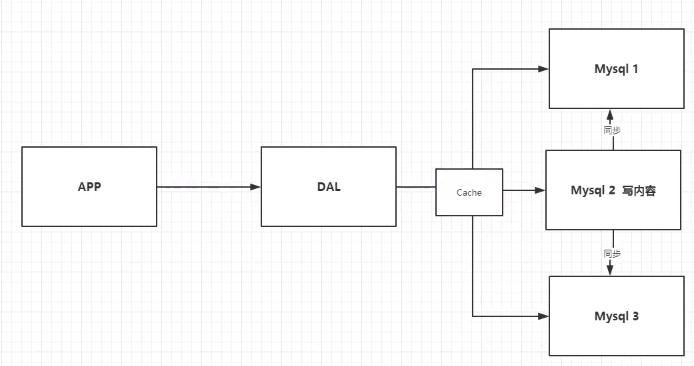

# Redis相关笔记

<!-- GFM-TOC -->

   * [1. NoSQL概述](#1-nosql概述)
      * [1.1 发展过程](#11-发展过程)
         * [1.1.1 单机MYSQL](#111-单机mysql)
         * [1.1.2 缓存 + MySQL + 读写分离](#112-缓存--mysql--读写分离)
         * [1.1.3分库分表 + 集群](#113分库分表--集群)
      * [1.2 NoSQL](#12-nosql)
         * [1.2.1 NoSQL定义](#121-nosql定义)
         * [1.2.2 为什么使用NoSQL](#122-为什么使用nosql)
         * [1.2.3 关系型数据库 VS 非关系型数据库](#123-关系型数据库-vs-非关系型数据库)
   * [2. Redis入门](#2-redis入门)
      * [2.1 概述](#21-概述)
      * [2.2 Redis安装、配置、启动](#22-redis安装配置启动)
      * [2.3 基本操作命令](#23-基本操作命令)
      * [2.4 Redis为什么快？](#24-redis为什么快)
   * [3. Redis底层数据结构【待补充】](#3-redis底层数据结构待补充)
   * [4. Redis的五种基本数据类型](#4-redis的五种基本数据类型)
      * [3.1 String/字符串](#31-string字符串)
         * [底层结构](#底层结构)
         * [常用命令](#常用命令)
      * [3.2 List/链表](#32-list链表)
         * [底层结构](#底层结构-1)
         * [操作命令](#操作命令)
      * [3.3 Hash/哈希表](#33-hash哈希表)
         * [底层结构](#底层结构-2)
         * [Rehash操作](#rehash操作)
         * [常用命令](#常用命令-1)
      * [3.4 Set/无序集合](#34-set无序集合)
      * [3.5 ZSet/有序集合](#35-zset有序集合)
         * [底层结构](#底层结构-3)
         * [常用命令](#常用命令-2)
   * [5. 事务](#5-事务)
      * [操作命令](#操作命令-1)
      * [Redis事务特性](#redis事务特性)
         * [<strong>原子性</strong>](#原子性)
         * [<strong>隔离性</strong>](#隔离性)
         * [<strong>持久性</strong>](#持久性)
         * [<strong>一致性</strong>](#一致性)
   * [6. 锁](#6-锁)
      * [悲观锁](#悲观锁)
      * [乐观锁](#乐观锁)
      * [Redis实现分布式锁](#redis实现分布式锁)
   * [7. Redis持久化](#7-redis持久化)
      * [7.1 RDB持久化](#71-rdb持久化)
         * [7.1.1 触发机制](#711-触发机制)
            * [SAVE命令触发（同步）](#save命令触发同步)
            * [BGSAVE命令触发（异步）](#bgsave命令触发异步)
            * [自动触发](#自动触发)
         * [7.1.2 优缺点](#712-优缺点)
            * [优点](#优点)
            * [缺点](#缺点)
      * [7.2 AOF持久化](#72-aof持久化)
         * [7.2.1 触发机制](#721-触发机制)
            * [实时写入](#实时写入)
            * [每秒一次写入](#每秒一次写入)
            * [系统自动写入](#系统自动写入)
         * [7.2.2 优缺点](#722-优缺点)
            * [优点](#优点-1)
            * [缺点](#缺点-1)
         * [7.2.3 AOF 文件重写](#723-aof-文件重写)
      * [7.3 总结](#73-总结)
   * [8. 内存管理/数据库管理](#8-内存管理数据库管理)
      * [过期键的删除策略](#过期键的删除策略)
      * [内存淘汰策略](#内存淘汰策略)
   * [9. 多机——Redis主从复制机制](#9-多机redis主从复制机制)
      * [主从复制的好处](#主从复制的好处)
      * [主从复制原理](#主从复制原理)
         * [旧版复制原理](#旧版复制原理)
         * [新版复制原理](#新版复制原理)
   * [10. 多机Redis——哨兵模式](#10-多机redis哨兵模式)
      * [哨兵启动和初始化](#哨兵启动和初始化)
      * [节点下线检测](#节点下线检测)
         * [检测主观下线](#检测主观下线)
         * [检测客观下线](#检测客观下线)
      * [自动切换新的主节点](#自动切换新的主节点)
         * [选举领头哨兵节点](#选举领头哨兵节点)
         * [故障转移](#故障转移)
   * [11. 多机Redis——集群模式](#11-多机redis集群模式)
      * [集群的构成](#集群的构成)
      * [集群的好处](#集群的好处)
      * [集群的工作原理](#集群的工作原理)
         * [槽指派](#槽指派)
         * [在集群中执行命令](#在集群中执行命令)
            * [如何计算key属于哪个槽？](#如何计算key属于哪个槽)
            * [客户端如何处理MOVE指令？](#客户端如何处理move指令)
         * [重新分片](#重新分片)
            * [重新分片的实现原理？](#重新分片的实现原理)
            * [重新分片带来的ASK错误？](#重新分片带来的ask错误)
         * [集群的复制与故障转移](#集群的复制与故障转移)
            * [如何检测Master节点下线？](#如何检测master节点下线)
            * [如何进行故障转移？](#如何进行故障转移)
            * [什么时候整个集群不可用？](#什么时候整个集群不可用)
   * [12. 缓存异常](#12-缓存异常)
      * [缓存穿透（访问不存在的key）](#缓存穿透访问不存在的key)
      * [缓存雪崩（缓存大面积失效）](#缓存雪崩缓存大面积失效)
      * [缓存击穿（热key失效）](#缓存击穿热key失效)
   * [13. 补充知识](#13-补充知识)
      * [13.1 一致性哈希](#131-一致性哈希)
      * [13.2 Redis数据库的key设计原则](#132-redis数据库的key设计原则)
      * [13.3 Redis支持的其它数据类型](#133-redis支持的其它数据类型)
         * [13.3.1 Geospatial](#1331-geospatial)
         * [13.3.2 Hyperloglog](#1332-hyperloglog)
         * [13.3.3 Bitmaps](#1333-bitmaps)
      * [13.4 Redis缓存与MySQL双写不一致](#134-redis缓存与mysql双写不一致)
         * [存在的问题](#存在的问题)
         * [可能的解决方案](#可能的解决方案)
      * [13.5 Redis与MySQL区别](#135-redis与mysql区别)

<!-- Created by https://github.com/ekalinin/github-markdown-toc -->

## 1. NoSQL概述

### 1.1 发展过程

#### 1.1.1 单机MYSQL


访问量大时存在问题：

- 数据量过大，单台机器无法处理

- 数据索引（B+树）太多，单台机器难以存储

- 访问量剧增（读写混合），单台机器处理压力大

#### 1.1.2 缓存 + MySQL + 读写分离



使用多台MySQL服务器，读写分离（如MySQL2负责写数据，其它负责读数据并和MySQL2数据库进行同步），同时增加**MemCached**（高速缓存系统）来加速数据查询速度（因为网站大多数请求都是读数据库而不是写数据库）。

> 使用（MemCache）缓存可以加快数据库读取的速度。

#### 1.1.3分库分表 + 集群


分库分表，使用服务器集群（主从服务器），缓解读写、存储压力。

### 1.2 NoSQL

#### 1.2.1 NoSQL定义

Not Only SQL，非关系型数据库。有四大分类：

- KV键值对：查找速度快、但是数据无结构，如：**Redis**、Tail、MemCache。
- 文档型数据库：K-V存储，但是Value是结构化数据，如：MongoDB（介于关系型和非关系型数据库的中间产品）。
- 列存储数据库：以一列来作为一条数据进行存储。如HBase、分布式文件系统。
- 图关系数据库：存储关系的数据库（如社交网络）如：Graph。

> 关系型数据库：行、列、表格形式组织和存储的数据库。

#### 1.2.2 为什么使用NoSQL

大数据时代，很多信息很难预先完全固定格式，如个人信息、社交网络信息、地理位置轨迹、文件、流媒体等；NoSQL方便横向扩展（在一个数据量巨大的数据库中增加一个字段是十分耗费资源的事情）。

#### 1.2.3 关系型数据库 VS 非关系型数据库

1. 关系型数据库通过**外键关联**来建立表与表之间的关系
2. 非关系型数据库通常指数据**以对象/键值对的形式**存储在数据库中，而对象之间的关系通过每个对象自身的属性来决定

非关系型数据库的优势：

1. 以键值对的形式存储，不需要经过sql的解析，性能很高
2. 数据之间没有耦合，可以水平扩展

## 2. Redis入门

### 2.1 概述

Redis (Remote Dictionary Service)即为远程字典服务，是速度非常快（10w+ QPS）的非关系型（NoSQL）内存键值数据库，可以存储键和五种不同类型的值之间的映射。支持多语言API，支持网络、可以基于内存进行持久化存储。

> Redis 是一个开源（BSD许可）的，内存中的数据结构存储系统，它可以用作数据库、缓存和消息中间件。 它支持多种类型的数据结构，如 [字符串（strings）](http://www.redis.cn/topics/data-types-intro.html#strings)， [散列（hashes）](http://www.redis.cn/topics/data-types-intro.html#hashes)， [列表（lists）](http://www.redis.cn/topics/data-types-intro.html#lists)， [集合（sets）](http://www.redis.cn/topics/data-types-intro.html#sets)， [有序集合（sorted sets）](http://www.redis.cn/topics/data-types-intro.html#sorted-sets) 与范围查询， [bitmaps](http://www.redis.cn/topics/data-types-intro.html#bitmaps)， [hyperloglogs](http://www.redis.cn/topics/data-types-intro.html#hyperloglogs) 和 [地理空间（geospatial）](http://www.redis.cn/commands/geoadd.html) 索引半径查询。 Redis 内置了 [复制（replication）](http://www.redis.cn/topics/replication.html)，[LUA脚本（Lua scripting）](http://www.redis.cn/commands/eval.html)， [LRU驱动事件（LRU eviction）](http://www.redis.cn/topics/lru-cache.html)，[事务（transactions）](http://www.redis.cn/topics/transactions.html) 和不同级别的 [磁盘持久化（persistence）](http://www.redis.cn/topics/persistence.html)， 并通过 [Redis哨兵（Sentinel）](http://www.redis.cn/topics/sentinel.html)和自动 [分区（Cluster）](http://www.redis.cn/topics/cluster-tutorial.html)提供高可用性（high availability）。

> **Redis是单线程的**(无需上下文切换和各种锁，非阻塞IO + epoll多路复用技术)，它是基于内存操作的！所以CPU不是其性能瓶颈，内存和网络带宽才是。
>
> - [Redis的高并发和快速原因]([Redis为什么是单线程，高并发快的3大原因详解 - 知乎 (zhihu.com)](https://zhuanlan.zhihu.com/p/58038188))

### 2.2 Redis安装、配置、启动

- 官网下载[最新安装包]([Redis 6.0.8 is the latest stable version.](http://download.redis.io/releases/redis-6.0.8.tar.gz))

- **解压**

  ```bash
  tar -xvzf redis-6.0.8.tar.gz
  ```

- **编译 + 安装**

  ```bash
  cd redis-6.0.8
  make
  make install
  ```

  此时redis已经成功安装到`usr/local/bin`目录下。

- **启动**

  修改`redis-6.0.8`目录下的配置文件`redis.conf`（建议备份一下）：

  ```bash
  bind 0.0.0.0  # 默认是 127.0.0.1
  daemonize yes # 默认是 no
  ```

  启动redis-server：

  ```bash
  cp [DOWNLOAD_PATH]/redis-6.0.8/redis.conf /usr/bin/
  cd /usr/bin/
  redis-server redis.conf
  ```

- **测试**

  使用redis-client进行连接测试：

  ```bash
  cd /usr/bin/
  redis-cli -p 6379
  
  // 测试 设置/读取 key-value
  127.0.0.1:6379> set name test_name
  OK
  127.0.0.1:6379> get name
  "test_name"
  127.0.0.1:6379> keys *
  1) "name"
  
  // 关闭服务器并推出客户端
  127.0.0.1:6379> shutdown
  127.0.0.1:6379> quit
  ```

  性能测试

  ```
  # 100个客户端 10W次请求
  redis-benchmark -h 127.0.0.1 -p 6379 -c 100 -n 100000
  ```

### 2.3 基本操作命令

```bash
// 切换数据库（默认有16个数据库，默认使用第0个）
select db_index
// 设置/查询 k-v
set testKey testValue
get testKey
// 查看当前数据库所有的key
keys *
// 查询某个key是否存在
exists key_name
// 为key设置过期时间
expire key_name seconds
// 查询key的过期时间
ttl key_name
// 移动key到指定数据库
move key_name db_index
// 删除key
del key_name
// 查看key对应的value的类型
type key_name
// 查看当前数据库大小
dbsize
// 清空当前数据库（慎用！）
flushdb
// 清空所有数据库（慎用！）
flushall
```

[Redis命令中心（Redis commands） -- Redis中国用户组（CRUG）](http://www.redis.cn/commands.html)

### 2.4 Redis为什么快？

**内存数据库**：大部分请求都是内存操作（除了持久化机制会涉及到I/O操作），执行效率高速度快。

**单线程**：I/O处理部分采用单线程，避免了不必要的线程上下文切换和资源竞争、死锁等问题。

**IO多路复用**：采用IO多路复用机制（Reactor模式，事件分发和处理机制），具体再补充！

**数据结构简单**：数据结构比较简单，操作也相对简单，所以速度快。

## 3. Redis底层数据结构【待补充】


## 4. Redis的五种基本数据类型

### 3.1 String/字符串

value可以是单纯的字符串或者数字组成的字符串。

#### 底层结构

底层采用SDS（Simple Dynamic String）来存储，每次追加字符串前会检查空间是否足够，不够则重新申请更大的空间：

```c
struct sdshdr{
    //  记录已使用长度
    int len;
    // 记录空闲未使用的长度
    int free;
    // 字符数组
    char[] buf;
};
```

**SDS相对与C语言中字符串的优势**

- **多增加 len 表示当前字符串的长度**：这样就可以直接获取长度了，复杂度 O(1)；C中需要遍历到`\0`才能计算出字符串char *长度；

- **自动扩展空间**：当 SDS 需要对字符串进行修改时，首先借助于 `len` 和 `alloc` 检查空间是否满足修改所需的要求，如果空间不够的话，SDS 会自动扩展空间，避免了像 C 字符串操作中的覆盖情况；
- **有效降低内存分配次数**：C 字符串在涉及增加或者清除操作时会改变底层数组的大小造成重新分配，SDS 使用了 **空间预分配** 和 **惰性空间释放** 机制，简单理解就是每次在扩展时是成倍的多分配的，在缩容是也是先留着并不正式归还给 OS；
- **二进制安全**：C 语言字符串只能保存 `ascii` 码，对于图片、音频等信息无法保存，SDS 是二进制安全的，写入什么读取就是什么，不做任何过滤和限制；

#### 常用命令

```bash
### ------------ 基础命令 ---------------------------
127.0.0.1:6379> get name
"qiuyukangtestvalue"
127.0.0.1:6379> STRLEN name	// 获取value长度
(integer) 18
127.0.0.1:6379> APPEND name testappend	// 追加字符串
(integer) 28
127.0.0.1:6379> get name
"qiuyukangtestvaluetestappend"
127.0.0.1:6379> get age
"29"
127.0.0.1:6379> INCR age	// 自增1
(integer) 30
127.0.0.1:6379> INCRBY age 2	// 自增指定步长
(integer) 32
127.0.0.1:6379> DECR age	// 自减1
(integer) 31
127.0.0.1:6379> DECRBY age 5	// 自减指定步长
(integer) 26
127.0.0.1:6379> SETEX sessionId 30 "S1234567"	// 如果key存在则设置30s后过期(经常用在分布式session里面)
OK
127.0.0.1:6379> ttl sessionId
(integer) 25
127.0.0.1:6379> SETNX sessionId2 33	// 如果不存在则创建K-V (否则返回0表示设置失败)
(integer) 1
127.0.0.1:6379> keys *
1) "age"
2) "sessionId2"
3) "sessionId"
4) "name" 
127.0.0.1:6379> mset k1 v1 k2 v2 k3 v3	// 加上m表示批量！
OK
127.0.0.1:6379> keys *
1) "k2"
2) "k3"
3) "k1"
127.0.0.1:6379> mget
(error) ERR wrong number of arguments for 'mget' command
127.0.0.1:6379> mget k1 k2 k3
1) "v1"
2) "v2"
3) "v3"

### ------------------- 组合命令 ---------------------
127.0.0.1:6379> getset database mysql	// 如果返回key对应的value(如果不存在则返回空)并更新value值
(nil)
127.0.0.1:6379> get database
"mysql"
127.0.0.1:6379> getset database redis
"mysql"
127.0.0.1:6379> get database
"redis"
```

**使用场景**：

- **计数器**：如文章浏览量暴增，使用redis来快速更新浏览量而不是每次增加一个浏览量就写一次数据库，redis单线程还以保证数据一致性。

### 3.2 List/链表

#### 底层结构

List底层采用双向链表结构进行存储。

#### 操作命令

可以把value对应的list想象成一个双向链表（底层实现为双向链表），两端均可以执行插入/删除操作，常用命令：

```bash
## ----------- 添加值 ---------------------------
127.0.0.1:6379> LPUSH mylist aa	// LPUSH表示从左边入队
(integer) 1
127.0.0.1:6379> LPUSH mylist bb
(integer) 2
127.0.0.1:6379> LPUSH mylist cc
(integer) 3
127.0.0.1:6379> RPUSH mylist dd	// RPUSH表示从右边入队
(integer) 4
127.0.0.1:6379> LRANGE mylist 0 -1	// 获取list中指定范围内的值(从左往右显示，下标依次增大)
1) "cc"
2) "bb"
3) "aa"
4) "dd"
# --------------- 移除值 --------------------
127.0.0.1:6379> LPOP mylist	// LPOP表示从左边移除
"cc"
127.0.0.1:6379> RPOP mylist	// RPOP表示从右边移除
"dd"
127.0.0.1:6379> LRANGE mylist 0 -1
1) "bb"
2) "aa"
```

更多操作直接查看[Redis命令中心（Redis commands） -- Redis中国用户组（CRUG）](http://www.redis.cn/commands.html#list)的说明。

> 两端插入/删除/修改效率较高，对中间元素操作效率更低。

**使用场景**：

- **消息队列**：使用PUSH和POP把消息加入队列或者从队列中取出！
- 个人用户的关注列表，要求按照关注的先后顺序展示用户信息
- 微博评论按照时间先后展示

### 3.3 Hash/哈希表

k-v形式，但是key（哈希表名）对应的value数据为一个Map（哈希表），Map中依旧有多对K-V。`K-V（k1-v1, k2-v2...）`。

#### 底层结构

Redis的 Hash 实现和Java中的HashMap是类似的，**底层采用Redis中的字典结构（Dict）来实现**，字典内部的哈希表都是采用**数组+链表**的方式来存储数据，**一个字典内部包含两个哈希表（dicht）**，正常情况（未进行rehash操作）下字典结构如下：


哈希表`h[0]`存储数据，`h[1]`是空的以备`rehash`操作。

#### Rehash操作

当存储数据的那个哈希表`h[0]`中的数据不断变多或者变少，需要执行`rehash`(重新散列)以提升哈希表的效率。

- 首先会在`h[1]`上申请合适的空间（收缩则为大于等于且最接近`h[0].used`的`2^n`，扩展则为大于等于且最接近`h[0].used x 2`的`2^n`）
- 将`h[0]`中的数据**渐进式转移**到`h[1]`中
- 转移完毕后交换`h[0]`和`h[1]`的指向

> 根据负载因子（保存的K-V数量/哈希表数组大小）大小来判断是否需要扩展/收缩。

**渐进式rehash**

在`rehash`时，如果一次性将`h[0]`中的数据转移到`h[1]`中，如果数据量较大可能会导致服务器停止服务的时间较长。所以`rehash`操作选择**分次、渐进式**（在对字典进行添加、删除、查找、更新是顺便将数据进行转移）完成。这是为了避免一次性执行过多的 rehash 操作给服务器带来过大的负担。

> 在进行渐进式转移时，数据同时存在两个字典中，所以如果在`h[0]`中未找到符合要求的key时将继续在`h[1]`中查找。

#### 常用命令


**使用场景**

- 经常变动的用户信息保存，一个用户的各类字段信息作为一个hash value进行保存（各种键值对如"name":"bob", "age":12），用户id作为key。
- 适合经常变动的**对象**的信息的存储。

### 3.4 Set/无序集合

Set中的值是**唯一、无序**的。

底层实现是字典（参考3.4 Hash/字典），类似Java中的`HashSet`。

常用命令：

```bash
# ---------- 基本增加/删除/查询操作 ------------------------------------
127.0.0.1:6379> SADD myset aa bb cc dd	// SADD添加元素
(integer) 4
127.0.0.1:6379> SMEMBERS myset	// SMEMBERS查询指定Set中的所有元素
1) "dd"
2) "bb"
3) "aa"
4) "cc"
127.0.0.1:6379> SISMEMBER myset dd	// SISMEMBER查Set中是否存在指定元素
(integer) 1
127.0.0.1:6379> SISMEMBER myset gg
(integer) 0
127.0.0.1:6379> SREM myset dd	// SREM溢出Set中的指定元素
(integer) 1
127.0.0.1:6379> SCARD myset	// SCARD统计集合中元素个数
(integer) 3
# ------------- 集合操作 ------------------------------
127.0.0.1:6379> FLUSHDB
OK
127.0.0.1:6379> SADD myset aa bb cc dd
(integer) 4
127.0.0.1:6379> SADD youset cc ff gg
(integer) 3
127.0.0.1:6379> SINTER myset youset	// 交集
1) "cc"
127.0.0.1:6379> SDIFF myset youset	// 差集
1) "bb"
2) "dd"
3) "aa"
127.0.0.1:6379> SUNION myset youset	// 交集
1) "cc"
2) "dd"
3) "bb"
4) "aa"
5) "gg"
6) "ff"
```

**使用场景**

- 社交网络中的共同关注可以使用Set交集来做，每个用户的关注者作为一个Set。
- 用户名注册去重。

### 3.5 ZSet/有序集合

ZSet中的值是**唯一、有序**的，在Set的基础上，增加一个值`set k1 v1 ---> zset k1 score1 v1`，其中`score`为v1对应的分数值大小（**用于排序**）。

#### 底层结构

Zset底层使用 **字典+跳跃表** 来实现：

- 字典的键保存元素的值，字典的值则保存元素的分值；（保证vlaue的唯一性，同时可以以O(1)时间复杂度查找value对应的score）
- 跳跃表节点的 object 属性保存元素的值，跳跃表节点的 score 属性保存元素的分值。（维护value的有序性支持范围查询）


**跳跃表**

[跳跃表](https://www.wmyskxz.com/2020/02/29/redis-2-tiao-yue-biao)是一种对传统单链表的改造，通过 **给非相邻节点之间增加连接指针** 来实现类似二分查找的机制。

<font color="blue">查询：从head最高层开始，往后遍历比较，如果发现目标值不在两个节点之间，则继续往后，如果发现在两个节点之间则到下一层继续做更精细化的查找。</font>


> 在跳跃表中插入数字时，会生成一个随机level值，根据这个level值将新节点连接到对应的层数中的前后两个节点即可（Redis中的跳跃表默认有64层）。
>
> eg：插入的score=19的节点生成的level=2，只需连接到1层和2层的链表上即可。

**为什么使用跳跃表?**

首先，因为 zset 要支持随机的插入和删除，所以它 **不宜使用数组来实现**，关于排序问题，我们也很容易就想到 **红黑树/ 平衡树** 这样的树形结构，为什么 Redis 不使用这样一些结构呢？

1. **性能考虑：**插入速度非常快速，因为不需要进行旋转等操作来维护平衡性；查找/插入/删除平均复杂度均为`O(logN)`。
2. **实现考虑：**在复杂度与红黑树相同的情况下，跳跃表实现起来更简单，看起来也更加直观；
3. **支持无锁操作**。

#### 常用命令

```bash
127.0.0.1:6379> zadd myzset 80 bob	# zadd给set中添加值以及对于的score标志
(integer) 1
127.0.0.1:6379> zadd myzset 85 jane
(integer) 1
127.0.0.1:6379> zadd myzset 92 tim
(integer) 1
127.0.0.1:6379> ZCARD myzset
(integer) 3
127.0.0.1:6379> ZRANGEBYSCORE myzset -inf +inf	# ZRANGEBYSCORE利用分数进行升序排序
1) "bob"
2) "jane"
3) "tim"
127.0.0.1:6379> ZREVRANGEBYSCORE myzset +inf -inf WITHSCORES # ZREVRANGEBYSCORE利用分数进行降序排序
1) "tim"
2) "92"
3) "jane"
4) "85"
5) "bob"
6) "80"
127.0.0.1:6379> ZREM myzset jane	# ZREM移除集合中指定的元素
(integer) 1
127.0.0.1:6379> ZRANGE myzset 0 -1
1) "bob"
2) "tim"
127.0.0.1:6379> ZCOUNT myzset 85 95	# ZCOUNT统计指定区间的成员数量
(integer) 1
127.0.0.1:6379> ZCOUNT myzset 15 95
(integer) 2
```

**使用场景**

- **排行榜**：视频播放网站中的排行榜，每个视频都是ZSET中的一个元素，播放量作为SCORE标志即可。

## 5. 事务

事务是指一组操作，事务是恢复和并发控制的基本单位。

### 操作命令

主要分为：开启事务、命令入队、执行事务。事务执行过程中，如果服务端收到有EXEC、DISCARD、WATCH、MULTI之外的请求，将会把请求放入队列中排队

```bash
127.0.0.1:6379> MULTI	# 标记一个事务块开始
OK
127.0.0.1:6379> set name qiuyukang	# 命令入队
QUEUED
127.0.0.1:6379> set age 23	# 命令入队
QUEUED
127.0.0.1:6379> EXEC	# 执行事务
1) OK
2) OK
127.0.0.1:6379> keys *
1) "age"
2) "name"

127.0.0.1:6379> FLUSHDB
OK
127.0.0.1:6379> MULTI
OK
127.0.0.1:6379> LSET names 0 Bob
QUEUED
127.0.0.1:6379> LSET names 1 Halen
QUEUED
127.0.0.1:6379> get names
QUEUED
127.0.0.1:6379> DISCARD	# 取消事务(队列中的命令全部丢弃)
OK
127.0.0.1:6379> EXEC	
(error) ERR EXEC without MULTI
127.0.0.1:6379> get names
(nil)
```

==编译型异常==

```bash
127.0.0.1:6379> FLUSHDB
OK
127.0.0.1:6379> MULTI
OK
127.0.0.1:6379> set k1 v1
QUEUED
127.0.0.1:6379> set k2 v2
QUEUED
127.0.0.1:6379> set xxx	# 语法出错！事务中的所有命令均无法执行
(error) ERR wrong number of arguments for 'set' command
127.0.0.1:6379> EXEC
(error) EXECABORT Transaction discarded because of previous errors.
127.0.0.1:6379> get k1
(nil)
```

==运行时异常==

```bash
127.0.0.1:6379> FLUSHDB
OK
127.0.0.1:6379> MULTI
OK
127.0.0.1:6379> set k1 v1
QUEUED
127.0.0.1:6379> INCR k1	# 错误操作：对一个字符串自增1
QUEUED
127.0.0.1:6379> set k2 v2
QUEUED
127.0.0.1:6379> EXEC	# 第二条命令执行失败，但是其它命令执行成功
1) OK
2) (error) ERR value is not an integer or out of range
3) OK
127.0.0.1:6379> keys *
1) "k2"
2) "k1"
```

> **Redis的事务单条命令具有原子性，但是多条命令保证执行顺序、不保证执行的原子性！**

### Redis事务特性

#### **原子性**

- 单条命令是原子执行（或者使用lua脚本）
- 事务中命令入队时就报错，会放弃整个事务执行，保证原子性；
- 事务中命令入队时没报错，实际执行时报错，则部分命令执行成功部分失败，不保证原子性；

#### **隔离性**

- 并发操作在EXEC命令前执行，此时，隔离性的保证要使用WATCH机制来实现，否则隔离性无法保证；


- 并发操作在EXEC命令后执行，此时，隔离性可以保证。


#### **持久性**

**支持**，RDB/AOF对数据进行持久化，AOF持久化的`always`策略下，事务具有持久性（每一条修改都会被保存），其它形式的持久化机制不支持事务持久性。

#### **一致性**

不支持，事务执行失败时，由于不支持原子性和回滚，数据库会出现不一致的状态。

> Redis事务没有隔离级别的概念，因为它是单线程程序且事务中的命令在顺序执行时不会被其它命令打断。
>
> Redis之所以不支持回滚，是因为Redis事务执行出错都是因为编程错误产生的，实际生产环境中应该很少出现，所以没必要为Redis开发复杂的事务回滚机制。

## 6. 锁

Redis使用的是乐观锁。只有在事务提交的时候才会原数据是否已经被修改，如果已经被修改则提交失败！

举例如下：

```bash
127.0.0.1:6379> FLUSHDB
OK
127.0.0.1:6379> set in 100
OK
127.0.0.1:6379> set out 0
OK
127.0.0.1:6379> WATCH in out	# 监控变量，实现乐观锁【类似先存储变量的原始值】
OK
127.0.0.1:6379> MULTI
OK
127.0.0.1:6379> INCR in
QUEUED
127.0.0.1:6379> DECR out
QUEUED
127.0.0.1:6379> EXEC	# 如果在执行这命令前有别的线程修改了in/out则实物执行失败！此时需要UNWATCH再进行操作(类似CAS自旋)
(nil)
```

### 悲观锁

每次读取数据的时候都默认其他线程会更改数据，因此需要进行加锁操作，当其他线程想要访问数据时，都需要阻塞挂起。会导致性能下降！

> 当要对数据库中的一条数据进行修改的时候，为了避免同时被其他人修改，最好的办法就是直接对该数据进行加锁以防止并发。这种借助数据库锁机制，在修改数据之前先锁定，再修改的方式被称之为悲观并发控制【Pessimistic Concurrency Control，缩写“PCC”，又名“悲观锁”】。

**分类**

- 共享锁【shared locks】又称为读锁，简称S锁。顾名思义，共享锁就是多个事务对于同一数据可以共享一把锁，都能访问到数据，但是只能读不能修改。

- 排他锁【exclusive locks】又称为写锁，简称X锁。顾名思义，排他锁就是不能与其他锁并存，如果一个事务获取了一个数据行的排他锁，其他事务就不能再获取该行的其他锁，包括共享锁和排他锁，但是获取排他锁的事务是可以对数据行读取和修改。

**举例**

- 传统的关系型数据库使用这种锁机制，比如行锁，表锁等，读锁，写锁等，都是在做操作之前先上锁。
- Java 里面的同步 [synchronized](https://www.jianshu.com/p/c8f997e7f75c) 关键字的实现。

### 乐观锁

>  乐观锁是相对悲观锁而言的，乐观锁假设数据一般情况下不会造成冲突，所以在数据进行提交更新的时候，才会正式对数据的冲突与否进行检测，如果发现冲突了，则返回给用户错误的信息，让用户决定如何去做。乐观锁适用于读操作多的场景，这样可以提高程序的吞吐量。

**举例**

- [CAS 实现](https://www.jianshu.com/p/98220486426a)：Java 中java.util.concurrent.atomic包下面的原子变量使用了乐观锁的一种 CAS 实现方式。
- 版本号控制：一般是在数据表中加上一个数据版本号 version 字段，表示数据被修改的次数。当数据被修改时，version 值会+1。当线程A要更新数据值时，在读取数据的同时也会读取 version 值，在提交更新时，若刚才读取到的 version 值与当前数据库中的 version 值相等时才更新，否则重试更新操作，直到更新成功。

**Redis实现**

**Redis的`WATCH/UNWATCH`命令是一种乐观锁实现**，他可以在执行`EXEC`指令前监视任意数量的键，如果在事务提交前被监视的键至少有一个被修改，则事务执行失败，举例如下：


### Redis实现分布式锁

通过`SETNX key value`和`DEL key`来实现加锁和解锁（如果key已经存在则加锁失败`SETNX`返回0，否则加锁成功返回1，但是该命令不支持超时时间）；

或者使用`SET key value [EX seconds | PX milliseconds]  [NX] `加锁，使用LUA脚本解锁。


- 为了防止客户端宕机导致死锁，可以为锁设置超时时间（利用守护线程来不断刷新定时器直到释放锁；或者由Redis删除已经超时的锁）。
- 为了防止加锁失败的客户端一直轮训获取尝试加锁，可以利用Redis的发布订阅机制，当锁释放是主动推送消息给正在阻塞等待的客户端。
- 为了防止自己加的锁被别的客户端释放，可以在value中加入唯一标识。
- 在Redis集群环境下还会面临更多的问题：如客户端1在Master节点上加锁成功了，Slaver还未来得及同步数据时Master宕机、Slaver称为新的Master，则客户端1的加锁记录消失了。【可以使用RedLock算法来解决】

**RedLock算法**

> **Redlock算法的基本思路，是让客户端和多个独立的Redis实例依次请求加锁，如果客户端能够和半数以上的实例成功地完成加锁操作**，那么我们就认为，客户端成功地获得分布式锁了，否则加锁失败。这样一来，即使有单个Redis实例发生故障，因为锁变量在其它实例上也有保存，所以，客户端仍然可以正常地进行锁操作，锁变量并不会丢失。

**第一步是，客户端获取当前时间。**

**第二步是，客户端按顺序依次向N个Redis实例执行加锁操作。**

这里的加锁操作和在单实例上执行的加锁操作一样，使用SET命令，带上NX，EX/PX选项，以及带上客户端的唯一标识。当然，如果某个Redis实例发生故障了，为了保证在这种情况下，Redlock算法能够继续运行，我们需要给加锁操作设置一个超时时间。

如果客户端在和一个Redis实例请求加锁时，一直到超时都没有成功，那么此时，客户端会和下一个Redis实例继续请求加锁。加锁操作的超时时间需要远远地小于锁的有效时间，一般也就是设置为几十毫秒。

**第三步是，一旦客户端完成了和所有Redis实例的加锁操作，客户端就要计算整个加锁过程的总耗时。**

客户端只有在满足下面的这两个条件时，才能认为是加锁成功。

- 条件一：客户端从超过半数（大于等于 N/2+1）的Redis实例上成功获取到了锁；
- 条件二：客户端获取锁的总耗时没有超过锁的有效时间。

在满足了这两个条件后，我们需要重新计算这把锁的有效时间，计算的结果是锁的最初有效时间减去客户端为获取锁的总耗时。如果锁的有效时间已经来不及完成共享数据的操作了，我们可以释放锁，以免出现还没完成数据操作，锁就过期了的情况。

<font color="red">当然，如果客户端在和所有实例执行完加锁操作后，没能同时满足这两个条件，那么，客户端向所有Redis节点发起释放锁的操作。</font>

参考 [怎样实现redis分布式锁？ - 阿里技术的回答 - 知乎](https://www.zhihu.com/question/300767410/answer/1749442787)

## 7. Redis持久化

Redis是内存数据库，断电即失，所以需要持久化机制来将数据写入到磁盘中以实现故障恢复。Redis主要有两种持久化机制：RDB持久化和AOF持久化。

### 7.1 RDB持久化

RDB（Redis Database）是Redis默认的持久化机制（快照RDB），默认会将数据存储到`dump.rdb`二进制文件中。

在进行持久化时，Redis会将K-V数据写入到一个临时RDB文件中，写入完成后再把临时文件替换掉旧的`dump.rdb`文件。当Redis服务器重启时会自动载入RDB文件中的数据到内存中。

RDB有三种触发机制：SAVE命令、BGSAVE命令触发、自动触发。

#### 7.1.1 触发机制

##### SAVE命令触发（同步）

客户端发出SAVE命令（同步）后，Redis在快照创建完成前不再响应任何其它命令（阻塞）。

> Save命令不常用，除非服务器内存不够或者对实时性要求不高时可以使用。


##### BGSAVE命令触发（异步）

客户端发出BGSAVE命令（异步）后，Redis的主进程会立即`fork()`（阻塞）一个子进程来完成快照操作，`fork`完毕后父进程即可继续处理其他Redis请求（除了保存RDB的相关命令，否则将产生竞争），不会发生阻塞；子进程保存完毕后将通知主进程。


**注意**：

- 子进程只会保存执行`bgsave`时刻的数据，后续父进程修改的数据不会保存到RDB文件中
- `fork()`采用**[copy on write](https://dalin.blog.csdn.net/article/details/106394470)**技术，子进程和父进程共享一块内存（避免复制带来大量开销），且共享内存被设置为`Read Only`模式。当有进程需要修改共享内存中的数据时将触发*页异常中断*，系统将会在该进程中拷贝一份要修改的数据页，然后调用者在拷贝后的数据上进行修改（共享内存中的数据一直不变）。

> Copy On Write可以保证数据的最终一致性，不能保证数据的实时一致性如Java中的`CopyOnWriteArrayList`。

##### 自动触发

用户可以通过在配置文件中配置save选项来让Redis定期自动执行`BGSAVE`命令，如默认配置为：

```bash
save 900 1   //在900秒(15分钟)之后，如果至少有1个key发生变化，Redis就会自动触发BGSAVE命令创建快照。

save 300 10   //在300秒(5分钟)之后，如果至少有10个key发生变化，Redis就会自动触发BGSAVE命令创建快照。

save 60 10000  //在60秒(1分钟)之后，如果至少有10000个key发生变化，Redis就会自动触发BGSAVE命令创建快照。
```

> 可以在配置文件中写" save "" " 来禁用RDB持久化！
>
> 在执行Shutdown时也会自动创建RDB快照。

#### 7.1.2 优缺点

##### 优点

- **存储效率高**：因为RDB文件是一个紧凑压缩的二进制文件（针对不同数据类型有不同的数据格式）。
- **性能最大化**：利用`fork`子进程的方式来进行数据备份，不影响主进程工作，提高IO性能；
- **适合大数据恢复**：恢复数独比加快（直接载入数据到内存，无需运行一条条命令）。

##### 缺点

- **无法实时持久化**：无法保存最新的数据（每个1秒备份一次，且fork子进程无法保存之后修改的数据）。

### 7.2 AOF持久化

和RDB持久化机制不同的是，AOF（Append Only File）持久化（追加文件AOF）是通过**保存Redis执行的写命令**来记录数据库状态的，在恢复数据时只需要再把所有命令重新执行一遍即可。


#### 7.2.1 触发机制

AOF也有三种触发机制：

```bash
appendfsync always   //每次有数据修改发生时都会写入AOF文件,这样会严重降低Redis的速度
appendfsync everysec //每秒钟同步一次，显示地将多个写命令同步到硬盘
appendfsync no       //让操作系统决定何时进行同步
```

##### 实时写入

每次有数据被修改都写入AOF文件，数据丢失量最少但严重影响Redis速度。

##### 每秒一次写入

每秒将一个/多个命令写入AOF文件（有专门的线程负责），最多丢失1s内修改的数据。

##### 系统自动写入

有操作系统来决定合适将AOF文件进行同步，可能丢失不定量数据。

#### 7.2.2 优缺点

##### 优点

- **实时持久化**：如果设置为`appendfsync always `模式，则每次操作命令都会同步到AOF文件中。

##### 缺点

- **存储效率低**：AOF文件比较大，因为是保存的Redis命令。
- **不适合大数据恢复**：因为加载AOF文件时需要创建伪客户端并一条条执行AOF文件中的命令来恢复数据，速度太慢。

#### 7.2.3 AOF 文件重写

随着时间推移，aof文件可能越来越庞大，其大小超过一定阈值（或执行 BGREWRITEAOF 命令）时将触发AOF文件重写：Redis基于当前数据库的状态生成一个新的AOF文件已覆盖旧文件，以此来减小文件所占空间。如：

```bash
// 旧的AOF文件可能是
set k1 v1
set k2 v2
sadd "animal" dog
sadd "animal" cat
set k1 v
// 重写后的AOF文件为
set k1 v
set k2 v2
sadd "aminal" dog cat
```

**重写的流程**

- 父进程创建一个单独的子进程负责重写AOF文件（防止对父进程产生阻塞）；
- 创建子进程后，如果父进程对数据有修改，则将命令保存到AOF重写缓存区；
- 子进程重写完毕后通知父进程；
- 父进程如果检测到AOF重写缓存区有数据，则将数据追加到AOF文件中以保证数据一致性（阻塞）；
- 将新的AOF文件覆盖旧的。

### 7.3 总结

RDB和AOF持久化机制可以从：存储效率、大数据恢复效率、性能、实时性四个个方面来进行对比。

> **如果同时使用** **RDB** **和** **AOF** **两种持久化机制，那么在** **redis** **重启的时候，会使用** **AOF** **来重新构建数据**，**因为AOF中的数据更加完整**。

## 8. 内存管理/数据库管理

Redis中一共有16个数据库，默认使用0号数据库，可以通过`select`命令来切换数据库。每一个数据库的结构如下所示：


### 过期键的删除策略

Redis数据库中有一个单独的结构来记录键的过期时间（long long时间戳），过期键的删除策略主要有以下几种：

**定时删除**（过期则立刻删除）

- 操作：设置键的过期时间的同时开启一个定时器，定时器到期后自动删除数据。
- 优点：内存友好、过期数据可以及时得到删除。
- 缺点：耗费CPU时间、可能花费大量时间在删除和当前任务无关的键上，影响正常任务的执行。

**惰性删除**（用到时再检查）

- 操作：程序只有在取出键时才对其进行过期检查，如果过期则删除。
- 优点：对CPU时间友好，不会在和删除和当前任务无关的键上花费任何时间。
- 缺点：内存不友好，大量过期数据堆积可能导致内存泄漏。

**定期删除**（周期性检查）

- 操作：定时删除和惰性删除的折中方案，定期继续过期键的检查和删除。
- 优点：通过限制执行删除操作的时间和频率来减少对CPU时间的影响，同时可以有效减少过期键带来的内存浪费。
- 缺点：难以确定删除操作的时间和频率，太频繁则浪费CPU时间，太少则浪费内存。

<font color="red">**Redis使用的策略：惰性删除和定期删除相结合。**</font>

- **惰性删除**：所有读写数据库的命令在执行前都要调用`expireIfNeeded`函数对输入键进行过期检查，如果过期则删除否则不做任何动作。
- **定期删除**：Redis服务器周期性调用`activeExpireCycle`函数，在规定时间内分多次遍历各个数据库，从数据库的`expires`字典中随机检查一部分key的过期时间，如果过期则删除。

<font color="red">**Redis使用的其它相关策略：**</font>

- <font color="blue">生成RDB时不会包含过期数据，载入RDB时也会跳过过期的数据。</font>

- <font color="blue">生成AOF文件时过期键也会被写入文件，过期键被删除后会自动在AOF中追加一条DEL命令，AOF重写是也会跳过过期键。</font>

- <font color="blue">主服务器在删除过期键时会发DEL命令到所有从服务器，从服务器发现过期键并不会自动删除（继续正常响应客户端的查询），必须等主服务器的DEL命令。</font>

### 内存淘汰策略

定期删除+惰性删除的方式依旧可能导致内存溢出（OOM），所以需要配合Redis的内存淘汰策略才能很好地继续对外服务。或者大量数据存在时（MySQL2000W数据，Redis20W数据），采用内存淘汰策略来保证Redis中存储的都是热点数据。

主要是**LRU**/**TTL**/**RANDOM**（已经过期的或非过期的数据两类）、外加**LFU**

**Redis 提供 6 种数据淘汰策略：**

1. **volatile-lru**：从已设置过期时间的数据集（server.db[i].expires）中挑选**最近最少使用**的数据淘汰
2. **volatile-ttl**：从已设置过期时间的数据集（server.db[i].expires）中挑选**将要过期**的数据淘汰
3. **volatile-random**：从已设置过期时间的数据集（server.db[i].expires）中**任意选择**数据淘汰
4. **allkeys-lru**：当内存不足以容纳新写入数据时，在键空间中，移除最近最少使用的 key（这个是最常用的）
5. **allkeys-random**：从数据集（server.db[i].dict）中任意选择数据淘汰
6. **no-eviction**：禁止驱逐数据，也就是说当内存不足以容纳新写入数据时，新写入操作会报错。

4.0 版本后增加以下两种：

7. **volatile-lfu**：从已设置过期时间的数据集(server.db[i].expires)中挑选**最不经常使用**的数据淘汰
8. **allkeys-lfu**：当内存不足以容纳新写入数据时，在键空间中，移除最不经常使用的 key

## 9. 多机——Redis主从复制机制

在从机配置文件中增加以下命令（或执行`slaverof ip port`命令）即可连接主机：

```bash
replicaof masterIp masterPort
# 如果是单机模拟多台Redis，则还需要修改port号、log文件名、pid文件名、dump.rdb文件名
```

**主机可以写可读，从机只能读**，主机上的所有数据会被自动同步到从机。

### 主从复制的好处

- **数据冗余：** 主从复制实现了数据的热备份，是持久化之外的一种数据冗余方式。
- **故障恢复：** 当主节点出现问题时，可以由从节点提供服务，实现快速的故障恢复 *(实际上是一种服务的冗余)*。
- **负载均衡：** 在主从复制的基础上，配合**读写分离**，可以由主节点提供写服务，由从节点提供读服务 *（即写 Redis 数据时应用连接主节点，读 Redis 数据时应用连接从节点）*，分担服务器负载。尤其是在写少读多的场景下，通过多个从节点分担读负载，可以大大提高 Redis 服务器的并发量。
- **高可用基石：** 除了上述作用以外，主从复制还是哨兵和集群能够实施的 **基础**，因此说主从复制是 Redis 高可用的基础。

### 主从复制原理

#### 旧版复制原理

主要分为**同步阶段**和**命令传播**两个阶段，前者为从服务器成功连接上主服务器时触发（全量复制），后者为当主服务器执行写命令时触发（增量复制）。

- **同步阶段：**


​		从机连上（可能是第一次连接也可能是断连后重连）主机后触发`SYNC`命令，主机执行BGSAVE生成RDB文件并将文件传输到从机，在传输RDB文件过程中主机执行的其它写指令会存储到缓存区中，最后发送给从机，最终主从数据达到一致。

- **命令传播阶段：**

  当主服务器中的数据发生变化，此时主从状态不一致，主服务器主动将产生数据变化的命令发送到从服务器。

#### 新版复制原理

旧版复制中如果主服务器和从服务器断开后重连，依旧需要执行一次全量复制，效率低且耗费大量磁盘及网络IO资源（主机需要重新生成RDB并发送到从机）。


新版的复制则解决了上述问题，当从服务器连接（或重新连接）主服务器时：

- 从服务器发送`PSYNC`命令（包含上一次连接的主服务器ID、同步偏移量（如果是第一次连则为-1））到主服务器
- 主服务器根据`PSYNC`命令中的参数值来决定进行全量复制（主服务器ID不等于自身 或 偏移量为-1）还是增量复制；如果是全量复制则回复`FULLRESYNC <run_id> <offset>`，否则回复`+CONTINUE`。
- 主服务器将执行BGSAVE生成的RDB文件（全量复制）/复制积压缓存区中指定偏移量之后的命令（增量复制）发送到对应的从服务器
- 从服务器收到响应后继续等待来自主服务器的数据即可完成同步

> **主服务器在执行写命令时会**：
>
> - 记录命令的累计偏移值。
> - 将写命令发送到所有从机。
> - 将写命令存到FIFO的复制积压缓存区中（缓存区容量有限，如果偏移量不在缓存区中，仍需触发全量复制）。
>
> **主从服务器都同时充当TCP C/S端，同时需要有心跳机制**（从机发给主机心跳包，包含复制偏移量信息），用于：
>
> - 检查网络连接状况
> - 检测命令丢失
> - 辅助实现min-slavers选项

## 10. 多机Redis——哨兵模式

哨兵机制是Redis高可用性的解决方法：有一个或者多个`Sentinel`哨兵实例组成的`Sentinel`系统可以监视多个主从服务器，如果某个主服务器下线，则自动切换别的从服务器为主服务器，继续进行服务。


### 哨兵启动和初始化

哨兵实例是一个特殊的Redis实例，在和配置文件中指定的主Redis服务器建立连接后，可以从主服务器获取所有从服务器的信息(`INFO`命令)，然后和所有从服务器也建立连接：


- 命令连接用于哨兵节点发送各类信息（哨兵自身信息、当前主服务器信息）到主/从节点，该信息会被推送到服务器的`hello`频道。
- 订阅连接负责接收来自主/从服务节点的`hello`频道信息（**包含其他哨兵节点的信息**），以感知别的哨兵节点的存在。

之后哨兵节点感知到别的哨兵节点存在后，将在相互之间建立命令连接：


### 节点下线检测

节点下线检测分为两个步骤：主观下线、客观下线，只有节点被认为客观下线时哨兵系统才真正却认为它真正下线。

#### 检测主观下线

通常哨兵节点会定期通过命令连接发送`PING`命令到所监视的主/从服务器上，如果超时未响应则认为对应的服务器下线.

> 仅仅是当前哨兵节点认为该服务器下线，**别的哨兵节点可能设置了不一样的超时时间参数`down-after-milliseconds`**，可能认为该服务器还在线，所以叫主观下线！

#### 检测客观下线

当一个哨兵节点检测到Redis节点主观下线后，会向监视该Redis节点的其它哨兵节点进行询问，如果收集到足够数量的哨兵节点确认该Redis节点下线的响应（包含一个`down_state/leader_id/leader_epoll`）后，则判定该Redis节点客观下线！

> 每个哨兵节点判定Redis节点客观下线的条件可能不一致，具体取决于自身的`quonum`参数配置。在实际使用中要要配置成一样的，否则无法形成共识。

### 自动切换新的主节点

当主节点被判定未客观下线后，需要切换主节点，此时分为两个步骤：**选举领头哨兵节点**、**故障转移**。

#### 选举领头哨兵节点

选举一个领头哨兵节点来负责完成Master Redis Server的故障转移操作！选过流程为：


> 有先到先得的思想。是一种对**Raft算法**中**领头选举算法**的实现！

#### 故障转移

- 首先需要由领头哨兵节点从所有从服务器中选取一个作为新的主节点。选取原则为：
  - 淘汰所有不在线的
  - 淘汰所有最近5s未回复过领头哨兵的
  - 选取优先级高、数据偏移量差距最小、ID最小的作为新的主节点（发`slaveof no one`命令到该节点）

- 领头哨兵将新的主节点信息通知给其它节点：
  - 通过发布信息通知其它哨兵节点
  - 给其它Slaver节点发`slave of ip port`指令以修改其复制目标
  - 给旧的Master节点（下线后重新上线）发`slave of ip port`将其设置为从节点

## 11. 多机Redis——集群模式

参考 [Redis(9)——史上最强【集群】入门实践教程](https://www.wmyskxz.com/2020/03/17/redis-9-shi-shang-zui-qiang-ji-qun-ru-men-shi-jian-jiao-cheng/)

从下面几个方面来说：

- 集群的构成：多个主节点及相应从节点相连构成集群
- 集群的好处：负载均衡、数据冗余、高可用
- 集群的原理
  - 分槽：整个数据库被分成16348个槽，每个key都会被映射到一个槽中，一个主节点复制一部分槽
  - 在集群中执行命令：计算key对应的槽，在本机则查询返回，否则发送MOVE指令让客户端请求对应的节点
  - 集群中的故障转移：故障检测（主观、客观下线）、从节点发起Raft选举过程

### 集群的构成

主要有多个Redis主节点+相应的从节点来构成一个集群每个Redis主节点负责存储一部分键值对信息（分片存储）。


> - 服务端首先以集群模式启动（配置文件中cluster-enable为true），此时所有服务端各自为一个集群；
>
> - 客户端通过发送cluster meet <ip> <port>命令给A节点，让A和指定ip的节点握手合成一个集群。
>
> - 之后节点A通过Gossip协议将B的信息传播给集群中其他节点。
>
> - 最后通过cluster addslots [] 将槽指派给集群中的节点即可完成集群上线
>
> 或者采用`redis-cli --cluster create <ip> <port> <ip> <port> ...`自动创建集群并自动指派槽信息。

### 集群的好处

1. **数据分区负载均衡：** 数据分区 *(或称数据分片)* 是集群最核心的功能。集群将数据分散到多个节点，**一方面** 突破了 Redis 单机内存大小的限制，**存储容量大大增加**；**另一方面** 每个主节点都可以对外提供读服务和写服务，**大大提高了集群的响应能力**。

   > Redis 单机内存大小受限问题，在介绍持久化和主从复制时都有提及，例如，如果单机内存太大，`bgsave` 和 `bgrewriteaof` 的 `fork` 操作可能导致主进程阻塞，主从环境下主机切换时可能导致从节点长时间无法提供服务，全量复制阶段主节点的复制缓冲区可能溢出……

2. **高可用：** 集群支持主从复制和主节点的 **自动故障转移** *（与哨兵机制类似）*，当任一节点发生故障时，集群仍然可以对外提供服务。

### 集群的工作原理

各集群节点直接通过 [分布式原理：一文了解 Gossip 协议](https://www.iteblog.com/archives/2505.html) 进行互联和通信。

#### 槽指派

Redis通过分片的方式来保存数据库中的键值对，集群的整个数据库被分为16384个槽（对应16384bit=2048byte），每个key都会被映射到某一个槽中，每个Redis节点可以处理多个槽。

槽可以自动/手动指派，每个节点都使用一个长度为16384的slots二进制数组来记录指派信息（bit1表示属于自身，否则为bit0），节点会扩散自身的槽指派信息。


#### 在集群中执行命令

当16384个槽都被指派完毕后，集群进入上线状态！此时客户端可以向Redis服务器发起请求：


##### 如何计算key属于哪个槽？

采用CRC16(key) & 16384 得到槽位（*因为16384是2^n，所以可以用&来代替%，这一点在HashMap计算key对应的数组下标时也用到了*），通过槽位即可查询slots数组对应下标，找到处理该槽的节点信息。

##### 客户端如何处理MOVE指令？


> 客户端只有以-c 选项（集群模式）启动才能自动处理MOVE错误，否则收到MOVE响应后将直接报错。

#### 重新分片

在对集群进行扩展或者缩小规模时需要重新分片，重新分片是指将已经指派给某个节点的槽指派给其他节点，可以在线进行，集群不需要下线。

> 重新分片需要使用Redis集群管理工具redis-trib来操作源节点和目的节点。

##### 重新分片的实现原理？


##### 重新分片带来的ASK错误？


集群模式的客户端将自动处理ASK错误，重新向目标节点查询。

> 和MOVE错误不同的是，ASK错误只是本次请求的临时处理措施，迁移完毕后就不会产生了。

#### 集群的复制与故障转移

##### 如何检测Master节点下线？

- 如果某个节点的PONG响应超时，则当前节点标记该节点**疑似下线**，并在集群节点之间的状态交互信息中带上该信息
- 如果在一个集群中，半数以上的处理槽的节点认为某个节点X**疑似下线**，则该节点认为`X`**已下线**，并广播该消息（Fail消息）到集群中。
- 集群中的节点收到Fail消息后将标记节点X为已下线

##### 如何进行故障转移？

- 首先需要进行**新的主节点选举**，选举算法为Rdft算法的领头选举方法来实现的，和哨兵机制的领头节点选取方法是类似的：

  

  > 一句话总结就是：**从节点**发现主节点下线（收到Fail消息）时，在集群中广播发起选举投票，如果有超过半数的处理槽的主节点投自己（处理槽的主节点一个纪元内只有一次投票机会，如果先投了别人就不能再投了），则选举成功！

- 被选举为主节点的从节点会执行`slave no one`成为新的主节点

- 新的主节点撤销旧的主节点的槽指派信息，并将这些槽指派给自己（需要广播出去）

- 其它从节点重新连接到新的主节点（谁来命令其它从节点转移的？？？）

##### 什么时候整个集群不可用？

1. 如果集群任意master挂掉，且当前master没有slave，集群进入fail状态，也可以理解成集群的slot映射[0-16383]不完整时进入fail状态.
2. 如果集群超过半数以上master挂掉，无论是否有slave，集群进入fail状态
3. 如果集群中某个主节点和它的所有从节点挂了，则集群进入fail状态

## 12. 缓存异常

### 缓存穿透（访问不存在的key）

**什么是缓存穿透？**

缓存穿透是指客户端大量请求的 key 根本不存在于缓存中，导致请求直接到了数据库上，根本没有经过缓存这一层。

> 举个例子：某个黑客故意制造我们缓存中不存在的 key 发起大量请求，导致大量请求落到数据库。

**如何解决缓存穿透？**

1. 接口层增加校验：参数校验、权限校验，非法请求直接return
2. <font color="green">如果请求的key变化不大</font>，可以缓存该无效key并设置一个较短过期时间。
3. 如果请求的key是随机的，可以考虑将所有可能的key存入**布隆过滤器**，快速大量拦截不存在的key请求，存在则继续查询数据库即可。

> 布隆过滤器：使用bit数组来标识一个key是否（1/0）存在，原始key结果多个不同的hash函数得到对应的下标值。
>
> 
>
> - 首先将所有数据载入布隆过滤器
> - 当需要判断某个元素是否存在时，只需要计算多个哈希值如果对应下标均为1则该元素可能存在，只要有0一定不存在。
> - 布隆过滤器存在小的误判概率，理论上来说过滤器中存储的元素越多则误判概率越大！

### 缓存雪崩（缓存大面积失效）

**什么是缓存雪崩？**

缓存在同一时间内大面积失效（如某一个Redis节点宕机，或热点key的过期时间都是相同的），导致短时间内大量请求都落到数据库上，造成数据库短时间内压力巨大。

**怎么解决缓存雪崩？**

- 采用Redis集群+主从备份，重启机器通过持久化的RDB/AOF文件恢复数据。
- 为key的过期时间增加随机性。
- 限流，避免短时间内处理大量请求。

### 缓存击穿（热key失效）

**什么是缓存击穿？**

缓存击穿是指一个Key非常热点，在不停地扛着大量的请求，大并发集中对这一个点进行访问，当这个Key在失效的瞬间（到期了），持续的大并发直接落到了数据库上，就在这个Key的点上击穿了缓存。

> 区别于缓存雪崩，雪崩是大量热点key同时失效，缓存击穿只针对某一key。

**怎么解决缓存击穿？**

1. **设置热点数据永不过期**
2. **加互斥锁**，如果key不存在，就加锁，然后查DB入缓存，然后解锁；其他进程如果发现有锁就进行等待，然后等解锁后返回数据或进入DB查询

## 13. 补充知识

### 13.1 一致性哈希

首先考虑以下场景：

假设有三台缓存服务器构成一个集群，所有的数据被分散到三台服务器上（比如利用`hash(key) % 3`来计算数据应该存储在哪台服务器上）。

- 当需要增加一台或者几台缓存服务器重新构成集群时，将需要对目前已有的三台缓存服务器上的**所有数据重新进行哈希计算并迁移数据**，中间会造成缓存雪崩问题（短时间内大量缓存失效）。
- 当某一台服务器发生故障时，该哈希算法可能会导致数据存储到故障服务器上。


一致性计算法就是为了解决上述问题：**尽量减少重新哈希计算和全量数据迁移**。

**一致性哈希算法原理**

将哈希空间 [0, 2^32-1] 看成一个哈希环，每个服务器节点都配置到哈希环上(`hash(服务器ip)^(2^32)`)。每个数据对象通过哈希取模得到哈希值之后，存放到哈希环中顺时针方向第一个大于等于该哈希值的节点上。


当增加服务器（如t4）时，只需要对其上游服务器t2的数据进行重新哈希计算，并迁移部分数据到新服务器t4上；当减少服务器（如t3），只需要将原来存储到t3服务器上的数据迁移到的下游服务器t2上即可。


> 一致性哈希算法并**不能杜绝数据迁移问题**，但是可以有效避免数据的全量迁移，当一个节点失效/增加/修改后，需要迁移的只是更改的节点和它的上游节点它们两个节点之间的那部分数据。

**虚拟节点**

如果服务器结果哈希计算并映射到圆环上后分布不均匀，可能导致数据分布不均匀，其中某些服务器压力巨大（**数据倾斜**）。可以通过映入大量虚拟节点，然后将虚拟节点映射到实物服务器上，来避免数据倾斜的问题。


**补充**

**一致性哈希算法也可以用来做服务器访问的负载均衡**，例如可以使用`hash（服务器的IP地址） %  2^32`来确定用户实际需要访问哪一台服务器。


当其中一台服务器失效/下线了（如服务器4），用户1的请求依旧可以分配到服务器3上，整个系统无需下线即可正常提供服务。

### 13.2 Redis数据库的key设计原则

**key一般设计成`表名:主键名:主键值:要存储的字段名`，对应的`value`为字段值。**

如MySQL中有一张用户表`tab_user`：

| id   | name | age  |
| ---- | ---- | ---- |
| 1    | Bob  | 11   |
| 2    | Tom  | 20   |

存储到Redis中则变成：

```bash
set tab_user:id:1:name Bob
set tab_user:id:2:name Tom
set tab_user:id:1:age 11
set tab_user:id:2:age 20
```

查询时则变成：

```bash
# 获取id为1的用户信息
127.0.0.1:6379 > keys tab_user:id:1:*
1) "tab_user:id:1:name"
2) "tab_user:id:1:age"
127.0.0.1:6379 > get tab_user:id:1:name
127.0.0.1:6379 > get tab_user:id:1:age
```

### 13.3 Redis支持的其它数据类型

#### 13.3.1 Geospatial

地理空间。可以存储/查询地理位置的经纬度信息，计算两个位置的距离等。常用命令：


> Geo底层是ZSet实现。可以使用ZSet相关的命令来操作Geo信息。

**使用场景**

- 获取指定数量的附近的人的信息
- 计算两地距离

#### 13.3.2 Hyperloglog

主要用于**基数计算**，HyperLogLog 的优点是，在输入元素的数量或者体积非常非常大时，计算基数所需的空间总是固定的、并且是很小的（计算2^64个不同元素的基数只需要12KB空间，可能产生0.8%的误差）。

> 基数计算（cardinality counting）指的是统计一批数据中的不重复元素的个数，常见于计算独立用户数（UV）、维度的独立取值数等等。实现基数统计最直接的方法，就是采用集合（Set）这种数据结构，当一个元素从未出现过时，便在集合中增加一个元素；如果出现过，那么集合仍保持不变。
>
> 在大数据的场景中，实现基数统计往往去面临以下的两个问题：
>
> - 如果有效的存储原始数据，以避免数据占用空间过多，这里就涉及到存储空间压缩的问题
> - 如果能够跨不同的维度、不同的时间段实现基数计算，比如在计算日度UV（用户访问量）的情况下，如果计算出周度、或者月度的UV

常用命令：

```bash
127.0.0.1:6379> PFADD viewRecord a b c d e f	# 添加元素
(integer) 1
127.0.0.1:6379> PFADD newViewRecord d e f g h i j
(integer) 1
127.0.0.1:6379> PFCOUNT viewRecord	# 基数统计
(integer) 6
127.0.0.1:6379> PFMERGE record viewRecord newViewRecord	# 合并
OK
127.0.0.1:6379> PFCOUNT record
(integer) 10
```

**使用场景**

- 统计热点网站的用户访问量（同一个用户只算一次访问量）。

#### 13.3.3 Bitmaps

位存储的数据结构，通过位运算来表示元素的值（二元值）。

如：一个用户在一年365天的打卡记录（是否打卡），常用操作命令：

```bash
OK
127.0.0.1:6379> SETBIT qiuyukang 0 1
(integer) 0
127.0.0.1:6379> SETBIT qiuyukang 1 1
(integer) 0
127.0.0.1:6379> SETBIT qiuyukang 2 0
(integer) 0
127.0.0.1:6379> SETBIT qiuyukang 3 1
(integer) 0
127.0.0.1:6379> BITCOUNT qiuyukang
(integer) 3
```

**使用场景**

- 记录只有两种结果的数据，节省空间。

### 13.4 Redis缓存与MySQL双写不一致

#### 存在的问题

当Redis缓存了MySQL中的数据时，如果需要修改MySQL中的数据记录：

- 如果**先修改Redis缓存，再修改MySQL数据**，则当MySQL数据修改失败时，缓存数据将和数据库一直不一致。
- 如果**先修改MySQL数据，再修改Redis缓存**，则可能在更新缓存之前（已经成功修改数据库），有别的写线程已经完成了更新，最终缓存会和数据库不一致。（见下图）

- 如果**先删除Redis缓存，再修改MySQL数据**，则可能在成功修改MySQL数据之前，有新的请求到达导致旧数据重新缓存到了Redis中（缓存了脏数据）
- 如果**先修改MySQL数据，再删除Redis缓存**，则在修改MySQL数据成功后删除缓存前，请求到的都是缓存中的旧数据，但是不一致的时间比较短；或者写MySQL的线程宕机（写完数据库后未删缓存），在Redis存在脏数据

<font color="red">对于具有高一致性要求的系统不应该使用缓存！</font>


#### 可能的解决方案

- **加锁**：在写数据库和修改缓存的过程中进行加锁，将请求串行化了，效率不高。可以优化为读写锁！减缓读操作之间的阻塞。

- **延时双删+缓存超时策略**：

  - 先删除Redis缓存
  - 更新MySQL数据库
  - 延迟一段时间（取决于读数据的业务逻辑耗时、Redis主从同步耗时等）
  - 删除缓存（删除可能的脏数据）

  同时为**缓存设置过期时间**，保证最终一致性。结合双删策略+缓存超时设置，这样最差的情况就是在<font color="red">超时时间内数据存在不一致</font>，而且又增加了写请求的耗时。

- **异步更新缓存**：

  - MySQL修改/删除/增加的数据写入binlog
  - 读取binglog进行分析（如利用canal框架对binglog进行订阅、类似MySQL Slaver），并将消息推送是Redis（可以使用Kafka或者其它消息队列来实现）

### 13.5 Redis与MySQL区别

**数据库类型**：MySQL是关系型数据库、Redis是键值对数据库。

**存储介质**：MySQL数据存储在磁盘中，读写速度相对较慢；Redis的数据存储在内存中，读写速度快。

**事务支持**：MySQL支持完整的ACID事务特性，支持多种隔离级别；Redis只支持部分ACID特性（单条命令具有原子性）。

**适用场景**

- Redis：高并发、高频率读写的场景。可以配合MySQL使用。
- MySQL：一般的场景、需要事务支持的场景、需要持久化、复杂的查询（join之类的）等。

