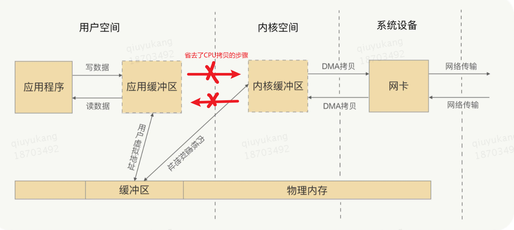

##   一 操作系统基础

<!-- GFM-TOC -->

   * [一 操作系统基础](#一-操作系统基础)
      * [1.1 什么是操作系统](#11-什么是操作系统)
      * [1.2 系统调用、中断、异常](#12-系统调用中断异常)
         * [1.2.1 系统调用](#121-系统调用)
         * [1.2.2 异常](#122-异常)
         * [1.2.3 中断](#123-中断)
         * [三者对比](#三者对比)
      * [1.3 用户态和内核态](#13-用户态和内核态)
         * [1.3.1 内核态和用户态定义](#131-内核态和用户态定义)
         * [1.3.2 区分内核态和用户态的原因](#132-区分内核态和用户态的原因)
         * [1.3.3 用户态进入内核态的途径](#133-用户态进入内核态的途径)
   * [二 进程和线程](#二-进程和线程)
      * [2.1 进程和线程的区别](#21-进程和线程的区别)
      * [2.2 进程有哪几种状态?](#22-进程有哪几种状态)
      * [2.3 进程间的通信方式](#23-进程间的通信方式)
      * [2.4 线程间的同步的方式](#24-线程间的同步的方式)
      * [2.5 进程的调度算法](#25-进程的调度算法)
      * [2.6 进程上下文&amp;进程切换](#26-进程上下文进程切换)
      * [2.7 并发和并行的区别？](#27-并发和并行的区别)
      * [2.8 进程间同步](#28-进程间同步)
         * [2.8.1 一些概念/临界区](#281-一些概念临界区)
         * [2.8.2 进程间同步的方式](#282-进程间同步的方式)
         * [2.8.3 信号量](#283-信号量)
         * [2.8.4 管程机制](#284-管程机制)
         * [2.8.5 经典的同步问题](#285-经典的同步问题)
      * [2.9 死锁](#29-死锁)
         * [2.9.2 死锁的必要条件](#292-死锁的必要条件)
         * [2.9.3 死锁的处理策略](#293-死锁的处理策略)
   * [三 内存管理](#三-内存管理)
      * [3.1 内存管理介绍](#31-内存管理介绍)
         * [3.1.1 内存管理主要职责](#311-内存管理主要职责)
         * [3.1.2 地址空间布局](#312-地址空间布局)
      * [3.2 常见的几种内存管理机制](#32-常见的几种内存管理机制)
         * [<del>3.2.1 块式管理（连续物理内存分配）</del>](#321-块式管理连续物理内存分配)
         * [3.2.2 段式管理（非连续内存管理）](#322-段式管理非连续内存管理)
         * [3.2.3 页式管理（非连续内存管理）](#323-页式管理非连续内存管理)
         * [3.2.4 段页式管理（非连续内存管理）](#324-段页式管理非连续内存管理)
      * [3.3 快表和多级页表](#33-快表和多级页表)
         * [3.3.1 页表的缺点](#331-页表的缺点)
         * [3.3.2 快表TLB-时间优化](#332-快表tlb-时间优化)
         * [3.3.32 多级页表-空间优化](#3332-多级页表-空间优化)
         * [3.3.43 总结](#3343-总结)
      * [3.4 分页机制和分段机制的共同点和区别](#34-分页机制和分段机制的共同点和区别)
      * [3.5 逻辑(虚拟)地址和物理地址](#35-逻辑虚拟地址和物理地址)
      * [3.6 CPU 寻址了解吗?为什么需要虚拟地址空间?](#36-cpu-寻址了解吗为什么需要虚拟地址空间)
   * [四 虚拟内存](#四-虚拟内存)
      * [4.1 什么是虚拟内存(Virtual Memory)](#41-什么是虚拟内存virtual-memory)
      * [4.2 使用虚拟内存的好处](#42-使用虚拟内存的好处)
      * [4.3 局部性原理](#43-局部性原理)
      * [4.4 虚拟内存的技术实现【待整理】](#44-虚拟内存的技术实现待整理)
      * [4.5 引入虚拟内存后的地址转换过程](#45-引入虚拟内存后的地址转换过程)
      * [4.6 缺页中断](#46-缺页中断)
      * [4.7 页面置换算法](#47-页面置换算法)
      * [4.8 Page Fault/页错误](#48-page-fault页错误)
   * [五、文件系统](#五文件系统)
      * [5.1 文件系统的基本组成](#51-文件系统的基本组成)
      * [5.2 文件的存储](#52-文件的存储)
         * [5.2.1 连续存放](#521-连续存放)
         * [5.2.2 非连续存放](#522-非连续存放)
      * [5.3 空闲空间管理](#53-空闲空间管理)
         * [5.3.1 空闲表法](#531-空闲表法)
         * [5.3.2 空闲链表法](#532-空闲链表法)
         * [5.3.3 位图法](#533-位图法)
      * [5.4 软链接和硬链接](#54-软链接和硬链接)
* [面试题](#面试题)
   * [1. Linux 下如何排查 CPU 以及 内存占用过多？](#1-linux-下如何排查-cpu-以及-内存占用过多)
   * [2. 如何查看系统的网络连接情况](#2-如何查看系统的网络连接情况)
   * [3. kill指令](#3-kill指令)
   * [4. 锁是如何实现的](#4-锁是如何实现的)
   * [5. IO多路复用如何实现](#5-io多路复用如何实现)
   * [6. Cache和buffer的区别](#6-cache和buffer的区别)
   * [7. fork 和 exec](#7-fork-和-exec)
      * [fork](#fork)
      * [exec](#exec)
      * [结合使用](#结合使用)
   * [8. 零拷贝技术](#8-零拷贝技术)
      * [mmap](#mmap)
      * [sendfile](#sendfile)
   * [9. 操作系统存储/缓存结构](#9-操作系统存储缓存结构)
   * [10. 什么是协程](#10-什么是协程)

<!-- Created by https://github.com/ekalinin/github-markdown-toc -->

### 1.1 什么是操作系统

1. **操作系统（Operating System，简称 OS）是管理计算机硬件与软件资源的程序，是计算机的基石。**
2. **操作系统本质上是一个运行在计算机上的软件程序 ，用于管理计算机硬件和软件资源。**  举例：运行在你电脑上的所有应用程序都通过操作系统来调用系统内存以及磁盘等等硬件。
3. **操作系统存在屏蔽了硬件层的复杂性。** 操作系统就像是硬件使用的负责人，统筹着各种相关事项。
4. **操作系统的内核（Kernel）是操作系统的核心部分，它负责系统的内存管理，硬件设备的管理，文件系统的管理以及应用程序的管理**。 内核是连接应用程序和硬件的桥梁，决定着系统的性能和稳定性。


### 1.2 系统调用、中断、异常

<font color="red">**操作系统和应用程序或者外设进行交互**</font>时，需要使用到`系统调用`、`中断`、`异常`三种操作。

#### 1.2.1 系统调用

**定义**：应用程序主动向操作系统发出的服务请求如设备管理、文件管理、进程管理等。

**来源**：应用程序

**功能分类**

这些系统调用按功能大致可分为如下几类：

- **设备管理**：完成设备的请求或释放，以及设备启动等功能。
- **文件管理**：完成文件的读、写、创建及删除等功能。
- **进程控制**：完成进程的创建、撤销、阻塞及唤醒等功能。
- **进程通信**：完成进程之间的消息传递或信号传递等功能。
- **内存管理**：完成内存的分配、回收以及获取作业占用内存区大小及地址等功能。

> 用户持续一般运行在用户态，如果想要使用内核态的功能/服务，就进行系统调用从而陷入内核，由操作系统代为完成。

#### 1.2.2 异常

**定义**：程序执行出现错误。

**来源**：运行不正常的应用程序，应用程序意想不到的行为。

**分类**：

#### 1.2.3 中断

**定义**：标记中断号，查中断处理表，保存当前程序现场转而执行中断处理程序。

**来源**：外设，如硬件定时器、鼠标、键盘、网络等。

#### 三者对比


### 1.3 用户态和内核态

#### 1.3.1 内核态和用户态定义

根据进程访问资源的特点，我们可以把进程在系统上的运行分为两个级别：

- **用户态(user mode)** : 用户态运行的进程或可以直接读取用户程序的数据，该模式下程序能够执行的指令受到一定限制（只能执行非特权指令）。
- **内核态(kernel mode)**：可以简单的理解内核态运行的进程或程序几乎可以访问计算机的任何资源，不受限制（可以执行特权指令）。

#### 1.3.2 区分内核态和用户态的原因

**为了安全**， 在CPU的所有指令中，有些指令是非常危险的，如果错用，将导致系统崩溃，比如清内存、设置时钟、修改段页表等。如果所有的程序都能使用这些指令，那么系统死机的概率将大大增加。

内核态用户态切换将带来栈空间（应用程序堆栈、内核堆栈）切换、数据拷贝的开销。

> **特权指令**：清内存、置时钟、分配系统资源、修改虚存的段表和页表，修改用户的访问权限等。在保护模式下，有四个特权级别/环，编号从0到3，环0是最有特权的，3是最小的。环的使用允许系统软件限制任务访问数据、调用门或执行特权指令。在大多数操作系统中，环0是拥有最多特权的级别，与物理硬件(如 CPU 和内存)的交互最直接。在大多数环境中，操作系统和一些设备驱动程序运行在0环中，应用程序运行在3环中。
>
> 

#### 1.3.3 用户态进入内核态的途径

- **系统调用**：用户态进程通过系统调用申请使用操作系统提供的服务程序完成工作时，会自动陷入内核态。而系统调用的机制其核心还是使用了操作系统为用户特别开放的一个中断来实现。
- **异常**：当CPU在执行运行在用户态下的程序时，发生了某些事先不可知的异常，这时会触发由当前运行进程切换到处理此异常的内核相关程序中，也就转到了内核态，比如<font color="red">用户程序发生缺页异常</font>。
- **中断**：当外围设备完成用户请求的操作后，会向CPU发出相应的中断信号，这时CPU会暂停执行下一条即将要执行的指令转而去执行与中断信号对应的处理程序，如果先前执行的指令是用户态下的程序，那么这个转换的过程自然也就发生了由用户态到内核态的切换。比如硬盘读写操作完成，系统会切换到硬盘读写的中断处理程序中执行后续操作等。

## 二 进程和线程

### 2.1 进程和线程的区别

直接参考[Java并发编程相关笔记.md # 1.1 进程和线程的区别](Java并发编程相关笔记.md)

主要从以下几个方面回答即可：

- **组成**：进程就是运行中的程序/代码（包含程序代码、程序处理的数据、PC、通用堆/栈寄存器、外部资源如文件和I/O等），一个进程中可以有多个线程。

- **基本单位**：线程是CPU调度和执行的基本单位，进程是系统资源（内存空间、文件描述符，共享内存，信号量，消息队列等）分配的基本单位
- **地址空间**：同一进程中的所有线程共享地址空间，不同进程的地址空间相互独立（逻辑地址可以相同，但是对于的物理地址不同，无法共享全局变量）
- **资源共享**：同一进程中的所有线程共享堆内存和方法区等，不同进程资源相互独立
- **安全性**：线程并发可能存在安全隐患（线程同步问题、一个线程异常导致其他线程退出等）；但是各进程之间的资源是独立的，当一个进程崩溃时，不会影响其他进程，进程比线程健壮。
- 切换开销、资源消耗等。。。

> Linux中**进程和线程结构体都是一样**的，线程是一种**共享资源的进程**，线程切换开销比进程切换小：
>
> - CPU上下文切换（线程、进程切换都需要）
> - 内存中页表/页的切换（线程切换不需要、因为多线程共用地址空间，进程切换需要）
>
> 对操作系统而言，进程调度和线程调度看到的东西都是一样的，因为二者TCB/PCB结构体基本一致。

### 2.2 进程有哪几种状态?

我们一般把进程大致分为 5 种状态，这一点和[线程](https://github.com/Snailclimb/JavaGuide/blob/master/docs/java/Multithread/JavaConcurrencyBasicsCommonInterviewQuestionsSummary.md#6-%E8%AF%B4%E8%AF%B4%E7%BA%BF%E7%A8%8B%E7%9A%84%E7%94%9F%E5%91%BD%E5%91%A8%E6%9C%9F%E5%92%8C%E7%8A%B6%E6%80%81)很像！

- **创建状态(new)** ：进程正在被创建，尚未到就绪状态。
- **就绪状态(ready)** ：进程已处于准备运行状态，即进程获得了除了处理器之外的一切所需资源，一旦得到处理器资源(处理器分配的时间片)即可运行。
- **运行状态(running)** ：进程正在处理器上上运行(单核 CPU 下任意时刻只有一个进程处于运行状态)。
- **阻塞状态(waiting)** ：又称为等待状态，进程正在等待某一事件而暂停运行如等待<font color="red">某资源为可用或等待 IO 操作</font>完成。即使处理器空闲，该进程也不能运行。
- **结束状态(terminated)** ：进程正在从系统中消失。可能是进程正常结束或其他原因中断退出运行。

> 订正：下图中 running 状态被 interrupt 向 ready 状态转换的箭头方向反了。


### 2.3 进程间的通信方式


按照通信模型主要分为<font color="red">【直接通信】</font>和<font color="red">【间接通信】</font>两种方式；

大概有 7 种常见的进程间的通信方式，主要分为：管道类、信号类、消息队列、共享内存、套接字：

- **管道/匿名管道(Pipes)** ：匿名管道以Buffer的方式存在内存/内核中，是一种**单向管道**，**满则写阻塞空则读阻塞**。因为没有名字来标识，所以只能用于具有亲缘关系（fork可以共享全局变量）的父子进程间或者兄弟进程之间的通信。

  <font color="gray">eg: `ls | more` 命令，将`ls`进程的输出通过管道送到`more`进程中，两个进程都有公共父进程`shell`.</font>

- **有名管道(Names Pipes)** : 为克服匿名管道使用的局限性，提出了有名管道。有名管道严格遵循**先进先出(first in first out)**。有名管道名字存在磁盘中，内容存在内存中，可以实现本机任意两个进程通信。有名管道在打开时需要确实对方的存在（也是单向的），否则将**阻塞**。`【双方通过管道路径名来定位到同一管道】`

- **消息队列(Message Queuing)** ：消息队列是消息的链表,具有**特定的格式**,存放在内核中并由消息队列标识符标识。

  管道和消息队列的通信数据都是FIFO的原则。与管道（无名管道：只存在于内存中的文件；命名管道：存在于实际的磁盘介质或者文件系统）<font color="blue">不同的是消息队列存放在内核中</font>，只有在内核重启(即，操作系统重启)或者显示地删除一个消息队列时，该消息队列才会被真正的删除。消息队列可以实现消息的随机查询,消息不一定要以先进先出的次序读取,也可以按消息的类型读取.比 FIFO 更有优势。**消息队列克服了信号承载信息量少，管道只能承载无格式字节流以及缓冲区大小受限、阻塞等缺点。**

- **信号(Signal)** ：信号是软件层次上对中断机制的一种模拟，是一种异步通信方式，信号可以在用户空间进程和内核之间直接交互，信号可能来自硬件如按键`ctrl+c`、或软件如`kill pid`。信号可以在任意时间发给某一进程（内核自动完成信号传递）,无法承载数据，大多是一种通知机制。


- ~~**信号量(Semaphores)** ：信号量是一个计数器（PV操作），用于多进程对共享数据的访问，信号量的意图在于进程间同步。这种通信方式主要用于解决与同步相关的问题并避免竞争条件。`【双方通过一个公共的信号量集命名key_t来定位到同一信号量集中】`~~
- **共享内存(Shared memory)** ：使得多个进程可以访问同一块内存空间（<font color="blue">不同进程页表中将逻辑地址映射到同一个物理页</font>），不同进程可以及时看到对方进程中对共享内存中数据的更新。这种方式需要依靠某种同步操作，如互斥锁和信号量等。可以说这是**最有用最快**的进程间通信方式。`【双方通过一个公共的内存段命名key_t来定位到同一内存段中】`
- **套接字(Sockets)** : 此方法主要用于在客户端和服务器之间通过网络进行通信。套接字是支持 TCP/IP 的网络通信的基本操作单元，可以看做是**不同主机之间的进程进行双向通信**的端点，简单的说就是通信的两方的一种约定，用套接字中的相关函数来完成通信过程。`【双方通过ip+port来定位对方】`

> **基于共享内存的IPC为什么最快？**
>
> - 基于管道/消息队列的IPC，需要多次调用I/O函数才能完成通信（消息从一端传到另一端需要读写内核，通过内核完成消息的中转）
>
> 
>
> - 基于共享内存的IPC将同一块内存区域映射到共享它的不同进程的地址空间中，使得这些进程间的通信就**不需要再经过内核（除非缺页中断）**，只需对该共享的内存区域进程操作就可以了，**但是它需要用户自己进行同步操作**。
>
> 

### 2.4 线程间的同步的方式

线程同步是两个或多个共享关键资源的线程的并发执行。应该同步线程以避免关键的资源使用冲突。操作系统一般有下面三种线程同步的方式：

1. **互斥量(Mutex)**：采用互斥对象机制，只有拥有互斥对象的线程才有访问公共资源的权限。因为互斥对象只有一个，所以可以**保证公共资源不会被多个线程同时访问**。比如 Java 中的 synchronized 关键词和各种 Lock 都是这种机制。
1. **信号量(Semphares)** ：它允许同一时刻**多个线程访问同一资源**，但是需要控制同一时刻访问此资源的最大线程数量
1. **事件(Event)** :Wait/Notify：通过通知操作的方式来保持多线程同步，还可以方便的实现多线程优先级的比较操

### 2.5 进程的调度算法

进程调度说白了就是操作系统对**CPU的虚拟化**，因为系统中同时时段要执行的进程数量远超过CPU数量，所以操作系统需要将物理CPU进行虚拟化，让每个进程都认为自己有一个独享的CPU。

为了确定首先执行哪个进程以及最后执行哪个进程以实现最大 CPU 利用率，计算机科学家已经定义了一些算法：（下面的算法都只是针对**单CPU**的进程调度算法）：

- **先到先服务(FCFS)调度算法** : 从就绪队列中选择一个最先进入该队列的进程为之分配资源，使它立即执行并一直执行到完成或发生某事件而被阻塞放弃占用 CPU 时再重新调度。

  <font color="red">可能导致程序的周转（执行完毕时刻-到达时刻）和响应时间变长（第一次执行时刻-到达时刻）！</font>

- **短作业优先(SJF)的调度算法** : 从就绪队列中选出一个估计运行时间最短的进程为之分配资源，使它立即执行并一直执行到完成或发生某事件而被阻塞放弃占用 CPU 时再重新调度。

  <font color="red">不现实，因为很难预测程序的实际执行时间！</font>

- **时间片轮转调度算法** : 时间片轮转调度是一种最古老，最简单，最公平且使用最广的算法，又称 RR(Round robin)调度。每个进程被分配一个时间段，称作它的时间片，即该进程允许运行的时间。

  <font color="red">时间片如果设置太短将导致进程上下文切换开销变大！</font>

- **优先级调度** ： 为每个流程分配优先级，首先执行具有最高优先级的进程，依此类推。具有相同优先级的进程以 FCFS 方式执行。可以根据内存要求，时间要求或任何其他资源要求来确定优先级。

  <font color="red">低优先级的进程可能永远得不到执行！</font>

- **多级反馈队列（MLFQ）调度算法** ：前面介绍的几种进程调度的算法都有一定的局限性。如**短进程优先的调度算法，仅照顾了短进程而忽略了长进程** 。多级反馈队列调度算法既能使高优先级的作业得到响应又能使短作业（进程）迅速完成。因而它是目前**被公认的一种较好的进程调度算法**，UNIX 操作系统采取的便是这种调度算法。

  > **(1) 设置多个就绪队列，并为各个队列赋予不同的优先级。**第一个队列的优先级最高，第二个队列次之，其余各队列的优先权逐个降低。该算法赋予各个队列中进程执行时间片的大小也各不相同，在优先权愈高的队列中，为每个进程所规定的执行时间片就愈小。例如，第二个队列的时间片要比第一个队列的时间片长一倍，……，第i+1个队列的时间片要比第i个队列的时间片长一倍。
  > **(2) 当一个新进程进入内存后，首先将它放入第一队列的末尾，按FCFS原则排队等待调度。**当轮到该进程执行时，如它能在该时间片内完成，便可准备撤离系统；如果它在一个时间片结束时尚未完成，调度程序便将该进程转入第二队列的末尾，再同样地按FCFS原则等待调度执行；如果它在第二队列中运行一个时间片后仍未完成，再依次将它放入第三队列，……，如此下去，当一个长作业(进程)从第一队列依次降到第n队列后，在第n 队列便采取按时间片轮转的方式运行。
  > **(3) 仅当第一队列空闲时，调度程序才调度第二队列中的进程运行**；仅当第1～(i-1)队列均空时，才会调度第i队列中的进程运行。如果处理机正在第i队列中为某进程服务时，又有新进程进入优先权较高的队列(第1～(i-1)中的任何一个队列)，则此时新进程将抢占正在运行进程的处理机，即由调度程序把正在运行的进程放回到第i队列的末尾，把处理机分配给新到的高优先权进程。
  >
  > **(4) 一段时间后将所有进程都放到最高级的队列中**，防止低优先级队列中的进程被饿死。

多CPU需要面临CPU的**缓存一致性问题**（每个CPU都有自己的缓存，需要保证缓存的一致性）以及**缓存亲和度问题**（CPU的缓存可以加快进程切换和执行速度，同一个进程应该尽量在同一个CPU上执行）。下面为**多CPU**的进程调度算法：

- **单队列多处理器调度（SQMS）**：将所有任务放在一个队列中，多个CPU依次从队列中取任务进行执行，执行完毕（如果时间片用完则重新加入队尾）则取下一个任务。

  <font color="red">这种方法可能导致同一个任务在多个CPU上切换执行，失去缓存亲和性！</font>

- **多队列多处理器调度（MQMS）**：每个CPU设置一个队列，每到达一个进程由系统来决定将其放到哪一个队列中（比如采用轮转法），每个CPU都从各自的队列中取进程来执行。

  <font color="red">这种方法缓存亲和性好，但可能导致某一个CPU队列中的进程全部执行完毕，另一个CPU的队列还有好几个任务，此时可以引入进程迁移，以实现负载均衡！</font>

### 2.6 进程上下文&进程切换

一个程序在运行时会被载入内存中，变成一个进程，系统需要为进程分配栈空间、堆空间；进程被调度到CPU执行时会有**内核栈、程序计数器、寄存器、Cache**等配合运行；

> **PCB进程控制块**：进程上下文的标示！
>
> - pid（进程标识）
> - 用户可见寄存器、控制和状态寄存器（程序计数器PC、PWD）、栈指针（SP）
> - 进程拥有的各种资源（页表、Cache等）。

当进程从CPU切换出来时，这些内容需要保存到内存中，以便下次恢复现场，继续执行；同时另一个获取CPU执行权的进程的相关资源需要载入/恢复。

**进程上下文切换的过程**（us级别）

- 挂起正在CPU上执行的进程（与中断时保存现场是不同的，中断前后是在同一个进程上下文中，只是由用户态转向内核态执行）

- 保存进程上下文到内存中

- - 用户地址空间：包括程序代码，数据，用户堆栈等
  - 控制信息：进程描述符，内核堆栈等
  - 硬件上下文（注意中断也要保存硬件上下文只是保存的方法不同）
  - 页目录（包含页号和页表的映射关系）

- [schedule()](http://codelab.shiyanlou.com/xref/linux-3.18.6/kernel/sched/core.c#2865)函数选择一个新的进程来运行，并将新的进程上下文进行载入（TLB会被刷新）

**线程上下文切换的过程**

- 和进程切换过程差不多，但是不需要切换地址空间和页表，只需要且寄存器和堆栈、PC等。

### 2.7 并发和并行的区别？

- **并发**的关键是你有处理多个任务的能力，不一定要同时，可能是一个时间段内交替执行，如单CPU切换执行多个进程任务。<font color="red">在一段时间内有多个程序执行！</font>
- **并行**的关键是你有同时处理多个任务的能力，如多CPU同时执行多个线程任务。<font color="red"> 在一个时间点上有多个程序执行！</font>**

所以我认为它们最关键的点就是：是否是『同时』。

### 2.8 进程间同步

无论是线程还是进程，只要涉及到共享资源就需要进行进程间同步（对共享资源的访问需要协调）。

#### 2.8.1 一些概念/临界区

**竞态条件**


**临界区**

临界区是指进程中访问共享资源的那一段代码区域。

**互斥**

只允许有一个进程访问临界区。

<font color="red">进程之间地址空间相互独立，为什么还需要进行互斥和同步？？？进程共享资源？</font>

**死锁**

两个以上的进程都在等待互斥资源，造成相互等待的现象，程序均无法继续执行下去。

#### 2.8.2 进程间同步的方式

- 禁用硬件中断：在进入临界区时关闭硬件中断（此时CPU不会切换进程），退出时开启（无法预知临界区执行时间，可能导致其他进程一直阻塞）
- 软件方法：EisenBerg and McGuire's Algorithm算法
- **更高级的抽象/锁机制**：配合硬件提供的原子操作如CAS，实现软件同步锁

#### 2.8.3 信号量

信号量也是一种实现锁机制的进程同步机制。

信号量机制使用一个整形数据（sem），两个**原子操作**来实现：

- P操作：如果当前sem<0则阻塞等待，否则sem-1
- V操作：sem+1，如果当前sem<=0，唤醒一个等待的P(阻塞在P操作的进程)

#### 2.8.4 管程机制

主要用于解决同步互斥问题，具体机制和Java的sychronized非常类似！！！

#### 2.8.5 经典的同步问题

**生产者消费者问题**

.PNG)

- Wait()操作会释放锁(lock->Release())
- 需要使用while循环进行条件判断而不是if，为了防止假唤醒！！！（有时候也可使用if，如果底层机制为：调用signal之后立刻把控制权交个被唤醒的线程，则可以使用if）

**读者写者问题**

类似MySQL，RR可以同时、RW/WW不能同时、W优先，如何实现？

**哲学家就餐问题**

五个哲学家围成一个圆桌，桌子上有五个叉子，哲学家或思考或吃饭，吃饭必须拿到自己左右两把叉子才行，吃完饭则把这两把叉子放回桌子上。

- 方案1（无法确切知道哲学家什么时候可以进餐，可能产生饥饿现象）


- 方案2

比较复杂！待Java编程实现！！！

[JAVA多线程学习--哲学家就餐问题 - qiuhuilu - 博客园 (cnblogs.com)](https://www.cnblogs.com/vettel/p/3438257.html)

### 2.9 死锁

死锁是指由于两个或者多个进程互相持有对方所需要的资源，导致这些进程均处于阻塞等待状态，无法继续执行。

> 通过绘制资源分配图（有向图）：
>
> - 如果图中不存在环，则说明不存在死锁
> - 如果图中存在环
>   - 每个资源类只有一个实例（该资源可以被多个进程访问），存在死锁
>   - 如果每个资源类有多个实例，可能死锁
>
> 或者把资源节点去掉，变成进程等待图：
>
> - 如果等待图中存在环，则说明存在死锁？


#### 2.9.2 死锁的必要条件

- **互斥条件**：该资源任意一个时刻只由一个线程占用。

- **请求与保持条件**：一个进程因请求资源而阻塞时，对已获得的资源保持不放。

- **不可剥夺条件**：线程已获得的资源在未使用完之前不能被其他线程强行剥夺，只有自己使用完毕后才释放资源。

- **循环等待条件**:若干进程之间形成一种头尾相接的循环等待资源关系（环）。

> 有这四个条件不一定出现死锁，出现死锁一定满足这四个条件。

#### 2.9.3 死锁的处理策略

- **死锁预防**

  破环死锁产生的四个条件，不让死锁发生：

  - **破坏互斥条件** ：这个条件我们没有办法破坏，因为我们用锁本来就是想让他们互斥的（临界资源需要互斥访问）。

  - **破坏请求与保持条件** ：一次性申请所有的资源。

  - **破坏不剥夺条件** ：占用部分资源的线程进一步申请其他资源时，如果申请不到，可以主动释放它占有的资源。

  - **破坏循环等待条件** ：靠按序申请资源来预防。按某一顺序申请资源，释放资源则反序释放。破坏循环等待条件。

- **死锁避免**

  避免系统进入不安全状态（银行家算法）：

  **数据结构定义**

  

  **算法流程**

  

  最终找到了一个安全执行序列！否则不满足则认为不安全，无法给对应进程资源。

  > 银行家算法在实际中很难运行，开销大且很难知道进程最大需要多少资源。

- **死锁检测与解除**

  允许死锁发生，系统负责检测出死锁并解除

  死锁的检测：利用资源分配图

  死锁的解除：资源剥夺法，撤销进程法，进程回退法

## 三 内存管理


### 3.1 内存管理介绍

#### 3.1.1 内存管理主要职责

操作系统的内存管理主要负责：

- **内存分配与回收**：负责给应用程序分配内存并回收不再使用的内存（malloc 函数：申请内存，free 函数：释放内存）
- **地址转换**：将逻辑地址转换成相应的物理地址（应用程序只能看到逻辑地址）
- **空间扩充**：虚拟内存技术，给程序提供统一的完整的虚拟/逻辑地址空间。
- **空间保护**：保证进程在自己所属的内存区域中运行，不会越界访问。（操作系统的内存管理机制需要把各个进程使用的物理内存空间隔离开，共享内存机制除外）


#### 3.1.2 地址空间布局

在Linux里的地址空间布局如下所示（包含内核空间和用户空间，用户程序看到的都是完整的虚拟地址）：


- **代码段**：代码段是用来存放可执行文件的操作指令，也就是说是它是可执行程序在内存中的镜像。代码段需要防止在运行时被非法修改，所以只准许读取操作，而不允许写入（修改）操作——它是不可写的。

- **数据段**：数据段用来存放可执行文件中已初始化全局变量，换句话说就是存放程序**静态分配[[1\]](http://www.kerneltravel.net/journal/v/mem.htm#_ftn1)的变量和全局变量**。

- **BSS段**：BSS段包含了程序中未初始化的全局变量，在内存中 bss段全部置零。

- **堆（heap）**：堆是用于存放进程运行中被动态分配的内存段，它的大小并不固定，可动态扩张或缩减。当进程调用malloc等函数分配内存时，新分配的内存就被动态添加到堆上（堆被扩张）；当利用free等函数释放内存时，被释放的内存从堆中被剔除（堆被缩减）

- **栈**：栈是用户存放程序临时创建的局部变量（但不包括static声明的变量，static意味着在数据段中存放变量）。除此以外，<font color="red">在函数被调用时，其参数也会被压入发起调用的进程栈中，并且待到调用结束后，函数的返回值也会被存放回栈中。</font>。由于栈的先进先出特点，所以栈特别方便用来保存/恢复调用现场。从这个意义上讲，我们可以把堆栈看成一个寄存、交换临时数据的内存区。

> **栈**速度更快因为**所有的空闲内存都是连续的**，因此不需要对空闲内存块通过列表来维护。只是一个简单的指向当前栈顶的指针。编译器通常用一个专门的、快速的寄存器来实现。更重要的一点事是，随后的栈上操作通常集中在一个内存块的附近，这样的话有利于处理器的高速访问。
>
> **堆**包含一个链表来维护已用和空闲的内存块。在堆上新分配（用 new 或者 malloc）内存是从空闲的内存块中找到一些满足要求的合适块。这个操作会更新堆中的块链表。这些元信息也存储在堆上，经常在每个块的头部一个很小区域。

### 3.2 常见的几种内存管理机制

简单分为**连续分配管理方式**和**非连续分配管理方式**这两种。

连续分配管理方式是指为一个用户程序分配一个连续的内存空间（对应到物理内存中是连续的），常见的如 **块式管理** 。

非连续分配管理方式允许一个程序使用的逻辑内存分布在离散或者说不相邻的物理内存中，常见的如**页式管理** 和 **段式管理**。

> 参考：[20 张图揭开「内存管理」的迷雾，瞬间豁然开朗 - 小林coding的文章 - 知乎](https://zhuanlan.zhihu.com/p/152119007)

#### ~~3.2.1 块式管理（连续物理内存分配）~~

远古时代的计算机操系统的内存管理方式。将内存分为几个固定大小的块，每个块中只包含一个进程。如果程序运行需要内存的话，操作系统就分配给它一块，如果程序运行只需要很小的空间的话，分配的这块内存很大一部分几乎被浪费了。这些在每个块中未被利用的空间，我们称之为碎片。


> 内存碎片可以使用内存紧凑技术（碎片合并+移动程序运行空间）来解决。


#### 3.2.2 段式管理（非连续内存管理）

程序是由若干个逻辑分段组成的，如可由代码分段（如主程序、子程序、共享代码段等）、数据分段、栈段、堆段组成。**不同的段是有不同的属性（如只读、可写、可读写等）的，所以就用分段（`Segmentation`）的形式把这些段占用的空间分离出来。**

分段机制下的虚拟地址及地址映射过程如下所示（利用段表来完成）：


- 段号：区分是代码段、栈段、堆段、数据段等。
- 段内偏移：在段对应的物理空间中的偏移值。


**段式管理存在的问题**

- 第一个就是**内存碎片**的问题：如下图所示，新的进程由于无法分配到连续的物理空间而无法执行。

  

- 第二个就是**内存交换的效率低**的问题：面对内存碎片的问题，如果采用内存交换（将别的进程的内存置换到磁盘中，运行时再载入），可能导致用户程序暂停时间较长，效率低。

#### 3.2.3 页式管理（非连续内存管理）

**页式管理** ：把主存分为大小相等且固定的一页一页的形式，操作系统给进程分配内存资源时也是按照页数来分配，页较小（一般4KB），通过页表来将逻辑地址映射成物理地址：

<font color="red">虚拟地址由 **虚拟页号+偏移量** 构成，根据页表查找虚拟页号VPN对应的物理页帧号PFN，根据偏移量在物理页中找到对应的位置即可。</font>


相对相比于块式管理的划分粒度更细，**提高了内存利用率，减少了碎片**（进程拥有的最后一页可能有空闲位置，造成碎片）。

#### 3.2.4 段页式管理（非连续内存管理）

段页式管理机制结合了段式管理和页式管理的优点。简单来说段页式管理机制就是把主存先分成若干段，每个段又分成若干页，也就是说 **段页式管理机制** 中段与段之间以及段的内部的都是离散的。

<font color="red">虚拟地址由 **段号（如01/10/11分别表示代码段/栈段/堆段） + 虚拟页号 + 偏移量** 构成，根据页表查找VPN对应的物理页帧号PFN，根据偏移量在物理页中找到对应的位置即可。</font>


> 目前基本淘汰了分段机制：
>
> 

### 3.3 快表和多级页表

#### 3.3.1 页表的缺点

- **占用空间大**：在分页内存管理中，**页表一般都很大**（如一个32位的寻址空间，假设页大小为4KB、一条页表项占4B，则一个页表将有2^(32-12)个页表项，页表总大小为4MB），每个进程都有一个页表（不同进程的虚拟地址可能相同，但是映射的物理地址不同）
- **需要频繁访问内存**：页表占用空间相对比较大，所以只能放在内存中，因此利用页表进行地址转换是需要频繁访问内存，效率低（至少两次，一次读页表，一次读数据）。

为了应对上述问题，有对应以下两种解决方案来**对页表进行时间和空间进行优化**：

- **快表**：快表（TLB）其实就是页表的高速缓存Cache，它利用了程序的局部性原理（空间、时间局部性）。
- **多级页表**：多级页表其实就是去掉页表中一些无用的项，把线性页表拆分成树状目录（时间换空间）。

#### 3.3.2 快表TLB-时间优化

为了解决虚拟地址到物理地址的转换速度，操作系统在 **页表方案** 基础之上引入了 **快表** 来加速虚拟地址到物理地址的转换。我们可以把快表理解为一种特殊的**高速缓冲存储器**（Cache）。

TLB中的内容是页表的一部分或者全部内容。作为页表的 Cache，它的作用与页表相似，但是提高了访问速率。由于采用页表做地址转换，读写内存数据时 CPU 要访问两次主存（一次调页表、一次访问物理地址）。有了快表，有时只要访问一次高速缓冲存储器，一次主存，这样可加速查找并提高指令执行速度。

使用快表之后的地址转换流程是这样的：

1. 根据虚拟地址中的页号查快表；
2. 如果该页在快表中，直接从快表中读取相应的物理地址；
3. 如果该页不在快表中（TLB Miss），就访问内存中的页表，再从页表中得到物理地址，同时将页表中的该映射表项添加到快表中（该步骤可由硬件或软件来完成）；
4. 当快表填满后，又要登记新页时，就按照一定的淘汰策略淘汰掉快表中的一个页。

#### 3.3.32 多级页表-空间优化

引入多级页表的主要目的是为了**避免把全部页表一直放在内存中占用过多空间**，特别是那些根本就不需要的页表就不需要保留在内存中。

多级页表属于时间换空间的典型场景：


> 上图中一级页表有2^10项，假设一项4B，则一级页表总大小为4KB；二级页表如果占满整个地址空间大小依旧为4B x 2^10 x 1024 = 4MB。空间占用变大了？？？
>
> **但是**：一级页表已经映射了整个地址空间（如果不占满系统会无法运行），**如果某个 一级页表的页表项/某一段地址空间 没有被用到，也就不需要创建这个页表项对应的二级页表了，即可以在需要时才创建二级页表，大大节约页表空间占用**。
>
> - <font color="red">高级页表可能一直驻留在内存中，低级页表可以放在外存中</font>

#### 3.3.43 总结

为了提高内存的空间性能，提出了多级页表的概念；但是提到空间性能是以浪费时间性能为基础的，因此为了补充损失的时间性能，提出了快表（即 TLB）的概念。 不论是快表还是多级页表实际上都利用到了程序的局部性原理，局部性原理在后面的虚拟内存这部分会介绍到。

### 3.4 分页机制和分段机制的共同点和区别

👨‍💻**面试官** ： **分页机制和分段机制有哪些共同点和区别呢？**

🙋 **我** ：

1. **共同点** ：
   - 分页机制和分段机制都是为了提高内存利用率，较少内存碎片。
   - 页和段都是离散存储的，所以两者都是离散分配内存的方式。但是，每个页和段中的内存是连续的。
2. **区别** ：
   - 页的大小是固定的，由操作系统决定；而段的大小不固定（如堆段、栈段等），取决于我们当前运行的程序。
   - 分页仅仅是为了满足操作系统内存管理的需求，而段是逻辑信息的单位，在程序中可以体现为代码段，数据段，能够更好满足用户的需要。

### 3.5 逻辑(虚拟)地址和物理地址

👨‍💻**面试官** ：你刚刚还提到了**逻辑地址和物理地址**这两个概念，我不太清楚，你能为我解释一下不？

🙋 **我：** 用户编程一般只有可能和逻辑地址打交道，比如在 C 语言中，指针里面存储的数值就可以理解成为内存里的一个地址，这个地址也就是我们说的逻辑地址，逻辑地址由操作系统决定。物理地址指的是真实物理内存中地址，更具体一点来说就是内存地址寄存器中的地址。物理地址是内存单元真正的地址。

**逻辑地址**：变量相对于进程在内存中的起始地址而言的存储地址

**物理地址**：变量在内存中真正存放的地址。

> eg: 编译程序时只需确定变量x存放的相对/逻辑地址是100 ( 也就是说相对于进程在内存中的起始地址而言的地址)。CPU想要找到x在内存中的实际存放位置，只需要用进程的起始地址+100即可。

### 3.6 CPU 寻址了解吗?为什么需要虚拟地址空间?

现代处理器使用的是一种称为 **虚拟寻址(Virtual Addressing)** 的寻址方式。**使用虚拟寻址，CPU 需要将虚拟地址翻译成物理地址，这样才能访问到真实的物理内存。** 实际上完成虚拟地址转换为物理地址转换的硬件是 CPU 中含有一个被称为 **内存管理单元（Memory Management Unit, MMU）** 的硬件。如下图所示：


**为什么要有虚拟地址空间呢？**

通过虚拟地址访问内存有以下优势：

- **安全性**：不同进程使用的虚拟地址彼此隔离。一个进程中的代码无法更改正在由另一进程或操作系统使用的物理内存。如果直接把物理地址暴露出来的话会带来严重问题，比如可能对操作系统造成伤害以及给同时运行多个程序造成困难。
- **复用性**：程序可以使用一系列相邻的虚拟地址来访问物理内存中不相邻的大内存缓冲区。
- **可扩展性**：程序可以使用一系列虚拟地址来访问大于可用物理内存的内存缓冲区。当物理内存的供应量变小时，内存管理器会将物理内存页（通常大小为 4 KB）保存到磁盘文件。数据或代码页会根据需要在物理内存与磁盘之间移动。
- **方便移植程序**：程序代码是写死了，如果直接操作物理地址，则在不同机器上物理地址不同，不方便移植程序。

没有虚拟地址空间的时候，**程序都是直接访问和操作的都是物理内存** 。用户程序可以访问任意内存，寻址内存的每个字节，这样就很容易（有意或者无意）破坏操作系统，造成操作系统崩溃。

## 四 虚拟内存

### 4.1 什么是虚拟内存(Virtual Memory)

**虚拟内存** 是一种内存管理技术，它使得应用程序认为它拥有一大片连续的可用的内存（一个连续完整的地址空间），而实际上，它通常是被分隔成多个物理内存碎片，还有部分暂时存储在外部磁盘存储器上，在需要时进行数据交换。

目前，大多数操作系统都使用了虚拟内存，如 Windows 家族的“虚拟内存”；Linux 的“交换空间”等。

### 4.2 使用虚拟内存的好处

- **方便程序编写者**：程序编写者无需考虑程序的数据结构是否有足够的存储空间，只需要自然的编写程序，内存交换的过程对程序完全透明。
- **提升物理内存的使用效率**：虚拟内存可以轻松地保存那些几乎不使用而又被占用的RAM块；然后可以将释放的RAM用于容纳更多具有更高优先级的程序，提高系统的整体性能。

### 4.3 局部性原理

局部性原理是虚拟内存技术的基础，正是因为程序运行具有局部性原理，才可以只装入部分程序到内存就开始运行。

> 以下内容摘自《计算机操作系统教程》 第 4 章存储器管理。
>
> 早在 1968 年的时候，就有人指出我们的程序在执行的时候往往呈现局部性规律，也就是说在某个较短的时间段内，程序执行局限于某一小部分，程序访问的存储空间也局限于某个区域。

局部性原理表现在以下两个方面：

1. **时间局部性** ：如果程序中的某条指令一旦执行，不久以后该指令可能再次执行；如果某数据被访问过，不久以后该数据可能再次被访问。产生时间局部性的典型原因，是由于在程序中存在着大量的循环操作。
2. **空间局部性** ：一旦程序访问了某个存储单元，在不久之后，其附近的存储单元也将被访问（如循环访问数组的每个元素）。即程序在一段时间内所访问的地址，可能集中在一定的范围之内，这是因为指令通常是顺序存放、顺序执行的，数据也一般是以向量、数组、表等形式簇聚存储的。

```java
int[][] nums = new int[1024][1024]	// 一共占用1024 x 1024 x 4 byte = 4MB
// 具备局部性的写法(假设内存大小为4KB 则产生1024次缺页中断)
for(int i = 0; i < 1024; i++) {
  for (int j = 0; j < 1024; j++) {
    nums[i][j] = 0;
  }
}
// 不具备局部性的写法(假设内存大小为4KB 则产生1024 x 1024次缺页中断)
for(int j = 0; j < 1024; j++) {
  for (int i = 0; i < 1024; i++) {
    nums[i][j] = 0;
  }
}
```

时间局部性是通过将近来使用的指令和数据保存到高速缓存存储器中，并使用高速缓存的层次结构实现。空间局部性通常是使用较大的高速缓存，并将预取机制集成到高速缓存控制逻辑中实现。虚拟内存技术实际上就是建立了 “内存一外存”的两级存储器的结构，利用局部性原理实现髙速缓存。

### 4.4 虚拟内存的技术实现【待整理】

虚拟内存的实现需要建立在非连续分配的内存管理方式的基础上。虚拟内存的实现有以下三种方式：

1. **请求分页存储管理** ：建立在分页管理之上，为了支持虚拟存储器功能而<font color="red">**增加了请求调页功能和页面置换功能**</font>。请求分页是目前最常用的一种实现虚拟存储器的方法。请求分页存储管理系统中，在作业开始运行之前，仅装入当前要执行的部分段即可运行。假如在作业运行的过程中发现要访问的页面不在内存，则由处理器通知操作系统按照对应的页面置换算法将相应的页面调入到主存，同时操作系统也可以将暂时不用的页面置换到外存中。
2. **请求分段存储管理** ：建立在分段存储管理之上，增加了请求调段功能、分段置换功能。请求分段储存管理方式就如同请求分页储存管理方式一样，在作业开始运行之前，仅装入当前要执行的部分段即可运行；在执行过程中，可使用请求调入中断动态装入要访问但又不在内存的程序段；当内存空间已满，而又需要装入新的段时，根据置换功能适当调出某个段，以便腾出空间而装入新的段。
3. **请求段页式存储管理**

> 分页与分页存储管理的根本区别在于是否将一作业的全部地址空间同时装入主存。请求分页存储管理不要求将作业全部地址空间同时装入主存。基于这一点，请求分页存储管理可以提供虚存，而分页存储管理却不能提供虚存。

不管是上面那种实现方式，都需要：

1. 一定容量的内存和外存：在载入程序的时候，只需要将程序的一部分装入内存，而将其他部分留在外存，然后程序就可以执行了；
2. **缺页中断**：如果**需执行的指令或访问的数据尚未在内存**（称为缺页或缺段），则由处理器通知操作系统将相应的页面或段**调入到内存**，然后继续执行程序；
3. **虚拟地址空间** ：逻辑地址到物理地址的变换。

> 操作系统kernel是常驻内存的！

### 4.5 引入虚拟内存后的地址转换过程

假设为页式管理：

- 首先根据虚拟地址中的虚拟页号（VPN）查询快表（TBL）：
  - 快表命中：直接根据快表查询结果到内存对应的物理页地址根据偏移值取数据（如果对应页不在物理内存中，参考下面的缺页中断处理）。
  - 快表未命中：从内存调取页表利用VPN查询对应的物理页号（PFN），根据标识位（每一个页表项都有一个标识位表示该页是否在物理内存中）：
    - 如果该页在内存中，根据偏移值读取页内数据，同时将映射记录插入到快表中。
    - 如果页不在内存中，产生**缺页中断**，系统自动将缺页从硬盘调入内存（等待IO的过程中可以执行其他程序）；IO完成则更新页表、快表；定位数据。

### 4.6 缺页中断

当CPU在执行load指令时发现对应的物理页不在内存中（通过页表中的驻留标志位来判断），则产生缺页中断，操作系统将按照以下步骤自动进行缺页中断处理：

- Step1：保存当前进程执行现场，方便后续恢复（Step5）
- Step2：判断内存中是否还有空闲空间，有则执行Step4，否则执行Step3
- Step3：采用某种页面置换算法将某个已经在内存中的物理页和缺失的物理页进行置换，并修改他们对应的驻留标识位（如果被置换物理页的修改位为1则重新回写硬盘）。
- Step4：将缺失的物理页载入内存，修改页表中的物理页地址和驻留标识为为1
- Step5：重新恢复被打断的进程指令

> - **Major Page Fault**：发生page fault时，如果目标页面驻留在外部存储器，那么需要开销较大的I/O操作，这种page fault被称为"**major**"的。
> - **Minor Page Fault**：指需要访问的内存不在虚拟地址空间，但是在物理内存中，只需要 MMU 建立物理内存和虚拟地址空间的映射关系即可。这种page fault不需要重新分配内存页面，代价较小。
>   当一个进程在调用 malloc 获取虚拟空间地址后，首次访问该地址会发生一次 minor/soft page fault。通常是多个进程访问同一个共享内存中的数据，可能某些进程还没有建立起映射关系（别的进程可能已经建立了），所以访问时会出现minor/soft page fault。
>
> ```shell
> ps -eo min_flt,maj_flt,cmd | more # 查看每个进程的page fault次数
> ```

### 4.7 页面置换算法

如果当前内存中并没有空闲的页面，操作系统就必须在内存选择一个页面将其移出内存，以便为即将调入的页面让出空间。用来选择淘汰哪一页的规则叫做页面置换算法，我们可以把页面置换算法看成是淘汰页面的规则。

- **OPT 最佳页面置换算法** ：淘汰在以后最长时间内不再被访问的页面,这样可以保证获得最低的缺页率。但由于人们目前**无法预知进程在内存下的若千页面中哪个是未来最长时间内不再被访问的**，因而<font color="red">该算法无法实现</font>。一般作为衡量其他置换算法的方法。
- **FIFO（First In First Out） 先进先出页面置换算法** : 总是淘汰最先进入内存的页面。<font color="red">物理内存越大反而可能导致缺页次数越多（Belady现象）！</font>
- **LRU （Least Currently Used）最近最久未使用页面置换算法** ：LRU算法赋予每个页面一个访问字段，用来记录一个页面自上次被访问以来所经历的时间 T，当须淘汰一个页面时，选择现有页面中其 T 值最大的，即最近最久未使用的页面予以淘汰（局部性原理）。
- CLOCK 时钟页面置换算法：使用一个比特来标识页是否最近被访问过，所有页串成一个环，指针经过则将比特位置0页面被访问则置1，指针一直往前直到找到第一个标识位为1的页进行置换。（相当于时简化的LRU实现）
- **NRU（Not Recently Used）最近未使用/二次机会页面置换算法**：为页面设置R（初始为0，被读则置1，定期清0）和M位（初始为0，被修改则置1）；根据RM的组合分为00/01/10/11四种，每次随机淘汰编号小的（即淘汰一个不被访问的“脏页面”被淘汰一个频繁访问的“干净页面”好）。
- **NFU （Not Frequently Used）最不经常使用页面置换算法** :  该置换算法选择在之前时期使用最少的页面作为淘汰页。

### 4.8 Page Fault/页错误

页错误产生的原因：

- 缺页异常：分为**Major Page Fault**和**Minor Page Fault**缺页异常。
- 页面访问违反权限（读/写，用户/内核）
- 错误访问地址（访问空地址）

## 五、文件系统

**Linux 中「一切皆文件」，不仅普通的文件和目录，就连块设备、管道、socket 等，也都是统一交给文件系统管理的。**

操作系统通过虚拟文件系统屏蔽底层具体文件系统的差异性，对上层提供统一的操作接口。


### 5.1 文件系统的基本组成

Linux 文件系统会为每个文件分配两个数据结构：**索引节点（index node）和目录项（directory entry）**，它们主要用来记录文件的元信息和目录层次结构。


- **超级块**：用来存储文件系统的详细信息，比如块个数、块大小、空闲块等等。当文件系统挂载时加载到内存中。
- **数据块**：用来存储实际的文件或目录数据，在需要时加载到内存中。数据块读写的最小单位就是逻辑块（默认4KB），也就是物理Page?
- **索引节点**：也就是 *inode*，用来记录文件的元信息，比如 inode 编号、文件大小、访问权限、创建时间、修改时间、**数据在磁盘的位置**等等。<font color="red">**索引节点是文件的唯一标识**</font>，它们之间一一对应，也同样都会被存储在硬盘中，所以索引节点同样占用磁盘空间。
- **目录项**：也就是 *dentry*，用来记录文件的名字、路径，当前文件（普通文件或目录文件）对应的**索引节点指针**以及与其他目录项的层级关联关系（文件路径）。多个目录项关联起来，就会形成目录结构。

> 注意区分**目录和目录项**：
>
> - <font color="red">**目录也是一种文件**</font>，存储在磁盘中，也是用索引节点唯一标识，和普通文件不同的是，**普通文件**在磁盘里面保存的是文件数据，而**目录文件**在磁盘里面保存子目录或文件。
> - <font color="red">**目录项相当于是一个Map**，将文件路径名映射到inode。</font>

### 5.2 文件的存储

文件的存储方式分为**连续存放**和**非连续存放**，非连续存放又分为链表分配和索引分配法。


#### 5.2.1 连续存放

连续存放采用顺序分配的方式，有点在于查找/连续读取速度快，缺点容易产生内存碎片、文件长度不易扩展。


#### 5.2.2 非连续存放

**链表分配法**

链表的方式存放是**离散的，不用连续的**，于是就可以**消除磁盘碎片**，可大大提高磁盘空间的利用率，同时**文件的长度可以动态扩展**。

- <font color="blue">隐式分配</font>：具体如下所示，缺点在于无法直接访问指定文件数据块，只能通过指针顺序访问（串行访问、断链后文件无法正常访问）。


- <font color="blue">显式分配</font>：则它把用于链接文件各数据块的指针，显式地存放在**内存**的一张链接表中**，该表在整个磁盘仅设置一张，**每个表项中存放链接指针，指向下一个数据块号。文件分配表（File Allocation Table，FAT）由于存放在内存中，所以不适合大磁盘。


**索引分配法**

就像给一本书增加目录，文件头（inode?）需要包含指向「索引数据块」的指针，这样就可以通过文件头知道索引数据块的位置，再通过索引数据块里的索引信息找到对应的数据块。


### 5.3 空闲空间管理

#### 5.3.1 空闲表法

空闲表法就是为所有空闲空间建立一张表，表内容包括空闲区的第一个块号和该空闲区的块个数，注意，这个方式是连续分配的。如下图：


当请求分配磁盘空间时，系统依次扫描空闲表里的内容，直到找到一个合适的空闲区域为止。当用户撤销一个文件时，系统回收文件空间。这时，也需顺序扫描空闲表，寻找一个空闲表条目并将释放空间的第一个物理块号及它占用的块数填到这个条目中。

这种方法仅当有少量的空闲区时才有较好的效果。因为，如果存储空间中有着大量的小的空闲区，则空闲表变得很大，这样查询效率会很低。另外，**这种分配技术适用于建立连续文件**。

#### 5.3.2 空闲链表法

我们也可以使用「链表」的方式来管理空闲空间，每一个空闲块里有一个指针指向下一个空闲块，这样也能很方便的找到空闲块并管理起来。如下图：


当创建文件需要一块或几块时，就从链头上依次取下一块或几块。反之，当回收空间时，把这些空闲块依次接到链头上。

这种技术只要在主存中保存一个指针，令它指向第一个空闲块。其特点是**简单，但不能随机访问，工作效率低**，因为每当在链上增加或移动空闲块时需要做很多 I/O 操作，同时数据块的指针消耗了一定的存储空间。

空闲表法和空闲链表法都不适合用于大型文件系统，因为这会使空闲表或空闲链表太大。

#### 5.3.3 位图法

位图是利用二进制的一位来表示磁盘中一个盘块的使用情况，磁盘上所有的盘块都有一个二进制位与之对应。

当值为 0 时，表示对应的盘块空闲，值为 1 时，表示对应的盘块已分配。它形式如下：

```text
1111110011111110001110110111111100111 ...
```

在 Linux 文件系统就采用了位图的方式来管理空闲空间，不仅用于数据空闲块的管理，还用于 inode 空闲块的管理，因为 inode 也是存储在磁盘的，自然也要有对其管理。

### 5.4 软链接和硬链接

有时候我们希望给某个文件取个别名，那么在 Linux 中可以通过**硬链接（\*Hard Link\*）** 和**软链接（\*Symbolic Link\*）** 的方式来实现，它们都是比较特殊的文件，但是实现方式也是不相同的。

- 硬链接是**多个目录项中的「索引节点」指向一个文件**，也就是指向同一个 inode，但是 inode 是不可能跨越文件系统的，每个文件系统都有各自的 inode 数据结构和列表，所以**硬链接是不可用于跨文件系统的**。由于多个目录项都是指向一个 inode，那么**只有删除文件的所有硬链接以及源文件时，系统才会彻底删除该文件。**


- 软链接相当于重新创建一个文件，这个文件有**独立的 inode**，但是这个**文件的内容是另外一个文件的路径**，所以访问软链接的时候，实际上相当于访问到了另外一个文件，所以**软链接是可以跨文件系统的**，甚至**目标文件被删除了，链接文件还是在的，只不过指向的文件找不到了而已。**


# 面试题

## 1. Linux 下如何排查 CPU 以及 内存占用过多？

- 使用使用`top`命令查看各个进程的资源占用情况（`shift + M/P`安装内存/CPU占用递减排序）。
- 找到占用最高的进程pid，使用`top -Hp [pid]`查看该进程下面的线程资源占用情况。
- 使用`jstack -l [pid]`即可找到指定线程中耗费资源的代码

`iostat`指令可以查看系统的io占用情况：

```bash
> iostat
Linux 4.4.0-93-generic (iZwz940depfadlsgzi679rZ) 	2021年08月03日 	_x86_64_	(1 CPU)

avg-cpu:  %user   %nice %system %iowait  %steal   %idle
           1.08   14.81    0.59    0.12    0.00   83.40

Device:            tps    kB_read/s    kB_wrtn/s    kB_read    kB_wrtn
vda               1.31         0.20        11.54    8677293  509061700
```

>`ps -a`显示所有进程pid,“-T”选项可以开启线程查看。
>
>`ps -aT` 显示所有线程
>
>`top -H` 所有线程
>
>`top -H -p <pid>` 特定进程中的线程
>
>`pstree -p 1` 查看进程和线程之间的树状关系

## 2. 如何查看系统的网络连接情况

`netstat`指令可以查询系统的网络连接情况（UDP/TCP均可），支持以下选项：

```bash
-r, --route              显示路由表
-i, --interfaces         显示网络接口号
-M, --masquerade         显示ip_masquerade（NAT）连接

-v, --verbose            显示详细信息
-n, --numeric            不解析名称
-p, --programs           显示Socket对应的进程ID

-l, --listening          显示正在监听的连接
-a, --all, --listening   显示所有的Socket连接
-o, --timers             显示定时器

<Socket>={-t|--tcp} {-u|--udp} {-w|--raw} {-x|--unix} --ax25 --ipx --netrom
```

```bash
# 查看所有正在监听的tcp套接字
netstat -nltp
```

同时配合使用`grep xxx`进行端口/连接状态的过滤：

```bash
# 如显示8080端口的ESTABLISHED状态的tcp连接
netstat -ntp | grep 8080 | grep ESTABLISHED
```

配合使用`wc`工具进行连接数统计：

```bash
# wc为字符串统计命令，支持以下选项
-c 统计字节数
-l 统计行数
-m 统计字符数。这个标志不能与 -c 标志一起使用
-w 统计字数。注意，这里的字指的是由空格，换行符等分隔的字符串
```

```bash
# 如显示8080端口的ESTABLISHED状态的tcp连接数
netstat -ntp | grep 8888 | grep ESTABLISHED | wc -l
```

## 3. kill指令

- kill -2：功能类似于Ctrl+C是程序在结束之前,能够保存相关数据,然后再退出。

- kill -9：强制杀掉进程，这个信号无法被程序捕捉。

## 4. 锁是如何实现的

三种方法

- 加锁是关闭中断响应（此时执行不可能被打断），解锁时打开中断

- test-and-set原子指令(`test_and_set(x)`的操作是将1写入到变量x里，并将写1之前x的值返回)

  ```c
  lock() {
  	while(test_and_set(value)==1) {} //每次执行完原子操作后都有可能会被抢占
  }
  ```

## 5. IO多路复用如何实现

多个Socket的等待队列为同一个线程，只要有一个socket有事件则唤醒该线程。

## 6. Cache和buffer的区别

- **Buffer**（缓冲区）：是系统两端处理**速度平衡**（从长时间尺度上看）时使用的。它的引入是为了减小短期内突发I/O的影响，起到**流量整形**的作用。比如生产者——消费者问题，他们产生和消耗资源的速度大体接近，加一个buffer可以抵消掉资源刚产生/消耗时的突然变化。

  <font color="blue">eg：IO buffer，消息队列。</font>

- **Cache**（缓存）：则是系统两端处理**速度不匹配**时的一种**折衷策略**。因为CPU和memory之间的速度差异越来越大，所以人们充分利用数据的局部性（locality）特征，通过使用存储系统分级（memory hierarchy）的策略来减小这种差异带来的影响。

  <font color="blue">eg：**TLB快表**（（Translation Lookaside Buffer，翻译后备缓冲器）名字起错了，其实它是一个cache.）、操作系统的**L1/L2 Cahce**。</font>

> 假定以后存储器访问变得跟CPU做计算一样快，cache就可以消失，但是buffer依然存在。比如从网络上下载东西，瞬时速率可能会有较大变化，但从长期来看却是稳定的，这样就能通过引入一个buffer使得OS接收数据的速率更稳定，进一步减少对磁盘的伤害。

## 7. fork 和 exec

### fork

`fork()`函数通过系统调用创建一个与原来进程**几乎完全相同**的进程（父子进程有相同的代码、数据、打开的文件描述符），子进程返回0，父进程返回子进程id，-1表示出错。

>`fork()`采用**[copy on write](https://dalin.blog.csdn.net/article/details/106394470)**技术，子进程和父进程共享一块内存（避免复制带来大量开销），且共享内存被设置为`Read Only`模式。当有进程需要修改共享内存中的数据时将触发*页异常中断*，系统将会在该进程中拷贝一份要修改的数据页，然后调用者在拷贝后的数据上进行修改（共享内存中的数据一直不变）。
>
>- 父子进程文件描述符是共享的，可以操控同一份文件。
>
>- 父子进程不共享全局变量，他们是独立的。

### exec

一个进程一旦调用`exec()`函数，它本身就**死亡**了，**系统把代码段替换成新的程序的代码，废弃原有的数据段和堆栈段，并为新程序分配新的数据段与堆栈段，唯一留下的，就是进程号**，也就是说，对系统而言，还是同一个进程，不过已经是另一个程序了。不过exec类函数中有的还允许继承环境变量之类的信息，这个通过exec系列函数中的一部分函数的参数可以得到。

### 结合使用

终端读取命令，开启一个新的处理程序来执行命令：

```c
 1#include <errno.h>
 2#include <stdio.h>
 3#include <stdlib.h>
 4
 5char command[256];
 6void main()
 7{
 8   int rtn; /*子进程的返回数值*/
 9   while(1) {
10       /* 从终端读取要执行的命令 */
11       printf( ">" );
12       fgets( command, 256, stdin );
13       command[strlen(command)-1] = 0;
14       if ( fork() == 0 ) {/* 子进程执行此命令 */
15          execlp(command, NULL );
16          /* 如果exec函数返回，表明没有正常执行命令，打印错误信息*/
17          perror( command );
18          exit( errno );
19       }
20       else {/* 父进程， 等待子进程结束，并打印子进程的返回值 */
21          wait ( &rtn );
22          printf( " child process return %d\n", rtn );
23       }
24   }
25}
```

## 8. 零拷贝技术

原始的IO读写通常为：

- 读IO：当网卡收到数据时，DMA把网卡（如果是读文件则是磁盘）中的数据拷贝到内核缓冲区，当用户调用`read()`时将数据从内核空间拷贝到用户空间。

- 写IO：和读相反。

容易看出上述过程需要均两次数据拷贝（如果是利用Socket发送磁盘中的文件则需要四次数据拷贝），而零拷贝技术则是**将用户空间到内核空间数据拷贝的过程省略掉**，通常用`mmap()`和`sendfile()`技术来实现。



### mmap

在 Linux 中，减少拷贝次数的一种方法是调用 `mmap()` 来代替调用 `read()`，如果需要利用socket发送文件时，用户程序可以直接和内核共享数据缓存区，不需要将数据再次拷贝到用户空间。


### sendfile

`sendfile()` 系统调用不需要将数据拷贝或者映射到应用程序地址空间中去，所以 `sendfile() `只是适用于应用程序地址空间不需要对所访问数据进行处理的情况。

相对于 `mmap()` 方法来说，因为 `sendfile `传输的数据没有越过用户应用程序 / 操作系统内核的边界线，所以 `sendfile ()` 也极大地减少了存储管理的开销。


## 9. 操作系统存储/缓存结构


> 每个CPU都有L1/L2 Cache，共用L3 Cache。

## 10. 什么是协程

协程（Coroutines）是一种比线程更加轻量级的存在，正如一个进程可以拥有多个线程一样，一个线程可以拥有多个协程（有点类似用户级的多线程）。


一个进程可以包含多个线程，一个线程也可以包含多个协程。

简单来说，一个线程内可以由多个这样的特殊函数在运行，但是有一点必须明确的是，**一个线程的多个协程的运行是串行的**，毕竟协程虽然是一个特殊的函数，但仍然是一个函数。一个线程内可以运行多个函数，但这些函数都是串行运行的。当一个协程运行时，其它协程必须挂起。

> - 为什么协程切换开销更小？
>
>   <font color="blue">因为不涉及到用户态和内核态的转换，本质上还是在同一个线程中；不需要多线程的锁机制，因为只有一个线程，也不存在同时写变量冲突（用户自行判断变量状态并切换子程序（协程））。</font>
>
> - 协程怎么提高程序执行效率？怎么利用多核CPU？
>
>   <font color="blue">协程利用了单线程实现并发（需要等待IO时线程不需要挂起，直接转而执行别的子程序/方法），可以采用 多进程+协程 的方式来提升执行效率。</font>
>
> - 协程的核心设计思想是什么？
>
>   <font color="blue">协程是一种任务调度机制，它可以让你用逻辑流的顺序去写控制流，而且还不会导致操作系统级的线程阻塞。协程很多情形下是用来解决I/O问题的。协程对计算密集型的任务也没有太大的好处，计算密集型的任务本身不需要大量的线程切换，因此协程的作用也十分有限，反而还增加了协程切换的开销。</font>

参考：

- 什么是协程？ - 王方浩的文章 - 知乎 https://zhuanlan.zhihu.com/p/172471249
- [协程 - 廖雪峰的官方网站 (liaoxuefeng.com)](https://www.liaoxuefeng.com/wiki/897692888725344/923057403198272)
- 
