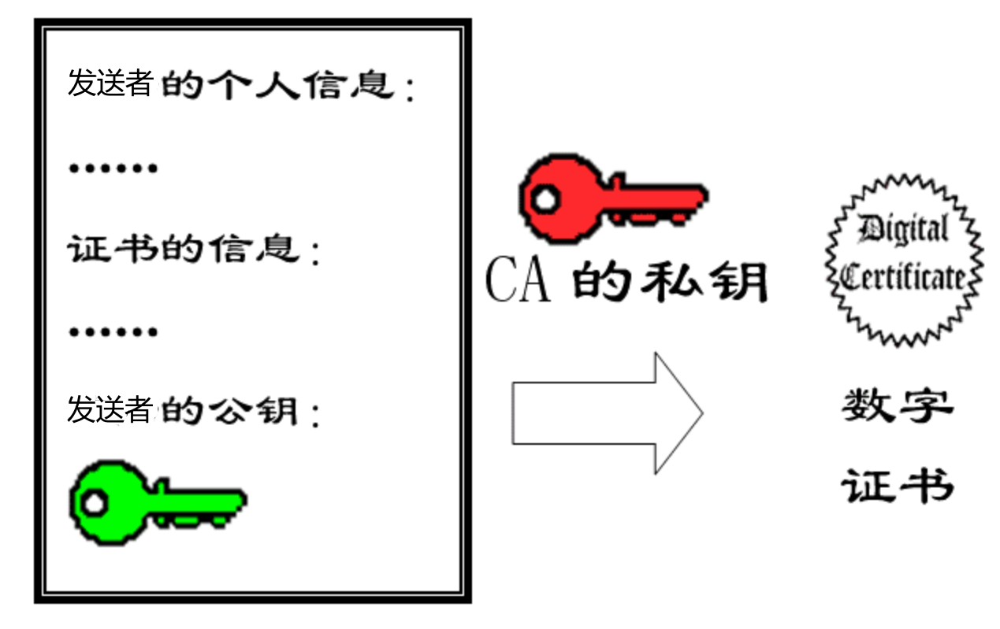

# 计算机网络相关知识

<!-- GFM-TOC -->

* [计算机网络相关知识](#计算机网络相关知识)
   * [0 底层](#0-底层)
      * [网络层](#网络层)
   * [1 传输层](#1-传输层)
      * [1.1 TCP与UDP的区别](#11-tcp与udp的区别)
      * [1.2 三次握手和四次挥手](#12-三次握手和四次挥手)
         * [为什么要三次挥手？](#为什么要三次挥手)
         * [为什么要四次挥手？](#为什么要四次挥手)
         * [服务端出现大量CLOSE_WAIT/TIME_WAIT状态？](#服务端出现大量close_waittime_wait状态)
      * [1.3 TCP SYN攻击](#13-tcp-syn攻击)
      * [1.4 TCP如何保证可靠传输](#14-tcp如何保证可靠传输)
      * [1.5 TCP的拥塞控制](#15-tcp的拥塞控制)
         * [经典Reno算法](#经典reno算法)
         * [BBR算法](#bbr算法)
         * [Vegas算法](#vegas算法)
      * [1.6 TCP流量控制](#16-tcp流量控制)
      * [1.7 TCP发起连接方发起连接后被连接方没accept能传数据么？](#17-tcp发起连接方发起连接后被连接方没accept能传数据么)
      * [1.8 TCP Fast Open](#18-tcp-fast-open)
      * [1.9 TCP半连接](#19-tcp半连接)
      * [1.10 TCP支持哪些参数](#110-tcp支持哪些参数)
      * [1.11 TCP的窗口大小和MSS的关系](#111-tcp的窗口大小和mss的关系)
      * [1.12 TCP的缺陷](#112-tcp的缺陷)
      * [1.13 UDP的缺陷](#113-udp的缺陷)
      * [1.14 TCP/UDP Socket服务端不存在时会怎么处理？](#114-tcpudp-socket服务端不存在时会怎么处理)
      * [1.15 TCP最大连接数](#115-tcp最大连接数)
   * [2 应用层](#2-应用层)
      * [=====Session======](#session)
      * [Session和Cookie的区别](#session和cookie的区别)
      * [分布式Session/Session共享解决方案](#分布式sessionsession共享解决方案)
      * [Session怎么存储？](#session怎么存储)
      * [======HTTP======](#http)
      * [HTTP消息结构](#http消息结构)
      * [一次HTTP请求中发生了什么？](#一次http请求中发生了什么)
      * [HTTP和HTTPS的区别？](#http和https的区别)
      * [HTTP 1.0，1.1，2.0 的主要区别?](#http-101120-的主要区别)
         * [HTTP 1.1比HTTP 1.0新增的功能](#http-11比http-10新增的功能)
         * [HTTP 2.0比HTTP 1.X新增的功能](#http-20比http-1x新增的功能)
      * [HTTP状态码](#http状态码)
      * [HTTP的 GET 和 POST 的区别？](#http的-get-和-post-的区别)
      * [HTTP 和 TCP 的KEEP_ALIVE机制的区别](#http-和-tcp-的keep_alive机制的区别)
      * [=======DNS=======](#dns)
      * [DNS解析的基本流程？](#dns解析的基本流程)
      * [DNS使用什么传输层协议？](#dns使用什么传输层协议)
      * [DNS劫持是什么？](#dns劫持是什么)
      * [WebSocket是如何传输的？](#websocket是如何传输的)
      * [RestFul 是什么？RestFul URL的特点？](#restful-是什么restful-url的特点)
   * [3 网络安全](#3-网络安全)
      * [XSS（跨站脚本攻击）](#xss跨站脚本攻击)
      * [CSRF（跨站请求伪造攻击）](#csrf跨站请求伪造攻击)
      * [SQL注入](#sql注入)
      * [RSA AES CA](#rsa-aes-ca)
      * [数字签名 VS 数字证书](#数字签名-vs-数字证书)
   * [4 QUIC协议](#4-quic协议)
      * [4.1 QUIC要解决的问题](#41-quic要解决的问题)
         * [4.1.1 TCP的队首阻塞](#411-tcp的队首阻塞)
         * [4.1.2 HTTPS握手时延大](#412-https握手时延大)
         * [4.1.3 网络切换需要重新握手](#413-网络切换需要重新握手)
      * [4.2 QUIC原理](#42-quic原理)
         * [4.2.1 建立连接](#421-建立连接)
         * [4.2.2 传输数据](#422-传输数据)
         * [4.2.3 关闭连接](#423-关闭连接)
      * [4.3 QUIC好处](#43-quic好处)
      * [4.4 建立在QUIC上的HTTP/2](#44-建立在quic上的http2)
   * [5 CDN相关知识](#5-cdn相关知识)
   * [6 DNS相关知识](#6-dns相关知识)
   * [7 HTTP优化建议](#7-http优化建议)

<!-- Created by https://github.com/ekalinin/github-markdown-toc -->

## 0 底层

### 网络层

<font color="blue">**网络层用于实现主机之间跨网（物理链路）转发和交付。**</font>

IP分组头部格式


**版本**：4位，指定IP协议的版本号。

**首部长度**(IHL)：4位，IP协议包头的长度，指明IPv4协议包头长度的字节数包含多少个32位。由于IPv4的包头可能包含可变数量的可选 项，所以这个字段可以用来确定IPv4数据报中数据部分的偏移位置。IPv4包头的最小长度是20个字节，因此IHL这个字段的最小值用十进制表示就是5 (5x4 = 20字节)。就是说，它表示的是包头的总字节数是4字节的倍数。

**服务类型（QoS）**：定义IP协议包的处理方法，它包含如下子字段

​        过程字段：3位，设置了数据包的重要性，取值越大数据越重要，取值范围为：0（正常）~ 7（网络控制）

​        延迟字段：1位，取值：0（正常）、1（期特低的延迟）

​        流量字段：1位，取值：0（正常）、1（期特高的流量）

​        可靠性字段：1位，取值：0（正常）、1（期特高的可靠性）

​        成本字段：1位，取值：0（正常）、1（期特最小成本）

​        未使用：1位

**长度**：IP包的总长

**标识**：唯一标识一个IP分组的序号（防止重复）。

**标志**：是一个3位的控制字段，包含：

​        保留位：1位

​        不分段位：1位，取值：0（允许数据报分段）、1（数据报不能分段）

​        更多段位：1位，取值：0（数据包后面没有包，该包为最后的包）、1（数据包后面有更多的包）


**段偏移量**：当数据分组时，它和更多段位（MF, More fragments）进行连接，帮助目的主机将分段的包组合。

**TTL：**表示数据包在网络上生存多久，每通过一个路由器该值减一，为0时将被路由器丢弃。

**协议**：8位，这个字段定义了IP数据报的数据部分使用的协议类型。常用的协议及其十进制数值包括ICMP(1)、TCP(6)、UDP(17)。

**校验和**：16位，是IPv4数据报包头的校验和。

源IP地址：

目的IP地址：

## 1 传输层

<font color="blue">**传输层为应用层提供服务，用于实现进程到进程之间的通信，同时可以实现流量/拥塞/差错控制等。**</font>

###  1.1 TCP与UDP的区别

- TCP有连接，UDP无连接协议；TCP只能点对点，UDP可以点对多点通信。
- 延迟和开销不同（TCP头部最少20字节，UDP只有8字节），UDP处理简单
- TCP面向字节流传输，UDP面向用户数据报传输；这就要求应用层做不同处理（TCP存在粘包/拆包问题）
- TCP可以实现按序、可靠交付，UDP不保证上述特性
- TCP可实现流量控制、拥塞控制、差错控制，UDP无法实现（只提供简单的校验和）
- 适用场景：
  - **UDP**：应用层数据较短（超过65535Byte则需要拆分成多个UDP，应用层需要自行控制顺序并合并分组）、不要求绝对可靠性（可在应用层做可靠性保证）、要求低时延。eg：DNS、RIP、DHCP、实时音视频流等多播协议。
  - **TCP**：文件传输等，eg：SSH、FTP


两种协议的首部格式：


> - UDP最大数据长度为65535-28（sendto函数如果传入数据超过阈值则返回错误），长度过大则IP层会分包，一个fragment分组传送有问题，整个package消息就会丢弃。
>
> - TCP接收窗口最大为65535，发送窗口取决于min(拥塞窗口， 对端的接收窗口)。

###  1.2 三次握手和四次挥手


> - 三次握手中，`ACK.SEQ=SYN.SEQ+ 1`，SYN/SYN+ACK报文虽然未携带数据，但是它消耗一个序号，后续数据传输起始序号为`SYN.SEQ+1`
> - ACK报文如果不携带数据则不消耗序号
> - 四次挥手中，FIN也会消耗一个序号值，所以对方回应的`ACK.SEQ = FIN.SEQ + 1`

#### 为什么要三次挥手？

为了确保对方收发正常：

- 第一次握收：客户端发SYN请求建连；服务端收到后可确认**客户端发送正常**
- 第二次握手：服务端响应SYN+ACK；客户端收到后可以确认**服务端收发正常**
- 第三次握手：客户端收到SYN+ACK，响应ACK；服务端收到后可以确认**客户端接收正常**

<font color="red">为什么还要第三次握手，而不是两次？</font>

- <font color="blue">三次握手不是TCP本身的要求, 而是为了满足"**在不可靠信道上可靠地传输信息**"这一需求所导致的。三次通信是达成该需求所需的最小值。</font>

- <font color="blue">为了防止已经失效的SYN连接请求再次到达对端，引发错误（造成资源浪费）。</font>

  > 第一个SYN延迟过大，客户端重发SYN并成功和服务端建立连接、完成数据传输、关闭连接；之后旧的SYN才到达，服务端误以为客户端又重新建立了连接，继续为该连接分配Socket资源。

<font color="red">握手时需要协商哪些东西？</font>

- MSS：最大报文段，一般在**选项字段**中，一般来说该值和底层物理网MTU值一致（MTU - IP头 - TCP头 = 1500-20-20=1460byte）
- SEQ：初始传输序号，一般是一个随机值
- RWND：接收窗口大小，在后两次握手中发给对方本端的接收窗口大小（和本端的buffer大小有关）

####  为什么要四次挥手？

TCP的连接是全双工的，所以连接的拆除需要单独将两个通道分别拆除，而四次挥手所做的事情就是**拆除两条通道**和**释放资源**，**确认对端都完成数据发送并关闭收发**：

- 第一次挥手：客户端发送FIN；服务端收到后确认客户端发送关闭，此时客户端依旧可以接收数据
- 第二次挥手：服务端响应ACK；客户端收到后确认服务端接收关闭，此时服务端依旧可以发送数据
- 第三次挥手：服务端发送FIN；客户端收到后确认服务端发送关闭
- 第四次挥手：客户端响应ACK；服务端收到后确认客户端接收关闭

<font color="red">二三次挥手为什么能否合并？</font>

- <font color="blue">不能，服务端收到FIN后可能还需要继续发送数据。</font>

<font color="red">为何需要在TIME-WAIT状态继续等到2MSL（最大报文段寿命、参考TTL）再进入CLOSING状态？</font>

- <font color="blue">防止最后一个ACK丢失导致连接无法正常断开：如果客户端在收到FIN并回复ACK后立即进入CLOSING状态，当ACK丢失，服务端将重新发送FIN，此时客户端无法再响应ACK，服务器将一直无法关闭连接（2MSL就是为了确保重发的FIN可以顺利收到并重新响应ACK所设计）。</font>
- <font color="blue">为使旧的数据包在网络因过期而消失：假设当前有一条TCP连接因某些原因，我们先关闭，接着很快以相同的四元组建立一条新连接，此时服务端无法感知到这是一个新连接，旧连接的数据包延迟到达后可能被错误的交到新的应用层。</font>

> <font color="green">MSL为最大报文生存时间，Windows/Linux/Unix为2min/60s/30s。</font>

#### 服务端出现大量CLOSE_WAIT/TIME_WAIT状态？

- 服务端出现大量CLOSE_WAIT状态说明已经收到客户端的FIN并响应ACK，而一直处于该状态说明一直有数据要发（大概率是上层的应用程序处理逻辑有问题）。

- 服务端出现大量TIME_WAIT状态说明短时间内有大量客户端成功断连（**服务端主动断连**），2MSL计时器还未结束，可以考虑修改系统参数`net.ipv4.tcp_tw_recycle = 1`和`net.ipv4.tcp_tw_reuse = 1`来加快回收/重用socket资源。

> 项目中出现服务端大量ESTABLISHED状态，因为ns3仿真系统直接ctrl+c关闭，未发FIN/RST来通知服务端关闭连接；考虑开启keep-alive机制，但是默认时间较长为2h（75s x 10次）、且该机制不是标准协议的一部分ns-3不支持，最终决定应用层自己实现心跳机制。 

### 1.3 TCP SYN攻击

- **是什么**：SYN攻击是指客户端（或者伪造源IP）短时间内大量发起TCP连接请求（发SYN），但是在收到服务端的SYN+ACK后不回复ACK（如果伪造源IP则SYN+ACK将丢失），此时服务端短时间内会被消耗大量资源（为每一个TCP连接分配传送控制块TCB以及各种定时器）。
- **预防**：
  - **回收半连接**：优化主机系统设置如降低SYN timeout时间，使得主机尽快释放半连接的占用；
  - **采用SYN cookie设置**：服务端收到第一个SYN后不做任何资源分配和存储，*将构成连接状态的最基本数据编码压缩（如对五元组做哈希、编码MSS最大报文段长度值）进SYN-ACK的序列号比特位里附带在SYN中*，收到合法的ACK后解析标识信息再进行资源分配；[参考资料](https://segmentfault.com/a/1190000019292140)
  - 如果短时间内收到了某个IP的重复SYN请求，我们就认为受到了攻击；
  - **防火墙**：采用防火墙设置等外部网络也可以进行拦截。

### 1.4 TCP如何保证可靠传输

校验和+序号/确认+自动重传+拥塞控制+流量控制。

**【校序重流拥】**

**校验和**：TCP首部有16bit校验和，用来计算数据包的位相加的结果，如果校验和校验失败则接受方丢弃分组。

**序号+重传**：借助SEQ+ACK需要来完成分组确认，如果发送端有分组未被ACK确认（RTO超时或收到三个重复ACK）则立即重传该丢失分组重传。

**流量控制**：收发双方都有接收/发送窗口，如归对端窗口被填满，则本端将停止/减缓发送速度，以减少丢包。

**拥塞控制**：当TCP检测到网络发生拥塞时（一般采用ACK来辅助判断），则减缓数据发送数据，以减少丢包。

### 1.5 TCP的拥塞控制

#### 经典Reno算法


TCP拥塞控制主要是通过调整发送窗口的大小来完成的。主要分为以下几个阶段：

- **慢启动-指数增大SS**：该阶段窗口值指数增大。从一个MSS（最大报文段长度）开始，每确认一个报文段，则窗口增大一个MSS，直到达到门限值。
- **拥塞避免-加法增大AI**：慢启动达到门限值后，为了避免增大过快导致拥塞，所以开始加法增大，每当整个窗口的报文段都被确认后才将窗口增大1。
- **拥塞检测-乘法减小MD**：当拥塞发生（RTO超时或收到三个重复ACK），则开始进行拥塞避免：
  - RTO超时：重传计时器超时，<font color="red">发生拥塞的可能性较大</font>，此时将拥塞窗口大小设为1，慢启动门限降低一半，重新开始慢启动过程
  - 收到三个重复ACK：收到三个重复ACK说明后续重传的重复分组已经到达了（某个报文段被丢弃，但是后续报文段成功到达），<font color="red">发生拥塞的可能性较小</font>，此时执行**快重传+快恢复**
    - **快重传**：发送端不必等RTO超时，只要收到三个重复ACK则立刻重传未确认数据。
    - **快恢复**：发端收到三个重复ACK时，窗口门限降为当前的一半，窗口大小变成新门限值，开始拥塞避免阶段（加法增加）

> 本端发送窗口大小 = Min [ rwnd, cwnd ]   // 对端接收窗口、本端拥塞窗口中的较小者。
>
> 适用于低延时、低带宽的网络。

#### BBR算法

传统的拥塞控制算法是计算cwnd值（利用丢包/ACK来计算）来规定当前可以发送多少数据，但是并不关注以什么样的速度发送数据。如果简单而粗暴地将窗口大小（send.cwnd、recv.cwnd的最小值）数据全部突发出去，这往往会造成路由器的排队，在深队列的情况下，会测量出rtt剧烈地抖动。bbr在计算cwnd的同时，还计算了一个与之适配的pacing rate（利用RTT和），该pacing rate规定cwnd指示的一窗数据的数据包之间，**以多大的时间间隔发送出去**。

#### Vegas算法

Vegas将时延 RTT 的增加作为网络出现拥塞的信号，RTT 增加，拥塞窗口减小，RTT 减小，拥塞窗口增加。具体来说，Vegas 通过比较实际吞吐量和期望吞吐量来调节拥塞窗口的大小，


###  1.6 TCP流量控制

**原因**：为了防止发送方发送过快，接受方处理不过来导致缓存溢出或丢包。

**做法**：接收方在收到数据回复ACK时携带接收窗口大小值（代表接收缓存区大小）给发送方，如果该值为0则发送方停止发送，直到接受方回复大于0的窗口值则继续发送。

### 1.7 TCP发起连接方发起连接后被连接方没accept能传数据么？

**可以**，即使服务端未调用Accept，内核依旧可以完成三次握手（`accept()`只是将Accept队列中的套接字拷贝到用户空间而已），并接收数据（数据存在内核缓冲区中，需要用户调用`recv()`取出，否则缓冲区满）：


> - SYN队列：半连接队列，默认1024大小。
> - ACCEPTE队列：全连接队列。

### 1.8 TCP Fast Open

TCP快速打开是对TCP的一种简化握手手续的拓展，用于提高两端点间连接的打开速度。当TCP开启了快速打开选项：

- 在服务端响应SYN+ACK时会带上一个Cookie值，客户端收到后保存，正常三次握手；
- 当客户端下次重新连接服务器时，SYN中带上Cookie选项，服务端验证Cookie合法性后直接开始传送数据。


[标准定义rfc7413 (ietf.org)](https://datatracker.ietf.org/doc/html/rfc7413)

### 1.9 TCP半连接

**全连接队列**存放的是已经完成 3次握手，等待应用层调用 `accept()` 处理这些连接；

**半连接队列**，当服务端收到客户端的 SYN 包后，并且回复 SYN+ACK包后，服务端进入 SYN_RECV 状态，此时这种连接称为半连接，会被存放到半连接队列;

当完成 3 次握手之后，tcp 会把这个连接**从半连接队列中移到全连接队列**，然后等待应用层处理。

### 1.10 TCP支持哪些参数

建立连接相关参数

- tcp_syn_retries：默认是5（180s左右）
- tcp_synack_retries：默认是5

关闭连接相关参数

- tcp_fin_timeout：主动断连方在FIN_WAIT2状态的空闲超时时间（对方可能来不及发FIN就被kill了）。
- tcp_max_tw_buckets：保持TIME_WAIT（四次挥手完毕后等2MSL）的最大TCP连接数
- tcp_tw_recycle：是否开启TCP连接中TIME-WAIT sockets的快速回收
- tcp_tw_reuse：是否允许重新应用处于TIME-WAIT状态的socket用于新的TCP连接。

KEEPALIVE相关参数

- tcp_keepalive_time：打开心跳机制后，如果连接上无数据，服务端发送心跳包的间隔，默认7200s
- tcp_keepalive_probes：TCP发送keepalive探测以确定该连接已经断开的次数，默认是9
- tcp_keepalive_intvl：探测消息发送的频率，乘以tcp_keepalive_probes就得到对于从开始探测以来没有心跳响应的连接杀除的时间。默认值为75秒，即没有心跳活动的连接将在大约11分钟以后将被丢弃。

其它：

- tcp_syncookies
- tcp_sack
- tcp_window_scaling：窗口缩放选项（如缩放因子值为1.5），可以将窗口有2^16=65535扩大一定倍数。

### 1.11 TCP的窗口大小和MSS的关系

- 发送窗口大小 = min(对端接收窗口大小rwnd, 本端拥塞窗口大小cwnd)，最大为2^16=65535B，如果支持窗口缩放选项则可增加到1GB
- MSS：最大报文段长度（TCP交给IP的最大分段长度），取决于底层的MTU，如以太网中MTU=1500，除去20字节的IP和20字节的TCP头部，则MSS为1460字节
- 初始拥塞窗口大小CWND为4段（后续优化成10段），即4x1460B=5.7KB

### 1.12 TCP的缺陷

- 队首阻塞
- 拥塞控制（慢启动）影响吞吐量，不适合短连接（增大初始拥塞窗口为10，禁用慢启动，重用TCP连接，窗口缩放）
- 握手时延大（TCP Fast Open）

### 1.13 UDP的缺陷

- UDP无状态，在面临NAT转换时，转换器必须维护状态表（TCP有自己的状态变换机制和握手机制，NAT可以利用它的机制来维护表项）。
- UDP在NAT下很难实现P2P（NAT表项可能随时过期，需要手动维持双向心跳以刷新表项）

解决方法：

- 借助公网服务器获取客户端映射后的外网地址和IP
- 利用公网服务器中转流量
- 结合以上两者

### 1.14 TCP/UDP Socket服务端不存在时会怎么处理？

 **TCP**

当客户端尝试和服务端的某个端口（改端口没有TCP在监听）建立连接时，当服务端收到SYN后将立即回复**RST端口不可达报文**，且RST分组的数据部分为原始SYN分组的IP层及其以上的数据。


**UDP**

UDP Scoket如果给服务端的某个端口发送数据（该端口没有UDP在监听），则对端将返回**ICMP端口不可达消息**（`icmp destination unreachable`），ICMP的数据部分为原始UDP分组IP层及其以上的数据。


### 1.15 TCP最大连接数

主要受到以下结果方面的限制：

**文件描述符数量**：Linux中单个进程允许打开的文件描述符数量默认为1024，无论是客户端还是服务端，**每一个TCP连接都要占用一个文件描述符**（使用`ulimit -n`可以查看/或临时修改，可以在配置文件中做永久修改）。

**端口数量限制**：每一个TCP套接字都需要占用一个端口，系统可用端口从1~65535，其中1~1024为系统保留端口。

**系统性能限制**：系统的CPU和内存等硬件限制也会限制TCP连接数，连接数太大系统可能无法处理；同时系统需要为每一个连接分配TCP控制块（TCB），单个控制块占用1KB内存。

<font color="red">对于服务端套接字，只占用一个端口，但是每接受一个客户端连接则需要为其分配一个套接字，所以最大连接数主要受到文件描述符数量和系统性能限制；对于客户端套接字，每建立一个连接都需要申请一个文件描述符和一个端口号，所以客户端连接限制主要受到上述三个因素影响。</font>


## 2 应用层

### =====Session======

###  Session和Cookie的区别

两者是为了应对HTTP协议无状态的问题，用来跟踪浏览器用户身份的会话方式。

- **存储位置**：Session对应的内容存储在服务器端（Tomcat底层将sessionid中包含的用户信息自动存储到了内存/磁盘中，不同Web服务器的session实现有所不同），cookie内容存储在客户端浏览器中。
- **内容**：Cookie一般用来保存用户信息（k-v形式），而session只是一串id标识，服务端通过sessionid来查询之前保存的session数据信息。
- **安全性**：一般来说Session要更安全，因为真正的信息存储在服务端，session只用作用户和用户数据的关联；而cookie在存储敏感信息时往往需要加密后写入cookie，之后在服务端解密。

> Session实际上是存储在Cookie内的（以`sessionid`的属性存在），如果浏览器禁用cookie，则可以将`sessionid`放在URL中进行传递。

**Session+Cookie结合使用**：


- 用户提交身份信息（包含用户名密码等）
- 服务端验证用户身份信息，验证成功则生成一个sessionid存储到数据库中（常用Redis），同时将sessionid写入cookie（需要设置过期时间）返回给用户
- 用户发起其它请求时，自动带上cookie
- 服务端读取cookie中的session信息，验证用户身份成功后响应用户

### 分布式Session/Session共享解决方案

当采用对HTTP请求进行复杂均衡处理时，统一客户端的多次请求可能被分发到不同的后台Server上进行处理，此时Server之间需要共享Session数据才能正确处理请求。分布式Session解决方案主要有以下四种：

<font color="red">**粘性Session**</font>：在负载均衡服务器上设置策略，对请求源IP进行哈希运算，将统一ip的请求都分发到同一服务器上进行处理。

<font color="red">**Session同步/复制**</font>：在服务器集群所在的局域网中通过发送广播来异步同步session数据。

<font color="red">**集中式Session管理**</font>：可以使用Redis/数据库来集中存储session数据，每个服务器都将session数据存储到同一地方并从同一地方取session数据。


~~<font color="red">**客户端存储Session**</font>~~：即cookie?

### Session怎么存储？

不同Web服务器实现机制不一样！

### ======HTTP======

### HTTP消息结构

HTTP是基于客户端/服务端（C/S）的架构模型。

客户端发送一个HTTP请求到服务器的请求消息包括以下格式：**请求行**（request line）、**请求头部**（header）、**空行**和**请求数据**四个部分组成，请求报文的一般格式


HTTP响应也由四个部分组成，分别是：**状态行**、**消息报头**、**空行**和**响应正文**。


### 一次HTTP请求中发生了什么？

从**传输层及应用层**来看，主要过程如下：

1. **DNS 解析**：浏览器查询 DNS，获取域名对应的 IP 地址。具体过程包括：
   - 浏览器搜索自身的 DNS 缓存
   - 找本机的host文件
   - 路由器缓存
   - 向本地 DNS 服务器进行查询等（见DNS的查询过程）。
2. **TCP 连接**：浏览器获得域名对应的 IP 地址以后，浏览器向服务器请求建立TCP连接，发起三次握手；
3. **发送 HTTP 请求**：TCP 连接建立起来后，浏览器向服务器发送 HTTP 请求；
4. **服务器处理请求并返回 HTTP 报文**：服务器接收到这个请求，并根据路径参数映射到特定的请求处理器进行处理，并将处理结果及相应的视图返回给浏览器；
5. **浏览器解析渲染页面**：浏览器解析并渲染视图，若遇到对 js 文件、css 文件及图片等静态资源的引用，则重复上述步骤并向服务器请求这些资源；浏览器根据其请求到的资源、数据渲染页面，最终向用户呈现一个完整的页面。
6. **连接结束。**

从**传输层及其下层**来看：

1. 发DNS请求时依次使用UDP/IP进行封装，使用ARP进行IP地址到MAC地址的映射，IP分组被传递到网关
2. 发HTTP请求时依次使用TCP/IP进行封装，使用ARP进行IP到MAC地址的映射，IP分组被传递到网关
3. IP分组从网关出来后，通过路由转发（OSPF/RIP等）最终到达对应的目标服务器上；目的服务器响应也是类似的过程。

### HTTP和HTTPS的区别？

- **构成**：HTTPS = HTTP + SSL/TSL（会话层加密协议）。
- **安全性**：HTTP为明文传输，HTTPS为加密传输，HTTPS更加安全。
- **默认端口**：HTTP的默认端口为80（TCP），HTTPS的默认端口为443（TCP或基于UDP的QUIC）。
- **建连时延**：HTTP连接建立比HTTPS更简单，只需要TCP三次握手后即可传输HTTP报文；而HTTPS除了TCP三次握手，还需要SSL/TSL握手才可以进行加密HTTP报文传输。
- **其它**：TSL的CA证书收费、加密解密消耗系统资源。


> TSL如何应对中间人攻击？
>
> - 场景：在TSL握手过程中，第三方截取来自服务器的公钥，替换成伪造的公钥发给客户端，最终在客户端和服务端之间分别握手，变成中间人，以解密客户端和服务端的数据。
>
> 
>
> - 应对手段：采用可行的第三方可信证书（包含第三方权威机构对服务器公钥的签名），证书中的签名是不可被篡伪造的
>   - 可信的第三方对服务器给出的公钥进行hash处理得到摘要H，利用可信三方自身的私钥加密H得到签名
>   - 服务器将公钥和权威机构对公钥的签名一起发给客户端
>   - 客户端根据内置的可信证书中包含的可信三方的公钥对签名进行解密得到H2，对公钥进行hash得到H1，检查H1和H2是否相等即可知道公钥是否已经被篡改。

### HTTP 1.0，1.1，2.0 的主要区别?

#### HTTP 1.1比HTTP 1.0新增的功能

**长连接机制***

HTTP 1.0时期，每次请求一个HTTP资源都有新建一个TCP连接，请求完毕后关闭TCP连接，这将造成**很大的时延**，同时由于TCP慢启动过程的存在而**降低整体传输速率**（慢启动还没结束资源就传完了）。

HTTP 1.1引入长连接机制（请求头增加Connection:Keep-alive字段），**多次HTTP请求可以复用一个TCP连接**，降低传输时延，消除TCP慢启动阶段的低速率影响。

**管道机制***

在长连接机制下，浏览器需要按照FIFO的顺序来依次发送HTTP请求（收到一个响应后再发下一个请求）；而管道机制的引入，将FIFO放在服务端进行（服务端同时处理多个请求，但是**按顺序响应**），可以减少整体往返时延。


> HTTP 1.1的的管道机制存在**队首阻塞**问题，在服务端，即使下一个请求资源已经就绪，还是得等前一个请求资源返回后才能发送，如果前一个请求响应慢或者无响应，将阻塞后续所有的请求响应。
>
> 即不支持多路复用！

**节约带宽**

HTTP 1.1支持POST请求值发送请求头Header而先不发送请求体Body，如果服务器鉴定客户端请求出错/无权访问，则直接返回401（有权则返回100 `Continue Status`），客户端无需传输Body到服务端，节约带宽。

#### HTTP 2.0比HTTP 1.X新增的功能

**二进制帧**

HTTP 1.X时代，HTTP的数据都是采用字符串文本的方式进行传输（使用换行符进行分割）。而HTTP 2.0引入二进制帧格式，在一个TCP信道上传输多个流（逻辑信道，用ID标识，可以和一对HTTP请求/响应对应），流上传输逻辑消息（一次HTTP请求/响应）；消息被拆分成多个二进制帧（如HEADER帧、DATA帧、PING帧等）进行传输。


**多路复用**

二进制帧的引入可以使得客户端/服务端把HTTP请求分解为互不依赖的帧，然后乱序发送，最后在对端进行重新组合（可以用数据流ID等来进行标识一次请求/响应）；实现连接的多路复用，消除了**队首阻塞**作用！

> 即好**几个HTTP请求或响应**（一对请求/响应为一个流，一个请求/响应被分成多个消息，一个消息分成多个帧）**可以混在一起传输，在对端进行拼接**。

> **HTTP2.0并没有消除TCP的队首阻塞问题**！！！只是消除了HTTP1.1的队首阻塞（<font color="blue">服务端短时间先后收到两个请求后，只能等第一个请求响应结束后才能继续响应下一个</font>）问题。


**首部压缩**

用HPACK算法对header的数据进行压缩，同时基本单位是**二进制帧流**，这样的数据占用空间更少，在网络上传输就会更快。

**服务端推送**

同SPDY一样，HTTP2.0也具有server push功能，客户端一次请求，服务端可以根据预测响应多份资源（客户端缓存资源后可直接从本地加载，无需再次请求）。

### HTTP状态码


```text
### 成功状态码 #####################################
200 OK 请求正常处理完毕
204 No Content 请求成功处理，没有实体的主体返回
206 Partial Content GET范围请求已成功处理

### 重定向状态码 ####################################
301 Moved Permanently 久重定向，资源已永久分配新URI
302 Found 临时重定向，资源已临时分配新URI
303 See Other 临时重定向，期望使用GET定向获取
304 Not Modified 发送的附带条件请求未满足
307 Temporary Redirect 临时重定向，POST不会变成GET

### 客户端错误状态码 #################################
400 Bad Request 请求报文语法错误或参数错误
401 Unauthorized 要通过HTTP认证，或认证失败
403 Forbidden 请求资源被拒绝
404 Not Found 无法找到请求资源（服务器无理由拒绝）、参数错误

### 服务端错误状态码 #################################
500 Internal Server Error 服务器内部故障或Web应用故障
502 Bad Gateway 服务器作为网关或代理，从上游服务器收到无效响应。 
503 Service Unavailable 服务器超负载或停机维护
```

### HTTP的 GET 和 POST 的区别？

| 操作方式 | 数据位置 | 明文/密文 | 数据安全 | 幂等性 | 长度限制     | 应用场景 |
| :------: | -------- | --------- | -------- | ------ | ------------ | -------- |
|   GET    | HTTP包头 | 明文      | 安全     | 幂等   | 长度较小     | 查询数据 |
|   POST   | HTTP正文 | 明文密文  | 不安全   | 不幂等 | 支持较大数据 | 修改数据 |

<span style = "color:red">本质区别：GET 只是一次 HTTP请求，POST 先发请求头再发请求体（HTTP1.0之后），实际上是两次请求。</span>

- **参数位置**：GET请求的参数/数据放在URL（请求头）上，POST的放在请求体中；
- **功能**：GET一般用来查询数据，POST一般用来新增数据；
- **安全性**：POST 的安全性要比 GET 的安全性高，因为 GET 请求提交的数据将明文出现在 URL 上，而且 POST 请求参数则被包装到请求体中，相对更安全；
- **长度限制**：GET 请求的长度受限于浏览器或服务器对 URL 长度的限制，允许发送的数据量比较小，而 POST 请求一般是没有大小限制的。

> get请求中也可以携带body，但是标准中不建议加body，不保证所有的实现都支持（2014 年以前的规范中要求 GET 请求如果有 body，则 body 必须被忽略（虽然不一定报错，但 body 会被忽略）；现在没有这个限制了。）。
>
> 且一般来说任何应用都不应让 GET 请求修改服务端的状态。

### HTTP 和 TCP 的KEEP_ALIVE机制的区别

HTTP 1.1默认开启keep-alive机制：HTTP服务端在一个http产生的tcp连接在传送完最后一个响应后，还需要hold住keepalive_timeout秒后，才开始关闭这个连接。

TCP的keep-alive机制：TCP服务端为了检测客户端是否在线，定期发送空的TCP分组（心跳）到客户端，如果客户多次未响应则发RST关闭连接。

### =======DNS=======

### DNS解析的基本流程？

分为`递归解析`和`迭代解析`两种方式（具体使用哪种取决于DNS客户主机的请求）。

1. <span style = "color:red">主机向本地域名服务器的查询一般都是采用**递归查询**。</span>所谓递归查询就是：如果主机所询问的本地域名服务器不知道被查询的域名的 IP 地址，那么本地域名服务器就以 DNS 客户的身份，向**根域名服务器**继续发出查询请求报文(即替主机继续查询)，而不是让主机自己进行下一步查询。因此，递归查询返回的查询结果或者是所要查询的 IP 地址，或者是报错，表示无法查询到所需的 IP 地址。


2. <span style = "color:red">本地域名服务器向根域名服务器的查询的**迭代查询**。</span>迭代查询的特点：当根域名服务器收到本地域名服务器发出的迭代查询请求报文时，要么给出所要查询的 IP 地址，要么告诉本地服务器：“你下一步应当向哪一个域名服务器进行查询”。然后让本地服务器进行后续的查询。**根域名服务器通常是把自己知道的顶级域名服务器的 IP 地址告诉本地域名服务器，让本地域名服务器再向顶级域名服务器查询**。顶级域名服务器在收到本地域名服务器的查询请求后，要么给出所要查询的 IP 地址，要么告诉本地服务器下一步应当向哪一个权限域名服务器进行查询。最后，本地域名服务器得到了所要解析的 IP 地址或报错，然后把这个结果返回给发起查询的主机。


### DNS使用什么传输层协议？

DNS 可以使用 <span style = "color:red">**UDP 或者 TCP** </span>进行传输，使用的端口号都为<span style = "color:red"> **53**</span>。大多数情况下 DNS 使用 UDP 进行传输，这就要求域名解析器和域名服务器都必须自己处理超时和重传从而保证可靠性。在两种情况下会使用 TCP 进行传输：

- 如果返回的响应超过的 **512 字节**（UDP 最大只支持 512 字节的数据）
- **区域传送**（区域传送是主域名服务器向辅助域名服务器传送变化的那部分数据，相当于数据库中的Master和Slaver主从备份）

### DNS劫持是什么？

DNS劫持是互联网攻击的一种方式，通过攻击/伪造DNS服务器的方法，把目标网站域名解析到错误的IP地址从而实现用户无法访问目标网站的目的 或者 蓄意或恶意要求用户访问指定IP地址（网站）的目的。

> 比如利用DNS截止可以禁止用户访问国外网站，利用DNS截止可以让用户在访问正常网站时重定向到各种恶意网站。

### WebSocket是如何传输的？


- Websocket握手阶段基于HTTP，也是采用80端口。
- **握手完毕后采用TCP进行双向通信**（WSS则是基于TSL+TCP），支持文本和二进制数据的传输。
- 中途采用PING/PONG包来维持进行心跳维持。

### RestFul 是什么？RestFul URL的特点？

Restful编写接口的结构协议，RestFul URL（URL中不可出现动词）是面向资源的，可以唯一标识和定位资源。用`GET/POST/PUT/DELETE`请求动作来定义对资源的获取/新增/修改/删除。

## 3 网络安全

### XSS（跨站脚本攻击）

让浏览器执行网站本不存在的js代码（攻击者植入的代码，比如在文本框输入`<script>alert(“hey!you are attacked”)</script>`）。


**后果**：可能造成<font color="red">用户cookie被窃取、流量劫持和恶意跳转</font>。

**防范**：对输入框中的内容进行过滤（比如滤去标签）、对`</>`等符号进行转义和编码。使用HttpOnly，即浏览器禁止页面JavaScript访问带有HttpOnly属性的Cookie。

### CSRF（跨站请求伪造攻击）

用户登录A网站并取得cookie.

用户访问B网站，无意间对A网站中发起请求（可能是转账请求，该请求会自动带上A完整的合法cookie），完成攻击。


**防范**：

- **服务器进行源地址检查**：通过检查请求来源，验证其合法性，如只允许自己的网站的请求（eg:图片防盗链，只允许自己的网页请求图片）。
- **使用验证码**：对关键操作进行图形验证码或手机短信验证码的验证
- **表单TOKEN**：CSRF是一种伪造请求，通过在提交表单中加入随机Token来防止伪造请求，随机Token由之前正常响应中获取的。

### SQL注入

注入攻击主要有两种形式，SQL注入攻击和OS注入攻击。SQL注入攻击的原理如图8.3所示。攻击者在HTTP请求中注入恶意SQL命令（drop table users;），服务器用请求参数构造数据库SQL命令时，恶意SQL被一起构造，并在数据库中执行。

**例1**：

正常请求`http://localhost/sqliabs/Less-1/?id=3`，后台执行SQL`select username,password from table where id =3`

构造攻击请求 `http://localhost/sqliabs/Less-1/?id=3 or 1 = 1`，后台会执行`select username,password from table where id =3 or 1 = 1`

**例2**：


**防范**

- 请求参数过滤。通过正则匹配，过滤请求数据中可能注入的SQL，如`drop table`、`\b(?:update\b.*?\bset|delete\b\W*?\bfrom)\b`等。
- 参数绑定：使用预编译手段，绑定参数是最好的防SQL注入方法。目前许多数据访问层框架，如MyBatis，Hibernate等，都实现SQL预编译和参数绑定，攻击者的恶意SQL会被当做SQL的参数，而不是SQL命令被执行。

### RSA AES CA

- RSA：非对称加密，公钥+私钥，公钥可以直接传输，加解密开销大，不适合大文件。
- AES：对称加密，私钥，加解密速度快，适合大文件，但是密钥不能直接传输。
- CA：证书，由权威机构颁发，包含一对公钥+私钥。
  -  数据发送方：首先利用自己的私钥对**数据**进行签名生成**摘要**，然后请求接收方的CA，利用对方的公钥对**数据+摘要**进行加密；
  - 数据接收方：利用自己的私钥对加密**数据+摘要**进行解密，解密后请求发送方的CA，利用发送方的公钥对**摘要**进行验证确认数据是否为对方所发以及违背篡改。

> 一般RSA和AES以及CA会结合使用：采用非对称加密算法来传输对称加密算法所需要的私钥，详将TSL握手过程！

### 数字签名 VS 数字证书

<font color="blue">数字签名--防止内容被篡改</font>

发送端（对原文用私钥进行签名，将原文和签名一起发送出去）：


接收端（对原文进行摘要得到摘要值1，用公钥对签名进行解密得到摘要值2，对比两个摘要值即可知道原文是否被篡改）：


<font color="blue">数字证书--提供合法公钥</font>

数字签名过程中，如果接收者的公钥被攻击者方替换，则攻击者可以篡改原文（用攻击者自己的私钥签名，接收者用攻击者伪造的公钥解密签名）。此时需要一个第三方权威机构对发送者的公钥进行合法性认证（CA证书）！

- 第三方权威机构（证书中心）会对发送者的身份做认证，用权威机构的私钥加密发送者的公钥生成证书，并将证书颁发给发送者。



- 接收端收到发送者的证书后，用内置的权威机构的公钥解密证书验证发送者的公钥是否正确，进而验证内容是否被篡改。


## 4 QUIC协议

QUIC（Quick UDP Internet Connections ）快速UDP协议，是由 Google 提出的实验性网络传输协议 ，位于 OSI 模型传输层。 QUIC 旨在解决 TCP 协议的缺陷，并最终替代 TCP 协议， 以减少数据传输，降低连接建立延迟时间，加快网页传输速度。主要是为了HTTP所设计的传输层协议。


https://segmentfault.com/a/1190000020881220

https://www.mobibrw.com/2020/23190

https://zhuanlan.zhihu.com/p/114384277

https://quic.readthedocs.io/zh/latest/A%20QUIC%20Overview.html

[TCP性能优化 - 程序员麻辣烫的文章 - 知乎](https://zhuanlan.zhihu.com/p/170582219)

https://medium.com/codavel-blog/quic-vs-tcp-tls-and-why-quic-is-not-the-next-big-thing-d4ef59143efd

[QUIC 协议原理浅解 ](https://www.sohu.com/a/456258632_100093134)

### 4.1 QUIC要解决的问题

#### 4.1.1 TCP的队首阻塞

<font color="blue">TCP 的阻塞问题是因为传输阶段可能会丢包，一旦丢包就会等待重新发包，阻塞后续传输，这个问题虽然有**滑动窗口（Sliding Window）**这个方案，但是只能增强抗干扰，并没有彻底解决。</font>应用层无法感知这个过程，只能等待数据完整后才能读取数据。

HTTP/2 并没有解决 TCP 的队首阻塞问题，它仅仅是通过**多路复用**解决了以前 HTTP1.1 **管道化**请求时的队首阻塞。HTTP是应用层协议，无法解决TCP传输层协议的阻塞问题！

> HTTP1.1队首阻塞问题：比如 HTTP/1.1 时代建立一个 TCP 连接，三个请求组成一个队列发出去，服务器接收到这个队列之后会依次响应，一旦前面的请求响应阻塞，后面的请求就会无法响应。

#### 4.1.2 HTTPS握手时延大

HTTPS在传输数据前经过TCP三次握手，TSL四次握手，最终至少需要3RTT才能开始HTTP数据传输。

#### 4.1.3 网络切换需要重新握手

基于TCP的HTTP在用户网络切换后，需要重新建立TCP连接并完成握手（因为TCP连接由五元组来标识）。

### 4.2 QUIC原理

#### 4.2.1 建立连接

QUIC可以在0或1个RTT内完成握手。


- 第一次建立连接时，需要利用若干个步骤来交换密钥（DH算法），但是1RTT过后交换密钥会附带数据，所以认为只需要一个RTT即可完成握手并开始传输数据。

- 在服务器和客户机第一次完成握手之后，它们缓存会话密钥，并且在建立新请求时，不需要重新握手。这就是所谓的0-RTT 特性。
- 

#### 4.2.2 传输数据

每个Packet（无论是否是重传的）都有唯一递增的Packet Number（递增使得窗口可以持续滑动），统计RTT更加准确。同时用Stream ID+Stream Offset来标识一个包所处流及其位置，以便在接收端完成排序。


#### 4.2.3 关闭连接


### 4.3 QUIC好处

- **连接建立时延低**：0/1 RTT完成握手即可加密传输HTTP数据。

- **灵活的拥塞控制**：在UDP上层（相当于是应用层）实现拥塞控制算法，十分灵活，不需要系统内核支持，针对一个应用的不同连接还可以使用不同的拥塞控制算法（可拔插）。

- **无队头阻塞的多路复用**：分组中增加流ID标识，多个流的数据可以混合传输，流之间不会因为分组出错/丢失而产生相互阻塞。分组使用递增的Packet Number进行编号，支持乱序确认。

  > 假设丢失的包Packet Number为N，重传包为N+M，接收端利用包中的Steam Id+Stream Offset来确认这是一个丢失的包。

- **连接迁移/保持**：用ID来标识连接（Connection UUID），而不是IP，客户端在切换网络时时可以立即继续传送数据无需重新握手。应用层感知不到网络切换。

- **前向纠错**：在ARQ的基础上引入FEC前向纠错技术，将N个包的校验和（异或）建立一个单独的数据包发送，这样如果在这N个包中丢了一个包则可以直接恢复出来，完全不需要重传，有利于保证高速性，N可以根据网络状况动态调整。

### 4.4 建立在QUIC上的HTTP/2

由于QUIC将各种HTTP / 2机制与传输机制集成在一起，因此QUIC实现了许多在HTTP / 2中也指定的功能。 因此，QUIC允许HTTP / 2机制被QUIC的实现取代，从而降低了HTTP / 2协议的复杂性。 **可以通过QUIC提供对HTTP / 2的语义实现。**


## 5 CDN相关知识

内容分发网络（Content Delivery Network，简称CDN）是建立并覆盖在承载网之上，由分布在不同区域的边缘节点服务器群组成的分布式网络。


## 6 DNS相关知识

DNS（域名系统）的作用就是把应用层的主机名字映射成IP地址。域名空间采用层次命名空间。

DNS查询过程见 [DNS解析的基本流程？](#DNS解析的基本流程？) 主要有两种报文，查询报文和响应报文。查询类型主要有：

- A：32Bit的IPV4地址
- CNAME：别名
- NS：名字服务器
- MX：邮件交换记录
- AAAA：128Bit的IPV6地址
- ANY：所有记录

**DDNS**

动态域名系统，DNS只是提供了域名和IP地址之间的静态对应关系，当IP地址发生变化时，DNS无法动态的更新域名和IP地址之间的对应关系，从而导致访问失败（需要修改DNS服务器的主文件配置）。

但是DDNS系统是将用户的动态IP地址映射到一个固定的域名解析服务上，用户每次连接网络时，DDNS客户端程序通过信息传递把该主机的动态IP地址传送给位于服务商主机上的DDNS服务器程序，实现动态域名解析。**DDNS客户端程序在后台运行并且每隔数分钟来检查电脑的IP地址，如果IP发生变更，就会向DNS服务器发送更新IP地址的请求**。

## 7 HTTP优化建议

- 减少DNS查询：使用DNS缓存
- 重用TCP连接
- 使用CDN
- 压缩传输内容
- 并行处理请求和响应
- 

