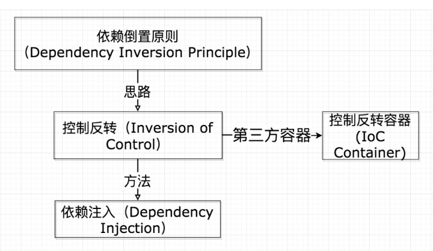
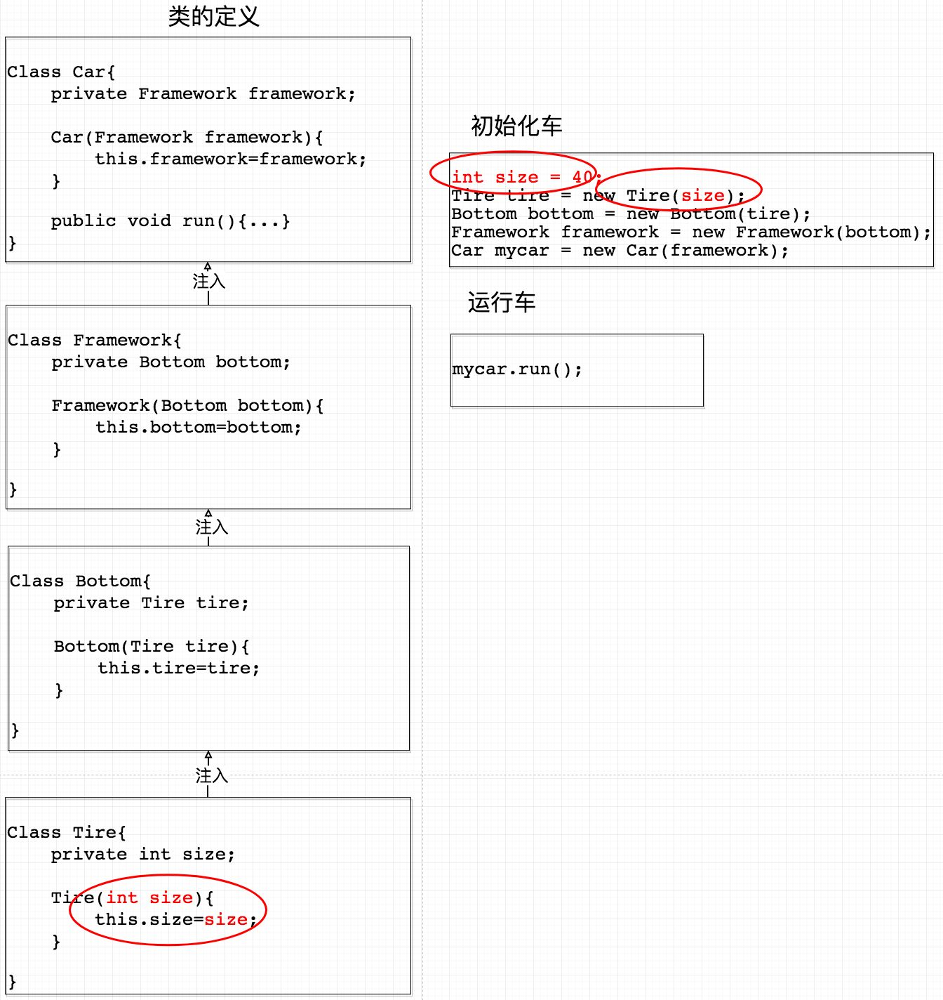
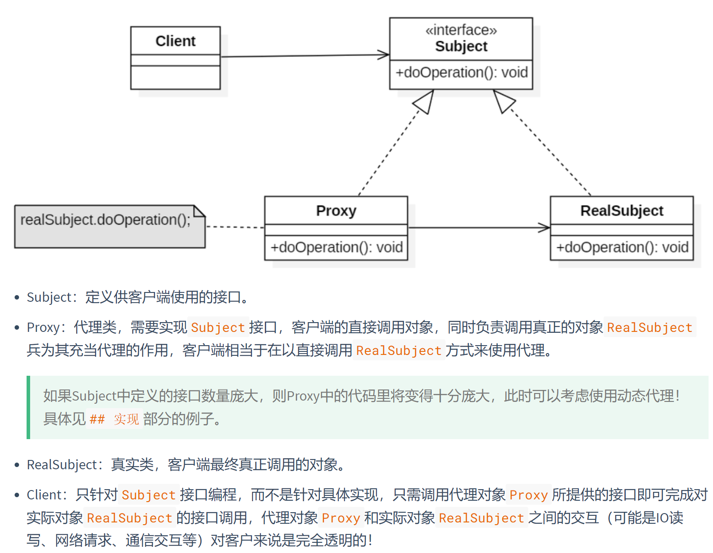
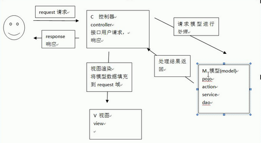

# Web框架相关

<!-- GFM-TOC -->

* [Web框架相关](#web框架相关)
   * [1 Spring框架](#1-spring框架)
      * [1.1 IoC是什么？有什么好处？](#11-ioc是什么有什么好处)
      * [1.2 AOP是什么？有什么好处？](#12-aop是什么有什么好处)
      * [1.3 Spring中的Bean是否线程安全？](#13-spring中的bean是否线程安全)
      * [1.4 Spring的事务隔离级别？](#14-spring的事务隔离级别)
      * [1.5 什么是SpringMVC](#15-什么是springmvc)
   * [2 SpringBoot框架](#2-springboot框架)
      * [2.1 SpringBoot和SpringMVC的区别？](#21-springboot和springmvc的区别)
      * [2.2 SpringBoot中使用什么注解将类放入IoC中进行管理？](#22-springboot中使用什么注解将类放入ioc中进行管理)
      * [2.3 <strong>Spring Boot 的自动配置是如何实现的？</strong>](#23-spring-boot-的自动配置是如何实现的)
   * [3 Mybatis框架](#3-mybatis框架)
      * [3.1 Mybatis的XML文件中${}和#{}的区别是什么？](#31-mybatis的xml文件中和的区别是什么)
   * [4 Netty框架](#4-netty框架)

<!-- Created by https://github.com/ekalinin/github-markdown-toc -->

## 1 Spring框架

### 1.1 IoC是什么？有什么好处？

**----------是什么------------**

IoC（Inverse of Control 控制反转）是一种**设计思想**，即将程序中需要手动创建的对象的控制权交由框架来进行管理，用户不需要关心具体的创建细节和依赖关系，只需要提供部分配置信息即可。具体过程如下所示：


如下图所示，IoC是**依赖倒置原则**的一种实现思路，而实现IoC的方法可以采用**依赖注入**（DI），IoC容器就是实现了IoC的一种容器。



> DI：依赖注入是指将类所依赖的其它类的对象通过**构造/setter方法**注入进来，而不是在当前类的内部new一个所依赖的对象。
>
> 如：**汽车**<——依赖-——**车身**<——依赖——**底盘**<——依赖——**轮胎**
>
> 采用DI的方式，当我们轮胎发生变化时，只需要修改轮胎类即可，不影响其他类的代码编写。
>
> 

上图中，初始化一辆车需要很多new代码，而IoC容器则可以帮助我们省去这个麻烦的过程，使得我们创建实例时并不需要了解他的细节，**只需要提供一定的XML或者注解配置**即可：

**-----------好处-----------**

- IOC容器可以自动完成对象的初始化，用户不需要编写大量复杂的初始化代码，只需要维护/提供一部分必要的配置信息即可。
- 用户在创建实例的时候可以不需要了解各个对象之间的依赖关系和具体的细节。

### 1.2 AOP是什么？有什么好处？

AOP(Aspect-Oriented Programming:面向切面编程)能够将那些与业务无关，**却为业务模块所共同调用的逻辑或责任（例如事务处理、日志管理、权限控制、统一全局异常处理等）封装起来**，便于**减少系统的重复代码**，**降低模块间的耦合度**，并有利于未来的可拓展性和可维护性。

> 就比如，在编写业务逻辑代码的时候，我们习惯性的都要写：日志记录，事物控制，以及权限控制等，每一个子模块都要写这些代码，代码明显存在重复。这时候，我们运用面向切面的编程思想，采用横切技术**，将代码中重复的部分，不影响主业务逻辑的部分抽取出来，放在某个地方进行集中式的管理，调用**。 形成日志切面，事物控制切面，权限控制切面。 这样，我们就只需要关心业务的逻辑处理，既提高了工作的效率，又使得代码变的简洁优雅。这就是面向切面的编程思想，它是面向对象编程思想的一种扩展。

Spring AOP是基于动态代理的：

- 如果要代理的对象**实现了某个接口**，那么Spring AOP会使用**JDK动态代理**来生成AOP代理类

  - 创建实现`InvocationHandler`接口的类，重写`bind()`和`invoke`方法，前者表示绑定所代理的对象（必须实现某个接口），表示调用所代理对象的方法（可以在这里做一些：方法调用权限控制、功能增强等操作）。

  - 客户端代码：

    ```java
    ProxyHandler proxy = new ProxyHandler();	// 创建动态代理对象, ProxyHandler impl InvocationHandler
    Subject subject = (Subject) proxy.bind(new RealSubject());	// 获取代理目标  RealSubject impl Subject
    subject.doOperation();	// 开始调用方法
    // subject.destroy();   // 无权调用，产生异常(在ProxyHandler的invoke方法中做了权限控制)
    ```

- 如果要代理的对象**没有实现接口**，那么Spring AOP会使用**Cglib**生成一个被代理对象的子类来作为代理类

使用 AOP 之后我们可以把一些**通用功能抽象**出来，在需要用到的地方直接使用即可，这样大大**简化了代码量**。我们需要增加新功能时也方便，这样也提高了系统扩展性。日志功能、事务管理等等场景都用到了 AOP 。

> **代理模式**
>
> 

### 1.3 Spring中的Bean是否线程安全？

Spring的Bean默认是单例的，所以是存在安全问题的。因为，当多个线程操作同一个对象的时候，对这个对象的成员变量的写操作会存在线程安全问题。

> 但是，一般情况下，我们常用的 `Controller`、`Service`、`Dao` 这些 Bean（分别用`@Controller`和`@Service`和`@Repository`进行注解） 是**无状态**的（没有成员变量）。无状态的 Bean 不能保存数据，因此是线程安全的。

常见的有 2 种解决办法：

1. 在类中定义一个 `ThreadLocal` 成员变量，将需要的可变成员变量保存在[ `ThreadLocal` ](https://www.jianshu.com/p/3c5d7f09dfbd)中（推荐的一种方式）。
2. 改变 Bean 的作用域为 “prototype”：每次请求都会创建一个新的 bean 实例，自然不会存在线程安全问题。

### 1.4 Spring的事务隔离级别？

Spring中的事务隔离采用ThreadLocal来实现的。

### 1.5 什么是SpringMVC

MVC（Model模型 View 视图 Controller 控制器）：这是一种软件架构思想，是一种开发模式，将软件划分为三种不同类型的模块，分别是模型，视图，和控制器。 

- **模型**：用于封装业务逻辑处理（java类）； 
- **视图**：用于数据展现和操作界面（Servlet）； 
- **控制器**：用于协调视图和模型（jsp）； 

处理流程：用户将请求发送给控制器，由控制器选择对应的模型来处理；模型将处理结果交给控制器，控制器选择合适的视图来展现/返回处理结果；



## 2 SpringBoot框架

将XML文件变成全部变成注解！避免了编写繁琐的XML语句。

### 2.1 SpringBoot和SpringMVC的区别？

Spring Boot 简化了Spring MVC配置，Spring MVC的作用就是开发web应用。

**spring boot 相比较mvc ：**

- spring boot自动配置的配置文件，无需我们在配置文件上面多花心思。

- spring boot 并不是spring基础上的扩展，只是使应用更简单

- spring boot 在第三方库配置实现了零配置，开箱机可用。

**spring boot 和mvc比较哪里变化：**

- 项目初始化有变化

- 配置文件有变化

- 不需要单独安装tomcat

### 2.2 SpringBoot中使用什么注解将类放入IoC中进行管理？

- 注册Bean：`@Component`、`@Repository`、`@Service`、`@Controller`、`@Configuration`注解一个类；使用`@Bean`注解一个方法。
- 使用Bean：`@Autowire`、`@Resource`。

### 2.3 **Spring Boot 的自动配置是如何实现的？**

Spring Boot 项目的启动注解是：`@SpringBootApplication`，其实它就是由下面三个注解组成的：

`@Configuration`

`@ComponentScan`

`@EnableAutoConfiguration`

其中`@EnableAutoConfiguration` 是实现自动配置的入口，该注解又通过 `@Import `注解导入了`AutoConfigurationImportSelector`，在该类中加载 META-INF/spring.factories 的配置信息。然后筛选出以 `EnableAutoConfiguration` 为 key 的数据，加载到 IOC 容器中，实现自动配置功能！

## 3 Mybatis框架

### 3.1 Mybatis的XML文件中`${}`和`#{}`的区别是什么？

https://blog.csdn.net/qq_44543508/article/details/97106696

https://blog.csdn.net/liangshui999/article/details/90258574?utm_medium=distribute.pc_relevant.none-task-blog-2%7Edefault%7EBlogCommendFromMachineLearnPai2%7Edefault-3.control&dist_request_id=&depth_1-utm_source=distribute.pc_relevant.none-task-blog-2%7Edefault%7EBlogCommendFromMachineLearnPai2%7Edefault-3.control

- `#{}`是 sql 的参数占位符，相当于 `jdbc`中的`?`符号，`#{}`将传入的数据都当成一个字符串，会对自动传入的数据加一个双引号。<font color="red">可以防止SQL注入！</font>如：`select * from user where id= #{user_id}`，如果传入的值是11,那么解析成sql时的值为`where id="11"` 。
- `${}`是属于静态文本替换，在`JDBC`不支持使用占位符的地方，就只能使用`${}`，典型情况就是动态参数。如：`select *  from emp_ ${year}`可以动态查询不同的`emp_xxx`表。

注意：

- 如果只有一个参数则`#{value}`中的参数名可以随意写，如果有多个则需要和Dao中的`@Param`中的参数名对应；`${value}`中的参数名不可以随意写。

- `#{}`可以<font color="blue">防止SQL注入问题</font>，如使用查询语句`select count(1) from tbl_user where id = #{id} and pwd = #{pwd}`，如果`pwd = #{pwd}`换成`pwd = ${pwd}`则当用户输入密码`pwd`为`"111 or 1 = 1"`，则SQL语句变成`select count(1) from tbl_user where id = 123 and pwd = 111 or 1 = 1`，条件将永远成立，用户可以直接登陆成功。

- 有时`${}`和`#{}`都可以实现同样的功能，如实现一个模糊查询：

  ```xml
  # java调用时使用queryUserByUsername("%" + name + "%");
  <select id="queryUserByUsername" parameterType="string"
          resultType="cn.itcast.mybatis.pojo.User">
      SELECT * FROM tbl_user WHERE username LIKE #{name}
  </select>
  
  # java调用时使用queryUserByUsername(name);
  <select id="queryUserByUsername" parameterType="string"
          resultType="cn.itcast.mybatis.pojo.User">
      SELECT * FROM tbl_user WHERE username LIKE '%${name}%'
  </select>
  
  # 最好的写法是------------------------------
  # java调用时使用queryUserByUsername(name);
  <select id="queryUserByUsername" parameterType="string"
          resultType="cn.itcast.mybatis.pojo.User">
      SELECT * FROM tbl_user WHERE username LIKE concat("%", #{name}, "%")
  </select>
  ```

## 4 Netty框架

以后再学吧！